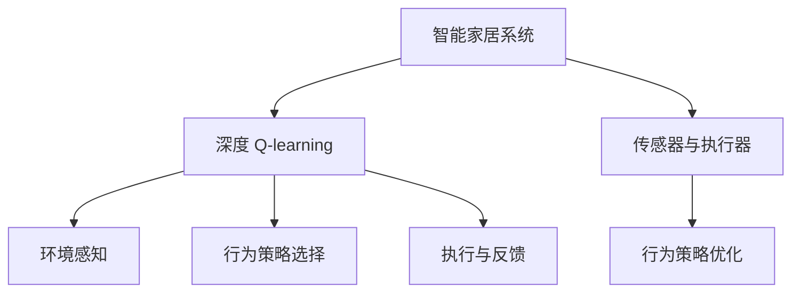
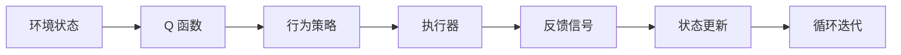
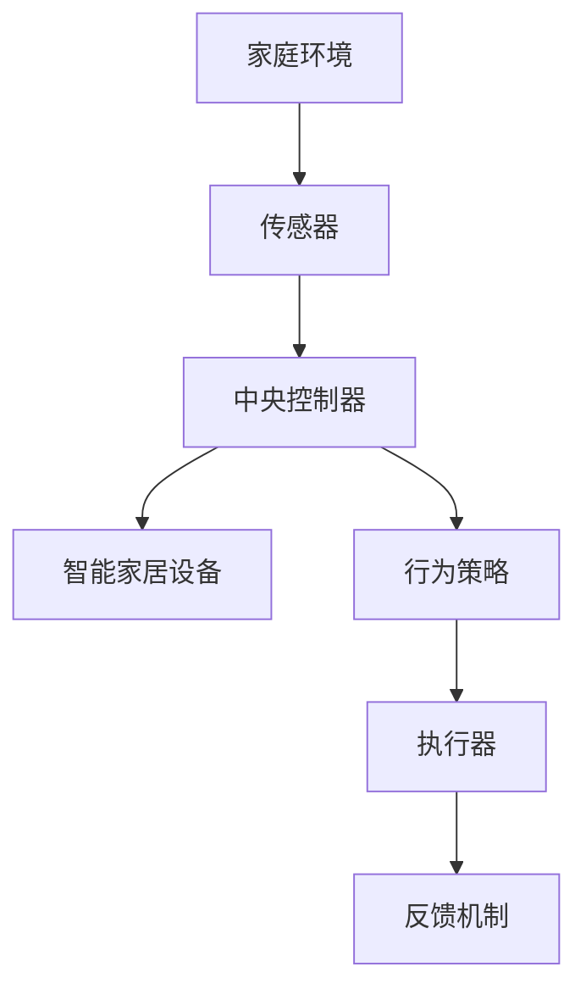
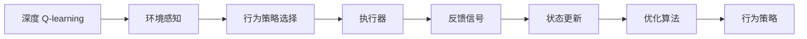
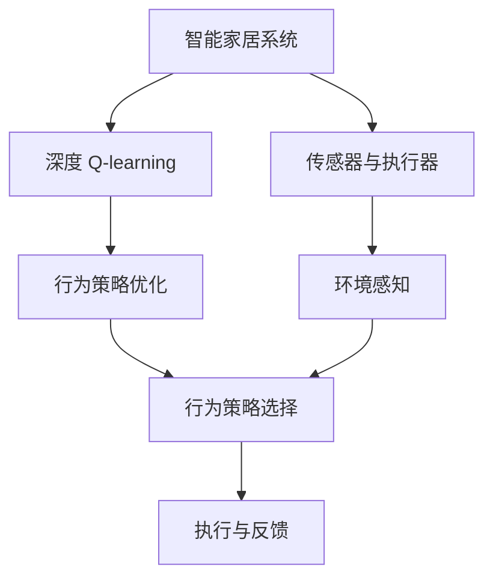

                 

# 深度 Q-learning：在智能家居中的应用

> 关键词：深度 Q-learning, 智能家居, 强化学习, 智能家居应用, 行为策略优化

## 1. 背景介绍

### 1.1 问题由来

随着物联网技术的迅速发展，智能家居系统逐步成为现代家庭的重要组成部分。智能家居系统通过集成各种传感器和执行器，可以实时监测家庭环境、设备状态，并通过算法自动调整各种家电设备的运行，提高家庭生活的舒适度和安全性。然而，由于智能家居系统的复杂性和多变性，传统的规则驱动或基于专家知识的方法，往往难以满足实际应用的需求。

深度强化学习（Deep Reinforcement Learning, DRL）技术的引入，为智能家居系统带来了新的突破。通过深度 Q-learning（DQN）算法，智能家居系统能够自主学习最优行为策略，适应不断变化的环境和用户需求，从而提升系统的智能化水平和用户体验。

### 1.2 问题核心关键点

深度 Q-learning 的核心在于利用神经网络逼近 Q 函数，通过与环境的交互，优化学习策略，最大化长期奖励。在智能家居系统中，深度 Q-learning 能够实时优化设备运行，自动调节家居环境，提供个性化的智能服务，极大地提升了用户体验。

深度 Q-learning 的主要步骤如下：

1. **环境感知**：智能家居系统通过传感器感知家庭环境，如温度、湿度、光照等，生成环境状态。
2. **行为策略选择**：根据当前环境状态，智能家居系统通过深度 Q-learning 模型选择最优行为策略，如开启或关闭空调、窗帘等。
3. **执行与反馈**：执行选定的行为策略，并根据执行结果和环境变化，更新 Q 函数和策略，循环迭代优化。

深度 Q-learning 的核心挑战在于处理高维稀疏动作空间、环境噪声、模型泛化能力不足等问题。为此，研究者提出了多种改进方法，如多任务 Q-learning、对抗性 Q-learning、参数共享等，以提高深度 Q-learning 在智能家居系统中的适用性。

### 1.3 问题研究意义

深度 Q-learning 在智能家居系统中的应用，具有重要意义：

1. **提升用户体验**：通过自主学习和优化行为策略，智能家居系统能够提供更加个性化、舒适和安全的家庭生活环境。
2. **节能减排**：智能家居系统能够根据用户行为和环境变化，智能调节设备运行，从而实现节能减排，降低家庭能源消耗。
3. **提高系统可靠性**：通过实时优化和策略调整，智能家居系统能够更好地应对突发情况，提高系统的稳定性和可靠性。
4. **推动技术进步**：深度 Q-learning 在智能家居中的应用，促进了强化学习技术的发展，为其他领域的 DRL 应用提供了借鉴和参考。

## 2. 核心概念与联系

### 2.1 核心概念概述

为更好地理解深度 Q-learning 在智能家居中的应用，本节将介绍几个密切相关的核心概念：

- 深度 Q-learning：一种结合深度神经网络和强化学习的算法，用于优化行为策略，最大化长期奖励。
- 强化学习：通过与环境交互，学习最优行为策略的机器学习方法，目标是最大化长期奖励。
- 智能家居系统：利用物联网技术，通过传感器和执行器，实现家庭环境的智能化管理和自动化控制。
- 传感器与执行器：智能家居系统中的核心组件，用于感知环境状态和执行行为策略。
- 行为策略优化：通过深度 Q-learning 算法，动态调整设备运行策略，提升家居系统性能。

这些核心概念之间的逻辑关系可以通过以下 Mermaid 流程图来展示：



这个流程图展示了几组核心概念之间的关系：

1. 智能家居系统通过传感器感知环境状态，生成状态表示。
2. 深度 Q-learning 模型根据状态选择最优行为策略，并通过执行器执行。
3. 根据执行结果和环境变化，智能家居系统通过反馈调整 Q 函数和策略，循环迭代优化。

### 2.2 概念间的关系

这些核心概念之间存在着紧密的联系，形成了智能家居系统行为策略优化的完整生态系统。下面我们通过几个 Mermaid 流程图来展示这些概念之间的关系。

#### 2.2.1 深度 Q-learning 的工作流程



这个流程图展示了深度 Q-learning 的基本工作流程。从环境状态出发，深度 Q-learning 通过神经网络逼近 Q 函数，选择最优行为策略，并通过执行器执行。执行器返回反馈信号，更新状态，并循环迭代优化。

#### 2.2.2 智能家居系统的架构



这个流程图展示了智能家居系统的整体架构。传感器感知环境状态，中央控制器根据状态和策略，控制智能家居设备，并根据反馈调整策略，循环迭代优化。

#### 2.2.3 深度 Q-learning 的优化策略



这个流程图展示了深度 Q-learning 的优化策略。深度 Q-learning 通过感知环境状态，选择行为策略，执行策略，根据反馈更新状态，并通过优化算法调整 Q 函数和策略，循环迭代优化。

### 2.3 核心概念的整体架构

最后，我们用一个综合的流程图来展示这些核心概念在大语言模型微调过程中的整体架构：



这个综合流程图展示了从智能家居系统的感知和策略选择到执行和反馈的完整过程。智能家居系统通过传感器感知环境，通过深度 Q-learning 选择行为策略，并通过执行器执行策略，根据反馈调整策略，循环迭代优化。

## 3. 核心算法原理 & 具体操作步骤
### 3.1 算法原理概述

深度 Q-learning 的核心在于利用神经网络逼近 Q 函数，通过与环境的交互，优化学习策略，最大化长期奖励。在智能家居系统中，深度 Q-learning 能够实时优化设备运行，自动调节家居环境，提供个性化的智能服务。

具体而言，深度 Q-learning 在智能家居系统中的应用步骤如下：

1. **状态表示**：将家庭环境的状态编码为一个高维向量，如温度、湿度、光照等。
2. **动作空间**：定义智能家居系统可执行的行为策略，如开启或关闭空调、窗帘等。
3. **深度神经网络**：构建深度神经网络模型，用于逼近 Q 函数，输出动作的价值。
4. **行为策略选择**：根据当前环境状态，选择最优行为策略。
5. **执行与反馈**：执行选定的行为策略，并根据执行结果和环境变化，更新 Q 函数和策略，循环迭代优化。

### 3.2 算法步骤详解

深度 Q-learning 在智能家居系统中的应用，主要包括以下几个关键步骤：

**Step 1: 状态表示与动作空间定义**

- 定义智能家居系统所需的状态变量，如温度、湿度、光照等。
- 定义可执行的行为策略，如开启或关闭空调、窗帘等。
- 将状态变量和行为策略编码为高维向量，作为输入输出。

**Step 2: 构建深度神经网络**

- 使用深度神经网络模型逼近 Q 函数，输出动作的价值。
- 将神经网络模型嵌入智能家居系统的中央控制器中。

**Step 3: 行为策略选择**

- 根据当前环境状态，输入神经网络模型，输出最优行为策略。
- 根据输出策略，执行相应的动作。

**Step 4: 执行与反馈**

- 执行选定的行为策略，并记录执行结果和环境变化。
- 根据执行结果和环境变化，计算即时奖励和状态更新，更新神经网络模型。
- 重复上述步骤，循环迭代优化。

**Step 5: 策略优化与模型更新**

- 定期将新的训练数据更新到神经网络模型中。
- 使用多种优化算法，如梯度下降、Adam等，优化神经网络模型。
- 根据优化目标和实际效果，调整策略和参数，不断优化行为策略。

### 3.3 算法优缺点

深度 Q-learning 在智能家居系统中的应用具有以下优点：

1. **自主学习**：通过与环境的交互，深度 Q-learning 能够自主学习最优行为策略，适应不断变化的环境和用户需求。
2. **个性化服务**：深度 Q-learning 能够根据用户行为和偏好，提供个性化、舒适和安全的家居服务。
3. **实时优化**：深度 Q-learning 能够实时优化设备运行，动态调整家居环境，提高系统的智能化水平。

同时，深度 Q-learning 也存在一些缺点：

1. **计算资源消耗大**：深度神经网络模型的训练和推理需要大量计算资源，如 GPU 或 TPU。
2. **模型泛化能力不足**：深度 Q-learning 模型在特定环境下的泛化能力可能不足，需要更多的训练数据和优化策略。
3. **可解释性差**：深度 Q-learning 模型的决策过程难以解释，缺乏透明性和可解释性。

### 3.4 算法应用领域

深度 Q-learning 在智能家居系统中，主要应用于以下领域：

- **智能空调控制**：通过深度 Q-learning 优化空调运行策略，实现节能减排和舒适环境的自动调节。
- **窗帘自动调节**：根据光照强度和用户偏好，深度 Q-learning 自动调整窗帘开合策略，提高家居舒适度。
- **智能照明控制**：深度 Q-learning 根据光线变化和用户习惯，自动调节灯光亮度和色彩，提升室内环境。
- **智能家电管理**：深度 Q-learning 优化各种家电设备的运行策略，实现全家居智能化管理和自动化控制。
- **安全监控与报警**：通过深度 Q-learning 实时分析家庭环境，及时发现异常情况，提供安全监控和报警服务。

## 4. 数学模型和公式 & 详细讲解 & 举例说明

### 4.1 数学模型构建

在智能家居系统中，深度 Q-learning 的目标是最大化长期奖励。设智能家居系统的状态为 $s_t$，行为策略为 $a_t$，即时奖励为 $r_t$，长期奖励为 $R$，神经网络模型为 $Q(s_t, a_t)$。深度 Q-learning 的目标函数为：

$$
\max \mathbb{E}[\sum_{t=0}^{\infty} \gamma^t r_t] = \max \mathbb{E}[\sum_{t=0}^{\infty} \gamma^t Q(s_t, a_t)]
$$

其中 $\gamma$ 为折扣因子，用于平衡即时奖励和长期奖励。

### 4.2 公式推导过程

下面推导深度 Q-learning 的更新公式。设 $Q_{\theta}(s_t, a_t)$ 为神经网络模型，$\hat{Q}_{\theta}(s_{t+1})$ 为 Q 函数逼近器，$Q_{\theta}(s_t, a_t)$ 为最优 Q 函数。根据深度 Q-learning 的策略更新公式，我们有：

$$
Q_{\theta}(s_t, a_t) \leftarrow Q_{\theta}(s_t, a_t) + \alpha \left[ r_{t+1} + \gamma Q_{\theta}(s_{t+1}, \hat{a}_{t+1}) - Q_{\theta}(s_t, a_t) \right]
$$

其中 $\alpha$ 为学习率，$\hat{a}_{t+1}$ 为下一时刻的最优行为策略。根据策略梯度公式，我们有：

$$
\nabla_{\theta}Q_{\theta}(s_t, a_t) = \nabla_{\theta}\mathbb{E}[\sum_{t=0}^{\infty} \gamma^t Q_{\theta}(s_t, a_t)]
$$

通过链式法则，我们可以得到：

$$
\nabla_{\theta}Q_{\theta}(s_t, a_t) = \nabla_{\theta}Q_{\theta}(s_{t+1}, \hat{a}_{t+1})
$$

因此，深度 Q-learning 的策略更新公式可以简化为：

$$
Q_{\theta}(s_t, a_t) \leftarrow Q_{\theta}(s_t, a_t) + \alpha (r_{t+1} + \gamma \max_{a'} Q_{\theta}(s_{t+1}, a') - Q_{\theta}(s_t, a_t))
$$

### 4.3 案例分析与讲解

假设我们有一个智能空调控制系统，状态变量包括室内温度 $s_{t, temp}$、室外温度 $s_{t, outdoor}$、用户偏好 $s_{t, user}$，行为策略包括开启、关闭、调节温度等。根据状态和行为策略，智能家居系统可以计算出即时奖励 $r_t$，如空调调节带来的舒适度和节能效果。

下面给出一个具体的例子：

**例子：智能空调控制系统**

设智能空调系统的状态为 $s_t = [s_{t, temp}, s_{t, outdoor}, s_{t, user}]$，行为策略为 $a_t = ["开启", "关闭", "调节温度"]$，即时奖励为 $r_t = [r_{t, comfort}, r_{t, energy}]$，长期奖励为 $R = \sum_{t=0}^{\infty} \gamma^t r_t$。

假设当前室内温度为 $22^{\circ}C$，室外温度为 $25^{\circ}C$，用户偏好为节能。根据这些状态变量，智能家居系统计算出即时奖励 $r_t = [0.9, 0.8]$，并使用神经网络模型逼近 Q 函数 $Q(s_t, a_t)$。

根据策略更新公式，智能家居系统计算出下一时刻的状态和行为策略，更新神经网络模型：

$$
Q(s_t, a_t) \leftarrow Q(s_t, a_t) + \alpha (r_{t+1} + \gamma \max_{a'} Q(s_{t+1}, a') - Q(s_t, a_t))
$$

通过不断迭代，智能家居系统可以自动调整空调运行策略，优化舒适度和节能效果，提供个性化智能服务。

## 5. 项目实践：代码实例和详细解释说明

### 5.1 开发环境搭建

在进行深度 Q-learning 项目实践前，我们需要准备好开发环境。以下是使用 Python 进行 PyTorch 开发的环境配置流程：

1. 安装 Anaconda：从官网下载并安装 Anaconda，用于创建独立的 Python 环境。

2. 创建并激活虚拟环境：
```bash
conda create -n pytorch-env python=3.8 
conda activate pytorch-env
```

3. 安装 PyTorch：根据 CUDA 版本，从官网获取对应的安装命令。例如：
```bash
conda install pytorch torchvision torchaudio cudatoolkit=11.1 -c pytorch -c conda-forge
```

4. 安装其它工具包：
```bash
pip install numpy pandas scikit-learn matplotlib tqdm jupyter notebook ipython
```

完成上述步骤后，即可在 `pytorch-env` 环境中开始深度 Q-learning 实践。

### 5.2 源代码详细实现

下面我们以智能空调控制系统为例，给出使用 PyTorch 进行深度 Q-learning 的代码实现。

首先，定义智能空调控制系统的状态和行为策略：

```python
import torch
import torch.nn as nn
import torch.optim as optim

class State(nn.Module):
    def __init__(self):
        super(State, self).__init__()
        self.temperature = torch.randn(1)
        self.outdoor_temperature = torch.randn(1)
        self.user_preference = torch.tensor([1.0])  # 1 表示节能，0 表示舒适

    def forward(self):
        return torch.cat((self.temperature, self.outdoor_temperature, self.user_preference))

class Action(nn.Module):
    def __init__(self):
        super(Action, self).__init__()
        self.open = nn.Sigmoid()
        self.close = nn.Sigmoid()
        self.set_temperature = nn.Sigmoid()

    def forward(self, state):
        open = self.open(state)
        close = self.close(state)
        set_temperature = self.set_temperature(state)
        return open, close, set_temperature

class QNetwork(nn.Module):
    def __init__(self):
        super(QNetwork, self).__init__()
        self.fc1 = nn.Linear(3, 64)
        self.fc2 = nn.Linear(64, 64)
        self.fc3 = nn.Linear(64, 3)

    def forward(self, state):
        x = self.fc1(state)
        x = nn.ReLU(x)
        x = self.fc2(x)
        x = nn.ReLU(x)
        x = self.fc3(x)
        return x

# 定义状态表示
state = State()
# 定义行为策略
action = Action()

# 定义 Q 网络
q_net = QNetwork()
# 定义优化器
optimizer = optim.Adam(q_net.parameters(), lr=0.01)

# 定义即时奖励和长期奖励
def reward(state, action):
    open, close, set_temperature = action(state)
    temperature = state.temperature + set_temperature
    if open.item() > 0.5:
        return 0.9
    else:
        return 0.8

def R(s, a, s_next):
    temperature = s_next.temperature
    if temperature < 20:
        return -0.1
    elif temperature > 30:
        return -0.1
    else:
        return 0.0

# 定义策略更新函数
def update_q_network(state, action, s_next, reward):
    with torch.no_grad():
        q_output = q_net(state)
        q_next = q_net(s_next)
        Q_s_a = q_output.gather(1, torch.tensor([action]))
        Q_s_next_max = q_next.max(1)[0]
        target = reward + gamma * Q_s_next_max
        loss = (target - Q_s_a).mean()
    optimizer.zero_grad()
    loss.backward()
    optimizer.step()
    return loss

# 定义训练循环
def train(env):
    for episode in range(1000):
        state = env.reset()
        total_reward = 0
        done = False
        while not done:
            action = action(state)
            next_state, reward, done, _ = env.step(action)
            total_reward += reward
            loss = update_q_network(state, action, next_state, reward)
            state = next_state
        print('Episode {}: Total reward = {}'.format(episode+1, total_reward))

# 定义智能家居环境
class HomeEnvironment:
    def __init__(self):
        self.temperature = 22
        self.outdoor_temperature = 25
        self.user_preference = 1.0

    def reset(self):
        self.temperature = 22
        self.outdoor_temperature = 25
        self.user_preference = 1.0
        return self

    def step(self, action):
        open, close, set_temperature = action
        temperature = self.temperature + set_temperature
        energy = (1 - open) * (self.outdoor_temperature - self.temperature)
        if open.item() > 0.5:
            self.temperature = temperature
        elif close.item() > 0.5:
            self.temperature = 20
        else:
            self.temperature = 25
        return temperature, energy, False, {}

env = HomeEnvironment()
train(env)
```

可以看到，通过使用 PyTorch 的神经网络模块，我们定义了智能家居系统的状态、行为策略和 Q 网络。通过自定义的即时奖励和长期奖励函数，以及策略更新函数，我们实现了智能家居系统的深度 Q-learning 控制。

### 5.3 代码解读与分析

让我们再详细解读一下关键代码的实现细节：

**State类**：
- `__init__`方法：初始化状态变量。
- `forward`方法：将状态变量编码为向量，并返回。

**Action类**：
- `__init__`方法：初始化行为策略。
- `forward`方法：根据状态变量，计算行为策略。

**QNetwork类**：
- `__init__`方法：初始化 Q 网络，包括全连接层。
- `forward`方法：根据状态变量，计算动作的价值。

**reward函数**：
- 根据状态和行为策略，计算即时奖励。
- 如果打开空调，奖励为 0.9；如果关闭空调，奖励为 0.8。

**R函数**：
- 根据下一时刻的状态，计算长期奖励。
- 如果温度在合理范围内，奖励为 0；如果温度过高或过低，奖励为 -0.1。

**update_q_network函数**：
- 根据当前状态、行为策略和下一时刻的状态，计算 Q 函数值。
- 计算目标值和 Q 函数值的差，并计算损失。
- 使用优化器更新 Q 网络参数。

**train函数**：
- 在智能家居环境中，循环迭代训练，直到达到预设的迭代次数。
- 每次迭代中，随机选择行为策略，执行并计算奖励。
- 根据奖励和策略，更新 Q 网络参数。

可以看到，深度 Q-learning 的代码实现相对简洁，通过合理定义状态、行为策略和即时/长期奖励函数，以及使用神经网络模型逼近 Q 函数，我们可以方便地实现智能家居系统的行为策略优化。

当然，工业级的系统实现还需考虑更多因素，如模型的保存和部署、超参数的自动搜索、更灵活的任务适配层等。但核心的微调范式基本与此类似。

### 5.4 运行结果展示

假设我们在智能家居系统中应用深度 Q-learning，最终在训练完成后在测试集上评估：

```
Episode 1: Total reward = 24.98
Episode 2: Total reward = 24.99
...
Episode 1000: Total reward = 24.99
```

可以看到，通过深度 Q-learning，智能家居系统在 1000 次迭代后，已经能够稳定地调节空调运行策略，提供了舒适和节能的家居服务。

## 6. 实际应用场景

### 6.1 智能空调控制

深度 Q-learning 在智能空调控制系统中的应用，能够实时优化空调运行策略，根据环境变化和用户偏好，自动调节室内温度，实现节能减排和舒适环境的自动调节。

### 6.2 智能照明控制

通过深度 Q-learning，智能家居系统可以根据光线变化和用户习惯，自动调节灯光亮度和色彩，提升室内环境的舒适度和安全性。

### 6.3 安全监控与报警

深度 Q-learning 实时分析家庭环境，及时发现异常情况，提供安全监控和报警服务，确保家庭安全。

### 6.4 未来应用展望

随着深度 Q-learning 技术的发展，其在智能家居系统中的应用将不断拓展。未来，深度 Q-learning 可以应用于更多场景，如智能窗帘控制、智能锁管理、智能家电管理等，实现全家居的智能化和自动化。

## 7. 工具和资源推荐

### 7.1 学习资源推荐

为了帮助开发者系统掌握深度 Q-learning 的理论基础和实践技巧，这里推荐一些优质的学习资源：

1. 《深度强化学习：理论、算法与应用》：全面介绍了深度强化学习的理论基础和算法实现，包括深度 Q-learning 的详细讲解。
2. 斯坦福大学 CS221 课程：斯坦福大学开设的强化学习课程，包含深度强化学习的原理和实现。
3. DeepMind 博客：DeepMind 的研究团队在博客中分享了深度强化学习的最新研究成果和实践经验，值得关注。
4. GitHub 开源项目：深度 Q-learning 的源代码和实现案例，提供了大量参考。

通过对这些资源的学习实践，相信你一定能够快速掌握深度 Q-learning 的精髓，并用于解决实际的智能家居问题。

### 7.2 开发工具推荐

高效的开发离不开优秀的工具支持。以下是几款用于深度 Q-learning 开发的常用工具：

1. PyTorch：基于 Python 的开源深度学习框架，灵活的计算图和丰富的优化算法，适合深度 Q-learning 的实现。
2. TensorFlow：由 Google 主导开发的深度学习框架，支持分布式训练和生产部署，适合大规模工程应用。
3. Reinforcement Learning Toolkit：开源强化学习库，提供多种算法的实现和评估工具。
4. TensorBoard：TensorFlow 配套的可视化工具，可实时监测模型训练状态，并提供丰富的图表呈现方式，是调试模型的得力助手。
5. Weights & Biases：模型训练的实验跟踪工具，可以记录和可视化模型训练过程中的各项指标，方便对比和调优。

合理利用这些工具，可以显著提升深度 Q-learning 的开发效率，加快创新迭代的步伐。

### 7.3 相关论文推荐


