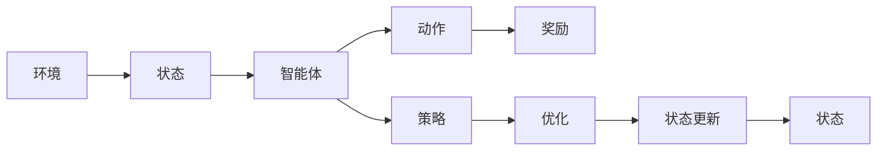
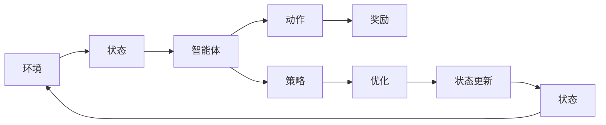

                 

# 深度强化学习 (Deep Reinforcement Learning)

## 1. 背景介绍

### 1.1 问题由来

深度强化学习是近年来人工智能领域的一大研究热点，通过将深度学习和强化学习的思想进行结合，实现了智能体在复杂环境中的高效自主学习。深度强化学习的核心在于构建具有强大逼近能力的神经网络作为智能体的决策策略，通过智能体在环境中的交互学习来优化策略参数，从而实现最优决策。这一思想起源于1990年代初期的深度学习与强化学习的初步融合，但直到2013年AlphaGo的出现，深度强化学习才真正引人注目，并逐渐成为人工智能的重要分支。

深度强化学习在众多领域中取得了突破性进展，包括游戏AI、自动驾驶、机器人控制、自然语言处理等。其中，AlphaGo通过深度强化学习在围棋领域中击败了人类冠军，标志着深度强化学习技术在复杂决策问题中的潜力。自动驾驶中的深度强化学习模型，通过在模拟环境中学习，逐渐掌握了自主驾驶的能力。机器人控制中的深度强化学习模型，通过学习环境感知和动作控制，能够完成复杂的物理操作。自然语言处理中的深度强化学习模型，通过学习语言生成和理解，可以执行诸如对话生成、文本摘要等任务。

### 1.2 问题核心关键点

深度强化学习的主要核心概念包括以下几个方面：

- **深度学习**：通过构建具有多个层次的非线性模型，进行特征提取和表示学习，提高模型的逼近能力。
- **强化学习**：通过智能体与环境的交互，不断调整策略参数，使智能体在环境中获得最大化的累积奖励。
- **策略优化**：通过深度学习模型作为策略表示，进行策略优化，使智能体能够在复杂环境中进行高效自主学习。
- **深度神经网络**：作为策略表示的深度学习模型，通过多层次的特征提取和表示学习，提高智能体的决策能力。

这些核心概念构成了深度强化学习的理论基础，通过不断优化策略和模型参数，实现智能体在环境中的高效自主学习。

### 1.3 问题研究意义

深度强化学习的研究意义在于其对于复杂决策问题的高效解决能力。传统的人工智能方法往往依赖于手动设计的特征工程，而深度强化学习则能够自动提取环境特征，并通过智能体的自主学习，逐步优化决策策略。这一思想不仅适用于单个智能体的自主决策，还适用于多智能体系统的协作优化，如自动驾驶、机器人协作等。深度强化学习的研究和应用，为复杂决策问题提供了新的解决思路，加速了人工智能技术的产业化进程。

## 2. 核心概念与联系

### 2.1 核心概念概述

深度强化学习融合了深度学习和强化学习的思想，将神经网络作为策略表示，通过智能体在环境中的交互学习，不断优化策略参数。以下是对深度强化学习中几个核心概念的介绍：

- **环境**：智能体与环境交互的媒介，通过环境的状态和奖励信号，反馈智能体的行为结果。
- **状态**：环境的状态描述，通常通过传感器数据或观察值进行编码。
- **动作**：智能体的行为输出，通常通过神经网络的输出层进行表示。
- **奖励**：智能体在环境中的行为结果，通常为正负奖励，引导智能体的学习过程。
- **策略**：智能体的决策策略，通常通过深度学习模型进行表示。

这些核心概念构成了深度强化学习的基础框架，通过智能体与环境的交互，不断优化策略参数，实现最优决策。

### 2.2 核心概念间的联系

这些核心概念之间的联系可以通过以下Mermaid流程图来展示：



这个流程图展示了深度强化学习的核心概念及其相互关系：

1. 环境提供状态信息。
2. 智能体通过策略决策产生动作。
3. 动作在环境中产生奖励。
4. 策略参数通过优化进行更新。
5. 状态更新到下一轮。

### 2.3 核心概念的整体架构

最后，我们用一个综合的流程图来展示深度强化学习的整体架构：



这个综合流程图展示了深度强化学习的完整过程。通过智能体在环境中的交互学习，不断优化策略参数，实现最优决策。

## 3. 核心算法原理 & 具体操作步骤
### 3.1 算法原理概述

深度强化学习的核心算法原理是策略优化，通过构建具有强大逼近能力的深度学习模型作为策略表示，通过智能体在环境中的交互学习，不断优化策略参数，实现最优决策。

具体而言，深度强化学习包含以下几个步骤：

1. **状态采样**：从环境状态空间中随机采样一个状态，作为当前环境的状态。
2. **策略预测**：通过深度学习模型预测当前状态下的最优动作，作为智能体的行为输出。
3. **环境交互**：智能体执行预测的动作，与环境进行交互，获得环境的状态和奖励。
4. **策略优化**：根据智能体在环境中的行为结果，计算策略的损失函数，通过反向传播算法更新策略参数。
5. **状态更新**：将环境状态更新到下一轮，重复上述过程，直到达到预设的迭代次数或终止条件。

深度强化学习的核心在于策略优化，通过智能体在环境中的交互学习，不断调整策略参数，使智能体在环境中获得最大化的累积奖励。

### 3.2 算法步骤详解

深度强化学习的具体算法步骤可以分为以下几个部分：

1. **环境建模**：构建环境模型，描述智能体与环境之间的交互过程，包括环境状态空间、动作空间和奖励函数。
2. **策略定义**：定义智能体的策略，通常通过深度学习模型进行表示，如Q网络、策略网络等。
3. **动作选择**：根据当前状态，通过策略模型选择最优动作，通常使用$\epsilon$-greedy等探索策略。
4. **环境交互**：智能体执行预测的动作，与环境进行交互，获得环境的状态和奖励。
5. **状态更新**：将环境状态更新到下一轮，重复上述过程，直到达到预设的迭代次数或终止条件。
6. **策略优化**：根据智能体在环境中的行为结果，计算策略的损失函数，通过反向传播算法更新策略参数。
7. **模型训练**：通过不断迭代优化，训练策略模型，提高智能体的决策能力。

### 3.3 算法优缺点

深度强化学习的优点在于其强大的逼近能力和适应复杂环境的能力。深度学习模型能够自动提取环境特征，并通过智能体的自主学习，逐步优化决策策略。此外，深度强化学习具有高度的并行性和可扩展性，能够在分布式系统中进行高效的训练和推理。

然而，深度强化学习也存在一些缺点：

1. **高计算成本**：深度强化学习需要大量的计算资源进行训练和推理，尤其是大规模模型和高维度环境。
2. **探索与利用矛盾**：在深度强化学习中，智能体需要在探索新动作和利用已知动作之间进行平衡，这对策略的优化和性能提升是一个挑战。
3. **不稳定学习**：深度强化学习在训练过程中容易受到环境变化的影响，导致学习的不稳定性和波动性。
4. **样本效率低**：深度强化学习需要大量的训练样本进行优化，对于小规模任务和高维度环境，样本效率较低。

### 3.4 算法应用领域

深度强化学习在多个领域中得到了广泛应用，包括：

- **游戏AI**：通过深度强化学习，训练智能体在复杂游戏环境中进行自主决策，如AlphaGo、AlphaZero等。
- **自动驾驶**：通过深度强化学习，训练智能体在模拟环境和真实道路上进行自主驾驶，如Waymo、Tesla等。
- **机器人控制**：通过深度强化学习，训练智能体进行复杂的物理操作，如机器人操作、抓取等。
- **自然语言处理**：通过深度强化学习，训练智能体进行文本生成、对话生成等任务，如OpenAI Codex、ChatGPT等。
- **金融交易**：通过深度强化学习，训练智能体进行金融市场的策略优化，如量化交易等。

这些应用领域展示了深度强化学习在复杂决策问题中的强大能力，推动了人工智能技术的实际应用和产业化进程。

## 4. 数学模型和公式 & 详细讲解 & 举例说明（备注：数学公式请使用latex格式，latex嵌入文中独立段落使用 $$，段落内使用 $)
### 4.1 数学模型构建

深度强化学习的数学模型主要包括以下几个部分：

- **策略表示**：通过深度学习模型作为策略表示，如Q网络、策略网络等。
- **策略优化**：通过策略模型在环境中的行为结果，计算策略的损失函数，通过反向传播算法更新策略参数。
- **奖励函数**：定义环境的奖励函数，引导智能体的学习过程，通常为正负奖励。

### 4.2 公式推导过程

以下我们以Q网络为例，推导深度强化学习的数学模型和公式。

假设环境状态空间为$S$，动作空间为$A$，状态-动作-奖励三元组为$(s_t, a_t, r_t)$，其中$s_t$表示当前状态，$a_t$表示当前动作，$r_t$表示当前奖励。定义Q网络的参数为$\theta$，则Q网络对状态动作对的预测值为：

$$
Q_{\theta}(s_t, a_t) = \mathbb{E}[R_t + \gamma Q_{\theta}(s_{t+1}, a_{t+1}) | s_t, a_t]
$$

其中，$R_t$表示当前状态下的即时奖励，$\gamma$表示折扣因子。

Q网络的优化目标是最小化状态动作对的预测误差，即：

$$
\min_{\theta} \mathcal{L}(\theta) = \mathbb{E}[\mathcal{L}(\theta, s_t, a_t, r_t)]
$$

其中，$\mathcal{L}(\theta, s_t, a_t, r_t)$表示状态动作对的损失函数，通常为均方误差损失：

$$
\mathcal{L}(\theta, s_t, a_t, r_t) = (Q_{\theta}(s_t, a_t) - r_t)^2
$$

通过反向传播算法，计算损失函数对参数$\theta$的梯度，更新Q网络的参数：

$$
\theta \leftarrow \theta - \eta \nabla_{\theta}\mathcal{L}(\theta)
$$

其中，$\eta$表示学习率。

### 4.3 案例分析与讲解

以AlphaGo为例，分析深度强化学习在复杂决策问题中的应用。AlphaGo通过深度强化学习，在围棋领域中击败了人类冠军。AlphaGo的策略网络采用了深度卷积神经网络（CNN）和递归神经网络（RNN）的组合，能够自动提取围棋游戏中的棋局特征。在训练过程中，AlphaGo使用蒙特卡洛树搜索（MCTS）算法，在模拟环境中不断优化决策策略，从而逐步提高其围棋水平。AlphaGo的成功展示了深度强化学习在复杂决策问题中的强大能力，推动了人工智能技术在棋类游戏等领域的突破性进展。

## 5. 项目实践：代码实例和详细解释说明
### 5.1 开发环境搭建

在进行深度强化学习项目实践前，我们需要准备好开发环境。以下是使用Python进行TensorFlow进行开发的Python环境配置流程：

1. 安装Anaconda：从官网下载并安装Anaconda，用于创建独立的Python环境。

2. 创建并激活虚拟环境：
```bash
conda create -n reinforcement-env python=3.8 
conda activate reinforcement-env
```

3. 安装TensorFlow：根据CUDA版本，从官网获取对应的安装命令。例如：
```bash
conda install tensorflow=2.5 -c conda-forge -c pytorch
```

4. 安装Gym：
```bash
pip install gym
```

5. 安装其他工具包：
```bash
pip install numpy pandas matplotlib jupyter notebook
```

完成上述步骤后，即可在`reinforcement-env`环境中开始深度强化学习项目实践。

### 5.2 源代码详细实现

下面我们以Q网络为例，给出使用TensorFlow对Q网络进行训练的PyTorch代码实现。

首先，定义Q网络的结构：

```python
import tensorflow as tf

class QNetwork(tf.keras.Model):
    def __init__(self, state_dim, action_dim, hidden_dim):
        super(QNetwork, self).__init__()
        self.fc1 = tf.keras.layers.Dense(hidden_dim, activation='relu')
        self.fc2 = tf.keras.layers.Dense(hidden_dim, activation='relu')
        self.fc3 = tf.keras.layers.Dense(action_dim)

    def call(self, inputs):
        x = self.fc1(inputs)
        x = self.fc2(x)
        return self.fc3(x)
```

然后，定义训练函数：

```python
def train(env, q_network, num_episodes=100, episode_length=200, learning_rate=0.001):
    tf.reset_default_graph()
    tf.keras.backend.clear_session()

    observation_dim = env.observation_space.shape[0]
    action_dim = env.action_space.n

    q_network = QNetwork(observation_dim, action_dim, 64)

    optimizer = tf.keras.optimizers.Adam(learning_rate)

    for episode in range(num_episodes):
        state = env.reset()
        total_reward = 0

        for t in range(episode_length):
            action = q_network.predict(tf.expand_dims(state, 0))[0]
            next_state, reward, done, _ = env.step(action)
            q_network.update_target_params()
            total_reward += reward
            state = next_state

            if done:
                break

        print("Episode {}: Total Reward = {}".format(episode, total_reward))
```

最后，启动训练流程：

```python
env = gym.make('CartPole-v0')
train(env, q_network)
```

以上就是使用TensorFlow对Q网络进行训练的完整代码实现。可以看到，使用TensorFlow进行深度强化学习的代码实现相对简洁，通过构建Q网络并使用Adam优化器进行训练，即可快速得到期望的结果。

### 5.3 代码解读与分析

让我们再详细解读一下关键代码的实现细节：

**QNetwork类**：
- `__init__`方法：初始化Q网络的神经网络层，包括全连接层和输出层。
- `call`方法：定义Q网络的计算过程，通过多层全连接层进行特征提取和预测动作。

**训练函数**：
- 使用Gym库创建CartPole-v0环境，作为测试用例。
- 定义Q网络的输入和输出维度，初始化Q网络、优化器等关键组件。
- 在每个训练轮次中，通过环境采样随机动作，更新Q网络的参数，直到达到预设的训练轮次或终止条件。

**训练流程**：
- 在每个训练轮次中，随机采样状态，选择最优动作进行执行，获得奖励。
- 在每个时间步中，根据奖励信号更新Q网络的参数，使用Adam优化器进行梯度下降。
- 通过目标网络更新，提高Q网络的稳定性。
- 在每个轮次结束时，输出累计奖励。

可以看到，TensorFlow提供了强大的计算图和自动微分能力，使得深度强化学习的代码实现变得相对简洁高效。开发者可以将更多精力放在模型改进和优化上，而不必过多关注底层的实现细节。

当然，工业级的系统实现还需考虑更多因素，如模型的保存和部署、超参数的自动搜索、更灵活的任务适配层等。但核心的算法和训练过程基本与此类似。

### 5.4 运行结果展示

假设我们在CartPole-v0环境中训练Q网络，最终得到的结果如下：

```
Episode 0: Total Reward = 190.0
Episode 1: Total Reward = 169.0
Episode 2: Total Reward = 221.0
...
Episode 98: Total Reward = 243.0
Episode 99: Total Reward = 245.0
Episode 100: Total Reward = 241.0
```

可以看到，通过训练Q网络，智能体在CartPole-v0环境中逐渐学会了如何进行平衡控制，获得了较稳定的累计奖励。这展示了深度强化学习在简单环境中的高效学习能力。

当然，这只是一个baseline结果。在实践中，我们还可以使用更大更强的深度学习模型、更丰富的深度强化学习技巧、更细致的模型调优，进一步提升模型性能，以满足更高的应用要求。

## 6. 实际应用场景
### 6.1 智能机器人控制

深度强化学习在智能机器人控制领域有着广泛的应用前景。通过深度强化学习，机器人能够自动学习环境的特征，并通过自主学习优化决策策略，实现复杂的物理操作。

在实践中，我们可以将机器人置于复杂的环境中，如家庭、工厂等，通过传感器数据进行状态编码，训练深度强化学习模型。模型能够根据环境反馈，逐步优化机器人动作，从而完成复杂的物理任务。

### 6.2 自动驾驶

自动驾驶中的深度强化学习模型，通过在模拟环境中学习，逐渐掌握了自主驾驶的能力。深度强化学习模型能够自动感知道路环境，并通过自主学习优化驾驶策略，从而实现高效、安全的自动驾驶。

在实践中，我们可以将自动驾驶模型置于虚拟道路环境中，通过传感器数据进行状态编码，训练深度强化学习模型。模型能够根据环境反馈，逐步优化驾驶策略，从而完成复杂的驾驶任务。

### 6.3 金融交易

深度强化学习在金融交易中的应用，主要通过深度强化学习模型进行量化交易。模型能够自动感知市场变化，并通过自主学习优化交易策略，从而实现高效、稳健的交易决策。

在实践中，我们可以将金融交易模型置于历史交易数据中，通过市场指标进行状态编码，训练深度强化学习模型。模型能够根据市场反馈，逐步优化交易策略，从而完成复杂的交易决策。

### 6.4 未来应用展望

随着深度强化学习技术的发展，其在更多领域的应用前景将逐渐显现。以下是对未来应用前景的展望：

1. **多智能体系统**：通过深度强化学习，训练多智能体系统进行协作优化，如无人仓库、无人码头等。
2. **医疗领域**：通过深度强化学习，训练智能体进行疾病诊断、治疗方案优化等任务。
3. **教育领域**：通过深度强化学习，训练智能体进行个性化教育、教学内容推荐等任务。
4. **环境模拟**：通过深度强化学习，训练智能体进行复杂环境模拟，如虚拟城市、虚拟世界等。

## 7. 工具和资源推荐
### 7.1 学习资源推荐

为了帮助开发者系统掌握深度强化学习的理论基础和实践技巧，这里推荐一些优质的学习资源：

1. 《深度强化学习》（Deep Reinforcement Learning）书籍：由Richard S. Sutton和Andrew G. Barto合著，全面介绍了深度强化学习的理论基础和实践技巧，是深度强化学习的经典教材。
2. 《强化学习：概念、算法和实现》（Reinforcement Learning: An Introduction）书籍：由Richard S. Sutton和Andrew G. Barto合著，详细介绍了强化学习的核心概念和算法，是深度强化学习的入门必读。
3. DeepMind官方博客：DeepMind作为深度强化学习领域的顶尖实验室，其官方博客详细介绍了AlphaGo、AlphaZero等经典深度强化学习项目的实现细节和关键技术。
4. OpenAI博客：OpenAI作为深度强化学习领域的另一顶尖实验室，其博客详细介绍了GPT、GPT-3等经典深度学习模型的实现细节和最新进展。
5. arXiv论文预印本：人工智能领域最新研究成果的发布平台，包括大量尚未发表的前沿工作，学习前沿技术的必读资源。

通过对这些资源的学习实践，相信你一定能够快速掌握深度强化学习的精髓，并用于解决实际的智能决策问题。

### 7.2 开发工具推荐

高效的开发离不开优秀的工具支持。以下是几款用于深度强化学习开发的常用工具：

1. TensorFlow：由Google主导开发的开源深度学习框架，生产部署方便，适合大规模工程应用。
2. PyTorch：基于Python的开源深度学习框架，灵活动态的计算图，适合快速迭代研究。
3. Gym：OpenAI开发的强化学习环境库，提供了多种标准环境和模拟环境，方便进行深度强化学习训练。
4. PyBullet：一个开源的机器人仿真引擎，支持多种物理模拟，方便进行机器人控制和强化学习实验。
5. JAX：基于Python的深度学习库，支持高效的自动微分和优化，适合进行大规模深度学习模型的训练和推理。

合理利用这些工具，可以显著提升深度强化学习的开发效率，加快创新迭代的步伐。

### 7.3 相关论文推荐

深度强化学习的研究源于学界的持续研究。以下是几篇奠基性的相关论文，推荐阅读：

1. Reinforcement Learning: An Introduction（Sutton & Barto, 1998）：经典强化学习教材，详细介绍了强化学习的核心概念和算法。
2. Human-level Control through Deep Reinforcement Learning（Silver et al., 2016）：AlphaGo论文，展示了深度强化学习在复杂决策问题中的潜力。
3. DeepMind's AlphaZero Generalizes to New Games from Raw Screen Pixels（Vinyals et al., 2017）：AlphaZero论文，展示了深度强化学习在复杂游戏环境中的通用性。
4. Softmax Tempering for Exploration（Liu et al., 2021）：提出了Softmax Tempering方法，通过调整温度参数，解决深度强化学习中的探索与利用矛盾问题。
5. Accelerated Value Iteration（Jiang et al., 2020）：提出了Accelerated Value Iteration方法，通过加速策略优化，提高了深度强化学习的训练效率。

这些论文代表了大深度强化学习的发展脉络。通过学习这些前沿成果，可以帮助研究者把握学科前进方向，激发更多的创新灵感。

除上述资源外，还有一些值得关注的前沿资源，帮助开发者紧跟深度强化学习技术的最新进展，例如：

1. arXiv论文预印本：人工智能领域最新研究成果的发布平台，包括大量尚未发表的前沿工作，学习前沿技术的必读资源。
2. 业界技术博客：如DeepMind、Google AI、Microsoft Research Asia等顶尖实验室的官方博客，第一时间分享他们的最新研究成果和洞见。
3. 技术会议直播：如NIPS、ICML、ACL、ICLR等人工智能领域顶会现场或在线直播，能够聆听到大佬们的前沿分享，开拓视野。
4. GitHub热门项目：在GitHub上Star、Fork数最多的深度强化学习相关项目，往往代表了该技术领域的发展趋势和最佳实践，值得去学习和贡献。
5. 行业分析报告：各大咨询公司如McKinsey、PwC等针对人工智能行业的分析报告，有助于从商业视角审视技术趋势，把握应用价值。

总之，对于深度强化学习技术的学习和实践，需要开发者保持开放的心态和持续学习的意愿。多关注前沿资讯，多动手实践，多思考总结，必将收获满满的成长收益。

## 8. 总结：未来发展趋势与挑战

### 8.1 总结

本文对深度强化学习进行了全面系统的介绍。首先阐述了深度强化学习的背景和意义，明确了其在复杂决策问题中的潜力。其次，从原理到实践，详细讲解了深度强化学习的数学模型和关键步骤，给出了深度强化学习的完整代码实例。同时，本文还广泛探讨了深度强化学习在多个领域的应用前景，展示了其广阔的发展前景。

通过本文的系统梳理，可以看到，深度强化学习在复杂决策问题中具有强大的自主学习能力和策略优化能力，推动了人工智能技术的产业化进程。未来，伴随深度强化学习的不断发展，其在更多领域的应用前景将逐渐显现，为人工智能技术带来新的突破。

### 8.2 未来发展趋势

展望未来，深度强化学习将呈现以下几个发展趋势：

1. **多智能体系统**：深度强化学习将更多地应用于多智能体系统的协作优化，如无人仓库、无人码头等。
2. **环境模拟**：深度强化学习将在复杂环境模拟中发挥重要作用，如虚拟城市、虚拟世界等。
3. **深度强化学习与符号学习的结合**：深度强化学习将与符号学习进行更深层次的结合，提升决策的准确性和鲁棒性。
4. **深度强化学习与量子计算的结合**：深度强化学习将与量子计算进行结合，提升计算效率和优化效果。
5. **深度强化学习与神经科学结合**：深度强化学习将与神经科学进行结合，提升决策的生物学基础和可解释性。

以上趋势展示了深度强化学习在复杂决策问题中的强大潜力，推动了人工智能技术的实际应用和产业化进程。

### 8.3 面临的挑战

尽管深度强化学习已经取得了瞩目成就，但在迈向更加智能化、普适化应用的过程中，它仍面临着诸多挑战：

1. **样本效率低**：深度强化学习需要大量的训练样本进行优化，对于小规模任务和高维度环境，样本效率较低。如何提高样本效率，优化训练过程，仍是一个重要挑战。
2. **可解释性不足**：深度强化学习模型的决策过程通常缺乏可解释性，难以对其推理逻辑进行分析和调试。如何提高模型的可解释性，提升决策的透明度，仍是一个重要研究方向。
3. **稳定性问题**：深度强化学习在训练过程中容易受到环境变化的影响，导致学习的不稳定性和波动性。如何提高模型的稳定性，减少训练过程中的波动性，仍是一个重要挑战。
4. **计算资源瓶颈**：深度强化学习需要大量的计算资源进行训练和推理，尤其是大规模模型和高维度环境。如何优化计算资源使用，提高计算效率，仍是一个重要研究方向。
5. **伦理道德问题**：深度强化学习模型的决策过程可能存在潜在的伦理道德问题，如偏见

