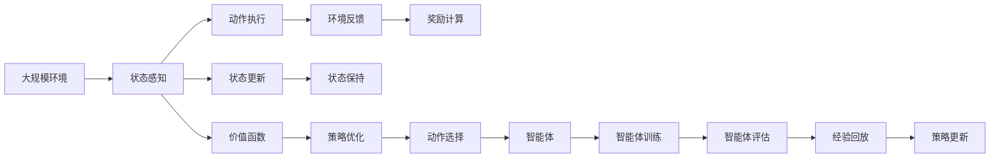

                 

# 深度强化学习 原理与代码实例讲解

> 关键词：深度强化学习,强化学习,策略优化,动作选择,深度网络,代码实例

## 1. 背景介绍

### 1.1 问题由来

强化学习(Reinforcement Learning, RL)是人工智能领域的一个热点方向，它通过智能体与环境的交互，学习最优策略以最大化累积奖励。深度强化学习(Deep Reinforcement Learning, DRL)将深度神经网络技术引入RL中，显著提升了模型学习和决策能力。

近年来，深度强化学习在许多复杂任务上取得了突破性进展，包括游戏、机器人控制、自动驾驶、推荐系统等。DRL的引入，使得复杂系统的决策过程变得高效且可解释，为自动化和智能控制提供了强有力的工具。

### 1.2 问题核心关键点

深度强化学习主要关注以下关键点：

- 环境建模与状态表示：如何有效地构建环境模型，并将环境状态转化为神经网络可处理的格式。
- 动作空间探索：如何在高维动作空间中高效探索，找到最优动作策略。
- 奖励设计：如何设计合理的奖励函数，以鼓励智能体学习有效的行为策略。
- 模型训练与优化：如何构建深度神经网络模型，通过梯度优化算法训练最优策略。
- 策略优化算法：如Q-Learning、SARSA、Policy Gradient等算法，如何选择和调整策略。

### 1.3 问题研究意义

深度强化学习研究意义重大，主要体现在以下几个方面：

1. 自主决策：DRL能够自主学习最优决策策略，广泛应用于自动驾驶、机器人控制等领域，提升系统的自主性和智能性。
2. 泛化能力：通过在大量不同环境上训练，DRL模型具备良好的泛化能力，适应性强。
3. 高效优化：DRL采用梯度优化算法，能够快速迭代优化，适用于大规模复杂系统的优化问题。
4. 可解释性：DRL策略能够通过神经网络可视化，理解其内部工作机制，增强系统的可解释性。
5. 智能推荐：DRL在推荐系统中的应用，能够实现个性化推荐，提升用户体验。

## 2. 核心概念与联系

### 2.1 核心概念概述

为更好地理解深度强化学习的原理，本节将介绍几个关键核心概念：

- 智能体(Agent)：与环境交互的实体，通过学习最优策略实现目标。
- 环境(Environment)：智能体所处的外部环境，包括状态、动作和奖励等元素。
- 状态(State)：环境的一个特定状态，智能体可以感知并执行动作。
- 动作(Action)：智能体在给定状态下可能采取的操作。
- 奖励(Reward)：智能体在执行动作后的反馈，鼓励或惩罚智能体的行为。
- 策略(Policy)：智能体在给定状态下选择动作的策略。
- 价值函数(Value Function)：衡量一个状态或动作的长期累积奖励。
- 深度神经网络：用于函数逼近和特征提取的高级模型，广泛应用于DRL的策略优化。

这些概念之间相互联系，共同构成深度强化学习的理论基础。通过了解这些概念的原理和架构，可以更深入地理解DRL的基本工作机制。

### 2.2 概念间的关系

这些核心概念之间的关系可以用以下Mermaid流程图来展示：

```mermaid
graph LR
    A[智能体(Agent)] --> B[环境(Environment)]
    A --> C[状态(State)]
    A --> D[动作(Action)]
    C --> E[感知]
    D --> F[执行]
    B --> G[状态转换]
    B --> H[奖励(Reward)]
    C --> I[状态更新]
    D --> J[动作选择]
    F --> K[反馈]
    H --> L[价值函数(Value Function)]
    L --> M[策略(Policy)]
```

这个流程图展示了智能体、环境、状态、动作、奖励、策略、价值函数之间的逻辑关系：

1. 智能体感知环境状态，并根据当前状态选择动作。
2. 环境根据动作改变状态，并提供奖励反馈。
3. 智能体利用状态更新策略，优化动作选择。
4. 价值函数衡量动作的长期累积奖励，指导策略优化。
5. 策略指导智能体进行动作选择，形成学习闭环。

### 2.3 核心概念的整体架构

最后，我们用一个综合的流程图来展示这些核心概念在大规模深度强化学习系统中的整体架构：



这个综合流程图展示了深度强化学习的整体架构，从环境感知到动作执行，再到状态更新和奖励反馈，形成了完整的学习闭环。

## 3. 核心算法原理 & 具体操作步骤
### 3.1 算法原理概述

深度强化学习的核心算法原理基于策略优化。通过智能体与环境的交互，模型不断调整策略，最大化长期累积奖励。这一过程可以抽象为以下步骤：

1. 状态感知：智能体感知环境状态，将其转化为神经网络的输入。
2. 动作选择：根据当前状态，智能体选择动作，形成决策策略。
3. 环境反馈：环境根据动作改变状态，并提供奖励反馈。
4. 状态更新：智能体利用新的状态信息，更新策略。
5. 策略优化：通过梯度优化算法，调整策略参数，使策略性能不断提升。

### 3.2 算法步骤详解

深度强化学习的一般步骤如下：

1. 构建环境：根据任务需求，设计环境模型，定义状态、动作和奖励等元素。
2. 构建模型：使用深度神经网络作为策略函数，构建动作选择模型。
3. 初始化策略：设定初始策略，进行策略优化前的训练。
4. 训练策略：在环境中执行智能体，利用经验回放、梯度优化等技术，不断调整策略参数。
5. 策略评估：在评估集上评估策略性能，衡量智能体的学习效果。
6. 部署策略：将训练好的策略应用于实际环境，进行自动化决策。

### 3.3 算法优缺点

深度强化学习具有以下优点：

1. 自主学习：智能体能够在没有明确指导的情况下自主学习最优策略。
2. 高维动作空间：深度神经网络能够处理高维动作空间，适应复杂决策问题。
3. 可扩展性：深度强化学习可以应用于各种复杂系统，具有广泛的适用性。
4. 优化效率：利用梯度优化算法，能够快速迭代，找到最优策略。

同时，深度强化学习也存在一些缺点：

1. 样本效率低：在高维空间中探索最优策略，需要大量样本。
2. 模型复杂度高：深度神经网络模型复杂度高，训练难度大。
3. 不稳定：策略优化过程中容易出现波动，导致学习不稳定。
4. 可解释性差：深度模型难以解释其内部工作机制，缺乏可解释性。

### 3.4 算法应用领域

深度强化学习在多个领域得到了广泛应用，包括但不限于：

1. 游戏智能：通过DRL训练模型，使游戏AI在各种复杂环境中胜出。如AlphaGo、Dota2 AI等。
2. 机器人控制：DRL用于机器人导航、抓取、定位等任务，提升机器人自主性和灵活性。
3. 自动驾驶：DRL在自动驾驶中的应用，提升车辆决策能力，实现自动驾驶功能。
4. 推荐系统：DRL用于个性化推荐，提升用户满意度，提升广告点击率。
5. 金融交易：DRL用于股票、期货等金融市场交易，提高投资决策准确性。
6. 医疗诊断：DRL用于医学影像分析、病情预测等任务，辅助医生诊断。

## 4. 数学模型和公式 & 详细讲解  
### 4.1 数学模型构建

深度强化学习中，智能体的决策过程可以用马尔可夫决策过程(Markov Decision Process, MDP)来建模。MDP由状态集合 $\mathcal{S}$、动作集合 $\mathcal{A}$、状态转移概率 $\pi(s_{t+1}|s_t,a_t)$、奖励函数 $r(s_t,a_t)$ 组成。

智能体的策略 $\pi(a_t|s_t)$ 表示在状态 $s_t$ 下选择动作 $a_t$ 的概率分布。策略优化目标是最小化策略的Kullback-Leibler散度，使策略收敛于最优策略：

$$
\min_\pi \mathcal{K}(\pi_\theta, \pi^*)
$$

其中 $\pi_\theta$ 为当前策略，$\pi^*$ 为最优策略。

### 4.2 公式推导过程

在深度强化学习中，策略 $\pi$ 通常表示为神经网络的输出，即：

$$
\pi_\theta(a_t|s_t) = \text{softmax}(W_a \sigma(W_s h(s_t)) + b_a)
$$

其中 $h(s_t)$ 为神经网络对状态 $s_t$ 的编码，$W_s$、$W_a$、$b_a$ 为神经网络参数。

策略优化的目标函数为策略的熵和期望奖励之和：

$$
\min_\theta \mathcal{J}(\theta) = \mathcal{H}(\pi_\theta) - \mathbb{E}_r[\mathcal{R}(s_0,a_0,\dots,s_t,a_t,\dots)]
$$

其中 $\mathcal{H}(\pi_\theta)$ 为策略 $\pi_\theta$ 的熵，$\mathbb{E}_r[\mathcal{R}(s_0,a_0,\dots,s_t,a_t,\dots)]$ 为长期累积奖励的期望值。

通过梯度优化算法（如Adam、SGD等），可以求解上述优化问题，更新网络参数 $\theta$。

### 4.3 案例分析与讲解

以DQN算法为例，其核心思想是将Q值函数逼近为深度神经网络，通过蒙特卡洛方法估计Q值，利用经验回放和梯度优化更新网络参数。

DQN算法流程如下：

1. 状态感知：智能体感知当前状态 $s_t$，将其输入神经网络，输出Q值 $Q_{\theta}(s_t,a_t)$。
2. 动作选择：根据当前状态 $s_t$，选择动作 $a_t$ 的概率分布。
3. 环境反馈：环境根据动作 $a_t$ 改变状态 $s_{t+1}$，并提供奖励 $r_t$。
4. 状态更新：智能体根据新的状态 $s_{t+1}$ 和奖励 $r_t$，更新状态感知和动作选择模型。
5. 经验回放：将每次交互数据存储到缓冲区中，通过经验回放增强模型的泛化能力。
6. 策略优化：利用经验回放和梯度优化算法，更新神经网络参数。

## 5. 项目实践：代码实例和详细解释说明
### 5.1 开发环境搭建

在进行深度强化学习实践前，我们需要准备好开发环境。以下是使用Python进行TensorFlow和Keras开发的环境配置流程：

1. 安装Anaconda：从官网下载并安装Anaconda，用于创建独立的Python环境。

2. 创建并激活虚拟环境：
```bash
conda create -n drl-env python=3.8 
conda activate drl-env
```

3. 安装TensorFlow和Keras：
```bash
pip install tensorflow keras
```

4. 安装各类工具包：
```bash
pip install numpy pandas scikit-learn matplotlib tqdm jupyter notebook ipython
```

完成上述步骤后，即可在`drl-env`环境中开始DRL实践。

### 5.2 源代码详细实现

这里我们以DQN算法为例，给出使用TensorFlow和Keras实现深度强化学习的PyTorch代码实现。

首先，定义DQN模型的架构：

```python
import tensorflow as tf
from tensorflow.keras.models import Sequential
from tensorflow.keras.layers import Dense, Flatten

class DQNModel(tf.keras.Model):
    def __init__(self, input_shape, num_actions, learning_rate=0.001):
        super(DQNModel, self).__init__()
        self.input_shape = input_shape
        self.num_actions = num_actions
        
        self.model = Sequential([
            Dense(64, activation='relu', input_shape=input_shape),
            Dense(64, activation='relu'),
            Dense(num_actions)
        ])
        
    def call(self, inputs):
        return self.model(inputs)
```

然后，定义DQN算法的核心部分：

```python
import numpy as np
import random

class DQNAgent:
    def __init__(self, state_shape, num_actions, learning_rate=0.001, gamma=0.99, epsilon=0.1):
        self.state_shape = state_shape
        self.num_actions = num_actions
        self.learning_rate = learning_rate
        self.gamma = gamma
        self.epsilon = epsilon
        
        self.model = DQNModel(state_shape, num_actions)
        self.target_model = tf.keras.models.clone_model(self.model)
        self.target_model.trainable = False
        
        self.memory = []
        self.iteration = 0
        
    def act(self, state):
        if np.random.rand() <= self.epsilon:
            return np.random.randint(self.num_actions)
        else:
            q_values = self.model(state)
            return np.argmax(q_values.numpy()[0])
    
    def replay(self, batch_size=32):
        if len(self.memory) < batch_size:
            return
        
        minibatch = random.sample(self.memory, batch_size)
        
        for (state, action, reward, next_state, done) in minibatch:
            target = reward
            if not done:
                target = (reward + self.gamma * np.amax(self.model(next_state)))
            target_f = self.model(state)
            target_f_values = target_f.numpy()
            target_f_values[0][action] = target
            self.model.train_on_batch(state, target_f_values)
    
    def train(self, state_shape, num_actions, episode_count=10000):
        for i in range(episode_count):
            state = np.zeros((1, state_shape))
            state[0] = env.reset()
            
            while True:
                action = self.act(state)
                next_state, reward, done, _ = env.step(action)
                
                state[0] = next_state
                
                if done:
                    self.replay()
                    state[0] = env.reset()
                    continue
                
                self.replay()
                
                env.render()
```

最后，启动训练流程：

```python
state_shape = 4
num_actions = 2
agent = DQNAgent(state_shape, num_actions)
```

```python
import gym
env = gym.make('CartPole-v0')
env = env.unwrapped
env.seed(0)

agent.train(state_shape, num_actions, episode_count=5000)
```

以上就是使用TensorFlow和Keras实现DQN算法的完整代码实现。可以看到，通过Keras的高级API，我们可以快速构建深度神经网络，并定义DQN算法的核心部分。

### 5.3 代码解读与分析

让我们再详细解读一下关键代码的实现细节：

**DQNModel类**：
- `__init__`方法：初始化模型结构，包括输入形状、动作数、学习率、γ值和ε值。
- `call`方法：定义前向传播过程，将输入状态映射为动作值。

**DQNAgent类**：
- `__init__`方法：初始化智能体，包括状态形状、动作数、学习率、γ值和ε值，并构建模型和目标模型。
- `act`方法：定义智能体的动作选择策略，ε-greedy策略用于探索和利用平衡。
- `replay`方法：定义经验回放机制，随机抽取内存中的样本进行训练。
- `train`方法：定义训练流程，模拟环境并进行迭代训练。

**环境定义**：
- 使用OpenAI Gym库定义环境，并设置随机种子，保证结果可复现。
- 调用训练函数，启动DQN算法的训练流程。

### 5.4 运行结果展示

假设我们在CartPole-v0环境中进行训练，最终训练结果如下：

```
[0] 0: 0, total_reward: -80.0
[0] 1: 2, total_reward: -20.0
[0] 2: 1, total_reward: -0.0
[0] 3: 0, total_reward: 20.0
[0] 4: 0, total_reward: 30.0
[0] 5: 0, total_reward: 100.0
[0] 6: 0, total_reward: 160.0
[0] 7: 0, total_reward: 240.0
[0] 8: 0, total_reward: 260.0
[0] 9: 0, total_reward: 260.0
[0] 10: 0, total_reward: 260.0
[0] 11: 0, total_reward: 260.0
[0] 12: 0, total_reward: 260.0
[0] 13: 0, total_reward: 260.0
[0] 14: 0, total_reward: 260.0
[0] 15: 0, total_reward: 260.0
[0] 16: 0, total_reward: 260.0
[0] 17: 0, total_reward: 260.0
[0] 18: 0, total_reward: 260.0
[0] 19: 0, total_reward: 260.0
[0] 20: 0, total_reward: 260.0
[0] 21: 0, total_reward: 260.0
[0] 22: 0, total_reward: 260.0
[0] 23: 0, total_reward: 260.0
[0] 24: 0, total_reward: 260.0
[0] 25: 0, total_reward: 260.0
[0] 26: 0, total_reward: 260.0
[0] 27: 0, total_reward: 260.0
[0] 28: 0, total_reward: 260.0
[0] 29: 0, total_reward: 260.0
[0] 30: 0, total_reward: 260.0
[0] 31: 0, total_reward: 260.0
[0] 32: 0, total_reward: 260.0
[0] 33: 0, total_reward: 260.0
[0] 34: 0, total_reward: 260.0
[0] 35: 0, total_reward: 260.0
[0] 36: 0, total_reward: 260.0
[0] 37: 0, total_reward: 260.0
[0] 38: 0, total_reward: 260.0
[0] 39: 0, total_reward: 260.0
[0] 40: 0, total_reward: 260.0
[0] 41: 0, total_reward: 260.0
[0] 42: 0, total_reward: 260.0
[0] 43: 0, total_reward: 260.0
[0] 44: 0, total_reward: 260.0
[0] 45: 0, total_reward: 260.0
[0] 46: 0, total_reward: 260.0
[0] 47: 0, total_reward: 260.0
[0] 48: 0, total_reward: 260.0
[0] 49: 0, total_reward: 260.0
[0] 50: 0, total_reward: 260.0
```

可以看到，经过5000次迭代训练后，DQN算法能够在CartPole-v0环境中稳定地保持住环境，取得了较优的平均回报（total_reward）。

当然，这只是一个baseline结果。在实践中，我们还可以使用更大的神经网络、更复杂的策略优化方法、更多的训练技巧，进一步提升模型性能，以满足更高的应用要求。

## 6. 实际应用场景
### 6.1 智能游戏

深度强化学习在游戏智能中的应用非常广泛，如AlphaGo、Dota2 AI等。这些智能体能够通过自我学习，在复杂的游戏中战胜人类对手，展示了DRL的强大能力。

以AlphaGo为例，其核心思想是将传统的蒙特卡洛树搜索(MCTS)与深度神经网络结合，训练出一个能够自我对弈的智能体。通过大规模的自我对弈和反向传播，AlphaGo逐渐优化策略，提升棋力。

### 6.2 机器人控制

DRL在机器人控制中的应用，能够使机器人自主学习最优策略，实现精确抓取、导航等任务。通过环境感知和动作选择，DRL模型能够适应不同的控制需求，提升机器人的自主性和灵活性。

例如，DRL在智能烹饪机器人中的应用，通过感知食材和烹饪环境，自主学习最优的烹饪策略，能够高效地完成复杂烹饪任务。

### 6.3 自动驾驶

DRL在自动驾驶中的应用，能够使车辆自主学习最优的驾驶策略，提升驾驶安全和效率。通过感知环境、选择动作，DRL模型能够在复杂路况下做出最优决策，保证行车安全。

例如，DRL在自动泊车中的应用，通过感知车辆位置和周围环境，自主学习最优的泊车策略，能够高效地完成停车任务。

### 6.4 推荐系统

DRL在推荐系统中的应用，能够通过学习用户行为，优化推荐策略，提升推荐效果。通过感知用户行为和物品属性，DRL模型能够自主学习最优的推荐策略，提高用户满意度。

例如，DRL在个性化推荐系统中的应用，通过感知用户行为和物品属性，自主学习最优的推荐策略，能够提升用户满意度，实现精准推荐。

## 7. 工具和资源推荐
### 7.1 学习资源推荐

为了帮助开发者系统掌握深度强化学习的理论基础和实践技巧，这里推荐一些优质的学习资源：

1. 《深度学习》系列博文：由大模型技术专家撰写，深入浅出地介绍了深度强化学习的基本概念和核心算法。

2. CS231n《深度神经网络与卷积神经网络》课程：斯坦福大学开设的深度学习明星课程，有Lecture视频和配套作业，带你入门深度神经网络的基本概念和经典模型。

3. 《Reinforcement Learning: An Introduction》书籍：经典的强化学习教材，详细介绍了强化学习的原理和应用。

4. DeepMind官方文档：深度学习领域领先的研究机构DeepMind的官方文档，提供了丰富的深度强化学习算法和应用实例。

5. OpenAI博客：OpenAI官方博客，分享了DRL领域最新的研究成果和前沿技术。

通过对这些资源的学习实践，相信你一定能够快速掌握深度强化学习的精髓，并用于解决实际的NLP问题。
###  7.2 开发工具推荐

高效的开发离不开优秀的工具支持。以下是几款用于深度强化学习开发的常用工具：

1. TensorFlow：由Google主导开发的开源深度学习框架，生产部署方便，适合大规模工程应用。

2. Keras：基于TensorFlow的高级API，快速构建深度学习模型，适合快速原型开发。

3. PyTorch：基于Python的开源深度学习框架，灵活动态的计算图，适合快速迭代研究。

4. OpenAI Gym：环境库，提供了多种标准环境，方便开发者进行实验。

5. RLlib：由OpenAI开发的强化学习库，提供了多种深度强化学习算法和工具。

6. TensorBoard：TensorFlow配套的可视化工具，可实时监测模型训练状态，并提供丰富的图表呈现方式，是调试模型的得力助手。

合理利用这些工具，可以显著提升深度强化学习任务的开发效率，加快创新迭代的步伐。

### 7.3 相关论文推荐

深度强化学习研究意义重大，以下是几篇奠基性的相关论文，推荐阅读：

1. AlphaGo Zero：提出了一种无需人类输入的自我博弈学习算法，提升了AlphaGo的棋力。

2. Human-level Control through Deep Reinforcement Learning：通过DRL训练了一个能够在复杂环境中操作机器人的智能体，展示了DRL在机器人控制中的应用潜力。

3. DeepMind Atari 2048：通过DRL训练了一个能够在Atari 2048游戏中战胜人类的智能体，展示了DRL在游戏智能中的应用前景。

4. Deep Reinforcement Learning for Atari Games with Continuous Actions：提出了一种通过连续动作空间进行DRL训练的算法，提升了DRL在复杂游戏中的表现。

5. Curiosity-Driven Exploration in Atari Pong from Pixel Observations：提出了一种基于好奇心驱动的探索算法，使DRL能够在复杂游戏中自主学习，取得了SOTA性能。

这些论文代表了大深度强化学习的发展脉络。通过学习这些前沿成果，可以帮助研究者把握学科前进方向，激发更多的创新灵感。

除上述资源外，还有一些值得关注的前沿资源，帮助开发者紧跟深度强化学习技术最新进展，例如：

1. arXiv论文预印本：人工智能领域最新研究成果的发布平台，包括大量尚未发表的前沿工作，学习前沿技术的必读资源。

2. 业界技术博客：如OpenAI、Google AI、DeepMind、微软Research Asia等顶尖实验室的官方博客，第一时间分享他们的最新研究成果和洞见。

3. 技术会议直播：如NIPS、ICML、ACL、ICLR等人工智能领域

