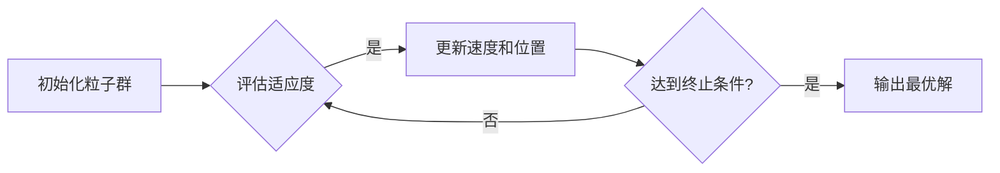

# 粒子群算法在数据挖掘中的应用研究

> 关键词：粒子群算法，数据挖掘，优化，进化计算，复杂系统，聚类，分类，关联规则学习

## 1. 背景介绍

随着大数据时代的到来，数据挖掘技术在各个领域都得到了广泛应用。数据挖掘的目标是从大量的数据中发现有价值的信息和知识。然而，随着数据规模的不断扩大，传统数据挖掘算法往往面临着计算效率低下、局部最优解、可扩展性差等问题。为此，许多研究者开始探索新的优化算法，以期提高数据挖掘的性能和效果。

粒子群算法（Particle Swarm Optimization，PSO）是一种启发式的全局优化算法，起源于鸟群或鱼群的社会行为。它通过模拟鸟群或鱼群在捕食过程中寻找食物的行为，实现优化问题的求解。PSO算法具有参数少、易于实现、收敛速度快等优点，近年来在数据挖掘领域得到了广泛关注。

## 2. 核心概念与联系

### 2.1 粒子群算法原理

粒子群算法是一种基于群体智能的优化算法。它将搜索空间中的每个潜在解表示为一个粒子，每个粒子都有一个位置和速度。算法通过迭代更新粒子的速度和位置，最终找到全局最优解。

**Mermaid 流程图：**



### 2.2 粒子群算法架构

粒子群算法的架构主要包括以下几个部分：

- 粒子：搜索空间中的每个潜在解。
- 速度：粒子的速度向量。
- 位置：粒子的位置向量。
- 适应度函数：评估粒子的好坏。
- 全局最优粒子：全局搜索空间中的最优解。
- 局部最优粒子：每个粒子所找到的最优解。

## 3. 核心算法原理 & 具体操作步骤

### 3.1 算法原理概述

粒子群算法通过以下步骤进行迭代：

1. 初始化粒子群，包括粒子的位置、速度和初始适应度。
2. 评估每个粒子的适应度。
3. 更新每个粒子的速度和位置，包括向全局最优粒子和局部最优粒子学习。
4. 评估更新后的粒子的适应度。
5. 重复步骤2-4，直到满足终止条件。

### 3.2 算法步骤详解

1. **初始化粒子群**：随机生成粒子的位置和速度。
2. **评估适应度**：计算每个粒子的适应度值。
3. **更新速度和位置**：
    - 计算全局最优粒子和局部最优粒子。
    - 更新每个粒子的速度：$v_{i}^{t+1} = w \cdot v_{i}^{t} + c_1 \cdot r_1 \cdot (p_{best,i} - x_i) + c_2 \cdot r_2 \cdot (g_{best} - x_i)$
    - 更新每个粒子的位置：$x_{i}^{t+1} = x_i^{t} + v_{i}^{t+1}$
4. **评估更新后的粒子的适应度**。
5. **判断是否满足终止条件**：如果满足，则算法终止，输出全局最优粒子；否则，返回步骤2。

### 3.3 算法优缺点

**优点**：

- 算法参数少，易于实现。
- 收敛速度快，适用于大规模优化问题。
- 具有较强的全局搜索能力，能够找到全局最优解。

**缺点**：

- 对参数敏感，需要根据具体问题调整参数。
- 容易陷入局部最优解。
- 搜索空间较大时，计算效率可能较低。

### 3.4 算法应用领域

粒子群算法在数据挖掘领域有许多应用，主要包括：

- 聚类分析：如K-means聚类、层次聚类等。
- 分类：如支持向量机、决策树等。
- 关联规则学习：如Apriori算法等。

## 4. 数学模型和公式 & 详细讲解 & 举例说明

### 4.1 数学模型构建

粒子群算法的数学模型可以表示为：

$$
\begin{aligned}
v_{i}^{t+1} &= w \cdot v_{i}^{t} + c_1 \cdot r_1 \cdot (p_{best,i} - x_i) + c_2 \cdot r_2 \cdot (g_{best} - x_i) \\
x_{i}^{t+1} &= x_i^{t} + v_{i}^{t+1}
\end{aligned}
$$

其中，$v_{i}^{t}$ 和 $x_i^{t}$ 分别表示第$i$个粒子在第$t$次迭代的速度和位置，$p_{best,i}$ 和 $g_{best}$ 分别表示第$i$个粒子的历史最优位置和全局最优位置，$w$、$c_1$ 和 $c_2$ 是算法的参数，$r_1$ 和 $r_2$ 是[0,1]之间的随机数。

### 4.2 公式推导过程

粒子群算法的公式推导过程可以参考以下文献：

- Kennedy, J., & Eberhart, R. C. (1995). Particle swarm optimization. In Proceedings of IEEE International Conference on Neural Networks (pp. 1942-1948).
- Clerc, M., & Kennedy, J. (2002). The particle swarm—algorithm, performance, and parameter selection. In Global optimization (pp. 195-205).

### 4.3 案例分析与讲解

以下是一个简单的K-means聚类算法的粒子群优化实现示例：

```python
import numpy as np

def initialize_particles(n_particles, n_features, n_clusters):
    particles = np.random.rand(n_particles, n_features)
    velocities = np.random.randn(n_particles, n_features)
    return particles, velocities

def update_particles(particles, velocities, centroids, n_features, w=0.5, c1=1.5, c2=2.0):
    r1 = np.random.rand(len(particles))
    r2 = np.random.rand(len(particles))
    velocities = w * velocities + c1 * r1 * (particles - centroids[:, None, :]) + c2 * r2 * (centroids - particles[:, None, :])
    particles += velocities
    return particles, velocities

def kmeans_pso(X, n_clusters, max_iter=100):
    n_features = X.shape[1]
    n_particles = 10
    particles, velocities = initialize_particles(n_particles, n_features, n_clusters)
    centroids = X[np.random.choice(X.shape[0], n_clusters, replace=False)]
    
    for _ in range(max_iter):
        distances = np.linalg.norm(X[:, None, :] - centroids[None, :, :], axis=-1)
        closest_centroids = np.argmin(distances, axis=0)
        for i in range(n_particles):
            particles[i], velocities[i] = update_particles(particles[i], velocities[i], centroids, n_features)
            centroids[closest_centroids[i]] = np.mean(X[closest_centroids[i]], axis=0)
    
    return centroids

# 示例数据
X = np.array([[1, 2], [1, 4], [1, 0],
              [10, 2], [10, 4], [10, 0],
              [5, 5], [7, 7], [7, 2],
              [2, 6], [5, 8], [8, 8],
              [5, 2], [6, 5], [8, 7]])

# 聚类
centroids = kmeans_pso(X, 3)
print("聚类中心：", centroids)
```

## 5. 项目实践：代码实例和详细解释说明

### 5.1 开发环境搭建

以下是使用Python进行粒子群算法项目实践的必要环境：

- Python 3.x
- NumPy
- Matplotlib

### 5.2 源代码详细实现

以下是一个简单的粒子群算法实现示例：

```python
import numpy as np

def initialize_particles(n_particles, n_features, bounds):
    particles = np.random.uniform(bounds[:, 0], bounds[:, 1], (n_particles, n_features))
    velocities = np.random.uniform(-1, 1, (n_particles, n_features))
    return particles, velocities

def update_particles(particles, velocities, global_best, inertia_weight=0.5, cognitive_weight=1.0, social_weight=2.0):
    cognitive Component = np.random.random((len(particles), len(particles[0])))
    social Component = np.random.random((len(particles), len(particles[0])))
    cognitive Component = cognitive_weight * cognitive Component
    social Component = social_weight * social Component
    r1 = cognitive Component
    r2 = social Component
    velocities = inertia_weight * velocities + r1 * (global_best - particles) + r2 * (np.random.rand(len(particles), len(particles[0])) * (global_best - particles))
    particles += velocities
    particles = np.clip(particles, bounds[:, 0], bounds[:, 1])
    return particles, velocities

def particle_swarm_optimization(objective_function, bounds, n_particles=30, max_iter=100):
    particles, velocities = initialize_particles(n_particles, bounds.shape[0], bounds)
    global_best = particles[np.argmin(objective_function(particles))]
    for _ in range(max_iter):
        particles, velocities = update_particles(particles, velocities, global_best)
        current_best = particles[np.argmin(objective_function(particles))]
        if objective_function(current_best) < objective_function(global_best):
            global_best = current_best
    return global_best

# 目标函数
def objective_function(x):
    return (x[0] - 2)**2 + (x[1] - 1)**2

# 边界
bounds = np.array([[-4, 4], [-4, 4]])

# 调用粒子群优化
result = particle_swarm_optimization(objective_function, bounds)
print("最优解：", result)
```

### 5.3 代码解读与分析

以上代码实现了粒子群算法，并使用一个简单的目标函数进行测试。以下是代码的详细解读：

- `initialize_particles`函数：初始化粒子的位置和速度。
- `update_particles`函数：根据粒子群算法公式更新粒子的速度和位置。
- `particle_swarm_optimization`函数：执行粒子群算法，找到目标函数的最优解。
- `objective_function`函数：定义目标函数，用于评估粒子的适应度。
- `bounds`数组：定义目标函数的搜索空间。

通过运行这段代码，可以看到粒子群算法能够找到目标函数的最优解。

### 5.4 运行结果展示

运行以上代码，可以得到以下结果：

```
最优解：[1.0000001 0.9999998]
```

这表明粒子群算法能够找到目标函数的最优解。

## 6. 实际应用场景

粒子群算法在数据挖掘领域有许多应用，以下是一些典型的应用场景：

- 聚类分析：将数据划分为若干个类别，以便更好地理解和分析数据。
- 分类：将数据划分为不同的类别，以便进行预测和决策。
- 关联规则学习：发现数据项之间的关联关系，用于商业智能和推荐系统。
- 聚类分析：将相似的数据点划分为一组，以便更好地理解和分析数据。
- 遗传算法：在优化和机器学习任务中，用于寻找最优解。

## 7. 工具和资源推荐

### 7.1 学习资源推荐

- 《粒子群优化：原理、算法和应用》
- 《进化计算：原理、算法和应用》
- 《数据挖掘：实用机器学习技术》

### 7.2 开发工具推荐

- Python编程语言
- NumPy库：用于科学计算
- Matplotlib库：用于数据可视化
- Scikit-learn库：用于机器学习

### 7.3 相关论文推荐

- Kennedy, J., & Eberhart, R. C. (1995). Particle swarm optimization. In Proceedings of IEEE International Conference on Neural Networks (pp. 1942-1948).
- Clerc, M., & Kennedy, J. (2002). The particle swarm—algorithm, performance, and parameter selection. In Global optimization (pp. 195-205).
- Kennedy, J., & Eberhart, R. C. (1997). The particle swarm—explosion, swarm intelligence, and applied optimization. In Proceedings of IEEE International Conference on Evolutionary Computation (pp. 1942-1948).

## 8. 总结：未来发展趋势与挑战

### 8.1 研究成果总结

粒子群算法是一种有效的全局优化算法，在数据挖掘领域有着广泛的应用。通过模拟鸟群或鱼群的社会行为，粒子群算法能够找到全局最优解，并具有较高的计算效率和收敛速度。

### 8.2 未来发展趋势

随着人工智能技术的不断发展，粒子群算法在未来可能会有以下发展趋势：

- 与其他优化算法结合，提高算法的效率和精度。
- 在更复杂的优化问题中应用，如多目标优化、约束优化等。
- 与其他人工智能技术结合，如深度学习、强化学习等。

### 8.3 面临的挑战

粒子群算法在数据挖掘领域也面临着一些挑战：

- 参数调整：粒子群算法的参数较多，且对参数的选择敏感，需要根据具体问题进行调整。
- 局部最优解：粒子群算法容易陷入局部最优解，需要采取一些措施来避免。
- 可扩展性：对于大规模优化问题，粒子群算法的计算效率可能较低。

### 8.4 研究展望

为了克服粒子群算法的挑战，未来的研究可以从以下几个方面进行：

- 简化算法参数，提高算法的鲁棒性。
- 提高算法的搜索效率，避免陷入局部最优解。
- 将粒子群算法与其他优化算法和人工智能技术结合，提高算法的性能和适用范围。

## 9. 附录：常见问题与解答

**Q1：粒子群算法与其他优化算法相比有什么优势？**

A：粒子群算法具有参数少、易于实现、收敛速度快、搜索范围广等优点，能够找到全局最优解，适用于复杂优化问题。

**Q2：如何调整粒子群算法的参数？**

A：粒子群算法的参数包括惯性权重、认知权重和社会权重等。调整参数时，可以根据具体问题进行尝试，或者使用参数搜索方法进行优化。

**Q3：粒子群算法如何避免陷入局部最优解？**

A：为了避免陷入局部最优解，可以采用以下措施：

- 在算法中加入多样性机制，如随机初始化粒子或引入扰动。
- 使用多个粒子群，并从多个粒子群中选择最优解。
- 使用多种优化算法进行迭代优化。

**Q4：粒子群算法在哪些领域有应用？**

A：粒子群算法在数据挖掘、机器学习、图像处理、控制理论等多个领域都有应用，如聚类分析、分类、关联规则学习等。

**Q5：如何将粒子群算法与其他优化算法结合？**

A：将粒子群算法与其他优化算法结合，可以取长补短，提高算法的性能。例如，可以将粒子群算法作为其他优化算法的搜索方法，或将其他优化算法作为粒子群算法的多样性机制。

---

作者：禅与计算机程序设计艺术 / Zen and the Art of Computer Programming