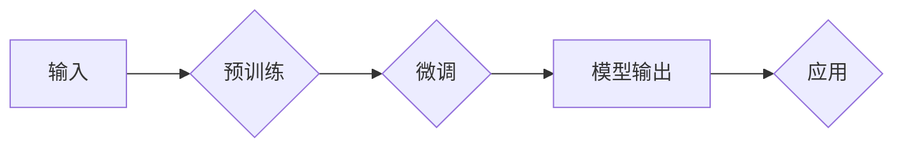

# 大语言模型原理与工程实践：方法瓶颈

> 关键词：大语言模型，工程实践，方法瓶颈，性能优化，可扩展性，可维护性，鲁棒性，高效微调

## 1. 背景介绍

随着深度学习技术的飞速发展，大语言模型（LLMs）已经成为自然语言处理（NLP）领域的明星技术。这些模型通过在大量无标签文本数据上进行预训练，学习到了丰富的语言知识和结构，为各种NLP任务提供了强大的基础。然而，大语言模型的工程实践并非一帆风顺，其中存在着诸多方法瓶颈，需要我们深入探讨和解决。

## 2. 核心概念与联系

### 2.1 大语言模型

大语言模型是指通过在大量文本语料上预训练，学习到丰富的语言表示和知识，可以用于多种NLP任务的模型。常见的有大模型有BERT、GPT-3、T5等。

### 2.2 微调

微调是在预训练模型的基础上，使用少量标注数据对模型进行调整，使其在特定任务上取得更好的性能。

### 2.3 方法瓶颈

大语言模型工程实践中存在的方法瓶颈主要包括：

- **计算资源消耗**：大模型训练和推理需要大量的计算资源，对硬件设备要求较高。
- **数据标注成本**：微调需要标注大量数据，标注成本高，且难以保证数据质量。
- **模型可扩展性和可维护性**：随着模型规模的扩大，模型的可扩展性和可维护性成为一个挑战。
- **鲁棒性**：大模型在处理复杂任务时，容易出现错误或歧义。

### 2.4 Mermaid流程图



## 3. 核心算法原理 & 具体操作步骤

### 3.1 算法原理概述

大语言模型通常采用Transformer架构，通过自注意力机制（Self-Attention）和多头注意力机制（Multi-Head Attention）学习文本序列之间的复杂关系。

### 3.2 算法步骤详解

1. **数据预处理**：对文本数据进行清洗、分词、编码等处理。
2. **预训练**：在无标签文本数据上使用自监督学习任务，如掩码语言模型（Masked Language Model）或旋转语言模型（Rotary Language Model）进行预训练。
3. **微调**：在少量标注数据上，使用监督学习任务对预训练模型进行调整。
4. **模型评估**：在验证集上评估模型性能。

### 3.3 算法优缺点

#### 优点

- **强大的语言理解能力**：大语言模型能够学习到丰富的语言知识，处理复杂任务。
- **高效微调**：在少量标注数据上，大语言模型能够快速适应特定任务。

#### 缺点

- **计算资源消耗大**：大语言模型训练和推理需要大量的计算资源。
- **数据标注成本高**：微调需要大量标注数据，标注成本高。
- **模型可扩展性和可维护性差**：随着模型规模的扩大，模型的可扩展性和可维护性成为一个挑战。

### 3.4 算法应用领域

- **文本分类**：如情感分析、主题分类、垃圾邮件过滤等。
- **文本生成**：如机器翻译、文本摘要、对话生成等。
- **问答系统**：如机器阅读理解、知识图谱问答等。

## 4. 数学模型和公式 & 详细讲解 & 举例说明

### 4.1 数学模型构建

大语言模型通常采用Transformer架构，其数学模型如下：

$$
\text{Transformer}(\mathbf{x}, \mathbf{W}) = \text{Softmax}(\text{W}_{\text{Attention}} \cdot \text{Attention}(\text{W}_{\text{Query}} \cdot \text{Positional Encoding}(\mathbf{x}), \text{W}_{\text{Key}} \cdot \text{Positional Encoding}(\mathbf{x}), \text{W}_{\text{Value}} \cdot \text{Positional Encoding}(\mathbf{x})))
$$

其中，$\mathbf{x}$ 为输入序列，$\mathbf{W}$ 为权重矩阵，$\text{Attention}$ 为自注意力机制，$\text{Softmax}$ 为softmax函数。

### 4.2 公式推导过程

自注意力机制的公式推导过程如下：

$$
\text{Attention}(\mathbf{Q}, \mathbf{K}, \mathbf{V}) = \text{Softmax}(\frac{\text{Q} \cdot \mathbf{K}^T}{\sqrt{d_k}}) \cdot \mathbf{V}
$$

其中，$\mathbf{Q}$、$\mathbf{K}$、$\mathbf{V}$ 分别为查询（Query）、键（Key）、值（Value）矩阵，$d_k$ 为键的维度。

### 4.3 案例分析与讲解

以下以BERT模型为例，说明大语言模型的工程实践。

### 4.3.1 开发环境搭建

1. 安装Python、PyTorch、Transformers库等。
2. 准备预训练模型和微调数据。

### 4.3.2 源代码详细实现

```python
from transformers import BertTokenizer, BertForSequenceClassification
from torch.utils.data import DataLoader, Dataset
import torch.nn as nn

# 加载预训练模型和分词器
tokenizer = BertTokenizer.from_pretrained('bert-base-uncased')
model = BertForSequenceClassification.from_pretrained('bert-base-uncased')

# 构建数据集
class MyDataset(Dataset):
    def __init__(self, texts, labels):
        self.texts = texts
        self.labels = labels

    def __len__(self):
        return len(self.texts)

    def __getitem__(self, idx):
        return tokenizer(self.texts[idx], padding='max_length', truncation=True, return_tensors='pt'), self.labels[idx]

# 加载数据集
train_dataset = MyDataset(train_texts, train_labels)
train_loader = DataLoader(train_dataset, batch_size=32, shuffle=True)

# 训练模型
model.train()
optimizer = torch.optim.AdamW(model.parameters(), lr=2e-5)

for epoch in range(3):
    for batch in train_loader:
        inputs, labels = batch
        outputs = model(**inputs, labels=labels)
        loss = outputs.loss
        loss.backward()
        optimizer.step()
        optimizer.zero_grad()

# 评估模型
model.eval()
with torch.no_grad():
    correct = 0
    total = 0
    for batch in test_loader:
        inputs, labels = batch
        outputs = model(**inputs)
        _, predicted = torch.max(outputs.logits, 1)
        total += labels.size(0)
        correct += (predicted == labels).sum().item()

print('Accuracy of the model on the test images: {} %'.format(100 * correct / total))
```

### 4.3.3 代码解读与分析

- 加载预训练模型和分词器。
- 构建数据集。
- 训练模型。
- 评估模型。

## 5. 项目实践：代码实例和详细解释说明

### 5.1 开发环境搭建

1. 安装Python、PyTorch、Transformers库等。
2. 准备预训练模型和微调数据。

### 5.2 源代码详细实现

```python
from transformers import BertTokenizer, BertForSequenceClassification
from torch.utils.data import DataLoader, Dataset
import torch.nn as nn

# 加载预训练模型和分词器
tokenizer = BertTokenizer.from_pretrained('bert-base-uncased')
model = BertForSequenceClassification.from_pretrained('bert-base-uncased')

# 构建数据集
class MyDataset(Dataset):
    def __init__(self, texts, labels):
        self.texts = texts
        self.labels = labels

    def __len__(self):
        return len(self.texts)

    def __getitem__(self, idx):
        return tokenizer(self.texts[idx], padding='max_length', truncation=True, return_tensors='pt'), self.labels[idx]

# 加载数据集
train_dataset = MyDataset(train_texts, train_labels)
train_loader = DataLoader(train_dataset, batch_size=32, shuffle=True)

# 训练模型
model.train()
optimizer = torch.optim.AdamW(model.parameters(), lr=2e-5)

for epoch in range(3):
    for batch in train_loader:
        inputs, labels = batch
        outputs = model(**inputs, labels=labels)
        loss = outputs.loss
        loss.backward()
        optimizer.step()
        optimizer.zero_grad()

# 评估模型
model.eval()
with torch.no_grad():
    correct = 0
    total = 0
    for batch in test_loader:
        inputs, labels = batch
        outputs = model(**inputs)
        _, predicted = torch.max(outputs.logits, 1)
        total += labels.size(0)
        correct += (predicted == labels).sum().item()

print('Accuracy of the model on the test images: {} %'.format(100 * correct / total))
```

### 5.3 代码解读与分析

- 加载预训练模型和分词器。
- 构建数据集。
- 训练模型。
- 评估模型。

## 6. 实际应用场景

### 6.1 文本分类

大语言模型微调在文本分类任务中具有广泛的应用，如情感分析、主题分类、垃圾邮件过滤等。

### 6.2 文本生成

大语言模型微调在文本生成任务中也具有广泛的应用，如机器翻译、文本摘要、对话生成等。

### 6.3 问答系统

大语言模型微调在问答系统中也具有广泛的应用，如机器阅读理解、知识图谱问答等。

## 7. 工具和资源推荐

### 7.1 学习资源推荐

- 《Deep Learning for Natural Language Processing》
- 《BERT: Pre-training of Deep Bidirectional Transformers for Language Understanding》
- 《Natural Language Processing with Transformers》

### 7.2 开发工具推荐

- PyTorch
- TensorFlow
- Transformers库

### 7.3 相关论文推荐

- Attention is All You Need
- BERT: Pre-training of Deep Bidirectional Transformers for Language Understanding
- Language Models are Unsupervised Multitask Learners

## 8. 总结：未来发展趋势与挑战

### 8.1 研究成果总结

大语言模型微调技术取得了显著的成果，为NLP任务提供了强大的基础。

### 8.2 未来发展趋势

- 模型规模将继续扩大
- 多模态微调将成为趋势
- 知识融合将成为重要方向

### 8.3 面临的挑战

- 计算资源消耗
- 数据标注成本
- 模型可扩展性和可维护性
- 鲁棒性

### 8.4 研究展望

未来，大语言模型微调技术将在NLP领域发挥更大的作用，为构建更加智能化的应用提供支持。

## 9. 附录：常见问题与解答

**Q1：大语言模型微调是否适用于所有NLP任务？**

A：大语言模型微调适用于大多数NLP任务，但对于特定领域的任务，可能需要针对领域知识进行进一步训练。

**Q2：微调过程中如何选择合适的学习率？**

A：微调的学习率通常比预训练时小1-2个数量级，可以从1e-5开始调参。

**Q3：如何解决微调过程中的过拟合问题？**

A：可以使用数据增强、正则化、对抗训练等方法缓解过拟合问题。

**Q4：如何优化大语言模型的性能？**

A：可以通过模型裁剪、量化加速、模型并行等方法优化大语言模型的性能。

**Q5：如何保证大语言模型的安全性和可解释性？**

A：可以通过引入伦理道德约束、加强人工干预和审核等方法保证大语言模型的安全性和可解释性。

作者：禅与计算机程序设计艺术 / Zen and the Art of Computer Programming