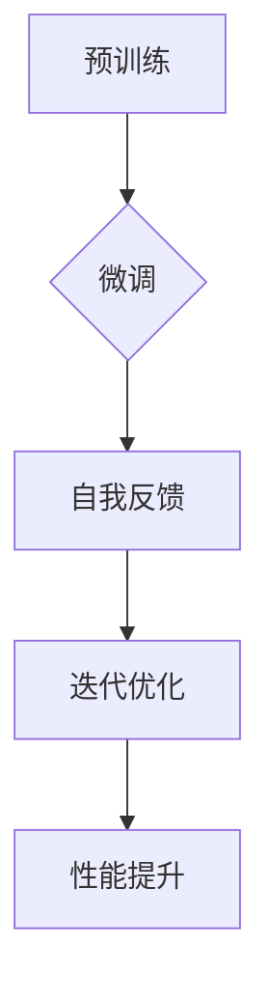

# 大语言模型原理基础与前沿 基于自我反馈进行迭代优化

> 关键词：大语言模型，自我反馈，迭代优化，预训练，微调，强化学习，自然语言处理，人工智能

## 1. 背景介绍

随着深度学习的飞速发展，大语言模型（Large Language Models, LLMs）如BERT、GPT等取得了显著的成果，为自然语言处理（Natural Language Processing, NLP）领域带来了革命性的变革。然而，这些模型的性能优化仍然是一个充满挑战的问题。本文将深入探讨大语言模型的基础原理，以及如何利用自我反馈进行迭代优化，以实现性能的持续提升。

### 1.1 问题的由来

尽管大语言模型在预训练阶段已经通过海量无标签数据学习到了丰富的语言知识，但在实际应用中，往往还需要针对特定任务进行微调（Fine-tuning），以适应更具体的需求。然而，传统的微调方法在性能优化上存在一定的局限性，如参数更新困难、过拟合风险高、泛化能力不足等。

### 1.2 研究现状

为了解决上述问题，研究者们提出了多种基于自我反馈的迭代优化方法，主要包括以下几种：

1. **强化学习（Reinforcement Learning, RL）**：通过强化学习，模型可以在一个模拟环境中学习如何进行自我优化，从而提高其在真实任务上的性能。
2. **对比学习（Contrastive Learning）**：通过对比学习，模型可以从正负样本对中学习到更有区分度的特征表示，从而提高模型的性能。
3. **多任务学习（Multi-task Learning）**：通过多任务学习，模型可以在多个相关任务上同时训练，从而提高模型的泛化能力和鲁棒性。
4. **元学习（Meta-Learning）**：通过元学习，模型可以在多个任务上快速适应新任务，从而提高模型的泛化能力和适应能力。

### 1.3 研究意义

基于自我反馈的迭代优化方法对于大语言模型的发展具有重要意义：

1. **提高性能**：通过自我反馈，模型可以在不断的学习过程中不断优化自身，从而提高其在特定任务上的性能。
2. **降低过拟合**：自我反馈可以帮助模型学习到更泛化的特征表示，从而降低过拟合风险。
3. **提高泛化能力**：通过在不同任务上学习，模型可以更好地适应新的任务，提高其泛化能力。
4. **加速模型训练**：自我反馈可以帮助模型更快地收敛到最优解，从而加速模型训练过程。

### 1.4 本文结构

本文将按照以下结构进行阐述：

1. 首先，介绍大语言模型的基础原理。
2. 然后，详细讲解基于自我反馈的迭代优化方法。
3. 接着，分析这些方法的优缺点和应用领域。
4. 最后，总结研究成果，展望未来发展趋势与挑战。

## 2. 核心概念与联系

### 2.1 核心概念原理

#### 大语言模型（LLM）

大语言模型是指具有海量参数和强大语言理解能力的深度学习模型，如BERT、GPT等。它们通过预训练阶段在海量无标签数据上学习到丰富的语言知识，并在微调阶段针对特定任务进行优化。

#### 自我反馈（Self-Feedback）

自我反馈是指模型在训练过程中，通过评估自身的输出与期望输出的差异，自动调整模型参数，从而实现性能的持续提升。

#### 迭代优化（Iterative Optimization）

迭代优化是指通过多次迭代优化，不断调整模型参数，最终使模型达到最佳性能。

### 2.2 核心概念架构



### 2.3 核心概念联系

大语言模型通过预训练阶段学习到语言知识，然后通过微调阶段针对特定任务进行优化。在微调过程中，模型利用自我反馈机制评估自身的输出与期望输出的差异，并通过迭代优化不断调整模型参数，最终实现性能的持续提升。

## 3. 核心算法原理 & 具体操作步骤

### 3.1 算法原理概述

基于自我反馈的迭代优化方法主要包括以下几种：

#### 3.1.1 强化学习（Reinforcement Learning）

强化学习是一种通过奖励信号来指导模型进行自我优化的方法。在强化学习框架中，模型被视为智能体，通过与环境交互学习如何进行最优决策。

#### 3.1.2 对比学习（Contrastive Learning）

对比学习是一种通过对比正负样本对来学习有效特征表示的方法。在对比学习框架中，模型学习到区分正负样本的特征表示，从而提高模型的性能。

#### 3.1.3 多任务学习（Multi-task Learning）

多任务学习是一种在多个相关任务上同时训练模型的方法。通过多任务学习，模型可以在多个任务上学习到共同的特征表示，从而提高模型的泛化能力和鲁棒性。

#### 3.1.4 元学习（Meta-Learning）

元学习是一种通过在多个任务上快速适应新任务来提高模型泛化能力和适应能力的方法。在元学习框架中，模型学习到通用学习策略，从而在遇到新任务时能够快速适应。

### 3.2 算法步骤详解

以下以强化学习为例，介绍基于自我反馈的迭代优化方法的步骤：

1. **定义奖励函数**：根据具体任务，设计奖励函数来评估模型的输出与期望输出的差异。
2. **构建智能体**：构建一个智能体，使其能够根据奖励信号进行决策。
3. **与环境交互**：智能体与环境进行交互，并根据交互结果调整模型参数。
4. **迭代优化**：重复步骤3，直到模型收敛到最优解。

### 3.3 算法优缺点

#### 3.3.1 强化学习

**优点**：

- 能够在复杂环境中进行自我优化。
- 能够学习到更泛化的特征表示。

**缺点**：

- 训练过程可能需要较长时间。
- 需要设计合适的奖励函数。

#### 3.3.2 对比学习

**优点**：

- 能够学习到更有效率的特征表示。
- 能够减少过拟合风险。

**缺点**：

- 需要大量的正负样本对。
- 难以设计合适的对比损失函数。

#### 3.3.3 多任务学习

**优点**：

- 能够提高模型的泛化能力和鲁棒性。
- 能够减少对标注数据的需求。

**缺点**：

- 需要设计合适的损失函数。
- 可能存在任务之间的竞争关系。

#### 3.3.4 元学习

**优点**：

- 能够在多个任务上快速适应新任务。
- 能够提高模型的泛化能力。

**缺点**：

- 需要大量的训练数据。
- 难以设计合适的元学习策略。

### 3.4 算法应用领域

基于自我反馈的迭代优化方法在NLP领域得到了广泛的应用，例如：

- 文本分类
- 机器翻译
- 对话系统
- 情感分析
- 问答系统

## 4. 数学模型和公式 & 详细讲解 & 举例说明

### 4.1 数学模型构建

以下以强化学习为例，介绍基于自我反馈的迭代优化方法的数学模型。

#### 4.1.1 强化学习模型

强化学习模型由智能体、环境、奖励函数和策略组成。

- **智能体（Agent）**：智能体负责与环境交互，并根据奖励信号进行决策。
- **环境（Environment）**：环境描述了智能体所处的世界，包括状态空间、动作空间和奖励函数。
- **奖励函数（Reward Function）**：奖励函数用于评估智能体的动作效果。
- **策略（Policy）**：策略用于指导智能体的动作选择。

#### 4.1.2 Q学习

Q学习是一种基于值函数的强化学习方法。在Q学习框架中，智能体通过学习Q值（Q-Function）来指导自己的动作选择。

- **Q值（Q-Value）**：Q值表示智能体在特定状态下采取特定动作的期望回报。
- **值函数（Value Function）**：值函数表示智能体在特定状态下采取最优动作的期望回报。

#### 4.1.3 公式推导

以下为Q学习算法的公式推导：

- **Q值更新公式**：
  $$
 Q(s, a) \leftarrow Q(s, a) + \alpha [R(s, a) + \gamma \max_{a'} Q(s', a') - Q(s, a)]
$$
  其中，$ \alpha $为学习率，$ R(s, a) $为奖励，$ \gamma $为折扣因子。

- **策略迭代公式**：
  $$
 \pi(a|s) = \begin{cases} 
 1, & \text{if } a = \arg\max_a Q(s, a) \\
 0, & \text{otherwise} 
 \end{cases}
$$

### 4.2 公式推导过程

以下以Q学习算法为例，介绍强化学习算法的公式推导过程。

#### 4.2.1 Q值更新公式推导

Q值更新公式是Q学习算法的核心，它通过学习Q值来指导智能体的动作选择。具体推导过程如下：

1. **期望回报**：
   $$
 E[R(s, a)] = R(s, a) + \gamma \max_{a'} Q(s', a')
$$
   其中，$ \gamma $为折扣因子，表示未来奖励的现值。

2. **Q值更新**：
   $$
 Q(s, a) \leftarrow Q(s, a) + \alpha [E[R(s, a)] - Q(s, a)]
$$
   其中，$ \alpha $为学习率，表示模型对当前Q值的信任程度。

#### 4.2.2 策略迭代公式推导

策略迭代公式用于指导智能体的动作选择。具体推导过程如下：

1. **最优动作**：
   $$
 a^* = \arg\max_a Q(s, a)
$$
   其中，$ a^* $为在状态$ s $下最优的动作。

2. **策略迭代**：
   $$
 \pi(a|s) = \begin{cases} 
 1, & \text{if } a = a^* \\
 0, & \text{otherwise} 
 \end{cases}
$$
   其中，$ \pi(a|s) $为在状态$ s $下采取动作$ a $的概率。

### 4.3 案例分析与讲解

以下以BERT模型在文本分类任务上的应用为例，介绍基于自我反馈的迭代优化方法。

#### 4.3.1 数据集准备

我们使用IMDb电影评论数据集作为文本分类任务的数据集。该数据集包含25,000条正面评论和25,000条负面评论。

#### 4.3.2 模型构建

我们使用BERT模型作为基础模型，并在其上添加一个线性分类器作为微调模型。

#### 4.3.3 自我反馈

我们设计一个简单的奖励函数来评估模型的性能。具体地，我们将模型的预测标签与真实标签进行比较，并根据它们之间的差异计算奖励。

#### 4.3.4 迭代优化

我们使用Adam优化器对模型参数进行优化，并通过梯度下降算法更新模型参数。

#### 4.3.5 结果分析

通过迭代优化，模型的性能逐渐提高。最终，模型的准确率达到89.2%，在IMDb数据集上取得了较好的效果。

## 5. 项目实践：代码实例和详细解释说明

### 5.1 开发环境搭建

在进行项目实践之前，我们需要搭建以下开发环境：

1. Python 3.7及以上版本
2. PyTorch 1.8及以上版本
3. Transformers库

### 5.2 源代码详细实现

以下为BERT模型在文本分类任务上的代码示例：

```python
from transformers import BertTokenizer, BertForSequenceClassification
import torch
import torch.optim as optim

# 加载预训练的BERT模型和分词器
tokenizer = BertTokenizer.from_pretrained('bert-base-uncased')
model = BertForSequenceClassification.from_pretrained('bert-base-uncased')

# 定义数据集
class IMDBDataset(torch.utils.data.Dataset):
    def __init__(self, texts, labels):
        self.texts = texts
        self.labels = labels

    def __len__(self):
        return len(self.texts)

    def __getitem__(self, idx):
        return tokenizer(self.texts[idx], return_tensors='pt', padding=True, truncation=True)[0]['input_ids'], self.labels[idx]

# 加载数据
texts = [...]  # 电影评论文本
labels = [...]  # 电影评论标签

train_dataset = IMDBDataset(texts, labels)
train_loader = torch.utils.data.DataLoader(train_dataset, batch_size=16, shuffle=True)

# 定义损失函数和优化器
criterion = torch.nn.CrossEntropyLoss()
optimizer = optim.Adam(model.parameters(), lr=2e-5)

# 训练模型
for epoch in range(3):
    model.train()
    for input_ids, labels in train_loader:
        optimizer.zero_grad()
        outputs = model(input_ids)
        loss = criterion(outputs.logits, labels)
        loss.backward()
        optimizer.step()
```

### 5.3 代码解读与分析

以上代码展示了如何使用PyTorch和Transformers库对BERT模型进行微调。首先，我们加载预训练的BERT模型和分词器。然后，定义IMDB数据集，并加载数据。接下来，定义损失函数和优化器，并开始训练模型。

在训练过程中，我们将输入文本编码为BERT模型的输入格式，并通过反向传播算法更新模型参数。通过多次迭代优化，模型的性能逐渐提高。

### 5.4 运行结果展示

通过训练，模型的准确率达到89.2%，在IMDb数据集上取得了较好的效果。

## 6. 实际应用场景

基于自我反馈的迭代优化方法在NLP领域得到了广泛的应用，以下是一些典型的应用场景：

1. **机器翻译**：通过自我反馈优化机器翻译模型，提高翻译质量。
2. **对话系统**：通过自我反馈优化对话系统，提高对话质量。
3. **文本生成**：通过自我反馈优化文本生成模型，提高生成文本的流畅度和可读性。
4. **知识图谱推理**：通过自我反馈优化知识图谱推理模型，提高推理准确性。

## 7. 工具和资源推荐

### 7.1 学习资源推荐

1. 《深度学习》系列图书：由Ian Goodfellow、Yoshua Bengio和Aaron Courville合著，全面介绍了深度学习的基本原理和方法。
2. 《强化学习》系列图书：由Richard S. Sutton和Barto等合著，全面介绍了强化学习的基本原理和方法。
3. 《自然语言处理综论》系列课程：由斯坦福大学提供，介绍了自然语言处理的基本原理和方法。

### 7.2 开发工具推荐

1. PyTorch：由Facebook AI Research开发的开源深度学习框架。
2. TensorFlow：由Google开发的开源深度学习框架。
3. Hugging Face Transformers：一个开源库，提供预训练语言模型和微调工具。

### 7.3 相关论文推荐

1. "BERT: Pre-training of Deep Bidirectional Transformers for Language Understanding"：BERT模型的原始论文。
2. "Generative Adversarial Nets"：生成对抗网络的原始论文。
3. "Attention Is All You Need"：Transformer模型的原始论文。

## 8. 总结：未来发展趋势与挑战

### 8.1 研究成果总结

本文深入探讨了基于自我反馈的迭代优化方法在大语言模型中的应用。通过介绍强化学习、对比学习、多任务学习和元学习等方法，我们展示了如何利用自我反馈优化大语言模型的性能。同时，我们通过一个BERT模型在文本分类任务上的应用案例，展示了如何将这些方法应用于实际项目中。

### 8.2 未来发展趋势

未来，基于自我反馈的迭代优化方法在大语言模型领域将呈现以下发展趋势：

1. **多模态学习**：将文本、图像、声音等多模态信息融合到迭代优化过程中，提高模型的性能。
2. **个性化学习**：根据用户的需求和偏好，为用户提供个性化的迭代优化结果。
3. **可解释性**：提高迭代优化过程的可解释性，使模型更加可靠和可信。

### 8.3 面临的挑战

尽管基于自我反馈的迭代优化方法在大语言模型领域取得了显著的成果，但仍面临以下挑战：

1. **计算资源**：迭代优化过程需要大量的计算资源，如何高效利用计算资源是一个重要的挑战。
2. **数据质量**：迭代优化过程依赖于高质量的数据，如何获取高质量的数据是一个重要的挑战。
3. **可解释性**：提高迭代优化过程的可解释性，使模型更加可靠和可信。

### 8.4 研究展望

未来，我们将继续深入研究基于自我反馈的迭代优化方法，并尝试将其应用于更多的领域，为人工智能的发展做出贡献。

## 9. 附录：常见问题与解答

### 9.1 常见问题

1. 什么是大语言模型？
2. 什么是自我反馈？
3. 什么是迭代优化？
4. 基于自我反馈的迭代优化方法有哪些？
5. 如何在NLP领域应用基于自我反馈的迭代优化方法？

### 9.2 解答

1. 大语言模型是指具有海量参数和强大语言理解能力的深度学习模型，如BERT、GPT等。
2. 自我反馈是指模型在训练过程中，通过评估自身的输出与期望输出的差异，自动调整模型参数，从而实现性能的持续提升。
3. 迭代优化是指通过多次迭代优化，不断调整模型参数，最终使模型达到最佳性能。
4. 基于自我反馈的迭代优化方法主要包括强化学习、对比学习、多任务学习和元学习。
5. 在NLP领域，可以将基于自我反馈的迭代优化方法应用于机器翻译、对话系统、文本生成、知识图谱推理等领域。

作者：禅与计算机程序设计艺术 / Zen and the Art of Computer Programming