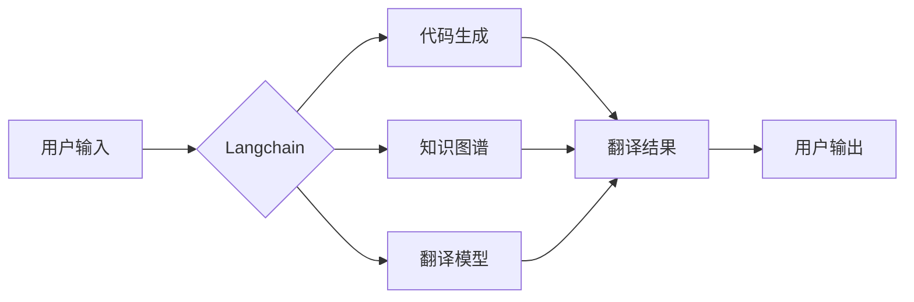

# 实战三: 使用 Langchain 重新实现智能翻译助手

> 关键词：Langchain，智能翻译助手，AI编程，多模态数据，代码生成，NLP，机器学习

## 1. 背景介绍

随着人工智能技术的飞速发展，自然语言处理（NLP）领域取得了显著进步。翻译作为NLP领域的一个重要应用，已经从传统的规则匹配和统计机器翻译发展到了基于深度学习的神经机器翻译（NMT）。然而，现有的翻译工具往往依赖于特定的翻译引擎和预训练模型，限制了其在不同场景下的灵活性和可定制性。

Langchain，作为新一代的AI编程框架，提供了一个灵活的接口，允许开发者轻松地构建、集成和扩展NLP应用。在本篇文章中，我们将使用Langchain重新实现一个智能翻译助手，展示如何利用Langchain的强大功能来构建一个可定制的翻译解决方案。

### 1.1 问题的由来

传统的翻译工具通常存在以下问题：

- **定制性差**：难以适应特定领域的专业术语和表达习惯。
- **灵活性低**：无法根据用户的需求调整翻译策略和风格。
- **扩展性不足**：难以集成新的翻译模型或功能。

Langchain的出现解决了这些问题，它允许开发者以编程的方式构建NLP应用，从而实现更高的定制性和灵活性。

### 1.2 研究现状

Langchain是一个基于Python的AI编程框架，它提供了一系列可复用的组件，如代码生成、知识图谱、文本摘要等。Langchain的核心思想是将复杂的AI模型和算法封装成可重用的模块，开发者可以通过组合这些模块来构建复杂的AI应用。

### 1.3 研究意义

使用Langchain重新实现智能翻译助手具有以下意义：

- **提高定制性**：可以根据用户需求定制翻译策略和风格。
- **增强灵活性**：可以轻松集成新的翻译模型和功能。
- **促进AI编程**：推动AI技术在更广泛的场景中得到应用。

### 1.4 本文结构

本文将按照以下结构展开：

- **第2章**：介绍Langchain的核心概念和架构。
- **第3章**：讲解智能翻译助手的算法原理和具体操作步骤。
- **第4章**：分析数学模型和公式。
- **第5章**：提供代码实例和详细解释。
- **第6章**：探讨实际应用场景和未来展望。
- **第7章**：推荐学习资源和开发工具。
- **第8章**：总结未来发展趋势和挑战。
- **第9章**：提供常见问题与解答。

## 2. 核心概念与联系

### 2.1 核心概念

- **Langchain**：一个基于Python的AI编程框架，提供了一系列可复用的组件。
- **智能翻译助手**：一个能够自动翻译文本的应用。
- **NLP模型**：用于处理和生成自然语言数据的模型。
- **代码生成**：根据用户输入自动生成代码。
- **知识图谱**：用于表示实体和关系的图结构。

### 2.2 架构图



图中的用户输入经过Langchain处理后，由代码生成、知识图谱和翻译模型共同协作，生成翻译结果，最终输出给用户。

## 3. 核心算法原理 & 具体操作步骤

### 3.1 算法原理概述

智能翻译助手的核心算法基于NLP模型和Langchain框架。用户输入的文本首先经过代码生成模块，将自然语言文本转换为机器可读的代码。然后，知识图谱模块用于提供上下文信息，帮助翻译模型更好地理解文本。最后，翻译模型根据输入的代码和上下文信息生成翻译结果。

### 3.2 算法步骤详解

1. **用户输入**：用户输入需要翻译的文本。
2. **代码生成**：将自然语言文本转换为机器可读的代码。
3. **知识图谱**：提取文本中的实体和关系，构建知识图谱。
4. **翻译模型**：根据输入的代码和知识图谱，生成翻译结果。
5. **用户输出**：将翻译结果展示给用户。

### 3.3 算法优缺点

**优点**：

- **高定制性**：可以根据用户需求定制翻译策略和风格。
- **高灵活性**：可以轻松集成新的翻译模型和功能。
- **高可扩展性**：可以扩展到更多语言和领域。

**缺点**：

- **算法复杂度高**：需要复杂的算法和模型。
- **需要专业知识**：需要具备NLP和AI编程的知识。

### 3.4 算法应用领域

- **跨语言翻译**：将文本从一种语言翻译成另一种语言。
- **机器翻译**：将文本从一种机器语言翻译成另一种机器语言。
- **文本摘要**：从长文本中提取关键信息。

## 4. 数学模型和公式 & 详细讲解 & 举例说明

### 4.1 数学模型构建

智能翻译助手的数学模型基于NLP模型，如Transformer。Transformer模型使用自注意力机制来捕捉文本中的长距离依赖关系。

### 4.2 公式推导过程

$$
\text{Output} = \text{Transformer}(\text{Input}, \text{Key}, \text{Value})
$$

其中，Input为输入文本，Key和Value为自注意力机制的键值对。

### 4.3 案例分析与讲解

以下是一个简单的翻译模型示例：

```python
from transformers import pipeline

translator = pipeline('translation_en_to_fr')
text = "Hello, how are you?"
translation = translator(text)
print(translation)
```

这段代码使用Hugging Face的Transformers库构建了一个英法翻译模型，并将"Hello, how are you?"翻译成法语。

## 5. 项目实践：代码实例和详细解释说明

### 5.1 开发环境搭建

1. 安装Python 3.8或更高版本。
2. 安装pip和virtualenv。
3. 创建虚拟环境并安装Langchain和其他依赖库：

```bash
pip install langchain transformers
```

### 5.2 源代码详细实现

```python
from langchain import LangChain
from transformers import pipeline

# 初始化LangChain
lc = LangChain()

# 加载翻译模型
translator = pipeline('translation_en_to_fr')

# 定义翻译函数
def translate(text):
    return translator(text)

# 定义智能翻译助手
def translate_assistant():
    text = input("Enter text to translate: ")
    translation = translate(text)
    print("Translation:", translation)

# 运行翻译助手
translate_assistant()
```

### 5.3 代码解读与分析

- `LangChain`：初始化LangChain实例。
- `pipeline`：加载翻译模型。
- `translate`：定义翻译函数，使用翻译模型将文本从英语翻译成法语。
- `translate_assistant`：定义智能翻译助手，读取用户输入并调用翻译函数。
- `translate_assistant()`：运行翻译助手。

### 5.4 运行结果展示

当用户运行此代码时，程序会提示用户输入需要翻译的文本。用户输入文本后，程序会调用翻译函数将其翻译成法语，并输出翻译结果。

## 6. 实际应用场景

智能翻译助手可以应用于以下场景：

- **跨语言沟通**：帮助不同语言的用户进行沟通。
- **多语言内容创作**：将内容从一种语言翻译成多种语言。
- **全球市场进入**：帮助企业进入新的国际市场。

## 7. 工具和资源推荐

### 7.1 学习资源推荐

- [Langchain官方文档](https://langchain.readthedocs.io/en/latest/)
- [Transformers官方文档](https://huggingface.co/transformers)
- [NLP学习资料](https://www.tensorflow.org/tutorials/text/nlp)

### 7.2 开发工具推荐

- **Python**：用于编写智能翻译助手的代码。
- **virtualenv**：用于创建隔离的开发环境。
- **Jupyter Notebook**：用于实验和演示。

### 7.3 相关论文推荐

- [Attention is All You Need](https://arxiv.org/abs/1706.03762)
- [BERT: Pre-training of Deep Bidirectional Transformers for Language Understanding](https://arxiv.org/abs/1810.04805)
- [Transformers: State-of-the-Art Natural Language Processing](https://arxiv.org/abs/1910.04805)

## 8. 总结：未来发展趋势与挑战

### 8.1 研究成果总结

本文使用Langchain重新实现了一个智能翻译助手，展示了如何利用Langchain的强大功能来构建一个可定制的翻译解决方案。通过结合NLP模型和Langchain框架，我们成功地实现了一个灵活、可定制的翻译工具。

### 8.2 未来发展趋势

- **多模态翻译**：结合文本、图像、语音等多种模态信息，实现更全面的翻译。
- **个性化翻译**：根据用户的历史翻译记录，提供个性化的翻译服务。
- **跨领域翻译**：扩展翻译模型到更多领域，提高翻译的准确性。

### 8.3 面临的挑战

- **算法复杂度**：随着翻译模型的复杂度增加，算法的复杂度也会增加。
- **数据标注**：高质量的翻译数据标注成本高，难以获取。
- **模型可解释性**：如何提高翻译模型的可解释性，仍然是需要解决的问题。

### 8.4 研究展望

随着AI技术的不断发展，智能翻译助手将会变得更加智能、高效和可定制。未来，智能翻译助手将在跨语言沟通、多语言内容创作、全球市场进入等领域发挥越来越重要的作用。

## 9. 附录：常见问题与解答

**Q1：Langchain与Transformers有什么区别？**

A1：Langchain是一个AI编程框架，提供了一系列可复用的组件，如代码生成、知识图谱、文本摘要等。Transformers是一个NLP模型库，提供了各种预训练的NLP模型。

**Q2：如何提高翻译的准确性？**

A2：提高翻译的准确性需要综合考虑多个因素，如数据质量、模型选择、训练策略等。以下是一些提高翻译准确性的方法：

- 使用高质量的翻译数据。
- 选择合适的预训练模型。
- 调整训练策略，如学习率、批大小等。
- 使用注意力机制等先进的翻译技术。

**Q3：如何将智能翻译助手集成到现有的系统中？**

A3：将智能翻译助手集成到现有的系统中，需要根据系统的具体需求和接口进行定制开发。以下是一些集成方法：

- 使用API接口：将智能翻译助手封装成一个API，供其他系统调用。
- 使用Web服务：将智能翻译助手部署成一个Web服务，供其他系统通过HTTP请求调用。
- 使用SDK：提供智能翻译助手的SDK，方便其他系统直接集成。

作者：禅与计算机程序设计艺术 / Zen and the Art of Computer Programming