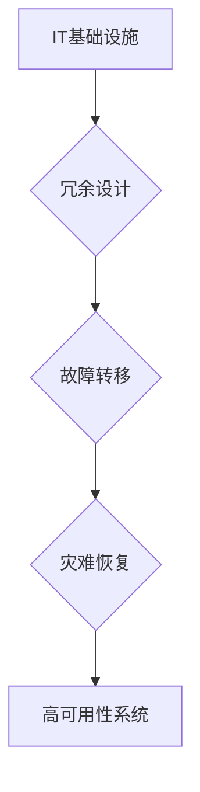
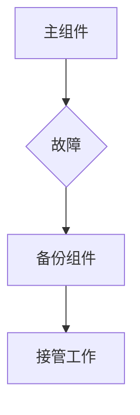
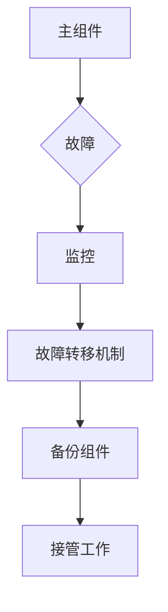
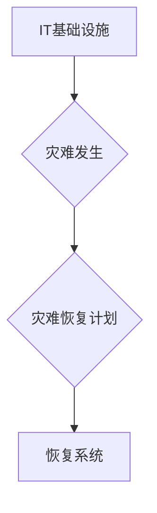

# 实现99.99%正常运行时间的方法

> 关键词：高可用性，冗余设计，故障转移，监控，灾难恢复，自动化，IT基础设施

## 1. 背景介绍

在现代企业中，IT系统的正常运行时间是衡量其可靠性和竞争力的重要指标。用户对服务的连续性要求越来越高，因此，确保系统达到99.99%的可用性（即每年只有约5.26分钟的停机时间）成为了企业的关键目标。本文将探讨实现99.99%正常运行时间的方法，包括核心概念、算法原理、项目实践、实际应用场景以及未来趋势。

## 2. 核心概念与联系

### 2.1 高可用性（HA）

高可用性是指系统在长时间内保持正常运行的能力。高可用性系统通常通过冗余设计、故障转移和灾难恢复等手段来实现。

#### Mermaid 流程图



### 2.2 冗余设计

冗余设计是指在系统中引入备份组件，以确保在主组件出现故障时，备份组件可以立即接管工作。

#### Mermaid 流程图



### 2.3 故障转移

故障转移是指当主组件出现故障时，系统自动将工作转移到备份组件的过程。

#### Mermaid 流程图



### 2.4 灾难恢复

灾难恢复是指在发生重大灾难时，系统能够迅速恢复正常运行的能力。

#### Mermaid 流程图



## 3. 核心算法原理 & 具体操作步骤

### 3.1 算法原理概述

实现高可用性的核心算法原理包括：

- **冗余设计**：通过添加备份组件来减少单点故障。
- **故障检测**：实时监控系统状态，检测潜在故障。
- **故障转移**：在检测到故障时，自动将工作转移到备份组件。
- **灾难恢复**：在发生灾难时，快速恢复系统运行。

### 3.2 算法步骤详解

1. **设计冗余系统**：根据业务需求，设计具有冗余设计的系统架构。
2. **实现故障检测**：使用监控工具实时监控系统状态。
3. **实现故障转移**：在检测到故障时，自动将工作转移到备份组件。
4. **制定灾难恢复计划**：在发生灾难时，按照计划快速恢复系统运行。

### 3.3 算法优缺点

**优点**：

- 提高系统可靠性，减少停机时间。
- 提高系统吞吐量，提高业务效率。
- 提高用户体验，增强用户满意度。

**缺点**：

- 增加系统复杂度，增加维护成本。
- 可能导致资源浪费。

### 3.4 算法应用领域

高可用性设计在以下领域具有广泛应用：

- 金融行业：银行、证券、保险等。
- 医疗行业：医院、诊所等。
- 电子商务：在线购物、在线支付等。
- 媒体行业：新闻、娱乐等。

## 4. 数学模型和公式 & 详细讲解 & 举例说明

### 4.1 数学模型构建

高可用性可以通过以下数学模型来衡量：

$$
Availability = \frac{MTBF}{MTBF + MTTR}
$$

其中，MTBF是平均无故障时间（Mean Time Between Failures），MTTR是平均修复时间（Mean Time To Repair）。

### 4.2 公式推导过程

MTBF是指在给定时间内系统无故障运行的概率。MTTR是指在系统发生故障后，修复所需的时间。

### 4.3 案例分析与讲解

假设一个系统的MTBF为1000小时，MTTR为10小时，则其可用性为：

$$
Availability = \frac{1000}{1000 + 10} \approx 99.9091\%
$$

这意味着该系统的可用性约为99.9091%。

## 5. 项目实践：代码实例和详细解释说明

### 5.1 开发环境搭建

为了演示高可用性设计，我们可以使用Kubernetes集群进行故障转移的实践。

### 5.2 源代码详细实现

以下是一个简单的Kubernetes故障转移示例代码：

```yaml
apiVersion: apps/v1
kind: Deployment
metadata:
  name: my-app
spec:
  replicas: 2
  selector:
    matchLabels:
      app: my-app
  template:
    metadata:
      labels:
        app: my-app
    spec:
      containers:
      - name: my-app
        image: my-app-image
        ports:
        - containerPort: 80
```

### 5.3 代码解读与分析

上述代码定义了一个名为`my-app`的Kubernetes Deployment，该Deployment有两个副本，如果其中一个副本出现故障，Kubernetes会自动将其删除并创建一个新的副本，从而实现故障转移。

### 5.4 运行结果展示

在实际部署后，可以通过以下命令查看副本状态：

```bash
kubectl get pods
```

如果某个副本出现故障，Kubernetes会自动创建一个新的副本，确保系统的高可用性。

## 6. 实际应用场景

### 6.1 金融行业

金融行业对系统的高可用性要求极高。例如，银行的核心交易系统需要保证99.99%的可用性，以防止资金损失和信誉损失。

### 6.2 医疗行业

医疗行业对系统的高可用性要求也非常高。例如，医院的电子病历系统需要保证99.99%的可用性，以防止患者信息丢失。

### 6.3 电子商务

电子商务平台需要保证99.99%的可用性，以防止交易中断和用户流失。

## 7. 工具和资源推荐

### 7.1 学习资源推荐

- 《高可用性系统设计》
- 《Kubernetes权威指南》
- 《Prometheus权威指南》

### 7.2 开发工具推荐

- Kubernetes
- Prometheus
- Grafana

### 7.3 相关论文推荐

- 《High Availability in the Internet》
- 《The Art of Scalability》

## 8. 总结：未来发展趋势与挑战

### 8.1 研究成果总结

本文介绍了实现99.99%正常运行时间的方法，包括核心概念、算法原理、项目实践、实际应用场景以及未来趋势。

### 8.2 未来发展趋势

- 软件定义一切：未来，更多的基础设施将采用软件定义的方式，提高系统的可扩展性和灵活性。
- AI赋能运维：人工智能技术将被广泛应用于运维领域，实现自动化故障检测、诊断和修复。
- 多云部署：企业将采用多云部署策略，提高系统的可用性和弹性。

### 8.3 面临的挑战

- 复杂性：随着系统规模的扩大，系统的复杂性也会增加，提高系统的可用性将变得更加困难。
- 安全性：随着攻击手段的不断升级，系统的安全性也将面临更大的挑战。
- 成本：实现99.99%的可用性需要投入大量资源，包括硬件、软件和人力。

### 8.4 研究展望

为了实现99.99%的可用性，未来的研究需要在以下方面取得突破：

- 简化系统架构，提高系统的可维护性和可扩展性。
- 加强安全性，提高系统的抗攻击能力。
- 降低成本，提高系统的性价比。

## 9. 附录：常见问题与解答

**Q1：如何提高系统的可用性？**

A：提高系统的可用性可以通过以下方法实现：

- 采用冗余设计，减少单点故障。
- 实现故障检测和故障转移机制。
- 制定灾难恢复计划。
- 使用高可用性硬件和软件。
- 定期进行系统测试和演练。

**Q2：如何选择合适的高可用性方案？**

A：选择合适的高可用性方案需要考虑以下因素：

- 业务需求：了解业务对可用性的具体要求。
- 技术可行性：评估所选方案的技术可行性。
- 成本效益：比较不同方案的性价比。
- 可维护性：考虑方案的维护难度。

**Q3：如何监控系统状态？**

A：监控系统状态可以使用以下方法：

- 使用监控工具：如Prometheus、Grafana等。
- 定期检查日志：分析系统日志，发现潜在问题。
- 定期进行性能测试：评估系统的性能指标。

**Q4：如何进行故障转移？**

A：进行故障转移可以使用以下方法：

- 使用故障转移工具：如Kubernetes、Zookeeper等。
- 手动转移：在出现故障时，手动将工作转移到备份组件。
- 自动转移：在检测到故障时，系统自动将工作转移到备份组件。

**Q5：如何进行灾难恢复？**

A：进行灾难恢复可以使用以下方法：

- 制定灾难恢复计划：明确恢复流程和步骤。
- 定期备份：定期备份重要数据。
- 恢复演练：定期进行恢复演练，验证恢复流程的有效性。

作者：禅与计算机程序设计艺术 / Zen and the Art of Computer Programming