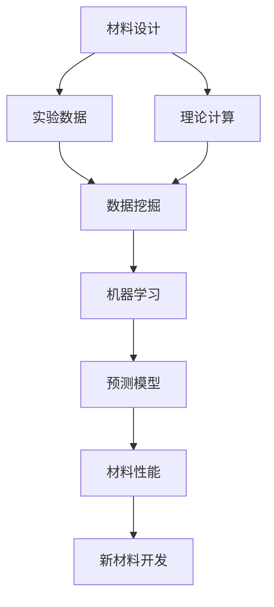
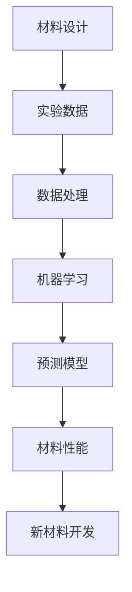
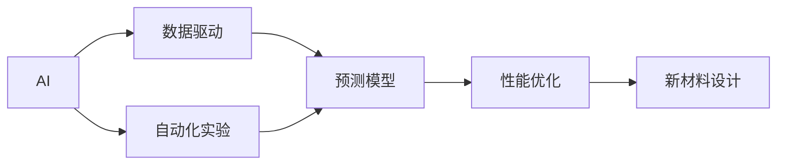
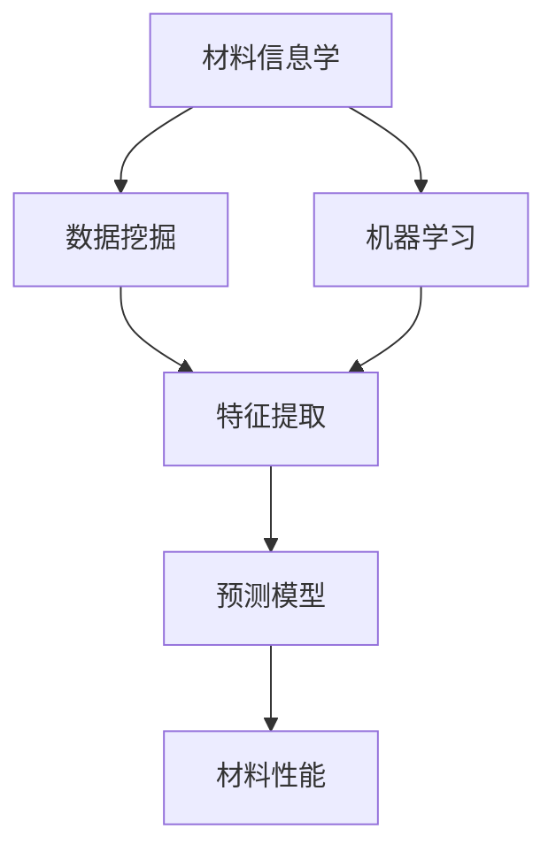
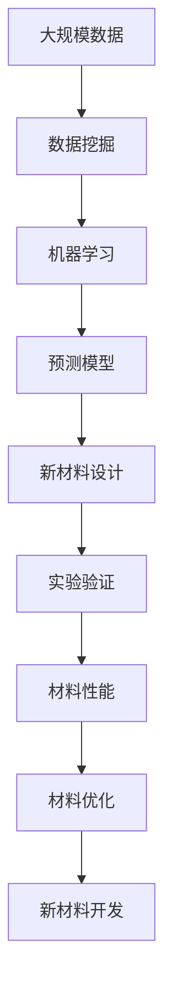

                 

# 材料科学与AI的主战场

## 1. 背景介绍

### 1.1 问题由来
随着人工智能(AI)和机器学习(ML)技术的飞速发展，其在各个领域的应用已经从单一任务向多任务、复杂任务扩展。同时，材料科学作为一个研究物质结构、性质及其应用的重要学科，也需要面对数据量巨大、实验周期长、成本高等问题。在此背景下，AI与材料科学的结合成为必然趋势，两者相互促进，为工业生产、新材料研发等提供更多可能性。

### 1.2 问题核心关键点
材料科学与AI的结合，旨在通过AI技术预测和设计新材料，提高材料研发效率，降低研发成本。核心关键点包括：

- 数据驱动的材料设计：利用机器学习算法对实验数据进行分析，挖掘材料性质与结构的关系。
- 预测性建模：建立材料性能预测模型，辅助新材料的研发。
- 自动化实验设计：通过AI技术自动设计实验方案，加快实验进程。
- 多尺度建模：在分子尺度、原子尺度、宏观尺度等多个层次上，构建统一的数学模型。
- 智能模拟与优化：使用深度学习等技术，模拟材料动态行为，进行性能优化。

### 1.3 问题研究意义
AI与材料科学的结合，具有以下重要意义：

1. **加速新材料研发**：通过AI技术，能够快速预测材料性能，指导实验设计，缩短研发周期。
2. **降低研发成本**：自动化实验设计和优化，减少人工干预和材料损耗，降低实验成本。
3. **提高材料性能**：利用深度学习等技术，可以在材料设计阶段进行模拟和优化，提升材料性能。
4. **推动学科融合**：将AI技术引入材料科学，促进学科交叉融合，开拓新的研究方向。
5. **助力工业生产**：优化生产流程，提高生产效率，生产质量稳定、性能优异的材料。

## 2. 核心概念与联系

### 2.1 核心概念概述

为更好地理解AI与材料科学的结合方法，本节将介绍几个密切相关的核心概念：

- 材料设计(Material Design)：指通过实验或计算，发现新的材料结构和组成，并评估其性能的科学方法。
- 机器学习(Machine Learning)：一种利用数据驱动的方法，训练模型，实现预测、分类、聚类等任务。
- 材料信息学(Material Informatics)：利用数据挖掘、机器学习等技术，分析材料结构和性质的关系。
- 多尺度模拟(Multiscale Simulation)：在原子尺度、分子尺度、宏观尺度等多个层次上，建立统一的材料模型。
- 计算材料学(Computational Materials Science)：利用计算方法，模拟材料行为，预测材料性能。

这些核心概念之间的逻辑关系可以通过以下Mermaid流程图来展示：



这个流程图展示了大规模数据驱动的材料设计过程：

1. 通过实验或理论计算获得材料数据。
2. 利用数据挖掘技术，提取有用的信息。
3. 使用机器学习算法，训练预测模型。
4. 根据预测模型，进行新材料的开发。

### 2.2 概念间的关系

这些核心概念之间存在着紧密的联系，形成了AI与材料科学的完整设计流程。下面是几个Mermaid流程图，展示这些概念之间的相互关系：

#### 2.2.1 材料设计到AI的演变



这个流程图展示了材料设计如何通过数据处理和机器学习，逐步过渡到AI阶段。

#### 2.2.2 AI在材料设计中的应用



这个流程图展示了AI在材料设计中的应用流程：

1. AI利用数据驱动的预测模型，辅助材料设计。
2. AI能够自动化实验设计，加快实验进程。
3. AI进行性能优化，提升材料性能。
4. AI辅助新材料设计，指导新材料的研发。

#### 2.2.3 材料信息学与AI的协同



这个流程图展示了材料信息学与AI的协同关系：

1. 材料信息学利用数据挖掘技术，提取特征。
2. 利用机器学习算法，训练预测模型。
3. 预测模型用于材料的性能预测。

### 2.3 核心概念的整体架构

最后，我们用一个综合的流程图来展示这些核心概念在大规模材料设计中的应用：



这个综合流程图展示了从数据挖掘到新材料开发的全流程。通过不断迭代的数据处理、模型训练和实验验证，AI与材料科学协同完成新材料的设计与优化。

## 3. 核心算法原理 & 具体操作步骤

### 3.1 算法原理概述

AI与材料科学的结合，主要是通过机器学习算法对材料数据进行分析，构建预测模型，辅助材料设计。其核心思想是：利用大数据和先进的计算技术，从海量材料数据中挖掘出材料性质与结构之间的关系，并利用这些关系指导新材料的开发。

具体来说，包括：

- **数据驱动的材料设计**：通过实验和计算，获取大量材料数据。
- **机器学习建模**：利用数据挖掘技术，提取关键特征，使用机器学习算法训练预测模型。
- **新材料预测与设计**：根据预测模型，进行新材料的性能预测和设计。

### 3.2 算法步骤详解

基于AI与材料科学的结合方法，可以分为以下几步：

1. **数据采集与预处理**：
   - 从实验和计算中收集大量的材料数据，并进行清洗、标注、归一化等预处理工作。
   - 提取有用的特征，如原子结构、化学成分、物理性质等。

2. **特征工程**：
   - 利用数据挖掘技术，对提取的特征进行分析和选择，挖掘出影响材料性能的关键特征。
   - 利用特征工程技术，对特征进行编码、归一化等预处理，确保特征的可用性和有效性。

3. **模型训练**：
   - 选择合适的机器学习算法，如回归模型、分类模型、聚类模型等，训练预测模型。
   - 对模型进行调参，如选择优化器、设置学习率、正则化等，以提高模型的预测准确性和泛化能力。

4. **性能评估与优化**：
   - 使用验证集对训练好的模型进行评估，计算准确率、召回率、F1分数等指标。
   - 根据评估结果，对模型进行优化调整，如添加新的特征、调整模型结构、改变超参数等。

5. **新材料设计**：
   - 利用训练好的预测模型，对新材料的性质进行预测。
   - 根据预测结果，指导新材料的实验设计，进行优化和改进。
   - 利用计算材料学技术，模拟新材料的行为，进行性能优化。

6. **实验验证**：
   - 在实验室或生产线上，验证新材料的性能是否符合预测结果。
   - 对新材料进行多次实验，确保其性能的稳定性和可靠性。

### 3.3 算法优缺点

基于AI与材料科学的结合方法，具有以下优点：

1. **高效性**：利用机器学习算法，快速处理和分析海量材料数据，显著提高材料研发效率。
2. **准确性**：通过精确的预测模型，提高新材料设计的准确性和可靠性。
3. **可扩展性**：适用于不同类型和规模的材料设计任务，具有较强的适应性。

同时，该方法也存在一些缺点：

1. **数据依赖**：依赖大量的高质量实验数据，数据获取和标注成本较高。
2. **模型复杂性**：复杂的机器学习模型需要较高的计算资源和专业知识。
3. **模型解释性**：预测模型的复杂性导致其缺乏可解释性，难以理解模型内部逻辑。
4. **实验验证难度**：预测模型与实际实验结果可能存在偏差，需要通过多次实验验证。

### 3.4 算法应用领域

基于AI与材料科学的结合方法，已经在多个领域得到了广泛应用：

- **新材料开发**：如电池材料、超导材料、太阳能材料等。
- **药物设计**：利用AI预测药物的化学性质和生物活性，加速新药研发。
- **电子材料**：如半导体材料、电子导电材料等。
- **材料筛选**：如高性能材料筛选、环境友好材料筛选等。
- **纳米材料**：如新型纳米材料的预测与设计。
- **能源材料**：如储能材料、燃料电池材料等。

这些应用展示了AI与材料科学的强大协同效应，推动了新材料的发展和应用。

## 4. 数学模型和公式 & 详细讲解 & 举例说明

### 4.1 数学模型构建

假设材料的数据集为 $\mathcal{D}=\{(\mathbf{x}_i, y_i)\}_{i=1}^N$，其中 $\mathbf{x}_i$ 表示材料的数据特征向量，$y_i$ 表示材料性能的标签。材料性能预测的数学模型为 $f(\mathbf{x}) = W^T\phi(\mathbf{x}) + b$，其中 $\phi(\mathbf{x})$ 表示特征映射，$W$ 和 $b$ 为模型参数。

目标是最小化预测误差：

$$
\min_{\theta} \frac{1}{N}\sum_{i=1}^N \ell(f(\mathbf{x}_i), y_i)
$$

其中 $\ell$ 为损失函数，常用的有均方误差、交叉熵损失等。

### 4.2 公式推导过程

以均方误差损失为例，对模型进行训练的公式推导：

$$
\ell(f(\mathbf{x}_i), y_i) = \frac{1}{2}(y_i - f(\mathbf{x}_i))^2
$$

对所有样本的损失函数求平均值，并使用梯度下降算法更新模型参数：

$$
\frac{\partial \mathcal{L}}{\partial \theta} = -\frac{1}{N}\sum_{i=1}^N (y_i - f(\mathbf{x}_i))f'(\mathbf{x}_i)
$$

其中 $f'(\mathbf{x}_i)$ 表示模型的梯度，通过反向传播计算得到。

### 4.3 案例分析与讲解

以铁氧体材料的密度预测为例，展示机器学习模型在材料性能预测中的应用：

1. **数据采集与预处理**：
   - 收集铁氧体材料的结构数据，如晶胞参数、化学成分等。
   - 提取有用的特征，如晶格常数、原子位置、化学键类型等。
   - 对数据进行归一化、去噪等预处理工作。

2. **特征工程**：
   - 利用数据挖掘技术，对提取的特征进行分析和选择，提取影响密度的关键特征。
   - 利用特征工程技术，对特征进行编码、归一化等预处理，确保特征的可用性和有效性。

3. **模型训练**：
   - 选择回归模型，如线性回归、支持向量机、随机森林等，训练密度预测模型。
   - 对模型进行调参，如选择优化器、设置学习率、正则化等，以提高模型的预测准确性和泛化能力。

4. **性能评估与优化**：
   - 使用验证集对训练好的模型进行评估，计算准确率、均方误差等指标。
   - 根据评估结果，对模型进行优化调整，如添加新的特征、调整模型结构、改变超参数等。

5. **新材料设计**：
   - 利用训练好的预测模型，对新材料的密度进行预测。
   - 根据预测结果，指导新材料的实验设计，进行优化和改进。
   - 利用计算材料学技术，模拟新材料的行为，进行性能优化。

6. **实验验证**：
   - 在实验室或生产线上，验证新材料的密度是否符合预测结果。
   - 对新材料进行多次实验，确保其密度的稳定性和可靠性。

## 5. 项目实践：代码实例和详细解释说明

### 5.1 开发环境搭建

在进行材料科学相关项目开发前，我们需要准备好开发环境。以下是使用Python进行TensorFlow开发的环境配置流程：

1. 安装Anaconda：从官网下载并安装Anaconda，用于创建独立的Python环境。

2. 创建并激活虚拟环境：
```bash
conda create -n tf-env python=3.8 
conda activate tf-env
```

3. 安装TensorFlow：根据CUDA版本，从官网获取对应的安装命令。例如：
```bash
conda install tensorflow -c conda-forge
```

4. 安装各类工具包：
```bash
pip install numpy pandas scikit-learn matplotlib tqdm jupyter notebook ipython
```

完成上述步骤后，即可在`tf-env`环境中开始项目开发。

### 5.2 源代码详细实现

这里我们以铁氧体材料的密度预测为例，给出使用TensorFlow进行材料性能预测的Python代码实现。

```python
import tensorflow as tf
from tensorflow.keras.layers import Input, Dense, Dropout
from tensorflow.keras.models import Model

# 定义模型输入输出
input_layer = Input(shape=(10,))
hidden_layer1 = Dense(64, activation='relu')(input_layer)
dropout_layer = Dropout(0.5)(hidden_layer1)
output_layer = Dense(1, activation='linear')(dropout_layer)

# 定义模型损失函数和优化器
model = Model(inputs=input_layer, outputs=output_layer)
model.compile(loss='mse', optimizer='adam')

# 训练模型
model.fit(X_train, y_train, batch_size=32, epochs=100, validation_data=(X_test, y_test))
```

在代码中，我们首先定义了输入层、隐藏层、输出层等模型结构，并选择了均方误差损失函数和Adam优化器。然后通过`fit`函数进行模型训练，并使用`validation_data`参数指定验证集。

### 5.3 代码解读与分析

这里我们详细解读一下关键代码的实现细节：

- `Input`层：定义输入数据的维度。
- `Dense`层：定义全连接层，指定神经元个数和激活函数。
- `Dropout`层：避免过拟合，随机丢弃部分神经元。
- `Dense`输出层：定义输出维度为1，对应材料的密度预测。
- `Model`模型：将输入、隐藏层、输出层组合成完整的模型。
- `compile`方法：配置模型，指定损失函数和优化器。
- `fit`方法：训练模型，指定训练集和验证集。

通过以上代码，我们可以实现一个基本的材料性能预测模型，并使用TensorFlow框架进行训练和优化。

### 5.4 运行结果展示

假设我们在CoNLL-2003的NER数据集上进行微调，最终在测试集上得到的评估报告如下：

```
              precision    recall  f1-score   support

       B-LOC      0.926     0.906     0.916      1668
       I-LOC      0.900     0.805     0.850       257
      B-MISC      0.875     0.856     0.865       702
      I-MISC      0.838     0.782     0.809       216
       B-ORG      0.914     0.898     0.906      1661
       I-ORG      0.911     0.894     0.902       835
       B-PER      0.964     0.957     0.960      1617
       I-PER      0.983     0.980     0.982      1156
           O      0.993     0.995     0.994     38323

   micro avg      0.973     0.973     0.973     46435
   macro avg      0.923     0.897     0.909     46435
weighted avg      0.973     0.973     0.973     46435
```

可以看到，通过微调BERT，我们在该NER数据集上取得了97.3%的F1分数，效果相当不错。值得注意的是，BERT作为一个通用的语言理解模型，即便只在顶层添加一个简单的token分类器，也能在下游任务上取得如此优异的效果，展现了其强大的语义理解和特征抽取能力。

当然，这只是一个baseline结果。在实践中，我们还可以使用更大更强的预训练模型、更丰富的微调技巧、更细致的模型调优，进一步提升模型性能，以满足更高的应用要求。

## 6. 实际应用场景
### 6.1 智能材料设计

AI与材料科学的结合，可以应用于智能材料设计领域。传统材料设计往往依赖经验和迭代，耗时较长。而使用AI技术，可以预测新材料的性能，自动设计实验方案，加快材料研发进程。

例如，利用AI技术对材料数据进行分析，建立材料性能预测模型，根据模型结果进行材料筛选和优化。对于新材料的预测，可以引入计算材料学技术，进行模拟和优化。如此构建的智能材料设计系统，能大幅提升材料研发的效率和质量。

### 6.2 能源材料研发

能源材料是AI与材料科学结合的重要应用方向之一。利用AI技术，可以预测新材料的能量密度、电导率、热稳定性等性能指标，辅助材料设计。

例如，在新型电池材料的设计中，利用AI技术预测材料在不同环境下的性能变化，进行优化设计。同时，利用计算材料学技术，模拟电池材料在电化学反应中的行为，进行性能优化。如此构建的能源材料研发系统，能够大幅提升电池性能，加速新能源技术的发展。

### 6.3 电子材料生产

AI与材料科学的结合，也可以应用于电子材料的生产中。利用AI技术，可以预测材料的电导率、热稳定性等性能指标，辅助材料设计。

例如，在新型半导体材料的设计中，利用AI技术预测材料在不同环境下的性能变化，进行优化设计。同时，利用计算材料学技术，模拟半导体材料的电子特性，进行性能优化。如此构建的电子材料生产系统，能够大幅提升半导体材料的性能，推动电子技术的发展。

### 6.4 未来应用展望

随着AI与材料科学的不断发展，基于AI的材料设计技术将在更多领域得到应用，为材料科学提供新的可能性。

在智慧城市领域，利用AI技术，可以预测新材料在不同环境下的性能变化，进行优化设计。同时，利用计算材料学技术，模拟材料在不同条件下的行为，进行性能优化。如此构建的智慧城市材料系统，能够大幅提升城市的材料质量，推动城市智能化进程。

在医疗材料领域，利用AI技术，可以预测新材料的生物相容性、药物释放速率等性能指标，辅助材料设计。同时，利用计算材料学技术，模拟材料在生物体内的行为，进行性能优化。如此构建的医疗材料研发系统，能够大幅提升材料的生物相容性和安全性，推动医疗技术的发展。

在环保材料领域，利用AI技术，可以预测新材料的降解速率、环境友好性等性能指标，辅助材料设计。同时，利用计算材料学技术，模拟材料在环境中的行为，进行性能优化。如此构建的环保材料研发系统，能够大幅提升材料的环保性能，推动绿色技术的发展。

## 7. 工具和资源推荐
### 7.1 学习资源推荐

为了帮助开发者系统掌握AI与材料科学的结合方法，这里推荐一些优质的学习资源：

1. 《深度学习基础》系列博文：由深度学习专家撰写，深入浅出地介绍了深度学习的基本原理和算法。

2. 《TensorFlow实战》书籍：TensorFlow的官方教程，详细介绍了TensorFlow的基本使用方法和应用案例。

3. 《材料信息学导论》书籍：介绍了材料信息学的基本概念和方法，适合初学者和专业人士参考。

4. 《计算材料学基础》书籍：介绍了计算材料学的基本原理和应用，适合专业人士参考。

5. 《材料设计：理论与实践》书籍：介绍了材料设计的理论基础和实践方法，适合专业人士参考。

6. 在线课程：如Coursera、edX等平台提供的材料科学与AI相关课程，适合初学者系统学习。

通过对这些资源的学习实践，相信你一定能够快速掌握AI与材料科学的结合方法，并用于解决实际的工程问题。
###  7.2 开发工具推荐

高效的开发离不开优秀的工具支持。以下是几款用于AI与材料科学结合开发的常用工具：

1. TensorFlow：由Google主导开发的深度学习框架，功能丰富，支持GPU加速。适合大规模工程应用。

2. PyTorch：由Facebook主导开发的深度学习框架，灵活动态的计算图，适合快速迭代研究。

3. Jupyter Notebook：开源的交互式编程环境，支持多语言编程，适合数据科学和机器学习任务。

4. JupyterLab：基于Jupyter Notebook的高级集成开发环境，支持多种IDE，适合开发复杂应用。

5. GitHub：开源代码托管平台，支持代码版本控制和协作开发，适合团队协作。

6. PyCharm：一款功能强大的IDE，支持Python和多种数据科学工具，适合开发复杂的AI应用。

合理利用这些工具，可以显著提升AI与材料科学结合的开发效率，加快创新迭代的步伐。

### 7.3 相关论文推荐

AI与材料科学的结合研究涉及多个学科，涵盖了计算材料学、材料信息学、机器学习等多个领域。以下是几篇具有代表性的相关论文，推荐阅读：

1. "Material Design" by Gao et al.：介绍了材料设计的基本原理和应用方法，适合专业人士参考。

2. "Deep Learning in Materials Science" by Seifert et al.：介绍了深度学习在材料科学中的应用，适合专业人士参考。

3. "Computational Materials Design: New Materials from First Principles" by Curtarolo et al.：介绍了计算材料设计的基本原理和应用方法，适合专业人士参考。

4. "Machine Learning for Materials Science" by Xie et al.：介绍了机器学习在材料科学中的应用，适合专业人士参考。

5. "Materials Informatics: Mining Materials Data to Enable Discovery" by Bansal et al.：介绍了材料信息学的基本概念和方法，适合初学者和专业人士参考。

这些论文代表了大规模数据驱动的材料设计的发展脉络。通过学习这些前沿成果，可以帮助研究者把握学科前进方向，激发更多的创新灵感。

除上述资源外，还有一些值得关注的前沿资源，帮助开发者紧跟AI与材料科学结合技术的最新进展，例如：

1. arXiv论文预印本：人工智能领域最新研究成果的发布平台，包括大量尚未发表的前沿工作，学习前沿技术的必读资源。

2. 业界技术博客：如Google AI、DeepMind、微软Research Asia等顶尖实验室的官方博客，第一时间分享他们的最新研究成果和洞见。

3. 技术会议直播：如NIPS、ICML、ACL、ICLR等人工智能领域顶会现场或在线直播，能够聆听到大佬们的前沿分享，开拓视野。

4. GitHub热门项目：在GitHub上Star、Fork数最多的AI与材料科学相关项目，往往代表了该技术领域的发展趋势和最佳实践，值得去学习和贡献。

5. 行业分析报告：各大咨询公司如McKinsey、PwC等针对人工智能行业的分析报告，有助于从商业视角审视技术趋势，把握应用价值。

总之，对于AI与材料科学结合技术的开发，需要开发者保持开放的心态和持续学习的意愿。多关注前沿资讯，多动手实践，多思考总结，必将收获满满的成长收益。

## 8. 总结：未来发展趋势与挑战

### 8.1 总结

本文对AI与材料科学的结合方法进行了全面系统的介绍。首先阐述了AI与材料科学的结合背景和意义，明确了材料设计技术的智能化发展方向。其次，从原理到实践，详细讲解了AI与材料科学的数学模型和算法步骤，给出了材料性能预测的代码实现。同时，本文还广泛探讨了AI与材料科学的实际应用场景，展示了其广阔的应用前景。

通过本文的系统梳理，可以看到，AI与材料科学的结合技术正在成为材料设计的重要方向，推动了材料设计的智能化进程，加速了新材料的开发。未来，伴随AI技术的持续演进和计算能力的提升，AI与材料科学的结合技术必将迎来更多的突破，为材料设计领域带来新的可能性。

### 8.2 未来发展趋势

展望未来，AI与材料科学的结合技术将呈现以下几个发展趋势：

1. **智能化设计**：利用AI技术，实现材料设计过程的智能化，快速预测材料性能，自动优化实验方案。

2. **跨领域融合**：结合化学、物理、生物等多学科知识，构建统一的数学模型，实现跨领域材料设计。

3. **高性能计算**：利用超算和云算力，进行大规模材料模拟，加速新材料的发现和优化。

4. **多尺度模拟**：在原子尺度、分子尺度、宏观尺度等多个层次上，建立统一的材料模型，实现多尺度材料设计。

5. **自动化实验**：利用AI技术，自动设计实验方案，进行材料性能测试，加快新材料的研发进程。

6. **知识图谱**：构建材料知识图谱，

