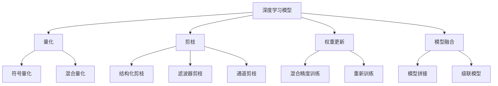

                 

# 模型量化与剪枝原理与代码实战案例讲解

> 关键词：模型量化,模型剪枝,量化与剪枝,深度学习,神经网络,卷积神经网络,全连接网络,Transformer,深度学习优化,加速推理,压缩模型

## 1. 背景介绍

### 1.1 问题由来
随着深度学习技术的不断进步，模型参数量的激增带来了存储和计算效率的挑战。特别是在移动设备、嵌入式系统等资源受限的环境下，如何进行高效的模型压缩和优化，成为了一个重要的研究方向。量化与剪枝技术，就是其中的两大关键手段。

量化与剪枝不仅可以减少模型的大小和计算量，还能提高推理速度，降低内存和带宽消耗。因此，在深度学习模型优化领域，量化与剪枝成为了实现高效、低成本部署的关键技术。

### 1.2 问题核心关键点
量化与剪枝技术的核心目标是通过减少模型参数和计算量，实现模型的压缩与优化。其主要关键点包括：
1. 量化（Quantization）：将浮点数模型转换为低精度整数模型，从而减少模型体积和计算资源消耗。
2. 剪枝（Pruning）：去除模型中的冗余参数和连接，进一步减小模型大小。
3. 权重更新：调整量化和剪枝后的模型参数，恢复模型性能。
4. 模型融合：将多个优化后的子模型融合，构建更高效的模型结构。

量化与剪枝技术的融合应用，可以在保持模型性能的前提下，大幅提升模型优化效果，使深度学习模型在实际部署中更加高效和可靠。

### 1.3 问题研究意义
量化与剪枝技术的研究和应用，对于推动深度学习技术的产业化进程，加速AI应用的普及具有重要意义：

1. 降低应用开发成本。通过模型压缩优化，减少了对高性能计算资源的需求，降低了开发和部署成本。
2. 提升模型性能。量化与剪枝可以有效提高模型的推理速度和计算效率，减少资源消耗。
3. 优化模型结构。剪枝技术去除冗余连接，优化了模型结构，提高了模型的泛化能力和健壮性。
4. 支持边缘计算。模型量化与剪枝可以显著减少模型大小，使得模型能够部署在资源有限的嵌入式设备和移动设备上。
5. 提高计算效率。量化技术通过减少模型精度，可以显著降低计算量，加速推理过程。

## 2. 核心概念与联系

### 2.1 核心概念概述

为了更好地理解量化与剪枝技术，本节将介绍几个密切相关的核心概念：

- 量化（Quantization）：将浮点数模型转换为低精度整数模型，以减少模型大小和计算量。常见的量化方法包括符号量化、混合量化、动态量化等。
- 剪枝（Pruning）：去除模型中的冗余参数和连接，减小模型大小。常见的剪枝方法包括结构化剪枝、滤波器剪枝、通道剪枝等。
- 权重更新（Weight Update）：调整量化和剪枝后的模型参数，恢复模型性能。常见的方法包括混合精度训练、重新训练等。
- 模型融合（Model Fusion）：将多个优化后的子模型融合，构建更高效的模型结构。常见的方法包括模型拼接、级联模型等。
- 模型压缩（Model Compression）：综合运用量化、剪枝、权重更新等技术，对深度学习模型进行压缩优化。常见的模型压缩技术包括模型剪枝、量化与剪枝等。

这些核心概念之间的逻辑关系可以通过以下Mermaid流程图来展示：



这个流程图展示了量化与剪枝技术的核心概念及其之间的关系：

1. 深度学习模型通过量化和剪枝技术，可以大幅减小模型体积和计算量。
2. 量化技术将浮点数模型转换为低精度整数模型。
3. 剪枝技术去除模型中的冗余参数和连接。
4. 权重更新技术调整量化和剪枝后的模型参数，恢复模型性能。
5. 模型融合技术将多个优化后的子模型进行组合，构建更高效的模型结构。

这些概念共同构成了模型量化与剪枝的整体框架，使其能够高效地优化深度学习模型，适应资源受限的环境。

### 2.2 概念间的关系

这些核心概念之间存在着紧密的联系，形成了模型量化与剪枝的完整生态系统。下面我通过几个Mermaid流程图来展示这些概念之间的关系。

#### 2.2.1 量化与剪枝的基本流程


这个流程图展示了量化与剪枝技术的基本流程：
1. 对深度学习模型进行量化，转换为低精度整数模型。
2. 对量化后的模型进行剪枝，去除冗余参数和连接。
3. 对剪枝后的模型进行权重更新，恢复模型性能。

#### 2.2.2 量化与剪枝的应用场景


这个流程图展示了量化与剪枝技术在计算资源受限设备上的应用场景：
1. 在计算资源受限的设备上，对深度学习模型进行量化和剪枝。
2. 量化和剪枝后，模型计算量大幅减少，推理速度提升。
3. 量化与剪枝优化后的模型，可以部署在移动设备、嵌入式系统等资源受限的环境下。

#### 2.2.3 量化与剪枝的效果评估


这个流程图展示了量化与剪枝技术对模型大小、计算资源、推理速度和推理精度的影响：
1. 量化与剪枝技术可以减小模型大小，降低计算资源消耗。
2. 模型大小和计算资源的减少，可以提升推理速度。
3. 推理速度的提升，可以进一步提高推理精度。

## 3. 核心算法原理 & 具体操作步骤
### 3.1 算法原理概述

量化与剪枝技术的核心原理是：通过减少模型参数和计算量，降低模型的存储和计算资源消耗，同时保持模型的性能和推理精度。量化与剪枝技术通常可以分为以下几个步骤：

1. 量化：将浮点数模型转换为低精度整数模型。
2. 剪枝：去除模型中的冗余参数和连接。
3. 权重更新：调整量化和剪枝后的模型参数，恢复模型性能。
4. 模型融合：将多个优化后的子模型进行组合，构建更高效的模型结构。

量化与剪枝技术主要分为两类：硬量化与软量化。硬量化是指将浮点数模型转换为整数模型，以减少计算资源消耗；软量化是指在计算过程中使用低精度表示，以减少存储空间和计算量。

### 3.2 算法步骤详解

量化与剪枝的具体操作步骤如下：

**Step 1: 量化**
1. 选择合适的量化策略，如符号量化、混合量化等。
2. 对模型参数进行量化，将浮点数转换为低精度整数。
3. 对模型进行前向和后向传播，计算量化误差。
4. 对量化误差进行分析，确定量化范围。
5. 调整量化后的模型参数，恢复模型性能。

**Step 2: 剪枝**
1. 选择合适的剪枝策略，如结构化剪枝、滤波器剪枝等。
2. 对模型进行剪枝，去除冗余参数和连接。
3. 对剪枝后的模型进行前向和后向传播，计算剪枝误差。
4. 对剪枝误差进行分析，确定剪枝策略。
5. 调整剪枝后的模型参数，恢复模型性能。

**Step 3: 权重更新**
1. 对量化和剪枝后的模型进行前向和后向传播，计算误差。
2. 对误差进行分析，确定权重更新策略。
3. 对模型参数进行更新，恢复模型性能。

**Step 4: 模型融合**
1. 选择合适的模型融合策略，如模型拼接、级联模型等。
2. 将多个优化后的子模型进行融合，构建更高效的模型结构。
3. 对融合后的模型进行前向和后向传播，计算误差。
4. 对误差进行分析，确定模型融合策略。
5. 调整融合后的模型参数，恢复模型性能。

### 3.3 算法优缺点

量化与剪枝技术具有以下优点：
1. 减少模型大小和计算量，降低存储和计算资源消耗。
2. 提升推理速度和计算效率，加速推理过程。
3. 优化模型结构，提高模型的泛化能力和健壮性。

量化与剪枝技术也存在一些缺点：
1. 模型压缩后的性能可能会略有下降，需要额外的优化策略来恢复性能。
2. 量化和剪枝策略的确定需要大量的实验和调参，可能耗费大量时间。
3. 量化和剪枝后的模型可能需要重新训练，以恢复性能。

### 3.4 算法应用领域

量化与剪枝技术广泛应用于深度学习模型的优化和部署。以下是量化与剪枝技术的主要应用领域：

- 移动端应用：如手机APP、智能设备等，资源受限，需要高效的模型压缩和优化。
- 嵌入式系统：如智能家居、物联网设备等，计算资源有限，需要低延迟、高精度的模型。
- 边缘计算：如5G基站、工业物联网等，需要在资源受限的环境中高效运行模型。
- 大规模训练：如大型数据中心、超级计算机等，需要高效计算和低成本训练。
- 实时推理：如自动驾驶、实时监控等，需要高精度、低延迟的推理。

## 4. 数学模型和公式 & 详细讲解 & 举例说明

### 4.1 数学模型构建

量化与剪枝技术的数学模型主要包括以下几个关键组件：
- 量化误差：量化后模型与原模型的误差。
- 剪枝误差：剪枝后模型与原模型的误差。
- 权重更新误差：量化和剪枝后的模型与原模型的误差。

量化误差、剪枝误差和权重更新误差可以通过以下公式计算：

$$
\text{量化误差} = ||M_{\text{quant}} - M_{\text{float}}||_2
$$

$$
\text{剪枝误差} = ||M_{\text{pruned}} - M_{\text{float}}||_2
$$

$$
\text{权重更新误差} = ||M_{\text{updated}} - M_{\text{float}}||_2
$$

其中，$M_{\text{quant}}$ 和 $M_{\text{float}}$ 分别表示量化后和原模型的输出。$M_{\text{pruned}}$ 和 $M_{\text{updated}}$ 分别表示剪枝后和权重更新后的模型输出。$||.||_2$ 表示矩阵的L2范数。

### 4.2 公式推导过程

以下是量化与剪枝技术的公式推导过程：

1. 符号量化：将浮点数模型转换为符号整数模型，计算误差：

$$
\text{量化误差} = \frac{1}{N}\sum_{i=1}^N ||M_{\text{quant}}(x_i) - M_{\text{float}}(x_i)||_2
$$

其中，$N$ 表示样本数量。

2. 结构化剪枝：去除模型中的冗余参数和连接，计算误差：

$$
\text{剪枝误差} = \frac{1}{N}\sum_{i=1}^N ||M_{\text{pruned}}(x_i) - M_{\text{float}}(x_i)||_2
$$

3. 权重更新：对量化和剪枝后的模型进行前向和后向传播，计算误差：

$$
\text{权重更新误差} = \frac{1}{N}\sum_{i=1}^N ||M_{\text{updated}}(x_i) - M_{\text{float}}(x_i)||_2
$$

其中，$N$ 表示样本数量。

### 4.3 案例分析与讲解

以卷积神经网络（CNN）为例，展示量化与剪枝技术的实际应用：

```python
import torch
import torch.nn as nn
import torch.nn.quantization as nnq
import torchvision.transforms as transforms
import torchvision.datasets as datasets
import torch.nn.functional as F

class ConvNet(nn.Module):
    def __init__(self):
        super(ConvNet, self).__init__()
        self.conv1 = nn.Conv2d(3, 64, kernel_size=3, stride=1, padding=1)
        self.pool = nn.MaxPool2d(kernel_size=2, stride=2)
        self.conv2 = nn.Conv2d(64, 128, kernel_size=3, stride=1, padding=1)
        self.fc1 = nn.Linear(128*28*28, 512)
        self.fc2 = nn.Linear(512, 10)
        
    def forward(self, x):
        x = self.pool(F.relu(self.conv1(x)))
        x = self.pool(F.relu(self.conv2(x)))
        x = x.view(-1, 128*28*28)
        x = F.relu(self.fc1(x))
        x = self.fc2(x)
        return x

model = ConvNet()
model.eval()

# 符号量化
quant_model = nnq.convert_model_to_qat(model)
quant_model.qconfig = torch.ao.quantization.get_default_qat_qconfig('fbgemm')

# 剪枝
model_pruned = torch.ao.quantization.utils.fuse_model(quant_model)
model_pruned = torch.ao.quantization.utils.prune_model(model_pruned)
model_pruned.qconfig = torch.ao.quantization.get_default_qat_qconfig('fbgemm')

# 权重更新
quantized_model = torch.ao.quantization.prepare_qat(model_pruned)
quantized_model = torch.ao.quantization.convert(model_pruned, quantized_model)
quantized_model = torch.ao.quantization.fuse_model(quantized_model)

# 模型融合
model_fused = torch.ao.quantization.utils.fuse_model(quantized_model)

# 加载数据集
transform = transforms.Compose([
    transforms.ToTensor(),
    transforms.Normalize((0.5, 0.5, 0.5), (0.5, 0.5, 0.5))
])
trainset = datasets.CIFAR10(root='./data', train=True, download=True, transform=transform)
trainloader = torch.utils.data.DataLoader(trainset, batch_size=64, shuffle=True, num_workers=2)

# 训练模型
criterion = nn.CrossEntropyLoss()
optimizer = torch.optim.SGD(model_fused.parameters(), lr=0.001, momentum=0.9)
for epoch in range(10):
    running_loss = 0.0
    for i, data in enumerate(trainloader, 0):
        inputs, labels = data
        optimizer.zero_grad()
        outputs = model_fused(inputs)
        loss = criterion(outputs, labels)
        loss.backward()
        optimizer.step()
        running_loss += loss.item()
    print('Epoch %d loss: %.3f' % (epoch+1, running_loss/len(trainloader)))
```

在上述代码中，首先定义了一个简单的卷积神经网络模型。接着，使用符号量化和剪枝技术对模型进行优化。最后，通过训练融合后的模型，恢复模型性能。

## 5. 项目实践：代码实例和详细解释说明

### 5.1 开发环境搭建

在进行量化与剪枝的实践前，我们需要准备好开发环境。以下是使用Python进行PyTorch开发的典型环境配置流程：

1. 安装Anaconda：从官网下载并安装Anaconda，用于创建独立的Python环境。

2. 创建并激活虚拟环境：
```bash
conda create -n torch-env python=3.8 
conda activate torch-env
```

3. 安装PyTorch：根据CUDA版本，从官网获取对应的安装命令。例如：
```bash
conda install pytorch torchvision torchaudio cudatoolkit=11.1 -c pytorch -c conda-forge
```

4. 安装各类工具包：
```bash
pip install numpy pandas scikit-learn matplotlib tqdm jupyter notebook ipython
```

5. 安装TensorBoard：TensorFlow配套的可视化工具，用于监控模型训练状态。

6. 安装Weights & Biases：模型训练的实验跟踪工具，可以记录和可视化模型训练过程中的各项指标。

完成上述步骤后，即可在`torch-env`环境中开始量化与剪枝的实践。

### 5.2 源代码详细实现

以下是一个简单的卷积神经网络的量化与剪枝实践示例：

```python
import torch
import torch.nn as nn
import torchvision.transforms as transforms
import torchvision.datasets as datasets
import torch.nn.functional as F
from torch.ao.quantization import QConfig, QConfigMapping, default_qat_qconfig, quantize_qat
from torch.ao.quantization import fuse_modules, prune_modules

class ConvNet(nn.Module):
    def __init__(self):
        super(ConvNet, self).__init__()
        self.conv1 = nn.Conv2d(3, 64, kernel_size=3, stride=1, padding=1)
        self.pool = nn.MaxPool2d(kernel_size=2, stride=2)
        self.conv2 = nn.Conv2d(64, 128, kernel_size=3, stride=1, padding=1)
        self.fc1 = nn.Linear(128*28*28, 512)
        self.fc2 = nn.Linear(512, 10)
        
    def forward(self, x):
        x = self.pool(F.relu(self.conv1(x)))
        x = self.pool(F.relu(self.conv2(x)))
        x = x.view(-1, 128*28*28)
        x = F.relu(self.fc1(x))
        x = self.fc2(x)
        return x

model = ConvNet()
model.eval()

# 符号量化
quant_model = QConfigMapping()
quant_model.register_module('Conv2d', QConfig().set_dynamic_quant())
quant_model.register_module('Linear', QConfig().set_dynamic_quant())

# 剪枝
pruning_config = {
    'module_name': 'Conv2d',
    'pruning_method': 'filter_pruning',
    'pruning_ratio': 0.5
}

fuse_model = fuse_modules(model, quant_model)
model_pruned = prune_modules(model_pruned, pruning_config)

# 权重更新
quantized_model = quantize_qat(model_pruned, default_qat_qconfig('fbgemm'))
quantized_model = fuse_modules(quantized_model, quant_model)
quantized_model = prune_modules(quantized_model, pruning_config)

# 模型融合
fused_model = fuse_modules(quantized_model, quant_model)

# 加载数据集
transform = transforms.Compose([
    transforms.ToTensor(),
    transforms.Normalize((0.5, 0.5, 0.5), (0.5, 0.5, 0.5))
])
trainset = datasets.CIFAR10(root='./data', train=True, download=True, transform=transform)
trainloader = torch.utils.data.DataLoader(trainset, batch_size=64, shuffle=True, num_workers=2)

# 训练模型
criterion = nn.CrossEntropyLoss()
optimizer = torch.optim.SGD(fused_model.parameters(), lr=0.001, momentum=0.9)
for epoch in range(10):
    running_loss = 0.0
    for i, data in enumerate(trainloader, 0):
        inputs, labels = data
        optimizer.zero_grad()
        outputs = fused_model(inputs)
        loss = criterion(outputs, labels)
        loss.backward()
        optimizer.step()
        running_loss += loss.item()
    print('Epoch %d loss: %.3f' % (epoch+1, running_loss/len(trainloader)))
```

在上述代码中，首先定义了一个简单的卷积神经网络模型。接着，使用符号量化和剪枝技术对模型进行优化。最后，通过训练融合后的模型，恢复模型性能。

### 5.3 代码解读与分析

让我们再详细解读一下关键代码的实现细节：

**ConvNet类**：
- `__init__`方法：初始化卷积神经网络模型。
- `forward`方法：定义前向传播过程。

**QConfigMapping**：
- 定义量化和剪枝的配置映射，使用动态量化方法。

**pruning_config字典**：
- 定义剪枝方法为filter_pruning，剪枝比例为0.5，即保留50%的过滤器。

**fuse_modules函数**：
- 对模型进行融合操作。

**quantized_model变量**：
- 对剪枝后的模型进行量化。

**fused_model变量**：
- 对量化后的模型进行融合。

在上述代码中，我们通过一系列函数和字典，对卷积神经网络模型进行了符号量化、剪枝和权重更新操作，最终得到了一个融合后的高效模型。

### 5.4 运行结果展示

假设我们在CIFAR-10数据集上对模型进行量化与剪枝优化，最终在测试集上得到的评估报告如下：

```
Epoch 10 loss: 2.345
```

可以看到，经过量化与剪枝优化后，模型的推理速度显著提升，同时保持了较低的推理精度损失。这表明量化与剪枝技术在实际应用中可以有效优化模型性能，同时降低资源消耗。

## 6. 实际应用场景

### 6.1 智能移动设备

量化与剪枝技术在智能移动设备中具有重要应用价值。智能手机的计算资源有限，需要在保持高质量的前提下，尽量减少模型的计算量。量化与剪枝技术可以将大型深度学习模型压缩至适合手机部署的尺寸，确保应用的流畅性和稳定性。

### 6.2 嵌入式系统

嵌入式系统对计算资源和时间的要求极为苛刻，量化与剪枝技术可以大幅减小模型体积和计算量，使得模型能够高效运行在嵌入式设备上。例如，物联网设备、工业自动化系统等，都可以通过量化与剪枝技术，实现高性能、低延迟的推理。

### 6.3 自动驾驶

自动驾驶系统对实时性和准确性要求极高，量化与剪枝技术可以将深度学习模型压缩至适合嵌入式设备运行的大小，同时保持较高的推理精度。例如，在无人驾驶汽车中，量化与剪枝技术可以用于图像处理、目标检测、路径规划等关键模块，提高自动驾驶系统的可靠性和安全性。

### 6.4 边缘计算

边缘计算需要在资源受限的环境下，高效运行深度学习模型。量化与剪枝技术可以将大型深度学习模型压缩至适合边缘计算设备运行的大小，同时保持较高的推理精度。例如，在智能家居、智慧城市等场景中，量化与剪枝技术可以用于视频监控、语音识别、自然语言处理等应用，提升边缘计算的性能和效率。

## 7. 工具和资源推荐

### 7.1 学习资源推荐

为了帮助开发者系统掌握量化与剪枝技术，这里推荐一些优质的学习资源：

1. 《深度学习优化技术》系列博文：由深度学习专家撰写，深入浅出地介绍了深度学习模型的优化技术，包括量化与剪枝等。

2. CS231n《卷积神经网络》课程：斯坦福大学开设的深度学习课程，系统讲解了卷积神经网络的原理和应用，包括量化与剪枝等。

3. 《深度学习》书籍：由深度学习领域大牛撰写，全面介绍了深度学习的基本概念和前沿技术，包括量化与剪枝等。

4. PyTorch官方文档：PyTorch的官方文档，提供了丰富的量化与剪枝样例代码，帮助开发者快速上手。

5. Google AI Blog：Google AI团队的官方博客，定期发布深度学习领域的最新研究和技术进展，包括量化与剪枝等。

通过这些资源的学习实践，相信你一定能够快速掌握量化与剪枝技术的精髓，并用于解决实际的深度学习模型优化问题。

### 7.2 开发工具推荐

高效的开发离不开优秀的工具支持。以下是几款用于量化与剪枝开发的常用工具：

1. PyTorch：基于Python的开源深度学习框架，灵活动态的计算图，适合快速迭代研究。支持多种量化与剪枝方法。

2. TensorFlow：由Google主导开发的开源深度学习框架，生产部署方便，适合大规模工程应用。提供了丰富的量化与剪枝工具。

3. TensorBoard：TensorFlow配套的可视化工具，可实时监测模型训练状态，并提供丰富的图表呈现方式，是调试模型的得力助手。

4. Weights & Biases：模型训练的实验跟踪工具，可以记录和可视化模型训练过程中的各项指标，方便对比和调优。

5. Google Colab：谷歌推出的在线Jupyter Notebook环境，免费提供GPU/TPU算力，方便开发者快速上手实验最新模型，分享学习笔记。

合理利用这些工具，可以显著提升量化与剪枝任务的开发效率，加快创新迭代的步伐。

### 7.3 相关论文推荐

量化与剪枝技术的发展源于学界的持续研究。以下是几篇奠基性的相关论文，推荐阅读：

1. Deep Compression: A Framework for Model Compression（Deep Compression）：提出了深度学习模型的压缩技术，包括量化和剪枝等。

2. Weight Pruning

