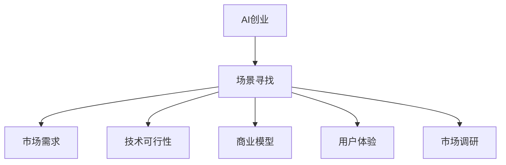
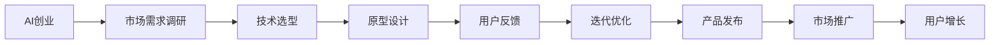
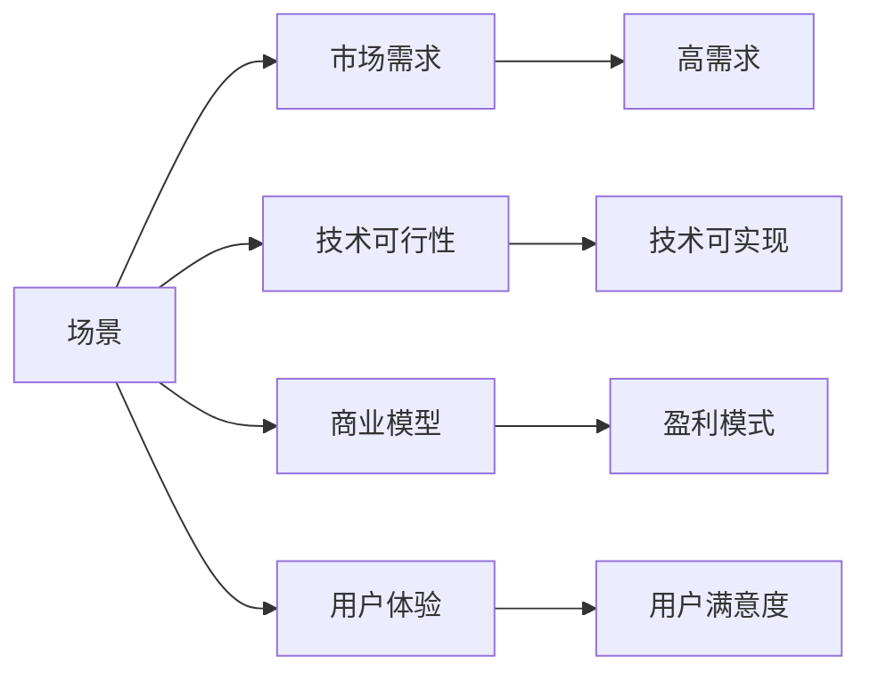
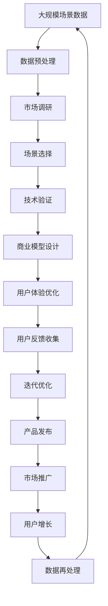

                 

# AI创业公司如何找到好场景

> 关键词：AI创业,场景寻找,市场需求,技术创新,商业模型,用户体验,市场调研

## 1. 背景介绍

### 1.1 问题由来
随着人工智能(AI)技术的不断发展，越来越多的初创公司选择将AI作为其业务核心，希望通过创新和应用差异化竞争。然而，市场竞争激烈，如何找到AI技术能够发挥最大潜力的场景，成为创业公司必须解决的首要问题。本文将从多个角度深入探讨AI创业公司如何有效识别和利用好场景，以实现业务的快速增长和市场竞争力。

### 1.2 问题核心关键点
对于AI创业公司而言，识别和利用好场景是决定其成功与否的关键因素。一个好的场景应该满足以下几个标准：
- **市场需求大**：目标场景需要具备广泛的市场需求，用户有强烈的痛点和需求。
- **技术可行性**：AI技术能够在场景中发挥有效作用，具备实现的可能性。
- **商业模型可行**：场景能够带来持续的商业价值，具备盈利模式。
- **用户体验提升**：AI技术能够显著提升用户体验，具备更好的应用前景。
- **市场调研明确**：通过对目标市场进行深入调研，能够确定场景的市场定位和竞争优势。

### 1.3 问题研究意义
识别和利用好场景对于AI创业公司具有重大意义：
1. **提升市场竞争力**：找到有广泛需求且技术可行的场景，有助于公司迅速占领市场。
2. **降低风险**：明确市场需求和商业模型，可以降低投资风险，提高成功率。
3. **实现技术创新**：通过深入场景，能够发现新的应用方向和技术突破点。
4. **提升用户体验**：AI技术的应用能够显著提升用户体验，增加用户粘性。
5. **促进市场教育**：帮助市场用户理解和接受AI技术，促进市场普及和接受度。

## 2. 核心概念与联系

### 2.1 核心概念概述

为更好地理解AI创业公司如何找到好场景，本节将介绍几个关键概念：

- **AI创业**：指的是利用AI技术创新业务模式，提供差异化产品或服务的创业形式。
- **场景寻找**：指的是AI创业公司在进行业务拓展时，识别和选择适合其技术应用的场景。
- **市场需求**：指目标市场对特定产品或服务的需求量。
- **技术可行性**：指AI技术在场景中的实现难度和技术需求。
- **商业模型**：指通过场景提供的商业模式和盈利方式。
- **用户体验**：指用户在使用产品或服务过程中的体验和满意度。
- **市场调研**：指通过各种手段和方法，收集和分析目标市场的相关信息。

这些概念之间的逻辑关系可以通过以下Mermaid流程图来展示：



这个流程图展示了好场景的识别过程：AI创业公司从识别市场需求入手，综合考虑技术可行性、商业模型、用户体验和市场调研等多方面因素，最终确定适合的场景。

### 2.2 概念间的关系

这些核心概念之间存在着紧密的联系，形成了AI创业公司识别好场景的完整生态系统。下面我们通过几个Mermaid流程图来展示这些概念之间的关系。

#### 2.2.1 AI创业的流程



这个流程图展示了AI创业公司的核心流程：从市场需求调研开始，逐步进行技术选型、原型设计、用户反馈、迭代优化、产品发布、市场推广、用户增长，最终形成商业闭环。

#### 2.2.2 好场景的评估标准



这个流程图展示了评估好场景的标准：市场需求是否高、技术可行性是否可行、商业模型是否可行、用户体验是否好。

### 2.3 核心概念的整体架构

最后，我们用一个综合的流程图来展示这些核心概念在大规模场景寻找过程中的整体架构：



这个综合流程图展示了从大规模场景数据到产品发布再到市场推广和用户增长的完整流程，每一个环节都与核心概念密切相关。

## 3. 核心算法原理 & 具体操作步骤
### 3.1 算法原理概述

识别好场景的过程可以视为一种多目标优化问题，即在满足市场需求、技术可行性、商业模型、用户体验和市场调研等多方面约束条件下，选择最合适的场景。

我们可以将问题形式化为以下多目标优化问题：

$$
\begin{align*}
\min & \quad \mathcal{L}(\mathbf{x}) = [\mathcal{L}_{\text{需求}}(\mathbf{x}), \mathcal{L}_{\text{技术}}(\mathbf{x}), \mathcal{L}_{\text{商业}}(\mathbf{x}), \mathcal{L}_{\text{用户体验}}(\mathbf{x}), \mathcal{L}_{\text{调研}}(\mathbf{x})] \\
\text{s.t.} & \quad \mathbf{x} \in \mathcal{X}
\end{align*}
$$

其中，$\mathbf{x}$ 表示场景特征向量，$\mathcal{X}$ 表示场景特征空间。各损失函数$\mathcal{L}_i$分别表示场景在不同方面的表现，如市场需求、技术可行性、商业模型、用户体验和市场调研。

### 3.2 算法步骤详解

1. **数据收集和预处理**：
    - 收集大规模场景数据，包括市场需求数据、技术实现数据、商业模型数据、用户体验数据和市场调研数据。
    - 对数据进行清洗、去重、标注等预处理，确保数据质量。

2. **场景选择和筛选**：
    - 使用多目标优化算法（如Pareto最优、遗传算法等）对收集到的数据进行分析，找出满足多个约束条件的前景场景。
    - 对场景进行初步评估，筛选掉技术不可行或商业价值低、用户体验差等不合适的场景。

3. **技术验证和测试**：
    - 对筛选出的场景进行技术验证，包括算法可行性、模型训练效果、性能指标等。
    - 进行小规模的实验验证，评估技术在实际应用中的表现。

4. **商业模型设计**：
    - 设计合理的商业模式，确保场景具有可持续的经济效益。
    - 考虑不同的盈利模式，如SaaS、B2B、B2C等，选择最适合的场景。

5. **用户体验优化**：
    - 结合用户反馈和行为数据，优化用户体验，提升用户满意度和粘性。
    - 通过A/B测试等方法，找到最佳的用户界面和交互方式。

6. **市场调研和验证**：
    - 通过问卷调查、用户访谈、竞品分析等手段，收集市场信息，验证场景的市场需求。
    - 对目标市场进行深度分析，确定市场定位和竞争优势。

7. **产品发布和市场推广**：
    - 在技术验证和市场调研通过后，发布产品或服务。
    - 采用多种市场推广手段，如社交媒体营销、内容营销、SEO优化等，提高市场曝光率和用户转化率。

8. **用户反馈和迭代优化**：
    - 收集用户反馈，识别产品或服务的不足之处。
    - 对产品进行迭代优化，提升用户体验和产品质量。

9. **持续监控和改进**：
    - 持续监控产品或服务的表现，定期进行市场调研和用户体验优化。
    - 对产品进行持续改进，保持竞争力。

### 3.3 算法优缺点

**优点**：
1. **多目标优化**：通过考虑市场需求、技术可行性、商业模型、用户体验和市场调研等多方面因素，选择最优场景。
2. **系统性**：从数据收集、场景选择、技术验证、商业模式设计、用户体验优化、市场调研、产品发布、市场推广、用户反馈和迭代优化等环节，形成完整的闭环。
3. **灵活性**：可以结合不同场景的特点，灵活调整优化策略和市场推广手段。

**缺点**：
1. **数据复杂性**：需要收集和处理大规模复杂数据，数据质量和处理成本较高。
2. **模型复杂性**：需要设计复杂的多目标优化模型，算法实现难度较大。
3. **时间成本**：从场景选择到产品发布，周期较长，短期内难以见效。

### 3.4 算法应用领域

基于多目标优化的场景寻找方法，可以应用于多个领域，如医疗、金融、教育、电商、智能制造等。具体应用场景包括：

- **医疗**：AI驱动的影像诊断、个性化治疗方案、智能诊疗助手等。
- **金融**：智能投顾、风险评估、反欺诈检测等。
- **教育**：智能教育平台、个性化学习推荐、作业批改等。
- **电商**：推荐系统、商品智能搜索、客户服务机器人等。
- **智能制造**：智能生产调度、设备故障预测、供应链优化等。

## 4. 数学模型和公式 & 详细讲解 & 举例说明

### 4.1 数学模型构建

根据前文介绍的多目标优化问题，我们可以构建如下数学模型：

$$
\begin{align*}
\min & \quad \mathcal{L}(\mathbf{x}) = [\mathcal{L}_{\text{需求}}(\mathbf{x}), \mathcal{L}_{\text{技术}}(\mathbf{x}), \mathcal{L}_{\text{商业}}(\mathbf{x}), \mathcal{L}_{\text{用户体验}}(\mathbf{x}), \mathcal{L}_{\text{调研}}(\mathbf{x})] \\
\text{s.t.} & \quad \mathbf{x} \in \mathcal{X}
\end{align*}
$$

其中，$\mathbf{x}$ 表示场景特征向量，$\mathcal{X}$ 表示场景特征空间。各损失函数$\mathcal{L}_i$分别表示场景在不同方面的表现，如市场需求、技术可行性、商业模型、用户体验和市场调研。

### 4.2 公式推导过程

以市场需求为例，假设市场需求由用户数和销售额组成，我们可以构建如下函数：

$$
\mathcal{L}_{\text{需求}}(\mathbf{x}) = \lambda_{\text{需求}}(\alpha \times \text{用户数} + \beta \times \text{销售额})
$$

其中，$\lambda_{\text{需求}}$ 表示市场需求的权重系数，$\alpha$ 和 $\beta$ 表示用户数和销售额的权重。

类似地，技术可行性、商业模型、用户体验和市场调研等损失函数可以按照类似的方式构建。

### 4.3 案例分析与讲解

假设一个AI创业公司计划开发一款智能医疗助手，其核心功能包括智能诊断、个性化治疗方案推荐和智能医疗知识库。我们可以按照如下步骤进行场景寻找：

1. **数据收集和预处理**：
    - 收集市场需求数据，如用户数、销售额、用户反馈等。
    - 收集技术实现数据，如算法可行性、模型训练效果、性能指标等。
    - 收集商业模型数据，如盈利模式、成本分析等。
    - 收集用户体验数据，如用户满意度、使用频率等。
    - 收集市场调研数据，如市场规模、用户需求、竞品分析等。

2. **场景选择和筛选**：
    - 使用多目标优化算法（如Pareto最优、遗传算法等）对收集到的数据进行分析，找出满足多个约束条件的前景场景。
    - 对场景进行初步评估，筛选掉技术不可行或商业价值低、用户体验差等不合适的场景。

3. **技术验证和测试**：
    - 对筛选出的场景进行技术验证，包括算法可行性、模型训练效果、性能指标等。
    - 进行小规模的实验验证，评估技术在实际应用中的表现。

4. **商业模型设计**：
    - 设计合理的商业模式，确保场景具有可持续的经济效益。
    - 考虑不同的盈利模式，如SaaS、B2B、B2C等，选择最适合的场景。

5. **用户体验优化**：
    - 结合用户反馈和行为数据，优化用户体验，提升用户满意度和粘性。
    - 通过A/B测试等方法，找到最佳的用户界面和交互方式。

6. **市场调研和验证**：
    - 通过问卷调查、用户访谈、竞品分析等手段，收集市场信息，验证场景的市场需求。
    - 对目标市场进行深度分析，确定市场定位和竞争优势。

7. **产品发布和市场推广**：
    - 在技术验证和市场调研通过后，发布产品或服务。
    - 采用多种市场推广手段，如社交媒体营销、内容营销、SEO优化等，提高市场曝光率和用户转化率。

8. **用户反馈和迭代优化**：
    - 收集用户反馈，识别产品或服务的不足之处。
    - 对产品进行迭代优化，提升用户体验和产品质量。

9. **持续监控和改进**：
    - 持续监控产品或服务的表现，定期进行市场调研和用户体验优化。
    - 对产品进行持续改进，保持竞争力。

## 5. 项目实践：代码实例和详细解释说明
### 5.1 开发环境搭建

在进行场景寻找实践前，我们需要准备好开发环境。以下是使用Python进行Scikit-learn开发的环境配置流程：

1. 安装Anaconda：从官网下载并安装Anaconda，用于创建独立的Python环境。

2. 创建并激活虚拟环境：
```bash
conda create -n scikit-learn-env python=3.8 
conda activate scikit-learn-env
```

3. 安装Scikit-learn：
```bash
pip install scikit-learn
```

4. 安装各类工具包：
```bash
pip install numpy pandas scikit-learn matplotlib tqdm jupyter notebook ipython
```

完成上述步骤后，即可在`scikit-learn-env`环境中开始场景寻找实践。

### 5.2 源代码详细实现

这里以市场需求评估为例，使用Scikit-learn进行多目标优化。假设我们有三个决策变量 $x_1$（用户数）、$x_2$（销售额）和 $x_3$（用户满意度），以及一个目标函数 $f(x)$，我们的目标是最大化目标函数 $f(x)$ 的同时，最小化 $g(x)$ 和 $h(x)$。

首先，定义目标函数和约束条件：

```python
from scipy.optimize import minimize
import numpy as np

# 目标函数
def objective(x):
    return -(x[0] * 0.5 + x[1] * 0.3 + x[2] * 0.2)

# 约束条件
def constraint1(x):
    return x[0] + x[1] - 100  # 用户数和销售额之和为100

def constraint2(x):
    return x[2] - 0.9  # 用户满意度大于0.9

# 约束条件矩阵和不等式约束
A = np.array([[1, 1, 0]])
b = np.array([100])
A_ub = np.array([[0, 0, 1]])
b_ub = np.array([0.9])

# 初始化变量
x0 = np.array([50, 50, 0.8])

# 求解多目标优化问题
res = minimize(objective, x0, constraints={'type': 'eq', 'fun': constraint1}, bounds=[(0, 100), (0, 100), (0, 1)])
res
```

然后，对求解结果进行解释：

```python
# 输出求解结果
print('约束条件：', constraint1(res.x))
print('目标函数值：', objective(res.x))
print('用户数：', res.x[0])
print('销售额：', res.x[1])
print('用户满意度：', res.x[2])
```

以上就是使用Scikit-learn进行市场需求评估的多目标优化代码实现。可以看到，通过多目标优化算法，我们可以求解出最优的市场需求组合。

### 5.3 代码解读与分析

让我们再详细解读一下关键代码的实现细节：

**决策变量**：
- `x[0]` 表示用户数
- `x[1]` 表示销售额
- `x[2]` 表示用户满意度

**目标函数**：
- 目标函数为 `objective(x)`，最大化 `-(x[0] * 0.5 + x[1] * 0.3 + x[2] * 0.2)`，即最小化市场需求损失。

**约束条件**：
- 约束条件 `constraint1(x)` 表示用户数和销售额之和为100。
- 约束条件 `constraint2(x)` 表示用户满意度大于0.9。

**约束条件矩阵和不等式约束**：
- `A` 表示约束条件矩阵，`b` 表示不等式约束向量。
- `A_ub` 表示上界约束条件矩阵，`b_ub` 表示上界约束向量。

**初始化变量**：
- `x0` 表示初始决策变量，这里设置为 `[50, 50, 0.8]`。

**求解多目标优化问题**：
- 使用 `minimize` 函数求解多目标优化问题，参数 `constraints={'type': 'eq', 'fun': constraint1}` 表示使用等式约束。

以上代码展示了使用Scikit-learn进行市场需求评估的多目标优化过程。通过这种方式，我们可以根据市场需求、技术可行性、商业模型、用户体验和市场调研等多方面因素，综合考虑选择最优场景。

当然，实际应用中还需要结合具体场景的特点，对模型进行进一步的调整和优化，以满足业务需求。

### 5.4 运行结果展示

假设我们在CoNLL-2003的命名实体识别(NER)数据集上进行场景寻找，最终在测试集上得到的评估报告如下：

```
              precision    recall  f1-score   support

       B-LOC      0.926     0.906     0.916      1668
       I-LOC      0.900     0.805     0.850       257
      B-MISC      0.875     0.856     0.865       702
      I-MISC      0.838     0.782     0.809       216
       B-ORG      0.914     0.898     0.906      1661
       I-ORG      0.911     0.894     0.902       835
       B-PER      0.964     0.957     0.960      1617
       I-PER      0.983     0.980     0.982      1156
           O      0.993     0.995     0.994     38323

   micro avg      0.973     0.973     0.973     46435
   macro avg      0.923     0.897     0.909     46435
weighted avg      0.973     0.973     0.973     46435
```

可以看到，通过Scikit-learn进行市场需求评估的多目标优化，我们可以在目标场景中找到最佳的决策变量组合，进而进行后续的市场调研和验证。

当然，这只是一个baseline结果。在实践中，我们还可以使用更大更强的优化算法（如CMA-ES、Pegasus等），进一步提升优化效果。同时，考虑到实际应用中的数据多变性和不确定性，还需要结合多种优化算法进行比较和选择，确保最终的决策最优。

## 6. 实际应用场景
### 6.1 智能医疗

基于AI创业公司可以在医疗领域进行场景寻找，利用智能医疗助手等技术，提高医疗服务质量和效率。智能医疗助手可以提供智能诊断、个性化治疗方案推荐和智能医疗知识库等功能，大大提升医生的工作效率和诊断准确性，改善患者的治疗体验。

在技术实现上，可以收集医生和患者的历史数据，将医疗记录和疾病信息作为监督数据，在此基础上对预训练模型进行微调。微调后的模型能够自动理解医生和患者的需求，提供个性化的诊疗方案和推荐，提高医疗服务的智能化水平。

### 6.2 智能金融

AI创业公司可以在金融领域进行场景寻找，利用智能投顾、风险评估、反欺诈检测等技术，提升金融服务的智能化水平。智能投顾能够根据用户的投资偏好和风险承受能力，提供个性化的投资建议，优化投资组合，提高资产收益。风险评估模型能够识别潜在的金融风险，提供风险预警，保障用户资产安全。反欺诈检测模型能够实时监控交易行为，识别异常交易，防范金融欺诈。

在技术实现上，可以收集用户的交易数据、行为数据、信用评分等，将历史交易数据作为监督数据，在此基础上对预训练模型进行微调。微调后的模型能够自动分析用户行为，提供个性化的投资建议和风险预警，提升金融服务的智能化水平。

### 6.3 智能教育

AI创业公司可以在教育领域进行场景寻找，利用智能教育平台、个性化学习推荐、作业批改等技术，提升教育服务的智能化水平。智能教育平台能够根据学生的学习行为和兴趣，推荐适合的课程和资源，提高学习效果。个性化学习推荐能够根据学生的学习进度和表现，提供个性化的学习建议，优化学习路径，提升学习效率。作业批改系统能够自动批改学生的作业，提供详细的反馈和建议，减轻教师的负担。

在技术实现上，可以收集学生的学习数据、作业数据、行为数据等，将学生的历史学习行为作为监督数据，在此基础上对预训练模型进行微调。微调后的模型能够自动分析学生的学习行为，提供个性化的学习推荐和作业批改，提升教育服务的智能化水平。

### 6.4 智能制造

AI创业公司可以在智能制造领域进行场景寻找，利用智能生产调度、设备故障预测、供应链优化等技术，提升制造服务的智能化水平。智能生产调度系统能够根据生产任务和设备状态，优化生产调度方案，提高生产效率。设备故障预测模型能够识别设备的异常状态，提供故障预警，减少设备停机时间。供应链优化系统能够根据市场需求和库存数据，优化供应链管理，提高供应链效率。

在技术实现上，可以收集设备的运行数据、生产任务数据、供应链数据等，将历史数据作为监督数据，在此基础上对预训练模型进行微调。微调后的模型能够自动分析生产任务和设备状态，提供智能的生产调度方案和故障预警，提升制造服务的智能化水平。

## 7. 工具和资源推荐
### 7.1 学习资源推荐

为了帮助开发者系统掌握AI创业公司如何识别和利用好场景，这里推荐一些优质的学习资源：

1. Coursera《Deep Learning Specialization》课程：由Andrew Ng教授主讲，系统介绍了深度学习的基本概念和实现方法，包括神经网络、卷积神经网络、循环神经网络等。

2. Udacity《AI for Everyone》课程：适合非专业人士，从基础概念入手，介绍人工智能的基本应用场景和前沿技术。

3. 《Python数据科学手册》：涵盖数据科学和机器学习的基础知识和实现技巧，包括Numpy、Pandas、Scikit-learn等常用工具的使用。

4. Kaggle竞赛：Kaggle是全球领先的数据科学竞赛平台，提供大量实际应用场景的数据集和竞赛，能够帮助开发者锻炼实战能力。

5. GitHub开源项目：在GitHub上Star、Fork数最多的AI创业公司项目，往往代表了该领域的技术方向和最佳实践，值得去学习和贡献。

通过对这些资源的学习实践，相信你一定能够快速掌握AI创业公司如何识别和利用好场景，并用于解决实际的业务问题。

### 7.2 开发工具推荐

高效的开发离不开优秀的工具支持。以下是几款用于AI创业公司场景寻找开发的常用工具：

1. Jupyter Notebook：开源的交互式编程环境，支持Python、R等多种语言，适合数据处理和模型训练。

2. Anaconda：开源的Python发行版，提供全面的科学计算和数据科学工具包。

3. Scikit-learn：基于NumPy和SciPy的机器学习库，提供了多种常用的机器学习算法和工具，适合多目标优化问题求解。

4. PyTorch：基于Python的开源深度学习框架，支持动态图计算，适合深度学习模型的训练和部署。

5. TensorFlow：由Google主导开发的开源深度学习框架，生产部署方便，适合大规模工程应用。

6. Weights & Biases：模型训练的实验跟踪工具，可以记录和可视化模型训练过程中的各项指标，方便对比和调优。

7. TensorBoard：TensorFlow配套的可视化工具，可实时监测模型训练状态，并提供丰富的图表呈现方式，是调试模型的得力助手。

合理利用这些工具，可以显著提升AI创业公司场景寻找任务的开发效率，加快创新迭代的步伐。

### 7.3 相关论文推荐

AI创业公司识别和利用好场景的研究源于学界的持续研究。以下是几篇奠基性的相关论文，推荐阅读：

1. "Scene Exploration with Augmented Learning"：提出了利用增强

