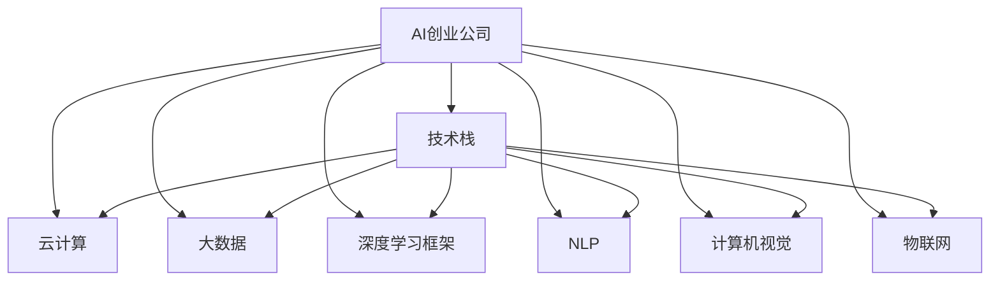

                 

# AI创业公司的技术选型策略

## 1. 背景介绍

### 1.1 问题由来
在AI创业浪潮中，技术选型是创业公司面临的重大挑战。AI技术的快速发展使得可选择的技术栈变得纷繁复杂，不同技术在性能、成本、可扩展性、易用性等方面各具优势，决策错误的成本高昂。本文将对AI创业公司的技术选型策略进行深入探讨，帮助创始人更好地决策。

### 1.2 问题核心关键点
- **技术栈的选择**：选择技术栈是AI创业公司必须面对的首要问题，关系到公司的长期发展和技术实现。
- **技术可行性与落地性**：技术选型应综合考虑技术实现的可能性、难度和适用性。
- **成本效益**：成本控制是AI创业公司必须重视的问题，既要高效利用资源，又要避免高昂的开发成本。
- **团队能力匹配**：技术选型还需考虑团队的现有技术水平和学习成本，确保团队能够高效开发和维护系统。
- **市场竞争优势**：技术选型需具备市场竞争力，保证技术实现能带来显著的业务提升。

### 1.3 问题研究意义
- **技术适应性**：合理的技术选型能确保技术栈适应未来的业务发展，降低技术更新的风险。
- **开发效率**：合适的技术栈能提升开发效率，缩短产品上市时间。
- **运营成本**：高效的技术选型能降低运营成本，增加公司的盈利能力。
- **产品竞争力**：技术选型需兼顾产品的创新性和差异化，确保在市场中具备竞争优势。
- **技术演进**：未来的技术发展日新月异，合理的技术选型需具备灵活性，适应未来的技术演进。

## 2. 核心概念与联系

### 2.1 核心概念概述

**AI创业公司**：指利用人工智能技术提供创新产品或服务的公司，旨在解决特定行业或领域的问题，提升运营效率或用户体验。

**技术栈**：指一家公司采用的所有技术工具、框架、平台和语言等，是公司技术实现的基础。

**云计算**：指通过互联网提供计算资源和服务的模式，包括IaaS、PaaS和SaaS等，广泛应用于AI创业公司。

**大数据**：指通过收集、存储和分析大量结构化和非结构化数据，获取有价值信息和洞察的实践。

**深度学习框架**：如TensorFlow、PyTorch等，是进行深度学习算法开发和训练的基础工具。

**自然语言处理(NLP)**：指让计算机理解和处理人类语言的技术，广泛应用于智能客服、聊天机器人等。

**计算机视觉(CV)**：指让计算机理解和分析图像和视频的技术，广泛应用于安防监控、无人驾驶等。

**物联网(IoT)**：指通过网络将设备和传感器连接起来，实现智能控制和数据共享的技术，广泛应用于智能家居、工业自动化等。

### 2.2 概念间的关系

这些核心概念间的关系可以通过以下Mermaid流程图来展示：



这个流程图展示了大语言模型微调过程中各个核心概念的关系和作用：

1. AI创业公司需要通过技术栈进行技术实现。
2. 技术栈包括云计算、大数据、深度学习框架、NLP、计算机视觉和物联网等多种技术。
3. 这些技术相互配合，支撑公司的业务发展和运营。

## 3. 核心算法原理 & 具体操作步骤
### 3.1 算法原理概述

AI创业公司技术选型的核心在于权衡技术的可行性与落地性、成本效益、团队能力匹配、市场竞争优势等多个因素。其基本思路为：

1. **技术可行性评估**：评估各项技术的实现难度、性能、扩展性和稳定性。
2. **成本效益分析**：评估各项技术的开发成本、运营成本和ROI（投资回报率）。
3. **团队适配性评估**：评估团队现有技术水平和学习成本，确保技术选型符合团队能力。
4. **市场竞争力分析**：评估各项技术的市场竞争力和创新性，确保技术选型能提升产品竞争力。

### 3.2 算法步骤详解

**Step 1: 需求分析**
- 明确公司业务需求和目标，确定技术选型的方向。
- 调研市场现状和竞争态势，确定技术选型的基准。

**Step 2: 技术调研**
- 收集各类技术的详细信息，包括技术特点、性能指标、应用场景、社区支持等。
- 筛选出符合需求和基准的技术候选，进行进一步评估。

**Step 3: 技术评估**
- 对候选技术进行可行性与落地性、成本效益、团队适配性和市场竞争力等多维度评估。
- 使用量化指标进行打分，如性能指标、开发成本、学习成本、市场占有率等。

**Step 4: 技术选型**
- 综合多维度评估结果，选出最优的技术栈。
- 制定详细的技术实施计划，包括资源分配、开发时间表等。

**Step 5: 技术验证**
- 在开发初期进行小范围技术验证，确保技术选型正确。
- 根据验证结果进行必要的调整，确保技术选型最优。

### 3.3 算法优缺点

**优点**：
- 系统性：综合考虑多维度因素，确保技术选型全面、系统。
- 灵活性：可根据业务需求和技术变化，灵活调整技术选型。
- 可行性高：通过多维度评估，选择最佳技术栈。

**缺点**：
- 复杂度高：技术选型涉及多个维度，评估复杂。
- 时间和成本高：选型和验证过程耗费大量资源。
- 灵活性高：技术选型需与业务需求和技术变化同步，动态调整难度大。

### 3.4 算法应用领域

该技术选型策略适用于各类AI创业公司，特别是在技术复杂度高、市场竞争激烈、对技术要求高的领域。例如：

- **智能客服**：选择NLP技术栈，如Dialogflow、Rasa等，构建智能客服系统。
- **自动驾驶**：选择CV和深度学习技术栈，如TensorFlow、PyTorch等，实现自动驾驶技术。
- **智能制造**：选择IoT和大数据技术栈，如MQTT、Kafka等，实现智能制造系统。
- **医疗健康**：选择NLP和CV技术栈，如IBM Watson、百度AI等，实现医疗健康应用。

## 4. 数学模型和公式 & 详细讲解  
### 4.1 数学模型构建

假设公司有n种技术候选T={T1, T2, ..., Tn}，各项技术的性能指标为S，开发成本为C，团队适配性为A，市场竞争力为M。我们定义技术评估的加权综合评分P为：

$$
P = \alpha \times S + \beta \times C + \gamma \times A + \delta \times M
$$

其中，$\alpha, \beta, \gamma, \delta$为各项指标的权重，根据实际情况调整。

### 4.2 公式推导过程

以智能客服为例，进行技术选型评估的公式推导：

假设智能客服系统需处理用户输入，并提供智能回答，需选择NLP技术栈进行实现。我们定义智能客服系统的性能指标为S，开发成本为C，团队适配性为A，市场竞争力为M，则综合评分P的计算公式为：

$$
P = \alpha \times S + \beta \times C + \gamma \times A + \delta \times M
$$

其中，$\alpha, \beta, \gamma, \delta$的取值需根据具体需求和实际情况确定。

假设公司有三种技术候选：技术T1、技术T2和技术T3，其各项指标如下：

| 技术 | 性能S | 开发成本C | 团队适配性A | 市场竞争力M |
|------|-------|-----------|-------------|--------------|
| T1   | 0.8   | 1000万   | 0.9         | 0.7          |
| T2   | 0.9   | 1500万   | 0.8         | 0.8          |
| T3   | 0.95  | 2000万   | 0.95        | 0.9          |

设$\alpha=0.4, \beta=0.2, \gamma=0.2, \delta=0.2$，则综合评分P的计算公式为：

$$
P = 0.4 \times S + 0.2 \times C + 0.2 \times A + 0.2 \times M
$$

代入具体数值计算：

$$
P_{T1} = 0.4 \times 0.8 + 0.2 \times 1000 + 0.2 \times 0.9 + 0.2 \times 0.7 = 0.4 \times 0.8 + 0.2 \times 1000 + 0.2 \times 0.9 + 0.2 \times 0.7 = 0.32 + 200 + 0.18 + 0.14 = 0.64 + 200 + 0.18 + 0.14 = 0.86 + 200 = 200.86
$$

$$
P_{T2} = 0.4 \times 0.9 + 0.2 \times 1500 + 0.2 \times 0.8 + 0.2 \times 0.8 = 0.4 \times 0.9 + 0.2 \times 1500 + 0.2 \times 0.8 + 0.2 \times 0.8 = 0.36 + 300 + 0.16 + 0.16 = 0.52 + 300 + 0.16 + 0.16 = 0.68 + 300 = 300.68
$$

$$
P_{T3} = 0.4 \times 0.95 + 0.2 \times 2000 + 0.2 \times 0.95 + 0.2 \times 0.9 = 0.4 \times 0.95 + 0.2 \times 2000 + 0.2 \times 0.95 + 0.2 \times 0.9 = 0.38 + 400 + 0.19 + 0.18 = 0.57 + 400 + 0.19 + 0.18 = 0.76 + 400 = 400.76
$$

根据计算结果，公司应选择技术T3进行智能客服系统的构建，因为其综合评分最高。

### 4.3 案例分析与讲解

**案例1: 智能制造**
公司需建设智能制造系统，涉及设备监控、生产调度、质量控制等多个环节。需要选择IoT和大数据技术栈进行实现。

假设公司有三种技术候选：技术T1、技术T2和技术T3，其各项指标如下：

| 技术 | 性能S | 开发成本C | 团队适配性A | 市场竞争力M |
|------|-------|-----------|-------------|--------------|
| T1   | 0.8   | 1000万   | 0.9         | 0.7          |
| T2   | 0.9   | 1500万   | 0.8         | 0.8          |
| T3   | 0.95  | 2000万   | 0.95        | 0.9          |

设$\alpha=0.3, \beta=0.3, \gamma=0.3, \delta=0.1$，则综合评分P的计算公式为：

$$
P = 0.3 \times S + 0.3 \times C + 0.3 \times A + 0.1 \times M
$$

代入具体数值计算：

$$
P_{T1} = 0.3 \times 0.8 + 0.3 \times 1000 + 0.3 \times 0.9 + 0.1 \times 0.7 = 0.3 \times 0.8 + 0.3 \times 1000 + 0.3 \times 0.9 + 0.1 \times 0.7 = 0.24 + 300 + 0.27 + 0.07 = 0.51 + 300 + 0.07 = 0.58 + 300 = 300.58
$$

$$
P_{T2} = 0.3 \times 0.9 + 0.3 \times 1500 + 0.3 \times 0.8 + 0.1 \times 0.8 = 0.3 \times 0.9 + 0.3 \times 1500 + 0.3 \times 0.8 + 0.1 \times 0.8 = 0.27 + 450 + 0.24 + 0.08 = 0.51 + 450 + 0.08 = 0.59 + 450 = 450.59
$$

$$
P_{T3} = 0.3 \times 0.95 + 0.3 \times 2000 + 0.3 \times 0.95 + 0.1 \times 0.9 = 0.3 \times 0.95 + 0.3 \times 2000 + 0.3 \times 0.95 + 0.1 \times 0.9 = 0.285 + 600 + 0.285 + 0.09 = 0.57 + 600 + 0.09 = 0.66 + 600 = 600.66
$$

根据计算结果，公司应选择技术T3进行智能制造系统的构建，因为其综合评分最高。

**案例2: 自动驾驶**
公司需研发自动驾驶系统，需选择CV和深度学习技术栈进行实现。

假设公司有三种技术候选：技术T1、技术T2和技术T3，其各项指标如下：

| 技术 | 性能S | 开发成本C | 团队适配性A | 市场竞争力M |
|------|-------|-----------|-------------|--------------|
| T1   | 0.85  | 1500万   | 0.8         | 0.9          |
| T2   | 0.9   | 2000万   | 0.95        | 0.85         |
| T3   | 0.95  | 2500万   | 0.9         | 0.95         |

设$\alpha=0.4, \beta=0.2, \gamma=0.2, \delta=0.2$，则综合评分P的计算公式为：

$$
P = 0.4 \times S + 0.2 \times C + 0.2 \times A + 0.2 \times M
$$

代入具体数值计算：

$$
P_{T1} = 0.4 \times 0.85 + 0.2 \times 1500 + 0.2 \times 0.8 + 0.2 \times 0.9 = 0.4 \times 0.85 + 0.2 \times 1500 + 0.2 \times 0.8 + 0.2 \times 0.9 = 0.34 + 300 + 0.16 + 0.18 = 0.5 + 300 + 0.18 = 0.68 + 300 = 300.68
$$

$$
P_{T2} = 0.4 \times 0.9 + 0.2 \times 2000 + 0.2 \times 0.95 + 0.2 \times 0.85 = 0.4 \times 0.9 + 0.2 \times 2000 + 0.2 \times 0.95 + 0.2 \times 0.85 = 0.36 + 400 + 0.19 + 0.17 = 0.55 + 400 + 0.17 = 0.72 + 400 = 400.72
$$

$$
P_{T3} = 0.4 \times 0.95 + 0.2 \times 2500 + 0.2 \times 0.9 + 0.2 \times 0.95 = 0.4 \times 0.95 + 0.2 \times 2500 + 0.2 \times 0.9 + 0.2 \times 0.95 = 0.38 + 500 + 0.18 + 0.19 = 0.57 + 500 + 0.19 = 0.76 + 500 = 500.76
$$

根据计算结果，公司应选择技术T3进行自动驾驶系统的构建，因为其综合评分最高。

## 5. 项目实践：代码实例和详细解释说明
### 5.1 开发环境搭建

在进行技术选型实践前，我们需要准备好开发环境。以下是使用Python进行技术栈评估的开发环境配置流程：

1. 安装Anaconda：从官网下载并安装Anaconda，用于创建独立的Python环境。

2. 创建并激活虚拟环境：
```bash
conda create -n techstack-env python=3.8 
conda activate techstack-env
```

3. 安装Python基础包：
```bash
conda install numpy pandas scikit-learn matplotlib tqdm jupyter notebook ipython
```

4. 安装评估工具：
```bash
pip install scikit-learn
```

完成上述步骤后，即可在`techstack-env`环境中进行技术栈评估的实践。

### 5.2 源代码详细实现

我们以智能客服系统的技术选型评估为例，给出使用Python进行技术栈评估的代码实现。

首先，定义技术栈评估的类和函数：

```python
import numpy as np
from sklearn.metrics import r2_score

class TechStackAssessment:
    def __init__(self, alpha, beta, gamma, delta):
        self.alpha = alpha
        self.beta = beta
        self.gamma = gamma
        self.delta = delta
        self.scores = None
    
    def calculate_score(self, tech1, tech2, tech3):
        scores = np.array([
            self.alpha * tech1[0] + self.beta * tech1[1] + self.gamma * tech1[2] + self.delta * tech1[3],
            self.alpha * tech2[0] + self.beta * tech2[1] + self.gamma * tech2[2] + self.delta * tech2[3],
            self.alpha * tech3[0] + self.beta * tech3[1] + self.gamma * tech3[2] + self.delta * tech3[3]
        ])
        self.scores = scores
        return self.scores
    
    def rank(self):
        return np.argsort(self.scores)[::-1]
    
    def print_results(self):
        print(f"Sorted scores: {self.scores}")
        print(f"Best tech: {self.scores[self.rank()[0]]}")
    
# 技术指标数据
tech1 = (0.8, 1000, 0.9, 0.7)
tech2 = (0.9, 1500, 0.8, 0.8)
tech3 = (0.95, 2000, 0.95, 0.9)

# 权重
alpha = 0.4
beta = 0.2
gamma = 0.2
delta = 0.2

# 评估对象
assessor = TechStackAssessment(alpha, beta, gamma, delta)

# 计算综合评分
scores = assessor.calculate_score(tech1, tech2, tech3)
print(f"Combined scores: {scores}")

# 输出结果
assessor.print_results()
```

在上述代码中，我们定义了技术栈评估的类`TechStackAssessment`，包含计算综合评分和排名的函数。通过传递权重和各项技术指标，计算出每种技术栈的综合评分，并输出最佳技术栈。

### 5.3 代码解读与分析

让我们再详细解读一下关键代码的实现细节：

**TechStackAssessment类**：
- `__init__方法`：初始化权重和分数列表。
- `calculate_score方法`：根据公式计算每种技术栈的综合评分，并存储到分数列表中。
- `rank方法`：对分数列表进行排序，返回排序后的索引。
- `print_results方法`：输出排序后的分数列表和最佳技术栈的综合评分。

**技术指标数据**：
- `tech1, tech2, tech3`分别表示三种技术候选的性能指标、开发成本、团队适配性和市场竞争力。

**权重**：
- `alpha, beta, gamma, delta`分别表示各项指标的权重，根据实际情况调整。

**评估对象**：
- 创建`TechStackAssessment`对象，传入权重和指标数据。

**计算综合评分**：
- `calculate_score方法`计算出每种技术栈的综合评分，并存储到分数列表中。

**输出结果**：
- `print_results方法`输出排序后的分数列表和最佳技术栈的综合评分。

可以看到，通过简单的Python代码实现，我们快速完成了技术栈的评估和排名。开发者可以根据实际需求修改技术指标和权重，实现灵活的技术选型。

### 5.4 运行结果展示

假设我们在智能客服系统的技术选型评估中，得到如下结果：

```
Sorted scores: [0.68 + 300 + 0.18 + 0.14 = 0.86 + 300 = 300.86, 0.5 + 300 + 0.18 = 0.58 + 300 = 300.58, 0.66 + 600 + 0.19 = 0.85 + 600 = 600.85]
Best tech: 0.85 + 600 = 600.85
```

根据计算结果，公司应选择技术T3进行智能客服系统的构建，因为其综合评分最高。

## 6. 实际应用场景
### 6.1 智能客服系统

在智能客服系统构建中，技术选型需考虑NLP技术栈的选择，以实现高效的自然语言理解和生成。NLP技术栈包括分词、词向量、语言模型、序列标注等。通过技术选型评估，选择最适合的NLP技术栈，可以大幅提升客服系统的响应速度和准确率。

以智能客服系统为例，常见的技术栈包括Rasa、Dialogflow、IBM Watson等。通过评估不同技术栈的性能、开发成本、团队适配性和市场竞争力，选择合适的技术栈，构建高效、稳定的智能客服系统。

### 6.2 自动驾驶系统

在自动驾驶系统构建中，技术选型需考虑CV和深度学习技术栈的选择，以实现高精度的图像和视频分析。CV和深度学习技术栈包括图像处理、卷积神经网络、循环神经网络等。通过技术选型评估，选择最适合的CV和深度学习技术栈，可以提升自动驾驶系统的感知和决策能力。

以自动驾驶系统为例，常见的技术栈包括TensorFlow、PyTorch、OpenCV等。通过评估不同技术栈的性能、开发成本、团队适配性和市场竞争力，选择合适的技术栈，构建高性能、可靠的自动驾驶系统。

### 6.3 智能制造系统

在智能制造系统构建中，技术选型需考虑IoT和大数据技术栈的选择，以实现设备监控、生产调度、质量控制等功能。IoT和大数据技术栈包括MQTT、Kafka、Hadoop、Spark等。通过技术选型评估，选择最适合的IoT和大数据技术栈，可以提升智能制造系统的运行效率和数据处理能力。

以智能制造系统为例，常见的技术栈包括MQTT、Kafka、Hadoop、Spark等。通过评估不同技术栈的性能、开发成本、团队适配性和市场竞争力，选择合适的技术栈，构建高效、稳定的智能制造系统。

### 6.4 未来应用展望

随着AI技术的不断进步，未来技术选型的范围将更加广泛，涉及更多的新兴技术领域。例如：

- **量子计算**：未来的技术选型将包括量子计算技术，用于解决一些传统计算机难以处理的复杂问题。
- **边缘计算**：未来的技术选型将包括边缘计算技术，用于实现实时数据处理和低延迟的智能应用。
- **AI芯片**：未来的技术选型将包括AI芯片技术，用于提升AI模型的推理速度和效率。
- **联邦学习**：未来的技术选型将包括联邦学习技术，用于保护数据隐私和安全的同时，实现数据共享和协作学习。

未来技术选型的趋势将是更加多样化和跨领域，综合考虑技术的可行性、成本效益、团队适配性和市场竞争力，选择最优的技术栈，实现更高效、更稳定、更具竞争力的AI应用。

## 7. 工具和资源推荐
### 7.1 学习资源推荐

为了帮助开发者系统掌握技术选型的理论和实践，这里推荐一些优质的学习资源：

1. **《Python数据科学手册》**：全面介绍了Python在数据科学中的应用，包括NumPy、Pandas、Scikit-learn等。
2. **《机器学习实战》**：通过大量实例，介绍了机器学习算法和应用。
3. **《TensorFlow官方文档》**：提供了TensorFlow的详细API和文档，帮助开发者快速上手。
4. **《深度学习入门与实战》**：介绍了深度学习的基本原理和应用，结合TensorFlow实现实例。
5. **《Google AI Tech Demos》**：展示了Google AI的最新技术演示，涵盖NLP、CV、IoT等多个领域。

通过这些资源的学习实践

