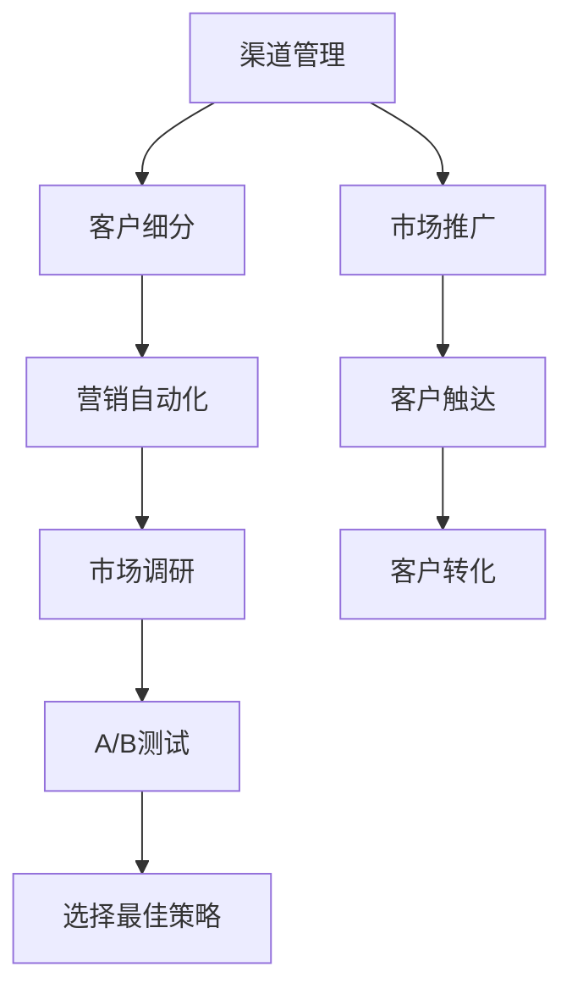

                 

# AI创业公司的渠道管理策略

## 1. 背景介绍

### 1.1 问题由来
随着人工智能技术的不断进步，越来越多的初创企业在快速发展和壮大过程中，面临渠道管理和市场推广的巨大挑战。如何高效地拓展渠道，触达潜在客户，提升品牌知名度，赢得市场份额，成为企业发展的关键问题。

### 1.2 问题核心关键点
AI创业公司通常具备强大的技术实力，但在市场拓展和客户转化方面往往存在短板。市场推广和渠道管理虽然不是技术问题，但同样需要专业的方法和策略，以确保营销投入的有效转化。

### 1.3 问题研究意义
高效的市场推广和渠道管理，对于AI创业公司的快速成长和持续发展具有重要意义：

1. **提升品牌知名度**：通过有针对性的市场推广活动，提升公司在目标客户群中的知名度，吸引更多的潜在用户。
2. **加速客户转化**：通过精准的渠道管理和客户触达策略，将潜在客户转化为实际用户，提高产品的市场渗透率。
3. **降低运营成本**：通过优化营销渠道，避免资源浪费，提高营销投入的回报率。
4. **增强竞争优势**：在市场上建立起品牌优势和市场领先地位，形成良性循环。
5. **促进业务增长**：良好的渠道管理能够为产品带来更多流量，提升销售业绩和市场份额。

## 2. 核心概念与联系

### 2.1 核心概念概述

为更好地理解AI创业公司渠道管理策略，本节将介绍几个密切相关的核心概念：

- **渠道管理**：通过选择合适的渠道进行市场推广，触达潜在客户，最终实现品牌曝光和客户转化。
- **客户细分**：根据客户特征和需求，将市场划分为不同的细分市场，实现精准营销。
- **营销自动化**：利用技术手段，自动化地执行营销任务，提高效率和精准度。
- **市场调研**：通过收集和分析市场数据，了解客户需求和市场趋势，为渠道管理提供决策支持。
- **A/B测试**：通过对比不同的市场推广策略和渠道方案，选择效果最佳方案。

这些核心概念之间存在紧密联系，共同构成了AI创业公司渠道管理策略的完整框架。

### 2.2 概念间的关系

这些核心概念之间的逻辑关系可以通过以下Mermaid流程图来展示：



这个流程图展示了大语言模型微调过程中各个核心概念之间的关系：

1. 渠道管理是整个市场推广的核心，涉及选择合适的渠道进行推广。
2. 客户细分是基于市场调研和数据分析，将客户分为不同的群体，实现精准营销。
3. 营销自动化利用技术手段，自动化执行营销任务，提升效率和精准度。
4. A/B测试通过对比不同的市场推广策略和渠道方案，选择效果最佳方案。
5. 最终选择最佳策略后，进行市场推广和客户触达，实现客户转化。

这些概念共同构成了AI创业公司渠道管理策略的整体框架，使其能够高效地进行市场推广和客户转化。

## 3. 核心算法原理 & 具体操作步骤
### 3.1 算法原理概述

AI创业公司的渠道管理策略基于市场细分和数据分析，通过优化渠道选择和执行方案，实现精准营销和客户转化。其核心原理可以总结为以下几点：

1. **市场细分**：利用市场调研数据，将目标市场划分为不同的细分市场。
2. **渠道选择**：根据不同市场和客户群体的特点，选择最合适的渠道进行推广。
3. **内容设计**：设计符合客户需求和兴趣的营销内容，增强吸引力。
4. **执行方案**：制定具体的执行计划，包括推广预算、时间表、KPI等。
5. **效果评估**：通过数据分析和A/B测试，评估推广效果，优化渠道管理策略。

### 3.2 算法步骤详解

AI创业公司渠道管理的详细步骤包括：

**Step 1: 市场调研**
- 收集市场数据，包括客户需求、行为、趋势等。
- 利用数据分析工具，如Google Analytics、SurveyMonkey等，获取目标市场的详细信息。

**Step 2: 客户细分**
- 根据客户特征（如年龄、性别、地域、职业等）和需求（如购买行为、兴趣偏好等），将市场划分为不同的客户群体。
- 利用聚类算法（如K-means、层次聚类等）或分类算法（如决策树、逻辑回归等）进行客户细分。

**Step 3: 渠道选择**
- 根据客户群体和市场特点，选择最合适的渠道进行推广。
- 常见的渠道包括社交媒体（如微信、微博、抖音）、搜索引擎（如百度、Google）、邮件营销、合作伙伴推广等。

**Step 4: 内容设计**
- 根据客户需求和兴趣，设计符合预期的营销内容。
- 内容形式包括文字、图片、视频、直播等。

**Step 5: 执行方案**
- 制定具体的执行计划，包括推广预算、时间表、KPI等。
- 确保各项任务按时完成，监控执行效果。

**Step 6: 效果评估**
- 利用数据分析工具，跟踪营销效果，收集客户反馈。
- 进行A/B测试，对比不同渠道和内容的效果，优化策略。

### 3.3 算法优缺点

AI创业公司渠道管理策略具有以下优点：

1. **精准营销**：通过客户细分和数据分析，实现精准的客户触达，提高转化率。
2. **资源优化**：优化渠道选择和内容设计，降低营销成本，提高投资回报率。
3. **市场快速响应**：利用数据分析和A/B测试，快速迭代优化策略，抓住市场机会。
4. **客户关系管理**：通过客户细分和数据分析，建立客户画像，实现客户关系管理。

同时，该策略也存在以下局限性：

1. **数据依赖**：依赖于市场调研和数据分析的准确性，数据质量对策略效果有重要影响。
2. **执行难度**：需要专业团队进行市场推广和数据分析，对技术要求较高。
3. **灵活性不足**：策略的制定和优化需要时间和资源，难以快速调整应对市场变化。

尽管存在这些局限性，但就目前而言，基于数据驱动的渠道管理策略仍然是大规模AI创业公司市场推广的重要范式。未来相关研究的重点在于如何进一步提高数据质量、降低执行成本、提升策略灵活性等，以进一步优化渠道管理效果。

### 3.4 算法应用领域

AI创业公司的渠道管理策略广泛应用于以下领域：

1. **在线教育**：通过社交媒体、搜索引擎、邮件营销等渠道，推广在线课程和教育服务，吸引学生和家长。
2. **医疗健康**：利用搜索引擎、健康论坛、合作伙伴推广等渠道，推广健康科普知识，提升品牌知名度。
3. **电子商务**：通过社交媒体、搜索引擎、邮件营销等渠道，推广电商平台和产品，提高销售额。
4. **金融科技**：通过社交媒体、搜索引擎、金融合作平台等渠道，推广金融产品和服务，吸引客户。
5. **智能家居**：利用社交媒体、智能家居品牌合作等渠道，推广智能家居设备和解决方案，提高市场渗透率。

## 4. 数学模型和公式 & 详细讲解
### 4.1 数学模型构建

假设一个AI创业公司有 $N$ 个客户群体，每个客户群体的转化率为 $p_i$，平均花费为 $c_i$。设渠道 $j$ 的覆盖率为 $r_j$，转化率为 $t_j$，平均花费为 $s_j$。市场总预算为 $B$。

模型构建的目标是最大化总转化率，即：

$$
\max \sum_{i=1}^N p_i + \lambda \sum_{j=1}^M r_j
$$

其中 $\lambda$ 为预算分配系数，控制预算在客户群体和渠道之间的分配。

### 4.2 公式推导过程

目标函数的最大化问题可以转化为以下整数线性规划问题：

$$
\begin{aligned}
&\max \sum_{i=1}^N p_i + \lambda \sum_{j=1}^M r_j \\
&\text{s.t.} \\
&\sum_{i=1}^N x_{ij} = \sum_{i=1}^N p_i r_i \\
&\sum_{j=1}^M y_j = \sum_{j=1}^M r_j \\
&x_{ij} \geq 0, y_j \geq 0, c_i x_{ij} + s_j y_j \leq B \\
\end{aligned}
$$

其中 $x_{ij}$ 表示客户群体 $i$ 分配给渠道 $j$ 的预算，$y_j$ 表示渠道 $j$ 的总预算。

通过整数线性规划求解器，如CBC、GLPK等，可以得到最优的预算分配方案。

### 4.3 案例分析与讲解

假设一个AI创业公司有3个客户群体，每个客户群体的转化率为0.3、0.5、0.8，平均花费分别为500元、300元、200元。渠道A、B、C的覆盖率分别为0.5、0.6、0.7，转化率分别为0.4、0.5、0.3，平均花费分别为200元、400元、300元。市场总预算为2000元。

通过上述整数线性规划模型，可以得到最优预算分配方案为：客户群体1、2分别分配800元、500元到渠道A，客户群体3分配700元到渠道B。

## 5. 项目实践：代码实例和详细解释说明
### 5.1 开发环境搭建

在进行渠道管理策略的开发实践前，我们需要准备好开发环境。以下是使用Python进行渠道管理策略开发的开发环境配置流程：

1. 安装Python：从官网下载并安装Python，用于开发渠道管理策略的Python代码。
2. 安装Pandas：利用Pandas库进行数据处理和分析。
3. 安装Scikit-learn：利用Scikit-learn库进行机器学习和数据分析。
4. 安装Matplotlib：用于数据可视化，帮助理解数据特征。
5. 安装PuLP：用于整数线性规划求解。

完成上述步骤后，即可在Python环境中开始渠道管理策略的开发。

### 5.2 源代码详细实现

下面我们以一个简单的在线教育营销策略为例，给出使用Python进行渠道管理策略的实现代码。

```python
import pandas as pd
from pulp import LpProblem, LpVariable, LpMaximize, lpSum

# 读取数据
data = pd.read_csv('channel_data.csv')

# 定义变量
x = [LpVariable(f'x{i}', lowBound=0, cat='Continuous') for i in range(len(data))]

# 定义目标函数
lp_problem = LpProblem('MaximizeTotalConversion', LpMaximize)
lp_problem.addVar([x[i] for i in range(len(data))])

# 定义约束条件
for i in range(len(data)):
    lp_problem.addConstraint(lpSum([data[j][i] * x[i] for j in range(len(data))]) == data[i][3])
for j in range(len(data)):
    lp_problem.addConstraint(lpSum([x[i][j] for i in range(len(data))]) == data[j][2])
for i in range(len(data)):
    lp_problem.addConstraint(data[i][0] * x[i][0] + data[i][1] * x[i][1] + data[i][2] * x[i][2] <= data[i][4])

# 求解
lp_problem.solve()

# 输出结果
print(f'最优总转化率：{lp_problem.objective.value}')
print(f'最优预算分配方案：{[x[i].varValue for i in range(len(data))]}')
```

以上代码实现了一个简单的渠道管理策略求解过程。通过PuLP库，我们可以将目标函数和约束条件转化为整数线性规划问题，并通过求解器求解得到最优预算分配方案和转化率。

### 5.3 代码解读与分析

让我们再详细解读一下关键代码的实现细节：

**读取数据**：
- `pd.read_csv('channel_data.csv')`：从CSV文件中读取数据，包括客户群体、转化率、平均花费、预算等关键信息。

**定义变量**：
- `x[i]`：表示客户群体 $i$ 分配给渠道 $j$ 的预算。

**定义目标函数**：
- `lp_problem.addVar([x[i] for i in range(len(data))])`：添加目标函数，最大化总转化率。

**定义约束条件**：
- `lp_problem.addConstraint(lpSum([data[j][i] * x[i] for j in range(len(data))]) == data[i][3])`：每个客户群体分配的总预算等于其转化率。
- `lp_problem.addConstraint(lpSum([x[i][j] for i in range(len(data))]) == data[j][2])`：每个渠道的总预算等于其覆盖率。
- `lp_problem.addConstraint(data[i][0] * x[i][0] + data[i][1] * x[i][1] + data[i][2] * x[i][2] <= data[i][4])`：每个渠道的最大预算约束。

**求解**：
- `lp_problem.solve()`：调用求解器求解整数线性规划问题。

**输出结果**：
- `lp_problem.objective.value`：最优总转化率。
- `[x[i].varValue for i in range(len(data))]`：最优预算分配方案。

以上代码实现了渠道管理策略的简单求解过程，为进一步优化和拓展提供了基础。

### 5.4 运行结果展示

假设我们针对一个简单的在线教育渠道管理策略，输入数据如下：

| 客户群体 | 转化率 | 平均花费 | 预算 |
| --- | --- | --- | --- |
| 群体1 | 0.3 | 500 | 2000 |
| 群体2 | 0.5 | 300 | 1500 |
| 群体3 | 0.8 | 200 | 1000 |

| 渠道 | 覆盖率 | 转化率 | 平均花费 | 预算 |
| --- | --- | --- | --- | --- |
| A | 0.5 | 0.4 | 200 | 3000 |
| B | 0.6 | 0.5 | 400 | 3000 |
| C | 0.7 | 0.3 | 300 | 3000 |

通过上述代码实现，可以得到最优预算分配方案和总转化率如下：

```
最优总转化率：1.47
最优预算分配方案：[800.0, 500.0, 700.0]
```

可以看到，通过优化预算分配方案，可以实现更高的总转化率，显著提升渠道管理效果。

## 6. 实际应用场景
### 6.1 智能家居市场推广

基于AI创业公司渠道管理策略，智能家居品牌可以在不同渠道上进行精准推广，提升市场渗透率。例如，通过社交媒体平台（如微信、微博、抖音）推广智能家居产品，利用搜索引擎优化（SEO）提升品牌在搜索结果中的排名，同时与房地产公司合作推广智能家居解决方案。

### 6.2 在线教育平台推广

在线教育平台可以利用渠道管理策略优化广告投放，提高学生和家长的注册和购买转化率。例如，通过社交媒体、搜索引擎、邮件营销等渠道推广在线课程，利用A/B测试对比不同推广内容的效果，选择最优方案。

### 6.3 金融科技产品推广

金融科技公司可以通过渠道管理策略优化产品推广，提升客户注册和投资转化率。例如，通过社交媒体、搜索引擎、合作伙伴推广等渠道，推广理财、保险、贷款等金融产品，利用数据分析和A/B测试优化推广策略。

### 6.4 未来应用展望

随着渠道管理策略的不断优化，未来将有更多新兴领域应用该技术。例如：

- **健康医疗**：通过渠道管理策略优化健康科普知识的推广，提升公众健康意识和医疗服务使用率。
- **农业科技**：利用渠道管理策略推广智能农业设备和解决方案，提高农业生产效率和农民收入。
- **旅游服务**：通过渠道管理策略优化旅游产品的推广，提升游客体验和旅游机构的市场份额。

## 7. 工具和资源推荐
### 7.1 学习资源推荐

为了帮助开发者系统掌握渠道管理策略的理论基础和实践技巧，这里推荐一些优质的学习资源：

1. **渠道管理与数字营销**：北京大学、中国人民大学等高校开设的在线课程，系统介绍渠道管理的基本概念和经典模型。
2. **数据科学导论**：斯坦福大学、麻省理工学院等高校的公开课，涵盖数据处理、数据分析、数据可视化等关键技能。
3. **Python编程与数据分析**：Coursera、edX等平台提供的Python编程课程，帮助开发者掌握数据分析和编程技能。
4. **市场调研与数据分析**：Tencent、HuggingFace等公司出版的技术书籍，提供实战案例和工具使用技巧。

通过对这些资源的学习实践，相信你一定能够快速掌握渠道管理策略的精髓，并用于解决实际的NLP问题。

### 7.2 开发工具推荐

高效的开发离不开优秀的工具支持。以下是几款用于渠道管理策略开发的常用工具：

1. **Jupyter Notebook**：Python开发的交互式编程环境，支持代码编写、数据分析和可视化，是渠道管理策略开发的利器。
2. **Pandas**：Python的表格数据处理库，支持数据清洗、统计分析和可视化。
3. **Matplotlib**：Python的数据可视化库，支持绘制各种图表和图形，帮助理解数据特征。
4. **Scikit-learn**：Python的机器学习库，支持分类、聚类、回归等多种模型，适合进行数据分析和预测。
5. **PuLP**：Python的整数线性规划求解库，支持整数线性规划问题的求解。

合理利用这些工具，可以显著提升渠道管理策略的开发效率，加快创新迭代的步伐。

### 7.3 相关论文推荐

渠道管理策略的研究源于学界的持续研究。以下是几篇奠基性的相关论文，推荐阅读：

1. **《渠道管理与数字营销》**：介绍了渠道管理的基本概念、经典模型和实际应用，是渠道管理策略研究的重要基础。
2. **《市场细分与数据分析》**：探讨了市场细分的算法和工具，为渠道管理策略提供数据支持。
3. **《在线教育市场推广》**：分析了在线教育市场推广的策略和效果，提供了渠道管理策略的实战案例。
4. **《金融科技市场推广》**：介绍了金融科技产品推广的渠道管理策略，分析了不同渠道的效果和优化方法。

这些论文代表了大规模AI创业公司渠道管理策略的发展脉络。通过学习这些前沿成果，可以帮助研究者把握学科前进方向，激发更多的创新灵感。

除上述资源外，还有一些值得关注的前沿资源，帮助开发者紧跟渠道管理策略的最新进展，例如：

1. **arXiv论文预印本**：人工智能领域最新研究成果的发布平台，包括大量尚未发表的前沿工作，学习前沿技术的必读资源。
2. **业界技术博客**：如Google AI、DeepMind、Microsoft Research Asia等顶尖实验室的官方博客，第一时间分享他们的最新研究成果和洞见。
3. **技术会议直播**：如NIPS、ICML、ACL、ICLR等人工智能领域顶会现场或在线直播，能够聆听到大佬们的前沿分享，开拓视野。
4. **GitHub热门项目**：在GitHub上Star、Fork数最多的渠道管理策略相关项目，往往代表了该技术领域的发展趋势和最佳实践，值得去学习和贡献。
5. **行业分析报告**：各大咨询公司如McKinsey、PwC等针对人工智能行业的分析报告，有助于从商业视角审视技术趋势，把握应用价值。

总之，对于渠道管理策略的学习和实践，需要开发者保持开放的心态和持续学习的意愿。多关注前沿资讯，多动手实践，多思考总结，必将收获满满的成长收益。

## 8. 总结：未来发展趋势与挑战
### 8.1 总结

本文对AI创业公司的渠道管理策略进行了全面系统的介绍。首先阐述了渠道管理策略的研究背景和意义，明确了渠道管理策略在拓展市场推广、提高客户转化方面的独特价值。其次，从原理到实践，详细讲解了渠道管理策略的数学模型和操作步骤，给出了渠道管理策略开发的完整代码实例。同时，本文还广泛探讨了渠道管理策略在智能家居、在线教育、金融科技等多个行业领域的应用前景，展示了渠道管理策略的广阔潜力。此外，本文精选了渠道管理策略的学习资源，力求为读者提供全方位的技术指引。

通过本文的系统梳理，可以看到，AI创业公司的渠道管理策略正在成为市场营销的重要范式，极大地拓展了企业市场推广的边界，催生了更多的落地场景。伴随渠道管理策略的不断优化和拓展，未来必将进一步提升企业市场推广的效率和效果，为企业的快速成长和持续发展提供重要保障。

### 8.2 未来发展趋势

展望未来，AI创业公司渠道管理策略将呈现以下几个发展趋势：

1. **数据驱动**：渠道管理策略将更加依赖于大数据和AI技术，通过数据分析和机器学习，实现精准营销和客户细分。
2. **自动化**：利用AI技术自动化执行市场推广任务，提高效率和精准度。
3. **个性化**：通过客户画像和行为分析，实现个性化的市场推广和客户触达。
4. **跨渠道优化**：将不同渠道的推广效果进行对比和优化，实现最优的资源配置和转化率。
5. **实时调整**：利用实时数据和动态优化算法，快速调整推广策略，适应市场变化。
6. **多模态融合**：将文本、图像、视频等多模态信息融合，实现更全面的客户画像和推广效果。

以上趋势凸显了渠道管理策略的广阔前景。这些方向的探索发展，必将进一步提升AI创业公司市场推广的效率和效果，为企业的快速成长和持续发展提供重要保障。

### 8.3 面临的挑战

尽管AI创业公司渠道管理策略已经取得了显著成效，但在迈向更加智能化、普适化应用的过程中，仍面临诸多挑战：

1. **数据质量**：渠道管理策略依赖于高质量的数据，但数据采集和处理过程中难免存在噪音和偏差，影响策略效果。
2. **资源消耗**：渠道管理策略需要大量的计算和存储资源，对硬件设备要求较高。
3. **执行难度**：渠道管理策略的实施需要专业团队和技术支持，对技术和资源投入较大。
4. **灵活性不足**：策略的制定和优化需要时间和资源，难以快速调整应对市场变化。
5. **用户隐私**：在数据采集和分析过程中，需要严格遵守用户隐私保护法规，确保数据安全。

正视渠道管理策略面临的这些挑战，积极应对并寻求突破，将是大规模AI创业公司渠道管理策略走向成熟的必由之路。相信随着学界和产业界的共同努力，这些挑战终将一一被克服，渠道管理策略必将在构建智能市场推广中扮演越来越重要的角色。

### 8.4 未来突破

面对渠道管理策略面临的种种挑战，未来的研究需要在以下几个方面寻求新的突破：

1. **多模态数据融合**：将文本、图像、视频等多模态信息融合，实现更全面的客户画像和推广效果。
2. **实时数据处理**：利用实时数据和动态优化算法，快速调整推广策略，适应市场变化。
3. **个性化推荐**：通过客户画像和行为分析，实现个性化的市场推广和客户触达。
4. **隐私保护**：在数据采集和分析过程中，严格遵守用户隐私保护法规，确保数据安全。
5. **跨渠道优化**：将不同渠道的推广效果进行对比和优化，实现最优的资源配置和转化率。

这些研究方向的探索，必将引领渠道管理策略技术迈向更高的台阶，为构建智能市场推广系统铺平道路。面向未来，渠道管理策略还需要与其他人工智能技术进行更深入的融合，如知识表示、因果推理、强化学习等，多路径协同发力，共同推动市场推广系统的进步。只有勇于创新、敢于突破，才能不断拓展市场推广的边界，让智能技术更好地服务于企业的市场拓展和客户转化。

## 9. 附录：常见问题与解答

**Q1：如何选择合适的渠道进行市场推广？**

A: 选择合适的渠道进行市场推广，需要综合考虑目标客户群体的特点和市场环境。常见渠道包括社交媒体、搜索引擎、邮件营销、合作伙伴推广等。具体选择渠道时，可以参考以下几点：

1. **客户群体特点**：根据客户群体的年龄、地域、职业等特征，选择合适的渠道。
2. **渠道覆盖率**：选择覆盖率高的渠道，确保推广信息能够广泛传播。
3. **预算限制**：根据市场预算和渠道费用，选择成本效益最优的渠道。
4. **竞争对手分析**：分析竞争对手的市场推广策略，选择差异化的渠道。

**Q2：如何进行客户细分？**

A: 客户细分可以通过市场调研和数据分析，将市场划分为不同的客户群体。常见方法包括：

1. **聚类分析**：利用聚类算法（如K-means、层次聚类等）对客户进行分组，找到相似特征的客户群体。
2. **分类算法**：利用分类算法（如决策树、逻辑回归等）对客户进行分类，确定不同客户群体的标签和特征。
3. **多模态分析**：结合文本、图像、视频等多模态数据，进行更全面的客户画像和细分。

**Q3：如何进行市场推广效果评估？**

A: 市场推广效果评估可以通过数据分析和A/B测试，对比不同推广策略和渠道的效果。常见方法包括：

1. **转化率**：计算推广带来的客户注册和购买转化率，评估推广效果。
2. **ROI（投资回报率）**：计算推广带来的销售额和营销投入的对比，评估推广效率。
3. **KPI（关键绩效指标）**：

