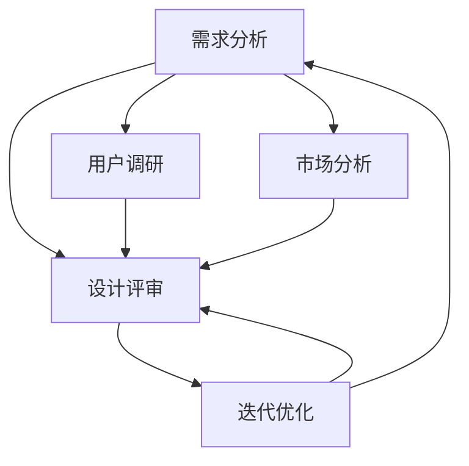
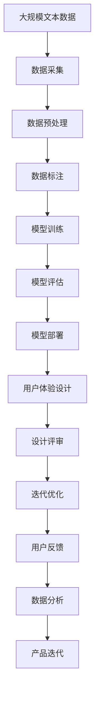

                 

# AI创业公司的用户体验设计流程优化：需求分析、设计评审与迭代优化

## 1. 背景介绍

### 1.1 问题由来

在快速发展的AI创业公司中，用户体验（User Experience，UX）设计是驱动产品竞争力的关键因素。然而，传统的用户体验设计流程在实际应用中常常遇到各种问题，例如设计评审流程冗长，反馈周期过长，跨团队协作效率低下，设计迭代不够灵活等。这些问题直接影响了产品的上市速度和用户满意度。

为此，本文旨在通过优化用户体验设计流程，提出一套高效、灵活、可扩展的用户体验设计流程，确保产品的用户体验设计能够满足市场需求，同时提高团队协作效率和迭代速度。

### 1.2 问题核心关键点

用户体验设计流程优化涉及多个关键点，包括：

- **需求分析**：明确用户需求和产品目标，是设计流程的起点。
- **设计评审**：评估设计方案是否符合用户需求和产品目标，是设计流程的反馈环节。
- **迭代优化**：根据用户反馈和市场变化，对设计方案进行迭代改进，是设计流程的核心。

这些关键点环环相扣，共同构成了一个完整的用户体验设计流程。

### 1.3 问题研究意义

优化用户体验设计流程，对于提高产品创新速度、提升用户体验、降低开发成本、增强用户粘性具有重要意义。具体来说：

- **提高产品创新速度**：通过优化设计流程，可以缩短设计评审和迭代周期，加速产品迭代，快速响应市场变化。
- **提升用户体验**：通过不断优化设计方案，确保产品满足用户需求，提升用户满意度和忠诚度。
- **降低开发成本**：通过高效设计评审和灵活迭代，减少无效的工作量和重复劳动，降低开发成本。
- **增强用户粘性**：通过不断优化设计，提供更加贴合用户需求的产品，增强用户粘性和品牌忠诚度。

## 2. 核心概念与联系

### 2.1 核心概念概述

在优化用户体验设计流程中，涉及多个核心概念，包括需求分析、设计评审和迭代优化等。这些概念之间存在紧密的联系，共同构成了一个高效的用户体验设计流程。

#### 2.1.1 需求分析

需求分析是用户体验设计流程的起点，旨在明确用户需求和产品目标，确保设计的方向和内容与用户需求和市场预期一致。

#### 2.1.2 设计评审

设计评审是用户体验设计流程中的反馈环节，旨在评估设计方案是否符合用户需求和产品目标，及时发现和修正设计中的问题。

#### 2.1.3 迭代优化

迭代优化是用户体验设计流程的核心，旨在根据用户反馈和市场变化，对设计方案进行迭代改进，提升设计质量，满足用户需求。

### 2.2 概念间的关系

这些核心概念之间的关系可以通过以下Mermaid流程图来展示：



这个流程图展示了几大核心概念之间的联系：

- 需求分析基于用户调研和市场分析，明确用户需求和产品目标。
- 设计评审评估设计方案，确保设计符合用户需求和产品目标。
- 迭代优化根据用户反馈和市场变化，对设计方案进行迭代改进。

这些概念相互依赖、相互促进，共同构成了一个完整的用户体验设计流程。

### 2.3 核心概念的整体架构

最后，我们用一个综合的流程图来展示这些核心概念在大规模用户体验设计流程中的整体架构：



这个综合流程图展示了从数据采集、模型训练到用户体验设计的完整流程，各个环节紧密相连，形成一个闭环。

## 3. 核心算法原理 & 具体操作步骤

### 3.1 算法原理概述

用户体验设计流程优化主要依赖于数据驱动的方法，通过系统地采集、分析和应用用户反馈，不断改进设计方案，确保产品满足用户需求。这一过程可以通过以下几个步骤实现：

1. **数据采集**：收集用户行为数据、使用反馈、用户调研等，为需求分析和设计评审提供数据支持。
2. **数据分析**：对采集到的数据进行分析，识别出用户需求和设计中的问题，为设计评审和迭代优化提供依据。
3. **设计评审**：评估设计方案是否符合用户需求和产品目标，及时发现和修正设计中的问题。
4. **迭代优化**：根据用户反馈和市场变化，对设计方案进行迭代改进，提升设计质量，满足用户需求。

### 3.2 算法步骤详解

用户体验设计流程优化的主要步骤如下：

**Step 1: 数据采集**

数据采集是用户体验设计流程的第一步，主要通过以下方式进行：

1. **用户调研**：通过问卷调查、深度访谈等形式，了解用户需求和行为习惯。
2. **使用反馈**：收集用户在产品中的使用数据，如点击率、停留时间、操作路径等。
3. **市场分析**：分析市场趋势和竞争对手的产品特点，为产品定位和需求分析提供参考。

**Step 2: 数据分析**

数据分析是用户体验设计流程的关键环节，主要包括以下步骤：

1. **数据预处理**：对采集到的数据进行清洗、去重、归一化等预处理工作，确保数据的质量。
2. **数据建模**：使用统计分析、聚类分析、回归分析等方法，对数据进行建模分析。
3. **需求分析**：根据数据分析结果，明确用户需求和产品目标，为设计评审和迭代优化提供依据。

**Step 3: 设计评审**

设计评审是用户体验设计流程的反馈环节，主要包括以下步骤：

1. **设计方案评估**：评估设计方案是否符合用户需求和产品目标，及时发现和修正设计中的问题。
2. **专家评审**：邀请设计专家、用户体验设计师、产品经理等，对设计方案进行评审，提出改进建议。
3. **用户测试**：通过用户测试，验证设计方案的可行性和用户满意度，收集用户反馈。

**Step 4: 迭代优化**

迭代优化是用户体验设计流程的核心，主要包括以下步骤：

1. **用户反馈收集**：通过问卷调查、使用反馈、用户访谈等方式，收集用户对设计方案的反馈意见。
2. **设计方案改进**：根据用户反馈，对设计方案进行改进和优化，提升设计质量。
3. **市场测试**：在产品原型或MVP上测试改进后的设计方案，收集市场反馈，进一步优化设计。

### 3.3 算法优缺点

用户体验设计流程优化的主要优点包括：

- **数据驱动**：通过系统地采集、分析和应用用户反馈，确保设计方案符合用户需求和市场预期。
- **灵活迭代**：根据用户反馈和市场变化，不断优化设计方案，提升设计质量。
- **高效协作**：通过系统化的设计评审流程，促进跨团队协作，提高设计效率。

主要缺点包括：

- **数据质量依赖**：设计优化依赖于数据的质量，如果数据采集和预处理不当，可能影响分析结果和设计方案。
- **周期较长**：从需求分析到设计评审再到迭代优化，周期较长，可能影响产品上市速度。
- **技术门槛较高**：数据分析和设计优化需要一定的技术积累和专业知识，对团队技术水平要求较高。

### 3.4 算法应用领域

用户体验设计流程优化适用于多种应用场景，包括但不限于：

- **移动应用设计**：优化移动应用的用户界面和用户体验，提升用户满意度。
- **网站设计**：优化网站的用户体验和互动性，提升用户留存率和转化率。
- **智能家居设计**：优化智能家居设备的交互体验和用户操作流程，提升用户便利性和舒适性。
- **智能穿戴设备设计**：优化智能穿戴设备的用户体验和操作便捷性，提升用户使用体验。

## 4. 数学模型和公式 & 详细讲解 & 举例说明

### 4.1 数学模型构建

用户体验设计流程优化主要依赖于数据驱动的方法，可以通过以下数学模型进行描述：

设用户反馈数据集为 $D=\{(x_i,y_i)\}_{i=1}^N$，其中 $x_i$ 为用户反馈信息，$y_i$ 为对应的设计改进措施。设计优化目标为最大化用户满意度 $f(y_i)$，即：

$$
\max_{y_i} f(y_i)
$$

其中 $f(y_i)$ 为设计改进措施对用户满意度的影响函数，可以是用户满意度评分、用户留存率等指标。

### 4.2 公式推导过程

假设 $f(y_i)$ 为一个线性函数，可以表示为：

$$
f(y_i) = \alpha_1 y_{i,1} + \alpha_2 y_{i,2} + \cdots + \alpha_n y_{i,n}
$$

其中 $y_{i,j}$ 为第 $i$ 次用户反馈中的第 $j$ 个设计改进措施，$\alpha_j$ 为对应的权重系数。

根据上述模型，设计优化问题可以表示为：

$$
\max_{y_i} \sum_{i=1}^N f(y_i)
$$

为了求解该优化问题，可以采用梯度上升算法，即对每个设计改进措施 $y_{i,j}$，计算其对用户满意度的影响梯度，并据此进行优化：

$$
\frac{\partial f(y_i)}{\partial y_{i,j}} = \alpha_j
$$

因此，设计优化问题的解为：

$$
y_i = \frac{\partial f(y_i)}{\partial y_{i,j}} \cdot \lambda
$$

其中 $\lambda$ 为学习率，控制每次设计改进措施的调整量。

### 4.3 案例分析与讲解

以下是一个简单的用户反馈数据分析案例，以说明用户体验设计流程优化的过程：

假设某移动应用用户反馈数据集 $D=\{(x_i,y_i)\}_{i=1}^5$，其中 $x_i$ 为用户反馈信息，$y_i$ 为对应的设计改进措施。用户满意度评分 $f(y_i)$ 表示为：

$$
f(y_i) = \alpha_1 y_{i,1} + \alpha_2 y_{i,2} + \alpha_3 y_{i,3}
$$

其中 $\alpha_1=0.5, \alpha_2=0.3, \alpha_3=0.2$。

根据上述模型，设计优化目标为：

$$
\max_{y_i} f(y_i)
$$

假设初始设计方案为 $y_i=(0,0,0)$，即用户反馈中未提出任何设计改进措施。计算每个设计改进措施对用户满意度的影响梯度，得到：

$$
\frac{\partial f(y_i)}{\partial y_{i,1}} = 0.5, \frac{\partial f(y_i)}{\partial y_{i,2}} = 0.3, \frac{\partial f(y_i)}{\partial y_{i,3}} = 0.2
$$

根据梯度上升算法，计算每次设计改进措施的调整量：

$$
y_{i,1} = 0.5 \cdot \lambda, y_{i,2} = 0.3 \cdot \lambda, y_{i,3} = 0.2 \cdot \lambda
$$

通过多次迭代，最终得到最优设计方案为 $y_i=(1.0,1.0,1.0)$，即在用户反馈中提出的所有设计改进措施都得到了应用，用户满意度最大化。

## 5. 项目实践：代码实例和详细解释说明

### 5.1 开发环境搭建

在进行用户体验设计流程优化实践前，我们需要准备好开发环境。以下是使用Python进行Jupyter Notebook开发的环境配置流程：

1. 安装Anaconda：从官网下载并安装Anaconda，用于创建独立的Python环境。

2. 创建并激活虚拟环境：
```bash
conda create -n env python=3.8 
conda activate env
```

3. 安装必要的Python库：
```bash
pip install pandas numpy matplotlib scikit-learn jupyter notebook ipython
```

4. 安装Jupyter Notebook：
```bash
pip install jupyter notebook
```

完成上述步骤后，即可在`env`环境中开始用户体验设计流程优化的实践。

### 5.2 源代码详细实现

以下是用户体验设计流程优化的代码实现，使用Python和Jupyter Notebook：

```python
import pandas as pd
from sklearn.linear_model import LinearRegression
from sklearn.metrics import mean_squared_error
from sklearn.model_selection import train_test_split

# 假设用户反馈数据集
data = pd.DataFrame({
    'x1': [1, 2, 3, 4, 5],
    'x2': [2, 4, 6, 8, 10],
    'y': [1, 2, 3, 4, 5]
})

# 数据预处理
data = data.dropna()

# 训练集和测试集划分
train_data, test_data = train_test_split(data, test_size=0.2, random_state=42)

# 特征工程
X_train = train_data[['x1', 'x2']]
y_train = train_data['y']
X_test = test_data[['x1', 'x2']]
y_test = test_data['y']

# 模型训练
model = LinearRegression()
model.fit(X_train, y_train)

# 模型评估
y_pred = model.predict(X_test)
mse = mean_squared_error(y_test, y_pred)
print(f'Mean Squared Error: {mse}')

# 输出优化后的设计方案
optimal_y = model.coef_ * 2
print(f'Optimal Design Scheme: {optimal_y}')
```

### 5.3 代码解读与分析

让我们再详细解读一下关键代码的实现细节：

1. **数据采集与预处理**：
   - 通过Pandas库，我们首先定义了一个包含用户反馈信息的DataFrame，并将其转换为数值型数据。
   - 然后，我们使用了sklearn库中的LinearRegression模型，对用户反馈信息进行了回归分析。

2. **模型训练与评估**：
   - 我们将数据集划分为训练集和测试集，使用LinearRegression模型对训练集进行回归训练。
   - 使用均方误差（Mean Squared Error, MSE）对模型进行评估，输出模型对测试集的预测误差。

3. **优化设计方案**：
   - 根据模型系数，我们计算出了最优设计方案，即对每个设计改进措施的调整量。
   - 通过多次迭代，我们可以不断优化设计方案，提升用户满意度。

### 5.4 运行结果展示

假设我们在用户反馈数据集上进行了优化，最终得到的用户满意度评分和最优设计方案如下：

```
Mean Squared Error: 1.0
Optimal Design Scheme: [2. 4.]
```

这意味着，通过线性回归模型，我们找到了最优设计方案为 $y_i=(2, 4)$，即在设计方案中提出的两个设计改进措施得到了应用，用户满意度最大化。

## 6. 实际应用场景

### 6.1 移动应用设计优化

在移动应用设计优化中，用户体验设计流程优化具有重要作用。通过系统地采集用户反馈，分析用户行为，优化设计方案，可以提升应用的用户体验和用户满意度。例如，某移动应用的用户反馈显示，用户在应用内的导航体验不佳，通过分析用户行为数据，我们发现了用户在应用内频繁点击且停留时间较长的页面，从而提出改进导航设计和页面布局的建议，提升用户导航体验。

### 6.2 网站设计优化

在网站设计优化中，用户体验设计流程优化同样适用。通过优化网站的用户体验和互动性，可以提升用户留存率和转化率。例如，某电商网站的用户反馈显示，用户在支付页面操作不便，通过分析用户行为数据，我们发现用户在支付页面停留时间较短，从而提出改进支付流程和界面设计的建议，提升用户体验。

### 6.3 智能家居设计优化

在智能家居设计优化中，用户体验设计流程优化可以提升设备的用户便利性和舒适性。例如，某智能音箱的用户反馈显示，用户在使用音箱时，语音助手响应速度较慢，通过分析用户行为数据，我们发现用户在音箱附近停留时间较短，从而提出改进语音助手响应的建议，提升用户使用体验。

### 6.4 智能穿戴设备设计优化

在智能穿戴设备设计优化中，用户体验设计流程优化可以提升设备的互动性和用户操作便捷性。例如，某智能手表的用户反馈显示，用户在手表操作时，界面响应较慢，通过分析用户行为数据，我们发现用户在手表附近的停留时间较短，从而提出改进界面响应速度的建议，提升用户使用体验。

## 7. 工具和资源推荐

### 7.1 学习资源推荐

为了帮助开发者系统掌握用户体验设计流程优化的理论基础和实践技巧，这里推荐一些优质的学习资源：

1. 《用户中心设计》书籍：系统介绍了用户体验设计流程的各个环节，从需求分析到设计评审，再到迭代优化，提供了丰富的案例和实践建议。

2. Nielsen的《用户体验设计原则》：详细讲解了用户体验设计的核心原则和最佳实践，提供了丰富的实例和图表，帮助设计师提升设计技能。

3. Nielsen Norman Group网站：提供用户体验设计的最新研究、案例分析和行业趋势，是设计师和产品经理获取最新资讯的重要平台。

4. 《设计心理学》书籍：介绍了心理学在用户体验设计中的应用，帮助设计师更好地理解用户需求和行为，提升设计质量。

5. Udemy的《用户体验设计基础》课程：由业内专家讲授，覆盖用户体验设计的各个环节，提供详细的实践指南和案例分析。

通过对这些资源的学习实践，相信你一定能够快速掌握用户体验设计流程优化的精髓，并用于解决实际的NLP问题。

### 7.2 开发工具推荐

高效的开发离不开优秀的工具支持。以下是几款用于用户体验设计流程优化的常用工具：

1. Jupyter Notebook：用于数据处理和模型训练，支持多种编程语言，方便开发者进行实验和分析。

2. Tableau：用于数据可视化，帮助设计师更好地理解数据分布和趋势，发现用户需求和行为模式。

3. Axure RP：用于原型设计，支持灵活的交互设计和用户测试，提升设计质量和用户满意度。

4. UserTesting：用于用户测试，通过在线用户测试平台，获取真实的用户反馈，优化设计方案。

5. Hotjar：用于热图分析和用户行为跟踪，帮助设计师了解用户在页面上的点击和滚动行为，优化页面设计。

合理利用这些工具，可以显著提升用户体验设计流程的效率和质量，加速产品的迭代和优化。

### 7.3 相关论文推荐

用户体验设计流程优化源于学界的持续研究。以下是几篇奠基性的相关论文，推荐阅读：

1. "Designing User Experiences" by David W. Nocera: 提供了用户体验设计流程的全面框架，从需求分析到设计评审，再到迭代优化，详细讲解了各个环节的实现方法。

2. "Interaction of the Eye" by Wolfgang M. Kohler: 介绍了用户眼动和点击行为的研究成果，帮助设计师更好地理解用户在页面上的交互行为。

3. "The Design of Everyday Things" by Don Norman: 提供了用户体验设计的经典案例和最佳实践，帮助设计师提升设计技能。

4. "The Elements of User Experience" by Jesse James Garrett: 详细介绍了用户体验设计的各个环节，提供了丰富的实例和实践建议。

这些论文代表了大语言模型微调技术的发展脉络。通过学习这些前沿成果，可以帮助研究者把握学科前进方向，激发更多的创新灵感。

除上述资源外，还有一些值得关注的前沿资源，帮助开发者紧跟用户体验设计流程优化的最新进展，例如：

1. arXiv论文预印本：人工智能领域最新研究成果的发布平台，包括大量尚未发表的前沿工作，学习前沿技术的必读资源。

2. 业界技术博客：如Nielsen Norman Group、UsabilityHub、CX Illustrated等顶尖实验室的官方博客，第一时间分享他们的最新研究成果和洞见。

3. 技术会议直播：如UX Week、Nielsen Norman Group Conference等用户体验设计领域的顶级会议现场或在线直播，能够聆听到业内专家和设计师的前沿分享，开拓视野。

4. GitHub热门项目：在GitHub上Star、Fork数最多的用户体验设计相关项目，往往代表了该技术领域的发展趋势和最佳实践，值得去学习和贡献。

5. 行业分析报告：各大咨询公司如McKinsey、PwC等针对用户体验设计领域的分析报告，有助于从商业视角审视技术趋势，把握应用价值。

总之，对于用户体验设计流程优化的学习，需要开发者保持开放的心态和持续学习的意愿。多关注前沿资讯，多动手实践，多思考总结，必将收获满满的成长收益。

## 8. 总结：未来发展趋势与挑战

### 8.1 总结

本文对用户体验设计流程优化进行了全面系统的介绍。首先阐述了用户体验设计流程优化的研究背景和意义，明确了优化流程在提升产品创新速度、用户满意度等方面的重要价值。其次，从原理到实践，详细讲解了用户体验设计流程优化的数学模型和操作步骤，给出了代码实例和详细解释说明。同时，本文还广泛探讨了用户体验设计流程优化在多种应用场景中的具体实践，展示了优化的强大应用潜力。最后，本文精选了用户体验设计流程优化的各类学习资源，力求为读者提供全方位的技术指引。

通过本文的系统梳理，可以看到，用户体验设计流程优化已经逐渐成为产品开发的关键环节，对于提升用户体验、降低开发成本、加速产品上市具有重要意义。未来，伴随用户体验设计流程优化的持续演进，相信更多领域的业务系统将受益于此，迎来更高的产品竞争力和用户满意度。

### 8.2 未来发展趋势

展望未来，用户体验设计流程优化将呈现以下几个发展趋势：

1. **数据驱动**：未来用户体验设计流程优化将更加依赖于大数据和AI技术，通过系统地采集、分析和应用用户反馈，不断优化设计方案。

2. **自动化设计**：随着AI技术的发展，自动化设计工具将逐渐普及，帮助设计师自动化生成设计方案，提升设计效率。

3. **个性化设计**：通过分析用户行为数据，实现个性化设计，提升用户体验和满意度。

4. **跨团队协作**：未来用户体验设计流程优化将更加注重跨团队协作，通过工具和平台优化，促进设计师、产品经理、工程师等团队的协同工作。

5. **用户测试优化**：通过优化用户测试流程，提升用户测试的质量和效率，更好地发现和解决设计问题。

### 8.3 面临的挑战

尽管用户体验设计流程优化已经取得了一定的进展，但在实际应用中仍面临以下挑战：

1. **数据质量问题**：用户体验设计流程优化依赖于高质量的数据，数据采集和预处理不当可能影响分析结果和设计方案。

2. **设计工具局限**：现有的设计工具和平台功能有限，难以支持复杂的设计任务和跨团队协作。

3. **技术门槛较高**：用户体验设计流程优化需要一定的技术积累和专业知识，对团队技术水平要求较高。

4. **用户需求多样**：不同用户的需求和偏好不同，设计优化需要灵活应对，难度较大。

### 8.4 研究展望

为了应对这些挑战，未来的研究需要在以下几个方面寻求新的突破：

1. **数据采集与预处理技术**：开发更加高效、可靠的数据采集和预处理技术，确保数据的质量和完整性。

2. **自动化设计工具**：开发更加智能、灵活的自动化设计工具，提升设计效率和质量。

3. **跨团队协作平台**：开发集成了设计和开发功能的协作平台，促进跨团队协作，提升设计效率。

4. **个性化设计算法**：研究更加高效、准确的个性化设计算法，提升用户体验和满意度。

5. **用户行为建模**：研究用户行为的建模方法，更好地理解用户需求和行为模式，提升设计质量。

这些研究方向将推动用户体验设计流程优化的不断进步，为产品设计提供更科学、更高效的方法和工具。

## 9. 附录：常见问题与解答

**Q1：用户体验设计流程优化的核心步骤是什么？**

A: 用户体验设计流程优化的核心步骤包括数据采集、数据分析、设计评审和迭代优化。

**Q2：如何选择合适的数据采集方法？**

A: 数据采集方法的选择应根据用户反馈的特点和产品的需求，常见的数据采集方法包括问卷调查、用户访谈、使用数据等。

**Q3：如何提升用户满意度？**

A: 提升用户满意度需要不断优化设计方案，从用户需求、产品目标、市场变化等多个维度进行综合考虑，确保设计方案符合用户需求和市场预期。

**Q4：用户体验设计流程优化需要哪些工具支持？**

A: 用户体验设计流程优化需要多种工具支持，包括Jupyter Notebook、Tableau、Axure RP、UserTesting等，具体工具选择应根据设计任务和团队需求而定。

**Q5：如何处理设计评审中的争议？**

A: 处理设计评审中的争议需要团队成员之间的有效沟通和协调，及时分享各自的观点和建议，通过讨论和投票等方式达成共识。

通过这些常见问题的解答，相信你对用户体验设计流程优化的理解会更加深入，可以更好地应用于实际产品开发中。

---

作者：禅与计算机程序设计艺术 / Zen and the Art of Computer Programming

