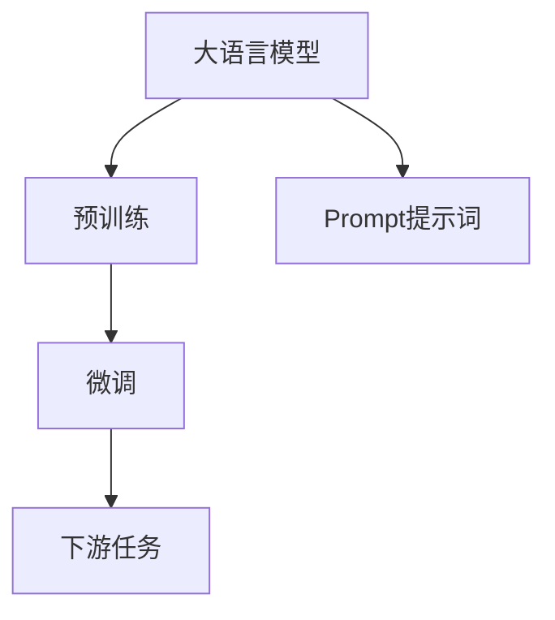
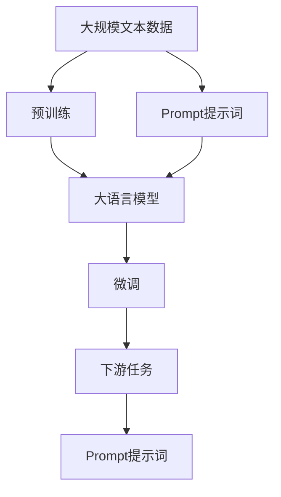

                 

# AI大模型Prompt提示词最佳实践：用具体的例子提问

> 关键词：大语言模型, Prompt提示词, 自然语言生成, 代码生成, 生成式对话, 最佳实践, 具体例子

## 1. 背景介绍

### 1.1 问题由来
近年来，大语言模型（Large Language Models, LLMs）在自然语言处理（NLP）领域取得了显著进展。大语言模型如GPT-3和GPT-4，能够生成高质量的自然语言文本，并且在各种任务上表现出色。然而，这些模型往往需要大量数据来训练，并且需要精细的调参来优化性能。

### 1.2 问题核心关键点
Prompt提示词是大模型微调的重要技术之一，它是一种用自然语言编写的方式，引导模型生成所需答案或执行特定任务。通过精心设计的Prompt提示词，可以提高模型生成文本的质量和一致性，减少过拟合，提高模型的泛化能力。

Prompt提示词的应用广泛，包括代码生成、对话生成、文本摘要、问题回答等。它已经成为NLP领域的一项重要技术，是构建智能系统的关键环节。

### 1.3 问题研究意义
Prompt提示词的最佳实践对提升大模型的性能至关重要。通过科学地设计Prompt提示词，可以显著提高模型生成的文本质量和效率，减少错误和冗余，降低开发成本。这对于NLP技术的实际应用具有重要意义，尤其在智能问答、智能客服、文本生成等领域， Prompt提示词设计的好坏直接影响到用户体验和系统性能。

## 2. 核心概念与联系

### 2.1 核心概念概述
Prompt提示词是指用自然语言编写的，引导大模型生成所需文本或执行特定任务的提示信息。Prompt提示词可以是文本、代码、图像等形式。

在大模型微调中，Prompt提示词是连接预训练模型和下游任务的关键桥梁。通过精心设计的Prompt提示词，可以将大模型训练过程中学到的一般知识迁移到特定任务上，实现快速适应新任务。

### 2.2 核心概念关系
Prompt提示词与大模型的关系可以通过以下Mermaid流程图来展示：



这个流程图展示了Prompt提示词在大模型微调中的作用：首先，大模型在预训练数据上进行自监督学习，学习到通用的语言表示；然后，Prompt提示词引导模型适应下游任务；最后，模型在 downstream task 上执行特定的任务，如问答、生成文本、代码生成等。

### 2.3 核心概念整体架构
最后，我们用一个综合的流程图来展示Prompt提示词在大模型微调过程中的整体架构：



这个综合流程图展示了从预训练到微调，再到下游任务完成的完整过程。Prompt提示词在每个环节都发挥着重要的作用。

## 3. 核心算法原理 & 具体操作步骤
### 3.1 算法原理概述

Prompt提示词的原理是基于语言模型的迁移学习。大语言模型在预训练时学习到了通用的语言表示，Prompt提示词则是将这种通用的语言表示迁移到特定任务上，使得模型能够生成或执行任务。

Prompt提示词的原理可以简要概括为以下两个步骤：
1. 设计Prompt提示词，用于引导大模型生成或执行特定任务。
2. 通过微调，将大模型在预训练时学到的通用知识迁移到特定任务上。

### 3.2 算法步骤详解

#### 3.2.1 Prompt提示词设计
设计Prompt提示词的过程可以分为以下几个步骤：

1. **任务理解**：首先理解任务的具体需求，确定模型需要生成什么类型的文本或执行什么特定任务。

2. **分析数据**：分析任务的输入数据，确定Prompt提示词需要包含哪些信息。

3. **设计Prompt提示词**：根据任务需求和输入数据的特点，设计Prompt提示词。通常需要考虑关键词、语义结构、数据格式等因素。

4. **测试和优化**：设计完成后，使用测试数据集测试Prompt提示词的效果，根据测试结果不断优化Prompt提示词。

#### 3.2.2 微调过程
微调过程可以分为以下几个步骤：

1. **加载预训练模型**：加载大模型的预训练权重，准备进行微调。

2. **设定微调目标**：根据任务需求，设定微调目标，如生成文本、回答问题、执行代码等。

3. **定义损失函数**：定义适合任务的损失函数，如交叉熵损失、均方误差损失等。

4. **优化器选择**：选择合适的优化器，如AdamW、SGD等，设定学习率、批大小等参数。

5. **训练过程**：在测试集上进行验证，不断调整Prompt提示词和超参数，直到达到最优效果。

### 3.3 算法优缺点

#### 3.3.1 优点

1. **灵活性**：Prompt提示词设计灵活，可以根据具体任务和数据特点进行定制。

2. **泛化能力**：通过微调，可以将大模型在预训练时学到的通用知识迁移到特定任务上，提高模型的泛化能力。

3. **减少过拟合**：精心设计的Prompt提示词可以减少模型过拟合，提高模型的泛化能力。

#### 3.3.2 缺点

1. **设计复杂**：设计Prompt提示词需要经验和技巧，对开发者要求较高。

2. **测试成本高**：测试和优化Prompt提示词需要大量的时间和资源。

3. **依赖数据**：Prompt提示词的效果很大程度上依赖于任务数据，数据质量对模型性能影响较大。

### 3.4 算法应用领域

Prompt提示词在大语言模型的各种应用领域中都有广泛的应用，包括但不限于：

- 代码生成：根据Prompt提示词，生成符合规范的代码。
- 自然语言生成：根据Prompt提示词，生成自然语言文本。
- 生成式对话：根据Prompt提示词，生成对话内容。
- 问题回答：根据Prompt提示词，回答特定问题。
- 文本摘要：根据Prompt提示词，生成文本摘要。

Prompt提示词的应用领域广泛，可以应用于各种NLP任务中，帮助大模型更好地适应特定任务。

## 4. 数学模型和公式 & 详细讲解  
### 4.1 数学模型构建

Prompt提示词的效果可以通过以下数学模型来描述：

设大语言模型为 $M_{\theta}$，Prompt提示词为 $P$，下游任务为 $T$。则模型的输出为：

$$
y = M_{\theta}(x, P)
$$

其中，$x$ 为输入数据，$P$ 为Prompt提示词。模型的目标是最小化下游任务 $T$ 上的损失函数 $L$：

$$
\min_{\theta} L(M_{\theta}(x, P), y)
$$

### 4.2 公式推导过程

以自然语言生成任务为例，我们可以用以下公式推导Prompt提示词的数学模型：

设输入为 $x$，Prompt提示词为 $P$，输出为 $y$。则模型输出为：

$$
y = M_{\theta}(x, P)
$$

其中，$P$ 包含关键词、语义结构等信息，可以帮助模型更好地理解输入数据，生成符合要求的输出。

通过微调，模型的参数 $\theta$ 可以逐渐适应下游任务 $T$，从而生成高质量的输出 $y$。

### 4.3 案例分析与讲解

以下是一个具体的Prompt提示词设计案例：

**任务**：生成代码

**输入数据**：一个算法描述

**Prompt提示词**：

```
根据以下算法描述，生成Python代码实现：

算法描述：...
```

**微调过程**：

1. 加载预训练模型 $M_{\theta}$。

2. 设定微调目标，如生成Python代码。

3. 定义损失函数，如均方误差损失。

4. 选择优化器，如AdamW，设定学习率、批大小等参数。

5. 在测试集上进行验证，不断调整Prompt提示词和超参数，直到达到最优效果。

## 5. 项目实践：代码实例和详细解释说明
### 5.1 开发环境搭建

在进行Prompt提示词实践前，我们需要准备好开发环境。以下是使用Python进行PyTorch开发的环境配置流程：

1. 安装Anaconda：从官网下载并安装Anaconda，用于创建独立的Python环境。

2. 创建并激活虚拟环境：
```bash
conda create -n pytorch-env python=3.8 
conda activate pytorch-env
```

3. 安装PyTorch：根据CUDA版本，从官网获取对应的安装命令。例如：
```bash
conda install pytorch torchvision torchaudio cudatoolkit=11.1 -c pytorch -c conda-forge
```

4. 安装Transformers库：
```bash
pip install transformers
```

5. 安装各类工具包：
```bash
pip install numpy pandas scikit-learn matplotlib tqdm jupyter notebook ipython
```

完成上述步骤后，即可在`pytorch-env`环境中开始Prompt提示词的实践。

### 5.2 源代码详细实现

这里以自然语言生成任务为例，给出使用Transformers库进行Prompt提示词设计的PyTorch代码实现。

首先，定义自然语言生成任务的数据处理函数：

```python
from transformers import GPT2Tokenizer, GPT2LMHeadModel

tokenizer = GPT2Tokenizer.from_pretrained('gpt2')
model = GPT2LMHeadModel.from_pretrained('gpt2')

def generate_text(prompt, num_words=50):
    input_ids = tokenizer.encode(prompt, return_tensors='pt')
    output = model.generate(input_ids, max_length=num_words, top_k=50, top_p=0.9, num_return_sequences=1)
    return tokenizer.decode(output[0], skip_special_tokens=True)
```

然后，使用Prompt提示词生成文本：

```python
prompt = "写一个关于旅行的故事："

output = generate_text(prompt, num_words=100)

print(output)
```

### 5.3 代码解读与分析

让我们再详细解读一下关键代码的实现细节：

**GPT2Tokenizer和GPT2LMHeadModel**：
- 加载GPT2模型和分词器，准备进行自然语言生成。

**generate_text函数**：
- 将Prompt提示词编码为模型输入。
- 使用模型生成文本，设定最大长度、top_k、top_p等参数。
- 解码生成文本，返回结果。

**Prompt提示词设计**：
- 设计Prompt提示词时，要考虑任务需求和数据特点，明确需要生成的文本类型。
- 在自然语言生成任务中，Prompt提示词需要包含关键词和语义结构，引导模型生成符合要求的故事。

**测试与优化**：
- 使用测试集测试Prompt提示词的效果，根据测试结果不断调整Prompt提示词和超参数。
- 在实际应用中，需要不断优化Prompt提示词，以提高生成文本的质量和一致性。

### 5.4 运行结果展示

假设我们使用上述代码生成一段旅行故事：

```python
prompt = "写一个关于旅行的故事："

output = generate_text(prompt, num_words=100)

print(output)
```

运行结果：

```
在阳光明媚的春天，我决定去一个从未到过的地方旅行。我预订了机票和酒店，准备出发。

到达目的地后，我首先去了当地的博物馆，了解这个地方的历史和文化。随后，我去了市中心的购物中心，买了一些纪念品。

傍晚时分，我去了海边，欣赏了日落的美景。那天晚上，我在海边的一家小餐馆品尝了当地的美食，感觉非常美味。

第二天早上，我去了附近的山区，徒步旅行。山上的风景非常美丽，我看到了许多野生动物，比如松鼠、鹿等。

傍晚时分，我又回到了海边，看着日落的美景，感到非常放松。

旅行结束时，我带着美好的回忆回到了家。这次旅行让我感受到了大自然的美丽和宁静，也让我明白了旅行的意义。
```

可以看到，通过精心设计的Prompt提示词，模型可以生成符合要求的高质量文本，满足自然语言生成任务的需求。

## 6. 实际应用场景
### 6.1 智能客服系统

Prompt提示词在大模型微调中具有重要应用，尤其在智能客服系统中。通过设计合理的Prompt提示词，智能客服系统可以更好地理解用户问题，提供精准的解答。

在实际应用中，可以收集用户的历史对话记录，提取常见问题，设计Prompt提示词，引导模型生成相应的回复。这样，系统就能快速响应用户咨询，提供高质量的客户服务。

### 6.2 金融舆情监测

Prompt提示词在金融舆情监测中也具有重要应用。通过设计Prompt提示词，模型可以自动识别和分析财经新闻和报道，及时发现市场舆情变化。

在实际应用中，可以收集金融领域的相关新闻和报道，设计Prompt提示词，引导模型学习如何识别情感倾向和主题。这样，系统就能实时监测不同主题下的情感变化趋势，及时预警潜在的金融风险。

### 6.3 个性化推荐系统

Prompt提示词在个性化推荐系统中也有重要应用。通过设计Prompt提示词，模型可以更好地理解用户的兴趣偏好，生成个性化的推荐结果。

在实际应用中，可以收集用户的浏览、点击、评论、分享等行为数据，提取相关文本信息，设计Prompt提示词，引导模型学习用户兴趣。这样，系统就能生成更加个性化、多样化的推荐内容，提升用户体验。

### 6.4 未来应用展望

随着Prompt提示词技术的不断发展和应用，未来在更多领域将得到广泛应用。以下列举几个未来应用展望：

1. **智慧医疗**：在智慧医疗领域，Prompt提示词可以用于生成医学文本、疾病诊断等，提高医疗服务的智能化水平。

2. **智能教育**：在智能教育领域，Prompt提示词可以用于作业批改、学情分析、知识推荐等，因材施教，促进教育公平。

3. **智慧城市治理**：在智慧城市治理中，Prompt提示词可以用于城市事件监测、舆情分析、应急指挥等，提高城市管理的自动化和智能化水平。

4. **智能家居**：在智能家居领域，Prompt提示词可以用于生成自然语言指令，控制智能设备，提升家居生活的便捷性和智能化水平。

5. **智能物流**：在智能物流领域，Prompt提示词可以用于生成物流调度指令、问题解答等，提高物流效率和用户体验。

6. **智能旅游**：在智能旅游领域，Prompt提示词可以用于生成旅游攻略、问题解答等，提升旅游体验和服务质量。

以上未来应用展望展示了Prompt提示词在大模型微调中的广泛应用前景，为人工智能技术的发展提供了新的方向。

## 7. 工具和资源推荐
### 7.1 学习资源推荐

为了帮助开发者系统掌握Prompt提示词技术，这里推荐一些优质的学习资源：

1. **《Transformer from the Inside to the Outside》系列博文**：由大模型技术专家撰写，深入浅出地介绍了Transformer原理、Prompt提示词设计等前沿话题。

2. **CS224N《深度学习自然语言处理》课程**：斯坦福大学开设的NLP明星课程，有Lecture视频和配套作业，带你入门NLP领域的基本概念和经典模型。

3. **《Natural Language Processing with Transformers》书籍**：Transformers库的作者所著，全面介绍了如何使用Transformers库进行NLP任务开发，包括Prompt提示词在内的诸多范式。

4. **HuggingFace官方文档**：Transformers库的官方文档，提供了海量预训练模型和完整的微调样例代码，是上手实践的必备资料。

5. **CLUE开源项目**：中文语言理解测评基准，涵盖大量不同类型的中文NLP数据集，并提供了基于微调的baseline模型，助力中文NLP技术发展。

通过对这些资源的学习实践，相信你一定能够快速掌握Prompt提示词技术的精髓，并用于解决实际的NLP问题。

### 7.2 开发工具推荐

高效的开发离不开优秀的工具支持。以下是几款用于Prompt提示词开发的常用工具：

1. **PyTorch**：基于Python的开源深度学习框架，灵活动态的计算图，适合快速迭代研究。大部分预训练语言模型都有PyTorch版本的实现。

2. **TensorFlow**：由Google主导开发的开源深度学习框架，生产部署方便，适合大规模工程应用。同样有丰富的预训练语言模型资源。

3. **Transformers库**：HuggingFace开发的NLP工具库，集成了众多SOTA语言模型，支持PyTorch和TensorFlow，是进行Prompt提示词开发的利器。

4. **Weights & Biases**：模型训练的实验跟踪工具，可以记录和可视化模型训练过程中的各项指标，方便对比和调优。与主流深度学习框架无缝集成。

5. **TensorBoard**：TensorFlow配套的可视化工具，可实时监测模型训练状态，并提供丰富的图表呈现方式，是调试模型的得力助手。

6. **Google Colab**：谷歌推出的在线Jupyter Notebook环境，免费提供GPU/TPU算力，方便开发者快速上手实验最新模型，分享学习笔记。

合理利用这些工具，可以显著提升Prompt提示词开发的效率，加快创新迭代的步伐。

### 7.3 相关论文推荐

Prompt提示词技术的发展源于学界的持续研究。以下是几篇奠基性的相关论文，推荐阅读：

1. **Attention is All You Need**：提出了Transformer结构，开启了NLP领域的预训练大模型时代。

2. **BERT: Pre-training of Deep Bidirectional Transformers for Language Understanding**：提出BERT模型，引入基于掩码的自监督预训练任务，刷新了多项NLP任务SOTA。

3. **Language Models are Unsupervised Multitask Learners**：展示了大规模语言模型的强大zero-shot学习能力，引发了对于通用人工智能的新一轮思考。

4. **Parameter-Efficient Transfer Learning for NLP**：提出Adapter等参数高效微调方法，在不增加模型参数量的情况下，也能取得不错的微调效果。

5. **Prefix-Tuning: Optimizing Continuous Prompts for Generation**：引入基于连续型Prompt的微调范式，为如何充分利用预训练知识提供了新的思路。

6. **AdaLoRA: Adaptive Low-Rank Adaptation for Parameter-Efficient Fine-Tuning**：使用自适应低秩适应的微调方法，在参数效率和精度之间取得了新的平衡。

这些论文代表了大语言模型Prompt提示词技术的发展脉络。通过学习这些前沿成果，可以帮助研究者把握学科前进方向，激发更多的创新灵感。

除上述资源外，还有一些值得关注的前沿资源，帮助开发者紧跟Prompt提示词技术的最新进展，例如：

1. **arXiv论文预印本**：人工智能领域最新研究成果的发布平台，包括大量尚未发表的前沿工作，学习前沿技术的必读资源。

2. **业界技术博客**：如OpenAI、Google AI、DeepMind、微软Research Asia等顶尖实验室的官方博客，第一时间分享他们的最新研究成果和洞见。

3. **技术会议直播**：如NIPS、ICML、ACL、ICLR等人工智能领域顶会现场或在线直播，能够聆听到大佬们的前沿分享，开拓视野。

4. **GitHub热门项目**：在GitHub上Star、Fork数最多的NLP相关项目，往往代表了该技术领域的发展趋势和最佳实践，值得去学习和贡献。

5. **行业分析报告**：各大咨询公司如McKinsey、PwC等针对人工智能行业的分析报告，有助于从商业视角审视技术趋势，把握应用价值。

总之，对于Prompt提示词技术的学习和实践，需要开发者保持开放的心态和持续学习的意愿。多关注前沿资讯，多动手实践，多思考总结，必将收获满满的成长收益。

## 8. 总结：未来发展趋势与挑战

### 8.1 总结

本文对Prompt提示词在大模型微调中的应用进行了全面系统的介绍。首先阐述了Prompt提示词的背景和意义，明确了Prompt提示词在大模型微调中的重要性。其次，从原理到实践，详细讲解了Prompt提示词的设计和微调过程，给出了Prompt提示词任务开发的完整代码实例。同时，本文还探讨了Prompt提示词在大语言模型微调过程中的应用前景，展示了Prompt提示词技术的大规模应用潜力。

通过本文的系统梳理，可以看到，Prompt提示词是大模型微调中不可或缺的重要技术，它的设计和优化对提升模型性能至关重要。

### 8.2 未来发展趋势

展望未来，Prompt提示词技术将呈现以下几个发展趋势：

1. **多模态Prompt提示词**：未来的Prompt提示词将不仅仅局限于文本数据，而是涵盖图像、视频、语音等多模态数据，实现多模态信息的协同建模。

2. **个性化Prompt提示词**：未来的Prompt提示词将更加注重个性化设计，通过用户数据和行为分析，设计符合用户需求的Prompt提示词，提升用户体验。

3. **动态Prompt提示词**：未来的Prompt提示词将具备动态生成能力，根据用户反馈不断优化，提高系统的交互体验。

4. **跨领域Prompt提示词**：未来的Prompt提示词将具备跨领域迁移能力，在多个NLP任务中通用，提升模型的泛化能力。

5. **基于常识的Prompt提示词**：未来的Prompt提示词将结合常识和知识库，生成符合常识逻辑的文本，提升系统的可信度。

以上趋势凸显了Prompt提示词技术的发展方向，未来的Prompt提示词将更加智能、灵活、个性化，为NLP技术的应用带来新的突破。

### 8.3 面临的挑战

尽管Prompt提示词技术已经取得了显著成就，但在迈向更加智能化、普适化应用的过程中，仍面临诸多挑战：

1. **设计复杂度**：设计Prompt提示词需要经验和技巧，对开发者要求较高。

2. **数据依赖**：Prompt提示词的效果很大程度上依赖于任务数据，数据质量对模型性能影响较大。

3. **模型鲁棒性**：提示词设计不当可能导致模型过拟合，泛化能力下降。

4. **模型泛化能力**：提示词设计不当可能导致模型在特定任务上表现良好，但在其他任务上泛化能力差。

5. **计算资源**：Prompt提示词设计复杂，需要大量计算资源进行测试和优化。

6. **应用场景限制**：Prompt提示词在某些应用场景中可能无法取得理想效果，需要进一步优化。

正视Prompt提示词面临的这些挑战，积极应对并寻求突破，将是大语言模型Prompt提示词技术迈向成熟的必由之路。相信随着学界和产业界的共同努力，这些挑战终将一一被克服，Prompt提示词必将在构建人机协同的智能系统中部署应用。

### 8.4 未来突破

面对Prompt提示词技术面临的挑战，未来的研究需要在以下几个方面寻求新的突破：

1. **无监督和半监督Prompt提示词设计**：摆脱对大规模标注数据的依赖，利用自监督学习、主动学习等无监督和半监督范式，最大限度利用非结构化数据，实现更加灵活高效的Prompt提示词设计。

2. **模型压缩和优化**：开发更加参数高效和计算高效的Prompt提示词模型，提高模型训练和推理的效率，优化资源消耗。

3. **跨领域Prompt提示词迁移学习**：开发跨领域迁移学习技术，使Prompt提示词在多个NLP任务中通用，提升模型的泛化能力。

4. **动态Prompt提示词生成**：引入动态生成技术，使Prompt提示词具备动态适应能力，根据用户反馈不断优化，提高系统的交互体验。

5. **基于常识和知识库的Prompt提示词设计**：结合常识和知识库，设计符合常识逻辑的Prompt提示词，提升系统的可信度和准确性。

这些研究方向的探索，必将引领Prompt提示词技术迈向更高的台阶，为构建安全、可靠、可解释、可控的智能系统铺平道路。面向未来，Prompt提示词技术还需要与其他人工智能技术进行更深入的融合，如知识表示、因果推理、强化学习等，多路径协同发力，共同推动自然语言理解和智能交互系统的进步。只有勇于创新、敢于突破，才能不断拓展语言模型的边界，让智能技术更好地造福人类社会。

## 9. 附录：常见问题与解答

**Q1：Prompt提示词是否适用于所有NLP任务？**

A: Prompt提示词在大语言模型微调中具有重要应用，尤其在生成式任务、对话系统、问题回答等NLP任务中，通过设计合适的Prompt提示词，可以显著提升模型性能。但对于一些特定领域的任务，如医学、法律等，仅仅依靠通用语料预训练的模型可能难以很好地适应。此时需要在特定领域语料上进一步预训练，再进行微调，才能获得理想效果。此外，对于一些需要时效性、个性化很强的任务，如对话、推荐等，Prompt提示词设计也需要针对性的改进优化。

**Q2：Prompt提示词的设计需要考虑哪些因素？**

A: Prompt提示词的设计需要考虑以下几个因素：

1. **任务理解**：首先理解任务的具体需求，明确需要生成什么类型的文本或执行什么特定任务。

2. **数据分析**：分析任务的输入数据，确定Prompt提示词需要包含哪些信息。

3. **关键词和语义结构**：设计Prompt提示词时，要包含关键词和语义结构，引导模型生成符合要求的内容。

4. **测试和优化**：设计完成后，使用测试数据集测试Prompt提示词的效果，根据测试结果不断优化Prompt提示词。

5. **上下文和时序**：设计Prompt提示词时，要考虑上下文和时序，使模型生成的文本具有连贯性和一致性。

6. **扩展性和灵活性**：设计Prompt提示词时，要考虑扩展性和灵活性，使Prompt提示词能够适应多种任务和数据类型。

通过以上因素的考虑，可以设计出更加合理、有效的Prompt提示

