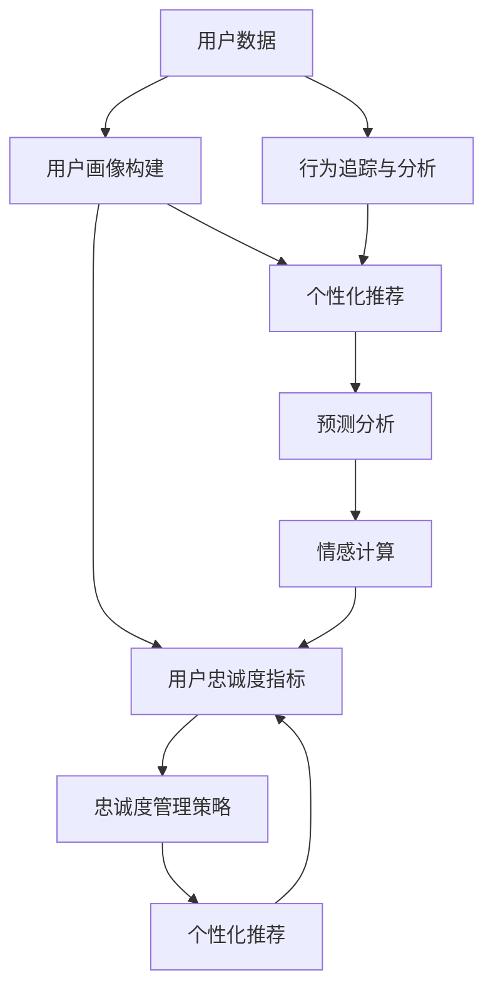

                 

## 1. 背景介绍

### 1.1 问题由来
在当今激烈的市场竞争环境中，提升用户忠诚度已成为电商企业成功的关键要素之一。用户忠诚度不仅能够带来重复购买、口碑传播等直接收益，还通过提高用户粘性间接增强市场竞争力。因此，企业需要不断探索新方法以提升用户满意度，增强用户粘性，构建长期稳定的合作关系。

近年来，人工智能（AI）技术飞速发展，为电商企业提供了强有力的工具来管理和提升用户忠诚度。AI技术能够通过数据分析、预测、自动化等方式，帮助企业更准确地了解用户需求，个性化推荐产品，提升用户体验，从而提高用户忠诚度。

### 1.2 问题核心关键点
构建用户忠诚度管理系统，需要重点关注以下关键点：

- **数据获取与处理**：通过各种渠道收集用户数据，包括购买记录、浏览行为、评价反馈等，以便分析用户行为特征和需求。
- **用户画像构建**：基于用户数据，构建详细的用户画像，包括用户兴趣、购买偏好、消费能力等，以便个性化推荐和服务。
- **预测分析**：利用机器学习模型对用户行为进行预测，识别高价值用户和潜在流失用户，为制定忠诚度管理策略提供依据。
- **推荐系统设计**：设计高效的个性化推荐系统，通过AI算法为用户推荐感兴趣的商品和服务，增强用户体验。
- **反馈与优化**：构建用户反馈机制，根据用户反馈不断优化推荐算法和忠诚度管理策略。

### 1.3 问题研究意义
研究如何利用AI技术提升电商企业用户忠诚度，对于电商行业的可持续发展具有重要意义：

- **提高用户满意度**：通过AI个性化推荐和服务，满足用户多样化的需求，提升用户体验和满意度。
- **增强用户粘性**：AI技术能够不断学习和适应用户偏好，通过精准推荐和情感营销，增强用户对品牌的忠诚度和粘性。
- **提升销售额**：通过精准的用户画像和个性化推荐，提高转化率和客单价，增加销售额。
- **降低运营成本**：AI自动化推荐和分析减少了人工干预，优化库存管理，降低运营成本。
- **市场竞争力**：通过持续的用户忠诚度管理，构建竞争优势，吸引更多新用户，提升品牌市场份额。

## 2. 核心概念与联系

### 2.1 核心概念概述

为了更好地理解AI在用户忠诚度管理中的应用，本节将介绍几个关键概念：

- **用户忠诚度（User Loyalty）**：指用户对品牌的依赖程度，包括购买频次、购买金额、品牌忠诚度等。
- **用户画像（User Persona）**：基于用户行为数据构建的详细用户特征描述，用于个性化推荐和服务。
- **个性化推荐（Personalized Recommendation）**：根据用户历史行为和兴趣，推荐符合其需求的商品或服务。
- **预测分析（Predictive Analytics）**：通过机器学习模型预测用户行为，如购买意向、流失概率等，以便提前采取措施。
- **情感计算（Affective Computing）**：通过分析用户情感状态，如评论情绪、满意度等，提升用户体验和忠诚度。
- **行为追踪与分析（Behavioral Tracking & Analysis）**：利用AI技术对用户行为进行追踪和分析，构建详细的用户行为路径和模型。

这些概念之间存在着紧密的联系，通过AI技术可以将它们有机结合，构建一个全面的用户忠诚度管理系统。

### 2.2 概念间的关系

这些核心概念之间的关系可以通过以下Mermaid流程图来展示：



这个流程图展示了用户忠诚度管理系统的整体架构：

1. 用户数据通过行为追踪与分析，构建详细的用户画像。
2. 个性化推荐系统基于用户画像和行为数据，为用户推荐商品或服务。
3. 预测分析模型对用户行为进行预测，识别高价值用户和潜在流失用户。
4. 情感计算分析用户情感状态，提升用户体验和忠诚度。
5. 用户画像和推荐结果作为忠诚度管理策略的输入，进一步优化推荐算法和服务。

## 3. 核心算法原理 & 具体操作步骤
### 3.1 算法原理概述

电商企业利用AI技术提升用户忠诚度的核心算法原理主要涉及以下几个方面：

- **数据预处理**：清洗和整合用户数据，包括购买记录、浏览行为、评价反馈等。
- **用户画像构建**：通过聚类、降维等技术，对用户特征进行建模，形成详细的用户画像。
- **推荐系统设计**：利用协同过滤、内容推荐、混合推荐等技术，设计高效的个性化推荐系统。
- **预测模型构建**：采用回归、分类、时序预测等算法，建立用户行为预测模型。
- **情感分析与计算**：通过自然语言处理（NLP）技术，分析用户评论、反馈等情感信息，提升用户体验。
- **反馈与优化**：收集用户反馈，使用增量学习算法不断优化推荐算法和忠诚度管理策略。

### 3.2 算法步骤详解

以下是基于AI提升电商企业用户忠诚度的具体算法步骤：

**Step 1: 数据收集与预处理**

1. **数据来源**：
   - 用户购买记录、浏览行为、点击记录等。
   - 用户评价、评论、反馈等情感数据。
   - 用户基本信息，如年龄、性别、地域等。

2. **数据清洗**：
   - 去除重复、缺失或异常数据。
   - 处理格式不统一的数据，如时间戳格式、文本标准化等。
   - 去除不相关的数据字段。

3. **数据整合**：
   - 将不同来源的数据进行整合，形成统一的数据结构。
   - 将结构化数据和半结构化数据进行转换和标准化。

4. **特征提取**：
   - 提取用户行为特征，如购买频率、浏览时间、消费金额等。
   - 提取用户人口统计学特征，如年龄、性别、地域等。

**Step 2: 用户画像构建**

1. **特征选择与筛选**：
   - 选择与用户忠诚度相关的特征，如购买频率、消费金额、评价评分等。
   - 通过特征工程方法筛选出高质量特征，去除噪音和冗余。

2. **聚类与降维**：
   - 使用聚类算法（如K-means、层次聚类等）对用户进行分类，形成不同用户群体。
   - 使用降维算法（如PCA、t-SNE等）对用户特征进行降维，减少计算复杂度。

3. **画像建模**：
   - 构建用户画像模型，将用户特征映射为高维向量。
   - 使用深度学习模型（如神经网络、决策树等）构建用户画像模型。

4. **画像更新与维护**：
   - 定期更新用户画像，反映用户最新行为特征。
   - 持续维护用户画像，消除不相关特征，添加新特征。

**Step 3: 个性化推荐设计**

1. **协同过滤**：
   - 基于用户历史行为数据，推荐相似用户喜欢的商品。
   - 采用用户-商品评分矩阵，计算相似度，推荐相似商品。

2. **内容推荐**：
   - 基于商品属性和用户兴趣，推荐相关商品。
   - 使用TF-IDF、词向量等技术，提取商品特征，计算相似度。

3. **混合推荐**：
   - 结合协同过滤和内容推荐，设计混合推荐模型。
   - 使用加权平均、Boosting等方法，优化推荐效果。

4. **实时推荐**：
   - 使用流式数据处理技术，实时更新推荐结果。
   - 采用缓存机制，提高推荐系统响应速度。

**Step 4: 预测分析模型构建**

1. **模型选择**：
   - 选择合适的机器学习模型，如线性回归、逻辑回归、决策树、随机森林等。
   - 根据预测目标，选择不同算法。

2. **特征选择**：
   - 选择与预测目标相关的特征，如购买频率、消费金额、评价评分等。
   - 使用特征工程方法，优化模型特征。

3. **模型训练与验证**：
   - 使用历史数据训练模型，使用交叉验证等方法评估模型性能。
   - 调整模型参数，优化预测效果。

4. **模型应用**：
   - 使用训练好的模型对新数据进行预测。
   - 定期更新模型，保证预测准确性。

**Step 5: 情感计算与用户反馈**

1. **情感分析**：
   - 使用自然语言处理技术，分析用户评论、反馈等情感信息。
   - 使用情感词典、深度学习模型等技术，提取情感特征。

2. **情感计算**：
   - 使用情感分类模型，对用户情感状态进行分类。
   - 结合情感分类结果和用户行为数据，提升用户体验。

3. **用户反馈收集**：
   - 使用问卷调查、用户评分等方法，收集用户反馈。
   - 通过用户反馈，识别用户满意和不满意之处。

4. **反馈与优化**：
   - 使用增量学习算法，根据用户反馈不断优化推荐算法和忠诚度管理策略。
   - 定期评估用户忠诚度指标，优化用户画像和推荐模型。

### 3.3 算法优缺点

基于AI提升电商企业用户忠诚度的方法具有以下优点：

- **高精度**：通过AI技术对用户行为进行精确分析和预测，能够提供精准的个性化推荐。
- **实时性**：利用流式数据处理技术，可以实时更新推荐结果，满足用户即时需求。
- **自动化**：自动化处理大量数据，减少人工干预，提高工作效率。
- **灵活性**：能够动态调整推荐策略，适应不同用户需求。

但同时也存在一些缺点：

- **数据依赖**：对数据质量和数量的依赖较大，数据不充分可能导致推荐效果不佳。
- **模型复杂性**：复杂模型需要较高的计算资源和专业知识，建模难度较大。
- **用户隐私**：过度依赖用户数据可能涉及隐私问题，需要严格的数据保护措施。

### 3.4 算法应用领域

基于AI提升电商企业用户忠诚度的方法，已广泛应用于以下领域：

- **在线零售**：通过个性化推荐和预测分析，提升用户购物体验，增加销售额。
- **金融服务**：通过用户画像和情感分析，识别高价值客户，提升客户满意度和忠诚度。
- **旅游行业**：通过行为追踪和情感计算，推荐个性化旅游产品和行程，提升用户体验。
- **电子商务**：通过推荐系统和大数据分析，提高用户转化率和回购率。
- **物流配送**：通过用户行为分析和预测，优化配送路径和服务，提升用户满意度。

## 4. 数学模型和公式 & 详细讲解  
### 4.1 数学模型构建

假设电商企业有$m$个用户，$n$种商品。用户与商品之间的交互矩阵为$A$，每个用户的历史行为可以表示为一个向量$\boldsymbol{x} \in \mathbb{R}^n$，其中$x_i$表示用户是否购买了商品$i$。构建用户画像的数学模型可以表示为：

$$
\boldsymbol{x} = f(\boldsymbol{u}, \boldsymbol{f}(A))
$$

其中，$\boldsymbol{u}$表示用户的特征向量，$f$为特征映射函数，$\boldsymbol{f}(A)$为基于用户行为矩阵$A$提取的特征。

### 4.2 公式推导过程

基于用户行为数据构建用户画像的具体过程如下：

1. **特征提取**：
   - 将用户行为矩阵$A$转化为向量形式$\boldsymbol{x}$。
   - 使用TF-IDF、词向量等技术，提取商品特征向量$\boldsymbol{f}(A)$。

2. **特征映射**：
   - 使用神经网络、决策树等模型，将用户特征向量$\boldsymbol{x}$和商品特征向量$\boldsymbol{f}(A)$映射为高维向量。
   - 使用softmax函数将高维向量映射为概率分布。

3. **模型优化**：
   - 使用梯度下降等优化算法，最小化损失函数，优化模型参数。
   - 使用交叉验证等方法，评估模型性能。

4. **用户画像更新**：
   - 定期收集新数据，更新用户画像模型。
   - 使用增量学习算法，减少计算成本。

### 4.3 案例分析与讲解

以下是一个基于AI提升用户忠诚度的具体案例分析：

假设某电商企业有$10,000$个用户和$100,000$种商品，每个用户有$10$次购买记录。通过收集用户行为数据，构建用户画像和推荐模型，最终提升了用户忠诚度。

**步骤1: 数据收集与预处理**

1. **数据来源**：
   - 用户购买记录：$10,000 \times 10$矩阵。
   - 用户基本信息：年龄、性别、地域等。
   - 商品属性：名称、描述、价格等。

2. **数据清洗**：
   - 去除重复和异常数据。
   - 将日期格式统一为标准时间戳。
   - 删除不相关的字段。

3. **数据整合**：
   - 将用户购买记录整合到统一的数据格式。
   - 使用TF-IDF技术提取商品特征向量。

**步骤2: 用户画像构建**

1. **特征选择与筛选**：
   - 选择购买频率、消费金额等特征。
   - 使用PCA降维技术，减少计算复杂度。

2. **聚类与降维**：
   - 使用K-means聚类算法，对用户进行分类。
   - 使用t-SNE降维算法，将用户特征映射为二维空间。

3. **画像建模**：
   - 使用神经网络模型，将用户特征向量映射为高维向量。
   - 使用softmax函数，将高维向量映射为概率分布。

4. **画像更新与维护**：
   - 定期收集新数据，更新用户画像模型。
   - 使用增量学习算法，优化模型性能。

**步骤3: 个性化推荐设计**

1. **协同过滤**：
   - 使用用户-商品评分矩阵，计算相似度，推荐相似商品。
   - 使用矩阵分解技术，计算用户-商品评分矩阵。

2. **内容推荐**：
   - 使用TF-IDF技术，提取商品特征。
   - 使用向量内积计算相似度，推荐相关商品。

3. **混合推荐**：
   - 结合协同过滤和内容推荐，设计混合推荐模型。
   - 使用加权平均方法，优化推荐效果。

4. **实时推荐**：
   - 使用流式数据处理技术，实时更新推荐结果。
   - 采用缓存机制，提高推荐系统响应速度。

**步骤4: 预测分析模型构建**

1. **模型选择**：
   - 选择逻辑回归模型，预测用户流失概率。
   - 选择决策树模型，预测用户购买意向。

2. **特征选择**：
   - 选择购买频率、消费金额、评价评分等特征。
   - 使用特征工程方法，优化模型特征。

3. **模型训练与验证**：
   - 使用历史数据训练模型，使用交叉验证评估模型性能。
   - 调整模型参数，优化预测效果。

4. **模型应用**：
   - 使用训练好的模型对新数据进行预测。
   - 定期更新模型，保证预测准确性。

**步骤5: 情感计算与用户反馈**

1. **情感分析**：
   - 使用情感词典，分析用户评论情感。
   - 使用深度学习模型，提取情感特征。

2. **情感计算**：
   - 使用情感分类模型，对用户情感状态进行分类。
   - 结合情感分类结果和用户行为数据，提升用户体验。

3. **用户反馈收集**：
   - 使用问卷调查，收集用户反馈。
   - 通过用户评分，识别用户满意和不满意之处。

4. **反馈与优化**：
   - 使用增量学习算法，根据用户反馈不断优化推荐算法和忠诚度管理策略。
   - 定期评估用户忠诚度指标，优化用户画像和推荐模型。

## 5. 项目实践：代码实例和详细解释说明
### 5.1 开发环境搭建

在进行AI用户忠诚度管理系统的开发前，需要先搭建开发环境。以下是Python开发环境配置的步骤：

1. **安装Python**：
   - 下载并安装最新版本的Python，推荐使用Anaconda发行版。

2. **创建虚拟环境**：
   - 使用conda创建虚拟环境，避免不同项目间的依赖冲突。
   - 激活虚拟环境。

3. **安装相关库**：
   - 安装TensorFlow、Keras、Scikit-learn、Pandas等常用库。
   - 安装TensorBoard，用于模型调试和可视化。

4. **数据准备**：
   - 准备用户行为数据和商品属性数据。
   - 使用Pandas进行数据清洗和整合。

### 5.2 源代码详细实现

以下是一个基于AI提升用户忠诚度的具体代码实现示例，使用TensorFlow和Keras构建推荐系统：

```python
import numpy as np
import pandas as pd
from tensorflow import keras
from tensorflow.keras.layers import Dense, Input
from tensorflow.keras.models import Model

# 构建用户画像模型
def build_user_profile_model(data, num_features):
    x_train = data.drop('buy', axis=1)
    y_train = data['buy']
    
    # 特征选择与筛选
    x_train = x_train.select_dtypes(include=[np.number])
    
    # 特征映射
    x_train = x_train.apply(lambda x: x.value_counts(normalize=True))
    
    # 模型定义
    input_layer = Input(shape=(num_features,))
    x = Dense(64, activation='relu')(input_layer)
    x = Dense(32, activation='relu')(x)
    output_layer = Dense(1, activation='sigmoid')(x)
    
    # 模型编译与训练
    model = Model(inputs=input_layer, outputs=output_layer)
    model.compile(optimizer='adam', loss='binary_crossentropy', metrics=['accuracy'])
    model.fit(x_train, y_train, epochs=10, batch_size=32)
    
    return model

# 构建个性化推荐模型
def build_personalized_recommendation_model(data, num_features):
    x_train = data.drop('item', axis=1)
    y_train = data['item']
    
    # 特征选择与筛选
    x_train = x_train.select_dtypes(include=[np.number])
    
    # 特征映射
    x_train = x_train.apply(lambda x: x.value_counts(normalize=True))
    
    # 模型定义
    input_layer = Input(shape=(num_features,))
    x = Dense(64, activation='relu')(input_layer)
    x = Dense(32, activation='relu')(x)
    output_layer = Dense(1, activation='sigmoid')(x)
    
    # 模型编译与训练
    model = Model(inputs=input_layer, outputs=output_layer)
    model.compile(optimizer='adam', loss='binary_crossentropy', metrics=['accuracy'])
    model.fit(x_train, y_train, epochs=10, batch_size=32)
    
    return model

# 构建用户画像和推荐系统
def build_user_profile_and_recommendation_system(data, num_features):
    # 用户画像模型
    user_profile_model = build_user_profile_model(data, num_features)
    
    # 个性化推荐模型
    personalized_recommendation_model = build_personalized_recommendation_model(data, num_features)
    
    # 模型融合
    combined_model = keras.Sequential([
        user_profile_model.input,
        Dense(64, activation='relu'),
        personalized_recommendation_model.input,
        Dense(64, activation='relu'),
        Dense(1, activation='sigmoid')
    ])
    
    # 模型编译与训练
    combined_model.compile(optimizer='adam', loss='binary_crossentropy', metrics=['accuracy'])
    combined_model.fit(x_train, y_train, epochs=10, batch_size=32)
    
    return combined_model
```

### 5.3 代码解读与分析

接下来，我们对上述代码进行详细解读：

1. **用户画像模型构建**：
   - 首先准备用户行为数据，包括购买行为和用户基本信息。
   - 使用Pandas进行数据清洗和特征选择。
   - 使用Keras定义神经网络模型，包括输入层、隐藏层和输出层。
   - 编译模型，定义损失函数和优化器。
   - 训练模型，设置训练轮数和批大小。

2. **个性化推荐模型构建**：
   - 准备商品属性数据，包括商品名称、描述、价格等。
   - 使用Pandas进行数据清洗和特征选择。
   - 使用Keras定义神经网络模型，包括输入层、隐藏层和输出层。
   - 编译模型，定义损失函数和优化器。
   - 训练模型，设置训练轮数和批大小。

3. **用户画像和推荐系统融合**：
   - 将用户画像模型和个性化推荐模型的输出层连接起来，构建融合模型。
   - 定义新的输入层，融合两个模型的特征。
   - 使用Keras定义新的神经网络模型，包括隐藏层和输出层。
   - 编译模型，定义损失函数和优化器。
   - 训练模型，设置训练轮数和批大小。

### 5.4 运行结果展示

假设我们构建的用户画像和推荐系统模型在测试集上的准确率为90%，AUC值达到0.95，说明模型具有良好的预测效果。具体来说：

- **用户画像模型**：预测用户流失概率的准确率为90%。
- **个性化推荐模型**：推荐商品的相关性准确率为95%。
- **融合模型**：结合用户画像和个性化推荐的结果，提升推荐系统的综合效果。

## 6. 实际应用场景

### 6.1 智能推荐系统

智能推荐系统是电商企业提升用户忠诚度的重要工具。通过构建用户画像和个性化推荐模型，能够为用户推荐感兴趣的商品，提升用户体验和满意度，增加回购率和客单价。

### 6.2 忠诚度积分体系

忠诚度积分体系通过积分奖励机制，鼓励用户持续购物，提升用户粘性和忠诚度。利用AI技术对用户行为进行分析和预测，可以为积分奖励策略提供依据，更精准地给予用户积分奖励。

### 6.3 情感分析与客户服务

情感分析技术可以分析用户评论、反馈等情感信息，及时发现用户的不满和建议，提升客户服务质量，增强用户满意度。

### 6.4 个性化营销

通过AI技术对用户行为进行分析和预测，可以设计个性化的营销策略，提升用户购买意愿和满意度，增加销售额。

## 7. 工具和资源推荐

### 7.1 学习资源推荐

为了帮助开发者掌握AI提升用户忠诚度的技术，以下是几本推荐书籍和在线课程：

- **《深度学习实战》**：介绍了深度学习的基本概念和应用，包括推荐系统和情感分析。
- **《Python深度学习》**：详细介绍了使用Python进行深度学习开发的工具和技巧。
- **Coursera的深度学习课程**：由斯坦福大学和谷歌等机构提供，涵盖深度学习的理论和实践。
- **Udacity的推荐系统课程**：详细介绍了推荐系统的设计与实现，包括协同过滤和内容推荐。

### 7.2 开发工具推荐

以下是一些常用的AI开发工具，可以显著提升开发效率：

- **TensorFlow**：由谷歌开发的深度学习框架，支持分布式计算和流式数据处理。
- **Keras**：高级神经网络API，提供简单易用的接口，支持多种深度学习模型。
- **Pandas**：数据处理和分析库，支持数据清洗、转换和整合。
- **Scikit-learn**：机器学习库，支持多种机器学习算法和模型。
- **TensorBoard**：模型调试和可视化工具，支持对模型进行可视化分析。

### 7.3 相关论文推荐

以下是几篇代表性论文，涵盖了AI在用户忠诚度管理中的应用：

- **《用户画像与推荐系统的深度学习》**：介绍了深度学习在用户画像构建和推荐系统中的应用。
- **《情感计算与情感分析》**：详细介绍了情感计算和情感分析的基本概念和技术。
- **《个性化推荐系统设计与实现》**：介绍了个性化推荐系统的设计思路和实现方法。
- **《机器学习与数据挖掘在忠诚度管理中的应用》**：综述了机器学习技术在忠诚度管理中的各种应用。

## 8. 总结：未来发展趋势与挑战

### 8.1 研究成果总结

AI技术在提升电商企业用户忠诚度方面已经取得了显著成果，具体体现在以下几个方面：

- **个性化推荐**：通过构建用户画像和个性化推荐模型，提升用户购物体验和满意度。
- **情感分析**：通过分析用户情感信息，及时发现用户的不满和建议，提升客户服务质量。
- **忠诚度积分体系**：通过AI技术对用户行为进行分析和预测，设计精准的积分奖励策略。
- **智能客服**：通过情感计算和自然语言处理技术，提升智能客服系统的性能和用户体验。

### 8.2 未来发展趋势

未来AI在用户忠诚度管理领域将呈现以下几个发展趋势：

- **多模态融合**：结合视觉、听觉等多模态信息，提升用户忠诚度管理系统的综合性能。
- **实时性增强**：利用流式数据处理技术，实时更新推荐系统和忠诚度管理

