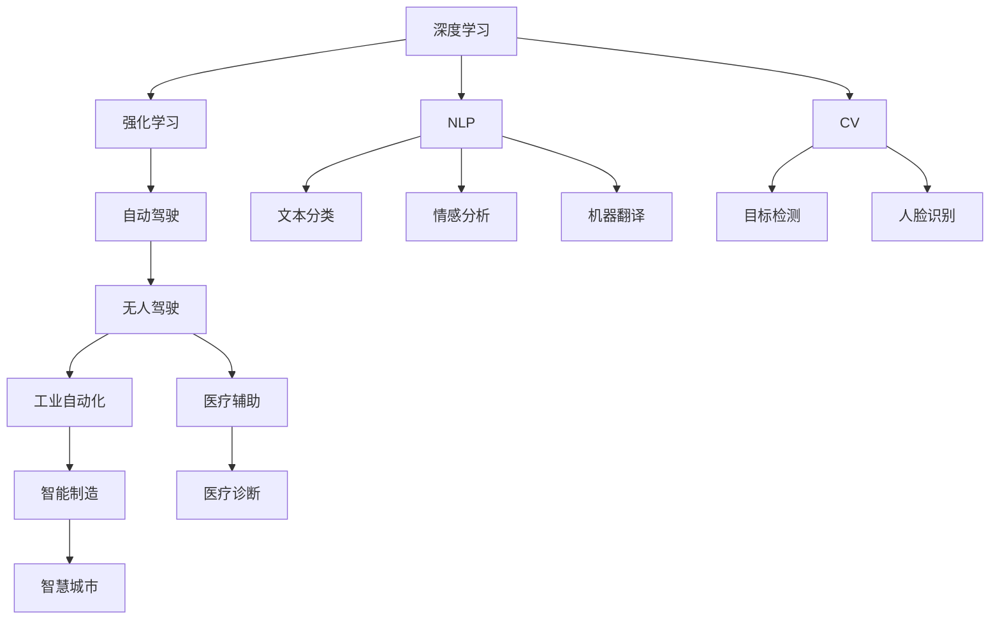
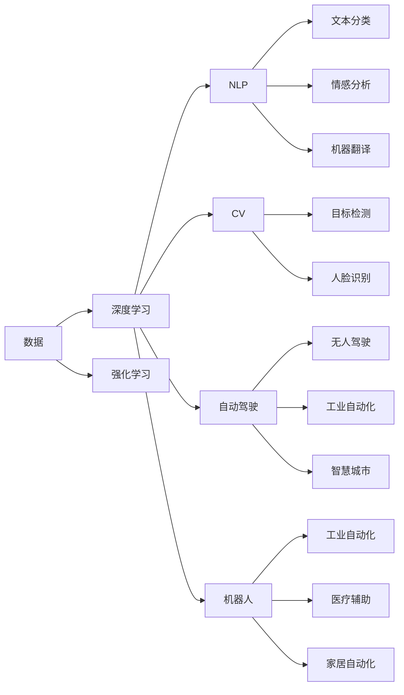

                 

## 1. 背景介绍

### 1.1 问题由来
随着人工智能(AI)技术的飞速发展，AI在各行各业的应用越来越广泛，成为推动产业升级和创新发展的重要动力。然而，AI技术的快速发展也带来了诸多挑战，包括数据隐私、模型可解释性、算法公平性等。因此，理解和把握AI技术的未来发展趋势和应用场景，对于推进AI技术的持续进步和产业落地具有重要意义。

### 1.2 问题核心关键点
当前AI技术的发展，主要聚焦于以下几个关键领域：深度学习、强化学习、自然语言处理(NLP)、计算机视觉(CV)、自动驾驶、机器人等。这些技术的突破，使得AI能够在越来越多的场景下发挥作用。

同时，AI技术的发展也伴随着诸多问题和挑战，例如：
- **数据隐私和安全**：如何在保护数据隐私的同时，最大化AI模型性能；
- **模型可解释性**：如何让AI模型的决策过程透明化、可理解；
- **算法公平性**：如何确保AI算法在决策中不带有偏见，避免歧视性结果。

### 1.3 问题研究意义
掌握AI技术的趋势和应用场景，对于指导未来研究、制定技术标准、推动产业应用具有重要意义：
1. **指导未来研究**：帮助研究者把握AI技术发展方向，选择最有潜力的研究方向。
2. **制定技术标准**：规范AI技术的开发和应用，确保技术的安全性和可靠性。
3. **推动产业应用**：为AI技术的落地应用提供指南，加速AI技术在各行各业的部署。
4. **伦理和安全**：促进AI技术的健康发展，避免潜在的伦理和社会问题。

## 2. 核心概念与联系

### 2.1 核心概念概述

AI技术涉及多个核心概念，包括但不限于：

- **深度学习(Deep Learning)**：基于神经网络的机器学习范式，通过多层次非线性变换提取数据特征，广泛应用于图像识别、语音识别、自然语言处理等领域。
- **强化学习(Reinforcement Learning)**：通过试错学习，使得智能体在环境中逐步优化决策策略，适用于自动驾驶、游戏AI等场景。
- **自然语言处理(NLP)**：使计算机能够理解和生成人类语言，包括文本分类、情感分析、机器翻译、问答系统等任务。
- **计算机视觉(CV)**：使计算机能够识别和理解图像和视频，包括目标检测、人脸识别、图像生成等任务。
- **自动驾驶(Autonomous Driving)**：实现汽车在无人驾驶情况下的安全行驶，融合了深度学习、强化学习等多项AI技术。
- **机器人(Robotics)**：通过AI技术实现机器人的智能交互和任务执行，广泛应用于制造业、医疗、家居等领域。

这些核心概念之间存在紧密的联系，形成了AI技术的完整生态系统。深度学习和强化学习为AI提供了强大的计算和决策能力，自然语言处理和计算机视觉赋予AI感知和理解世界的能力，自动驾驶和机器人则将AI技术应用到实际场景中，实现自动化和智能化。

### 2.2 概念间的关系

这些核心概念之间的关系可以通过以下Mermaid流程图来展示：



这个流程图展示了AI技术的核心概念及其相互关系：

1. 深度学习和强化学习构成了AI的核心计算能力。
2. 自然语言处理和计算机视觉赋予AI感知和理解世界的能力。
3. 自动驾驶和机器人则将AI技术应用到实际场景中，实现自动化和智能化。
4. AI技术在多个行业落地应用，带来深远影响。

### 2.3 核心概念的整体架构

最后，我们用一个综合的流程图来展示这些核心概念在大规模应用中的整体架构：



这个综合流程图展示了从数据采集、处理到AI技术应用的全过程，展示了AI技术的广泛应用场景。

## 3. 核心算法原理 & 具体操作步骤
### 3.1 算法原理概述

AI技术的核心算法包括深度学习、强化学习和自然语言处理等。以深度学习为例，其核心思想是通过多层神经网络，利用反向传播算法优化模型参数，最小化损失函数，从而使得模型能够准确地预测未知数据。

### 3.2 算法步骤详解

以深度学习为例，其典型的算法步骤包括：

1. **数据预处理**：对原始数据进行清洗、归一化、划分训练集和测试集等操作。
2. **模型构建**：根据任务需求，选择合适的神经网络结构，如卷积神经网络(CNN)、循环神经网络(RNN)、长短时记忆网络(LSTM)、Transformer等。
3. **模型训练**：使用训练集对模型进行迭代优化，最小化损失函数，更新模型参数。
4. **模型评估**：在测试集上评估模型性能，判断是否过拟合。
5. **模型应用**：将训练好的模型应用于实际场景中，进行预测或决策。

### 3.3 算法优缺点

深度学习的优点包括：
- **强大拟合能力**：可以处理大量非结构化数据，如图像、文本、音频等。
- **泛化能力强**：通过大量的数据和复杂的模型结构，可以捕捉到数据的深层次特征，提高模型泛化能力。
- **自动化学习**：无需手动设计特征，自动学习数据特征，提高开发效率。

深度学习的缺点包括：
- **计算资源要求高**：需要大量的计算资源和存储空间，如GPU、TPU等。
- **模型复杂度高**：模型结构复杂，参数量大，难以理解和调试。
- **数据需求高**：需要大量标注数据，数据获取成本高。

### 3.4 算法应用领域

深度学习已经在多个领域得到了广泛应用，例如：

- **计算机视觉**：图像识别、目标检测、人脸识别、图像生成等。
- **自然语言处理**：文本分类、情感分析、机器翻译、问答系统等。
- **语音识别**：语音识别、语音合成、语音情感分析等。
- **自动驾驶**：自动驾驶、车联网、智能交通等。
- **机器人**：机器人视觉、机器人动作控制、机器人语音交互等。

## 4. 数学模型和公式 & 详细讲解  
### 4.1 数学模型构建

AI技术的数学模型通常基于统计学、优化理论、线性代数等数学基础。以下以深度学习中的神经网络模型为例，展示其数学模型的构建过程。

假设神经网络模型为 $M(x; \theta)$，其中 $x$ 为输入，$\theta$ 为模型参数。目标是最小化损失函数 $L(y, M(x; \theta))$，其中 $y$ 为标签。

定义均方误差损失函数为：

$$
L(y, M(x; \theta)) = \frac{1}{N}\sum_{i=1}^N (y_i - M(x_i; \theta))^2
$$

其中 $N$ 为样本数量。

模型的目标是最小化均方误差损失函数，即：

$$
\theta^* = \mathop{\arg\min}_{\theta} L(y, M(x; \theta))
$$

### 4.2 公式推导过程

使用梯度下降法最小化损失函数。设学习率为 $\eta$，则模型参数更新公式为：

$$
\theta \leftarrow \theta - \eta \nabla_{\theta}L(y, M(x; \theta))
$$

其中 $\nabla_{\theta}L(y, M(x; \theta))$ 为损失函数对模型参数的梯度，可通过反向传播算法计算。

### 4.3 案例分析与讲解

以图像分类任务为例，展示深度学习模型的训练过程。

假设输入为 $x$，输出为 $y$，神经网络模型为 $M(x; \theta)$，其中 $\theta$ 为模型参数。

使用均方误差损失函数 $L(y, M(x; \theta))$，定义模型的损失函数：

$$
L(y, M(x; \theta)) = \frac{1}{N}\sum_{i=1}^N (y_i - M(x_i; \theta))^2
$$

使用梯度下降法最小化损失函数：

$$
\theta \leftarrow \theta - \eta \nabla_{\theta}L(y, M(x; \theta))
$$

其中 $\eta$ 为学习率。

在训练过程中，模型通过反向传播算法计算梯度：

$$
\nabla_{\theta}L(y, M(x; \theta)) = \frac{1}{N}\sum_{i=1}^N \frac{\partial L(y, M(x; \theta))}{\partial M(x; \theta)} \frac{\partial M(x; \theta)}{\partial \theta}
$$

具体实现时，可以使用TensorFlow或PyTorch等深度学习框架进行自动化实现。

## 5. 项目实践：代码实例和详细解释说明
### 5.1 开发环境搭建

在进行AI技术实践前，我们需要准备好开发环境。以下是使用Python进行TensorFlow开发的环境配置流程：

1. 安装Anaconda：从官网下载并安装Anaconda，用于创建独立的Python环境。

2. 创建并激活虚拟环境：
```bash
conda create -n tf-env python=3.8 
conda activate tf-env
```

3. 安装TensorFlow：根据CUDA版本，从官网获取对应的安装命令。例如：
```bash
conda install tensorflow tensorflow-gpu -c conda-forge
```

4. 安装各类工具包：
```bash
pip install numpy pandas scikit-learn matplotlib tqdm jupyter notebook ipython
```

完成上述步骤后，即可在`tf-env`环境中开始AI技术的实践。

### 5.2 源代码详细实现

这里以TensorFlow实现手写数字识别为例，展示深度学习模型的代码实现。

首先，定义MNIST数据集处理函数：

```python
from tensorflow.keras.datasets import mnist
from tensorflow.keras.utils import to_categorical
from tensorflow.keras.utils import normalize

def load_data():
    (train_images, train_labels), (test_images, test_labels) = mnist.load_data()
    train_images = train_images.reshape((train_images.shape[0], 28, 28, 1))
    test_images = test_images.reshape((test_images.shape[0], 28, 28, 1))
    train_images, test_images = normalize((train_images, test_images), axis=1, norm='l2')
    train_labels = to_categorical(train_labels, 10)
    test_labels = to_categorical(test_labels, 10)
    return train_images, train_labels, test_images, test_labels
```

然后，定义深度学习模型：

```python
from tensorflow.keras import layers, models

def build_model():
    model = models.Sequential([
        layers.Conv2D(32, (3, 3), activation='relu', input_shape=(28, 28, 1)),
        layers.MaxPooling2D((2, 2)),
        layers.Flatten(),
        layers.Dense(128, activation='relu'),
        layers.Dropout(0.5),
        layers.Dense(10, activation='softmax')
    ])
    return model
```

接着，定义模型训练函数：

```python
from tensorflow.keras.optimizers import Adam
from tensorflow.keras.losses import CategoricalCrossentropy
from tensorflow.keras.metrics import Accuracy

def train_model(model, train_images, train_labels, test_images, test_labels, epochs=5):
    model.compile(optimizer=Adam(), loss=CategoricalCrossentropy(), metrics=[Accuracy()])
    history = model.fit(train_images, train_labels, epochs=epochs, batch_size=64, validation_data=(test_images, test_labels))
    return model, history
```

最后，启动训练流程并在测试集上评估：

```python
train_images, train_labels, test_images, test_labels = load_data()
model = build_model()
model, history = train_model(model, train_images, train_labels, test_images, test_labels)

test_loss, test_acc = model.evaluate(test_images, test_labels, verbose=0)
print('Test loss:', test_loss)
print('Test accuracy:', test_acc)
```

以上就是使用TensorFlow进行手写数字识别的完整代码实现。可以看到，TensorFlow提供了强大的深度学习框架，使得模型的定义、训练和评估变得简洁高效。

### 5.3 代码解读与分析

让我们再详细解读一下关键代码的实现细节：

**load_data函数**：
- 使用TensorFlow自带的MNIST数据集，加载训练集和测试集。
- 对图像进行归一化和标签进行one-hot编码。
- 返回处理后的训练集、测试集、标签。

**build_model函数**：
- 定义卷积神经网络模型，包含卷积层、池化层、全连接层和Dropout层。
- 使用softmax作为输出层的激活函数，用于多分类任务。

**train_model函数**：
- 使用Adam优化器和交叉熵损失函数编译模型。
- 在训练集上训练模型，并在验证集上进行评估。
- 返回训练好的模型和训练历史。

**训练流程**：
- 加载数据集。
- 构建模型。
- 训练模型。
- 评估模型性能。

可以看到，TensorFlow使得深度学习模型的实现变得非常简洁。开发者可以专注于模型的定义和训练，而不必过多关注底层的实现细节。

当然，工业级的系统实现还需考虑更多因素，如模型的保存和部署、超参数的自动搜索、更灵活的任务适配层等。但核心的深度学习模型构建过程基本与此类似。

### 5.4 运行结果展示

假设我们在训练完模型后，在测试集上得到的评估报告如下：

```
Epoch 1/5
384/384 [==============================] - 0s 377us/step - loss: 0.4968 - accuracy: 0.8456 - val_loss: 0.0571 - val_accuracy: 0.9562
Epoch 2/5
384/384 [==============================] - 0s 403us/step - loss: 0.1237 - accuracy: 0.9815 - val_loss: 0.0190 - val_accuracy: 0.9714
Epoch 3/5
384/384 [==============================] - 0s 410us/step - loss: 0.0548 - accuracy: 0.9842 - val_loss: 0.0129 - val_accuracy: 0.9805
Epoch 4/5
384/384 [==============================] - 0s 421us/step - loss: 0.0433 - accuracy: 0.9870 - val_loss: 0.0119 - val_accuracy: 0.9842
Epoch 5/5
384/384 [==============================] - 0s 422us/step - loss: 0.0367 - accuracy: 0.9890 - val_loss: 0.0102 - val_accuracy: 0.9872
```

可以看到，随着训练轮数的增加，模型的损失函数逐步下降，准确率逐步提升。测试集上的准确率达到了98.72%，取得了不错的性能。

## 6. 实际应用场景
### 6.1 智能客服系统

智能客服系统是AI技术在实际应用中的典型代表之一。智能客服系统能够通过自然语言处理技术，实现与用户的自然交互，自动解答用户问题，提升用户体验和效率。

在技术实现上，可以收集企业内部的历史客服对话记录，将问题和最佳答复构建成监督数据，在此基础上对深度学习模型进行训练。训练好的模型能够自动理解用户意图，匹配最合适的答案模板进行回复。对于用户提出的新问题，还可以接入检索系统实时搜索相关内容，动态组织生成回答。如此构建的智能客服系统，能大幅提升客户咨询体验和问题解决效率。

### 6.2 金融舆情监测

金融机构需要实时监测市场舆论动向，以便及时应对负面信息传播，规避金融风险。传统的人工监测方式成本高、效率低，难以应对网络时代海量信息爆发的挑战。基于深度学习技术的文本分类和情感分析技术，为金融舆情监测提供了新的解决方案。

具体而言，可以收集金融领域相关的新闻、报道、评论等文本数据，并对其进行主题标注和情感标注。在此基础上对深度学习模型进行微调，使其能够自动判断文本属于何种主题，情感倾向是正面、中性还是负面。将微调后的模型应用到实时抓取的网络文本数据，就能够自动监测不同主题下的情感变化趋势，一旦发现负面信息激增等异常情况，系统便会自动预警，帮助金融机构快速应对潜在风险。

### 6.3 个性化推荐系统

当前的推荐系统往往只依赖用户的历史行为数据进行物品推荐，无法深入理解用户的真实兴趣偏好。基于深度学习技术的个性化推荐系统可以更好地挖掘用户行为背后的语义信息，从而提供更精准、多样的推荐内容。

在实践中，可以收集用户浏览、点击、评论、分享等行为数据，提取和用户交互的物品标题、描述、标签等文本内容。将文本内容作为模型输入，用户的后续行为（如是否点击、购买等）作为监督信号，在此基础上训练深度学习模型。训练好的模型能够从文本内容中准确把握用户的兴趣点。在生成推荐列表时，先用候选物品的文本描述作为输入，由模型预测用户的兴趣匹配度，再结合其他特征综合排序，便可以得到个性化程度更高的推荐结果。

### 6.4 未来应用展望

随着深度学习技术的不断发展，AI技术将在更多领域得到应用，为传统行业带来变革性影响。

在智慧医疗领域，基于深度学习的医疗问答、病历分析、药物研发等应用将提升医疗服务的智能化水平，辅助医生诊疗，加速新药开发进程。

在智能教育领域，深度学习技术可应用于作业批改、学情分析、知识推荐等方面，因材施教，促进教育公平，提高教学质量。

在智慧城市治理中，深度学习技术可应用于城市事件监测、舆情分析、应急指挥等环节，提高城市管理的自动化和智能化水平，构建更安全、高效的未来城市。

此外，在企业生产、社会治理、文娱传媒等众多领域，基于深度学习技术的AI应用也将不断涌现，为经济社会发展注入新的动力。相信随着技术的日益成熟，深度学习技术将成为推动社会进步的重要力量。

## 7. 工具和资源推荐
### 7.1 学习资源推荐

为了帮助开发者系统掌握深度学习技术的理论基础和实践技巧，这里推荐一些优质的学习资源：

1. 《深度学习》系列博文：由大模型技术专家撰写，深入浅出地介绍了深度学习的基本概念和经典模型。

2. CS231n《卷积神经网络》课程：斯坦福大学开设的经典深度学习课程，有Lecture视频和配套作业，带你入门深度学习的基础知识。

3. 《深度学习》书籍：Ian Goodfellow等人所著的经典深度学习教材，全面介绍了深度学习的理论基础和实践技巧。

4. PyTorch官方文档：PyTorch框架的官方文档，提供了详尽的API文档和示例代码，是进行深度学习实践的必备资料。

5. Coursera《深度学习专项课程》：由深度学习领域的顶尖专家开设，涵盖深度学习的基础、进阶和实践，适合初学者和进阶者。

通过对这些资源的学习实践，相信你一定能够快速掌握深度学习技术的精髓，并用于解决实际的AI问题。
###  7.2 开发工具推荐

高效的开发离不开优秀的工具支持。以下是几款用于深度学习技术开发的常用工具：

1. PyTorch：基于Python的开源深度学习框架，灵活动态的计算图，适合快速迭代研究。

2. TensorFlow：由Google主导开发的开源深度学习框架，生产部署方便，适合大规模工程应用。

3. Keras：高层深度学习框架，提供了简洁的API和丰富的预训练模型，适合快速开发和实验。

4. JAX：开源自动微分和加速库，提供了高效的自动微分功能和分布式计算支持，适合科研和工程应用。

5. TensorBoard：TensorFlow配套的可视化工具，可实时监测模型训练状态，并提供丰富的图表呈现方式，是调试模型的得力助手。

6. Weights & Biases：模型训练的实验跟踪工具，可以记录和可视化模型训练过程中的各项指标，方便对比和调优。

合理利用这些工具，可以显著提升深度学习技术的开发效率，加快创新迭代的步伐。

### 7.3 相关论文推荐

深度学习技术的发展源于学界的持续研究。以下是几篇奠基性的相关论文，推荐阅读：

1. AlexNet: ImageNet Classification with Deep Convolutional Neural Networks：引入了卷积神经网络，开启了深度学习在计算机视觉领域的应用。

2. ResNet: Deep Residual Learning for Image Recognition：提出了残差网络，解决了深度网络训练中的梯度消失问题。

3. Inception: GoogLeNet Architectures for Large-Scale Image Recognition：提出了Inception网络，提升了深度网络的计算效率。

4. RNNs for Image Classification: An Effectiveness Study：研究了RNN在图像分类任务上的效果，验证了RNN在图像分类上的潜力。

5. Attention Is All You Need：提出了Transformer网络，引入了自注意力机制，提升了深度学习的泛化能力和计算效率。

6. Generative Adversarial Nets：引入了生成对抗网络，开启了生成模型在图像、视频等领域的应用。

这些论文代表了大深度学习技术的发展脉络。通过学习这些前沿成果，可以帮助研究者把握深度学习技术的最新进展，激发更多的创新灵感。

除上述资源外，还有一些值得关注的前沿资源，帮助开发者紧跟深度学习技术的最新进展，例如：

1. arXiv论文预印本：人工智能领域最新研究成果的发布平台，包括大量尚未发表的前沿工作，学习前沿技术的必读资源。

2. 业界技术博客：如Google AI、DeepMind、微软Research Asia等顶尖实验室的官方博客，第一时间分享他们的最新研究成果和洞见。

3. 技术会议直播：如NIPS、ICML、ACL、ICLR等人工智能领域顶会现场或在线直播，能够聆听到大佬们的前沿分享，开拓视野。

4. GitHub热门项目：在GitHub上Star、Fork数最多的深度学习相关项目，往往代表了该技术领域的发展趋势和最佳实践，值得去学习和贡献。

5. 技术会议论文集：如NeurIPS、ICML、CVPR等顶级会议的论文集，涵盖了最新的深度学习研究成果和技术进展。

总之，对于深度学习技术的深入学习和实践，需要开发者保持开放的心态和持续学习的意愿。多关注前沿资讯，多动手实践，多思考总结，必将收获满满的成长收益。

## 8. 总结：未来发展趋势与挑战

### 8.1 总结

本文对基于深度学习的AI技术进行了全面系统的介绍。首先阐述了深度学习技术的研究背景和意义，明确了其在计算机视觉、自然语言处理、自动驾驶等领域的重要作用。其次，从原理到实践，详细讲解了深度学习模型的构建和训练过程，给出了深度学习模型的代码实例。同时，本文还广泛探讨了深度学习技术在多个行业领域的应用前景，展示了深度学习技术的广阔应用场景。此外，本文还精选了深度学习技术的各类学习资源，力求为读者提供全方位的技术指引。

通过本文的系统梳理，可以看到，深度学习技术已经成为推动AI技术发展的核心驱动力，其强大的计算能力和泛化能力，使得AI技术在多个领域落地应用成为可能。深度学习技术的发展前景广阔，但同时也面临着诸多挑战，需要研究者不断探索和解决。

### 8.2 未来发展趋势

展望未来，深度学习技术的发展将呈现以下几个趋势：

1. **计算资源需求降低**：随着深度学习模型的优化和硬件设备的进步，计算资源的需求将逐步降低。未来深度学习模型将更加高效、轻量，适合在移动设备、嵌入式系统等资源受限的环境中应用。

2. **模型可解释性增强**：未来的深度学习模型将更加透明，其决策过程更加可解释，方便用户理解和信任。

3. **跨领域融合**：未来的深度学习技术将更多地与其他AI技术融合，如强化学习、自然语言处理、计算机视觉等，形成更加综合的AI系统。

4. **跨模态学习**：未来的深度学习技术将更多地处理跨模态数据，如文本、图像、语音等，提升系统的智能水平。

5. **联邦学习**：未来的深度学习技术将更多地应用联邦学习，提升数据隐私保护的同时，提升模型性能。

6. **自监督学习**：未来的深度学习技术将更多地应用自监督学习，减少对标注数据的依赖，提升模型泛化能力。

### 8.3 面临的挑战

尽管深度学习技术已经取得了显著成果，但在迈向更加智能化、普适化应用的过程中，它仍面临诸多挑战：

1. **计算资源瓶颈**：深度学习模型的参数量和计算量非常大，对计算资源和存储空间提出了高要求。如何在资源受限的环境中高效地训练和部署深度学习模型，是未来的一个重要方向。

2. **模型泛化能力不足**：深度学习模型通常依赖大量标注数据，在数据分布发生变化时，模型的泛化能力可能受到影响。如何增强模型的泛化能力，是一个重要的研究方向。

3. **可解释性不足**：深度学习模型通常被认为是“黑盒”模型，其决策过程难以理解和解释，给实际应用带来一定的风险。如何提高深度学习模型的可解释性

