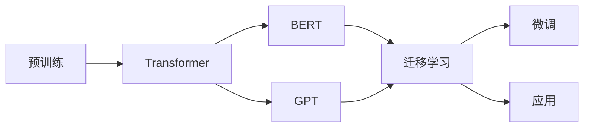

> 大语言模型，预训练，迁移学习，Transformer，BERT，自然语言处理，人工智能，语言理解，生成模型

# 大语言模型的发展与未来

大语言模型（Large Language Model，LLM）是近年来人工智能领域的重要突破，它们在自然语言处理（Natural Language Processing，NLP）任务中取得了显著的成果。本文将探讨大语言模型的发展历程、核心原理、应用场景，以及未来可能面临的挑战和发展趋势。

## 1. 背景介绍

### 1.1 问题的由来

随着互联网的快速发展，人类产生的文本数据呈爆炸式增长。如何高效地处理这些海量文本数据，从中学到知识，并用于解决实际问题，成为了一个重要课题。传统的NLP方法大多依赖于手工特征工程，难以处理复杂语言现象，而基于深度学习的方法虽然取得了进展，但在处理大规模数据时仍存在瓶颈。

### 1.2 研究现状

为了解决上述问题，研究人员提出了预训练大语言模型。这些模型通过在大量无标注文本数据上进行预训练，学习到丰富的语言知识，从而在下游任务中实现优异的性能。目前，大语言模型已成为NLP领域的研究热点，代表性的模型包括BERT、GPT、T5等。

### 1.3 研究意义

大语言模型的研究意义在于：
- 提高NLP任务的性能，尤其是在文本理解和生成方面。
- 降低NLP任务的门槛，使得更多开发者能够应用NLP技术。
- 推动人工智能技术在各领域的应用，如语音识别、机器翻译、问答系统等。

## 2. 核心概念与联系

### 2.1 核心概念

大语言模型涉及的核心概念包括：

- **预训练（Pre-training）**：在大量无标注文本数据上训练模型，使其具备通用语言理解能力。
- **迁移学习（Transfer Learning）**：将预训练模型应用于新的任务，通过微调（Fine-tuning）来适应特定任务的需求。
- **Transformer**：一种基于自注意力机制的深度神经网络架构，广泛应用于大语言模型。
- **BERT（Bidirectional Encoder Representations from Transformers）**：一种基于Transformer的自监督预训练模型，在NLP任务中取得了显著成果。
- **GPT（Generative Pre-trained Transformer）**：一种基于Transformer的生成模型，在文本生成任务中表现出色。

### 2.2 核心概念原理和架构的 Mermaid 流程图



## 3. 核心算法原理 & 具体操作步骤

### 3.1 算法原理概述

大语言模型的原理可以概括为以下步骤：

1. **预训练**：在大量无标注文本数据上训练模型，使其学习到通用语言表示。
2. **迁移学习**：将预训练模型应用于新的任务，通过微调来适应特定任务的需求。
3. **微调**：根据新的任务数据，调整模型参数，使模型在特定任务上取得更好的性能。
4. **应用**：将微调后的模型应用于实际问题，如文本分类、机器翻译、问答系统等。

### 3.2 算法步骤详解

1. **数据收集**：收集大量无标注文本数据，用于预训练。
2. **模型选择**：选择合适的预训练模型，如BERT、GPT等。
3. **预训练**：在无标注数据上训练模型，使其学习到通用语言表示。
4. **数据预处理**：将新的任务数据转换为模型所需的格式。
5. **微调**：在新的任务数据上微调模型参数，使模型在特定任务上取得更好的性能。
6. **评估**：在测试集上评估模型性能，并进行调整和优化。

### 3.3 算法优缺点

大语言模型的优点：

- **性能优异**：在NLP任务中取得了显著的成果。
- **通用性强**：能够应用于各种NLP任务。
- **易于使用**：只需少量标注数据即可进行微调。

大语言模型的缺点：

- **计算量大**：预训练和微调过程需要大量的计算资源。
- **数据依赖性强**：模型性能依赖于高质量的数据。
- **可解释性差**：模型的决策过程难以解释。

### 3.4 算法应用领域

大语言模型在以下领域取得了显著的应用成果：

- **文本分类**：如情感分析、主题分类等。
- **机器翻译**：如英译中、中译英等。
- **问答系统**：如知识图谱问答、对话式问答等。
- **文本生成**：如文本摘要、创意写作等。

## 4. 数学模型和公式 & 详细讲解 & 举例说明

### 4.1 数学模型构建

大语言模型通常基于Transformer架构，其核心数学模型包括：

- **自注意力机制（Self-Attention）**：用于捕捉序列中不同位置的依赖关系。
- **前馈神经网络（Feedforward Neural Network）**：用于进一步处理自注意力机制输出的特征。

### 4.2 公式推导过程

自注意力机制的公式如下：

$$
\text{Attention}(Q, K, V) = \frac{e^{QK^T}}{\sqrt{d_k}}V
$$

其中，$Q$、$K$、$V$ 分别为查询、键和值向量，$e$ 为自然对数底数，$d_k$ 为键向量的维度。

### 4.3 案例分析与讲解

以BERT模型为例，其预训练任务包括：

1. **掩码语言模型（Masked Language Model，MLM）**：随机掩盖输入文本中的部分token，要求模型预测这些被掩盖的token。
2. **下一个句子预测（Next Sentence Prediction，NSP）**：给定两个句子，模型预测这两个句子是否属于同一篇文档。

## 5. 项目实践：代码实例和详细解释说明

### 5.1 开发环境搭建

1. 安装Python和pip。
2. 安装PyTorch和Transformers库。

### 5.2 源代码详细实现

以下是一个使用Transformers库实现BERT文本分类的示例代码：

```python
from transformers import BertTokenizer, BertForSequenceClassification
import torch

# 加载预训练模型和分词器
model = BertForSequenceClassification.from_pretrained('bert-base-uncased')
tokenizer = BertTokenizer.from_pretrained('bert-base-uncased')

# 编码文本
texts = ["This is a great movie!", "I hate this movie."]
encoded_inputs = tokenizer(texts, return_tensors='pt', padding=True, truncation=True)

# 训练模型
outputs = model(**encoded_inputs)
loss = outputs.loss
logits = outputs.logits

# 预测
predictions = torch.argmax(logits, dim=1)

print(predictions)
```

### 5.3 代码解读与分析

1. 加载预训练模型和分词器。
2. 对文本进行编码，并添加padding和truncation。
3. 使用模型进行训练，并计算损失。
4. 预测文本分类结果。

## 6. 实际应用场景

### 6.1 情感分析

情感分析是文本分类的一种，用于判断文本的情感倾向。例如，对用户评论进行情感分析，可以帮助企业了解用户对产品的满意度。

### 6.2 机器翻译

机器翻译是将一种语言的文本翻译成另一种语言的文本。例如，将中文翻译成英文，方便不同语言的用户交流。

### 6.3 问答系统

问答系统是用于回答用户问题的系统。例如，将知识图谱与问答系统结合，可以构建一个智能客服系统。

## 7. 工具和资源推荐

### 7.1 学习资源推荐

- 《Deep Learning for Natural Language Processing》
- 《Natural Language Processing with Python》
- 《Transformers: State-of-the-Art Models for NLP》

### 7.2 开发工具推荐

- PyTorch
- TensorFlow
- Hugging Face Transformers

### 7.3 相关论文推荐

- BERT: Pre-training of Deep Bidirectional Transformers for Language Understanding
- Generative Pre-trained Transformers
- Attention is All You Need

## 8. 总结：未来发展趋势与挑战

### 8.1 研究成果总结

大语言模型在NLP领域取得了显著的成果，推动了NLP技术的快速发展。

### 8.2 未来发展趋势

未来，大语言模型将朝着以下方向发展：

- 模型规模将进一步扩大，参数量将超过千亿级别。
- 多模态信息将得到更好的融合。
- 模型的可解释性将得到提高。
- 模型的鲁棒性将得到增强。

### 8.3 面临的挑战

大语言模型在发展过程中也面临着以下挑战：

- 计算资源需求巨大。
- 数据质量对模型性能影响显著。
- 模型的可解释性差。
- 模型的鲁棒性不足。

### 8.4 研究展望

未来，大语言模型的研究将朝着以下方向发展：

- 开发更加高效、轻量级的模型。
- 探索更有效的预训练方法。
- 提高模型的可解释性和鲁棒性。
- 将大语言模型应用于更多领域。

## 9. 附录：常见问题与解答

**Q1：大语言模型是什么？**

A1：大语言模型是一种通过在大量文本数据上进行预训练，学习到通用语言表示的模型。它们在NLP任务中取得了显著的成果。

**Q2：如何评估大语言模型的性能？**

A2：评估大语言模型的性能通常使用准确率、召回率、F1分数等指标。

**Q3：大语言模型在哪些领域有应用？**

A3：大语言模型在NLP领域有广泛的应用，如文本分类、机器翻译、问答系统、文本生成等。

**Q4：大语言模型的优缺点是什么？**

A4：大语言模型的优点是性能优异、通用性强、易于使用。缺点是计算量大、数据依赖性强、可解释性差、鲁棒性不足。

作者：禅与计算机程序设计艺术 / Zen and the Art of Computer Programming