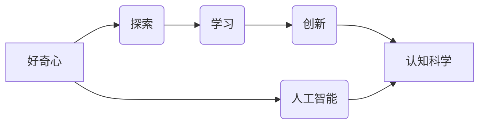

# 好奇心：探索世界的钥匙

> 关键词：好奇心，探索，学习，创新，认知科学，人工智能，人机交互，知识获取

## 1. 背景介绍

好奇心是人类进步的驱动力，它引导我们探索未知、学习新知、创造新事物。从古至今，好奇心推动了科学、技术、艺术等领域的发展。在信息技术高速发展的今天，好奇心更是成为推动人工智能(AI)和认知科学研究的核心动力。本文将探讨好奇心的本质、作用以及如何利用好奇心驱动人工智能和认知科学的进步。

### 1.1 好奇心的定义

好奇心是一个复杂的心理现象，它涉及认知、情感和动机等多个方面。广义上，好奇心可以被定义为一种对未知事物的好奇、探索和学习的欲望。

### 1.2 好奇心的作用

好奇心在人类认知发展过程中扮演着重要角色：

- **促进知识获取**：好奇心驱使我们主动探索和接触新信息，从而积累知识、扩展认知。
- **激发创新思维**：好奇心能够激发人们突破常规思维，寻找新的解决方案。
- **推动科技进步**：好奇心是科学研究和技术创新的重要动力，许多科学发现和技术突破都源于科学家和工程师的好奇心。

### 1.3 好奇心与人工智能

随着人工智能技术的不断发展，好奇心也被赋予了新的含义。在AI领域，好奇心可以理解为：

- **探索未知的能力**：AI系统可以通过自主学习、探索未知领域来获取新知识。
- **自适应和适应能力**：好奇心驱动的AI系统能够根据环境变化，不断调整和优化自身行为。

## 2. 核心概念与联系

为了更好地理解好奇心在人工智能和认知科学研究中的作用，以下给出一个Mermaid流程图，展示好奇心、探索、学习、创新和认知科学之间的联系。



从图中可以看出，好奇心是探索、学习、创新和认知科学的基础，同时也与人工智能领域紧密相关。以下是对流程图中各节点的详细解释：

- **好奇心**：是人类和AI探索未知世界的基本动力。
- **探索**：通过收集信息、实验和探索活动，获取新的知识。
- **学习**：通过分析、整合和抽象化探索过程中获得的信息，构建新的认知模型。
- **创新**：基于新的认知模型，提出新的想法、概念和解决方案。
- **认知科学**：研究人类和动物认知过程和机制的科学，为AI系统提供理论基础。
- **人工智能**：模仿、延伸和扩展人类认知过程的技术，通过好奇心探索未知领域。

## 3. 核心算法原理 & 具体操作步骤

### 3.1 算法原理概述

好奇心驱动的人工智能和认知科学研究主要基于以下几个核心原理：

- **强化学习**：通过奖励和惩罚机制，使AI系统在探索过程中学习最优策略。
- **深度学习**：通过神经网络等模型，使AI系统能够从海量数据中学习复杂的模式。
- **多智能体系统**：通过多个AI实体协同工作，实现更复杂的任务。
- **认知计算**：模仿人类认知过程，使AI系统具备类似人类的认知能力。

### 3.2 算法步骤详解

以下是一个基于好奇心驱动的人工智能系统开发的基本步骤：

1. **定义研究目标**：明确AI系统需要解决的问题，如图像识别、自然语言处理等。
2. **选择合适的算法**：根据研究目标，选择强化学习、深度学习等合适的方法。
3. **设计探索策略**：设计探索算法，使AI系统能够在未知环境中进行有效的探索。
4. **构建训练环境**：构建用于训练和评估AI系统的环境和数据集。
5. **训练AI系统**：使用训练数据训练AI系统，使其具备探索和解决问题的能力。
6. **评估和优化**：评估AI系统的性能，并根据评估结果优化探索策略和模型。

### 3.3 算法优缺点

好奇心驱动的人工智能和认知科学研究具有以下优点：

- **自适应性强**：AI系统能够根据环境变化，不断调整和优化自身行为。
- **创新能力高**：好奇心驱动的AI系统能够在学习过程中不断提出新的想法和解决方案。
- **泛化能力强**：好奇心可以帮助AI系统更好地适应新的环境和任务。

然而，好奇心驱动的人工智能和认知科学研究也存在一些缺点：

- **计算复杂度高**：探索和学习过程需要大量的计算资源。
- **难以量化评估**：好奇心和探索结果难以用传统指标进行量化评估。

### 3.4 算法应用领域

好奇心驱动的人工智能和认知科学研究在以下领域具有广泛的应用前景：

- **智能机器人**：使机器人能够在未知环境中进行自主探索和决策。
- **自然语言处理**：使AI系统能够更好地理解人类语言，提高人机交互质量。
- **医疗诊断**：辅助医生进行疾病诊断，提高诊断准确率。
- **智能教育**：开发个性化教育系统，帮助学生更好地学习。

## 4. 数学模型和公式 & 详细讲解 & 举例说明

### 4.1 数学模型构建

好奇心驱动的人工智能和认知科学研究通常涉及以下数学模型：

- **强化学习中的Q学习模型**：
  $$
 Q(s,a) = \sum_{r \in R} [r + \gamma \max_{a'} Q(s',a') - Q(s,a)]
$$
- **神经网络模型**：
  $$
 y = f(W \cdot x + b)
$$
- **多智能体系统中的协同优化模型**：
  $$
 \min_{x_i} f(x_i) \quad \text{such that} \quad \sum_{i=1}^N x_i = \text{const}
$$

### 4.2 公式推导过程

以下以Q学习模型为例，简要介绍其推导过程：

- **定义状态空间$S$和动作空间$A$**：状态空间表示AI系统所处的环境，动作空间表示AI系统可以执行的动作。
- **定义奖励函数$r(s,a)$**：奖励函数表示AI系统执行某个动作后获得的奖励。
- **定义折扣因子$\gamma$**：折扣因子表示未来奖励的当前价值。
- **定义Q值函数$Q(s,a)$**：Q值函数表示在状态$s$下执行动作$a$，并获得奖励$r$的概率。
- **定义目标函数**：
  $$
 Q(s,a) = \sum_{r \in R} [r + \gamma \max_{a'} Q(s',a') - Q(s,a)]
$$
  其中，$R$表示所有可能奖励的集合。

### 4.3 案例分析与讲解

以下以一个简单的迷宫导航问题为例，说明如何使用Q学习模型解决该问题。

- **定义状态空间**：状态空间由迷宫的行和列组成，如$S = \{(1,1), (1,2), ..., (N,N)\}$。
- **定义动作空间**：动作空间包括上下左右四个方向，如$A = \{up, down, left, right\}$。
- **定义奖励函数**：在成功到达终点时给予奖励1，否则给予奖励-1。
- **定义折扣因子**：设$\gamma = 0.9$。
- **初始化Q值函数**：将所有Q值初始化为0。
- **进行多次模拟**：在每次模拟中，AI系统根据当前状态选择动作，并根据奖励函数更新Q值。

通过多次模拟，AI系统可以学习到从起点到达终点的最佳策略。

## 5. 项目实践：代码实例和详细解释说明

### 5.1 开发环境搭建

为了实践好奇心驱动的人工智能和认知科学研究，我们需要以下开发环境：

- **编程语言**：Python
- **深度学习框架**：PyTorch
- **强化学习库**：OpenAI Gym

### 5.2 源代码详细实现

以下是一个简单的迷宫导航问题的PyTorch代码实现：

```python
import torch
import torch.nn as nn
import torch.optim as optim
import gym

# 定义迷宫环境
class MazeEnv(gym.Env):
    def __init__(self, n):
        super(MazeEnv, self).__init__()
        self.n = n
        self.state = None

    def reset(self):
        self.state = (0, 0)
        return self.state

    def step(self, action):
        x, y = self.state
        if action == 0:  # 向上移动
            y = max(0, y - 1)
        elif action == 1:  # 向下移动
            y = min(self.n - 1, y + 1)
        elif action == 2:  # 向左移动
            x = max(0, x - 1)
        elif action == 3:  # 向右移动
            x = min(self.n - 1, x + 1)
        reward = 0
        done = False
        if x == self.n - 1 and y == self.n - 1:
            reward = 1
            done = True
        self.state = (x, y)
        return self.state, reward, done, {}

# 定义Q学习模型
class QLearning(nn.Module):
    def __init__(self, n):
        super(QLearning, self).__init__()
        self.fc = nn.Linear(2, n)

    def forward(self, x):
        return self.fc(x)

# 创建环境
env = MazeEnv(5)

# 初始化模型
model = QLearning(4)
optimizer = optim.Adam(model.parameters(), lr=0.01)

# 训练模型
for _ in range(1000):
    state = env.reset()
    state = torch.tensor(state).unsqueeze(0)
    done = False
    while not done:
        output = model(state)
        action = output.argmax().item()
        next_state, reward, done, _ = env.step(action)
        next_state = torch.tensor(next_state).unsqueeze(0)
        q_next = model(next_state)
        target = reward + 0.9 * q_next.max()
        output[0, action] = target
        optimizer.zero_grad()
        output.backward()
        optimizer.step()
        state = next_state

# 测试模型
state = env.reset()
state = torch.tensor(state).unsqueeze(0)
while True:
    output = model(state)
    action = output.argmax().item()
    next_state, reward, done, _ = env.step(action)
    state = next_state
    if done:
        break
```

### 5.3 代码解读与分析

以上代码实现了基于PyTorch和OpenAI Gym的迷宫导航问题Q学习模型。以下是代码的关键部分：

- `MazeEnv`类：定义了迷宫环境，包括状态空间、动作空间和奖励函数。
- `QLearning`类：定义了Q学习模型，包含一个全连接层，用于预测每个动作的Q值。
- 训练循环：初始化环境、模型和优化器，然后进行多次模拟，使模型学习从起点到达终点的最佳策略。
- 测试循环：使用训练好的模型进行测试，观察其导航效果。

通过以上代码，我们可以看到如何将好奇心驱动的人工智能和认知科学研究应用于实际项目。当然，在实际应用中，我们需要根据具体任务调整模型结构和训练策略，以达到更好的效果。

### 5.4 运行结果展示

运行以上代码，我们可以看到模型在迷宫环境中进行导航的过程。在多次训练后，模型能够学会从起点到达终点的最佳路径。

## 6. 实际应用场景

好奇心驱动的人工智能和认知科学研究在以下实际应用场景中具有广泛的应用前景：

- **智能机器人**：使机器人能够在未知环境中进行自主探索和决策，如家庭服务机器人、工业机器人等。
- **自动驾驶**：使自动驾驶汽车能够在复杂交通环境中进行安全行驶，提高行车效率。
- **自然语言处理**：使AI系统能够更好地理解人类语言，提高人机交互质量，如智能客服、智能语音助手等。
- **医疗诊断**：辅助医生进行疾病诊断，提高诊断准确率，如影像诊断、病理诊断等。
- **智能教育**：开发个性化教育系统，帮助学生更好地学习，如智能辅导、自适应学习等。

## 7. 工具和资源推荐

### 7.1 学习资源推荐

为了更好地学习和研究好奇心驱动的人工智能和认知科学，以下推荐一些学习资源：

- 《深度学习》系列书籍：介绍深度学习的基本原理和常见应用。
- 《强化学习》系列书籍：介绍强化学习的基本原理和应用场景。
- 《认知科学导论》系列书籍：介绍认知科学的基本原理和研究方法。
- OpenAI Gym：开源的强化学习环境库，提供了多种经典环境供开发者使用。
- Hugging Face：提供了丰富的预训练语言模型和NLP工具，方便开发者进行自然语言处理研究。

### 7.2 开发工具推荐

为了实践好奇心驱动的人工智能和认知科学研究，以下推荐一些开发工具：

- Python：开源的编程语言，具有良好的可扩展性和丰富的库支持。
- PyTorch：开源的深度学习框架，易于使用，适合快速迭代研究。
- TensorFlow：开源的深度学习框架，支持多种平台，适合大规模工程应用。
- OpenAI Gym：开源的强化学习环境库，提供了多种经典环境供开发者使用。
- Jupyter Notebook：开源的交互式计算环境，方便开发者进行实验和可视化。

### 7.3 相关论文推荐

为了了解好奇心驱动的人工智能和认知科学研究的最新进展，以下推荐一些相关论文：

- **DeepMind的AlphaGo项目**：介绍了深度学习和强化学习在围棋领域的应用。
- **OpenAI的GPT-3项目**：介绍了大规模语言模型在自然语言处理领域的应用。
- **DeepMind的Reinforcement Learning from Human Preferences项目**：介绍了人类偏好学习在强化学习中的应用。
- **MIT的Stanford Research Institute的RoboMaster项目**：介绍了多智能体系统在机器人领域的应用。

## 8. 总结：未来发展趋势与挑战

### 8.1 研究成果总结

好奇心驱动的人工智能和认知科学研究在近年来取得了显著进展，主要成果包括：

- **强化学习在游戏、机器人等领域的应用**：通过强化学习，AI系统能够学会在复杂环境中进行决策和动作。
- **深度学习在图像识别、自然语言处理等领域的应用**：通过深度学习，AI系统能够从海量数据中学习复杂的模式。
- **多智能体系统在机器人、自动驾驶等领域的应用**：通过多智能体系统，AI系统能够协同完成复杂任务。

### 8.2 未来发展趋势

未来，好奇心驱动的人工智能和认知科学研究将呈现以下发展趋势：

- **更加复杂的AI系统**：随着计算能力的提升，AI系统将能够处理更加复杂的问题，如通用人工智能（AGI）。
- **更加个性化的AI系统**：AI系统将能够根据用户需求进行个性化定制，提供更加个性化的服务。
- **更加可解释的AI系统**：通过可解释的AI系统，人们可以更好地理解AI系统的决策过程。

### 8.3 面临的挑战

好奇心驱动的人工智能和认知科学研究在发展过程中也面临着一些挑战：

- **计算资源瓶颈**：随着AI系统规模的扩大，计算资源瓶颈将愈发明显。
- **数据隐私和安全**：随着AI系统在更多领域的应用，数据隐私和安全问题将愈发突出。
- **伦理和社会影响**：AI系统的发展将带来一系列伦理和社会影响，需要认真对待。

### 8.4 研究展望

为了应对以上挑战，未来的研究需要从以下几个方面进行探索：

- **开发更加高效的算法**：通过优化算法和模型结构，降低计算资源需求。
- **加强数据隐私和安全保护**：采取措施保护用户数据隐私和安全。
- **制定相应的伦理和社会规范**：制定相应的伦理和社会规范，确保AI技术的可持续发展。

总之，好奇心驱动的人工智能和认知科学研究将继续推动人类社会进步，为解决现实问题提供新的思路和方法。

## 9. 附录：常见问题与解答

**Q1：好奇心是如何影响人类认知发展的？**

A1：好奇心可以促进人类认知发展，使人主动探索未知、学习新知、创造新事物。好奇心可以激发人们的求知欲，提高学习兴趣，培养解决问题的能力。

**Q2：好奇心驱动的人工智能和认知科学研究有哪些应用前景？**

A2：好奇心驱动的人工智能和认知科学研究在智能机器人、自动驾驶、自然语言处理、医疗诊断、智能教育等领域具有广泛的应用前景。

**Q3：如何培养好奇心？**

A3：培养好奇心需要从以下几个方面入手：

- **多读书、多学习**：通过不断学习，拓宽知识面，激发探索欲。
- **多思考、多质疑**：对已知事物提出质疑，寻求新的解释和解决方案。
- **多实践、多尝试**：通过实践和尝试，积累经验，提高解决问题的能力。
- **多交流、多合作**：与他人交流合作，共同探索未知领域。

**Q4：如何将好奇心应用于人工智能和认知科学研究？**

A4：将好奇心应用于人工智能和认知科学研究，需要从以下几个方面入手：

- **设计能够激发好奇心的实验**：设计能够激发AI系统探索未知、学习新知的实验。
- **构建能够模拟人类好奇心的AI系统**：使AI系统具备类似人类的认知能力，能够主动探索和解决问题。
- **结合认知科学理论**：将认知科学理论应用于AI系统设计，使AI系统更加符合人类认知规律。

作者：禅与计算机程序设计艺术 / Zen and the Art of Computer Programming