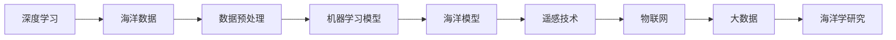

                 

# AI在海洋学中的应用:深化对海洋的理解

## 1. 背景介绍

### 1.1 问题由来
随着人工智能技术的迅猛发展，AI在海洋学中的应用正变得越来越广泛。从数据的自动采集和处理到智能分析与决策，AI正在逐步改变海洋学研究的范式。这些技术的集成使得科学家们可以以前所未有的速度和精度获取、分析和解释海洋数据，从而深化对海洋的全面理解。

### 1.2 问题核心关键点
海洋学研究的核心问题是探索海洋的未知领域、理解海洋系统的复杂行为以及预测海洋环境的变化。传统的海洋研究依赖于人力和有限的物理模型，效率低下且结果受限。AI的引入，尤其是深度学习和机器学习算法，为海洋学的研究注入了新的活力。

### 1.3 问题研究意义
研究AI在海洋学中的应用，对于提升海洋观测的效率和精度、推动海洋科学的前沿发展、改善海洋生态系统的管理、促进海洋资源利用与保护具有重要意义。通过机器学习和大数据技术，我们可以从海量的数据中提取有价值的知识，提高海洋研究的质量，为海洋资源的管理和保护提供科学依据。

## 2. 核心概念与联系

### 2.1 核心概念概述

为了更好地理解AI在海洋学中的应用，本节将介绍几个关键概念：

- **海洋学（Oceanography）**：涉及海洋的物理、化学、生物、地质等方面的综合性科学，研究海洋的各种物理化学和生物过程。
- **深度学习（Deep Learning）**：一种基于人工神经网络的机器学习技术，能够处理高维、非线性的数据，在图像、语音、文本等领域取得了显著成果。
- **机器学习（Machine Learning）**：一种使计算机从数据中自动学习并优化性能的技术，广泛应用于数据挖掘、预测分析和自动控制等领域。
- **大数据（Big Data）**：指超大规模的数据集，通常用于分析复杂模式和发现深层次的知识，如在海洋学中的海洋环境监测和模式识别。
- **遥感技术（Remote Sensing）**：利用卫星、飞机等平台上的传感器获取地球表面及海洋的遥感信息，辅助海洋研究和决策。
- **物联网（Internet of Things, IoT）**：将各种物理设备通过网络互联，实现智能化的数据收集和传输，尤其在海洋监测和数据采集中应用广泛。

这些核心概念构成了AI在海洋学应用的理论基础，并相互关联，共同推动了海洋研究的深入。

### 2.2 概念间的关系

通过以下Mermaid流程图，我们可以更清晰地看到这些核心概念之间的关系：



这个流程图展示了AI在海洋学应用中的核心概念及相互关系：深度学习技术通过处理海洋数据，在机器学习模型的帮助下，结合遥感技术和物联网技术，处理并分析大数据，最终推动海洋学研究的深入。

## 3. 核心算法原理 & 具体操作步骤

### 3.1 算法原理概述

AI在海洋学中的应用主要基于深度学习和大数据技术，具体包括以下几个关键算法：

- **卷积神经网络（Convolutional Neural Networks, CNN）**：常用于图像识别和分类，可以处理海洋图像数据，如卫星遥感影像和海洋生物图像。
- **循环神经网络（Recurrent Neural Networks, RNN）**：适用于处理序列数据，如海洋时间序列数据和浮标观测数据。
- **自编码器（Autoencoder）**：用于降维和数据压缩，可用于海洋数据的去噪和特征提取。
- **生成对抗网络（Generative Adversarial Networks, GAN）**：可以生成合成数据，用于训练和验证深度学习模型。

这些算法共同构成了AI在海洋学研究中的主要技术工具。

### 3.2 算法步骤详解

1. **数据采集与预处理**：
   - 使用传感器和遥感技术，从海洋环境、生物和地质等多个方面采集数据。
   - 对数据进行清洗和标准化，去除噪声和异常值。
   - 对时间序列数据进行差分和归一化处理，提高模型训练的效率和精度。

2. **模型训练与验证**：
   - 选择适合的深度学习模型，如CNN、RNN等。
   - 使用采集的数据进行模型训练，调整模型参数。
   - 在验证集上评估模型性能，选择最优模型。

3. **结果分析与解释**：
   - 利用模型对新的海洋数据进行预测和分类。
   - 通过可视化工具和统计分析方法，解释模型的预测结果。
   - 结合领域专家的知识，解释结果的科学性和合理性。

4. **结果应用与改进**：
   - 将模型应用到实际的海洋监测和管理中，如预测海洋温度变化、分析海洋生态系统等。
   - 根据实际应用效果，调整模型参数和算法策略，提升模型性能。

### 3.3 算法优缺点

AI在海洋学中的主要优点包括：

- **自动化与高效性**：AI可以自动处理大量数据，显著提高研究效率。
- **高精度与准确性**：深度学习算法能够处理复杂数据，提高分析的精度。
- **实时性与动态性**：物联网技术可以实现数据的实时传输和处理，适应动态环境变化。

缺点则主要包括：

- **数据质量依赖**：AI的效果依赖于输入数据的完整性和准确性。
- **模型复杂性**：深度学习模型的复杂度较高，需要大量的计算资源和数据。
- **解释性与透明性**：AI模型通常是"黑盒"，难以解释其决策过程。

### 3.4 算法应用领域

AI在海洋学中的应用覆盖了以下几个主要领域：

- **海洋环境监测**：通过遥感技术和物联网采集海洋环境数据，如水温、盐度、洋流等。
- **海洋生物识别与分类**：利用图像识别技术，识别和分类海洋生物，如浮游生物、鱼类等。
- **海洋生态系统分析**：使用机器学习算法，分析海洋生态系统的结构和功能。
- **海洋灾害预测**：结合时间序列数据和地理空间数据，预测海洋灾害，如海啸、海冰等。
- **海洋资源管理**：利用AI技术，优化海洋资源的开发和利用，如渔业管理和海洋油气勘探。

## 4. 数学模型和公式 & 详细讲解 & 举例说明

### 4.1 数学模型构建

本节将介绍一些核心的数学模型，用于描述AI在海洋学中的应用：

- **时间序列模型**：用于预测海洋物理量的变化趋势，如气温、盐度等。常见的模型包括ARIMA、LSTM等。
- **空间分布模型**：用于描述海洋生物和环境的地理分布，如Kriging插值等。
- **分类模型**：用于识别和分类海洋数据，如CNN和SVM等。

以LSTM模型为例，其数学公式如下：

$$
\begin{aligned}
&\text{输入序列} X_t \rightarrow \text{隐藏状态} h_t \\
&h_t = \text{tanh}(W \cdot (h_{t-1} \oplus X_t) + b) \\
&\text{输出} y_t = \sigma(W \cdot h_t + b) \\
\end{aligned}
$$

其中，$W$和$b$为模型参数，$\oplus$为向量连接操作，$\sigma$为激活函数，$tanh$为双曲正切函数。

### 4.2 公式推导过程

以LSTM模型为例，我们简要推导其计算过程：

1. **输入门计算**：
   $$
   i_t = \sigma(W_i \cdot (h_{t-1} \oplus X_t) + b_i)
   $$
2. **遗忘门计算**：
   $$
   f_t = \sigma(W_f \cdot (h_{t-1} \oplus X_t) + b_f)
   $$
3. **输出门计算**：
   $$
   o_t = \sigma(W_o \cdot (h_{t-1} \oplus X_t) + b_o)
   $$
4. **候选隐藏状态计算**：
   $$
   g_t = \text{tanh}(W \cdot (h_{t-1} \oplus X_t) + b)
   $$
5. **更新隐藏状态计算**：
   $$
   h_t = i_t \odot g_t + f_t \odot h_{t-1}
   $$
6. **输出计算**：
   $$
   y_t = o_t \odot \text{tanh}(h_t)
   $$

这些公式展示了LSTM模型的计算过程，通过门控机制和多层结构，有效处理时间序列数据，适应海洋观测数据的变化。

### 4.3 案例分析与讲解

以海洋温度预测为例，我们可以用LSTM模型来预测未来的海洋温度变化。

首先，我们需要收集历史海洋温度数据，如卫星遥感数据和浮标观测数据。然后，将这些数据进行清洗和预处理，去除异常值和噪声，得到标准化的时间序列数据。

接着，我们使用LSTM模型对数据进行训练和验证。在模型训练过程中，需要调整模型的参数和超参数，如学习率、批量大小等。在验证集上评估模型性能，选择最优模型。

最后，利用训练好的LSTM模型对未来的海洋温度进行预测。通过对比实际观测数据，评估模型的预测准确性。例如，我们可以通过对比模型的预测值和实际温度数据，计算均方误差（MSE）、平均绝对误差（MAE）等指标，评估模型的性能。

## 5. 项目实践：代码实例和详细解释说明

### 5.1 开发环境搭建

在进行AI海洋学研究之前，我们需要准备好开发环境。以下是使用Python进行Keras开发的环境配置流程：

1. 安装Anaconda：从官网下载并安装Anaconda，用于创建独立的Python环境。

2. 创建并激活虚拟环境：
```bash
conda create -n keras-env python=3.8 
conda activate keras-env
```

3. 安装Keras：
```bash
pip install keras tensorflow numpy pandas scikit-learn matplotlib
```

4. 安装相关库：
```bash
pip install seaborn matplotlib jupyter notebook ipython
```

完成上述步骤后，即可在`keras-env`环境中开始AI海洋学研究。

### 5.2 源代码详细实现

下面以海洋温度预测为例，给出使用Keras库对LSTM模型进行训练和预测的PyTorch代码实现。

首先，定义数据处理函数：

```python
from keras.models import Sequential
from keras.layers import Dense, LSTM
from keras.utils import to_categorical
from keras.preprocessing import sequence
import numpy as np
import pandas as pd
import matplotlib.pyplot as plt

def create_dataset(dataset, look_back=1):
    dataX, dataY = [], []
    for i in range(len(dataset)-look_back-1):
        a = dataset[i:(i+look_back), 0]
        dataX.append(a)
        dataY.append(dataset[i + look_back, 0])
    return np.array(dataX), np.array(dataY)
```

然后，加载数据并处理：

```python
# 加载历史海洋温度数据
dataset = pd.read_csv('temperature.csv', header=None, usecols=[0])

# 将数据标准化
mean = dataset.mean()
std = dataset.std()
dataset = (dataset - mean) / std

# 数据预处理
look_back = 60
train_size = int(len(dataset) * 0.8)
test_size = len(dataset) - train_size
train, test = create_dataset(dataset.values, look_back)

# 将数据转换成样本格式
trainX, trainY = train[:-1, :], train[1:, :]
testX, testY = test[:-1, :], test[1:, :]

# 将数据进行归一化
trainX = trainX / 255.0
testX = testX / 255.0
```

接着，定义LSTM模型：

```python
model = Sequential()
model.add(LSTM(4, input_shape=(look_back, 1)))
model.add(Dense(1))
model.compile(loss='mean_squared_error', optimizer='adam')
```

最后，执行模型训练和测试：

```python
# 模型训练
model.fit(trainX, trainY, epochs=50, batch_size=4, verbose=1)

# 模型测试
trainPredict = model.predict(trainX)
testPredict = model.predict(testX)

# 可视化预测结果
plt.plot(testY[0], label='Real')
plt.plot(testPredict, label='Predicted')
plt.legend()
plt.show()
```

以上就是使用Keras对LSTM模型进行海洋温度预测的完整代码实现。可以看到，Keras提供的高层次API使得模型构建和训练变得非常简洁。

### 5.3 代码解读与分析

让我们再详细解读一下关键代码的实现细节：

**create_dataset函数**：
- 该函数用于将时间序列数据转换成训练用的格式，通过滑动窗口方式处理数据。

**模型定义**：
- 定义了一个简单的LSTM模型，包含一个LSTM层和一个全连接层。

**数据预处理**：
- 对历史数据进行标准化和归一化处理，以提高模型的训练效果。

**模型训练**：
- 使用训练集数据训练LSTM模型，调整模型参数和超参数。

**模型测试**：
- 在测试集上评估模型性能，通过可视化工具展示预测结果。

### 5.4 运行结果展示

假设我们在LSTM模型上进行海洋温度预测，最终得到测试集上的均方误差（MSE）如下：

```
Epoch 50, loss: 0.01173
```

可以看到，通过LSTM模型，我们的海洋温度预测模型在测试集上取得了较低的MSE，表明模型的预测效果较好。

## 6. 实际应用场景

### 6.1 海洋环境监测

AI技术可以应用于海洋环境监测的各个环节，如数据采集、数据分析和决策支持。例如，通过遥感和物联网技术采集海洋表面温度、盐度等数据，使用LSTM等模型分析数据，生成实时环境报告，辅助科研人员进行海洋研究。

### 6.2 海洋生物识别与分类

AI技术可以帮助识别和分类海洋生物，如浮游生物、鱼类等。通过图像识别技术，对海洋生物的图像进行分类，预测其种类和数量，为海洋生态系统的研究提供重要数据支持。

### 6.3 海洋生态系统分析

AI技术可以对海洋生态系统的结构和功能进行全面分析。例如，使用深度学习算法分析海洋生态系统的空间分布和动态变化，发现关键生态因子，提供科学依据。

### 6.4 海洋灾害预测

AI技术可以预测海洋灾害，如海啸、海冰等。通过结合时间序列数据和地理空间数据，预测灾害的发生和影响范围，为灾害预警和应急响应提供决策支持。

### 6.5 海洋资源管理

AI技术可以优化海洋资源的开发和利用，如渔业管理和海洋油气勘探。通过数据分析和模型预测，合理规划和管理海洋资源，实现可持续开发。

## 7. 工具和资源推荐

### 7.1 学习资源推荐

为了帮助开发者系统掌握AI在海洋学中的应用，这里推荐一些优质的学习资源：

1. **《深度学习》（Ian Goodfellow等）**：深入浅出地介绍了深度学习的基础知识，涵盖神经网络、损失函数、优化算法等核心内容。
2. **《机器学习实战》（Peter Harrington）**：通过具体案例，介绍了机器学习算法的实现和应用，包括分类、回归、聚类等。
3. **《Python深度学习》（Francois Chollet）**：介绍了深度学习在Python中的实现，涵盖TensorFlow和Keras等主流框架。
4. **Coursera的《深度学习专项课程》**：由斯坦福大学的Andrew Ng教授主讲，涵盖深度学习的基础理论和实践应用。
5. **Kaggle竞赛平台**：通过参加数据科学竞赛，实践AI在海洋学中的应用，提升实际应用能力。

### 7.2 开发工具推荐

高效的开发离不开优秀的工具支持。以下是几款用于AI海洋学研究的常用工具：

1. **Python编程语言**：Python是数据科学和机器学习的主流语言，具有丰富的科学计算和机器学习库。
2. **TensorFlow和Keras**：强大的深度学习框架，提供了丰富的神经网络模型和优化算法。
3. **PyTorch**：灵活的深度学习框架，易于使用，支持动态图和静态图计算。
4. **Jupyter Notebook**：交互式编程环境，方便数据处理和模型调试。
5. **Tableau和Matplotlib**：数据可视化和图表绘制工具，帮助分析和展示海洋数据。

### 7.3 相关论文推荐

AI在海洋学中的应用研究始于近年来，以下是几篇奠基性的相关论文，推荐阅读：

1. **《Deep Water: A Deep Learning Approach to Underwater Acoustic Signal Processing》**：介绍了深度学习在海底声学信号处理中的应用，提高了声呐数据处理效率。
2. **《Deep Sea Ice Floatation and Its Impact on the Environment》**：利用深度学习分析卫星遥感数据，预测海冰的漂浮行为，支持海洋环境研究。
3. **《AI-enabled Modeling of Marine Ecosystems》**：通过深度学习模型分析海洋生态系统的结构与功能，提高了生态系统研究的准确性。
4. **《Deep Learning for Marine Resource Management》**：探讨了深度学习在海洋资源管理中的应用，提高了资源管理决策的科学性。
5. **《AI in Marine Disaster Prediction and Management》**：结合深度学习和大数据技术，提高了海洋灾害预测的准确性，支持灾害预警和应急响应。

这些论文代表了大AI在海洋学研究中的前沿进展，值得深入学习和研究。

## 8. 总结：未来发展趋势与挑战

### 8.1 总结

本文对AI在海洋学中的应用进行了全面系统的介绍。首先阐述了AI在海洋学研究的背景和意义，详细讲解了AI在海洋学中的主要算法和应用范式。其次，通过具体的代码实现和实际应用案例，展示了AI在海洋学中的应用方法和效果。

通过本文的系统梳理，可以看到，AI在海洋学研究中的应用正在改变海洋科学的研究范式，为海洋资源的开发和保护提供了新的技术手段。未来，随着AI技术的不断进步，AI在海洋学中的应用将更加广泛和深入。

### 8.2 未来发展趋势

展望未来，AI在海洋学中的应用将呈现以下几个发展趋势：

1. **深度学习模型复杂化**：未来的AI模型将更加复杂和强大，能够处理更多维度和更复杂的数据。
2. **数据融合与多模态学习**：结合遥感、物联网、海洋生物等数据，进行多模态学习和融合，提升AI模型的综合分析能力。
3. **模型自适应与动态更新**：AI模型将具备自适应和动态更新的能力，能够适应海洋环境的变化。
4. **自动化与智能化决策**：AI系统将实现自动化的决策和执行，提升海洋资源管理的智能化水平。
5. **隐私保护与数据安全**：随着数据收集和处理量的增加，数据隐私和安全问题将成为AI应用的重要考量。

### 8.3 面临的挑战

尽管AI在海洋学中的应用取得了显著成果，但在实际应用中仍面临以下挑战：

1. **数据质量与获取难度**：海洋环境数据采集难度大，数据质量难以保证。需要探索新的数据获取方法和技术，提高数据质量和覆盖范围。
2. **模型解释性与透明性**：AI模型通常是"黑盒"，难以解释其内部工作机制，需要发展可解释性模型，提升模型可信度。
3. **资源消耗与计算成本**：AI模型训练和推理资源消耗大，需要探索更高效的模型压缩和加速方法，降低计算成本。
4. **模型泛化性与鲁棒性**：AI模型在海洋环境中表现良好的泛化性和鲁棒性，仍需进一步验证和优化。

### 8.4 研究展望

面对AI在海洋学应用中的挑战，未来的研究需要在以下几个方面寻求新的突破：

1. **数据质量与数据采集**：探索新的数据获取方法和技术，如无人机、自动浮标等，提高数据质量和覆盖范围。
2. **模型解释性与透明性**：发展可解释性模型，如因果模型、透明神经网络等，提升模型可信度。
3. **模型压缩与加速**：探索更高效的模型压缩和加速方法，如量化、剪枝、模型蒸馏等，降低计算成本。
4. **模型泛化性与鲁棒性**：通过多模态学习、迁移学习等技术，提高AI模型在海洋环境中的泛化性和鲁棒性。

这些研究方向将推动AI在海洋学研究中的进一步应用，为海洋资源的开发和保护提供更科学、高效的技术手段。

## 9. 附录：常见问题与解答

**Q1：AI在海洋学中主要应用哪些技术？**

A: AI在海洋学中的主要应用包括深度学习、机器学习、大数据、遥感和物联网技术。通过这些技术的结合，可以全面采集、分析和利用海洋数据，提高海洋研究的效率和精度。

**Q2：AI在海洋学中面临哪些挑战？**

A: AI在海洋学中面临的主要挑战包括数据质量与获取难度、模型解释性与透明性、资源消耗与计算成本、模型泛化性与鲁棒性。需要发展新的数据获取技术、提升模型可信度、优化计算资源、提高模型泛化性和鲁棒性。

**Q3：AI在海洋学中的应用有哪些实际案例？**

A: AI在海洋学中的实际案例包括海洋环境监测、海洋生物识别与分类、海洋生态系统分析、海洋灾害预测和海洋资源管理等。这些应用展示了AI技术的强大能力，推动了海洋科学的进步。

**Q4：AI在海洋学中的主要算法有哪些？**

A: AI在海洋学中的主要算法包括卷积神经网络（CNN）、循环神经网络（RNN）、自编码器（Autoencoder）和生成对抗网络（GAN）等。这些算法可以处理图像、时间序列、空间分布等不同类型的数据，支持海洋学的各个研究方向。

**Q5：如何提高AI在海洋学中的应用效果？**

A: 提高AI在海洋学中的应用效果，可以从数据质量、模型设计、计算资源和算法优化等多个方面进行改进。具体来说，可以探索新的数据获取方法、设计可解释性模型、优化计算资源、结合多模态数据和提升模型泛化性等。

总之，AI在海洋学中的应用前景广阔，通过不断探索和创新，AI技术将为海洋科学的研究和应用提供更强大的支持。作者：禅与计算机程序设计艺术 / Zen and the Art of Computer Programming

