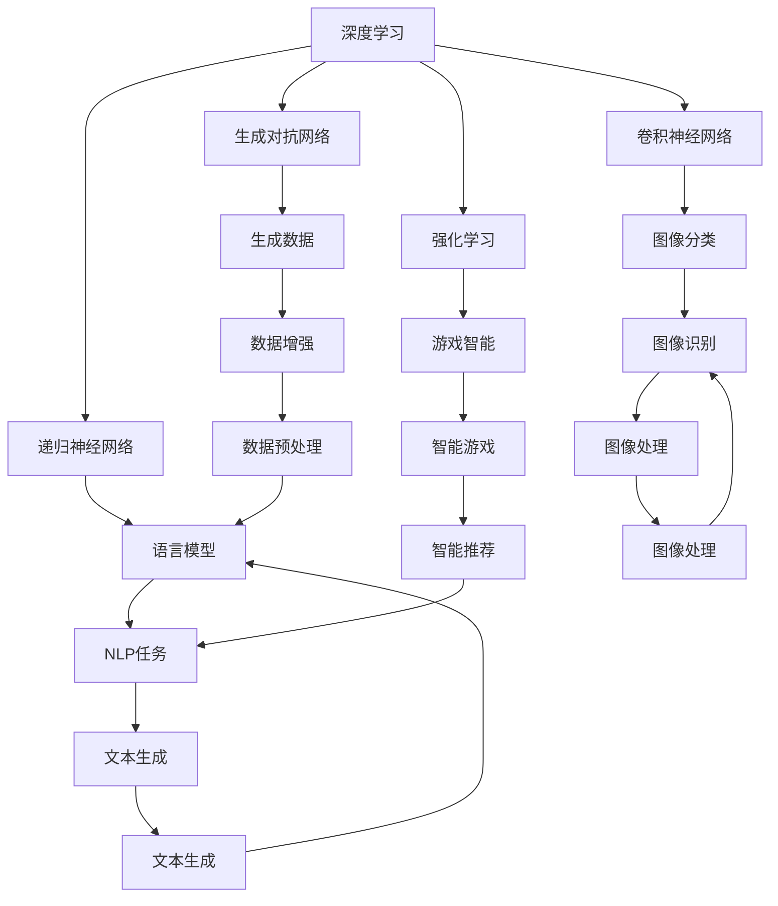
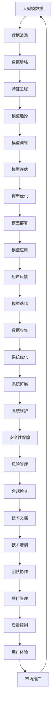

                 

# AI底层创新体系的构成要素

## 1. 背景介绍

### 1.1 问题由来
在当下这个高速发展的信息时代，人工智能(AI)已经逐步深入到了我们生活的方方面面，从智能家居、自动驾驶，到医疗诊断、金融交易。然而，这种快速发展的背后，AI技术的底层架构和创新体系却鲜为人知。作为计算机科学领域的专家，本文旨在深入探讨AI底层创新体系的构成要素，为读者呈现一个全面的视角，理解并掌握AI技术架构的核心。

### 1.2 问题核心关键点
AI底层创新体系的核心在于如何构建一个具有高度灵活性、可扩展性和安全性的技术架构。该体系涉及多个层面，包括但不限于模型设计、数据处理、计算框架、算法优化等。

- **模型设计**：选择合适的模型结构和参数，使模型能够高效处理特定类型的数据。
- **数据处理**：如何高效地收集、清洗和预处理数据，以提高模型训练的效率和效果。
- **计算框架**：选择和使用合适的计算框架，使得模型训练和推理过程能够高效、稳定地运行。
- **算法优化**：针对特定问题，设计并优化算法，以提升模型的性能和效率。

本文将通过介绍这些核心要素，帮助读者深入理解AI技术的底层创新体系，并探讨如何构建和优化这一体系。

### 1.3 问题研究意义
理解AI底层创新体系的构成要素，对于推动AI技术的发展和应用具有重要意义：

1. **加速技术创新**：清晰的技术架构和创新体系可以帮助开发者快速迭代新算法，推动技术进步。
2. **提升应用效果**：通过合理选择模型和算法，可以在更短的时间内获得更优的性能和效果。
3. **降低开发成本**：了解技术架构的各个组件，可以减少重复开发，提高开发效率。
4. **提高安全性**：理解技术架构的弱点和优化方法，可以有效降低系统风险。

## 2. 核心概念与联系

### 2.1 核心概念概述

为了更好地理解AI底层创新体系，本节将介绍几个关键的概念：

- **深度学习(DL)**：一种基于神经网络的机器学习技术，通过多层非线性变换，使模型能够学习到复杂的数据特征。
- **卷积神经网络(CNN)**：一种特殊的神经网络结构，适用于处理具有网格结构的数据，如图像。
- **递归神经网络(RNN)**：一种能够处理序列数据的神经网络，适用于语言模型和自然语言处理。
- **生成对抗网络(GAN)**：一种由生成器和判别器组成的框架，能够生成高质量的合成数据。
- **强化学习(RL)**：一种通过试错和奖励机制，使智能体在环境中学习最优策略的算法。

这些概念构成了AI底层创新体系的基础，每个概念都在其特定领域内扮演着重要角色。

### 2.2 概念间的关系

这些核心概念之间存在着紧密的联系，形成了AI技术架构的整体生态系统。下面我们通过几个Mermaid流程图来展示这些概念之间的关系。



这个流程图展示了各个核心概念之间的联系和应用场景：

1. 深度学习是基础，涵盖了CNN、RNN、GAN和RL等多种网络结构和技术。
2. CNN适用于图像处理任务，如图像分类、识别和生成。
3. RNN适用于语言处理任务，如语言模型和NLP任务。
4. GAN主要用于生成高质量的合成数据，用于数据增强和图像生成。
5. RL主要用于智能游戏和机器人控制等领域。

这些概念共同构成了AI技术的核心架构，通过合理选择和使用，可以构建出高效、稳定、安全的AI系统。

### 2.3 核心概念的整体架构

最后，我们用一个综合的流程图来展示这些核心概念在大规模AI系统中的整体架构：



这个综合流程图展示了从数据输入到模型部署再到市场推广的完整AI系统构建过程，以及每个环节的关键技术组件和优化方法。

## 3. 核心算法原理 & 具体操作步骤
### 3.1 算法原理概述

AI底层创新体系的核心算法原理主要包括深度学习模型的设计、优化和训练。

**深度学习模型设计**：选择合适的模型结构和参数，使模型能够高效处理特定类型的数据。例如，卷积神经网络(CNN)适用于处理具有网格结构的数据，而循环神经网络(RNN)适用于序列数据处理。

**深度学习模型优化**：通过梯度下降等优化算法，使模型参数能够在训练过程中不断调整，以达到最优状态。常见优化算法包括随机梯度下降(SGD)、Adam等。

**深度学习模型训练**：使用大量的标注数据对模型进行训练，使其能够学习到数据的特征和规律。训练过程包括数据预处理、模型前向传播、损失函数计算和反向传播等步骤。

### 3.2 算法步骤详解

下面我们将详细讲解深度学习模型的训练流程。

1. **数据预处理**：将原始数据转换为模型能够处理的格式，如将图像数据转换为张量形式，将文本数据进行分词、编码等。
2. **模型定义**：使用深度学习框架如PyTorch、TensorFlow等定义模型结构，包括卷积层、全连接层、循环层等。
3. **模型训练**：将预处理后的数据输入模型，进行前向传播，计算损失函数，然后反向传播计算梯度，更新模型参数。
4. **模型评估**：使用测试集对训练好的模型进行评估，计算各项指标如准确率、召回率等。
5. **模型优化**：根据评估结果，调整模型参数，如调整学习率、增加正则化等，以提升模型性能。

### 3.3 算法优缺点

深度学习模型的优点包括：

- **高效处理复杂数据**：深度学习模型能够自动学习数据的特征和规律，处理复杂数据如图像、文本等。
- **可扩展性强**：深度学习模型通过增加层数和节点数，可以处理更复杂的数据和任务。
- **适用于各种场景**：深度学习模型可以应用于图像处理、自然语言处理、语音识别等多个领域。

然而，深度学习模型也存在一些缺点：

- **数据依赖性强**：深度学习模型需要大量的标注数据进行训练，数据量不足或标注质量低会导致模型性能不佳。
- **计算资源消耗大**：深度学习模型通常需要大量的计算资源进行训练和推理，对硬件设备要求较高。
- **模型可解释性差**：深度学习模型被视为“黑盒”模型，难以解释其内部工作机制和决策逻辑。

### 3.4 算法应用领域

深度学习模型在多个领域都有广泛应用，包括但不限于：

- **图像处理**：如图像分类、物体检测、图像生成等。
- **自然语言处理**：如语言模型、机器翻译、文本生成等。
- **语音识别**：如自动语音识别、语音合成等。
- **推荐系统**：如协同过滤、内容推荐等。
- **医疗诊断**：如医学影像分析、疾病预测等。

## 4. 数学模型和公式 & 详细讲解 & 举例说明

### 4.1 数学模型构建

深度学习模型的数学模型构建通常包括以下几个关键部分：

- **输入数据**：将原始数据转换为模型能够处理的格式，如将图像数据转换为张量形式，将文本数据进行分词、编码等。
- **模型定义**：使用深度学习框架如PyTorch、TensorFlow等定义模型结构，包括卷积层、全连接层、循环层等。
- **损失函数**：定义模型预测结果与真实结果之间的差异，如均方误差、交叉熵等。
- **优化算法**：使用梯度下降等优化算法，使模型参数能够在训练过程中不断调整，以达到最优状态。

### 4.2 公式推导过程

以卷积神经网络(CNN)为例，推导其前向传播和后向传播过程。

**前向传播**：

假设输入数据为$x$，卷积核为$W$，激活函数为$\sigma$，则卷积层的输出为：

$$ y = \sigma(W * x + b) $$

其中$*$表示卷积运算，$b$为偏置项。

**后向传播**：

假设输出与真实标签之间的损失函数为$L$，则梯度下降算法更新权重$W$的公式为：

$$ \frac{\partial L}{\partial W} = \frac{\partial L}{\partial y} * \frac{\partial y}{\partial W} $$

其中$\frac{\partial y}{\partial W}$表示权重$W$对输出$y$的梯度。

### 4.3 案例分析与讲解

假设我们使用CNN模型对手写数字进行分类，输入数据为一个$28 \times 28$的图像。

- **输入数据**：将图像数据转换为张量形式。
- **模型定义**：定义一个包含两个卷积层和两个全连接层的CNN模型。
- **损失函数**：使用交叉熵损失函数。
- **优化算法**：使用Adam优化算法。

代码实现如下：

```python
import torch
import torch.nn as nn
import torch.optim as optim

# 定义CNN模型
class CNN(nn.Module):
    def __init__(self):
        super(CNN, self).__init__()
        self.conv1 = nn.Conv2d(1, 16, 3, 1, 1)
        self.conv2 = nn.Conv2d(16, 32, 3, 1, 1)
        self.fc1 = nn.Linear(32 * 5 * 5, 128)
        self.fc2 = nn.Linear(128, 10)
        
    def forward(self, x):
        x = self.conv1(x)
        x = nn.ReLU()
        x = self.conv2(x)
        x = nn.ReLU()
        x = x.view(-1, 32 * 5 * 5)
        x = self.fc1(x)
        x = nn.ReLU()
        x = self.fc2(x)
        return x

# 加载数据集
train_dataset = ...
test_dataset = ...

# 定义模型、优化器和损失函数
model = CNN()
optimizer = optim.Adam(model.parameters(), lr=0.001)
loss_fn = nn.CrossEntropyLoss()

# 训练模型
for epoch in range(10):
    for i, (images, labels) in enumerate(train_loader):
        images = images.view(-1, 1, 28, 28)
        output = model(images)
        loss = loss_fn(output, labels)
        optimizer.zero_grad()
        loss.backward()
        optimizer.step()

# 评估模型
for i, (images, labels) in enumerate(test_loader):
    images = images.view(-1, 1, 28, 28)
    output = model(images)
    loss = loss_fn(output, labels)
    print(loss.item())
```

## 5. 项目实践：代码实例和详细解释说明

### 5.1 开发环境搭建

在进行项目实践前，我们需要准备好开发环境。以下是使用Python进行PyTorch开发的环境配置流程：

1. 安装Anaconda：从官网下载并安装Anaconda，用于创建独立的Python环境。

2. 创建并激活虚拟环境：
```bash
conda create -n pytorch-env python=3.8 
conda activate pytorch-env
```

3. 安装PyTorch：根据CUDA版本，从官网获取对应的安装命令。例如：
```bash
conda install pytorch torchvision torchaudio cudatoolkit=11.1 -c pytorch -c conda-forge
```

4. 安装各类工具包：
```bash
pip install numpy pandas scikit-learn matplotlib tqdm jupyter notebook ipython
```

完成上述步骤后，即可在`pytorch-env`环境中开始项目实践。

### 5.2 源代码详细实现

下面我们以手写数字分类为例，给出使用PyTorch进行CNN模型训练的代码实现。

首先，定义CNN模型：

```python
import torch.nn as nn

class CNN(nn.Module):
    def __init__(self):
        super(CNN, self).__init__()
        self.conv1 = nn.Conv2d(1, 16, 3, 1, 1)
        self.conv2 = nn.Conv2d(16, 32, 3, 1, 1)
        self.fc1 = nn.Linear(32 * 5 * 5, 128)
        self.fc2 = nn.Linear(128, 10)
        
    def forward(self, x):
        x = self.conv1(x)
        x = nn.ReLU()
        x = self.conv2(x)
        x = nn.ReLU()
        x = x.view(-1, 32 * 5 * 5)
        x = self.fc1(x)
        x = nn.ReLU()
        x = self.fc2(x)
        return x
```

然后，定义训练和评估函数：

```python
import torch.optim as optim
import torch.utils.data as data
from torchvision import datasets, transforms

# 定义数据增强和预处理
transform_train = transforms.Compose([
    transforms.RandomHorizontalFlip(),
    transforms.RandomRotation(5),
    transforms.ToTensor(),
    transforms.Normalize((0.5, 0.5, 0.5), (0.5, 0.5, 0.5))
])

transform_test = transforms.Compose([
    transforms.ToTensor(),
    transforms.Normalize((0.5, 0.5, 0.5), (0.5, 0.5, 0.5))
])

# 加载数据集
train_dataset = datasets.MNIST(root='./data', train=True, download=True, transform=transform_train)
test_dataset = datasets.MNIST(root='./data', train=False, download=True, transform=transform_test)

# 定义训练和测试集批处理器
train_loader = data.DataLoader(train_dataset, batch_size=64, shuffle=True)
test_loader = data.DataLoader(test_dataset, batch_size=64, shuffle=False)

# 定义模型、优化器和损失函数
model = CNN()
optimizer = optim.Adam(model.parameters(), lr=0.001)
loss_fn = nn.CrossEntropyLoss()

# 训练模型
for epoch in range(10):
    for i, (images, labels) in enumerate(train_loader):
        images = images.view(-1, 1, 28, 28)
        output = model(images)
        loss = loss_fn(output, labels)
        optimizer.zero_grad()
        loss.backward()
        optimizer.step()

# 评估模型
for i, (images, labels) in enumerate(test_loader):
    images = images.view(-1, 1, 28, 28)
    output = model(images)
    loss = loss_fn(output, labels)
    print(loss.item())
```

以上就是使用PyTorch进行手写数字分类的完整代码实现。可以看到，使用PyTorch进行深度学习模型的实现相对简单，开发者可以更多地关注模型设计、数据处理和算法优化。

### 5.3 代码解读与分析

让我们再详细解读一下关键代码的实现细节：

**CNN模型定义**：
- `__init__`方法：初始化卷积层和全连接层。
- `forward`方法：定义模型的前向传播过程。

**数据增强和预处理**：
- `transform_train`和`transform_test`：定义训练集和测试集的数据增强和预处理步骤，包括随机旋转、翻转、归一化等。

**训练和评估函数**：
- `train_loader`和`test_loader`：定义训练集和测试集的批处理器。
- `model`、`optimizer`和`loss_fn`：定义模型、优化器和损失函数。

**训练流程**：
- 在每个epoch内，遍历训练集和测试集，计算损失并更新模型参数。

**评估流程**：
- 在测试集上计算模型损失，输出结果。

可以看到，使用PyTorch进行深度学习模型的开发，可以大大简化代码实现，使开发者可以更快地进行模型训练和评估。

## 6. 实际应用场景

### 6.1 智能推荐系统

智能推荐系统是深度学习在实际应用中非常重要的一个领域。推荐系统通过分析用户的行为数据，推荐用户可能感兴趣的商品、文章、视频等内容，提高用户的体验和满意度。

在实践中，推荐系统通常使用协同过滤、基于内容的推荐等算法，结合深度学习模型进行优化。例如，使用卷积神经网络对用户和商品特征进行编码，然后使用全连接层进行预测，以提升推荐的准确性和多样性。

### 6.2 医疗诊断系统

医疗诊断系统是深度学习在医学领域的一个重要应用。医疗诊断系统通过分析患者的病历、影像、基因等数据，帮助医生进行疾病诊断和治疗方案选择。

在实践中，医疗诊断系统通常使用卷积神经网络对医学影像进行特征提取和分类，使用循环神经网络对病历文本进行序列建模和情感分析，以提高诊断的准确性和速度。

### 6.3 自动驾驶系统

自动驾驶系统是深度学习在智能交通领域的一个重要应用。自动驾驶系统通过分析道路环境、交通信号、车辆状态等数据，实现自动驾驶和辅助驾驶功能。

在实践中，自动驾驶系统通常使用卷积神经网络对道路环境和交通信号进行特征提取和分类，使用循环神经网络对车辆状态进行序列建模和决策推理，以提高驾驶的安全性和舒适性。

## 7. 工具和资源推荐

### 7.1 学习资源推荐

为了帮助开发者系统掌握深度学习模型的设计、优化和训练，这里推荐一些优质的学习资源：

1. 《深度学习》课程：由斯坦福大学开设的深度学习课程，有Lecture视频和配套作业，带你入门深度学习的基本概念和经典模型。

2. 《TensorFlow实战》书籍：Google开发的深度学习框架TensorFlow的官方文档，提供了丰富的教程和样例，适合深度学习初学者和进阶者。

3. 《PyTorch官方文档》：PyTorch的官方文档，提供了完整的API文档和开发指南，是PyTorch开发者的必备资源。

4. Coursera深度学习专项课程：由Google、Coursera等机构合作开设的深度学习专项课程，适合系统学习深度学习的理论和实践。

5. GitHub深度学习项目：在GitHub上Star、Fork数最多的深度学习相关项目，往往代表了该技术领域的发展趋势和最佳实践，值得去学习和贡献。

通过这些资源的学习实践，相信你一定能够系统掌握深度学习模型的设计、优化和训练，并应用于实际项目中。

### 7.2 开发工具推荐

高效的开发离不开优秀的工具支持。以下是几款用于深度学习模型开发的常用工具：

1. PyTorch：基于Python的开源深度学习框架，灵活动态的计算图，适合快速迭代研究。大部分深度学习模型都有PyTorch版本的实现。

2. TensorFlow：由Google主导开发的开源深度学习框架，生产部署方便，适合大规模工程应用。同样有丰富的深度学习模型资源。

3. Keras：Google开发的高级深度学习框架，简单易用，适合快速原型开发和实验。

4. JAX：由Google开发的自动微分库，支持多种深度学习框架，适合高性能计算和自动微分研究。

5. MXNet：由Apache开发的深度学习框架，支持多种硬件平台，适合分布式计算和动态图优化。

这些工具提供了丰富的API和开发接口，使得深度学习模型的开发和调试更加便捷高效。

### 7.3 相关论文推荐

深度学习模型的发展源于学界的持续研究。以下是几篇奠基性的相关论文，推荐阅读：

1. ImageNet Classification with Deep Convolutional Neural Networks（AlexNet）：由AlexNet团队发表的深度学习模型论文，展示了深度卷积神经网络在图像分类任务上的出色表现。

2. Deep Residual Learning for Image Recognition（ResNet）：由ResNet团队发表的深度残差网络论文，提出残差连接结构，解决了深度网络中的梯度消失问题，提升了模型的深度和性能。

3. Convolutional Neural Networks for Generic Object Recognition（VGG）：由VGG团队发表的卷积神经网络论文，展示了深度卷积神经网络在通用物体识别任务上的出色表现。

4. Residual Network Architectures for Scene Understanding（ResNet）：由ResNet团队发表的深度残差网络论文，提出残差连接结构，提升了模型的深度和性能。

5. Attention Is All You Need（Transformer）：由Google发表的Transformer论文，展示了注意力机制在自然语言处理任务上的出色表现。

这些论文代表了大规模深度学习模型的发展脉络，通过学习这些前沿成果，可以帮助研究者把握学科前进方向，激发更多的创新灵感。

除上述资源外，还有一些值得关注的前沿资源，帮助开发者紧跟深度学习模型的最新进展，例如：

1. arXiv论文预印本：人工智能领域最新研究成果的发布平台，包括大量尚未发表的前沿工作，学习前沿技术的必读资源。

2. 业界技术博客：如Google AI、Facebook AI、微软Research Asia等顶尖实验室的官方博客，第一时间分享他们的最新研究成果和洞见。

3. 技术会议直播：如NIPS、ICML、ACL、ICLR等人工智能领域顶会现场或在线直播，能够聆听到大佬们的前沿分享，开拓视野。

4. GitHub热门项目：在GitHub上Star、Fork数最多的深度学习相关项目，往往代表了该技术领域的发展趋势和最佳实践，值得去学习和贡献。

5. 技术会议论文集：如NeurIPS、ICML、CVPR等国际顶级会议的论文集，包含大量深度学习模型的研究成果和前沿探索。

总之，对于深度学习模型的学习，需要开发者保持开放的心态和持续学习的意愿。多关注前沿资讯，多动手实践，多思考总结，必将收获满满的成长收益。

## 8. 总结：未来发展趋势与挑战

### 8.1 总结

本文对深度学习模型的设计、优化和训练进行了全面系统的介绍。首先阐述了深度学习模型的设计原则，然后详细讲解了模型的优化和训练流程，最后通过实践案例展示了深度学习模型的实际应用。

通过本文的系统梳理，可以看到，深度学习模型在多个领域都有广泛应用，能够高效处理复杂数据，提高系统性能和效率。然而，深度学习模型也面临着数据依赖性强、计算资源消耗大、模型可解释性差等挑战。

### 8.2 未来发展趋势

展望未来，深度学习模型的发展将呈现以下几个趋势：

1. **模型规模持续增大**：随着算力成本的下降和数据规模的扩张，深度学习模型的参数量还将持续增长。超大规模模型蕴含的丰富特征表示，有望支撑更加复杂多变的任务。

2. **模型可解释性增强**：随着模型复杂性的增加，模型的可解释性将成为重要研究方向。未来将出现更多可解释的深度学习模型和框架，帮助开发者更好地理解模型的内部工作机制。

3. **跨领域模型融合**：未来将出现更多跨领域的深度学习模型，将不同领域的知识进行融合，提升模型的泛化能力和鲁棒性。例如，将图像、语言、语音等多种模态信息进行协同建模，构建更加全面和丰富的表示。

4. **知识驱动模型**：未来将出现更多基于知识图谱和逻辑规则的深度学习模型，通过引入符号化的先验知识，提升模型的推理能力和泛化能力。

5. **多模态融合**：未来将出现更多多模态深度学习模型，将视觉、语音、文本等多种模态信息进行协同建模，构建更加全面和丰富的表示。

### 8.3 面临的挑战

尽管深度学习模型取得了巨大的成功，但在迈向更加智能化、普适化应用的过程中，仍然面临着诸多挑战：

1. **数据依赖性**：深度学习模型需要大量的标注数据进行训练，数据量不足或标注质量低会导致模型性能不佳。未来需要探索更多无监督和半监督学习技术，降低数据依赖性。

2. **计算资源消耗大**：深度学习模型通常需要大量的计算资源进行训练和推理，对硬件设备要求较高。未来需要探索更多高效的计算框架和硬件加速技术，降低计算成本。

3. **模型可解释性差**：深度学习模型被视为“黑盒”模型，难以解释其内部工作机制和决策逻辑。未来需要探索更多可解释的深度学习模型和框架，提升模型的透明度和可信度。

4. **跨领域迁移能力不足**：现有的深度学习模型往往局限于任务内数据，难以灵活吸收和运用更广泛的先验知识。未来需要探索更多跨领域的深度学习模型，提升模型的泛化能力和适应性。

5. **知识整合能力不足**：现有的深度学习模型难以灵活吸收和运用先验知识，未来的模型需要引入更多的知识图谱和逻辑规则，提升模型的推理能力和

