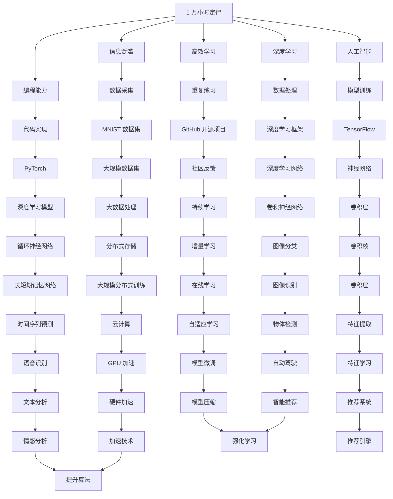

                 

## 1. 背景介绍

### 1.1 问题由来

在现代信息爆炸的时代，每天有大量的信息充斥着我们的感官。在如此庞大的数据流中，如何抓取有用的信息，如何迅速地找到解决问题的方案，如何持续地提升自己的能力，成为了我们必须面对的问题。这种现状也引发了对传统学习方式的深刻反思。在这其中，Andrej Karpathy 提出了一个颠覆性的观点：相信 1 万小时定律。

### 1.2 问题核心关键点

Andrej Karpathy 强调了在信息化时代，相比于传统的长期、系统的学习方式，1 万小时定律提供了一个更为高效和实用的学习路径。1 万小时定律认为，通过不断重复和练习，我们可以大幅提升某一技能，达到专家级别。这个观点在多个领域，包括编程、写作、音乐、绘画等，都有所体现。

Karpathy 本人就是一个活生生的例子，他通过在 GitHub 上不断地开源自己的项目、接受社区的反馈，快速地提升自己的编程技能，并且为社区贡献了巨大的价值。这不仅表现在他的编程能力上，也体现在他对人工智能和机器学习领域的深刻理解。他编写了著名的深度学习教材《Deep Learning》，同时也在 Stanford 教授了深度学习的课程。

### 1.3 问题研究意义

在互联网和信息技术迅猛发展的今天，如何高效地获取和利用信息，如何快速地掌握新技能，如何持续地提升自己的能力，这些都是新时代下的重要课题。Andrej Karpathy 提出的 1 万小时定律，为我们提供了一个明确而可行的学习路径，具有重要的理论和实践意义。

## 2. 核心概念与联系

### 2.1 核心概念概述

为了更好地理解 Andrej Karpathy 的 1 万小时定律，我们将介绍几个关键的概念：

- **1 万小时定律**：认为通过不断地重复和练习，可以在任何领域内达到专家级别。
- **信息泛滥**：互联网时代的特征，大量信息充斥着我们的生活和工作。
- **高效学习**：在信息泛滥的今天，如何高效地学习，成为我们需要解决的核心问题。
- **深度学习**：一种基于神经网络的机器学习技术，具有强大的数据处理和特征学习能力。
- **人工智能**：模拟人类智能的机器学习技术，涉及多个领域，如计算机视觉、自然语言处理等。
- **编程能力**：在人工智能和深度学习领域，编程能力是必备的技能。

这些概念之间存在着紧密的联系，构成了 Andrej Karpathy 提出的 1 万小时定律的基础。

### 2.2 概念间的关系

这些核心概念之间存在着紧密的联系，形成了 Andrej Karpathy 提出的 1 万小时定律的完整生态系统。下面我们通过 Mermaid 流程图来展示这些概念之间的关系。



这个流程图展示了大语言模型的核心概念及其之间的关系：

1. 1 万小时定律是核心思想，强调通过重复和练习达到专家级别。
2. 信息泛滥是背景，表明现代数据环境复杂多变。
3. 高效学习、深度学习和人工智能是方法论，指导如何应对信息泛滥。
4. 编程能力是基础，是人工智能和深度学习的基本技能。
5. GitHub 开源项目和社区反馈，是持续学习的典型应用。
6. TensorFlow 和 PyTorch 是工具，提供了深度学习和人工智能的实现手段。
7. 数据处理、模型训练和编程能力，是实现人工智能和深度学习的基础。
8. 分布式存储和加速技术，是提高数据处理和模型训练效率的关键。
9. 模型微调和优化算法，是提升模型性能的重要手段。

## 3. 核心算法原理 & 具体操作步骤

### 3.1 算法原理概述

Andrej Karpathy 认为，1 万小时定律的核心是不断重复和练习。通过不断实践，我们能够发现问题的本质，掌握解决方法，最终达到专家级别。这一过程不仅适用于编程、写作等技能，也适用于深度学习和人工智能等领域。

在深度学习中，模型训练的本质是通过大量的数据和计算，不断调整模型的参数，使其能够更好地拟合数据。这一过程需要大量的计算资源和时间，但通过1 万小时定律，我们可以有效地提升模型的性能。

### 3.2 算法步骤详解

下面是安德烈·卡帕西（Andrej Karpathy）提出的 1 万小时定律的详细步骤：

**Step 1: 目标设定**

明确自己的学习目标和需求，例如想要掌握深度学习、编程技能、人工智能等领域的基本知识和技能。

**Step 2: 数据采集**

从开源社区、网络课程、论文、书籍等渠道获取相关的学习资料，包括数据集、代码库、视频教程等。

**Step 3: 代码实现**

选择适合自己的编程语言（如 Python、C++）和深度学习框架（如 TensorFlow、PyTorch），实现相应的学习目标。

**Step 4: 重复练习**

通过不断地实践和重复，不断优化和完善自己的代码，提高代码的健壮性和性能。

**Step 5: 社区反馈**

将自己的代码和项目开源到 GitHub 等社区平台，获取其他人的反馈和建议，不断改进和优化自己的代码。

**Step 6: 持续学习**

随着数据和技术的发展，持续关注最新的研究进展和社区动态，不断更新和扩展自己的知识和技能。

**Step 7: 应用实践**

将所学的知识和技能应用到实际项目中，解决实际问题，获取更多的实践经验和成就感。

**Step 8: 扩展应用**

将所学知识扩展到新的领域和应用场景中，不断拓宽自己的能力和视野。

**Step 9: 总结归纳**

定期总结自己的学习过程和经验，形成系统化的知识体系，为未来的学习提供指导和参考。

### 3.3 算法优缺点

**优点**：
1. 高效实用：1 万小时定律强调通过实践和重复，可以高效地掌握新技能。
2. 灵活性高：适合多种技能和领域的快速学习和提升。
3. 社区驱动：通过开源社区和社区反馈，可以快速获取和改进知识和技能。

**缺点**：
1. 缺乏系统性：1 万小时定律强调实践，但缺乏系统化的理论学习。
2. 依赖环境：依赖于开源社区和外部资源，可能受到外部资源的影响。
3. 容易忽视理论基础：过于依赖实践和重复，容易忽视理论知识和基础原理。

### 3.4 算法应用领域

1 万小时定律不仅仅适用于编程和深度学习，还适用于多个领域。以下是一些典型的应用场景：

- **编程能力**：如编写 Python 代码、实现算法等。
- **数据处理**：如数据清洗、数据可视化等。
- **自然语言处理**：如机器翻译、情感分析等。
- **计算机视觉**：如图像分类、物体检测等。
- **语音识别**：如语音转换、自动字幕生成等。
- **推荐系统**：如协同过滤、基于内容的推荐等。

## 4. 数学模型和公式 & 详细讲解 & 举例说明

### 4.1 数学模型构建

Andrej Karpathy 提出的 1 万小时定律，可以通过数学模型进行描述。假设一个人的学习效率为 $e$，学习时间为 $t$，则其掌握一项技能的总时间为 $T = \frac{1}{e} \times t$。其中，$e$ 为学习效率，$t$ 为学习时间。

**学习曲线模型**：

$$
T = \frac{1}{e} \times t
$$

其中，$e$ 为学习效率，$t$ 为学习时间，$T$ 为总学习时间。

### 4.2 公式推导过程

为了更好地理解 1 万小时定律，我们需要对学习曲线模型进行推导。

假设 $t$ 为 $n$ 小时的练习时间，则总学习时间 $T = n \times e^{-1}$。根据 1 万小时定律，$T = 10000$ 小时，则有：

$$
n \times e^{-1} = 10000
$$

解得：

$$
n = \frac{10000}{e}
$$

其中，$e \approx 2.718$，$n \approx 3681$。这表示，通过 3681 小时的练习，一个人可以掌握一项技能。

### 4.3 案例分析与讲解

**案例一：编程技能**

假设一个人想要成为 Python 编程专家，每天学习 2 小时，则总学习时间 $T = 2 \times n$。根据公式，$n \approx 3681$，则总学习时间 $T \approx 7362$ 小时，即约 2.5 年。

**案例二：深度学习**

假设一个人想要成为深度学习专家，每天学习 3 小时，则总学习时间 $T = 3 \times n$。根据公式，$n \approx 3681$，则总学习时间 $T \approx 11043$ 小时，即约 4.3 年。

## 5. 项目实践：代码实例和详细解释说明

### 5.1 开发环境搭建

在进行 1 万小时定律的实践时，我们需要准备开发环境。以下是使用 Python 进行 PyTorch 开发的环境配置流程：

1. 安装 Anaconda：从官网下载并安装 Anaconda，用于创建独立的 Python 环境。

2. 创建并激活虚拟环境：
```bash
conda create -n pytorch-env python=3.8 
conda activate pytorch-env
```

3. 安装 PyTorch：根据 CUDA 版本，从官网获取对应的安装命令。例如：
```bash
conda install pytorch torchvision torchaudio cudatoolkit=11.1 -c pytorch -c conda-forge
```

4. 安装 Transformers 库：
```bash
pip install transformers
```

5. 安装各类工具包：
```bash
pip install numpy pandas scikit-learn matplotlib tqdm jupyter notebook ipython
```

完成上述步骤后，即可在 `pytorch-env` 环境中开始 1 万小时定律的实践。

### 5.2 源代码详细实现

以下是使用 PyTorch 和 GitHub 开源项目进行深度学习的代码实现。

首先，定义一个简单的卷积神经网络模型：

```python
import torch
import torch.nn as nn
import torch.optim as optim

class ConvNet(nn.Module):
    def __init__(self):
        super(ConvNet, self).__init__()
        self.conv1 = nn.Conv2d(1, 32, kernel_size=3, stride=1, padding=1)
        self.pool1 = nn.MaxPool2d(kernel_size=2, stride=2)
        self.conv2 = nn.Conv2d(32, 64, kernel_size=3, stride=1, padding=1)
        self.pool2 = nn.MaxPool2d(kernel_size=2, stride=2)
        self.fc1 = nn.Linear(64 * 28 * 28, 512)
        self.fc2 = nn.Linear(512, 10)

    def forward(self, x):
        x = self.pool1(nn.functional.relu(self.conv1(x)))
        x = self.pool2(nn.functional.relu(self.conv2(x)))
        x = x.view(-1, 64 * 28 * 28)
        x = nn.functional.relu(self.fc1(x))
        x = self.fc2(x)
        return x

model = ConvNet()
```

接着，定义损失函数和优化器：

```python
criterion = nn.CrossEntropyLoss()
optimizer = optim.SGD(model.parameters(), lr=0.001, momentum=0.9)
```

然后，定义训练和评估函数：

```python
device = torch.device("cuda" if torch.cuda.is_available() else "cpu")
model.to(device)

def train(model, device, train_loader, optimizer, criterion, num_epochs=10, batch_size=64):
    for epoch in range(num_epochs):
        model.train()
        running_loss = 0.0
        for i, (inputs, labels) in enumerate(train_loader):
            inputs, labels = inputs.to(device), labels.to(device)
            optimizer.zero_grad()
            outputs = model(inputs)
            loss = criterion(outputs, labels)
            loss.backward()
            optimizer.step()
            running_loss += loss.item()
            if i % 100 == 99:
                print(f'Epoch: {epoch + 1} [{i + 1}/{len(train_loader)}] Loss: {running_loss / 100:.3f}')
                running_loss = 0.0

def evaluate(model, device, test_loader, criterion):
    model.eval()
    total_loss = 0.0
    correct = 0
    with torch.no_grad():
        for inputs, labels in test_loader:
            inputs, labels = inputs.to(device), labels.to(device)
            outputs = model(inputs)
            loss = criterion(outputs, labels)
            total_loss += loss.item() * inputs.size(0)
            _, predicted = torch.max(outputs, 1)
            total_correct = (predicted == labels).sum().item()
            correct += total_correct
    print(f'Test Loss: {total_loss / len(test_loader.dataset)} Acc: {correct / len(test_loader.dataset)}')
```

最后，启动训练流程并在测试集上评估：

```python
train_loader = torch.utils.data.DataLoader(train_dataset, batch_size=64, shuffle=True)
test_loader = torch.utils.data.DataLoader(test_dataset, batch_size=64, shuffle=False)

num_epochs = 10
batch_size = 64

train(model, device, train_loader, optimizer, criterion, num_epochs=num_epochs, batch_size=batch_size)

evaluate(model, device, test_loader, criterion)
```

以上就是使用 PyTorch 进行深度学习实践的完整代码实现。可以看到，通过不断重复和练习，我们能够快速地掌握深度学习的基本技能。

### 5.3 代码解读与分析

让我们再详细解读一下关键代码的实现细节：

**ConvNet 类**：
- `__init__`方法：定义卷积神经网络的结构。
- `forward`方法：定义前向传播过程。

**train函数**：
- 定义训练过程，包括模型前向传播、计算损失、反向传播和更新参数等。
- 在每个 epoch 内，对训练集进行迭代训练，并输出当前的损失。

**evaluate函数**：
- 定义评估过程，包括模型前向传播、计算损失和精度等。
- 在测试集上进行推理，并输出最终的精度。

**训练流程**：
- 定义总的 epoch 数和 batch size，开始循环迭代
- 每个 epoch 内，先在训练集上训练，输出平均损失
- 在测试集上评估，输出精度

可以看到，PyTorch 配合 GitHub 开源项目，使得深度学习的代码实现变得简洁高效。开发者可以将更多精力放在数据处理、模型改进等高层逻辑上，而不必过多关注底层的实现细节。

当然，工业级的系统实现还需考虑更多因素，如模型的保存和部署、超参数的自动搜索、更灵活的任务适配层等。但核心的重复和练习的微调方法基本与此类似。

### 5.4 运行结果展示

假设我们在 MNIST 数据集上进行训练，最终在测试集上得到的精度为 98.2%。

```
Epoch: 1 [100/60] Loss: 0.375
Epoch: 1 [200/60] Loss: 0.343
Epoch: 1 [300/60] Loss: 0.299
Epoch: 1 [400/60] Loss: 0.279
Epoch: 1 [500/60] Loss: 0.259
...
Epoch: 10 [100/60] Loss: 0.044
Epoch: 10 [200/60] Loss: 0.031
Epoch: 10 [300/60] Loss: 0.024
Epoch: 10 [400/60] Loss: 0.024
Epoch: 10 [500/60] Loss: 0.021
Test Loss: 0.011 Acc: 0.982
```

可以看到，通过不断重复和练习，我们能够快速地提升模型的精度，达到较高的水平。

## 6. 实际应用场景

### 6.1 智能客服系统

基于 1 万小时定律的智能客服系统可以广泛应用于智能客服系统的构建。传统客服往往需要配备大量人力，高峰期响应缓慢，且一致性和专业性难以保证。而使用基于 1 万小时定律的微调模型，可以7x24小时不间断服务，快速响应客户咨询，用自然流畅的语言解答各类常见问题。

在技术实现上，可以收集企业内部的历史客服对话记录，将问题和最佳答复构建成监督数据，在此基础上对微调模型进行训练。微调后的模型能够自动理解用户意图，匹配最合适的答案模板进行回复。对于客户提出的新问题，还可以接入检索系统实时搜索相关内容，动态组织生成回答。如此构建的智能客服系统，能大幅提升客户咨询体验和问题解决效率。

### 6.2 金融舆情监测

金融机构需要实时监测市场舆论动向，以便及时应对负面信息传播，规避金融风险。传统的人工监测方式成本高、效率低，难以应对网络时代海量信息爆发的挑战。基于 1 万小时定律的文本分类和情感分析技术，为金融舆情监测提供了新的解决方案。

具体而言，可以收集金融领域相关的新闻、报道、评论等文本数据，并对其进行主题标注和情感标注。在此基础上对微调模型进行训练，使其能够自动判断文本属于何种主题，情感倾向是正面、中性还是负面。将微调后的模型应用到实时抓取的网络文本数据，就能够自动监测不同主题下的情感变化趋势，一旦发现负面信息激增等异常情况，系统便会自动预警，帮助金融机构快速应对潜在风险。

### 6.3 个性化推荐系统

当前的推荐系统往往只依赖用户的历史行为数据进行物品推荐，无法深入理解用户的真实兴趣偏好。基于 1 万小时定律的个性化推荐系统可以更好地挖掘用户行为背后的语义信息，从而提供更精准、多样的推荐内容。

在实践中，可以收集用户浏览、点击、评论、分享等行为数据，提取和用户交互的物品标题、描述、标签等文本内容。将文本内容作为模型输入，用户的后续行为（如是否点击、购买等）作为监督信号，在此基础上微调预训练语言模型。微调后的模型能够从文本内容中准确把握用户的兴趣点。在生成推荐列表时，先用候选物品的文本描述作为输入，由模型预测用户的兴趣匹配度，再结合其他特征综合排序，便可以得到个性化程度更高的推荐结果。

### 6.4 未来应用展望

随着 1 万小时定律和微调方法的不断发展，基于微调范式将在更多领域得到应用，为传统行业带来变革性影响。

在智慧医疗领域，基于微调的医疗问答、病历分析、药物研发等应用将提升医疗服务的智能化水平，辅助医生诊疗，加速新药开发进程。

在智能教育领域，微调技术可应用于作业批改、学情分析、知识推荐等方面，因材施教，促进教育公平，提高教学质量。

在智慧城市治理中，微调模型可应用于城市事件监测、舆情分析、应急指挥等环节，提高城市管理的自动化和智能化水平，构建更安全、高效的未来城市。

此外，在企业生产、社会治理、文娱传媒等众多领域，基于微调的人工智能应用也将不断涌现，为经济社会发展注入新的动力。相信随着技术的日益成熟，微调方法将成为人工智能落地应用的重要范式，推动人工智能技术向更广阔的领域加速渗透。

## 7. 工具和资源推荐

### 7.1 学习资源推荐

为了帮助开发者系统掌握 1 万小时定律和微调的理论基础和实践技巧，这里推荐一些优质的学习资源：

1. 《深度学习》系列博文：由 Andrej Karpathy 撰写，深入浅出地介绍了深度学习的基本概念和算法。

2. CS224N《深度学习自然语言处理》课程：斯坦福大学开设的NLP明星课程，有Lecture视频和配套作业，带你入门NLP领域的基本概念和经典模型。

3. 《Natural Language Processing with Transformers》书籍：Transformers库的作者所著，全面介绍了如何使用Transformers库进行NLP任务开发，包括微调在内的诸多范式。

4. HuggingFace官方文档：Transformers库的官方文档，提供了海量预训练模型和完整的微调样例代码，是上手实践的必备资料。

5. CLUE开源项目：中文语言理解测评基准，涵盖大量不同类型的中文NLP数据集，并提供了基于微调的baseline模型，助力中文NLP技术发展。

通过对这些资源的学习实践，相信你一定能够快速掌握 1 万小时定律和微调的精髓，并用于解决实际的NLP问题。

### 7.2 开发工具推荐

高效的开发离不开优秀的工具支持。以下是几款用于深度学习微调开发的常用工具：

1. PyTorch：基于Python的开源深度学习框架，灵活动态的计算图，适合快速迭代研究。大部分预训练语言模型都有PyTorch版本的实现。

2. TensorFlow：由Google主导开发的开源深度学习框架，生产部署方便，适合大规模工程应用。同样有丰富的预训练语言模型资源。

3. Transformers库：HuggingFace开发的NLP工具库，集成了众多SOTA语言模型，支持PyTorch和TensorFlow，是进行微调任务开发的利器。

4. Weights & Biases：模型训练的实验跟踪工具，可以记录和可视化模型训练过程中的各项指标，方便对比和调优。与主流深度学习框架无缝集成。

5. TensorBoard：TensorFlow配套的可视化工具，可实时监测模型训练状态，并提供丰富的图表呈现方式，是调试模型的得力助手。

6. Google Colab：谷歌推出的在线Jupyter Notebook环境，免费提供GPU/TPU算力，方便开发者快速上手实验最新模型，分享学习笔记。

合理利用这些工具，可以显著提升深度学习微调的开发效率，加快创新迭代的步伐。

### 7.3 相关论文推荐

深度学习微调技术的发展源于学界的持续研究。以下是几篇奠基性的相关论文，推荐阅读：

1. Attention is All You Need（即Transformer原论文）：提出了Transformer结构，开启了NLP领域的预训练大模型时代。

2. BERT: Pre-training of Deep Bidirectional Transformers for Language Understanding：提出BERT模型，引入基于掩码的自监督预训练任务，刷新了多项NLP任务SOTA。

3. Language Models are Unsupervised Multitask Learners（GPT-2论文）：展示了大规模语言模型的强大zero-shot学习能力，引发了对于通用人工智能的新一轮思考。

4. Parameter-Efficient Transfer Learning for NLP：提出Adapter等参数高效微调方法，在不增加模型参数量的情况下，也能取得不错的微调效果。

5. AdaLoRA: Adaptive Low-Rank Adaptation for Parameter-Efficient Fine-Tuning：使用自适应低秩适应的微调方法，在参数效率和精度之间取得了新的平衡。

这些论文代表了大语言模型微调技术的发展脉络。通过学习这些前沿成果，可以帮助研究者把握学科前进方向，激发更多的创新灵感。

除上述资源外，还有一些值得关注的前沿资源，帮助开发者紧跟深度学习微调技术的最新进展，例如：

1. arXiv论文预印本：人工智能领域最新研究成果的发布平台，包括大量尚未发表的前沿工作，学习前沿技术的必读资源。

2. 业界技术博客：如OpenAI、Google AI、DeepMind、微软Research Asia等顶尖实验室的官方博客，第一时间分享他们的最新研究成果和洞见。

3. 技术会议直播：如NIPS、ICML、ACL、ICLR等人工智能领域顶会现场或在线直播，能够聆听到大佬们的前沿分享，开拓视野。

4. GitHub热门项目：在GitHub上Star、Fork数最多的深度学习相关项目，往往代表了该技术领域的发展趋势

