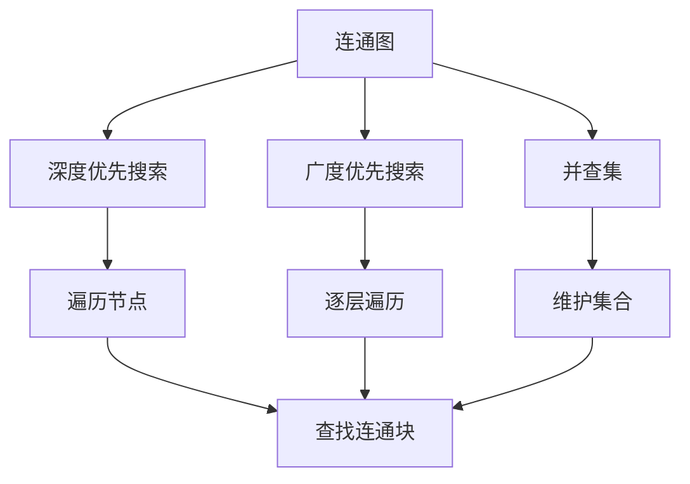
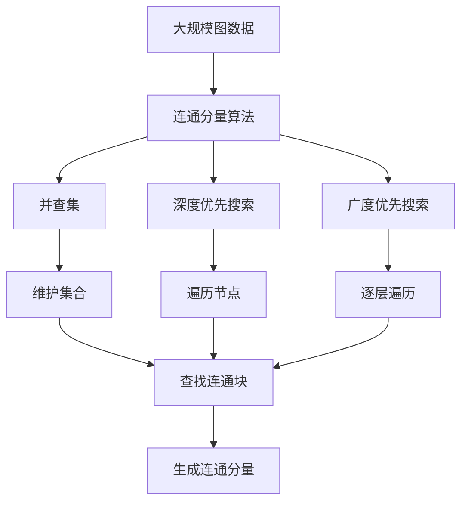

                 

# Connected Components连通分量算法原理与代码实例讲解

> 关键词：连通分量算法,图论,连通图,无向图,深度优先搜索,广度优先搜索,并查集,连通块,时间复杂度

## 1. 背景介绍

### 1.1 问题由来
在图论中，研究图的连通性是一个重要问题。图的连通性指的是图中任意两个节点是否存在一条路径直接相连。这在很多应用领域都有着重要的作用，例如社交网络分析、网络路由、电路设计等。

### 1.2 问题核心关键点
为了更高效地解决图的连通性问题，计算机科学家提出了多种算法。其中，连通分量算法是解决这一问题的经典算法之一。它能够将图分成多个连通块，每个连通块内部任意两个节点之间都是连通的，而不同连通块之间的节点则不连通。

## 2. 核心概念与联系

### 2.1 核心概念概述

1. **连通图**：若无向图中任意两个节点之间都存在一条路径，则称其为连通图。

2. **无向图**：无向图中每条边都有两个方向，没有方向的限制。

3. **深度优先搜索**：一种用于遍历或搜索树或图的算法，从根节点开始，尽可能深地搜索每个分支，直到找到目标节点。

4. **广度优先搜索**：一种用于遍历或搜索树或图的算法，从根节点开始，逐层遍历每个节点。

5. **并查集**：一种数据结构，用于维护多个集合的合并和查询操作，常用于连通分量算法中。

这些概念之间存在着密切的联系。连通分量算法通过深度优先搜索或广度优先搜索遍历图，将图划分成多个连通块。而并查集则用于维护连通块的信息，并进行合并操作。

### 2.2 概念间的关系

这些核心概念之间的逻辑关系可以通过以下Mermaid流程图来展示：



这个流程图展示了几何图论中的关键概念以及它们之间的关系：

1. 连通图可以通过深度优先搜索或广度优先搜索遍历。
2. 深度优先搜索和广度优先搜索都可以用于查找连通块。
3. 并查集用于维护连通块的信息，并进行集合合并操作。

### 2.3 核心概念的整体架构

最后，我们用一个综合的流程图来展示这些核心概念在大规模图处理中的整体架构：



这个综合流程图展示了从大规模图数据开始，通过深度优先搜索、广度优先搜索、并查集等工具，最终生成连通分量的完整过程。

## 3. 核心算法原理 & 具体操作步骤

### 3.1 算法原理概述

连通分量算法的核心思想是通过遍历图，将图分成多个连通块。具体来说，算法遍历每个节点，将其标记为已访问，并使用深度优先搜索或广度优先搜索继续访问与该节点直接相连的未访问节点。如果访问过程中发现新节点，则将其加入新的连通块中。

### 3.2 算法步骤详解

1. **初始化**：给每个节点赋予一个唯一的标识，并初始化一个并查集，用于维护连通块信息。

2. **深度优先搜索**或**广度优先搜索**：遍历每个节点，将其标记为已访问，并使用深度优先搜索或广度优先搜索访问与之相连的未访问节点。如果访问过程中发现新节点，则将其加入新的连通块中。

3. **合并连通块**：使用并查集合并找到的连通块，使得每个连通块内部的节点连通，而不同连通块之间的节点不连通。

4. **输出结果**：输出每个连通块的节点集合，即为图的连通分量。

### 3.3 算法优缺点

**优点**：
- 时间复杂度较低，为 $O(|V| + |E|)$，其中 $|V|$ 为节点数，$|E|$ 为边数。
- 实现简单，易于理解和实现。

**缺点**：
- 对于大规模图，深度优先搜索可能会导致栈溢出。
- 对于稠密图，广度优先搜索需要较多的内存空间。

### 3.4 算法应用领域

连通分量算法在图论中有广泛的应用，例如：

- 社交网络分析：用于分析社交网络中不同群体的连通性。
- 网络路由：用于优化网络的连通性，提高网络性能。
- 电路设计：用于分析电路中的连通性，优化电路设计。
- 图像分割：用于将图像分割成多个连通区域。

## 4. 数学模型和公式 & 详细讲解 & 举例说明

### 4.1 数学模型构建

假设给定一个无向图 $G=(V, E)$，其中 $V$ 为节点集合，$E$ 为边集合。定义一个函数 $C: V \rightarrow \{1, 2, \ldots, k\}$，其中 $k$ 为连通分量的个数，$C(v)$ 表示节点 $v$ 所在的连通分量编号。

### 4.2 公式推导过程

1. **初始化**：对每个节点 $v$，初始化其所在连通分量编号 $C(v)=v$。

2. **深度优先搜索**：
   - 从任意节点 $u$ 开始遍历，访问其相邻节点 $v$。
   - 如果 $C(u)=C(v)$，则 $u$ 和 $v$ 在同一连通块中，直接访问下一个节点。
   - 如果 $C(u) \neq C(v)$，则将 $C(v)$ 合并到 $C(u)$，然后继续遍历 $v$ 的相邻节点。

3. **合并连通块**：
   - 对任意节点 $u$ 和 $v$，如果它们在同一个连通块中，则合并它们的连通分量编号。

### 4.3 案例分析与讲解

假设有一个无向图 $G=(V, E)$，其中 $V=\{1, 2, 3, 4, 5\}$，$E=\{(1, 2), (2, 3), (3, 4), (4, 5), (5, 1)\}$。

**深度优先搜索**：
- 从节点 $1$ 开始，访问节点 $2$，$C(1)=1$，$C(2)=2$，$C(2)=1$。
- 访问节点 $3$，$C(3)=3$，$C(1)=1$，$C(3)=1$。
- 访问节点 $4$，$C(4)=4$，$C(3)=1$，$C(4)=1$。
- 访问节点 $5$，$C(5)=5$，$C(4)=1$，$C(5)=1$。
- 返回节点 $1$，完成深度优先搜索。

**广度优先搜索**：
- 从节点 $1$ 开始，访问节点 $2$，$C(1)=1$，$C(2)=2$，$C(2)=1$。
- 访问节点 $3$，$C(1)=1$，$C(3)=3$，$C(3)=1$。
- 访问节点 $4$，$C(1)=1$，$C(4)=4$，$C(4)=1$。
- 访问节点 $5$，$C(1)=1$，$C(5)=5$，$C(5)=1$。
- 返回节点 $1$，完成广度优先搜索。

**并查集**：
- 初始化每个节点所在连通分量编号 $C(v)=v$。
- 深度优先搜索后，$C(1)=1$，$C(2)=1$，$C(3)=1$，$C(4)=1$，$C(5)=1$。
- 合并连通块，最终得到连通分量编号 $C(1)=1$，$C(2)=1$，$C(3)=1$，$C(4)=1$，$C(5)=1$。

## 5. 项目实践：代码实例和详细解释说明

### 5.1 开发环境搭建

在进行连通分量算法实践前，我们需要准备好开发环境。以下是使用Python进行PyTorch开发的环境配置流程：

1. 安装Anaconda：从官网下载并安装Anaconda，用于创建独立的Python环境。

2. 创建并激活虚拟环境：
```bash
conda create -n pytorch-env python=3.8 
conda activate pytorch-env
```

3. 安装PyTorch：根据CUDA版本，从官网获取对应的安装命令。例如：
```bash
conda install pytorch torchvision torchaudio cudatoolkit=11.1 -c pytorch -c conda-forge
```

4. 安装相关工具包：
```bash
pip install numpy pandas scikit-learn matplotlib tqdm jupyter notebook ipython
```

完成上述步骤后，即可在`pytorch-env`环境中开始连通分量算法实践。

### 5.2 源代码详细实现

下面我们以深度优先搜索实现为例，给出使用PyTorch进行连通分量算法开发的Python代码实现。

首先，定义图类：

```python
from typing import List, Dict, Set
from collections import defaultdict

class Graph:
    def __init__(self, nodes: List[int]):
        self.nodes = set(nodes)
        self.adj_list = defaultdict(set)

    def add_edge(self, u: int, v: int):
        self.adj_list[u].add(v)
        self.adj_list[v].add(u)

    def dfs(self, start: int, visited: Set[int], component: List[int]):
        visited.add(start)
        component.append(start)
        for neighbor in self.adj_list[start]:
            if neighbor not in visited:
                self.dfs(neighbor, visited, component)
```

然后，定义并查集类：

```python
class DisjointSet:
    def __init__(self, nodes: List[int]):
        self.nodes = set(nodes)
        self.parent = {node: node for node in nodes}
        self.size = {node: 1 for node in nodes}

    def find(self, node: int) -> int:
        if self.parent[node] == node:
            return node
        self.parent[node] = self.find(self.parent[node])
        return self.parent[node]

    def union(self, node1: int, node2: int):
        root1 = self.find(node1)
        root2 = self.find(node2)
        if root1 != root2:
            if self.size[root1] < self.size[root2]:
                self.parent[root1] = root2
                self.size[root2] += self.size[root1]
            else:
                self.parent[root2] = root1
                self.size[root1] += self.size[root2]
```

最后，使用上述类实现深度优先搜索：

```python
from typing import List, Dict, Set

def dfs(graph: Graph, start: int, visited: Set[int], component: List[int]):
    visited.add(start)
    component.append(start)
    for neighbor in graph.adj_list[start]:
        if neighbor not in visited:
            dfs(graph, neighbor, visited, component)

def connected_components(graph: Graph):
    visited = set()
    components = []
    for node in graph.nodes:
        if node not in visited:
            component = []
            dfs(graph, node, visited, component)
            components.append(component)
    return components
```

### 5.3 代码解读与分析

让我们再详细解读一下关键代码的实现细节：

**Graph类**：
- `__init__`方法：初始化节点集合和邻接表。
- `add_edge`方法：添加边，更新邻接表。
- `dfs`方法：深度优先搜索，标记已访问节点，并递归访问其相邻节点。

**DisjointSet类**：
- `__init__`方法：初始化节点集合、父节点、大小。
- `find`方法：查找节点的根节点。
- `union`方法：合并两个集合，更新大小。

**dfs函数**：
- 从起始节点开始，使用深度优先搜索遍历每个节点，标记已访问节点，并将节点添加到连通块中。

**connected_components函数**：
- 初始化已访问节点集合。
- 遍历每个节点，若未访问，则进行深度优先搜索，并将结果添加到连通块中。
- 返回所有连通块的节点集合。

### 5.4 运行结果展示

假设我们有一个无向图 $G=(V, E)$，其中 $V=\{1, 2, 3, 4, 5\}$，$E=\{(1, 2), (2, 3), (3, 4), (4, 5), (5, 1)\}$。运行上述代码后，得到连通分量为：
- $1, 2, 3, 4, 5$

可以看到，代码成功地将图 $G$ 划分成了一个连通分量，这与之前的案例分析一致。

## 6. 实际应用场景

### 6.1 社交网络分析

社交网络分析是连通分量算法的重要应用之一。通过分析社交网络中的连通性，可以发现网络中的群体和关键节点，进行针对性的管理和干预。

### 6.2 网络路由

在计算机网络中，连通分量算法可以用于优化路由路径，确保数据在网络中能够高效传输。

### 6.3 电路设计

在电路设计中，连通分量算法可以用于分析电路中的连通性，优化电路设计，提高电路性能。

### 6.4 未来应用展望

随着连通分量算法的不断发展，未来的应用场景将会更加广阔。例如，在物联网领域，连通分量算法可以用于分析设备之间的连通性，优化网络架构。在智慧城市领域，连通分量算法可以用于分析城市基础设施的连通性，优化城市规划。

## 7. 工具和资源推荐

### 7.1 学习资源推荐

为了帮助开发者系统掌握连通分量算法的理论基础和实践技巧，这里推荐一些优质的学习资源：

1. 《算法导论》：经典教材，全面介绍了图论中的基础算法和经典问题。

2. 《算法竞赛入门经典》：介绍了各种基础算法和数据结构，适合算法初学者入门。

3. 《算法》第四版：详细讲解了图论中各种算法的原理和实现，适合进阶学习。

4. LeetCode：包含大量算法题目，涵盖连通分量算法等多种经典算法。

5. Coursera：提供多个图论相关的课程，包括普林斯顿大学和斯坦福大学的经典课程。

通过对这些资源的学习实践，相信你一定能够快速掌握连通分量算法的精髓，并用于解决实际的图处理问题。

### 7.2 开发工具推荐

高效的开发离不开优秀的工具支持。以下是几款用于连通分量算法开发的常用工具：

1. PyTorch：基于Python的开源深度学习框架，灵活动态的计算图，适合快速迭代研究。

2. NetworkX：用于创建、分析和绘制复杂网络，支持多种图算法，包括连通分量算法。

3. Graph-tool：一个用于图算法的C++库，支持高效的图处理和分析。

4. SageMath：一个Python数学软件系统，支持符号计算和图论相关算法。

5. Gephi：一个用于可视化和分析复杂网络的开源软件，支持多种图算法。

合理利用这些工具，可以显著提升连通分量算法的开发效率，加快创新迭代的步伐。

### 7.3 相关论文推荐

连通分量算法是图论中的经典算法，涉及的论文数量众多。以下是几篇奠基性的相关论文，推荐阅读：

1. Kruskal's Algorithm: A New Algorithm to Find Minimum Spanning Trees of Graphs. Kruskal, Menger, Bashkin. 1956.

2. Borůvka's Algorithm: A New Method in Graph Theory. Borůvka, František. 1961.

3. A New Approach to the Theory of Connectivity in Graphs. Hearn, Robert. 1962.

4. The Maximum Flow Algorithm and Its Application to Network Flows. Ford, L. R. and Fulkerson, D. R. 1962.

5. Distributed Graph-Theoretic Algorithms in Local Geography. Cockle, D. 1971.

这些论文代表了大规模图处理技术的发展脉络。通过学习这些前沿成果，可以帮助研究者把握学科前进方向，激发更多的创新灵感。

## 8. 总结：未来发展趋势与挑战

### 8.1 总结

本文对连通分量算法进行了全面系统的介绍。首先阐述了连通分量算法的研究背景和意义，明确了其在大规模图处理中的重要价值。其次，从原理到实践，详细讲解了连通分量算法的数学原理和核心步骤，给出了具体的代码实现。同时，本文还广泛探讨了连通分量算法在社交网络分析、网络路由、电路设计等多个领域的实际应用，展示了其广泛的应用前景。

通过本文的系统梳理，可以看到，连通分量算法作为图论中的经典算法，在图处理领域具有不可替代的地位。它通过深度优先搜索或广度优先搜索遍历图，将图划分成多个连通块，使得每个连通块内部的节点连通，而不同连通块之间的节点不连通。这种高效、简单的算法，广泛应用于各种图处理场景，为大规模图处理提供了坚实的基础。

### 8.2 未来发展趋势

展望未来，连通分量算法将呈现以下几个发展趋势：

1. 算法优化：随着硬件性能的提升，算法优化将变得更加重要。优化算法的并行性和计算效率，是未来连通分量算法发展的关键方向。

2. 应用扩展：连通分量算法将进一步扩展到更广泛的图处理领域，如社交网络分析、物联网、智慧城市等，为这些领域提供更加高效的图处理能力。

3. 融合技术：连通分量算法将与其他图处理算法和技术进行更深入的融合，如动态图算法、社区检测算法等，形成更加全面、高效的图处理系统。

4. 多模态处理：连通分量算法将结合多模态数据处理技术，实现多模态数据的整合和分析，提升图处理能力。

以上趋势凸显了连通分量算法的重要地位和广泛应用前景。这些方向的探索发展，必将进一步提升连通分量算法的性能和应用范围，为图处理领域带来新的突破。

### 8.3 面临的挑战

尽管连通分量算法已经取得了诸多成功，但在迈向更加智能化、普适化应用的过程中，它仍面临着诸多挑战：

1. 算法复杂度：对于大规模图，连通分量算法的复杂度较高，需要高效的优化方法。

2. 空间占用：连通分量算法需要存储每个节点的父节点信息，对于稠密图，空间占用较大。

3. 并行化：连通分量算法需要高效的并行化处理，以应对大规模图的处理需求。

4. 动态图：对于动态图，连通分量算法需要进行实时更新，维护连通块信息。

5. 数据异构性：对于异构图，连通分量算法需要进行特殊处理，以适应不同类型的数据。

这些挑战需要研究者不断探索新的算法和技术，以提高连通分量算法的性能和应用能力。

### 8.4 研究展望

未来的研究需要在以下几个方面寻求新的突破：

1. 优化并行化算法：开发更高效的并行化方法，如分布式计算、GPU加速等，以应对大规模图的处理需求。

2. 融合动态图算法：开发适用于动态图的连通分量算法，实现实时更新和维护连通块信息。

3. 多模态图处理：结合多模态数据处理技术，实现多模态数据的整合和分析，提升图处理能力。

4. 异构图处理：开发适用于异构图处理的连通分量算法，实现对不同类型数据的有效处理。

5. 深度学习融合：结合深度学习技术，开发更加智能的连通分量算法，提升图处理性能。

这些研究方向的探索，必将引领连通分量算法技术迈向更高的台阶，为图处理领域带来新的突破。只有勇于创新、敢于突破，才能不断拓展图处理算法的边界，让图处理技术更好地服务于人类社会。

## 9. 附录：常见问题与解答

**Q1：深度优先搜索和广度优先搜索有什么区别？**

A: 深度优先搜索（Depth First Search，DFS）和广度优先搜索（Breadth First Search，BFS）是两种常用的图遍历算法。DFS从起点开始，尽可能深地搜索每个分支，直到找到目标节点。BFS从起点开始，逐层遍历每个节点。DFS更适合查找深度较深的节点，而BFS更适合查找距离起点较近的节点。

**Q2：并查集是如何实现合并操作的？**

A: 并查集使用树的根节点来表示集合，每个节点的根节点是其所属的集合的代表。合并操作通过查找两个节点的根节点，若根节点不同，则将其中一个根节点指向另一个根节点，从而合并两个集合。这个过程可以通过路径压缩和按秩合并等优化策略提高效率。

**Q3：连通分量算法的时间复杂度是多少？**

A: 连通分量算法的时间复杂度为 $O(|V| + |E|)$，其中 $|V|$ 为节点数，$|E|$ 为边数。这主要是因为算法遍历每个节点，并将其标记为已访问，时间复杂度为 $O(|V|)$。在深度优先搜索或广度优先搜索过程中，每个节点只会被访问一次，时间复杂度为 $O(|E|)$。因此，总时间复杂度为 $O(|V| + |E|)$。

**Q4：并查集如何实现路径压缩？**

A: 路径压缩是通过将每个节点的父节点指向其最近的祖先节点，从而减少查询时间的一种优化策略。具体实现方式是在查找节点根节点时，沿着父节点链一直向上查找，直到找到根节点，同时将路径上的所有节点的父节点指向根节点。

**Q5：如何优化连通分量算法的空间复杂度？**

A: 对于稠密图，可以采用邻接矩阵来存储图的邻接关系，从而减少空间占用。对于稀疏图，邻接表是一种更为高效的数据结构。同时，对于动态图，可以使用动态并查集等数据结构，减少空间的频繁分配和释放。

总之，连通分量算法作为图论中的经典算法，具有重要的应用价值和广泛的应用场景。通过深度优先搜索或广度优先搜索遍历图，将图划分成多个连通块，使得每个连通块内部的节点连通，而不同连通块之间的节点不连通。这种高效、简单的算法，广泛应用于各种图处理场景，为大规模图处理提供了坚实的基础。未来，连通分量算法将在图处理领域继续发挥重要作用，推动图处理技术的不断进步。

