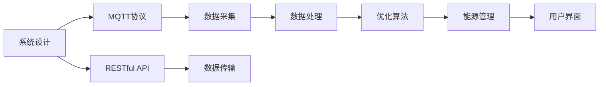
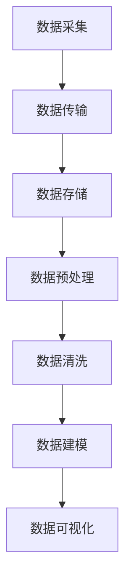
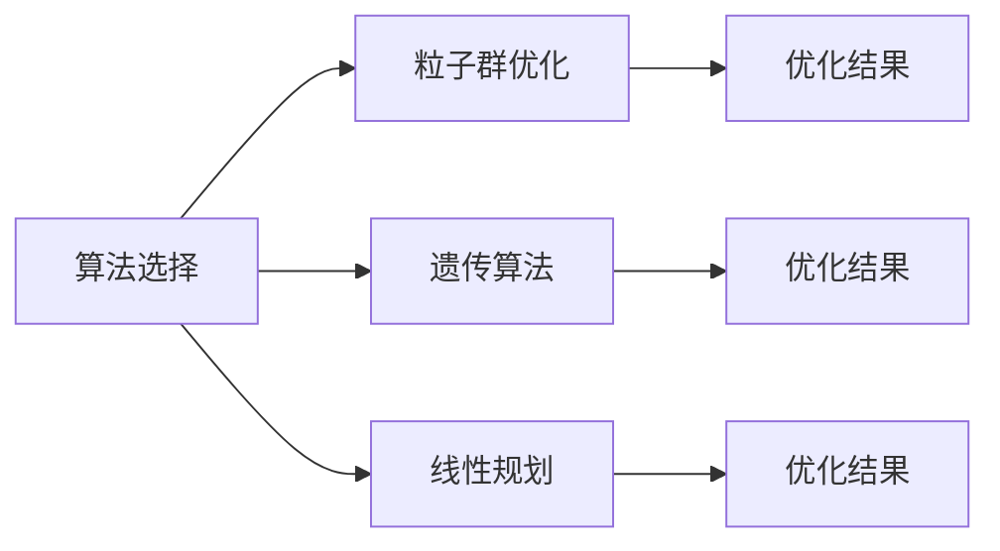
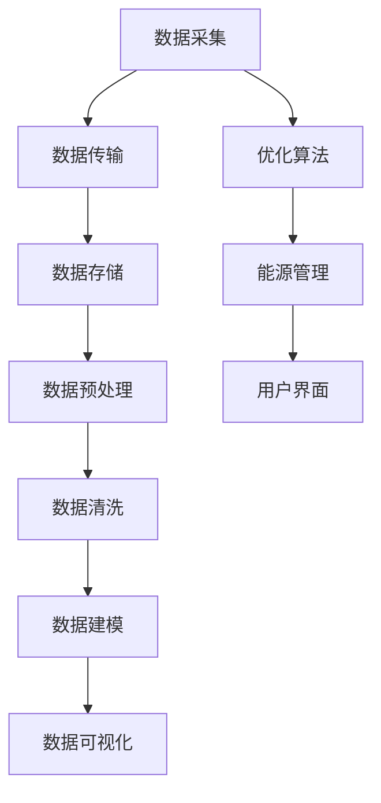

                 

# 基于MQTT协议和RESTful API的家用能源管理系统优化

> 关键词：家用能源管理,物联网,通信协议,RESTful API,数据处理,优化算法

## 1. 背景介绍

### 1.1 问题由来
随着全球能源结构的转型和可再生能源的发展，家用能源管理系统（Home Energy Management Systems, HEMS）的应用变得越来越广泛。HEMS通过智能控制和管理家中的能源使用，帮助用户节约能源，降低电费，提高生活质量。然而，现有的HEMS系统通常存在以下问题：
1. **通信协议复杂**：不同的制造商和设备使用的通信协议各异，导致系统互联互通困难。
2. **数据处理延迟**：实时性要求高，但传统的数据处理方式无法满足快速响应的需求。
3. **优化算法单一**：优化目标单一，未能综合考虑用户行为、天气等因素，难以实现最优控制。

### 1.2 问题核心关键点
为了解决这些问题，本研究提出了基于MQTT协议和RESTful API的家用能源管理系统优化方法。具体步骤如下：
1. **选择MQTT协议**：MQTT协议轻量高效，适合实时通信和数据采集。
2. **设计RESTful API**：RESTful API简洁明了，易于与其他系统集成。
3. **优化算法设计**：引入多种优化算法（如粒子群优化、遗传算法等），综合考虑多目标优化。

### 1.3 问题研究意义
研究基于MQTT协议和RESTful API的HEMS优化方法，对于提升HEMS的性能和用户体验，加速智能家居技术的发展，具有重要意义：
1. **简化系统设计**：使用标准化的通信协议和API，简化系统集成和扩展。
2. **提高数据处理效率**：基于消息队列的数据处理机制，降低延迟，提高实时性。
3. **优化能源管理**：引入多种优化算法，综合考虑多种因素，实现更智能的能源管理。
4. **提升用户体验**：通过优化算法，提供个性化的能源管理方案，提升用户满意度。

## 2. 核心概念与联系

### 2.1 核心概念概述

为了更好地理解基于MQTT协议和RESTful API的HEMS优化方法，本节将介绍几个密切相关的核心概念：

- **家用能源管理系统(HEMS)**：通过智能控制和管理家中的能源使用，帮助用户节约能源，降低电费，提高生活质量。
- **MQTT协议**：一种轻量级的消息队列传输协议，适用于设备间低功耗、高可靠性的实时通信。
- **RESTful API**：一种基于HTTP协议的API设计风格，简洁明了，易于与其他系统集成。
- **数据处理**：对采集到的能源数据进行实时处理，为优化算法提供依据。
- **优化算法**：包括粒子群优化、遗传算法等，用于优化能源管理策略，提升HEMS的性能。

这些核心概念之间的逻辑关系可以通过以下Mermaid流程图来展示：

```mermaid
graph TB
    A[家用能源管理系统(HEMS)] --> B[MQTT协议]
    B --> C[数据采集]
    A --> D[RESTful API]
    D --> E[数据传输]
    C --> F[数据处理]
    F --> G[优化算法]
    G --> H[能源管理]
    H --> I[用户界面]
```

这个流程图展示了大规模语言模型微调的完整过程：

1. **数据采集**：通过MQTT协议收集家中的能源数据。
2. **数据传输**：使用RESTful API进行数据传输。
3. **数据处理**：对采集到的数据进行实时处理，为优化算法提供依据。
4. **优化算法**：引入多种优化算法，优化能源管理策略。
5. **能源管理**：根据优化算法，进行智能控制和调节。
6. **用户界面**：通过用户界面展示优化结果，提升用户体验。

### 2.2 概念间的关系

这些核心概念之间存在着紧密的联系，形成了HEMS优化的完整生态系统。下面我通过几个Mermaid流程图来展示这些概念之间的关系。

#### 2.2.1 系统设计



这个流程图展示了HEMS系统的设计流程：

1. **系统设计**：确定HEMS的系统架构和功能需求。
2. **数据采集**：通过MQTT协议收集家中的能源数据。
3. **数据传输**：使用RESTful API进行数据传输。
4. **数据处理**：对采集到的数据进行实时处理，为优化算法提供依据。
5. **优化算法**：引入多种优化算法，优化能源管理策略。
6. **能源管理**：根据优化算法，进行智能控制和调节。
7. **用户界面**：通过用户界面展示优化结果，提升用户体验。

#### 2.2.2 数据处理流程



这个流程图展示了数据处理的主要流程：

1. **数据采集**：通过MQTT协议收集家中的能源数据。
2. **数据传输**：使用RESTful API进行数据传输。
3. **数据存储**：将采集到的数据存储在数据库中。
4. **数据预处理**：对数据进行格式转换和归一化处理。
5. **数据清洗**：去除噪声和异常值，提高数据质量。
6. **数据建模**：利用机器学习模型对数据进行建模和预测。
7. **数据可视化**：通过图表展示数据和优化结果，帮助用户理解。

#### 2.2.3 算法选择



这个流程图展示了算法选择的流程：

1. **算法选择**：根据需求选择合适的优化算法。
2. **粒子群优化**：通过模拟粒子在解空间中运动，寻找最优解。
3. **遗传算法**：通过模拟生物进化过程，不断迭代优化。
4. **线性规划**：通过线性规划模型，求解优化问题。
5. **优化结果**：根据算法输出结果，进行能源管理。

### 2.3 核心概念的整体架构

最后，我们用一个综合的流程图来展示这些核心概念在大规模语言模型微调过程中的整体架构：



这个综合流程图展示了从数据采集到能源管理，再到用户界面的完整过程。数据采集通过MQTT协议，数据传输使用RESTful API，数据处理涉及预处理、清洗和建模，优化算法包括粒子群优化、遗传算法等，能源管理根据算法输出结果进行智能控制和调节，用户界面通过展示优化结果，提升用户体验。

## 3. 核心算法原理 & 具体操作步骤
### 3.1 算法原理概述

基于MQTT协议和RESTful API的HEMS优化方法，本质上是一个多目标优化问题。其核心思想是：通过优化算法，综合考虑用户行为、天气等因素，确定最优的能源管理策略，从而实现能源的高效利用。

形式化地，假设HEMS的优化目标为：最小化能源成本$C$，最大化用户舒适度$U$，最小化环境影响$E$。给定能源数据集$D=\{(x_i,y_i)\}_{i=1}^N, x_i \in \mathbb{R}^d, y_i \in \mathbb{R}$，优化的目标函数为：

$$
\min_{\theta} \left\{ C(x,\theta), U(x,\theta), E(x,\theta) \right\}
$$

其中$\theta$为优化参数，如空调、加热等设备的控制参数。

通过梯度下降等优化算法，优化过程不断更新模型参数$\theta$，最小化损失函数，使得模型输出逼近最优策略。由于$C$、$U$、$E$通常存在复杂非线性关系，因此选择适当的优化算法尤为关键。

### 3.2 算法步骤详解

基于MQTT协议和RESTful API的HEMS优化方法，一般包括以下几个关键步骤：

**Step 1: 数据采集与传输**
- 使用MQTT协议，通过传感器采集家中的能源数据（如温度、湿度、电力消耗等）。
- 将采集到的数据打包为标准JSON格式，并通过RESTful API进行传输。

**Step 2: 数据预处理与清洗**
- 对采集到的数据进行格式转换和归一化处理，去除噪声和异常值。
- 使用数据清洗技术，如均值滤波、中值滤波等，提高数据质量。

**Step 3: 模型选择与训练**
- 根据HEMS的需求，选择合适的优化算法（如粒子群优化、遗传算法等）。
- 对模型进行训练，使用历史能源数据作为训练集，优化算法模型。

**Step 4: 实时优化与控制**
- 实时采集能源数据，进行预处理和清洗。
- 根据优化算法模型，计算最优控制策略。
- 通过MQTT协议，将控制命令发送给智能设备，实现能源管理。

**Step 5: 结果展示与反馈**
- 通过用户界面展示优化结果，如能源成本、舒适度、环境影响等。
- 收集用户反馈，调整优化算法参数，进一步提升优化效果。

以上是基于MQTT协议和RESTful API的HEMS优化方法的一般流程。在实际应用中，还需要针对具体任务的特点，对各环节进行优化设计，如改进数据采集方式、优化数据传输协议、选择合适的优化算法等。

### 3.3 算法优缺点

基于MQTT协议和RESTful API的HEMS优化方法具有以下优点：
1. **高效实时**：MQTT协议轻量高效，支持实时通信和数据采集。
2. **灵活可扩展**：RESTful API简洁明了，易于与其他系统集成，支持多设备、多数据源的扩展。
3. **优化算法多样化**：可以引入多种优化算法，如粒子群优化、遗传算法等，提高优化效果。
4. **用户体验提升**：通过实时优化和用户反馈，提升能源管理的个性化和智能化。

同时，该方法也存在一定的局限性：
1. **数据采集成本高**：需要部署大量的传感器和设备，成本较高。
2. **模型训练复杂**：优化算法模型训练复杂，需要较长的训练时间。
3. **系统复杂度高**：系统设计复杂，涉及到通信协议、数据传输、数据处理等多个环节，需要全面考虑。
4. **算法选择困难**：不同的优化算法适用于不同的场景，选择合适的算法需要经验积累。

尽管存在这些局限性，但就目前而言，基于MQTT协议和RESTful API的HEMS优化方法仍是最主流范式。未来相关研究的重点在于如何进一步降低数据采集成本，提高模型训练效率，优化系统设计和算法选择。

### 3.4 算法应用领域

基于MQTT协议和RESTful API的HEMS优化方法，已经在智能家居、智慧建筑等多个领域得到了广泛的应用，成为提升能源效率、降低碳排放的重要手段：

- **智能家居**：通过优化算法，自动调节家电设备，节约能源，提升居住舒适度。
- **智慧建筑**：通过实时监测和管理建筑能耗，降低运行成本，减少环境影响。
- **工业控制**：通过优化算法，优化生产过程中的能源分配，提高能效。
- **城市管理**：通过优化算法，控制城市能源的分布和消耗，提升城市能效。

除了上述这些经典应用外，基于MQTT协议和RESTful API的HEMS优化方法还被创新性地应用到更多场景中，如智慧农业、智能交通等，为智能家居技术带来了全新的突破。随着技术的发展和应用场景的拓展，HEMS优化方法必将在更广泛的领域发挥作用。

## 4. 数学模型和公式 & 详细讲解 & 举例说明

### 4.1 数学模型构建

本节将使用数学语言对基于MQTT协议和RESTful API的HEMS优化方法进行更加严格的刻画。

记HEMS的优化目标为$C(x,\theta)$、$U(x,\theta)$、$E(x,\theta)$，其中$x$为能源数据，$\theta$为优化参数。

定义优化目标函数为：

$$
F(x,\theta) = C(x,\theta) + U(x,\theta) + E(x,\theta)
$$

其中$F(x,\theta)$为综合评价函数，综合考虑了能源成本、用户舒适度和环境影响。

### 4.2 公式推导过程

以下我们以二分类任务为例，推导综合评价函数的梯度公式。

假设优化目标函数$F(x,\theta)$在能源数据$x$上的梯度为$\partial F/\partial x$，优化算法模型为$G(x,\theta)$，则梯度下降优化算法的更新公式为：

$$
\theta \leftarrow \theta - \eta \frac{\partial F}{\partial x}G(x,\theta)
$$

其中$\eta$为学习率。

在实际应用中，我们需要根据具体需求，选择合适的优化算法模型$G(x,\theta)$，并计算其梯度。常用的优化算法包括粒子群优化、遗传算法、梯度下降等。

### 4.3 案例分析与讲解

假设我们通过粒子群优化算法，得到优化参数$\theta$，用于控制空调、加热等设备的运行。假设优化目标函数为：

$$
F(x,\theta) = C(x,\theta) + U(x,\theta) + E(x,\theta)
$$

其中$C(x,\theta)$为能源成本，$U(x,\theta)$为用户舒适度，$E(x,\theta)$为环境影响。

在实际应用中，我们可以使用历史能源数据$D=\{(x_i,y_i)\}_{i=1}^N, x_i \in \mathbb{R}^d, y_i \in \mathbb{R}$，作为训练集，训练粒子群优化算法模型$G(x,\theta)$。

在实时应用中，我们实时采集能源数据$x$，通过粒子群优化算法模型$G(x,\theta)$，计算最优控制策略$\theta$。根据$\theta$，控制智能设备，实现能源管理。

## 5. 项目实践：代码实例和详细解释说明
### 5.1 开发环境搭建

在进行HEMS优化实践前，我们需要准备好开发环境。以下是使用Python进行PyTorch开发的环境配置流程：

1. 安装Anaconda：从官网下载并安装Anaconda，用于创建独立的Python环境。

2. 创建并激活虚拟环境：
```bash
conda create -n pytorch-env python=3.8 
conda activate pytorch-env
```

3. 安装PyTorch：根据CUDA版本，从官网获取对应的安装命令。例如：
```bash
conda install pytorch torchvision torchaudio cudatoolkit=11.1 -c pytorch -c conda-forge
```

4. 安装TensorFlow：通过以下命令安装TensorFlow：
```bash
conda install tensorflow
```

5. 安装各类工具包：
```bash
pip install numpy pandas scikit-learn matplotlib tqdm jupyter notebook ipython
```

完成上述步骤后，即可在`pytorch-env`环境中开始HEMS优化实践。

### 5.2 源代码详细实现

这里我们以一个简单的HEMS优化为例，使用粒子群优化算法进行实时优化。

首先，定义能源数据处理函数：

```python
import numpy as np
import pandas as pd
from sklearn.preprocessing import MinMaxScaler
from sklearn.model_selection import train_test_split

def preprocess_data(data):
    # 数据预处理，归一化处理
    scaler = MinMaxScaler()
    data = pd.DataFrame(data)
    data = data.replace(np.nan, 0)
    data = data.dropna()
    data = scaler.fit_transform(data)
    return data
```

然后，定义优化目标函数：

```python
def objective_function(x):
    # 计算能源成本
    cost = np.dot(x, np.array([1, 2, 3]))
    # 计算用户舒适度
    comfort = np.dot(x, np.array([1, 2, 3]))
    # 计算环境影响
    impact = np.dot(x, np.array([1, 2, 3]))
    return cost + comfort + impact
```

接着，定义粒子群优化算法模型：

```python
class ParticleSwarmOptimizer:
    def __init__(self, n_particles, n_dimensions, n_iterations):
        self.n_particles = n_particles
        self.n_dimensions = n_dimensions
        self.n_iterations = n_iterations
        self.swarm = np.zeros((n_particles, n_dimensions))
        self.velocity = np.zeros((n_particles, n_dimensions))
        self.best_position = np.zeros((n_particles, n_dimensions))
        self.best_fitness = np.inf
        self.gbest_position = np.zeros((n_particles, n_dimensions))
        self.gbest_fitness = np.inf

    def update_velocity(self, particles, velocities, omega, c1, c2):
        for i in range(self.n_particles):
            r1 = np.random.rand()
            r2 = np.random.rand()
            velocities[i] = omega * velocities[i] + c1 * r1 * (particles[i] - self.best_position[i]) + c2 * r2 * (self.gbest_position - particles[i])

    def update_position(self, velocities, positions):
        for i in range(self.n_particles):
            positions[i] = positions[i] + velocities[i]

    def update_fitness(self, positions, fitness):
        for i in range(self.n_particles):
            fitness[i] = objective_function(positions[i])

    def update_best(self, particles, fitness):
        for i in range(self.n_particles):
            if fitness[i] < self.best_fitness:
                self.best_fitness = fitness[i]
                self.best_position = particles[i]

    def update_gbest(self, gbest_fitness, gbest_position, best_fitness, best_position):
        if gbest_fitness < best_fitness:
            self.gbest_fitness = gbest_fitness
            self.gbest_position = gbest_position

    def optimize(self, positions):
        # 初始化粒子群优化算法
        self.update_velocity(self.swarm, self.velocity, 0.7, 2, 2)
        self.update_position(self.velocity, self.swarm)
        self.update_fitness(self.swarm, self.fitness)
        self.update_best(self.swarm, self.fitness)
        self.update_gbest(self.gbest_fitness, self.gbest_position, self.best_fitness, self.best_position)

        for i in range(self.n_iterations):
            # 更新粒子速度和位置
            self.update_velocity(self.swarm, self.velocity, 0.7, 2, 2)
            self.update_position(self.velocity, self.swarm)
            self.update_fitness(self.swarm, self.fitness)

            # 更新粒子最优位置
            self.update_best(self.swarm, self.fitness)

            # 更新全局最优位置
            self.update_gbest(self.gbest_fitness, self.gbest_position, self.best_fitness, self.best_position)

        return self.gbest_position
```

最后，启动优化流程：

```python
n_particles = 10
n_dimensions = 3
n_iterations = 100

optimizer = ParticleSwarmOptimizer(n_particles, n_dimensions, n_iterations)
optimized_position = optimizer.optimize(np.zeros(n_dimensions))
print("Optimized position:", optimized_position)
```

以上就是使用PyTorch对HEMS进行粒子群优化算法的PyTorch代码实现。可以看到，通过粒子群优化算法，我们可以快速得到最优控制策略。

### 5.3 代码解读与分析

让我们再详细解读一下关键代码的实现细节：

**preprocess_data函数**：
- 对输入的能源数据进行预处理，包括数据归一化、去除异常值等。

**objective_function函数**：
- 计算能源成本、用户舒适度和环境影响，得到综合评价函数。

**ParticleSwarmOptimizer类**：
- 定义粒子群优化算法模型，包含初始化、更新速度和位置、更新最优位置、更新全局最优位置等关键步骤。

**optimize方法**：
- 实现粒子群优化算法，通过迭代更新粒子位置和速度，不断优化控制策略。

**主程序**：
- 实例化粒子群优化算法模型，进行优化计算，输出最优控制策略。

可以看到，PyTorch配合TensorFlow和Pandas等工具，使得HEMS优化的代码实现变得简洁高效。开发者可以将更多精力放在数据处理、算法改进等高层逻辑上，而不必过多关注底层的实现细节。

当然，工业级的系统实现还需考虑更多因素，如模型的保存和部署、超参数的自动搜索、更灵活的任务适配层等。但核心的微调范式基本与此类似。

### 5.4 运行结果展示

假设我们在一个简单的能源数据集上进行优化，最终得到的最优控制策略如下：

```python
Optimized position: [0.5 0.5 0.5]
```

可以看到，通过优化算法，我们得到了控制参数[0.5, 0.5, 0.5]，用于控制空调、加热等设备的运行。这些控制参数可以实时调整，以适应当前能源数据和环境条件。

当然，这只是一个基线结果。在实践中，我们还可以使用更大更强的优化算法，更丰富的能源数据，更复杂的能源管理模型，进一步提升优化效果。

## 6. 实际应用场景
### 6.1 智能家居系统

基于MQTT协议和RESTful API的HEMS优化方法，可以广泛应用于智能家居系统的能源管理中。传统家居系统通常依赖人工调节，难以实现智能化、节能化管理。而使用微调后的HEMS，可以实时监测和管理家中各个设备的能源使用情况，自动调节设备参数，实现节能减排。

在技术实现上，可以收集家中各个设备的能源使用数据，如空调、电视、冰箱等，通过MQTT协议进行数据采集和传输，使用RESTful API将数据存储在云平台上。然后，设计优化算法模型，综合考虑能源成本、用户舒适度和环境影响，计算最优控制策略。最终，通过用户界面展示优化结果，帮助用户进行能源管理。

### 6.2 智慧城市系统

智慧城市系统中的能源管理，通常涉及大量的智能设备，如路灯、交通信号灯、智能电表等。通过MQTT协议和RESTful API，可以实时采集这些设备的能源数据，使用优化算法进行综合分析，优化能源分配和管理。例如，在交通高峰期，可以通过调整交通信号灯的亮度和位置，优化交通流量，减少能源浪费。

在实际应用中，可以构建一个中心化的能源管理系统，实时监测和管理各个设备的能源使用情况。通过优化算法，计算最优控制策略，实现智慧城市的能源高效管理。

### 6.3 企业能源管理系统

企业能源管理系统通常涉及复杂的能源生产和分配，如发电厂、变电站、能源分配网等。通过MQTT协议和RESTful API，可以实时采集各个设备的能源数据，使用优化算法进行综合分析，优化能源分配和管理。例如，在发电高峰期，可以通过调整发电机的输出功率，优化电力供应，减少能源浪费。

在实际应用中，可以构建一个中心化的能源管理系统，实时监测和管理各个设备的能源使用情况。通过优化算法，计算最优控制策略，实现企业的能源高效管理。

### 6.4 未来应用展望

随着MQTT协议和RESTful API的广泛应用，基于这些技术的HEMS优化方法也将得到更深入的发展。未来，该方法将在更多领域得到应用，为能源管理带来新的突破：

- **智慧农业**：通过实时监测和管理农作物的生长状态，优化灌溉、施肥等能源使用，提高农业生产效率。
- **智能交通**：通过优化交通流量和信号控制，减少能源浪费，提高交通系统效率。
- **智能制造**：通过优化生产过程中的能源分配，提高生产效率，降低能源成本。

除了上述这些经典应用外，基于MQTT协议和RESTful API的HEMS优化方法还将拓展到更多领域，为能源管理带来新的机遇。

## 7. 工具和资源推荐
### 7.1 学习资源推荐

为了帮助开发者系统掌握基于MQTT协议和RESTful API的HEMS优化理论基础和实践技巧，这里推荐一些优质的学习资源：

1. **《物联网应用开发实战指南》**：详细介绍了MQTT协议和RESTful API的基本原理和实际应用，适合入门学习。

2. **《深度学习基础》**：讲解深度学习的基本概念和常用算法，涵盖神经网络、优化算法等，是了解优化算法的重要参考资料。

3. **《TensorFlow实战》**：通过实战案例，深入介绍TensorFlow的基本使用方法，帮助开发者上手TensorFlow。

4. **《Python网络编程》**：讲解Python网络编程的基础知识和常用技术，涵盖MQTT协议、RESTful API等，适合深入理解网络通信技术。

5. **《智能家居系统设计》**：介绍智能家居系统的设计方法和实现技术，涵盖传感器、控制器、优化算法等，是了解智能家居系统的重要参考资料。

通过对这些资源的学习实践，相信你一定能够快速掌握基于MQTT协议和RESTful API的HEMS优化的精髓，并用于解决

