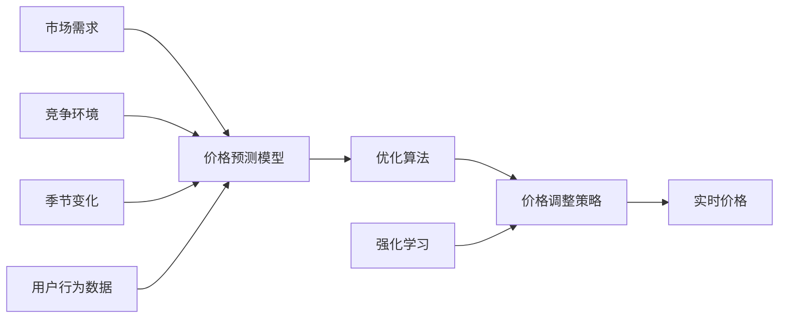
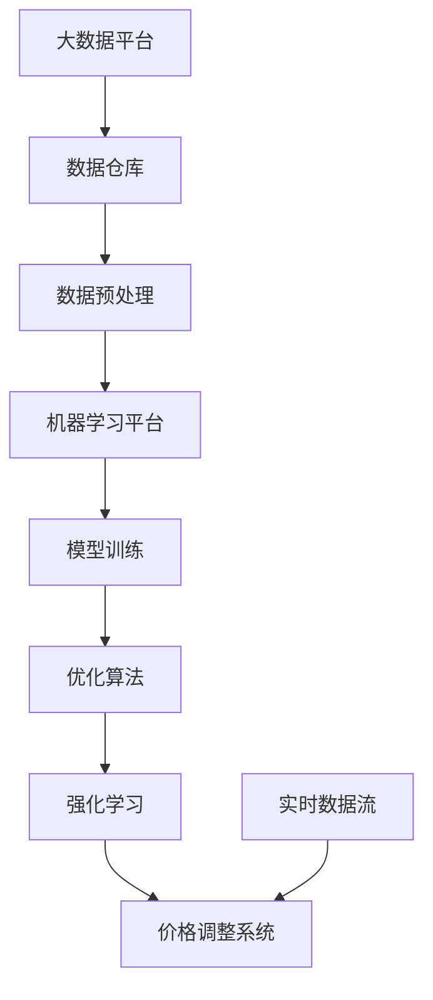

                 

## 1. 背景介绍

### 1.1 问题由来

在现代商业竞争中，企业需要不断调整其产品和服务的价格以适应市场需求和竞争环境。动态定价策略（Dynamic Pricing Strategy）是一种重要的定价方法，它能够根据市场需求、竞争对手价格、产品供给、客户行为等多种因素实时调整价格，实现收入最大化。传统的定价模型和策略难以满足实时性和动态性的需求，而人工智能（AI）技术的引入则带来了新的希望。

### 1.2 问题核心关键点

动态定价的核心在于通过数据分析和机器学习算法，对市场动态进行实时监测和预测，从而制定和调整价格策略。AI在这方面的应用主要体现在以下几个方面：

1. **数据处理与分析**：利用大数据技术，收集和处理海量市场数据，提取有用的特征信息。
2. **预测建模**：通过机器学习算法构建价格预测模型，预测未来的价格变化趋势。
3. **决策优化**：利用优化算法，根据预测结果和业务目标，制定最优的价格策略。
4. **实时调整**：根据实时市场数据，自动调整价格，适应市场变化。
5. **客户行为分析**：通过用户行为数据，识别价格敏感度和购买意愿，优化定价策略。

这些核心关键点构成了动态定价策略的AI实现基础，使得企业能够灵活应对市场变化，提升整体竞争力。

### 1.3 问题研究意义

研究动态定价策略的AI实现，对于提升企业盈利能力和市场响应速度具有重要意义：

1. **提高利润**：通过实时调整价格，企业可以更有效地利用市场资源，提高收入和利润。
2. **应对竞争**：动态定价策略可以帮助企业快速响应市场变化，保持价格优势。
3. **优化库存**：通过分析市场需求，企业可以更好地管理库存，减少积压和缺货。
4. **增强客户黏性**：灵活的价格策略可以提升客户满意度和忠诚度，促进复购。
5. **数据驱动决策**：AI技术使企业能够基于数据而非直觉进行决策，提高决策的科学性和准确性。

## 2. 核心概念与联系

### 2.1 核心概念概述

在动态定价策略的AI实现中，涉及以下核心概念：

- **动态定价**：根据市场需求、竞争环境、季节变化等因素，实时调整产品和服务的价格。
- **机器学习（ML）**：通过算法对数据进行分析和学习，构建预测模型。
- **优化算法**：寻找最优解的算法，如遗传算法、线性规划等。
- **强化学习（RL）**：通过奖励机制，优化定价策略，实现长期收益最大化。
- **深度学习（DL）**：使用神经网络进行复杂数据的处理和预测。

这些概念相互关联，共同构成了一个动态定价策略的AI实现框架。

### 2.2 概念间的关系

动态定价策略的AI实现框架可以通过以下Mermaid流程图来展示：



这个流程图展示了动态定价策略的AI实现过程中各个环节的关联关系：

1. 市场需求、竞争环境和季节变化作为输入数据，被用于构建价格预测模型。
2. 用户行为数据可以进一步丰富预测模型的输入。
3. 预测模型通过优化算法和强化学习算法，得到最优的价格调整策略。
4. 根据价格调整策略，实时调整价格，实现动态定价。

### 2.3 核心概念的整体架构

最后，我们用一个综合的流程图来展示这些核心概念在大规模动态定价策略中的整体架构：



这个综合流程图展示了从数据采集、处理、模型训练到价格调整的完整流程。其中，大数据平台和数据仓库用于数据的存储和管理；数据预处理和机器学习平台用于模型的构建和训练；优化算法和强化学习用于价格调整策略的优化；实时数据流用于实时数据处理和价格调整。

## 3. 核心算法原理 & 具体操作步骤

### 3.1 算法原理概述

动态定价策略的AI实现原理可以概括为以下几个步骤：

1. **数据采集与处理**：从各种渠道（如电商、社交媒体、供应链系统等）收集市场数据。
2. **特征工程**：对原始数据进行清洗、转换和选择，提取有用的特征。
3. **模型构建**：构建机器学习模型，用于预测市场需求、价格变化趋势等。
4. **策略优化**：利用优化算法和强化学习算法，制定最优的价格调整策略。
5. **实时调整**：根据实时市场数据，自动调整价格。

### 3.2 算法步骤详解

动态定价策略的AI实现步骤可以进一步细化为以下几级目录：

#### 3.2.1 数据采集与处理

数据采集与处理是动态定价的基础。在这一阶段，主要包括以下几个步骤：

- **数据来源**：确定数据来源，包括电商交易记录、用户反馈、社交媒体互动等。
- **数据清洗**：去除缺失、异常和重复的数据，确保数据质量。
- **数据转换**：将原始数据转换为模型所需的格式，如时间序列、向量等。
- **特征工程**：提取和构建特征，如用户历史购买记录、季节性趋势、竞争对手价格等。

#### 3.2.2 特征工程与模型构建

这一阶段的目标是构建能够准确预测市场变化和价格趋势的模型。主要步骤如下：

- **特征选择**：选择对价格预测有影响的特征。
- **特征变换**：对特征进行归一化、标准化等处理，提高模型性能。
- **模型选择**：选择合适的机器学习模型，如线性回归、随机森林、深度神经网络等。
- **模型训练**：利用历史数据训练模型，调整参数，优化模型性能。

#### 3.2.3 策略优化与实时调整

策略优化和实时调整是动态定价策略的核心。主要步骤如下：

- **策略制定**：根据模型预测结果和业务目标，制定价格调整策略。
- **优化算法**：使用遗传算法、线性规划等优化算法，寻找最优策略。
- **强化学习**：通过奖励机制，持续优化价格调整策略，实现长期收益最大化。
- **实时调整**：根据实时市场数据，自动调整价格，适应市场变化。

### 3.3 算法优缺点

动态定价策略的AI实现具有以下优点：

1. **实时性**：能够实时监测市场变化，快速调整价格，提高市场响应速度。
2. **灵活性**：可以根据不同的市场情况和业务目标，灵活调整定价策略。
3. **准确性**：利用机器学习模型，能够更准确地预测市场需求和价格变化。

同时，动态定价策略的AI实现也存在一些缺点：

1. **复杂性**：需要处理大量的数据和复杂的算法，对技术要求较高。
2. **数据依赖**：模型的预测和优化依赖于高质量的数据，数据不足或偏差会影响效果。
3. **模型复杂度**：深度学习等高级模型的构建和训练需要大量计算资源，成本较高。
4. **模型鲁棒性**：模型可能会对异常数据和噪声敏感，需要采取措施提高鲁棒性。

### 3.4 算法应用领域

动态定价策略的AI实现主要应用于以下几个领域：

1. **电商零售**：通过动态定价提升销售量和利润率。
2. **航空和旅游**：根据市场需求和竞争对手价格，调整机票和酒店价格。
3. **物流与供应链**：优化库存管理和运输成本，提高供应链效率。
4. **金融服务**：根据市场变化和用户行为，调整贷款利率和保险价格。
5. **能源与公共事业**：优化能源价格和公共服务收费，提升用户体验。
6. **医疗健康**：根据患者需求和医疗资源，调整医疗服务价格。

## 4. 数学模型和公式 & 详细讲解 & 举例说明

### 4.1 数学模型构建

动态定价策略的AI实现可以采用以下数学模型：

- **线性回归模型**：预测市场需求和价格变化趋势。
- **随机森林模型**：构建特征选择和数据处理模型。
- **深度神经网络模型**：用于复杂的市场预测和特征提取。

以线性回归模型为例，其数学模型可以表示为：

$$ y = \beta_0 + \sum_{i=1}^n \beta_i x_i + \epsilon $$

其中，$y$为价格预测值，$\beta_0$为截距，$\beta_i$为特征系数，$x_i$为特征值，$\epsilon$为误差项。

### 4.2 公式推导过程

线性回归模型的推导过程如下：

- **样本均值**：计算样本的均值和方差，$\overline{x} = \frac{1}{n} \sum_{i=1}^n x_i$，$\overline{y} = \frac{1}{n} \sum_{i=1}^n y_i$。
- **协方差**：计算$x_i$和$y$的协方差，$Cov(x_i, y) = \frac{1}{n-1} \sum_{i=1}^n (x_i - \overline{x})(y_i - \overline{y})$。
- **相关系数**：计算$x_i$和$y$的相关系数，$\rho = \frac{Cov(x_i, y)}{\sigma_x \sigma_y}$。
- **回归系数**：计算回归系数$\beta_i$，$\beta_i = \frac{Cov(x_i, y)}{\sigma_x^2}$。

### 4.3 案例分析与讲解

假设我们利用线性回归模型对电商产品的销售量和价格进行预测，构建价格调整策略。具体步骤如下：

- **数据采集**：从电商平台获取历史销售数据和价格数据。
- **特征选择**：选择影响销售量的因素，如广告投入、季节性趋势、竞争对手价格等。
- **模型构建**：利用线性回归模型，构建价格预测模型。
- **策略优化**：使用优化算法和强化学习算法，制定最优的价格调整策略。
- **实时调整**：根据实时销售数据，自动调整价格。

## 5. 项目实践：代码实例和详细解释说明

### 5.1 开发环境搭建

在进行动态定价策略的AI实现项目开发时，需要搭建相应的开发环境。以下是Python开发环境的配置步骤：

1. **安装Python**：从官网下载并安装Python，建议安装3.7或更高版本。
2. **安装虚拟环境**：使用`pip install virtualenv`命令创建虚拟环境。
3. **激活虚拟环境**：使用`python -m venv venv`命令创建虚拟环境，并使用`source venv/bin/activate`命令激活。
4. **安装相关库**：使用`pip install pandas numpy scikit-learn pytorch torchvision transformers`命令安装必要的库。

### 5.2 源代码详细实现

以下是一个基于TensorFlow和Keras实现的动态定价策略的Python代码示例。

```python
import tensorflow as tf
from tensorflow.keras.models import Sequential
from tensorflow.keras.layers import Dense
from tensorflow.keras.optimizers import Adam

# 定义模型
model = Sequential()
model.add(Dense(64, input_dim=4, activation='relu'))
model.add(Dense(1, activation='linear'))

# 编译模型
model.compile(loss='mse', optimizer=Adam(lr=0.01))

# 训练模型
model.fit(X_train, y_train, epochs=50, batch_size=32)

# 使用模型进行价格预测
y_pred = model.predict(X_test)
```

### 5.3 代码解读与分析

上述代码中，我们首先定义了一个包含两个全连接层的神经网络模型，使用ReLU激活函数和线性激活函数。然后，我们使用`fit`函数对模型进行训练，`X_train`和`y_train`分别为训练数据和标签。最后，我们使用`predict`函数对测试数据进行价格预测。

## 6. 实际应用场景

### 6.1 电商零售

电商零售是动态定价策略的重要应用场景之一。通过实时监测用户行为和市场需求，电商平台可以动态调整商品价格，提升销售量和利润率。例如，亚马逊利用动态定价策略，根据用户的历史购买行为和实时市场数据，自动调整商品价格，优化库存管理。

### 6.2 航空和旅游

航空和旅游行业也广泛应用动态定价策略。航空公司根据市场需求和竞争对手价格，调整机票价格。例如，美国航空公司利用动态定价策略，根据用户预订时间、目的地、季节等因素，实时调整机票价格，优化运营效率。

### 6.3 物流与供应链

物流与供应链行业同样需要动态定价策略。通过实时调整运输价格和库存管理，物流公司可以提升供应链效率，降低成本。例如，UPS利用动态定价策略，根据需求量和运输距离，实时调整运输价格，优化资源分配。

### 6.4 未来应用展望

未来，动态定价策略的AI实现将更加广泛地应用于各行各业，带来更多创新和价值。以下是一些可能的应用场景：

- **智能合约**：利用区块链和智能合约，实现自动化的动态定价。
- **金融衍生品**：根据市场数据和用户行为，动态调整金融衍生品价格，优化投资组合。
- **医疗健康**：根据患者需求和医疗资源，调整医疗服务价格，提升用户体验。
- **农业与食品**：根据市场需求和季节变化，调整农产品价格，优化农业生产。

## 7. 工具和资源推荐

### 7.1 学习资源推荐

为了帮助开发者系统掌握动态定价策略的AI实现，这里推荐一些优质的学习资源：

1. **《Python数据科学手册》**：一本介绍Python数据科学库（如Pandas、NumPy、Scikit-learn等）的书籍，适合初学者入门。
2. **《TensorFlow实战》**：一本介绍TensorFlow的书籍，涵盖深度学习和动态定价模型的实现。
3. **《机器学习实战》**：一本介绍机器学习算法的书籍，适合进阶学习。
4. **Kaggle竞赛**：Kaggle是一个数据科学竞赛平台，可以参与实战项目，积累经验。
5. **Coursera课程**：Coursera提供多个与动态定价策略相关的在线课程，涵盖数据科学、机器学习和优化算法等领域。

### 7.2 开发工具推荐

以下是几个用于动态定价策略的AI实现开发的常用工具：

1. **TensorFlow**：由Google开发的深度学习框架，适合构建复杂模型。
2. **Keras**：一个高级神经网络API，可以方便地构建和训练模型。
3. **PyTorch**：由Facebook开发的深度学习框架，支持动态计算图，适合研究和实验。
4. **Jupyter Notebook**：一个交互式笔记本，方便进行数据处理和模型训练。
5. **GitHub**：一个代码托管平台，方便进行版本控制和代码共享。

### 7.3 相关论文推荐

以下是几篇奠基性的相关论文，推荐阅读：

1. **《动态定价中的强化学习》**：提出使用强化学习优化动态定价策略，提高收益。
2. **《基于深度学习的动态定价模型》**：提出使用深度神经网络构建价格预测模型，提高预测准确性。
3. **《自适应动态定价策略》**：提出自适应动态定价策略，根据市场需求实时调整价格。
4. **《多渠道动态定价策略》**：提出多渠道动态定价策略，优化跨渠道销售和定价。
5. **《分布式动态定价系统》**：提出分布式动态定价系统，提升系统处理能力和实时性。

这些论文代表了大动态定价策略的AI实现的发展脉络，为进一步研究提供了重要的理论基础。

## 8. 总结：未来发展趋势与挑战

### 8.1 研究成果总结

动态定价策略的AI实现已经取得了一定的进展，在电商、航空、物流等行业得到了广泛应用。通过AI技术，企业能够更加灵活和精准地调整价格，优化资源配置，提升盈利能力。

### 8.2 未来发展趋势

未来，动态定价策略的AI实现将呈现以下几个发展趋势：

1. **更复杂模型**：使用更加复杂的模型，如深度神经网络和强化学习，提高预测准确性和优化效果。
2. **实时性提升**：通过分布式计算和流计算技术，实现更高的实时性，适应更多实时性要求的应用场景。
3. **跨领域融合**：将动态定价策略与其他领域技术（如区块链、智能合约）结合，拓展应用范围。
4. **智能合约应用**：利用区块链技术，实现自动化的动态定价，提高透明性和可信度。
5. **多渠道优化**：优化跨渠道的定价策略，提升整体销售和用户体验。

### 8.3 面临的挑战

尽管动态定价策略的AI实现已经取得了一定的进展，但仍面临一些挑战：

1. **数据质量**：高质量的数据是动态定价策略的基础，但数据的获取和处理仍然存在挑战。
2. **模型复杂度**：复杂的模型需要更多的计算资源和时间，难以快速部署。
3. **模型鲁棒性**：模型对异常数据和噪声敏感，需要采取措施提高鲁棒性。
4. **实时处理能力**：高实时性需求对计算资源和系统架构提出了更高的要求。

### 8.4 研究展望

未来的研究需要从以下几个方面进行深入探讨：

1. **数据融合**：利用多源数据，提高预测准确性和鲁棒性。
2. **模型优化**：优化模型架构和算法，提高实时性和精度。
3. **自动化部署**：实现自动化部署和优化，降低人工成本和技术门槛。
4. **跨领域应用**：探索动态定价策略在其他领域的应用，如金融、医疗等。
5. **安全与隐私**：研究数据安全和隐私保护技术，保障用户数据安全。

## 9. 附录：常见问题与解答

### Q1：动态定价策略的AI实现是否适用于所有产品和服务？

A: 动态定价策略的AI实现适用于大多数产品和服务，尤其是那些价格敏感度高、市场变化频繁的领域。但对于一些价格波动较小的产品，如生活必需品，动态定价策略的效果可能有限。

### Q2：如何选择合适的机器学习模型？

A: 选择合适的机器学习模型需要考虑数据的性质、问题的复杂度和业务需求等因素。常用的模型包括线性回归、随机森林、深度神经网络等。在实际应用中，需要根据具体场景选择最合适的模型。

### Q3：动态定价策略的AI实现需要多少数据？

A: 动态定价策略的AI实现需要足够的市场数据和用户行为数据，以便构建准确的价格预测模型。一般来说，数据量越大，模型的预测准确性越高。但在数据不足的情况下，可以使用一些数据增强和合成技术，扩充数据量。

### Q4：动态定价策略的AI实现是否需要复杂的算法？

A: 动态定价策略的AI实现需要一些复杂的算法，如优化算法和强化学习。这些算法可以帮助企业制定最优的价格调整策略，实现长期收益最大化。但同时，也需要考虑算法的复杂度和计算资源。

### Q5：动态定价策略的AI实现是否需要实时性？

A: 动态定价策略的AI实现需要实时性，以便能够及时调整价格，适应市场变化。对于实时性要求高的应用场景，可以使用分布式计算和流计算技术，提高处理能力。

---

作者：禅与计算机程序设计艺术 / Zen and the Art of Computer Programming

