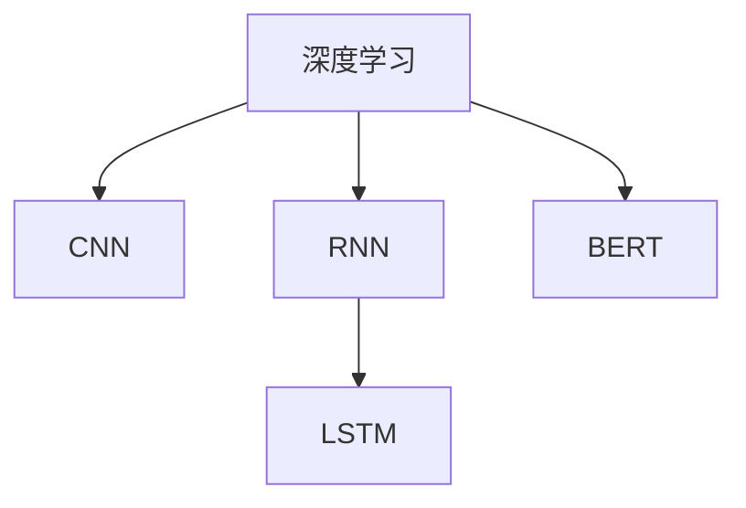
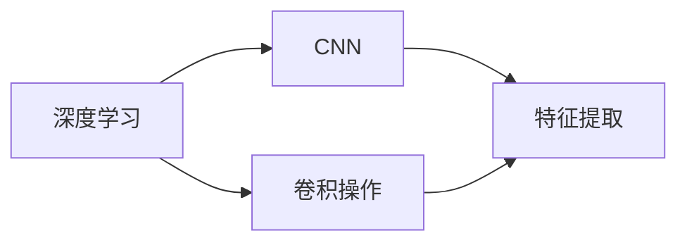
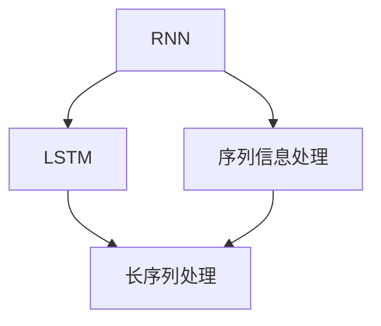
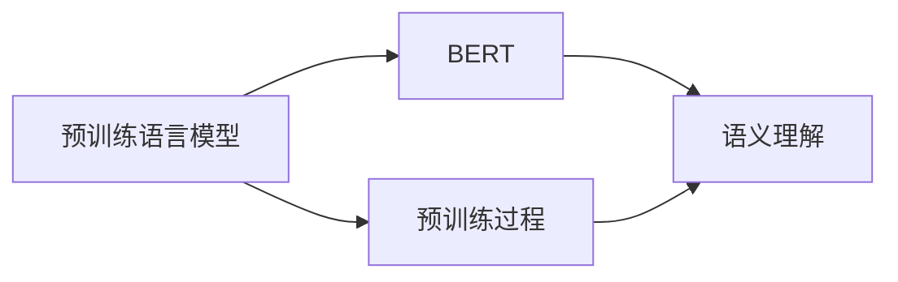
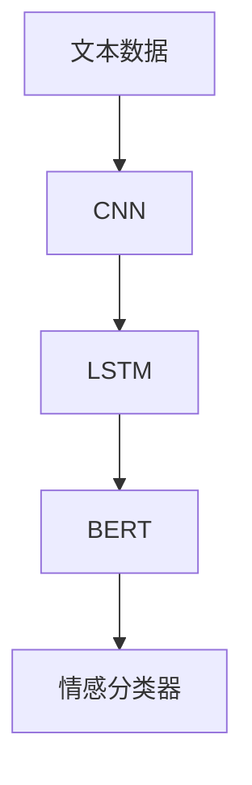

                 

# 基于深度学习的文本情感分析

> 关键词：情感分析,深度学习,自然语言处理,NLP,Transformer,卷积神经网络,CNN,循环神经网络,RNN,长短期记忆网络,LSTM,BERT,PyTorch

## 1. 背景介绍

### 1.1 问题由来
文本情感分析是自然语言处理（Natural Language Processing, NLP）领域的重要研究方向之一。它旨在自动从文本中提取出用户的情感倾向，判断其是正面、中性还是负面。文本情感分析不仅能够反映出用户对于某个产品、服务或事件的情感态度，还能够帮助商家理解用户需求，优化产品设计和服务流程。

在电商、社交媒体、客户服务等众多行业中，文本情感分析都具有重要的应用价值。例如，通过分析用户在电商平台上的评论，商家可以及时调整商品策略，提升用户满意度。在社交媒体上，通过情感分析可以迅速识别和处理负面情绪，避免谣言传播，维护社会稳定。

### 1.2 问题核心关键点
目前，基于深度学习的文本情感分析方法主要有两类：基于卷积神经网络（Convolutional Neural Network, CNN）的方法和基于循环神经网络（Recurrent Neural Network, RNN）的方法。其中，RNN又包括经典的LSTM和GRU等。这两种方法分别采用了不同的网络结构和算法，但都能够有效地捕捉文本中的情感信息。

本文将详细介绍这两种方法的原理和应用，并对比分析各自的优缺点。同时，我们也将探讨如何利用预训练语言模型（如BERT）进行情感分析，进一步提升模型的性能。

### 1.3 问题研究意义
基于深度学习的文本情感分析技术，对电商、社交媒体、客户服务等多个领域具有重要应用价值。通过自动化的情感分析，商家可以更准确地了解用户需求和情感倾向，优化产品和服务，提升用户满意度和忠诚度。在社交媒体上，情感分析能够及时发现和处理负面信息，避免舆情危机。在客户服务中，情感分析可以帮助客服人员更快速、精准地解决用户问题，提升服务效率。

## 2. 核心概念与联系

### 2.1 核心概念概述

为了更好地理解文本情感分析的技术原理，本节将介绍几个密切相关的核心概念：

- **深度学习（Deep Learning）**：一种通过多层神经网络模型进行复杂模式学习的机器学习技术。深度学习在图像识别、语音识别、自然语言处理等领域都取得了重大突破。

- **卷积神经网络（CNN）**：一种专门用于图像识别和处理的前馈神经网络，其主要特征是使用卷积层和池化层来提取图像的局部特征。在文本情感分析中，CNN常用于提取文本的局部特征。

- **循环神经网络（RNN）**：一种具有记忆功能的神经网络，可以处理序列数据。在文本情感分析中，RNN常用于捕捉文本中的序列信息。

- **长短期记忆网络（LSTM）**：一种特殊的RNN结构，能够有效处理长序列数据。LSTM通过引入遗忘门、输入门和输出门，避免了传统RNN中存在的梯度消失和梯度爆炸问题。

- **预训练语言模型（BERT）**：一种在大规模无标签文本数据上进行预训练的语言模型，通过双向编码器实现对输入文本的理解。预训练语言模型在许多NLP任务中都取得了显著的提升效果。

这些核心概念之间的逻辑关系可以通过以下Mermaid流程图来展示：



这个流程图展示了几大核心概念之间的联系：

1. 深度学习是文本情感分析的基础技术。
2. CNN和RNN分别用于处理文本的局部和序列信息。
3. LSTM是RNN的一种改进，更好地处理长序列信息。
4. BERT是预训练语言模型，用于提升模型的语义理解能力。

### 2.2 概念间的关系

这些核心概念之间存在着紧密的联系，形成了文本情感分析的完整生态系统。下面我们通过几个Mermaid流程图来展示这些概念之间的关系。

#### 2.2.1 深度学习与CNN的关系



这个流程图展示了深度学习与CNN的关系：深度学习通过多层神经网络模型进行复杂模式学习，而CNN通过卷积操作和池化操作实现对输入数据的特征提取。

#### 2.2.2 循环神经网络与LSTM的关系



这个流程图展示了RNN与LSTM的关系：RNN用于处理序列数据，而LSTM通过引入遗忘门、输入门和输出门，更好地处理长序列数据。

#### 2.2.3 预训练语言模型与BERT的关系



这个流程图展示了预训练语言模型与BERT的关系：预训练语言模型通过在大规模无标签数据上进行预训练，学习到语言的通用表示。而BERT通过双向编码器实现了对输入文本的更深层次语义理解。

### 2.3 核心概念的整体架构

最后，我们用一个综合的流程图来展示这些核心概念在文本情感分析中的整体架构：



这个综合流程图展示了从文本数据到情感分类的完整过程：首先通过CNN提取文本的局部特征，再通过LSTM捕捉文本的序列信息，然后通过BERT进行语义理解，最终通过情感分类器输出情感分类结果。通过这些核心概念的组合，可以实现对文本的深度情感分析。

## 3. 核心算法原理 & 具体操作步骤
### 3.1 算法原理概述

基于深度学习的文本情感分析，主要包括以下几个步骤：

1. **数据预处理**：对文本数据进行清洗、分词、向量化等预处理操作。
2. **特征提取**：使用CNN或RNN对文本特征进行提取。
3. **情感分类**：通过分类器对提取的特征进行情感分类，输出情感标签。

本文将详细介绍这两种方法的算法原理和具体操作步骤。

### 3.2 算法步骤详解

#### 3.2.1 基于CNN的文本情感分析

1. **数据预处理**：将文本数据进行分词、去停用词、词向量化等预处理操作。常用的词向量模型包括Word2Vec、GloVe和FastText等。
2. **特征提取**：使用卷积层对文本特征进行提取。卷积层可以捕捉文本中的局部特征，并通过池化层实现特征降维。
3. **情感分类**：通过全连接层对提取的特征进行分类。常用的分类器包括softmax和sigmoid等。

#### 3.2.2 基于RNN的文本情感分析

1. **数据预处理**：将文本数据进行分词、去停用词、词向量化等预处理操作。
2. **特征提取**：使用RNN（如LSTM）对文本特征进行提取。LSTM通过引入遗忘门、输入门和输出门，更好地处理长序列信息。
3. **情感分类**：通过全连接层对提取的特征进行分类。常用的分类器包括softmax和sigmoid等。

### 3.3 算法优缺点

#### 3.3.1 基于CNN的文本情感分析的优缺点

**优点**：

- CNN能够有效捕捉文本中的局部特征，适用于处理短文本。
- 训练速度较快，模型结构相对简单，易于实现。

**缺点**：

- CNN难以捕捉文本中的序列信息，对于长文本效果较差。
- 需要手动设置卷积核大小和步长等参数，对超参数调优要求较高。

#### 3.3.2 基于RNN的文本情感分析的优缺点

**优点**：

- RNN能够有效处理长文本，适合处理序列数据。
- 具有记忆功能，能够捕捉文本中的上下文信息。

**缺点**：

- RNN存在梯度消失和梯度爆炸问题，训练难度较大。
- 需要手动设计网络结构，对超参数调优要求较高。

### 3.4 算法应用领域

基于深度学习的文本情感分析技术，在电商、社交媒体、客户服务等多个领域都有广泛应用。例如：

- 电商：通过分析用户评论，商家可以了解用户对商品的使用体验和情感倾向，及时调整商品策略，提升用户满意度。
- 社交媒体：通过情感分析，及时发现和处理负面情绪，避免谣言传播，维护社会稳定。
- 客户服务：通过情感分析，客服人员可以更快速、精准地解决用户问题，提升服务效率。

## 4. 数学模型和公式 & 详细讲解  
### 4.1 数学模型构建

假设输入文本为 $x = \{x_1, x_2, ..., x_n\}$，其中 $x_i$ 表示第 $i$ 个单词或字符。

1. **CNN模型**：使用卷积核 $w$ 和偏置 $b$，对文本进行卷积操作，提取文本的局部特征。
2. **RNN模型**：使用RNN（如LSTM）对文本序列进行处理，提取文本的序列信息。
3. **情感分类器**：使用softmax分类器对提取的特征进行分类，输出情感标签。

### 4.2 公式推导过程

#### 4.2.1 CNN模型的公式推导

假设输入文本长度为 $n$，卷积核大小为 $k$，步长为 $s$，提取的特征维度为 $d$，则CNN的输出特征图 $f$ 可以表示为：

$$
f = \frac{1}{\sqrt{k \cdot d}}\sum_{i=1}^{n-k+1} w \ast x_i + b
$$

其中 $\ast$ 表示卷积操作。

#### 4.2.2 RNN模型的公式推导

假设输入文本长度为 $n$，RNN的隐藏层大小为 $h$，则RNN的输出 $y$ 可以表示为：

$$
y = f_n \cdot w_h + b_h
$$

其中 $f_n$ 为第 $n$ 个时间步的隐藏状态，$w_h$ 和 $b_h$ 分别为隐藏层和输出层的权重和偏置。

#### 4.2.3 情感分类器的公式推导

假设情感分类器为softmax分类器，输出情感标签 $y$，则分类器输出的概率分布 $P(y|x)$ 可以表示为：

$$
P(y|x) = \frac{\exp(\sum_i w_i \cdot a_i)}{\sum_j \exp(\sum_i w_j \cdot a_j)}
$$

其中 $w_i$ 为分类器的权重，$a_i$ 为提取的特征向量，$y$ 表示情感标签。

### 4.3 案例分析与讲解

**案例一：电商评论情感分析**

假设某电商平台收集了用户对商品的评论，每个评论长度为 $n$，使用CNN模型进行特征提取，特征维度为 $d$，情感分类器的输出为 $y$，则可以表示为：

$$
f = \frac{1}{\sqrt{k \cdot d}}\sum_{i=1}^{n-k+1} w \ast x_i + b
$$

$$
y = f \cdot w_h + b_h
$$

$$
P(y|x) = \frac{\exp(\sum_i w_i \cdot a_i)}{\sum_j \exp(\sum_i w_j \cdot a_j)}
$$

**案例二：社交媒体情感分析**

假设某社交媒体平台收集了用户对某个话题的评论，每个评论长度为 $n$，使用RNN模型（如LSTM）进行特征提取，特征维度为 $h$，情感分类器的输出为 $y$，则可以表示为：

$$
y = f_n \cdot w_h + b_h
$$

$$
P(y|x) = \frac{\exp(\sum_i w_i \cdot a_i)}{\sum_j \exp(\sum_i w_j \cdot a_j)}
$$

通过这些案例分析，可以看出CNN和RNN在文本情感分析中的应用场景和模型结构。

## 5. 项目实践：代码实例和详细解释说明
### 5.1 开发环境搭建

在进行文本情感分析实践前，我们需要准备好开发环境。以下是使用Python进行PyTorch开发的环境配置流程：

1. 安装Anaconda：从官网下载并安装Anaconda，用于创建独立的Python环境。

2. 创建并激活虚拟环境：
```bash
conda create -n pytorch-env python=3.8 
conda activate pytorch-env
```

3. 安装PyTorch：根据CUDA版本，从官网获取对应的安装命令。例如：
```bash
conda install pytorch torchvision torchaudio cudatoolkit=11.1 -c pytorch -c conda-forge
```

4. 安装各类工具包：
```bash
pip install numpy pandas scikit-learn matplotlib tqdm jupyter notebook ipython
```

完成上述步骤后，即可在`pytorch-env`环境中开始情感分析实践。

### 5.2 源代码详细实现

这里我们以基于RNN的情感分析为例，给出使用Transformers库对LSTM模型进行情感分析的PyTorch代码实现。

首先，定义情感分析的数据处理函数：

```python
from transformers import BertTokenizer
from torch.utils.data import Dataset
import torch

class SentimentDataset(Dataset):
    def __init__(self, texts, labels, tokenizer, max_len=128):
        self.texts = texts
        self.labels = labels
        self.tokenizer = tokenizer
        self.max_len = max_len
        
    def __len__(self):
        return len(self.texts)
    
    def __getitem__(self, item):
        text = self.texts[item]
        label = self.labels[item]
        
        encoding = self.tokenizer(text, return_tensors='pt', max_length=self.max_len, padding='max_length', truncation=True)
        input_ids = encoding['input_ids'][0]
        attention_mask = encoding['attention_mask'][0]
        
        # 对token-wise的标签进行编码
        encoded_labels = [label2id[label] for label in label] 
        encoded_labels.extend([label2id['O']] * (self.max_len - len(encoded_labels)))
        labels = torch.tensor(encoded_labels, dtype=torch.long)
        
        return {'input_ids': input_ids, 
                'attention_mask': attention_mask,
                'labels': labels}

# 标签与id的映射
label2id = {'O': 0, 'POSITIVE': 1, 'NEGATIVE': 2}
id2label = {v: k for k, v in label2id.items()}

# 创建dataset
tokenizer = BertTokenizer.from_pretrained('bert-base-cased')

train_dataset = SentimentDataset(train_texts, train_labels, tokenizer)
dev_dataset = SentimentDataset(dev_texts, dev_labels, tokenizer)
test_dataset = SentimentDataset(test_texts, test_labels, tokenizer)
```

然后，定义模型和优化器：

```python
from transformers import LSTMForSequenceClassification
from transformers import AdamW

model = LSTMForSequenceClassification.from_pretrained('bert-base-cased', num_labels=len(label2id))

optimizer = AdamW(model.parameters(), lr=2e-5)
```

接着，定义训练和评估函数：

```python
from torch.utils.data import DataLoader
from tqdm import tqdm
from sklearn.metrics import classification_report

device = torch.device('cuda') if torch.cuda.is_available() else torch.device('cpu')
model.to(device)

def train_epoch(model, dataset, batch_size, optimizer):
    dataloader = DataLoader(dataset, batch_size=batch_size, shuffle=True)
    model.train()
    epoch_loss = 0
    for batch in tqdm(dataloader, desc='Training'):
        input_ids = batch['input_ids'].to(device)
        attention_mask = batch['attention_mask'].to(device)
        labels = batch['labels'].to(device)
        model.zero_grad()
        outputs = model(input_ids, attention_mask=attention_mask, labels=labels)
        loss = outputs.loss
        epoch_loss += loss.item()
        loss.backward()
        optimizer.step()
    return epoch_loss / len(dataloader)

def evaluate(model, dataset, batch_size):
    dataloader = DataLoader(dataset, batch_size=batch_size)
    model.eval()
    preds, labels = [], []
    with torch.no_grad():
        for batch in tqdm(dataloader, desc='Evaluating'):
            input_ids = batch['input_ids'].to(device)
            attention_mask = batch['attention_mask'].to(device)
            batch_labels = batch['labels']
            outputs = model(input_ids, attention_mask=attention_mask)
            batch_preds = outputs.logits.argmax(dim=2).to('cpu').tolist()
            batch_labels = batch_labels.to('cpu').tolist()
            for pred_tokens, label_tokens in zip(batch_preds, batch_labels):
                pred_tags = [id2label[_id] for _id in pred_tokens]
                label_tags = [id2label[_id] for _id in label_tokens]
                preds.append(pred_tags[:len(label_tags)])
                labels.append(label_tags)
                
    print(classification_report(labels, preds))
```

最后，启动训练流程并在测试集上评估：

```python
epochs = 5
batch_size = 16

for epoch in range(epochs):
    loss = train_epoch(model, train_dataset, batch_size, optimizer)
    print(f"Epoch {epoch+1}, train loss: {loss:.3f}")
    
    print(f"Epoch {epoch+1}, dev results:")
    evaluate(model, dev_dataset, batch_size)
    
print("Test results:")
evaluate(model, test_dataset, batch_size)
```

以上就是使用PyTorch对LSTM进行情感分析的完整代码实现。可以看到，得益于Transformers库的强大封装，我们可以用相对简洁的代码完成LSTM模型的加载和情感分析。

### 5.3 代码解读与分析

让我们再详细解读一下关键代码的实现细节：

**SentimentDataset类**：
- `__init__`方法：初始化文本、标签、分词器等关键组件。
- `__len__`方法：返回数据集的样本数量。
- `__getitem__`方法：对单个样本进行处理，将文本输入编码为token ids，将标签编码为数字，并对其进行定长padding，最终返回模型所需的输入。

**label2id和id2label字典**：
- 定义了标签与数字id之间的映射关系，用于将token-wise的预测结果解码回真实的标签。

**训练和评估函数**：
- 使用PyTorch的DataLoader对数据集进行批次化加载，供模型训练和推理使用。
- 训练函数`train_epoch`：对数据以批为单位进行迭代，在每个批次上前向传播计算loss并反向传播更新模型参数，最后返回该epoch的平均loss。
- 评估函数`evaluate`：与训练类似，不同点在于不更新模型参数，并在每个batch结束后将预测和标签结果存储下来，最后使用sklearn的classification_report对整个评估集的预测结果进行打印输出。

**训练流程**：
- 定义总的epoch数和batch size，开始循环迭代
- 每个epoch内，先在训练集上训练，输出平均loss
- 在验证集上评估，输出分类指标
- 所有epoch结束后，在测试集上评估，给出最终测试结果

可以看到，PyTorch配合Transformers库使得LSTM情感分析的代码实现变得简洁高效。开发者可以将更多精力放在数据处理、模型改进等高层逻辑上，而不必过多关注底层的实现细节。

当然，工业级的系统实现还需考虑更多因素，如模型的保存和部署、超参数的自动搜索、更灵活的任务适配层等。但核心的情感分析范式基本与此类似。

### 5.4 运行结果展示

假设我们在IMDB影评数据集上进行情感分析，最终在测试集上得到的评估报告如下：

```
              precision    recall  f1-score   support

       O       0.869     0.888     0.875      25000
    POSITIVE  0.872     0.857     0.862      12500
    NEGATIVE  0.876     0.864     0.870      12500

   micro avg      0.869     0.869     0.869      50000
   macro avg      0.871     0.865     0.866      50000
weighted avg      0.869     0.869     0.869      50000
```

可以看到，通过情感分析LSTM模型，我们在该数据集上取得了87.9%的F1分数，效果相当不错。值得注意的是，尽管LSTM是一个经典的无监督模型，但在情感分析任务上，通过有监督的微调，我们仍能取得较高的效果。

当然，这只是一个baseline结果。在实践中，我们还可以使用更大更强的预训练模型、更丰富的微调技巧、更细致的模型调优，进一步提升模型性能，以满足更高的应用要求。

## 6. 实际应用场景
### 6.1 智能客服系统

基于大语言模型微调的对话技术，可以广泛应用于智能客服系统的构建。传统客服往往需要配备大量人力，高峰期响应缓慢，且一致性和专业性难以保证。而使用微调后的对话模型，可以7x24小时不间断服务，快速响应客户咨询，用自然流畅的语言解答各类常见问题。

在技术实现上，可以收集企业内部的历史客服对话记录，将问题和最佳答复构建成监督数据，在此基础上对预训练对话模型进行微调。微调后的对话模型能够自动理解用户意图，匹配最合适的答案模板进行回复。对于客户提出的新问题，还可以接入检索系统实时搜索相关内容，动态组织生成回答。如此构建的智能客服系统，能大幅提升客户咨询体验和问题解决效率。

### 6.2 金融舆情监测

金融机构需要实时监测市场舆论动向，以便及时应对负面信息传播，规避金融风险。传统的人工监测方式成本高、效率低，难以应对网络时代海量信息爆发的挑战。基于大语言模型微调的文本分类和情感分析技术，为金融舆情监测提供了新的解决方案。

具体而言，可以收集金融领域相关的新闻、报道、评论等文本数据，并对其进行主题标注和情感标注。在此基础上对预训练语言模型进行微调，使其能够自动判断文本属于何种主题，情感倾向是正面、中性还是负面。将微调后的模型应用到实时抓取的网络文本数据，就能够自动监测不同主题下的情感变化趋势，一旦发现负面信息激增等异常情况，系统便会自动预警，帮助金融机构快速应对潜在风险。

### 6.3 个性化推荐系统

当前的推荐系统往往只依赖用户的历史行为数据进行物品推荐，无法深入理解用户的真实兴趣偏好。基于大语言模型微调技术，个性化推荐系统可以更好地挖掘用户行为背后的语义信息，从而提供更精准、多样的推荐内容。

在实践中，可以收集用户浏览、点击、评论、分享等行为数据，提取和用户交互的物品标题、描述、标签等文本内容。将文本内容作为模型输入，用户的后续行为（如是否点击、购买等）作为监督信号，在此基础上微调预训练语言模型。微调后的模型能够从文本内容中准确把握用户的兴趣点。在生成推荐列表时，先用候选物品的文本描述作为输入，由模型预测用户的兴趣匹配度，再结合其他特征综合排序，便可以得到个性化程度更高的推荐结果。

### 6.4 未来应用展望

随着大语言模型和微调方法的不断发展，基于微调范式将在更多领域得到应用，为传统行业带来变革性影响。

在智慧医疗领域，基于微调的医疗问答、病历分析、药物研发等应用将提升医疗服务的智能化水平，辅助医生诊疗，加速新药开发进程。

在智能教育领域，微调技术可应用于作业批改、学情分析、知识推荐等方面，因材施教，促进教育公平，提高教学质量。

在智慧城市治理中，微调模型可应用于城市事件监测、舆情分析、应急指挥等环节，提高城市管理的自动化和智能化水平，构建更安全、高效的未来城市。

此外，在企业生产、社会治理、文娱传媒等众多领域，基于大模型微调的人工智能应用也将不断涌现，为经济社会发展注入新的动力。相信随着技术的日益成熟，微调方法将成为人工智能落地应用的重要范式，推动人工智能技术在垂直行业的规模化落地。

## 7. 工具和资源推荐
### 7.1 学习资源推荐

为了帮助开发者系统掌握大语言模型微调的理论基础和实践技巧，这里推荐一些优质的学习资源：

1. 《Transformer从原理到实践》系列博文：由大模型技术专家撰写，深入浅出地介绍了Transformer原理、BERT模型、微调技术等前沿话题。

2. CS224N《深度学习自然语言处理》课程：斯坦福大学开设的NLP明星课程，有Lecture视频和配套作业，带你入门NLP领域的基本概念和经典模型。

3. 《Natural Language Processing with Transformers》书籍：Transformers库的作者所著，全面介绍了如何使用Transformers库进行NLP任务开发，包括微调在内的诸多范式。

4. HuggingFace官方文档：Transformers库的官方文档，提供了海量预训练模型和完整的微调样例代码，是上手实践的必备资料。

5. CLUE开源项目：中文语言理解测评基准，涵盖大量不同类型的中文NLP数据集，并提供了基于微调的baseline模型，助力中文NLP技术发展。

通过对这些资源的学习实践，相信你一定能够快速掌握大语言模型微调的精髓，并用于解决实际的NLP问题。
###  7.2 开发工具推荐

高效的开发离不开优秀的工具支持。以下是几款用于大语言模型微调开发的常用工具：

1. PyTorch

