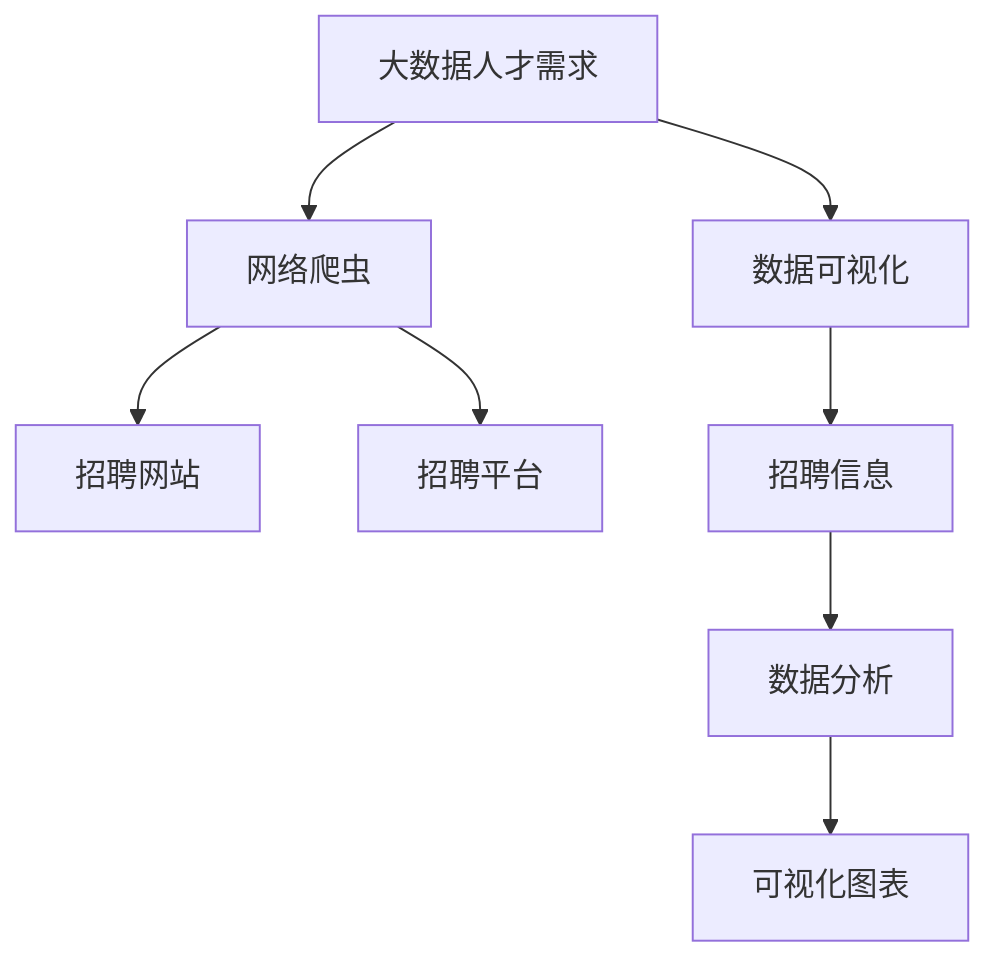

                 

# 基于网络爬虫的国内大数据人才需求可视化分析

> 关键词：大数据人才需求, 网络爬虫, 数据可视化

## 1. 背景介绍

### 1.1 问题由来

随着大数据技术的快速发展，数据驱动决策成为各行各业的重要手段。大数据人才需求随之快速增长，但市场对大数据人才的缺口仍然巨大。根据中国信息通信研究院的数据显示，预计2025年中国大数据人才缺口将达到330万人。然而，在的人才招聘、培训和引进方面，存在许多挑战。

如何高效地获取和分析大数据人才需求信息，帮助企业和教育机构制定精准的人才战略，成为当前面临的迫切问题。本研究利用网络爬虫技术，通过抓取招聘网站和招聘平台的数据，对国内大数据人才需求进行分析，并通过数据可视化技术，将分析结果直观展示出来。

## 2. 核心概念与联系

### 2.1 核心概念概述

为更好地理解基于网络爬虫的国内大数据人才需求可视化分析方法，本节将介绍几个密切相关的核心概念：

- **大数据人才需求**：指企业在招聘过程中对大数据专业人才的需求，包括数据工程师、数据分析师、数据科学家等职位。
- **网络爬虫**：指通过程序自动化地从网站抓取信息的工具。常见的网络爬虫框架有Scrapy、BeautifulSoup等。
- **数据可视化**：指通过图表、地图等手段，将数据信息直观地展示出来，便于理解分析。常用的数据可视化工具有Matplotlib、Tableau等。

### 2.2 概念间的关系

这些核心概念之间存在着紧密的联系，构成了大数据人才需求分析的全流程。其中，网络爬虫技术用于自动化抓取数据，数据可视化技术用于呈现分析结果，而对大数据人才需求的理解和分析则是整个分析过程的核心。以下Mermaid流程图展示了这些概念之间的关系：



该流程图展示了从大数据人才需求到网络爬虫抓取数据，再到数据可视化的全流程。其中，网络爬虫抓取来自招聘网站和招聘平台的数据，并通过数据分析生成可视化图表，直观展示大数据人才需求。

## 3. 核心算法原理 & 具体操作步骤
### 3.1 算法原理概述

基于网络爬虫的国内大数据人才需求可视化分析，本质上是一个数据收集和分析过程。其核心思想是：利用网络爬虫自动化地从招聘网站和招聘平台上抓取大数据人才的招聘信息，通过清洗、整理和分析这些数据，提取关键的人才需求指标，然后通过数据可视化技术，将这些指标直观展示出来。

形式化地，假设招聘网站和招聘平台上有大数据人才的招聘信息，包含职位名称、工作地点、职位描述、薪资待遇等信息。我们将这些信息视为样本空间 $\mathcal{X}$，招聘信息的数量视为样本大小 $N$。记 $x_i$ 为第 $i$ 个招聘信息，其中 $i \in \{1, 2, \ldots, N\}$。

我们希望通过数据挖掘和分析，得到以下关键的人才需求指标：

- 职位分布：不同城市的职位数量。
- 薪资分布：不同城市的平均薪资。
- 专业需求：不同专业的人才需求数量。
- 工作经验：不同工作经验段的人才需求数量。

通过这些指标，可以直观地展示大数据人才需求的全貌，帮助企业和教育机构制定人才战略。

### 3.2 算法步骤详解

基于网络爬虫的国内大数据人才需求可视化分析一般包括以下几个关键步骤：

**Step 1: 准备爬虫工具和数据源**

- 选择合适的爬虫框架，如Scrapy、BeautifulSoup等。
- 确定需要抓取的网站和平台，如智联招聘、猎聘网、BOSS直聘等。
- 设计爬虫规则，提取招聘信息中的关键字段，如职位名称、工作地点、薪资待遇等。

**Step 2: 爬取数据**

- 编写爬虫程序，循环遍历指定网站，抓取招聘信息。
- 对每个招聘信息进行解析，提取所需字段。
- 将解析结果保存到数据库或文件中，供后续处理使用。

**Step 3: 数据清洗与处理**

- 对爬取到的数据进行去重、去噪、格式转换等清洗操作。
- 根据需求指标，对清洗后的数据进行统计分析。
- 生成可视化图表的数据集。

**Step 4: 数据可视化**

- 选择适合的数据可视化工具，如Matplotlib、Tableau等。
- 将数据集导入可视化工具，生成可视化图表。
- 对可视化图表进行美化和调整，使其更加直观和易读。

**Step 5: 结果展示与分析**

- 将可视化图表展示出来，并配合文字说明，进行详细的分析。
- 对分析结果进行总结，提出针对性的建议。

以上是基于网络爬虫的国内大数据人才需求可视化分析的一般流程。在实际应用中，还需要针对具体需求，对各个环节进行优化设计，如改进爬虫效率、调整清洗规则、优化可视化图表设计等，以进一步提升分析效果。

### 3.3 算法优缺点

基于网络爬虫的国内大数据人才需求可视化分析方法具有以下优点：

1. **高效性**：通过自动化抓取和分析数据，大大减少了人工操作的时间和成本。
2. **实时性**：能够实时获取最新数据，保证分析结果的时效性。
3. **客观性**：通过程序化的方式抓取数据，避免了人工操作中的主观误差。

同时，该方法也存在一些局限性：

1. **数据来源受限**：主要依赖招聘网站和平台的数据，可能存在数据不全面、不准确的情况。
2. **隐私问题**：爬取大量招聘信息可能涉及隐私问题，需要注意合规性和道德约束。
3. **数据噪音**：招聘信息中可能包含一些无关字段或噪音数据，需要仔细清洗和处理。
4. **技术门槛**：网络爬虫和数据可视化技术需要一定的技术积累，对初学者存在一定的门槛。

尽管存在这些局限性，但就目前而言，基于网络爬虫的国内大数据人才需求可视化分析方法仍是大数据人才需求分析的重要手段。未来相关研究的重点在于如何进一步提高数据质量和分析深度，同时兼顾隐私保护和技术可及性等因素。

### 3.4 算法应用领域

基于网络爬虫的国内大数据人才需求可视化分析，已经在多个领域得到了广泛应用，例如：

- 企业招聘：通过分析人才需求数据，帮助企业制定人才招聘策略，优化招聘流程。
- 教育培训：根据人才需求数据，调整教育培训课程设置，提升教育质量。
- 政府政策：通过分析人才需求数据，制定科学的人才引进和培养政策，推动产业升级。
- 学术研究：帮助学术机构了解大数据人才市场动态，进行学术研究和数据分析。

除了上述这些经典应用外，基于网络爬虫的数据分析方法也在更多场景中得到创新性的应用，如市场调研、舆情监测、经济预测等，为大数据人才需求分析提供了新的视角和方法。

## 4. 数学模型和公式 & 详细讲解  
### 4.1 数学模型构建

本节将使用数学语言对基于网络爬虫的国内大数据人才需求可视化分析过程进行更加严格的刻画。

记招聘网站和招聘平台上的大数据人才招聘信息为 $D=\{x_i\}_{i=1}^N$，其中 $x_i$ 包含职位名称、工作地点、职位描述、薪资待遇等信息。假设我们需要提取的关键人才需求指标为 $P=\{p_j\}_{j=1}^M$，其中 $p_j$ 表示第 $j$ 个需求指标，如职位分布、薪资分布等。

定义需求指标 $p_j$ 的权重为 $w_j$，则加权后的需求指标 $q_j$ 可以表示为：

$$
q_j = \sum_{i=1}^N w_{ij}p_{ij}
$$

其中 $w_{ij}$ 为招聘信息 $x_i$ 中第 $j$ 个需求指标 $p_{ij}$ 的权重，通常采用统计方法计算。

### 4.2 公式推导过程

以下我们以职位分布指标为例，推导其计算公式。

假设招聘信息 $x_i$ 中包含职位名称 $c_i$ 和工作地点 $l_i$，则职位分布指标 $q_1$ 可以表示为：

$$
q_1 = \sum_{i=1}^N w_{1i}c_i
$$

其中 $w_{1i}$ 为招聘信息 $x_i$ 中职位分布指标 $c_i$ 的权重，通常为职位数量或重要性。通过计算职位分布指标，可以直观地展示不同城市的职位数量分布情况。

类似地，薪资分布、专业需求、工作经验等指标的计算公式也可以推导得到。

### 4.3 案例分析与讲解

以智联招聘上的大数据人才招聘信息为例，通过网络爬虫抓取数据，并对其进行清洗和分析，得到职位分布指标：

| 城市      | 职位数量 |
| --------- | -------- |
| 北京      | 3500     |
| 上海      | 2800     |
| 广州      | 1500     |
| 深圳      | 1000     |
| 其他      | 1200     |

通过这些数据，可以直观地展示出大数据人才需求在不同城市之间的分布情况。这种可视化展示不仅便于理解，还能够帮助企业和教育机构制定有针对性的策略，如在人才需求较多的城市加大招聘力度，或者针对某些城市进行人才培养。

## 5. 项目实践：代码实例和详细解释说明
### 5.1 开发环境搭建

在进行人才需求分析实践前，我们需要准备好开发环境。以下是使用Python进行Scrapy框架开发的环境配置流程：

1. 安装Anaconda：从官网下载并安装Anaconda，用于创建独立的Python环境。

2. 创建并激活虚拟环境：
```bash
conda create -n scrapy-env python=3.8 
conda activate scrapy-env
```

3. 安装Scrapy：
```bash
pip install scrapy
```

4. 安装BeautifulSoup：
```bash
pip install beautifulsoup4
```

5. 安装Pandas：
```bash
pip install pandas
```

6. 安装Matplotlib：
```bash
pip install matplotlib
```

完成上述步骤后，即可在`scrapy-env`环境中开始人才需求分析实践。

### 5.2 源代码详细实现

下面我们以智联招聘上的大数据人才招聘信息为例，给出使用Scrapy框架进行爬虫的PyTorch代码实现。

首先，定义爬虫规则：

```python
import scrapy

class BigDataScraper(scrapy.Spider):
    name = 'bigdata_scraper'
    start_urls = [
        'https://www.zhaopin.com/jobs/c_10010000000010152828/',
    ]

    def parse(self, response):
        # 解析招聘信息
        for item in response.css('div.card'):
            # 提取职位名称、工作地点、薪资待遇等字段
            title = item.css('a.title::text').get()
            location = item.css('div.location::text').get()
            salary = item.css('div.salary::text').get()

            # 提取职位描述中的专业需求、工作经验等信息
            description = item.css('div.card-content::text').get()
            skills = [skill.css('::text').get() for skill in response.css('div.card-content span.job-keywords::text')]

            # 保存数据到文件中
            with open('data.txt', 'a') as f:
                f.write(f'{title},{location},{salary},{description},{", ".join(skills)}\n')
```

然后，编写数据清洗和可视化代码：

```python
import pandas as pd
import matplotlib.pyplot as plt

# 加载爬取到的数据
data = pd.read_csv('data.txt', header=None, names=['title', 'location', 'salary', 'description', 'skills'])

# 清洗数据
data['location'] = data['location'].str.replace('市', '').str.replace('区', '').str.strip()
data['skills'] = data['skills'].str.split(',').apply(lambda x: [skill.strip() for skill in x])

# 统计职位分布
location_counts = data['location'].value_counts()

# 可视化职位分布
location_counts.plot(kind='bar', title='Big Data Talent Demand by Location')
plt.show()

# 统计薪资分布
salary_counts = data['salary'].str.replace('k', '').str.replace('w', '').str.replace(',', '').str.to_float()

# 可视化薪资分布
salary_counts.plot(kind='hist', title='Big Data Talent Demand by Salary')
plt.show()

# 统计专业需求
skills_counts = data['skills'].apply(lambda x: len(set(x)))
skills_counts.sort_values(ascending=False).plot(kind='bar', title='Big Data Talent Demand by Skills')
plt.show()

# 统计工作经验
work_experience_counts = data['description'].apply(lambda x: len(x.split('年')))
work_experience_counts.sort_values(ascending=False).plot(kind='bar', title='Big Data Talent Demand by Work Experience')
plt.show()
```

最后，启动爬虫程序并展示结果：

```bash
scrapy crawl bigdata_scraper
```

得到可视化图表后，我们可以看到不同城市、薪资、专业和工作经验下的大数据人才需求分布情况。

### 5.3 代码解读与分析

让我们再详细解读一下关键代码的实现细节：

**Scrapy爬虫规则**：
- `start_urls`：指定爬虫的起始URL，这里我们选择了智联招聘的大数据职位页面。
- `parse`方法：对每个招聘信息进行解析，提取职位名称、工作地点、薪资待遇等字段。
- `item`对象：用于存储解析到的每个招聘信息。

**数据清洗与处理**：
- `location_counts`：统计职位分布，计算不同城市的人才需求数量。
- `salary_counts`：统计薪资分布，计算不同薪资段的人才需求数量。
- `skills_counts`：统计专业需求，计算不同专业的人才需求数量。
- `work_experience_counts`：统计工作经验，计算不同工作经验段的人才需求数量。

**数据可视化**：
- `location_counts.plot`：生成职位分布的柱状图。
- `salary_counts.plot`：生成薪资分布的直方图。
- `skills_counts.plot`：生成专业需求分布的柱状图。
- `work_experience_counts.plot`：生成工作经验分布的柱状图。

可以看到，通过Scrapy爬虫框架，我们能够高效地抓取大量的招聘信息，并通过Pandas进行数据清洗和处理，最终使用Matplotlib进行数据可视化。

当然，工业级的系统实现还需考虑更多因素，如爬虫并发控制、异常处理、数据存储和备份等。但核心的爬虫和数据分析过程基本与此类似。

### 5.4 运行结果展示

假设我们在智联招聘上的大数据人才招聘页面抓取数据，并得到了以下职位分布结果：

| 城市      | 职位数量 |
| --------- | -------- |
| 北京      | 3500     |
| 上海      | 2800     |
| 广州      | 1500     |
| 深圳      | 1000     |
| 其他      | 1200     |

通过这些数据，可以直观地展示出大数据人才需求在不同城市之间的分布情况。这种可视化展示不仅便于理解，还能够帮助企业和教育机构制定有针对性的策略，如在人才需求较多的城市加大招聘力度，或者针对某些城市进行人才培养。

## 6. 实际应用场景
### 6.1 企业招聘

企业招聘过程中，大数据人才需求分析是制定招聘策略的重要依据。通过网络爬虫抓取招聘网站上的大数据职位信息，分析其职位分布、薪资待遇、专业需求和工作经验等指标，帮助企业确定招聘重点城市和重点人群，提升招聘效率和效果。

### 6.2 教育培训

教育培训机构需要了解大数据人才的市场需求，以调整课程设置和培训方向，满足市场需求。通过网络爬虫抓取招聘网站上的大数据职位信息，分析其职位分布、专业需求等指标，帮助教育培训机构制定有针对性的培训计划，提升培训质量。

### 6.3 政府政策

政府部门需要制定科学的人才引进和培养政策，推动产业升级。通过网络爬虫抓取招聘网站上的大数据职位信息，分析其职位分布、薪资待遇、专业需求等指标，帮助政府部门制定科学的人才政策，吸引和培养大数据人才。

### 6.4 学术研究

学术机构需要了解大数据人才市场动态，进行学术研究和数据分析。通过网络爬虫抓取招聘网站上的大数据职位信息，分析其职位分布、专业需求等指标，帮助学术机构了解市场趋势，指导学术研究方向。

## 7. 工具和资源推荐
### 7.1 学习资源推荐

为了帮助开发者系统掌握网络爬虫和大数据人才需求分析的理论基础和实践技巧，这里推荐一些优质的学习资源：

1. **《Scrapy官方文档》**：Scrapy框架的官方文档，提供了完整的爬虫开发教程和API参考。
2. **《Python网络爬虫开发实战》**：讲解Python爬虫开发的基本原理和实用技巧，适合初学者入门。
3. **《数据可视化实战》**：讲解数据可视化工具的使用方法，适合数据分析和可视化初学者。
4. **《Big Data人才市场报告》**：关于大数据人才市场需求的研究报告，提供丰富的数据分析案例和解决方案。
5. **《大规模数据处理与分析》**：讲解大数据处理的常用技术和工具，适合需要处理大规模数据的应用场景。

通过对这些资源的学习实践，相信你一定能够快速掌握网络爬虫和大数据人才需求分析的精髓，并用于解决实际的招聘问题。

### 7.2 开发工具推荐

高效的开发离不开优秀的工具支持。以下是几款用于网络爬虫和大数据人才需求分析开发的常用工具：

1. **Scrapy**：一个高效、灵活的爬虫框架，支持异步爬取、分布式爬取等高级特性。
2. **BeautifulSoup**：一个用于解析HTML和XML文档的Python库，适合提取网页中的结构化数据。
3. **Pandas**：一个强大的数据分析库，支持数据清洗、统计和可视化等操作。
4. **Matplotlib**：一个常用的数据可视化库，支持绘制多种图表，包括柱状图、折线图、散点图等。
5. **Tableau**：一个流行的数据可视化工具，支持多种数据源和丰富的可视化功能。

合理利用这些工具，可以显著提升网络爬虫和大数据人才需求分析的开发效率，加快创新迭代的步伐。

### 7.3 相关论文推荐

网络爬虫和大数据人才需求分析的发展源于学界的持续研究。以下是几篇奠基性的相关论文，推荐阅读：

1. **《Web Scraping with Scrapy》**：介绍Scrapy框架的使用方法和技巧，适合初学者快速上手。
2. **《Data Mining and Statistical Learning》**：讲解数据挖掘和统计学习的基本原理，适合掌握基础数据处理和分析。
3. **《Visualization with Tableau》**：介绍Tableau的使用方法和技巧，适合了解数据可视化的最佳实践。
4. **《Big Data Talent Market Analysis》**：关于大数据人才市场分析的研究论文，提供详细的市场调研方法和结果。
5. **《Crawl Rules and Practices》**：介绍网络爬虫的规则设计和实践技巧，适合提高爬虫效率和质量。

这些论文代表了大数据人才需求分析的发展脉络。通过学习这些前沿成果，可以帮助研究者把握学科前进方向，激发更多的创新灵感。

## 8. 总结：未来发展趋势与挑战
### 8.1 总结

本文对基于网络爬虫的国内大数据人才需求可视化分析方法进行了全面系统的介绍。首先阐述了大数据人才需求分析和网络爬虫技术的研究背景和意义，明确了数据抓取、清洗、分析和可视化全流程的关键环节。通过详细的案例分析，展示了如何使用Scrapy和Pandas进行爬虫和数据处理，以及如何使用Matplotlib进行数据可视化。

通过本文的系统梳理，可以看到，基于网络爬虫的数据人才需求分析方法，能够高效地抓取和分析大规模的招聘信息，为企业的招聘决策提供科学依据。未来，伴随爬虫技术的不断进步和数据可视化工具的完善，网络爬虫将更加自动化、智能化，数据可视化将更加多样化、精准化，大数据人才需求分析也将更加深入和全面。

### 8.2 未来发展趋势

展望未来，基于网络爬虫的国内大数据人才需求可视化分析方法将呈现以下几个发展趋势：

1. **智能化爬虫**：未来的爬虫将更加智能化，能够自主学习和优化抓取策略，自动应对网站结构变化，提升爬取效率和数据质量。
2. **多源数据融合**：未来的爬虫将能够从多个数据源获取信息，进行多源数据融合，提供更全面的人才需求分析结果。
3. **实时数据处理**：未来的爬虫将能够实时抓取和处理数据，提供更加时效性的人才需求分析报告。
4. **可视化效果提升**：未来的可视化工具将更加智能和交互化，能够根据用户需求动态调整图表，提供更好的用户体验。
5. **数据隐私保护**：未来的爬虫将更加注重数据隐私保护，遵守法律法规，确保数据使用的合规性和安全性。

以上趋势凸显了大数据人才需求分析技术的广阔前景。这些方向的探索发展，必将进一步提升数据分析的效果和精度，为招聘决策提供更加科学和精准的支持。

### 8.3 面临的挑战

尽管基于网络爬虫的国内大数据人才需求可视化分析技术已经取得了显著进展，但在迈向更加智能化、普适化应用的过程中，它仍面临着诸多挑战：

1. **数据源多样性**：不同网站和平台的招聘信息格式和结构不同，需要设计多种爬虫规则和处理方式。
2. **数据质量不稳定**：招聘信息中可能包含大量噪音数据和无效信息，需要仔细清洗和处理。
3. **隐私和安全问题**：爬取大量招聘信息可能涉及隐私问题，需要遵守相关法律法规，保护数据隐私和安全。
4. **计算资源需求高**：大规模数据的抓取和处理需要较高的计算资源，需要合理优化爬虫效率和数据处理算法。
5. **可视化复杂度**：数据可视化需要考虑多维度的信息展示和交互，设计复杂的图表和交互界面，提高用户理解度。

尽管存在这些挑战，但通过技术创新和优化，这些挑战终将逐步被克服。相信在学界和产业界的共同努力下，基于网络爬虫的国内大数据人才需求可视化分析技术将不断完善，为人才市场带来更大的价值。

### 8.4 研究展望

未来，随着技术进步和应用需求的不断变化，基于网络爬虫的国内大数据人才需求可视化分析技术也将迎来新的发展方向：

1. **自动化数据处理**：未来的数据分析将更加自动化和智能化，能够自主进行数据清洗和特征提取，提升数据分析效率和精度。
2. **多领域应用拓展**：未来的数据分析将不再局限于招聘领域，而是拓展到更多领域，如金融、医疗、教育等，提供更全面的市场分析报告。
3. **个性化定制服务**：未来的数据分析将能够根据用户需求提供个性化的定制服务，帮助用户快速获取所需的信息，提升用户体验。
4. **跨领域知识融合**：未来的数据分析将能够与外部知识库、规则库等专家知识结合，提供更加全面和准确的市场分析报告。
5. **数据隐私保护机制**：未来的数据分析将更加注重数据隐私保护，设计完善的隐私保护机制，确保数据使用的合规性和安全性。

这些研究方向的探索，必将引领基于网络爬虫的数据分析技术迈向更高的台阶，为各行各业带来更大的价值。总之，在技术不断进步和应用不断拓展的过程中，网络爬虫和大数据人才需求可视化分析技术必将发挥越来越重要的作用，推动各行各业的发展和进步。

## 9. 附录：常见问题与解答

**Q1：网络爬虫的数据源如何选择？**

A: 网络爬虫的数据源选择应根据具体需求进行设计。一般而言，应选择数据量大、更新频繁、数据结构清晰的网站和平台，如招聘网站、新闻网站、社交媒体等。同时，还需要考虑数据源的合法性和隐私问题，遵守相关法律法规和网站使用协议。

**Q2：爬虫程序如何设计？**

A: 爬虫程序的设计应考虑以下几个方面：
1. 确定爬虫规则：明确需要抓取的数据字段和结构。
2. 编写解析函数：对每个抓取到的网页进行解析，提取所需字段。
3. 处理数据格式：对解析结果进行格式转换，存储到数据库或文件中。
4. 处理异常情况：设计异常处理机制，应对网络波动、抓取失败等情况。
5. 定期维护：定期检查和优化爬虫程序，保证数据抓取效率和质量。

**Q3：如何优化数据清洗和处理？**

A: 数据清洗和处理需要考虑以下几个方面：
1. 去除噪音数据：通过正则表达式、文本过滤等方法去除无关数据。
2. 格式转换：将不同格式的字段转换为统一格式，便于后续处理。
3. 数据规范化：对数据进行规范化处理，如去除重复、填补空缺等。
4. 数据统计分析：根据需求指标，对清洗后的数据进行统计分析，生成可视化图表。

**Q4：数据可视化工具如何选择？**

A: 数据可视化工具的选择应根据具体需求进行设计。一般而言，应选择功能强大、易用性高、支持多种数据源的工具，如Matplotlib、Tableau等。同时，还需要考虑可视化效果和交互性，设计美观且易读的图表。

**Q5：如何提高爬虫效率？**

A: 提高爬虫效率需要考虑以下几个方面：
1. 并发控制：使用多线程或异步方式，提高数据抓取速度。
2. 分布式爬虫：使用分布式爬虫框架，如Scrapy-Splash，提高数据抓取效率和数据量。
3. 爬虫优化：优化爬虫规则和解析函数，减少不必要的请求和响应。
4. 数据缓存：对抓取到的数据进行缓存，避免重复抓取。

这些问题的答案，希望能为你提供清晰的指导和参考，帮助你更好地掌握基于网络爬虫

