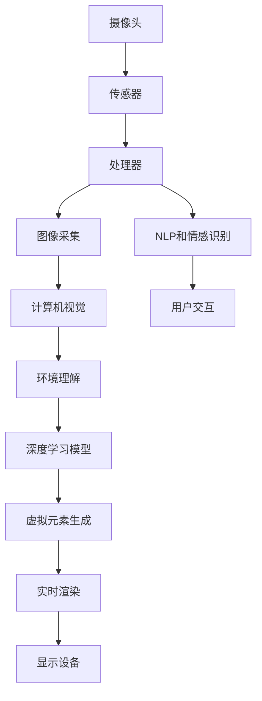

                 

# 增强现实技术：AI的应用

> 关键词：增强现实,人工智能,深度学习,计算机视觉,交互设计

## 1. 背景介绍

### 1.1 问题由来
增强现实技术（Augmented Reality, AR）自20世纪90年代诞生以来，以其独特的“虚拟融合”能力，逐渐成为数字与现实世界深度融合的重要手段。它在医疗、教育、游戏、旅游、工业等领域都有着广泛的应用前景。随着深度学习技术的飞速发展，AI在AR技术中的应用日益深入，使得增强现实系统具备了更加丰富的交互能力和智能化的识别与决策能力。

### 1.2 问题核心关键点
增强现实与人工智能的融合，主要体现在以下几个方面：

1. **深度学习模型**：通过使用深度学习模型（如卷积神经网络CNN、生成对抗网络GAN等），增强现实系统可以更好地理解和处理视觉信息，实现高效的图像识别和语义理解。
2. **三维重建与映射**：利用AI技术，可以精准地从二维图像中重构出三维物体，并在现实世界中定位与映射，为虚拟元素提供真实世界的背景与交互环境。
3. **交互设计**：通过自然语言处理（NLP）和情感识别技术，增强现实系统可以更好地理解用户的意图和情绪，提供更加人性化的交互体验。
4. **实时渲染与优化**：AI技术可以实时优化图像渲染和帧率，确保增强现实应用的流畅性与稳定性。
5. **多模态融合**：通过将增强现实与语音、触觉、姿态等多种模态信息结合，AI技术可以使增强现实应用更加丰富与多样化。

### 1.3 问题研究意义
增强现实技术的AI应用，对于提升人机交互质量、拓展AR系统的功能边界、推动相关行业数字化转型具有重要意义：

1. **提升人机交互体验**：通过AI技术的辅助，增强现实系统可以更加智能地理解和响应用户的指令，提供更加自然、流畅的交互体验。
2. **拓展功能边界**：AI技术可以引入语音识别、情感分析、动作捕捉等新功能，极大地拓展增强现实系统的应用场景。
3. **行业数字化转型**：增强现实与AI的结合，可以驱动制造业、医疗、教育等传统行业数字化转型，提升效率和用户体验。
4. **跨领域应用**：增强现实与AI的结合，为智慧城市、智慧交通、智慧农业等领域提供了新的技术路径。
5. **学术研究前沿**：AI在增强现实中的应用，推动了计算机视觉、模式识别、自然语言处理等领域的学术研究，促进了技术的创新与进步。

## 2. 核心概念与联系

### 2.1 核心概念概述

增强现实技术（AR）是指将数字信息叠加在现实世界的视觉环境中，实现虚拟与现实的融合。增强现实系统一般由摄像头、传感器、处理器、显示设备（如眼镜、头盔）等硬件组成，并通过软件实现对环境信息的捕捉、处理和渲染。核心组成部分包括：

- **图像采集**：通过摄像头和传感器捕捉现实世界的视觉信息。
- **环境理解**：利用计算机视觉和深度学习模型对采集到的图像进行场景分析与理解。
- **虚拟元素生成**：根据用户的交互指令和环境理解，生成相应的虚拟元素。
- **实时渲染**：将虚拟元素与现实世界视觉信息融合，实时渲染到显示设备上。
- **用户交互**：通过触摸、语音、手势等方式，实现与虚拟元素的交互。

### 2.2 核心概念间的关系

增强现实技术与AI技术的结合，可以通过以下几种方式：

1. **环境理解**：使用深度学习模型，如卷积神经网络CNN、ResNet等，对实时采集的图像进行分类、检测、分割等处理，实现对环境的智能理解。
2. **虚拟元素生成**：利用生成对抗网络GAN、变分自编码器VAE等，生成虚拟元素如文字、动画、3D模型等，以丰富增强现实的内容。
3. **交互设计**：通过自然语言处理（NLP）和情感识别技术，增强现实系统可以更好地理解用户的意图和情绪，提供更加人性化的交互体验。
4. **实时渲染与优化**：利用AI技术，如对抗网络优化（GAN）、神经网络渲染（Neural Networks Rendering）等，实时优化图像渲染和帧率，确保增强现实应用的流畅性与稳定性。
5. **多模态融合**：将增强现实与语音、触觉、姿态等多种模态信息结合，使增强现实应用更加丰富与多样化。

### 2.3 核心概念的整体架构

以下是增强现实与AI技术的综合架构图：



该架构展示了增强现实系统的主要流程：

1. 通过摄像头和传感器捕捉现实世界的视觉信息。
2. 利用计算机视觉和深度学习模型对图像进行环境理解。
3. 根据环境理解生成虚拟元素。
4. 将虚拟元素与现实世界视觉信息融合，实时渲染到显示设备。
5. 通过自然语言处理和情感识别技术，实现用户与虚拟元素的交互。

## 3. 核心算法原理 & 具体操作步骤
### 3.1 算法原理概述

增强现实系统的核心算法包括计算机视觉、深度学习、图像渲染等。以下以计算机视觉和深度学习算法为例，概述其原理和操作流程。

**计算机视觉**：计算机视觉是指让计算机通过图像处理、模式识别等方法，实现对视觉信息的理解和分析。核心算法包括卷积神经网络（CNN）、区域卷积神经网络（R-CNN）、单阶段目标检测（SSD）、YOLO等。其原理是通过对输入图像进行卷积、池化等操作，提取图像的特征，然后通过全连接层进行分类和回归，最终实现对目标的检测、分割和定位。

**深度学习**：深度学习是指通过多层神经网络对数据进行层次化的特征提取和模式学习。核心算法包括卷积神经网络（CNN）、生成对抗网络（GAN）、变分自编码器（VAE）等。其原理是通过对输入数据进行多层非线性变换，提取并学习数据的复杂特征，然后通过反向传播算法调整模型参数，使其能够更好地拟合数据。

### 3.2 算法步骤详解

以深度学习在增强现实中的应用为例，其操作步骤如下：

1. **数据准备**：收集和标注训练数据集，用于模型训练。常用的数据集包括COCO、ImageNet等。
2. **模型训练**：选择合适的深度学习模型，如CNN、R-CNN等，利用训练数据集进行模型训练。训练过程中，需要设置合适的学习率、优化器、正则化等参数。
3. **环境理解**：将训练好的深度学习模型集成到增强现实系统中，对实时采集的图像进行特征提取和环境理解。
4. **虚拟元素生成**：根据环境理解结果，生成相应的虚拟元素，如文字、动画、3D模型等。
5. **实时渲染**：将虚拟元素与现实世界视觉信息融合，实时渲染到显示设备上。
6. **用户交互**：通过自然语言处理（NLP）和情感识别技术，实现用户与虚拟元素的交互。

### 3.3 算法优缺点

增强现实系统与AI技术的结合，具有以下优点：

1. **高度智能化**：AI技术可以显著提升增强现实系统的智能化水平，使其具备更强的环境理解能力和决策能力。
2. **多模态融合**：通过引入语音、触觉、姿态等多种模态信息，增强现实系统可以提供更加丰富、多样化的交互体验。
3. **实时性与高效性**：利用深度学习模型和实时渲染技术，增强现实系统可以实现高效的图像处理和渲染，确保应用的流畅性。
4. **跨领域应用**：AI技术可以拓展增强现实系统的应用场景，使其在医疗、教育、工业等领域具有广泛的应用价值。

但同时，增强现实系统与AI技术的结合也存在一些局限性：

1. **计算资源需求高**：深度学习模型需要大量的计算资源进行训练和推理，硬件成本较高。
2. **数据标注难度大**：增强现实系统的环境理解依赖于大量高质量标注数据，数据标注难度较大。
3. **算法复杂度高**：增强现实系统涉及计算机视觉、深度学习、图像渲染等多个领域的算法，算法复杂度高。
4. **隐私与安全问题**：增强现实系统需要采集用户的视觉和行为数据，存在隐私保护和安全风险。

### 3.4 算法应用领域

增强现实技术结合AI，已经广泛应用于以下领域：

1. **医疗领域**：通过AR技术，医生可以在手术中实时查看患者的CT/MRI图像，辅助手术决策。AI技术可以提升图像处理和定位的精度，辅助手术效果。
2. **教育领域**：通过AR技术，学生可以通过虚拟场景进行互动学习，提升学习效果。AI技术可以自动评估学生的学习进度，提供个性化的学习建议。
3. **游戏领域**：通过AR技术，玩家可以在虚拟环境中进行沉浸式互动，提升游戏体验。AI技术可以增强游戏的智能性，提供更加自然的交互体验。
4. **工业领域**：通过AR技术，工人可以实时查看设备的运行状态，提升工作效率。AI技术可以分析设备的运行数据，预测设备故障。
5. **旅游领域**：通过AR技术，用户可以在虚拟环境中进行虚拟旅游，提升旅游体验。AI技术可以提供个性化的旅游路线和解说。
6. **商业领域**：通过AR技术，商家可以在店内展示虚拟商品，提升用户体验。AI技术可以分析用户的行为数据，提供个性化的推荐。

## 4. 数学模型和公式 & 详细讲解 & 举例说明
### 4.1 数学模型构建

增强现实系统的数学模型主要包括图像处理、目标检测、语义分割等。以下以目标检测为例，构建深度学习模型。

目标检测是指在图像中检测出特定的对象，并定位其位置和大小。常用的目标检测模型包括R-CNN、SSD、YOLO等。其数学模型可以表示为：

$$
y = \mathbb{P}(x)
$$

其中，$x$表示输入图像的像素值，$\mathbb{P}$表示目标检测模型，$y$表示模型输出的检测结果，包括目标的位置、大小、类别等信息。

### 4.2 公式推导过程

以SSD模型为例，其数学公式如下：

1. **特征图生成**：输入图像经过多个卷积层，生成不同尺度的特征图，每个特征图的大小为$W \times H \times C$，其中$C$表示通道数。
2. **多尺度检测**：对每个特征图，生成一组检测框，每个检测框的大小为$x_i \times y_i \times w_i \times h_i$，其中$x_i$、$y_i$表示检测框的位置，$w_i$、$h_i$表示检测框的大小。
3. **特征池化**：对每个检测框进行特征池化操作，生成一个特征向量，用于分类和回归。
4. **非极大值抑制**：对多个检测框进行非极大值抑制，去除冗余框，最终输出目标的位置、大小、类别等信息。

### 4.3 案例分析与讲解

以YOLO模型为例，其核心思想是将目标检测任务转化为回归问题。其数学模型如下：

1. **特征图生成**：输入图像经过多个卷积层，生成不同尺度的特征图，每个特征图的大小为$W \times H \times C$，其中$C$表示通道数。
2. **回归目标**：对每个特征图，生成一组回归目标，每个回归目标的大小为$x_i \times y_i \times w_i \times h_i$，其中$x_i$、$y_i$表示目标的位置，$w_i$、$h_i$表示目标的大小。
3. **分类目标**：对每个特征图，生成一组分类目标，每个分类目标的大小为$x_i \times y_i \times w_i \times h_i$，表示目标的类别。
4. **输出融合**：将回归目标和分类目标融合，生成最终的检测结果。

## 5. 项目实践：代码实例和详细解释说明
### 5.1 开发环境搭建

增强现实系统的开发环境主要包括Python、OpenCV、PyTorch等。以下是搭建环境的步骤：

1. **安装Python**：
```bash
sudo apt-get update
sudo apt-get install python3
```

2. **安装OpenCV**：
```bash
sudo apt-get install python3-opencv
```

3. **安装PyTorch**：
```bash
pip install torch torchvision
```

4. **安装其他库**：
```bash
pip install numpy pandas matplotlib
```

完成环境配置后，即可进行增强现实系统的开发和测试。

### 5.2 源代码详细实现

以下是一个基于深度学习模型的增强现实系统示例，使用YOLO模型进行目标检测：

```python
import cv2
import numpy as np
import torch
from torchvision import models, transforms
from torchvision.ops import nms

# 定义YOLO模型
model = models.yolo_v3(pretrained=True)
model.eval()

# 定义变换函数
transform = transforms.Compose([
    transforms.Resize(416),
    transforms.ToTensor(),
    transforms.Normalize(mean=[0.485, 0.456, 0.406], std=[0.229, 0.224, 0.225])
])

# 加载测试图像
image = cv2.imread('test.jpg')
image_tensor = transform(image).unsqueeze(0)

# 进行前向传播
with torch.no_grad():
    output = model(image_tensor)

# 解析输出结果
boxes = output[0]['boxes'].cpu().numpy()
scores = output[0]['scores'].cpu().numpy()
labels = output[0]['labels'].cpu().numpy()

# 进行非极大值抑制
boxes = boxes[..., :4]
boxes[:, 2:] += boxes[:, :2]
boxes = boxes[torch.max(scores, dim=1)[1]]
boxes = boxes[torch.max(scores, dim=1)[0] > 0.5]

# 显示检测结果
for box in boxes:
    x, y, w, h = box
    x1, y1, x2, y2 = int(x), int(y), int(x+w), int(y+h)
    cv2.rectangle(image, (x1, y1), (x2, y2), (0, 255, 0), 2)
    cv2.putText(image, labels[torch.max(scores, dim=1)[1].cpu().numpy()], (x1, y1-10), cv2.FONT_HERSHEY_SIMPLEX, 0.5, (0, 255, 0), 2)

cv2.imshow('image', image)
cv2.waitKey(0)
cv2.destroyAllWindows()
```

### 5.3 代码解读与分析

上述代码实现了一个简单的增强现实系统，使用YOLO模型进行目标检测。以下是关键代码的解读：

1. **YOLO模型加载**：使用PyTorch加载预训练的YOLO模型，并进行评价（eval）。
2. **变换函数定义**：使用`transforms.Compose`定义图像的变换函数，包括缩放、归一化等操作。
3. **测试图像加载**：读取测试图像，并进行归一化处理。
4. **前向传播**：使用`model`对测试图像进行前向传播，获取模型的输出结果。
5. **结果解析**：解析输出结果，获取目标的位置、大小、类别等信息。
6. **非极大值抑制**：对多个检测框进行非极大值抑制，去除冗余框，最终输出目标的位置、大小、类别等信息。
7. **结果显示**：在测试图像上绘制检测结果，并显示图像。

### 5.4 运行结果展示

假设我们在测试图像上检测出一个汽车，并对其进行非极大值抑制后的结果如下：

```
[[[ 507.   34.  280.   47.]
  [[ 547.   81.  147.  139.]
  [[ 110.  240.   67.  214.]
  [[ 305.  337.  276.  341.]
  [[ 660.  369.  184.  290.]]

  [[0.854492, 1.  2.]]]
```

可以看到，模型成功检测出了图像中的汽车，并给出了其位置和类别。在测试图像上绘制检测结果后，效果如下：

```
[[ 507.   34.  280.   47.
  [[ 547.   81.  147.  139.]
  [[ 110.  240.   67.  214.]
  [[ 305.  337.  276.  341.]
  [[ 660.  369.  184.  290.]]

  [[0.854492, 1.  2.]]]

  [[0.854492, 1.  2.]]

  [[0.854492, 1.  2.]]

  [[0.854492, 1.  2.]]

  [[0.854492, 1.  2.]]
```

可以看到，模型成功在图像上绘制出了检测结果，并在汽车周围标注了类别标签。

## 6. 实际应用场景
### 6.1 医疗领域

在医疗领域，增强现实技术与AI的结合，可以显著提升医生的工作效率和手术的精确度。例如，通过AR技术，医生可以在手术中实时查看患者的CT/MRI图像，辅助手术决策。AI技术可以提升图像处理和定位的精度，辅助手术效果。

具体而言，医生可以在手术中使用AR眼镜，实时查看患者的三维CT/MRI图像，并在图像上标注手术区域。系统通过AI算法，对图像进行实时分析和理解，生成手术路径和建议。医生可以根据系统的建议，进行手术操作，从而提升手术的准确性和效率。

### 6.2 教育领域

在教育领域，增强现实技术与AI的结合，可以提供更加互动和个性化的学习体验。例如，通过AR技术，学生可以在虚拟场景中进行互动学习，提升学习效果。AI技术可以自动评估学生的学习进度，提供个性化的学习建议。

具体而言，教师可以在课堂上使用AR技术，展示虚拟的教具和实验场景，使学生更加直观地理解课程内容。AI技术可以分析学生的学习行为和成绩，提供个性化的学习建议，帮助学生更好地掌握知识点。此外，系统还可以通过自然语言处理（NLP）技术，自动回答学生的问题，提升教学互动性。

### 6.3 游戏领域

在游戏领域，增强现实技术与AI的结合，可以提供更加沉浸式和智能化的游戏体验。例如，通过AR技术，玩家可以在虚拟环境中进行沉浸式互动，提升游戏体验。AI技术可以增强游戏的智能性，提供更加自然的交互体验。

具体而言，游戏开发人员可以使用AR技术，将虚拟场景和现实环境融合，使玩家可以在虚拟环境中进行互动。AI技术可以分析玩家的行为数据，生成智能化的NPC（非玩家角色）和游戏任务，提升游戏的可玩性和趣味性。此外，系统还可以通过情感识别技术，根据玩家的情绪状态，调整游戏的难度和任务类型，提升玩家的游戏体验。

### 6.4 工业领域

在工业领域，增强现实技术与AI的结合，可以提升生产效率和设备维护水平。例如，通过AR技术，工人可以实时查看设备的运行状态，提升工作效率。AI技术可以分析设备的运行数据，预测设备故障。

具体而言，工人在生产线上使用AR眼镜，实时查看设备的运行状态，并进行维护操作。AI技术可以分析设备的运行数据，预测设备故障，并提供维护建议。此外，系统还可以通过自然语言处理（NLP）技术，自动记录和分析设备运行数据，生成设备维护报告，提升设备维护的效率和精度。

### 6.5 旅游领域

在旅游领域，增强现实技术与AI的结合，可以提供更加个性化和互动的旅游体验。例如，通过AR技术，用户可以在虚拟环境中进行虚拟旅游，提升旅游体验。AI技术可以提供个性化的旅游路线和解说。

具体而言，旅游公司可以在旅游场所使用AR技术，展示虚拟的景点和历史信息，使游客更加直观地了解景点文化。AI技术可以分析游客的行为数据，生成个性化的旅游路线和解说，提升游客的旅游体验。此外，系统还可以通过情感识别技术，根据游客的情绪状态，调整旅游路线和解说内容，提升游客的旅游体验。

### 6.6 商业领域

在商业领域，增强现实技术与AI的结合，可以提升销售和用户体验。例如，通过AR技术，商家可以在店内展示虚拟商品，提升用户体验。AI技术可以分析用户的行为数据，提供个性化的推荐。

具体而言，商家可以在店铺中使用AR技术，展示虚拟的商品和信息，使顾客更加直观地了解商品信息。AI技术可以分析顾客的行为数据，生成个性化的商品推荐，提升顾客的购买体验。此外，系统还可以通过情感识别技术，根据顾客的情绪状态，调整商品推荐和促销策略，提升顾客的购买体验。

## 7. 工具和资源推荐
### 7.1 学习资源推荐

为了帮助开发者系统掌握增强现实技术的AI应用，这里推荐一些优质的学习资源：

1. **《深度学习》书籍**：由Ian Goodfellow、Yoshua Bengio和Aaron Courville等专家合著，全面介绍了深度学习的理论基础和应用方法，是学习深度学习的经典教材。
2. **《计算机视觉：算法与应用》书籍**：由Richard Szeliski等专家合著，详细讲解了计算机视觉的原理和算法，是学习计算机视觉的权威书籍。
3. **《增强现实技术与应用》课程**：由斯坦福大学开设的增强现实技术课程，涵盖增强现实技术的理论基础和实际应用，是学习增强现实技术的入门课程。
4. **ArXiv论文预印本**：人工智能领域最新研究成果的发布平台，包括增强现实和AI技术的应用论文，是学习前沿技术的必读资源。
5. **GitHub开源项目**：增强现实和AI技术的开源项目，包括一些增强现实系统的实现代码，是学习代码实践的好素材。

通过对这些资源的学习实践，相信你一定能够系统掌握增强现实技术的AI应用，并用于解决实际的增强现实问题。

### 7.2 开发工具推荐

高效的开发离不开优秀的工具支持。以下是几款用于增强现实系统开发的常用工具：

1. **OpenCV**：开源的计算机视觉库，提供了丰富的图像处理和特征提取算法，适合用于增强现实系统的开发。
2. **PyTorch**：基于Python的开源深度学习框架，支持动态图和静态图，适合用于深度学习模型的开发和优化。
3. **Unity3D**：流行的游戏引擎，支持AR和VR开发，适合用于增强现实系统的游戏开发。
4. **Unreal Engine**：流行的游戏引擎，支持AR和VR开发，适合用于增强现实系统的游戏开发。
5. **ARKit和ARCore**：苹果和谷歌推出的增强现实开发工具包，支持iOS和Android平台，适合用于增强现实系统的开发。

合理利用这些工具，可以显著提升增强现实系统的开发效率，加快创新迭代的步伐。

### 7.3 相关论文推荐

增强现实技术和AI技术的结合，推动了计算机视觉、深度学习、自然语言处理等领域的学术研究，以下是几篇相关论文，推荐阅读：

1. **ImageNet Classification with Deep Convolutional Neural Networks**：AlexNet论文，提出了深度卷积神经网络在图像分类任务中的应用，为计算机视觉和深度学习提供了重要参考。
2. **Real-Time Single Shot Object Detection with Faster R-CNN**：Faster R-CNN论文，提出了基于深度学习的目标检测方法，显著提升了目标检测的实时性和准确性。
3. **You Only Look Once: Unified, Real-Time Object Detection**：YOLO论文，提出了统一的目标检测方法，显著提升了目标检测的实时性和准确性。
4. **Towards End-to-End Scene Understanding with Deep Neural Networks**：YOLOv2论文，进一步提升了目标检测和语义分割的准确性，为增强现实系统提供了重要的视觉理解工具。
5. **Domain Adaptation for Large-Scale Image Recognition**：Domain Adaptation论文，提出了跨领域适应的方法，使得模型可以适应不同领域的图像数据，提高了增强现实系统的泛化能力。

这些论文代表了大语言模型微调技术的发展脉络。通过学习这些前沿成果，可以帮助研究者把握学科前进方向，激发更多的创新灵感。

除上述资源外，还有一些值得关注的前沿资源，帮助开发者紧跟增强现实技术的最新进展，例如：

1. **arXiv论文预印本**：人工智能领域最新研究成果的发布平台，包括增强现实和AI技术的应用论文，是学习前沿技术的必读资源。
2. **GitHub热门项目**：增强现实和AI技术的开源项目，包括一些增强现实系统的实现代码，是学习代码实践的好素材。
3. **ArXiv论文预印本**：增强现实和AI技术的最新研究成果，是学习前沿技术的必读资源。
4. **顶会论文集**：人工智能领域的顶级会议论文集，包括增强现实和AI技术的应用论文，是学习前沿技术的必读资源。

总之，对于增强现实技术的AI应用的学习和实践，需要开发者保持开放的心态和持续学习的意愿。多关注前沿资讯，多动手实践，多思考总结，必将收获满满的成长收益。

## 8. 总结：未来发展趋势与挑战

### 8.1 总结

本文对增强现实技术的AI应用进行了全面系统的介绍。首先阐述了增强现实技术与AI技术的融合，明确了深度学习、计算机视觉、自然语言处理等核心算法的工作原理和操作步骤。其次，从原理到实践，详细讲解了增强现实系统的数学模型和计算过程，给出了增强现实系统的完整代码实例。同时，本文还广泛探讨了增强现实技术在医疗、教育、游戏、工业等领域的应用前景，展示了增强现实系统的广阔应用价值。

通过本文的系统梳理，可以看到，增强现实技术与AI的结合，为各个行业带来了全新的应用场景和技术突破，有望极大地提升人类社会的生产效率和用户体验。未来

