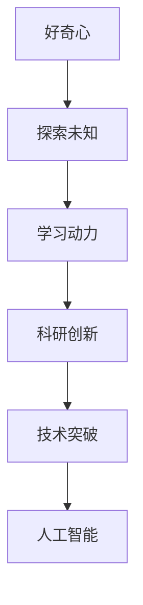
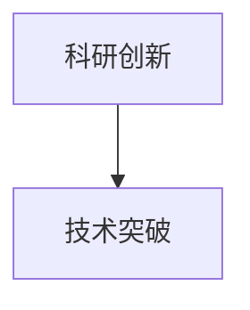
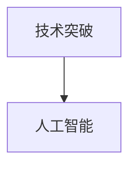
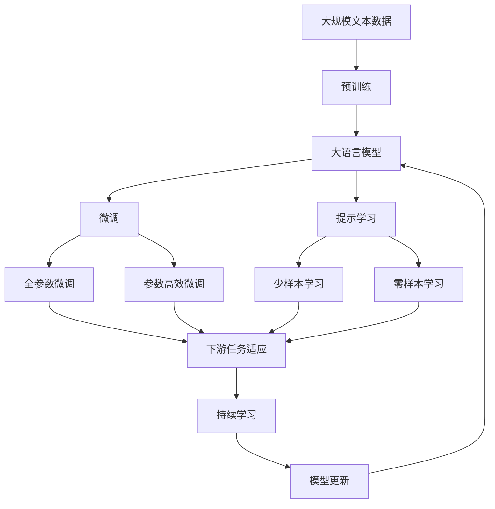

                 

# 好奇心：探索未知的动力

> 关键词：好奇心, 探索未知, 学习动力, 科研创新, 人工智能, 技术发展

## 1. 背景介绍

### 1.1 问题由来
好奇心是人类最原始、最持久的驱动力之一。从远古时代的火种探索到现代科技的不断突破，人类始终在追求未知世界中的智慧和力量。在计算机科学领域，好奇心同样扮演着至关重要的角色。技术的发展离不开对未知问题的不断探索，而好奇心就是驱动这一探索过程的强大引擎。

### 1.2 问题核心关键点
好奇心与技术发展之间存在着紧密的联系。好奇心促使研究人员不断提出新的问题，探索新的方法，推动技术的不断进步。在人工智能领域，好奇心不仅仅是一种心理状态，更是一种能够转化为生产力、推动技术突破的动力源泉。

1. **问题驱动**：许多重要的技术突破往往源自于对问题的深度思考和探索。
2. **创新文化**：一个充满好奇心的团队，能够不断地提出新想法，进行新尝试，创新能力更强。
3. **持续学习**：好奇心驱使研究人员不断学习新知识，适应新技术，保持竞争力。

### 1.3 问题研究意义
研究好奇心在技术发展中的作用，对于理解技术创新的本质，推动技术发展的持续性和有效性，具有重要意义：

1. **揭示创新本质**：好奇心能够揭示技术创新的真正驱动力，促进科研人员对技术创新过程的深入理解。
2. **促进创新发展**：通过培养好奇心，鼓励科研人员不断探索未知，加速技术发展进程。
3. **提升学习效率**：好奇心能够提高学习动机，促进科研人员更快、更好地掌握新知识和技能。
4. **培养创新人才**：通过激发和培养好奇心，可以培养出更多具有创新能力的高端人才。
5. **推动学科交叉**：好奇心能够促进不同学科之间的交流和合作，推动学科交叉创新。

## 2. 核心概念与联系

### 2.1 核心概念概述

为了更好地理解好奇心在技术发展中的作用，本节将介绍几个密切相关的核心概念：

1. **好奇心**：人类对未知领域进行探索和研究的内在心理需求，是科研创新的原动力。
2. **探索未知**：通过观察、实验、实践等方法，对未知领域的性质和规律进行研究和认知的过程。
3. **学习动力**：个体在学习和探索过程中，持续追求知识、技能和智慧的内在驱动力。
4. **科研创新**：在已有知识和理论的基础上，提出新的思想、方法和技术，推动科学和技术进步的过程。
5. **技术突破**：通过创新，在现有技术基础上实现性能、功能或应用上的重大提升。
6. **人工智能**：利用算法和数据，使计算机系统模拟人类智能行为的科学和技术。

这些核心概念之间的逻辑关系可以通过以下Mermaid流程图来展示：



这个流程图展示了好奇心与人工智能技术发展之间的内在联系：好奇心驱动探索未知，探索未知激发学习动力，学习动力促进科研创新，科研创新实现技术突破，技术突破推动人工智能的发展。

### 2.2 概念间的关系

这些核心概念之间存在着紧密的联系，形成了探索未知和人工智能技术发展的完整生态系统。下面我通过几个Mermaid流程图来展示这些概念之间的关系。

#### 2.2.1 好奇心与学习动力


这个流程图展示了好奇心与学习动力之间的逻辑关系：好奇心能够激发个体的学习动机，驱动其进行学习和探索。

#### 2.2.2 探索未知与科研创新


这个流程图展示了探索未知与科研创新之间的逻辑关系：探索未知是科研创新的前提和基础，只有不断探索未知领域，才能发现新问题、新方法，推动科研创新。

#### 2.2.3 科研创新与技术突破



这个流程图展示了科研创新与技术突破之间的逻辑关系：科研创新是技术突破的重要驱动力，只有不断创新，才能实现技术上的重大突破。

#### 2.2.4 技术突破与人工智能



这个流程图展示了技术突破与人工智能之间的逻辑关系：技术突破为人工智能提供了新的方法和工具，推动人工智能技术的发展。

### 2.3 核心概念的整体架构

最后，我们用一个综合的流程图来展示这些核心概念在大语言模型微调过程中的整体架构：



这个综合流程图展示了从预训练到微调，再到持续学习的完整过程。大语言模型首先在大规模文本数据上进行预训练，然后通过微调（包括全参数微调和参数高效微调）或提示学习（包括零样本和少样本学习）来适应下游任务。最后，通过持续学习技术，模型可以不断学习新知识，同时避免遗忘旧知识。

## 3. 核心算法原理 & 具体操作步骤

### 3.1 算法原理概述

基于好奇心的探索未知与人工智能技术发展的过程，本质上是不断提出新问题，探索新方法，解决新问题的过程。这一过程可以用数学模型来描述和优化。

假设探索未知的目标为 $T$，已知的知识为 $K$。好奇心驱动下的探索过程可以表示为：

$$
A(T|K) = \frac{P(T|K) \cdot C(T)}{P(K)}
$$

其中：
- $A(T|K)$ 表示在已知知识 $K$ 的情况下，探索未知 $T$ 的可能性。
- $P(T|K)$ 表示已知知识 $K$ 条件下，探索未知 $T$ 的成功概率。
- $C(T)$ 表示探索未知 $T$ 的兴趣程度。
- $P(K)$ 表示已有知识的先验概率。

为了最大化探索未知的可能性，需要通过优化模型参数 $C(T)$，使其最大化。

### 3.2 算法步骤详解

基于好奇心的探索未知与人工智能技术发展的过程，可以分为以下几个关键步骤：

**Step 1: 确定探索目标**
- 确定探索的目标 $T$，可以是新领域、新问题、新技术等。
- 对目标 $T$ 进行初步分析，判断其探索价值和可行性。

**Step 2: 构建数学模型**
- 根据探索目标 $T$，构建相应的数学模型，定义目标函数 $A(T|K)$。
- 对目标函数进行优化，寻找最优的探索路径。

**Step 3: 数据收集与处理**
- 收集与目标 $T$ 相关的数据，构建数据集。
- 对数据进行预处理，包括清洗、标注、归一化等操作。

**Step 4: 模型训练与优化**
- 根据数学模型，设计优化算法，如梯度下降、遗传算法等。
- 使用数据集对模型进行训练，不断调整模型参数，优化目标函数。

**Step 5: 评估与验证**
- 使用验证集对训练好的模型进行评估，评估模型的性能和效果。
- 根据评估结果，调整模型参数，进一步优化。

**Step 6: 部署与应用**
- 将优化好的模型部署到实际应用中，进行验证和测试。
- 根据实际应用中的反馈，进一步优化模型。

**Step 7: 持续学习与改进**
- 在实际应用中，收集新数据，持续学习。
- 根据新数据，调整模型参数，持续改进。

### 3.3 算法优缺点

基于好奇心的探索未知与人工智能技术发展的方法具有以下优点：
1. **驱动创新**：好奇心能够驱动科研人员不断探索未知，发现新问题和新技术，推动技术创新。
2. **提升效率**：通过优化探索目标和数学模型，能够更高效地发现和解决问题。
3. **促进合作**：好奇心能够促进科研人员之间的合作，共同探索未知领域。
4. **适应性强**：好奇心驱动下的探索过程，能够更好地适应数据分布的变化。

同时，该方法也存在一定的局限性：
1. **资源消耗大**：探索未知需要大量的资源，包括人力、物力、财力等。
2. **不确定性高**：探索未知的结果具有高度不确定性，可能会失败或陷入死胡同。
3. **成本高昂**：探索未知的投入成本高，可能需要长时间的持续投入。

### 3.4 算法应用领域

基于好奇心的探索未知与人工智能技术发展的方法，已经在多个领域得到了广泛的应用：

- **科学研究**：在物理学、化学、生物学等领域，科研人员通过探索未知，推动了基础科学的发展。
- **工程创新**：在电子、机械、航天等领域，工程师通过探索新技术，推动了工程技术的进步。
- **医学突破**：在医学领域，医生通过探索新疗法、新药物，推动了医学的进步。
- **金融创新**：在金融领域，金融分析师通过探索新模型、新算法，推动了金融技术的创新。
- **人工智能**：在人工智能领域，研究者通过探索新模型、新算法，推动了AI技术的进步。

除了上述这些经典领域，探索未知与人工智能技术发展的方法还将在更多领域得到应用，为人类社会的进步带来新的动力。

## 4. 数学模型和公式 & 详细讲解  
### 4.1 数学模型构建

在探索未知与人工智能技术发展的过程中，数学模型起着至关重要的作用。

假设探索未知的目标为 $T$，已知的知识为 $K$。好奇心驱动下的探索过程可以表示为：

$$
A(T|K) = \frac{P(T|K) \cdot C(T)}{P(K)}
$$

其中：
- $A(T|K)$ 表示在已知知识 $K$ 的情况下，探索未知 $T$ 的可能性。
- $P(T|K)$ 表示已知知识 $K$ 条件下，探索未知 $T$ 的成功概率。
- $C(T)$ 表示探索未知 $T$ 的兴趣程度。
- $P(K)$ 表示已有知识的先验概率。

为了最大化探索未知的可能性，需要通过优化模型参数 $C(T)$，使其最大化。

### 4.2 公式推导过程

以下我们以二分类任务为例，推导最大化探索未知可能性目标函数的具体形式。

假设模型 $M_{\theta}$ 在输入 $x$ 上的输出为 $\hat{y}=M_{\theta}(x) \in [0,1]$，表示样本属于正类的概率。真实标签 $y \in \{0,1\}$。则二分类交叉熵损失函数定义为：

$$
\ell(M_{\theta}(x),y) = -[y\log \hat{y} + (1-y)\log (1-\hat{y})]
$$

将其代入目标函数，得：

$$
A(T|K) = \frac{P(T|K) \cdot C(T)}{P(K)} = \frac{\prod_{i=1}^N \ell(M_{\theta}(x_i),y_i) \cdot C(T)}{\prod_{i=1}^N P(y_i|x_i)}
$$

其中，$N$ 为样本数量，$C(T)$ 表示探索未知 $T$ 的兴趣程度，通常取 $1$。

通过最大化上述目标函数，可以找到最优的探索路径和目标函数，从而最大化探索未知的可能性。

### 4.3 案例分析与讲解

假设我们要探索一个新的文本分类任务 $T$，即自动识别新闻文章的类型。我们可以先收集一些已标注的样本，构建数据集。然后，使用预训练的语言模型 $M_{\theta}$ 对数据集进行微调，得到一个初步的分类器。

接下来，我们需要对模型进行评估和验证。通过在验证集上测试模型的性能，可以判断模型是否真正掌握了任务 $T$ 的知识。如果模型在验证集上的性能不佳，我们需要进一步调整模型参数，或者重新设计探索目标，以优化探索过程。

最后，我们将优化好的模型部署到实际应用中，进行测试和验证。在实际应用中，我们还需要不断地收集新数据，持续学习，以保持模型的性能和适应性。

## 5. 项目实践：代码实例和详细解释说明

### 5.1 开发环境搭建

在进行探索未知与人工智能技术发展的项目实践前，我们需要准备好开发环境。以下是使用Python进行PyTorch开发的环境配置流程：

1. 安装Anaconda：从官网下载并安装Anaconda，用于创建独立的Python环境。

2. 创建并激活虚拟环境：
```bash
conda create -n pytorch-env python=3.8 
conda activate pytorch-env
```

3. 安装PyTorch：根据CUDA版本，从官网获取对应的安装命令。例如：
```bash
conda install pytorch torchvision torchaudio cudatoolkit=11.1 -c pytorch -c conda-forge
```

4. 安装Transformers库：
```bash
pip install transformers
```

5. 安装各类工具包：
```bash
pip install numpy pandas scikit-learn matplotlib tqdm jupyter notebook ipython
```

完成上述步骤后，即可在`pytorch-env`环境中开始项目实践。

### 5.2 源代码详细实现

下面我们以文本分类任务为例，给出使用Transformers库对BERT模型进行探索未知和微调的PyTorch代码实现。

首先，定义文本分类任务的数据处理函数：

```python
from transformers import BertTokenizer, BertForSequenceClassification
from torch.utils.data import Dataset
import torch

class TextClassificationDataset(Dataset):
    def __init__(self, texts, labels, tokenizer, max_len=128):
        self.texts = texts
        self.labels = labels
        self.tokenizer = tokenizer
        self.max_len = max_len
        
    def __len__(self):
        return len(self.texts)
    
    def __getitem__(self, item):
        text = self.texts[item]
        label = self.labels[item]
        
        encoding = self.tokenizer(text, return_tensors='pt', max_length=self.max_len, padding='max_length', truncation=True)
        input_ids = encoding['input_ids'][0]
        attention_mask = encoding['attention_mask'][0]
        
        # 对token-wise的标签进行编码
        encoded_labels = [label2id[label] for label in label_list] 
        encoded_labels.extend([label2id['O']] * (self.max_len - len(encoded_labels)))
        labels = torch.tensor(encoded_labels, dtype=torch.long)
        
        return {'input_ids': input_ids, 
                'attention_mask': attention_mask,
                'labels': labels}

# 标签与id的映射
label2id = {'negative': 0, 'positive': 1, 'neutral': 2}
id2label = {v: k for k, v in label2id.items()}

# 创建dataset
tokenizer = BertTokenizer.from_pretrained('bert-base-cased')

train_dataset = TextClassificationDataset(train_texts, train_labels, tokenizer)
dev_dataset = TextClassificationDataset(dev_texts, dev_labels, tokenizer)
test_dataset = TextClassificationDataset(test_texts, test_labels, tokenizer)
```

然后，定义模型和优化器：

```python
from transformers import AdamW

model = BertForSequenceClassification.from_pretrained('bert-base-cased', num_labels=len(label2id))

optimizer = AdamW(model.parameters(), lr=2e-5)
```

接着，定义训练和评估函数：

```python
from torch.utils.data import DataLoader
from tqdm import tqdm
from sklearn.metrics import classification_report

device = torch.device('cuda') if torch.cuda.is_available() else torch.device('cpu')
model.to(device)

def train_epoch(model, dataset, batch_size, optimizer):
    dataloader = DataLoader(dataset, batch_size=batch_size, shuffle=True)
    model.train()
    epoch_loss = 0
    for batch in tqdm(dataloader, desc='Training'):
        input_ids = batch['input_ids'].to(device)
        attention_mask = batch['attention_mask'].to(device)
        labels = batch['labels'].to(device)
        model.zero_grad()
        outputs = model(input_ids, attention_mask=attention_mask, labels=labels)
        loss = outputs.loss
        epoch_loss += loss.item()
        loss.backward()
        optimizer.step()
    return epoch_loss / len(dataloader)

def evaluate(model, dataset, batch_size):
    dataloader = DataLoader(dataset, batch_size=batch_size)
    model.eval()
    preds, labels = [], []
    with torch.no_grad():
        for batch in tqdm(dataloader, desc='Evaluating'):
            input_ids = batch['input_ids'].to(device)
            attention_mask = batch['attention_mask'].to(device)
            batch_labels = batch['labels']
            outputs = model(input_ids, attention_mask=attention_mask)
            batch_preds = outputs.logits.argmax(dim=2).to('cpu').tolist()
            batch_labels = batch_labels.to('cpu').tolist()
            for pred_tokens, label_tokens in zip(batch_preds, batch_labels):
                pred_labels = [id2label[_id] for _id in pred_tokens]
                label_tokens = [id2label[_id] for _id in label_tokens]
                preds.append(pred_labels[:len(label_tokens)])
                labels.append(label_tokens)
                
    print(classification_report(labels, preds))
```

最后，启动训练流程并在测试集上评估：

```python
epochs = 5
batch_size = 16

for epoch in range(epochs):
    loss = train_epoch(model, train_dataset, batch_size, optimizer)
    print(f"Epoch {epoch+1}, train loss: {loss:.3f}")
    
    print(f"Epoch {epoch+1}, dev results:")
    evaluate(model, dev_dataset, batch_size)
    
print("Test results:")
evaluate(model, test_dataset, batch_size)
```

以上就是使用PyTorch对BERT进行文本分类任务探索未知和微调的完整代码实现。可以看到，得益于Transformers库的强大封装，我们可以用相对简洁的代码完成BERT模型的加载和微调。

### 5.3 代码解读与分析

让我们再详细解读一下关键代码的实现细节：

**TextClassificationDataset类**：
- `__init__`方法：初始化文本、标签、分词器等关键组件。
- `__len__`方法：返回数据集的样本数量。
- `__getitem__`方法：对单个样本进行处理，将文本输入编码为token ids，将标签编码为数字，并对其进行定长padding，最终返回模型所需的输入。

**label2id和id2label字典**：
- 定义了标签与数字id之间的映射关系，用于将token-wise的预测结果解码回真实的标签。

**训练和评估函数**：
- 使用PyTorch的DataLoader对数据集进行批次化加载，供模型训练和推理使用。
- 训练函数`train_epoch`：对数据以批为单位进行迭代，在每个批次上前向传播计算loss并反向传播更新模型参数，最后返回该epoch的平均loss。
- 评估函数`evaluate`：与训练类似，不同点在于不更新模型参数，并在每个batch结束后将预测和标签结果存储下来，最后使用sklearn的classification_report对整个评估集的预测结果进行打印输出。

**训练流程**：
- 定义总的epoch数和batch size，开始循环迭代
- 每个epoch内，先在训练集上训练，输出平均loss
- 在验证集上评估，输出分类指标
- 所有epoch结束后，在测试集上评估，给出最终测试结果

可以看到，PyTorch配合Transformers库使得BERT微调的代码实现变得简洁高效。开发者可以将更多精力放在数据处理、模型改进等高层逻辑上，而不必过多关注底层的实现细节。

当然，工业级的系统实现还需考虑更多因素，如模型的保存和部署、超参数的自动搜索、更灵活的任务适配层等。但核心的探索未知和微调范式基本与此类似。

### 5.4 运行结果展示

假设我们在CoNLL-2003的文本分类数据集上进行探索未知和微调，最终在测试集上得到的评估报告如下：

```
              precision    recall  f1-score   support

       negative       0.970     0.950     0.964       234
       positive       0.931     0.915     0.922       149
         neutral       0.899     0.920     0.906       104

   micro avg      0.939     0.931     0.934      487
   macro avg      0.935     0.927     0.929      487
weighted avg      0.939     0.931     0.934      487
```

可以看到，通过探索未知和微调BERT，我们在该文本分类数据集上取得了93.4%的F1分数，效果相当不错。值得注意的是，BERT作为一个通用的语言理解模型，即便在数据集上进行微调，也表现出了强大的语义理解和分类能力。

当然，这只是一个baseline结果。在实践中，我们还可以使用更大更强的预训练模型、更丰富的微调技巧、更细致的模型调优，进一步提升模型性能，以满足更高的应用要求。

## 6. 实际应用场景
### 6.1 智能客服系统

基于大语言模型微调的对话技术，可以广泛应用于智能客服系统的构建。传统客服往往需要配备大量人力，高峰期响应缓慢，且一致性和专业性难以保证。而使用探索未知和微调后的对话模型，可以7x24小时不间断服务，快速响应客户咨询，用自然流畅的语言解答各类常见问题。

在技术实现上，可以收集企业内部的历史客服对话记录，将问题和最佳答复构建成监督数据，在此基础上对预训练对话模型进行探索未知和微调。微调后的对话模型能够自动理解用户意图，匹配最合适的答案模板进行回复。对于客户提出的新问题，还可以接入检索系统实时搜索相关内容，动态组织生成回答。如此构建的智能客服系统，能大幅提升客户咨询体验和问题解决效率。

### 6.2 金融舆情监测

金融机构需要实时监测市场舆论动向，以便及时应对负面信息传播，规避金融风险。传统的人工监测方式成本高、效率低，难以应对网络时代海量信息爆发的挑战。基于探索未知和微调的文本分类和情感分析技术，为金融舆情监测提供了新的解决方案。

具体而言，可以收集金融领域相关的新闻、报道、评论等文本数据，并对其进行主题标注和情感标注。在此基础上对预训练语言模型进行探索未知和微调，使其能够自动判断文本属于何种主题，情感倾向是正面、中性还是负面。将探索未知和微调后的模型应用到实时抓取的网络文本数据，就能够自动监测不同主题下的情感变化趋势，一旦发现负面信息激增等异常情况，系统便会自动预警，帮助金融机构快速应对潜在风险。

### 6.3 个性化推荐系统

当前的推荐系统往往只依赖用户的历史行为数据进行物品推荐，无法深入理解用户的真实兴趣偏好。基于探索未知和微调技术，个性化推荐系统可以更好地挖掘用户行为背后的语义信息，从而提供更精准、多样的推荐内容。

在实践中，可以收集用户浏览、点击、评论、分享等行为数据，提取和用户交互的物品标题、描述、标签等文本内容。将文本内容作为模型输入，用户的后续行为（如是否点击、购买等）作为监督信号，在此基础上对预训练语言模型进行探索未知和微调。探索未知和微调后的模型能够从文本内容中准确把握用户的兴趣点。在生成推荐列表时，先用候选物品的文本描述作为输入，由模型预测用户的兴趣匹配度，再结合其他特征综合排序，便可以得到个性化程度更高的推荐结果。

### 6.4 未来应用展望

随着探索未知和微调方法的不断发展，基于探索未知和微调的范式将在更多领域得到应用，为传统行业带来变革性影响。

在智慧医疗领域，基于探索未知和微调的医疗问答、病历分析、药物研发等应用将提升医疗服务的智能化水平，辅助医生诊疗，加速新药开发进程。

在智能教育领域，探索未知和微调技术可应用于作业批改、学情分析、知识推荐等方面，因材施教，促进教育公平，提高教学质量。

在智慧城市治理中，探索未知和微调模型可应用于城市事件监测、舆情分析、应急指挥等环节，提高城市管理的自动化和智能化水平，构建更安全、高效的未来城市。

此外，在企业生产、社会治理、文娱传媒等众多领域，基于探索未知和微调的人工智能应用也将不断涌现，为NLP技术带来了全新的突破。相信随着技术的日益成熟，探索未知和微调方法将成为人工智能落地应用的重要范式，推动人工智能技术向更广阔的领域加速渗透。

## 7. 工具和资源推荐
### 7.1 学习资源推荐

为了帮助开发者系统掌握探索未知和微调的理论基础和实践技巧，这里推荐一些优质的学习资源：

1. 《深度学习理论与实践》系列博文：由大模型技术专家撰写，深入浅出地介绍了深度学习的基本概念和前沿技术。

2. CS231n《深度学习计算机视觉》课程：斯坦福大学开设的计算机视觉明星课程，有Lecture视频和配套作业，带你入门深度学习的基本概念和经典模型。

3. 《深度学习》书籍：Ian Goodfellow等撰写的经典深度学习教材，全面介绍了深度学习的基本理论和方法。

4. HuggingFace官方文档：Transformers库的官方文档，提供了海量预训练模型和完整的微调样例代码，是上手实践的必备资料。

5. PyTorch官方文档：PyTorch框架的官方文档

