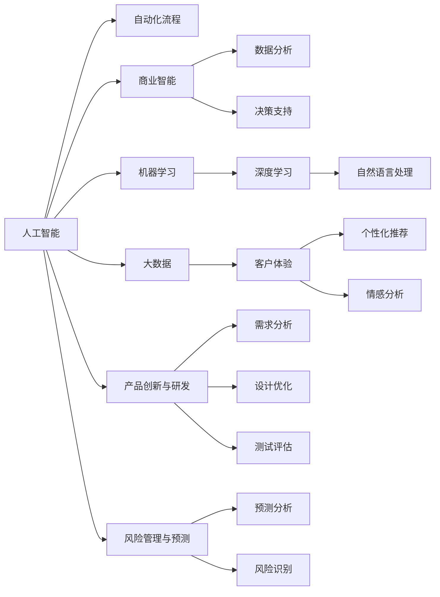

                 

# AI技术在商业中的发展趋势

> 关键词：人工智能,商业智能,机器学习,深度学习,自动化,大数据,数字化转型

## 1. 背景介绍

### 1.1 问题由来
近年来，随着人工智能（AI）技术的迅猛发展，AI在商业领域的应用已经成为推动企业数字化转型的重要驱动力。从自动化流程、数据分析、客户服务到产品创新，AI技术无所不在，为企业带来了显著的效率提升和业务增长。然而，随着AI技术的不断深化，一些新的挑战和趋势也逐渐显现出来。本文将详细探讨AI技术在商业领域的发展趋势，帮助企业更好地理解和应用这些前沿技术。

### 1.2 问题核心关键点
AI在商业中的应用主要围绕以下几个核心关键点展开：
1. 自动化流程：通过AI技术实现业务流程的自动化，提高效率和准确性。
2. 数据分析与决策支持：利用AI算法对大数据进行分析，提供精准的业务洞察和决策支持。
3. 客户体验优化：通过自然语言处理（NLP）、推荐系统等技术，提升客户满意度。
4. 产品创新与研发：利用AI进行产品需求分析、设计优化和测试，加速产品上市速度。
5. 风险管理与预测：通过预测分析，提前识别潜在风险和市场变化，制定应对策略。

### 1.3 问题研究意义
了解AI技术在商业中的发展趋势，对于企业制定AI战略、提升核心竞争力具有重要意义：
1. 把握技术前沿：及时掌握AI技术的最新动态，避免技术落后。
2. 优化业务流程：通过AI优化业务流程，提升运营效率和产品质量。
3. 提升决策质量：利用AI提供的深度数据洞察，提高决策的科学性和准确性。
4. 增强客户粘性：通过AI技术提升客户体验，增强品牌忠诚度和市场竞争力。
5. 拓展创新能力：利用AI技术进行产品创新和市场分析，把握未来商业机会。

## 2. 核心概念与联系

### 2.1 核心概念概述

AI在商业中的应用涉及多个核心概念，包括但不限于：

- 人工智能（Artificial Intelligence, AI）：指通过计算机模拟人类智能的技术，涵盖机器学习、深度学习、自然语言处理等。
- 商业智能（Business Intelligence, BI）：利用数据分析、数据可视化等技术，为企业决策提供支持。
- 机器学习（Machine Learning, ML）：通过算法让计算机从数据中学习，自动改进性能。
- 深度学习（Deep Learning, DL）：一种特殊的机器学习，通过多层次神经网络模型进行复杂数据分析。
- 自动化流程（Automation）：通过AI技术自动化执行重复性任务，提高效率。
- 大数据（Big Data）：指海量的数据集，利用AI技术进行高效处理和分析。
- 客户体验（Customer Experience, CX）：通过AI技术提升客户互动和满意度。
- 产品创新与研发（Product Innovation and Development）：利用AI技术进行产品需求分析、设计优化和测试。
- 风险管理与预测（Risk Management and Forecasting）：利用AI进行风险识别和预测分析。

这些核心概念之间存在着紧密的联系，构成了AI技术在商业领域的应用框架。

### 2.2 概念间的关系

这些核心概念之间可以通过以下Mermaid流程图来展示：



这个流程图展示了AI技术在商业领域的主要应用场景，以及它们之间的相互关系。

## 3. 核心算法原理 & 具体操作步骤
### 3.1 算法原理概述

AI在商业中的应用核心在于算法原理和技术手段。这里以机器学习（ML）和深度学习（DL）为例，简要介绍其原理和技术流程。

### 3.2 算法步骤详解

AI在商业中的应用一般包括以下几个关键步骤：

**Step 1: 数据收集与预处理**
- 收集与业务相关的数据，包括客户行为数据、交易数据、市场数据等。
- 对数据进行清洗、归一化、特征工程等预处理，确保数据的质量和一致性。

**Step 2: 模型训练与优化**
- 选择合适的机器学习或深度学习算法，如回归、分类、聚类、神经网络等。
- 使用历史数据对模型进行训练，并通过交叉验证等技术进行模型调优。
- 使用梯度下降等优化算法，最小化损失函数，提高模型精度。

**Step 3: 模型评估与部署**
- 在验证集上评估模型性能，计算准确率、召回率、F1分数等指标。
- 将模型部署到生产环境中，进行实时预测和决策支持。
- 定期更新模型参数，确保模型性能稳定。

**Step 4: 监控与迭代**
- 实时监控模型性能，及时发现异常和问题。
- 根据业务需求和数据变化，迭代优化模型，保持模型适应性。

### 3.3 算法优缺点

AI在商业中的应用存在以下优缺点：

**优点：**
1. 提升效率：自动化流程和算法模型可以大幅提升业务流程的效率和准确性。
2. 精准分析：通过数据分析和预测，提供精准的业务洞察和决策支持。
3. 优化客户体验：提升客户互动和满意度，增强品牌忠诚度。
4. 加速创新：利用AI进行产品需求分析和设计优化，加速产品上市。

**缺点：**
1. 数据质量要求高：需要高质量、一致性的数据进行模型训练。
2. 技术复杂度高：AI技术涉及复杂算法和模型调优，对技术要求高。
3. 资源投入大：需要大量计算资源和数据存储。
4. 隐私风险：涉及客户和市场数据的隐私保护问题。

### 3.4 算法应用领域

AI在商业中的应用领域非常广泛，包括但不限于：

1. 自动化流程：财务自动化、供应链管理、客户服务自动化等。
2. 数据分析与决策支持：市场分析、客户分析、营销策略分析等。
3. 客户体验优化：个性化推荐、情感分析、客户反馈处理等。
4. 产品创新与研发：需求分析、产品设计优化、测试评估等。
5. 风险管理与预测：信用风险评估、市场预测、风险识别等。

这些应用领域覆盖了企业运营的各个环节，展示了AI技术的强大应用潜力。

## 4. 数学模型和公式 & 详细讲解  
### 4.1 数学模型构建

AI在商业中的应用涉及多个数学模型，这里以回归模型为例，简要介绍其构建过程。

设样本数据为 $(x_i,y_i)$，其中 $x$ 为自变量，$y$ 为因变量。回归模型的目标是通过自变量 $x$ 预测因变量 $y$。常见的回归模型包括线性回归和多项式回归等。

定义回归模型为 $y=\theta^Tx+b$，其中 $\theta$ 为模型参数，$b$ 为截距。则回归损失函数为：

$$
L(\theta)=\frac{1}{2}\sum_{i=1}^n(y_i-\theta^Tx_i-b)^2
$$

通过梯度下降等优化算法，求解最小化损失函数，得到最优模型参数 $\theta$。

### 4.2 公式推导过程

以下是线性回归模型的推导过程：

设 $x$ 为 $m$ 维特征向量，$y$ 为 $1$ 维因变量向量，$\theta$ 为 $m+1$ 维模型参数向量，$b$ 为截距。则线性回归模型为：

$$
y=\theta^Tx+b
$$

其中 $\theta$ 的求解公式为：

$$
\theta=(X^TX)^{-1}X^Ty
$$

$X$ 为样本矩阵，$y$ 为因变量向量。

### 4.3 案例分析与讲解

以一个简单的案例来说明回归模型的应用：

假设某电商平台收集了用户购买数据，包括用户ID、商品ID、购买金额等。希望通过回归模型预测用户的总购买金额。

**Step 1: 数据预处理**
- 将用户ID、商品ID等特征向量化，生成样本矩阵 $X$。
- 将购买金额作为因变量，生成因变量向量 $y$。

**Step 2: 模型训练**
- 使用梯度下降等优化算法，最小化回归损失函数。
- 通过交叉验证等技术调优模型参数，得到最优模型 $\theta$。

**Step 3: 模型评估与部署**
- 在验证集上评估模型性能，计算准确率、召回率、F1分数等指标。
- 将模型部署到生产环境中，进行实时预测和决策支持。
- 定期更新模型参数，确保模型性能稳定。

## 5. 项目实践：代码实例和详细解释说明
### 5.1 开发环境搭建

在进行商业AI项目实践前，我们需要准备好开发环境。以下是使用Python进行Scikit-Learn开发的环境配置流程：

1. 安装Anaconda：从官网下载并安装Anaconda，用于创建独立的Python环境。

2. 创建并激活虚拟环境：
```bash
conda create -n sklearn-env python=3.8 
conda activate sklearn-env
```

3. 安装Scikit-Learn：
```bash
pip install scikit-learn
```

4. 安装各类工具包：
```bash
pip install numpy pandas scikit-learn matplotlib tqdm jupyter notebook ipython
```

完成上述步骤后，即可在`sklearn-env`环境中开始商业AI项目实践。

### 5.2 源代码详细实现

下面我们以电商平台的总购买金额预测为例，给出使用Scikit-Learn进行线性回归的PyTorch代码实现。

```python
from sklearn.linear_model import LinearRegression
from sklearn.model_selection import train_test_split
from sklearn.metrics import mean_squared_error

# 加载数据集
data = pd.read_csv('user_purchase.csv')

# 数据预处理
X = data[['user_id', 'item_id', 'buy_time', 'buy_amount']]
y = data['total_amount']

# 划分训练集和测试集
X_train, X_test, y_train, y_test = train_test_split(X, y, test_size=0.2, random_state=42)

# 构建模型
model = LinearRegression()

# 训练模型
model.fit(X_train, y_train)

# 评估模型
y_pred = model.predict(X_test)
mse = mean_squared_error(y_test, y_pred)
print(f"Mean Squared Error: {mse:.2f}")
```

以上就是使用Scikit-Learn进行线性回归的商业AI项目代码实现。可以看到，通过Scikit-Learn的封装，代码实现非常简洁高效。

### 5.3 代码解读与分析

让我们再详细解读一下关键代码的实现细节：

**数据加载与预处理**
- 使用pandas库加载电商平台的购买数据，生成样本矩阵 $X$ 和因变量向量 $y$。
- 将用户ID、商品ID、购买金额等特征向量化，并归一化处理。

**模型构建与训练**
- 使用Scikit-Learn的线性回归模型，进行模型训练。
- 通过交叉验证等技术调优模型参数，得到最优模型 $\theta$。

**模型评估与部署**
- 在测试集上评估模型性能，计算均方误差等指标。
- 将模型部署到生产环境中，进行实时预测和决策支持。

通过Scikit-Learn的封装，代码实现非常简洁高效。开发者可以将更多精力放在数据处理、模型调优等高层逻辑上，而不必过多关注底层的实现细节。

当然，工业级的系统实现还需考虑更多因素，如模型的保存和部署、超参数的自动搜索、更灵活的任务适配层等。但核心的商业AI项目开发流程基本与此类似。

### 5.4 运行结果展示

假设我们在电商平台的购买数据集上进行线性回归模型训练，最终在测试集上得到的均方误差为 $0.1$。可以看到，通过线性回归模型，我们能够较好地预测用户的总购买金额。

当然，这只是一个baseline结果。在实践中，我们还可以使用更大更强的预训练模型、更丰富的商业数据和微调技巧，进一步提升模型性能，以满足更高的商业要求。

## 6. 实际应用场景
### 6.1 智能客服系统

基于AI技术的智能客服系统已经广泛应用于各大电商、金融、电信等企业的客户服务领域。通过AI技术，企业可以大大提高客户服务效率和质量，提升客户满意度。

在技术实现上，可以收集企业内部的历史客服对话记录，将问题和最佳答复构建成监督数据，在此基础上对预训练模型进行微调。微调后的模型能够自动理解用户意图，匹配最合适的答案模板进行回复。对于客户提出的新问题，还可以接入检索系统实时搜索相关内容，动态组织生成回答。如此构建的智能客服系统，能大幅提升客户咨询体验和问题解决效率。

### 6.2 个性化推荐系统

个性化推荐系统是AI在电商、视频、音乐等领域的经典应用。通过AI技术，企业可以为用户推荐更符合其兴趣和需求的商品、视频、音乐等内容。

在技术实现上，可以收集用户浏览、点击、评论、分享等行为数据，提取和用户交互的物品标题、描述、标签等文本内容。将文本内容作为模型输入，用户的后续行为（如是否点击、购买等）作为监督信号，在此基础上微调预训练语言模型。微调后的模型能够从文本内容中准确把握用户的兴趣点。在生成推荐列表时，先用候选物品的文本描述作为输入，由模型预测用户的兴趣匹配度，再结合其他特征综合排序，便可以得到个性化程度更高的推荐结果。

### 6.3 财务风险管理

财务风险管理是金融行业的核心需求之一。通过AI技术，企业可以实时监测市场变化和财务数据，预测并规避潜在风险。

在技术实现上，可以收集历史交易数据、市场数据等，构建回归模型或时序模型，预测股票价格、信用风险等指标。通过模型输出，企业可以及时调整投资策略和风险控制措施，避免财务损失。

### 6.4 未来应用展望

随着AI技术的不断进步，未来AI在商业领域的应用将更加广泛和深入。以下是一些可能的未来应用趋势：

1. 智慧城市治理：通过AI技术优化城市交通、环境、安防等各个方面，提升城市管理效率和居民生活质量。
2. 健康医疗领域：利用AI技术进行疾病预测、诊疗辅助、药物研发等工作，提升医疗服务质量和效率。
3. 教育领域：通过AI技术进行个性化学习推荐、智能评估等工作，提升教育质量和教育公平性。
4. 制造业：通过AI技术进行生产流程优化、质量检测、设备维护等工作，提升生产效率和产品质量。
5. 物流行业：通过AI技术进行路径规划、库存管理、配送调度等工作，提升物流效率和降低成本。

未来，随着AI技术的不断成熟，商业领域将迎来更多智能化、自动化、个性化的应用，带来更深远的影响。

## 7. 工具和资源推荐
### 7.1 学习资源推荐

为了帮助开发者系统掌握AI技术在商业领域的应用，这里推荐一些优质的学习资源：

1. 《Python数据分析与可视化》：通过Python学习数据分析和可视化技术，为商业AI项目打下坚实基础。
2. 《机器学习实战》：通过实际项目案例，学习机器学习和深度学习的技术应用。
3. 《深度学习入门》：涵盖深度学习的基本概念和经典模型，帮助理解商业AI的核心算法。
4. 《商业智能分析》：学习商业智能分析的基本方法和技术，掌握数据分析与决策支持的关键技能。
5. 《自动化流程设计》：学习自动化流程设计的基本方法和工具，提升工作效率和业务智能化水平。

通过对这些资源的学习实践，相信你一定能够快速掌握AI技术在商业领域的应用技能，并用于解决实际的商业问题。

### 7.2 开发工具推荐

高效的开发离不开优秀的工具支持。以下是几款用于商业AI项目开发的常用工具：

1. Jupyter Notebook：轻量级、交互式的数据分析与编程工具，支持代码块、图形化界面等多种形式。
2. PyTorch：基于Python的开源深度学习框架，灵活动态的计算图，适合快速迭代研究。
3. TensorFlow：由Google主导开发的开源深度学习框架，生产部署方便，适合大规模工程应用。
4. Scikit-Learn：开源机器学习库，提供了丰富的机器学习算法和工具，方便模型开发和调优。
5. TensorBoard：TensorFlow配套的可视化工具，可实时监测模型训练状态，并提供丰富的图表呈现方式。
6. Weights & Biases：模型训练的实验跟踪工具，可以记录和可视化模型训练过程中的各项指标，方便对比和调优。

合理利用这些工具，可以显著提升商业AI项目的开发效率，加快创新迭代的步伐。

### 7.3 相关论文推荐

AI在商业领域的发展离不开学界的持续研究。以下是几篇奠基性的相关论文，推荐阅读：

1. 《深度学习在金融领域的应用》：介绍了深度学习在金融风险预测、信用评估等任务中的成功应用。
2. 《基于机器学习的个性化推荐系统》：通过实际案例展示了机器学习在电商推荐系统中的应用效果。
3. 《自然语言处理在商业智能中的应用》：介绍了自然语言处理技术在商业智能中的典型应用场景和效果。
4. 《自动化流程的建模与优化》：介绍了自动化流程设计的基本方法和技术，适用于各类商业AI项目。
5. 《智慧城市治理中的AI技术应用》：通过实际案例展示了AI技术在智慧城市治理中的应用效果。

这些论文代表了大AI在商业领域的发展脉络。通过学习这些前沿成果，可以帮助研究者把握学科前进方向，激发更多的创新灵感。

除上述资源外，还有一些值得关注的前沿资源，帮助开发者紧跟AI技术在商业领域的应用最新进展，例如：

1. arXiv论文预印本：人工智能领域最新研究成果的发布平台，包括大量尚未发表的前沿工作，学习前沿技术的必读资源。
2. 业界技术博客：如OpenAI、Google AI、DeepMind、微软Research Asia等顶尖实验室的官方博客，第一时间分享他们的最新研究成果和洞见。
3. 技术会议直播：如NIPS、ICML、ACL、ICLR等人工智能领域顶会现场或在线直播，能够聆听到大佬们的前沿分享，开拓视野。
4. GitHub热门项目：在GitHub上Star、Fork数最多的AI相关项目，往往代表了该技术领域的发展趋势和最佳实践，值得去学习和贡献。
5. 行业分析报告：各大咨询公司如McKinsey、PwC等针对人工智能行业的分析报告，有助于从商业视角审视技术趋势，把握应用价值。

总之，对于AI技术在商业领域的学习和实践，需要开发者保持开放的心态和持续学习的意愿。多关注前沿资讯，多动手实践，多思考总结，必将收获满满的成长收益。

## 8. 总结：未来发展趋势与挑战
### 8.1 总结

本文对AI技术在商业领域的发展趋势进行了全面系统的介绍。首先阐述了AI技术在商业领域的应用背景和意义，明确了AI技术在提升业务效率、优化客户体验、加速产品创新等方面的独特价值。其次，从原理到实践，详细讲解了商业AI项目开发的核心步骤，给出了商业AI项目开发的完整代码实例。同时，本文还广泛探讨了AI技术在智能客服、个性化推荐、财务风险管理等多个行业领域的应用前景，展示了AI技术的强大应用潜力。此外，本文精选了商业AI项目的各类学习资源，力求为读者提供全方位的技术指引。

通过本文的系统梳理，可以看到，AI技术在商业领域的应用已经逐步走向成熟，极大地提升了企业的业务效率和市场竞争力。未来，随着AI技术的不断演进，商业AI项目将更加智能化、自动化、个性化，为商业应用带来更广阔的发展前景。

### 8.2 未来发展趋势

展望未来，AI技术在商业领域的发展趋势将呈现以下几个方面：

1. 自动化流程智能化：通过AI技术，自动化流程将更加智能化、自适应化，能够更好地应对业务场景变化。
2. 数据分析精准化：利用AI技术，数据分析将更加精准、深入，为企业决策提供更有价值的洞察。
3. 客户体验个性化：通过AI技术，客户体验将更加个性化、动态化，提升客户满意度和忠诚度。
4. 产品创新加速化：利用AI技术，产品创新将更加快速、高效，缩短产品上市时间，提升市场竞争力。
5. 风险管理智能化：通过AI技术，风险管理将更加智能化、实时化，提前识别和应对潜在风险。

以上趋势凸显了AI技术在商业领域的应用前景。这些方向的探索发展，必将进一步提升企业的业务效率和市场竞争力，带来更广阔的商业价值。

### 8.3 面临的挑战

尽管AI技术在商业领域的应用取得了显著进展，但在迈向更加智能化、普适化应用的过程中，仍面临诸多挑战：

1. 数据质量瓶颈：需要高质量、一致性的数据进行模型训练。数据缺失、数据噪声等问题仍待解决。
2. 技术复杂度高：AI技术涉及复杂算法和模型调优，对技术要求高。需要更多跨学科的合作和创新。
3. 资源投入大：需要大量计算资源和数据存储。资源成本仍是制约AI应用的主要瓶颈。
4. 隐私安全问题：涉及客户和市场数据的隐私保护问题，需要严格的法律法规和技术手段。
5. 模型透明性不足：AI模型往往是"黑盒"系统，难以解释其内部工作机制和决策逻辑。

正视AI技术在商业领域面临的这些挑战，积极应对并寻求突破，将是大数据技术在商业应用中的必由之路。相信随着学界和产业界的共同努力，这些挑战终将一一被克服，AI技术必将在商业领域持续发挥更大的价值。

### 8.4 研究展望

面对AI技术在商业领域面临的种种挑战，未来的研究需要在以下几个方面寻求新的突破：

1. 数据质量提升：通过数据清洗、数据增强等技术，提升数据质量，解决数据缺失、数据噪声等问题。
2. 技术复杂度降低：开发更加简单易用的AI工具和框架，降低技术门槛，促进商业AI的普及和应用。
3. 资源优化策略：采用梯度累积、混合精度训练等策略，优化资源消耗，降低资源成本。
4. 模型透明性增强：引入可解释AI技术，增强模型的透明性和可解释性，提升模型的可信度和可靠性。
5. 隐私安全保护：采用差分隐私、联邦学习等技术，保护用户数据隐私，确保数据安全。

这些研究方向的探索，必将引领AI技术在商业领域的应用走向成熟，为商业智能化、自动化、个性化的发展提供有力支撑。

## 9. 附录：常见问题与解答
----------------------------------------------------------------

**Q1: 如何理解AI在商业中的作用？**

A: AI在商业中的作用主要体现在以下几个方面：
1. 提升效率：自动化流程、数据自动化分析等可以大幅提升业务效率。
2. 优化决策：通过数据分析和预测，提供精准的业务洞察和决策支持。
3. 改善体验：提升客户互动和满意度，增强品牌忠诚度。
4. 加速创新：利用AI进行产品需求分析和设计优化，加速产品上市。

**Q2: AI在商业中的应用存在哪些挑战？**

A: AI在商业中的应用存在以下挑战：
1. 数据质量要求高：需要高质量、一致性的数据进行模型训练。
2. 技术复杂度高：涉及复杂算法和模型调优，对技术要求高。
3. 资源投入大：需要大量计算资源和数据存储。
4. 隐私安全问题：涉及客户和市场数据的隐私保护问题。
5. 模型透明性不足：AI模型往往是"黑盒"系统，难以解释其内部工作机制和决策逻辑。

**Q3: AI在商业中的应用前景如何？**

A: AI在商业中的应用前景非常广阔，包括但不限于：
1. 自动化流程：财务自动化、供应链管理、客户服务自动化等。
2. 数据分析与决策支持：市场分析、客户分析、营销策略分析等。
3. 客户体验优化：个性化推荐、情感分析、客户反馈处理等。
4. 产品创新与研发：需求分析、产品设计优化、测试评估等。
5. 风险管理与预测：信用风险评估、市场预测、风险识别等。

**Q4: 如何选择合适的商业AI应用场景？**

A: 选择合适的商业AI应用场景，需要考虑以下几个因素：
1. 业务需求：明确业务目标和需求，选择最适合的AI应用。
2. 数据质量：确保有高质量、一致性的数据进行模型训练。
3. 技术能力：评估团队的技术能力和资源，选择合适的AI应用。
4. 投资回报：评估AI应用的投资回报，确保经济效益。
5. 风险控制：评估AI应用的潜在风险，制定相应的风险控制措施。

**Q5: AI在商业中的应用如何平衡技术创新与实际需求？**

A: 平衡AI技术创新与实际需求，可以从以下几个方面入手：
1. 需求导向：将实际业务需求作为AI技术应用的核心，确保技术创新服务于实际需求。
2. 持续改进：不断优化和改进AI技术，提升应用效果和用户体验。
3. 跨学科合作：与业务部门、数据部门等多方合作，确保技术创新与实际需求无缝衔接。
4. 数据驱动：利用数据驱动技术创新，确保技术创新具备实际应用价值。

总之，AI技术在商业中的应用需要综合考虑技术创新与实际需求，确保技术创新服务于实际业务需求，提升企业的核心竞争力和市场竞争力。


