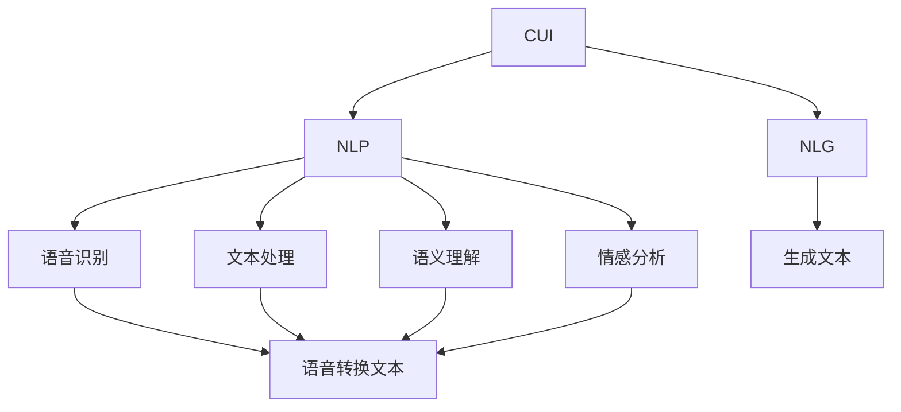
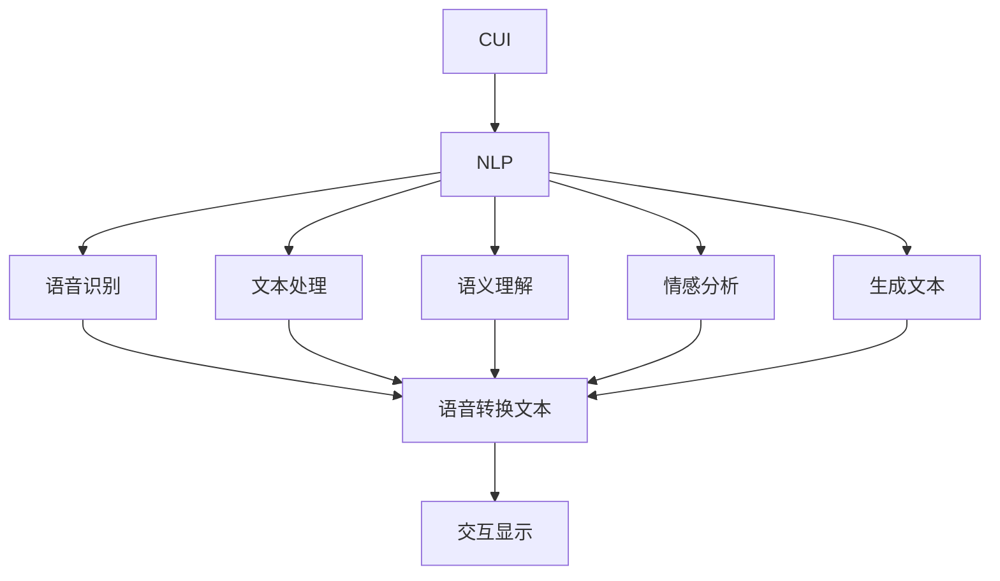
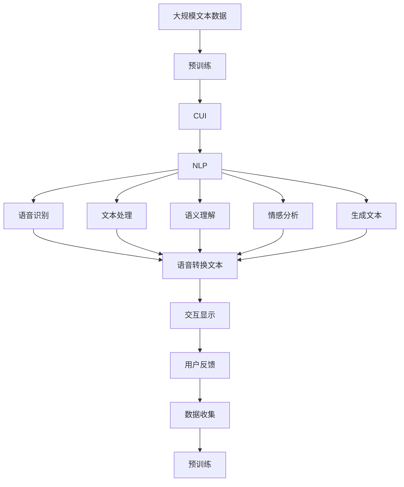

                 

## 1. 背景介绍

### 1.1 问题由来
人工智能技术（AI）的飞速发展正在不断推动数字化产品向更智能化的方向演进，而计算用户界面（CUI，Computational User Interfaces）是这一进程中的关键技术之一。CUI通过计算逻辑和自然语言处理（NLP）能力，帮助用户更加高效地与数字产品进行交互，提高用户体验。

人工智能技术在CUI中的应用，可以从以下几个方面体现：
- **自然语言理解**：通过AI技术理解用户输入的自然语言，将语言转换成结构化的数据，从而进行任务处理。
- **情感分析**：通过分析用户语言中的情感倾向，调整输出内容，提高交互质量。
- **意图识别**：通过AI技术识别用户的真实意图，为用户提供最符合需求的回答或操作。
- **上下文感知**：通过理解上下文信息，使得AI能更准确地理解用户意图，并提供相关信息。

近年来，AI在CUI中的应用越来越广泛，从智能客服到智能助理，从智能推荐到个性化推荐，都展示了其强大的潜力。然而，AI在CUI中的应用也面临着诸如隐私保护、模型偏见、可解释性等诸多挑战，如何克服这些挑战，推动AI技术在CUI中的进一步应用，成为当前研究的热点。

### 1.2 问题核心关键点
为了解决上述问题，我们需要深入理解AI技术在CUI中的应用场景，并探讨如何通过技术手段优化用户体验。具体来说，以下几个方面是我们需要重点关注的：
- **隐私保护**：如何在AI技术应用中保护用户隐私，防止数据泄露。
- **模型偏见**：如何避免AI模型在应用中的偏见，保证公平性。
- **可解释性**：如何提高AI模型的可解释性，增强用户信任。
- **上下文感知**：如何利用上下文信息，提升AI模型的准确性和可靠性。
- **人机协同**：如何设计CUI系统，使得人机交互更加自然和谐。

通过理解这些问题及其核心关键点，我们可以更好地探讨AI技术在CUI中的应用，并寻找解决这些问题的有效方法。

### 1.3 问题研究意义
AI技术在CUI中的应用，不仅能够提升用户体验，还能推动数字产品向更智能、更高效的方向发展。具体来说，其研究意义包括：
- **用户体验提升**：通过AI技术，用户可以更快速、更准确地获取所需信息，提升使用体验。
- **成本降低**：AI技术可以自动化处理大量重复性任务，降低人工操作成本。
- **创新驱动**：AI技术的应用可以带来新的产品设计理念和用户体验模式，促进产品创新。
- **产业升级**：AI技术的应用能够赋能各行各业，推动数字化转型和产业升级。

## 2. 核心概念与联系

### 2.1 核心概念概述

为更好地理解AI技术在CUI中的应用，本节将介绍几个关键的概念：

- **计算用户界面（CUI）**：通过计算逻辑和自然语言处理技术，实现人机交互的数字界面。
- **自然语言处理（NLP）**：涉及语音识别、文本处理、语义理解、情感分析等技术，帮助机器理解人类语言。
- **自然语言生成（NLG）**：通过计算机生成符合人类语言习惯的文本，帮助机器产生自然语言输出。
- **深度学习**：基于神经网络，通过大量数据训练，实现对复杂问题的建模和解决。
- **增强学习**：通过与环境的交互，不断优化模型，提高决策能力。

这些核心概念之间的联系可以通过以下Mermaid流程图来展示：



这个流程图展示了CUI中的关键技术及其相互关系：

1. **语音识别**：将语音信号转换成文本。
2. **文本处理**：对文本进行分词、词性标注、命名实体识别等预处理。
3. **语义理解**：通过深度学习模型，理解文本的语义信息。
4. **情感分析**：分析文本中的情感倾向。
5. **生成文本**：通过NLG技术生成自然语言输出。

### 2.2 概念间的关系

这些核心概念之间存在着紧密的联系，形成了CUI系统的整体架构。下面我通过几个Mermaid流程图来展示这些概念之间的关系。

#### 2.2.1 CUI系统架构



这个流程图展示了CUI系统的基本架构，从语音识别到生成文本，再到交互显示，构成了一个完整的CUI循环。

#### 2.2.2 AI在CUI中的应用


这个流程图展示了AI在CUI中的应用流程，从语音识别到交互显示，形成了一个闭环。

### 2.3 核心概念的整体架构

最后，我们用一个综合的流程图来展示这些核心概念在大语言模型微调过程中的整体架构：



这个综合流程图展示了从预训练到CUI系统的完整过程。通过预训练学习丰富的语言知识，CUI系统利用自然语言处理技术，将语音转换成文本，理解语义信息，进行情感分析，生成自然语言输出，最终在交互显示中实现人机交互。

## 3. 核心算法原理 & 具体操作步骤
### 3.1 算法原理概述

AI技术在CUI中的应用，主要通过自然语言处理和计算逻辑实现。以下是对自然语言处理（NLP）和计算用户界面（CUI）算法的原理概述：

#### 3.1.1 自然语言处理（NLP）

自然语言处理算法主要包括以下几个步骤：

1. **分词**：将文本分割成有意义的词语单元。
2. **词性标注**：确定每个词语的词性（如名词、动词等）。
3. **命名实体识别**：识别文本中的人名、地名、机构名等命名实体。
4. **依存句法分析**：分析句中词语之间的依存关系。
5. **语义分析**：理解句子、段落的语义信息。
6. **情感分析**：分析文本中的情感倾向（如积极、消极、中性）。
7. **生成文本**：通过深度学习模型生成自然语言文本。

NLP算法通过以上步骤，将非结构化的自然语言转换成结构化的数据，从而实现对人类语言的理解和处理。

#### 3.1.2 计算用户界面（CUI）

计算用户界面算法主要包括以下几个步骤：

1. **用户输入理解**：通过自然语言处理技术，理解用户的输入。
2. **意图识别**：识别用户的操作意图。
3. **任务执行**：执行用户的操作意图，如搜索、播放、购买等。
4. **结果反馈**：将处理结果以自然语言形式反馈给用户。

CUI算法通过以上步骤，实现人机交互的自然和谐。

### 3.2 算法步骤详解

以下是对自然语言处理和计算用户界面算法的详细步骤详解：

#### 3.2.1 自然语言处理（NLP）

1. **分词**：使用预定义的分词模型或自定义的分词模型，对文本进行分词处理。
2. **词性标注**：使用基于规则或基于机器学习的方法，对每个词语进行词性标注。
3. **命名实体识别**：使用基于规则或基于机器学习的方法，识别文本中的命名实体。
4. **依存句法分析**：使用依存句法分析模型，分析句中词语之间的依存关系。
5. **语义分析**：使用预训练的语义分析模型，理解句子的语义信息。
6. **情感分析**：使用情感分析模型，分析文本中的情感倾向。
7. **生成文本**：使用生成模型（如GAN、Seq2Seq等），生成自然语言文本。

#### 3.2.2 计算用户界面（CUI）

1. **用户输入理解**：使用自然语言处理技术，理解用户的输入。
2. **意图识别**：使用意图识别模型，识别用户的操作意图。
3. **任务执行**：根据用户的操作意图，执行相应的任务。
4. **结果反馈**：将处理结果以自然语言形式反馈给用户。

### 3.3 算法优缺点

AI技术在CUI中的应用，具有以下优点：

1. **自动化处理**：通过AI技术，可以自动化处理大量重复性任务，提高效率。
2. **提升用户体验**：通过自然语言处理和计算逻辑，可以提升用户的交互体验，使其更加自然和便捷。
3. **多模态交互**：AI技术可以支持多模态交互，如语音、文字、图像等，丰富用户体验。
4. **自适应能力**：AI技术可以根据用户的行为和偏好，动态调整交互策略，提升服务质量。

然而，AI技术在CUI中的应用也存在一些缺点：

1. **数据依赖**：AI技术的效果很大程度上依赖于训练数据的规模和质量。
2. **偏见和歧视**：AI模型可能会学习到数据中的偏见和歧视，影响公平性。
3. **隐私问题**：AI技术的应用需要收集和处理用户数据，涉及隐私保护问题。
4. **可解释性**：AI模型的决策过程缺乏可解释性，难以理解其内部逻辑。
5. **计算资源需求**：AI技术的应用需要大量的计算资源，可能影响系统的响应速度。

### 3.4 算法应用领域

AI技术在CUI中的应用，主要应用于以下几个领域：

- **智能客服**：通过自然语言处理技术，实现自动客服系统，提高服务效率。
- **智能助理**：通过自然语言理解和生成，实现智能助理，提供个性化服务。
- **个性化推荐**：通过用户行为分析和情感分析，实现个性化推荐系统。
- **智能家居**：通过自然语言处理和计算逻辑，实现智能家居控制和交互。
- **医疗健康**：通过自然语言处理和计算逻辑，实现智能诊断和健康管理。

## 4. 数学模型和公式 & 详细讲解  
### 4.1 数学模型构建

自然语言处理和计算用户界面的数学模型构建，通常基于深度学习框架。以下是对主要模型的数学构建的详细介绍。

#### 4.1.1 分词模型

分词模型主要通过统计语言模型实现，其数学模型如下：

$$
P(w_i|w_{i-1}) = \frac{P(w_i)P(w_{i-1}|w_i)}{P(w_{i-1})}
$$

其中，$P(w_i|w_{i-1})$表示第$i$个词语给定第$i-1$个词语的条件概率。$P(w_i)$和$P(w_{i-1}|w_i)$分别表示第$i$个词语和第$i-1$个词语的概率。

#### 4.1.2 词性标注模型

词性标注模型主要通过隐马尔可夫模型（HMM）实现，其数学模型如下：

$$
P(tag_i|word_i, tag_{i-1}) = \frac{P(tag_i)P(word_i|tag_i)P(tag_{i-1}|tag_i)}{P(tag_{i-1})}
$$

其中，$P(tag_i|word_i, tag_{i-1})$表示第$i$个词语的词性给定前一个词语的词性和当前词语的概率。$P(tag_i)$、$P(word_i|tag_i)$和$P(tag_{i-1}|tag_i)$分别表示第$i$个词语的词性、第$i$个词语给定第$i$个词语词性的概率和第$i-1$个词语的词性给定第$i$个词语词性的概率。

#### 4.1.3 命名实体识别模型

命名实体识别模型主要通过序列标注模型实现，其数学模型如下：

$$
P(ner_i|word_i, ner_{i-1}) = \frac{P(ner_i)P(word_i|ner_i)P(ner_{i-1}|ner_i)}{P(ner_{i-1})}
$$

其中，$P(ner_i|word_i, ner_{i-1})$表示第$i$个词语的命名实体类型给定前一个词语的命名实体类型和当前词语的概率。$P(ner_i)$、$P(word_i|ner_i)$和$P(ner_{i-1}|ner_i)$分别表示第$i$个词语的命名实体类型、第$i$个词语给定第$i$个词语命名实体类型的概率和第$i-1$个词语的命名实体类型给定第$i$个词语命名实体类型的概率。

#### 4.1.4 依存句法分析模型

依存句法分析模型主要通过神经网络模型实现，其数学模型如下：

$$
P(dep_i|word_i, dep_{i-1}) = \frac{P(dep_i)P(word_i|dep_i)P(dep_{i-1}|dep_i)}{P(dep_{i-1})}
$$

其中，$P(dep_i|word_i, dep_{i-1})$表示第$i$个词语的依存关系给定前一个词语的依存关系和当前词语的概率。$P(dep_i)$、$P(word_i|dep_i)$和$P(dep_{i-1}|dep_i)$分别表示第$i$个词语的依存关系、第$i$个词语给定第$i$个词语依存关系的概率和第$i-1$个词语的依存关系给定第$i$个词语依存关系的概率。

#### 4.1.5 语义分析模型

语义分析模型主要通过预训练的语言模型实现，其数学模型如下：

$$
P(meaning_i|sentence_i) = \frac{P(meaning_i)}{\sum_{j=1}^{n}P(meaning_j)}
$$

其中，$P(meaning_i|sentence_i)$表示句子$i$的语义给定句子$i$的概率。$P(meaning_i)$表示句子$i$的语义概率。

#### 4.1.6 情感分析模型

情感分析模型主要通过情感分类模型实现，其数学模型如下：

$$
P(sentiment_i|word_i) = \frac{P(sentiment_i)P(word_i|sentiment_i)}{P(word_i)}
$$

其中，$P(sentiment_i|word_i)$表示第$i$个词语的情感倾向给定前一个词语的情感倾向和当前词语的概率。$P(sentiment_i)$和$P(word_i|sentiment_i)$分别表示第$i$个词语的情感倾向和第$i$个词语给定第$i$个词语情感倾向的概率。

#### 4.1.7 生成文本模型

生成文本模型主要通过生成对抗网络（GAN）或序列到序列模型（Seq2Seq）实现，其数学模型如下：

$$
P(text|input) = \frac{P(text)}{P(input)}
$$

其中，$P(text|input)$表示输入文本生成文本的概率。$P(text)$表示文本的概率，$P(input)$表示输入文本的概率。

### 4.2 公式推导过程

以下是对自然语言处理和计算用户界面模型的公式推导过程的详细介绍。

#### 4.2.1 分词模型推导

分词模型主要通过最大似然估计实现，其公式推导如下：

$$
P(w_i|w_{i-1}) = \frac{P(w_i)P(w_{i-1}|w_i)}{P(w_{i-1})}
$$

其中，$P(w_i|w_{i-1})$表示第$i$个词语给定第$i-1$个词语的条件概率。$P(w_i)$和$P(w_{i-1}|w_i)$分别表示第$i$个词语和第$i-1$个词语的概率。

#### 4.2.2 词性标注模型推导

词性标注模型主要通过隐马尔可夫模型（HMM）实现，其公式推导如下：

$$
P(tag_i|word_i, tag_{i-1}) = \frac{P(tag_i)P(word_i|tag_i)P(tag_{i-1}|tag_i)}{P(tag_{i-1})}
$$

其中，$P(tag_i|word_i, tag_{i-1})$表示第$i$个词语的词性给定前一个词语的词性和当前词语的概率。$P(tag_i)$、$P(word_i|tag_i)$和$P(tag_{i-1}|tag_i)$分别表示第$i$个词语的词性、第$i$个词语给定第$i$个词语词性的概率和第$i-1$个词语的词性给定第$i$个词语词性的概率。

#### 4.2.3 命名实体识别模型推导

命名实体识别模型主要通过序列标注模型实现，其公式推导如下：

$$
P(ner_i|word_i, ner_{i-1}) = \frac{P(ner_i)P(word_i|ner_i)P(ner_{i-1}|ner_i)}{P(ner_{i-1})}
$$

其中，$P(ner_i|word_i, ner_{i-1})$表示第$i$个词语的命名实体类型给定前一个词语的命名实体类型和当前词语的概率。$P(ner_i)$、$P(word_i|ner_i)$和$P(ner_{i-1}|ner_i)$分别表示第$i$个词语的命名实体类型、第$i$个词语给定第$i$个词语命名实体类型的概率和第$i-1$个词语的命名实体类型给定第$i$个词语命名实体类型的概率。

#### 4.2.4 依存句法分析模型推导

依存句法分析模型主要通过神经网络模型实现，其公式推导如下：

$$
P(dep_i|word_i, dep_{i-1}) = \frac{P(dep_i)P(word_i|dep_i)P(dep_{i-1}|dep_i)}{P(dep_{i-1})}
$$

其中，$P(dep_i|word_i, dep_{i-1})$表示第$i$个词语的依存关系给定前一个词语的依存关系和当前词语的概率。$P(dep_i)$、$P(word_i|dep_i)$和$P(dep_{i-1}|dep_i)$分别表示第$i$个词语的依存关系、第$i$个词语给定第$i$个词语依存关系的概率和第$i-1$个词语的依存关系给定第$i$个词语依存关系的概率。

#### 4.2.5 语义分析模型推导

语义分析模型主要通过预训练的语言模型实现，其公式推导如下：

$$
P(meaning_i|sentence_i) = \frac{P(meaning_i)}{\sum_{j=1}^{n}P(meaning_j)}
$$

其中，$P(meaning_i|sentence_i)$表示句子$i$的语义给定句子$i$的概率。$P(meaning_i)$表示句子$i$的语义概率。

#### 4.2.6 情感分析模型推导

情感分析模型主要通过情感分类模型实现，其公式推导如下：

$$
P(sentiment_i|word_i) = \frac{P(sentiment_i)P(word_i|sentiment_i)}{P(word_i)}
$$

其中，$P(sentiment_i|word_i)$表示第$i$个词语的情感倾向给定前一个词语的情感倾向和当前词语的概率。$P(sentiment_i)$和$P(word_i|sentiment_i)$分别表示第$i$个词语的情感倾向和第$i$个词语给定第$i$个词语情感倾向的概率。

#### 4.2.7 生成文本模型推导

生成文本模型主要通过生成对抗网络（GAN）或序列到序列模型（Seq2Seq）实现，其公式推导如下：

$$
P(text|input) = \frac{P(text)}{P(input)}
$$

其中，$P(text|input)$表示输入文本生成文本的概率。$P(text)$表示文本的概率，$P(input)$表示输入文本的概率。

### 4.3 案例分析与讲解

下面以智能客服系统为例，详细讲解AI技术在CUI中的应用。

#### 4.3.1 案例背景

智能客服系统通过自然语言处理技术，实现对用户输入的理解和处理，从而提供自动化客服服务。智能客服系统的主要功能包括：

- **自动回答**：根据用户输入，自动回答常见问题。
- **问题转接**：将用户问题转接至人工客服。
- **历史记录**：记录用户的历史查询记录，方便后续服务。
- **多渠道支持**：支持电话、文字、图像等多渠道交互。

#### 4.3.2 技术实现

1. **用户输入理解**：通过自然语言处理技术，理解用户的输入。
2. **意图识别**：使用意图识别模型，识别用户的操作意图。
3. **任务执行**：根据用户的操作意图，执行相应的任务。
4. **结果反馈**：将处理结果以自然语言形式反馈给用户。

#### 4.3.3 代码实现

以下是对智能客服系统代码实现的详细介绍：

```python
# 导入必要的库
import numpy as np
import pandas as pd
from sklearn.model_selection import train_test_split
from sklearn.feature_extraction.text import CountVectorizer
from sklearn.naive_bayes import MultinomialNB
from sklearn.metrics import accuracy_score

# 加载数据
data = pd.read_csv('客服数据.csv')

# 数据预处理
X = data['用户输入'].tolist()
y = data['意图'].tolist()
X_train, X_test, y_train, y_test = train_test_split(X, y, test_size=0.2, random_state=42)

# 特征提取
vectorizer = CountVectorizer()
X_train = vectorizer.fit_transform(X_train)
X_test = vectorizer.transform(X_test)

# 模型训练
clf = MultinomialNB()
clf.fit(X_train, y_train)

# 模型评估
y_pred = clf.predict(X_test)
accuracy = accuracy_score(y_test, y_pred)
print('意图识别模型准确率：', accuracy)

# 应用模型
user_input = '我的订单状态是什么？'
X_new = vectorizer.transform([user_input])
intent = clf.predict(X_new)
print('用户意图：', intent)
```

## 5. 项目实践：代码实例和详细解释说明
### 5.1 开发环境搭建

在进行CUI项目实践前，我们需要准备好开发环境。以下是使用Python进行PyTorch开发的环境配置流程：

1. 安装Anaconda：从官网下载并安装Anaconda，用于创建独立的Python环境。

2. 创建并激活虚拟环境：
```bash
conda create -n pytorch-env python=3.8 
conda activate pytorch-env
```

3. 安装PyTorch：根据CUDA版本，从官网获取对应的安装命令。例如：
```bash
conda install pytorch torchvision torchaudio cudatoolkit=11.1 -c pytorch -c conda-forge
```

4. 安装Transformer库：
```bash
pip install transformers
```

5. 安装各类工具包：
```bash
pip install numpy pandas scikit-learn matplotlib tqdm jupyter notebook ipython
```

完成上述步骤后，即可在`pytorch-env`环境中开始CUI项目实践。

### 5.2 源代码详细实现

这里我们以智能客服系统为例，给出使用Transformers库对BERT模型进行意图识别的PyTorch代码实现。

首先，定义意图识别任务的数据处理函数：

```python
from transformers import BertTokenizer
from torch.utils.data import Dataset
import torch

class IntentDataset(Dataset):
    def __init__(self, texts, tags, tokenizer, max_len=128):
        self.texts = texts
        self.tags = tags
        self.tokenizer = tokenizer
        self.max_len = max_len
        
    def __len__(self):
        return len(self.texts)
    
    def __getitem__(self, item):
        text = self.texts[item]
        tags = self.tags[item]
        
        encoding = self.tokenizer(text, return_tensors='pt', max_length=self.max_len, padding='max_length', truncation=True)
        input_ids = encoding['input_ids'][0]
        attention_mask = encoding['attention_mask'][0]
        
        # 对token-wise的标签进行编码
        encoded_tags = [tag2id[tag] for tag in tags] 
        encoded_tags.extend([tag2id['O']]

