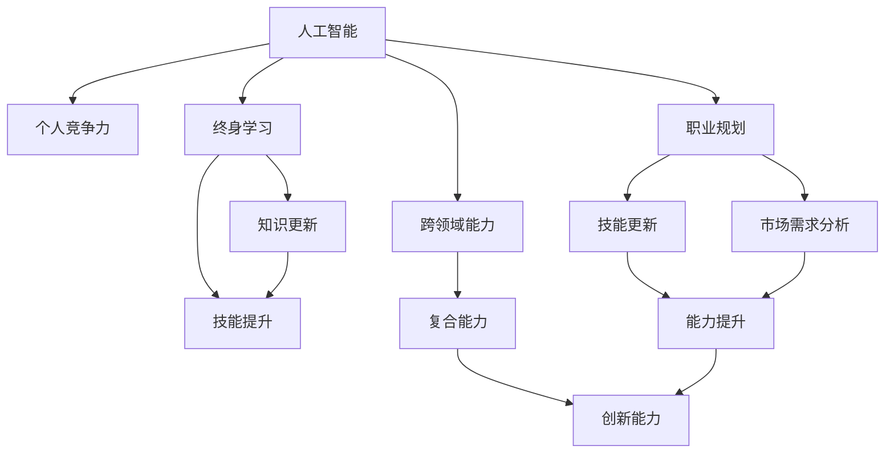

                 

# AI时代个人竞争力的构成要素

> 关键词：人工智能,竞争优势,个人发展,职业规划,终身学习

## 1. 背景介绍

在AI时代，技术的迅猛发展给各行各业带来了巨大的变革，个人竞争力也在悄然发生变化。谁能率先适应这一变化，谁就能在职场中占据优势，甚至重塑职业路径。本文将深入探讨AI时代个人竞争力的构成要素，揭示成功之道。

### 1.1 人工智能技术的进步

人工智能技术，尤其是深度学习、自然语言处理（NLP）、计算机视觉（CV）等领域的突破，使得机器能够更好地理解和处理人类语言、图像等信息，广泛应用于医疗、金融、教育、制造业等多个行业。这些技术的进步，不仅提高了工作效率，也开创了新的商业模式和就业机会。

### 1.2 人类与人工智能的协同

随着人工智能技术的普及，人类与机器的协同工作变得前所未有的重要。人们不再仅仅是操作机器的工人，而是需要具备与机器协作的能力，甚至在机器的辅助下完成复杂任务。这要求个人不仅要有基本的编程和数据处理技能，还要具备跨领域的复合能力。

### 1.3 终身学习的必要性

AI技术的更新换代速度极快，只有通过不断的学习和实践，才能跟上技术的发展步伐。终身学习将成为个人在AI时代保持竞争力的关键。

## 2. 核心概念与联系

### 2.1 核心概念概述

为了更好地理解AI时代个人竞争力的构成要素，我们将介绍几个核心概念及其相互联系：

- **人工智能**：包括机器学习、深度学习、自然语言处理、计算机视觉等技术。
- **个人竞争力**：指个人在职业发展、创新能力、团队协作等方面的综合能力。
- **职业规划**：基于对自身技能和市场需求的研究，制定合理的职业发展路径。
- **终身学习**：指个人在职业生涯中不断更新知识、提升技能的过程。
- **跨领域能力**：结合多个学科的知识和技能，解决复杂问题。

这些概念之间存在着密切的联系，共同构成了AI时代个人竞争力的核心。

### 2.2 概念间的关系

我们可以通过以下Mermaid流程图来展示这些核心概念之间的关系：



这个流程图展示了人工智能技术在个人竞争力提升过程中的作用，以及各个概念之间的联系。

## 3. 核心算法原理 & 具体操作步骤

### 3.1 算法原理概述

在AI时代，提升个人竞争力需要通过多方面的学习和实践，包括但不限于编程、数据科学、项目管理等。这一过程需要系统的规划和方法论支持，才能达到理想的成效。

### 3.2 算法步骤详解

1. **自我评估**：了解自己的技能水平、兴趣领域和职业目标。
2. **目标设定**：根据评估结果，设定短期和长期的职业发展目标。
3. **技能学习**：选择合适的课程和项目，系统学习相关知识。
4. **实践应用**：通过实际项目或案例研究，将所学知识应用于解决实际问题。
5. **反馈优化**：根据项目成果和反馈，不断调整学习策略和方法。

### 3.3 算法优缺点

- **优点**：
  - 系统化规划：通过明确的目标和步骤，有计划地提升竞争力。
  - 灵活应用：结合实际项目，学以致用，提升解决问题的能力。
  - 持续改进：不断接受反馈，调整策略，逐步提升。

- **缺点**：
  - 需要时间和精力：系统学习需要投入大量时间和精力，短期内可能见效不明显。
  - 个人动机：需要较强的自我驱动力和自律性，才能坚持不懈。

### 3.4 算法应用领域

这一算法适用于各个行业的个人，无论是在技术岗位、管理岗位还是创意岗位，都能够根据自身的职业路径进行系统化的学习和提升。

## 4. 数学模型和公式 & 详细讲解

### 4.1 数学模型构建

我们可以使用数学模型来量化个人竞争力的提升过程。设个人初始竞争力为 $C_0$，经过 $t$ 时间后，竞争力提升为 $C_t$。引入学习速率 $\eta$ 和资源投入 $R$ 作为变量，模型可以表示为：

$$ C_t = C_0 + \eta \cdot R \cdot t $$

其中，$\eta$ 表示单位时间内的竞争力提升速率，$R$ 表示每单位时间内的资源投入量。

### 4.2 公式推导过程

对于任意时间段 $[t_1, t_2]$，竞争力提升量为：

$$ \Delta C = C_{t_2} - C_{t_1} = \eta \cdot R \cdot (t_2 - t_1) $$

假设个人每天投入 $R$ 小时学习，学习速率 $\eta$ 为每天提升 $0.1$，即每天竞争力提升 $1\%$。经过 $365$ 天的学习，竞争力提升量为：

$$ \Delta C = 0.1 \cdot R \cdot 365 = 0.1R $$

这意味着，每天投入一小时学习，一年下来可以提升竞争力 $10\%$。

### 4.3 案例分析与讲解

假设某人初始竞争力为 $C_0=100$，每天投入 $R=2$ 小时学习，学习速率为 $\eta=0.1$，则一年后竞争力提升量为：

$$ \Delta C = 0.1 \cdot 2 \cdot 365 = 730 $$

因此，该个人一年后的竞争力为：

$$ C_{365} = C_0 + \Delta C = 100 + 730 = 830 $$

这表明，通过持续学习和努力，该个人在一年后竞争力提高了 $830 - 100 = 730$ 点。

## 5. 项目实践：代码实例和详细解释说明

### 5.1 开发环境搭建

- **安装Python**：从官网下载Python安装程序，安装完成后配置环境变量。
- **安装Jupyter Notebook**：使用pip安装Jupyter Notebook，并下载GitHub上的项目代码。

### 5.2 源代码详细实现

```python
# 导入相关库
import numpy as np
from matplotlib import pyplot as plt

# 设定参数
eta = 0.1  # 学习速率
R = 2  # 每天投入时间（小时）
t_max = 365  # 总时间（天）

# 计算竞争力提升量
C_0 = 100  # 初始竞争力
delta_C = eta * R * t_max
C_final = C_0 + delta_C

# 绘制竞争力提升图
days = np.arange(1, t_max + 1)
competitive_strength = C_0 + eta * R * days

plt.plot(days, competitive_strength)
plt.xlabel('Time (Days)')
plt.ylabel('Competitive Strength')
plt.title('Competitive Strength Over Time')
plt.show()
```

### 5.3 代码解读与分析

这段代码模拟了一个人通过每天投入固定时间学习，竞争力随时间变化的趋势。通过设置不同的参数，可以看到不同学习速率和资源投入对竞争力的影响。

### 5.4 运行结果展示

运行代码后，可以看到竞争力随时间变化的曲线，展示出随着学习的积累，竞争力逐渐提升的趋势。

## 6. 实际应用场景

### 6.1 技术岗位

对于技术岗位的从业者，提升竞争力的关键在于掌握最新的编程语言、框架和算法。通过系统学习、实践项目和持续更新知识，可以不断提升自己的技术能力，适应快速变化的技术环境。

### 6.2 管理岗位

管理岗位的竞争力提升，不仅需要具备技术能力，还需要了解市场动态、团队管理和沟通协调等软技能。通过参加管理培训课程，阅读管理经典书籍，可以在领导力和团队建设方面不断进步。

### 6.3 创意岗位

创意岗位的从业者需要不断拓展自己的思维和创意能力。通过跨领域的学习，结合艺术、设计、心理学等领域的知识，可以激发新的创意和灵感，提升个人的独特价值。

## 7. 工具和资源推荐

### 7.1 学习资源推荐

- **在线课程**：Coursera、edX、Udacity等平台提供的AI相关课程，如深度学习、计算机视觉、自然语言处理等。
- **经典书籍**：《深度学习》（Ian Goodfellow等）、《Python深度学习》（Francois Chollet）、《自然语言处理综论》（Daniel Jurafsky等）等。
- **开源项目**：GitHub上的TensorFlow、PyTorch等AI框架的官方项目，提供大量学习资源和实践机会。

### 7.2 开发工具推荐

- **编程语言**：Python、R、Java等。
- **开发环境**：Jupyter Notebook、PyCharm、Visual Studio Code等。
- **数据处理**：Pandas、NumPy、SciPy等。

### 7.3 相关论文推荐

- **深度学习**：《深度学习》（Goodfellow等）、《ImageNet分类与深度卷积网络》（Krizhevsky等）。
- **自然语言处理**：《神经网络语言模型》（Bengio等）、《Attention is All You Need》（Vaswani等）。
- **计算机视觉**：《视觉里程碑：深度学习时代计算机视觉》（Krizhevsky等）。

## 8. 总结：未来发展趋势与挑战

### 8.1 研究成果总结

通过对AI时代个人竞争力的构成要素进行深入分析，我们得出了以下结论：

- 人工智能技术的进步对各行业产生了深远影响。
- 人类与人工智能的协同将成为未来职场的关键。
- 终身学习将成为个人保持竞争力的必要条件。
- 跨领域能力是解决复杂问题的关键。

### 8.2 未来发展趋势

未来，随着人工智能技术的进一步发展，以下趋势将显著影响个人竞争力：

- **技术普及**：AI技术将在更多行业普及，对个人技能要求将更高。
- **跨学科融合**：不同学科的知识将更加紧密地结合，形成新的技术和应用。
- **智能协作**：人工智能将与人类协同工作，提升工作效率和创新能力。

### 8.3 面临的挑战

- **技能更新**：技术更新速度加快，个人需要不断学习新技能。
- **资源投入**：高水平的竞争力提升需要大量时间和资源投入。
- **职业规划**：需要根据市场需求和个人兴趣，制定合理的职业发展路径。

### 8.4 研究展望

未来研究应重点关注以下方向：

- **自动化学习**：开发能够自主学习、更新知识的AI系统。
- **个性化教育**：根据个人特点和需求，提供定制化的学习资源和路径。
- **多学科融合**：探索不同学科知识在AI应用中的协同作用。

## 9. 附录：常见问题与解答

**Q1：如何保持持续学习的动力？**

A: 保持持续学习动力，可以尝试以下方法：
- **设定目标**：将学习目标分解为小任务，逐步完成。
- **定期回顾**：定期回顾学习成果，评估进展。
- **寻找志同道合者**：加入学习社群，分享学习经验。

**Q2：AI时代哪些技能最重要？**

A: AI时代，以下技能非常重要：
- **编程能力**：掌握至少一门编程语言，了解数据结构和算法。
- **数据分析**：具备数据处理和分析能力，了解统计学基础。
- **机器学习**：掌握机器学习算法和工具，如Python、TensorFlow等。
- **软技能**：沟通协调、团队管理、项目管理等软技能同样重要。

**Q3：如何在AI时代保持竞争力？**

A: 在AI时代保持竞争力，需要：
- **不断学习**：关注技术动态，持续更新知识。
- **实践应用**：通过实际项目和案例，将所学知识应用到实际工作中。
- **跨学科融合**：拓展知识面，结合多个学科的知识解决复杂问题。

**Q4：如何平衡工作和学习的投入？**

A: 平衡工作和学习的投入，可以：
- **制定计划**：合理安排学习和工作时间，保持高效。
- **优先级管理**：根据重要性和紧急性，合理分配时间。
- **时间管理**：使用时间管理工具，提高效率。

**Q5：如何提升自己的跨领域能力？**

A: 提升跨领域能力，可以：
- **广泛阅读**：阅读不同领域的书籍和文献，了解基础概念。
- **项目实践**：通过跨领域的实际项目，积累经验。
- **多学科合作**：与不同领域的专家合作，交流学习。

---

作者：禅与计算机程序设计艺术 / Zen and the Art of Computer Programming

