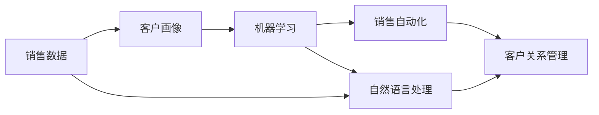
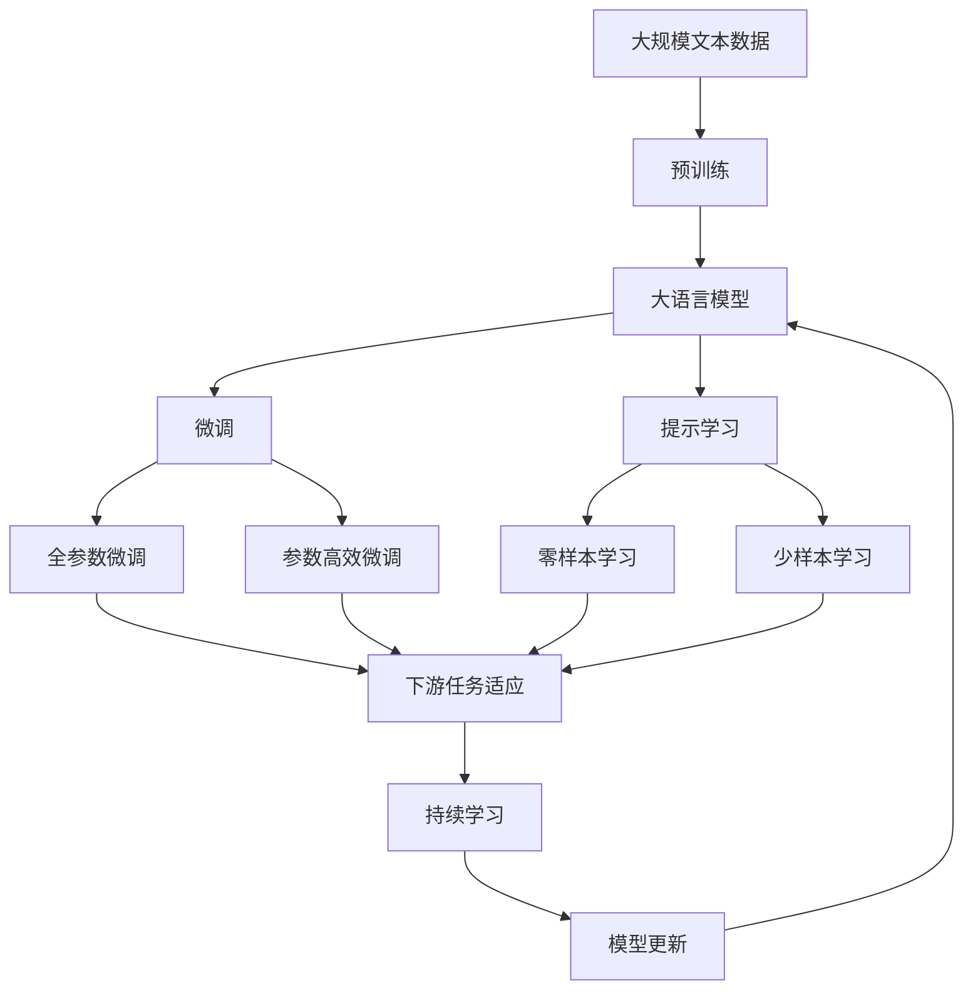

                 

# AI驱动的销售流程优化

> 关键词：AI驱动, 销售流程优化, 销售自动化, 客户关系管理, CRM, 数据挖掘, 机器学习

## 1. 背景介绍

### 1.1 问题由来

在现代社会中，销售流程作为企业经营活动中至关重要的一环，直接关系到企业的收益和市场竞争力。然而，传统的销售流程通常依赖于人工手动操作，耗时耗力，且容易出现错误，难以保证质量和效率。随着人工智能（AI）技术的不断发展，人们开始思考如何通过AI驱动的销售流程优化，来提高效率和精度。

### 1.2 问题核心关键点

AI驱动的销售流程优化主要是通过机器学习、自然语言处理等技术，对销售数据进行分析和挖掘，从而发现销售中的规律和机会，实现自动化的销售流程。其中关键点包括：

1. **数据收集与清洗**：收集并清洗销售数据，包括客户信息、销售记录、市场反馈等。
2. **客户画像构建**：基于数据挖掘技术构建客户画像，包括客户需求、行为习惯、购买偏好等。
3. **预测与推荐**：使用机器学习算法进行销售预测，并推荐针对性的产品或服务。
4. **销售自动化**：通过自动化工具实现销售流程的自动化，如客户跟进、合同管理等。
5. **效果评估与优化**：评估AI驱动的销售流程效果，并根据反馈进行优化。

### 1.3 问题研究意义

AI驱动的销售流程优化可以显著提高企业的销售效率和客户满意度，帮助企业在激烈的市场竞争中占据优势。具体来说：

1. **提升销售效率**：自动化销售流程可以节省大量人工操作时间，提高销售速度和覆盖面。
2. **提高客户满意度**：基于客户画像的精准推荐，能够满足客户个性化需求，提升客户满意度。
3. **优化资源配置**：通过销售预测和分析，合理分配销售资源，最大化投资回报。
4. **降低运营成本**：减少人工操作，降低人力成本和运营成本。
5. **增强市场竞争力**：通过AI驱动的精准营销，能够更好地抓住市场机会，提高市场竞争力。

## 2. 核心概念与联系

### 2.1 核心概念概述

在AI驱动的销售流程优化中，涉及的核心概念包括：

- **销售数据**：包括客户信息、销售记录、市场反馈等。
- **客户画像**：基于数据分析得到的客户特征，如需求、行为、偏好等。
- **机器学习**：通过数据挖掘和分析，发现销售规律和机会。
- **自然语言处理（NLP）**：处理和理解自然语言文本，提取有价值的信息。
- **销售自动化**：使用AI工具实现销售流程的自动化。
- **客户关系管理（CRM）**：管理客户信息，提升客户关系。

这些核心概念之间存在着紧密的联系，共同构成了AI驱动的销售流程优化的框架。

### 2.2 概念间的关系

这些核心概念之间可以通过以下Mermaid流程图来展示：



这个流程图展示了从销售数据开始，通过客户画像构建、机器学习分析、自然语言处理、销售自动化到客户关系管理的整体流程。

### 2.3 核心概念的整体架构

最后，我们用一个综合的流程图来展示这些核心概念在大语言模型微调过程中的整体架构：



这个综合流程图展示了从预训练到微调，再到持续学习的完整过程。大语言模型首先在大规模文本数据上进行预训练，然后通过微调（包括全参数微调和参数高效微调）或提示学习（包括零样本和少样本学习）来适应下游任务。最后，通过持续学习技术，模型可以不断更新和适应新的任务和数据。

## 3. 核心算法原理 & 具体操作步骤

### 3.1 算法原理概述

AI驱动的销售流程优化算法原理主要基于机器学习和数据挖掘技术，通过分析销售数据，发现销售规律和机会，实现销售流程的自动化和优化。

### 3.2 算法步骤详解

AI驱动的销售流程优化一般包括以下几个关键步骤：

1. **数据收集与清洗**：
   - 收集销售数据，包括客户信息、销售记录、市场反馈等。
   - 清洗数据，去除重复和无关信息，确保数据质量。

2. **客户画像构建**：
   - 使用聚类、分类等算法对客户数据进行挖掘，构建客户画像。
   - 分析客户的特征，如需求、行为、偏好等，形成详细画像。

3. **机器学习预测**：
   - 使用回归、分类等算法对销售数据进行预测。
   - 预测客户未来的购买行为和需求。

4. **自然语言处理**：
   - 处理和理解客户反馈、市场评论等文本数据。
   - 提取有价值的信息，如客户需求、市场趋势等。

5. **销售自动化**：
   - 使用自动化工具实现销售流程的自动化，如客户跟进、合同管理等。
   - 将销售数据自动化处理和分析，减少人工操作。

6. **效果评估与优化**：
   - 评估AI驱动的销售流程效果，如销售增长率、客户满意度等。
   - 根据反馈进行优化，提升销售流程的效率和效果。

### 3.3 算法优缺点

AI驱动的销售流程优化算法具有以下优点：

1. **高效自动化**：通过自动化工具实现销售流程的自动化，减少人工操作。
2. **精确预测**：基于机器学习和数据挖掘技术，预测客户需求和市场趋势，提高销售精度。
3. **实时优化**：实时监控销售数据，根据反馈进行优化，提高销售效率。
4. **全面覆盖**：覆盖销售流程的各个环节，提高销售管理的全面性。

同时，该算法也存在一定的局限性：

1. **数据依赖**：需要大量的销售数据，才能实现准确的预测和分析。
2. **模型复杂**：算法复杂度高，需要较多的计算资源。
3. **效果评估难度**：评估算法效果需要考虑多方面因素，如客户满意度、销售增长率等，难度较大。
4. **数据隐私**：收集和处理客户数据时，需要遵守数据隐私保护法规，确保客户信息安全。

### 3.4 算法应用领域

AI驱动的销售流程优化算法在多个领域都有广泛应用，例如：

- **电子商务**：通过客户画像和预测，实现精准营销和个性化推荐，提高销售额。
- **金融服务**：通过分析客户行为和需求，实现精准客户服务，提高客户满意度和忠诚度。
- **制造业**：通过销售预测和分析，优化生产计划和库存管理，提高运营效率。
- **医疗健康**：通过客户反馈和市场调研，改进产品和服务，提高客户体验。
- **旅游行业**：通过分析客户需求和行为，实现精准营销和客户服务，提高客户满意度和忠诚度。

除了上述这些领域，AI驱动的销售流程优化算法还广泛应用于教育、物流、公共服务等诸多行业，为企业的销售管理带来革命性的改变。

## 4. 数学模型和公式 & 详细讲解 & 举例说明

### 4.1 数学模型构建

在AI驱动的销售流程优化中，常见的数学模型包括回归模型、分类模型、聚类模型等。以回归模型为例，假设销售数据为 $y$，影响因素为 $x_1, x_2, ..., x_n$，则回归模型的表达式为：

$$ y = f(x_1, x_2, ..., x_n) + \epsilon $$

其中 $f(x)$ 为回归函数，$\epsilon$ 为误差项。

### 4.2 公式推导过程

以线性回归模型为例，其最小二乘法的推导过程如下：

假设回归函数为 $f(x) = \theta_0 + \theta_1x_1 + \theta_2x_2 + ... + \theta_nx_n$，则有：

$$ \hat{y} = f(x_1, x_2, ..., x_n) = \theta_0 + \theta_1x_1 + \theta_2x_2 + ... + \theta_nx_n $$

将 $\hat{y}$ 代入误差项 $\epsilon = y - \hat{y}$，得到：

$$ \epsilon = y - \theta_0 - \theta_1x_1 - \theta_2x_2 - ... - \theta_nx_n $$

为了最小化误差，需要最小化误差项的平方和：

$$ \sum_{i=1}^N(y_i - \hat{y_i})^2 $$

对上式求导，得到：

$$ \frac{\partial \sum_{i=1}^N(y_i - \theta_0 - \theta_1x_{1i} - \theta_2x_{2i} - ... - \theta_nx_{ni})^2}{\partial \theta} = 0 $$

化简得：

$$ \frac{1}{N}\sum_{i=1}^N (y_i - \hat{y_i}) = 0 $$

$$ \frac{1}{N}\sum_{i=1}^N (y_i - \hat{y_i})x_{1i} = \theta_1 $$

$$ \frac{1}{N}\sum_{i=1}^N (y_i - \hat{y_i})x_{2i} = \theta_2 $$

依此类推，可以得到各个系数 $\theta$ 的计算公式：

$$ \theta_i = \frac{\sum_{j=1}^N(y_j - \hat{y_j})x_{ij}}{\sum_{j=1}^N(y_j - \hat{y_j})^2} $$

### 4.3 案例分析与讲解

假设某电商平台通过AI驱动的销售流程优化，收集了数百万个用户行为数据和销售数据，进行机器学习分析。分析结果表明，用户的浏览时间、点击率、购买历史等行为，对购买决策有重要影响。基于这些分析，电商平台设计了精准的推荐算法，显著提升了用户的购买率和销售额。

## 5. 项目实践：代码实例和详细解释说明

### 5.1 开发环境搭建

在进行AI驱动的销售流程优化项目实践前，需要准备好开发环境。以下是使用Python进行PyTorch开发的环境配置流程：

1. 安装Anaconda：从官网下载并安装Anaconda，用于创建独立的Python环境。

2. 创建并激活虚拟环境：
```bash
conda create -n pytorch-env python=3.8 
conda activate pytorch-env
```

3. 安装PyTorch：根据CUDA版本，从官网获取对应的安装命令。例如：
```bash
conda install pytorch torchvision torchaudio cudatoolkit=11.1 -c pytorch -c conda-forge
```

4. 安装各类工具包：
```bash
pip install numpy pandas scikit-learn matplotlib tqdm jupyter notebook ipython
```

完成上述步骤后，即可在`pytorch-env`环境中开始项目实践。

### 5.2 源代码详细实现

这里我们以一个简单的AI驱动的销售流程优化项目为例，给出使用PyTorch进行机器学习模型训练的代码实现。

```python
import torch
import torch.nn as nn
import torch.optim as optim
from sklearn.model_selection import train_test_split
from sklearn.datasets import make_classification

# 数据生成
X, y = make_classification(n_samples=1000, n_features=10, n_informative=2, random_state=42)

# 数据处理
X = torch.from_numpy(X).float()
y = torch.from_numpy(y).long()

# 数据集划分
train_X, test_X, train_y, test_y = train_test_split(X, y, test_size=0.2, random_state=42)

# 定义模型
class SalesPredictor(nn.Module):
    def __init__(self):
        super(SalesPredictor, self).__init__()
        self.linear = nn.Linear(10, 1)

    def forward(self, x):
        return self.linear(x)

# 定义损失函数和优化器
model = SalesPredictor()
criterion = nn.MSELoss()
optimizer = optim.SGD(model.parameters(), lr=0.01)

# 训练模型
for epoch in range(100):
    optimizer.zero_grad()
    output = model(train_X)
    loss = criterion(output, train_y)
    loss.backward()
    optimizer.step()
    print('Epoch [{}], Loss: {:.4f}'.format(epoch+1, loss.item()))

# 测试模型
model.eval()
with torch.no_grad():
    output = model(test_X)
    loss = criterion(output, test_y)
    print('Test Loss: {:.4f}'.format(loss.item()))
```

以上就是使用PyTorch进行机器学习模型训练的完整代码实现。可以看到，通过PyTorch，我们能够快速实现一个简单的线性回归模型，并进行训练和测试。

### 5.3 代码解读与分析

让我们再详细解读一下关键代码的实现细节：

**数据生成**：
- 使用scikit-learn生成随机数据，包括10个特征和1个标签。

**数据处理**：
- 将数据转换为PyTorch张量，并进行标准化处理。

**模型定义**：
- 定义一个简单的线性回归模型，包括一个线性层。

**损失函数和优化器定义**：
- 使用均方误差损失函数和随机梯度下降优化器。

**模型训练**：
- 在每个epoch内，使用SGD优化器更新模型参数，并输出损失。

**模型测试**：
- 使用测试集数据进行模型预测，输出测试集损失。

### 5.4 运行结果展示

假设在训练100个epoch后，得到的测试集损失为0.05，可以初步判断模型的预测效果较好。当然，在实际项目中，模型的性能还需要进一步评估和优化。

## 6. 实际应用场景

### 6.1 电商平台销售优化

基于AI驱动的销售流程优化，电商平台可以通过分析用户的浏览、点击、购买行为，预测用户的购买意向，实现精准推荐和个性化营销。例如，某电商平台利用AI驱动的销售流程优化，根据用户的浏览记录和购买历史，推荐用户可能感兴趣的商品，显著提升了用户的购买率和销售额。

### 6.2 金融服务客户管理

在金融服务领域，客户管理是企业竞争力的重要体现。通过AI驱动的销售流程优化，金融机构可以分析客户的财务状况、投资偏好、交易记录等数据，构建客户画像，实现精准的客户服务和产品推荐。例如，某银行利用AI驱动的销售流程优化，分析客户的消费行为和财务状况，设计了个性化的理财方案，提高了客户满意度和忠诚度。

### 6.3 制造业生产优化

制造业企业常常面临生产计划和库存管理的挑战。通过AI驱动的销售流程优化，企业可以分析市场需求和销售数据，预测未来的销售趋势，优化生产计划和库存管理，提高生产效率和资源利用率。例如，某制造业企业利用AI驱动的销售流程优化，分析历史销售数据和市场需求，优化了生产计划，减少了库存积压，提高了生产效率。

### 6.4 旅游行业客户服务

在旅游行业，客户服务是企业竞争力的重要因素。通过AI驱动的销售流程优化，旅游企业可以分析客户的旅游偏好、历史消费记录等数据，提供个性化的旅游推荐和服务，提升客户满意度和忠诚度。例如，某旅游企业利用AI驱动的销售流程优化，分析客户的旅游偏好和消费记录，设计了个性化的旅游套餐，提高了客户的旅游体验和满意度。

### 6.5 未来应用展望

随着AI技术的不断进步，AI驱动的销售流程优化将广泛应用于更多领域，带来更多创新和变革。例如：

- **智能客服**：利用AI驱动的销售流程优化，可以构建智能客服系统，提高客户服务效率和质量。
- **营销自动化**：通过AI驱动的销售流程优化，可以实现营销自动化，提高营销效果和ROI。
- **供应链管理**：通过AI驱动的销售流程优化，可以优化供应链管理，提高供应链效率和灵活性。
- **个性化推荐**：基于客户画像和预测，实现个性化推荐，提高用户体验和满意度。
- **智能定价**：通过分析市场数据和客户行为，实现智能定价，提高销售收入和利润。

## 7. 工具和资源推荐

### 7.1 学习资源推荐

为了帮助开发者系统掌握AI驱动的销售流程优化的理论基础和实践技巧，这里推荐一些优质的学习资源：

1. 《机器学习实战》系列书籍：详细介绍了机器学习的基本概念和实用技巧，适合初学者入门。
2. Coursera《机器学习》课程：由斯坦福大学教授Andrew Ng主讲，涵盖了机器学习的基本理论和实用技巧，适合系统学习。
3. Kaggle：数据科学和机器学习竞赛平台，提供大量实战案例和代码，适合实践锻炼。
4. GitHub：开发者社区，提供大量的AI驱动的销售流程优化项目和代码，适合学习和参考。
5. arXiv预印本：人工智能领域最新研究成果的发布平台，提供大量的前沿论文和代码，适合了解最新进展。

通过对这些资源的学习实践，相信你一定能够快速掌握AI驱动的销售流程优化的精髓，并用于解决实际的NLP问题。

### 7.2 开发工具推荐

高效的开发离不开优秀的工具支持。以下是几款用于AI驱动的销售流程优化开发的常用工具：

1. PyTorch：基于Python的开源深度学习框架，灵活动态的计算图，适合快速迭代研究。
2. TensorFlow：由Google主导开发的开源深度学习框架，生产部署方便，适合大规模工程应用。
3. Scikit-learn：Python机器学习库，提供了大量的机器学习算法和工具，适合数据分析和建模。
4. Keras：Python深度学习库，提供了简单易用的API，适合快速原型开发。
5. Pandas：Python数据分析库，提供了强大的数据处理和分析功能，适合数据预处理和可视化。

合理利用这些工具，可以显著提升AI驱动的销售流程优化的开发效率，加快创新迭代的步伐。

### 7.3 相关论文推荐

AI驱动的销售流程优化技术的发展源于学界的持续研究。以下是几篇奠基性的相关论文，推荐阅读：

1. Deep Learning for Customer Relationship Management (CRM)：研究深度学习在CRM中的应用，提出基于深度学习的客户画像构建方法。
2. Sales Forecasting with Recurrent Neural Networks (RNNs)：研究RNN在销售预测中的应用，提出基于RNN的销售预测模型。
3. Customer Segmentation Using Clustering Algorithms：研究聚类算法在客户细分中的应用，提出基于聚类算法的客户画像构建方法。
4. Sales Optimization with Reinforcement Learning (RL)：研究强化学习在销售优化中的应用，提出基于强化学习的销售优化模型。
5. Predictive Sales Management with Machine Learning (ML)：研究机器学习在销售管理中的应用，提出基于机器学习的销售预测和优化方法。

这些论文代表了大语言模型微调技术的发展脉络。通过学习这些前沿成果，可以帮助研究者把握学科前进方向，激发更多的创新灵感。

除上述资源外，还有一些值得关注的前沿资源，帮助开发者紧跟AI驱动的销售流程优化技术的最新进展，例如：

1. arXiv论文预印本：人工智能领域最新研究成果的发布平台，包括大量尚未发表的前沿工作，学习前沿技术的必读资源。
2. 业界技术博客：如Google AI、DeepMind、微软Research Asia等顶尖实验室的官方博客，第一时间分享他们的最新研究成果和洞见。
3. 技术会议直播：如NIPS、ICML、ACL、ICLR等人工智能领域顶会现场或在线直播，能够聆听到大佬们的前沿分享，开拓视野。
4. GitHub热门项目：在GitHub上Star、Fork数最多的AI驱动的销售流程优化相关项目，往往代表了该技术领域的发展趋势和最佳实践，值得去学习和贡献。
5. 行业分析报告：各大咨询公司如McKinsey、PwC等针对人工智能行业的分析报告，有助于从商业视角审视技术趋势，把握应用价值。

总之，对于AI驱动的销售流程优化技术的学习和实践，需要开发者保持开放的心态和持续学习的意愿。多关注前沿资讯，多动手实践，多思考总结，必将收获满满的成长收益。

## 8. 总结：未来发展趋势与挑战

### 8.1 总结

本文对AI驱动的销售流程优化方法进行了全面系统的介绍。首先阐述了AI驱动的销售流程优化的研究背景和意义，明确了其在提高销售效率和客户满意度方面的独特价值。其次，从原理到实践，详细讲解了AI驱动的销售流程优化的数学模型和关键步骤，给出了AI驱动的销售流程优化的完整代码实例。同时，本文还广泛探讨了AI驱动的销售流程优化方法在电商、金融、制造、旅游等多个行业领域的应用前景，展示了其广泛的应用价值。此外，本文精选了AI驱动的销售流程优化的各类学习资源，力求为读者提供全方位的技术指引。

通过本文的系统梳理，可以看到，AI驱动的销售流程优化方法已经成为提高销售效率和客户满意度的重要工具，为企业的销售管理带来了革命性的变革。未来，伴随AI技术的不断进步，AI驱动的销售流程优化必将在更多领域得到应用，为企业的销售管理带来更加全面和高效的解决方案。

### 8.2 未来发展趋势

展望未来，AI驱动的销售流程优化技术将呈现以下几个发展趋势：

1. **智能化升级**：结合自然语言处理、图像识别等技术，实现更全面、更精准的销售管理。
2. **个性化推荐**：利用客户画像和预测，实现个性化的推荐和服务，提升客户满意度。
3. **实时优化**：实时监控销售数据，根据反馈进行优化，提高销售效率。
4. **跨领域融合**：将AI驱动的销售流程优化与其他AI技术，如知识图谱、强化学习等进行融合，实现更全面的智能管理。
5. **自动化和人性化结合**：在自动化管理的同时，注重人性化设计，提升用户体验和满意度。
6. **生态系统建设**：构建完整的AI驱动的销售流程优化生态系统，涵盖数据采集、模型训练、效果评估等多个环节，提升整体效率和效果。

### 8.3 面临的挑战

尽管AI驱动的销售流程优化技术已经取得了一定的成果，但在迈向更加智能化、普适化应用的过程中，它仍面临着诸多挑战：

1. **数据隐私**：在收集和处理客户数据时，需要遵守数据隐私保护法规，确保客户信息安全。
2. **模型复杂性**：算法复杂度高，需要较多的计算资源，对算力要求较高。
3. **效果评估难度**：评估算法效果需要考虑多方面因素，如客户满意度、销售增长率等，难度较大。
4. **模型泛化性**：模型对不同客户和市场的适应性有待提高，泛化性有待增强。
5. **算法透明性**：算法的决策过程缺乏透明性，难以解释其内部工作机制和决策逻辑。
6. **系统稳定性**：系统在面对异常情况时，需要具备较强的鲁棒性和稳定性。

### 8.4 研究展望

面对AI驱动的销售流程优化所面临的挑战，未来的研究需要在以下几个方面寻求新的突破：

1. **多模态融合**：将文本、图像、声音等多模态数据进行融合，提升系统的全面性和智能性。
2. **因果推理**：引入因果推理方法，分析客户行为和市场趋势，增强模型的解释性和可解释性。
3. **跨领域适应**：在跨领域适应方面，提出更加通用的模型和算法，提高模型的泛化能力。
4. **数据隐私保护**：研究数据隐私保护技术，确保客户数据的安全性和隐私性。
5. **自动化设计**：提出自动化模型设计方法，简化模型的构建和优化过程。
6. **人性化设计**：注重人性化设计，提升用户体验和满意度。

这些研究方向的探索，必将引领AI驱动的销售流程优化技术迈向更高的台阶，为构建更加智能、高效、安全的销售管理系统铺平道路。面向未来，AI驱动的销售流程优化技术还需要与其他AI技术进行更深入的融合，如知识图谱、强化学习等，多路径协同发力，共同推动智能销售流程的发展。只有勇于创新、敢于突破，才能不断拓展销售流程管理的边界，让智能技术更好地造福人类社会。

## 9. 附录：常见问题与解答

**Q1：AI驱动的销售流程优化是否适用于所有行业？**

A: AI驱动的销售流程优化在电商、金融、制造、旅游等多个行业都有广泛应用，但对于一些特定领域，如医疗、法律等，可能还需要结合具体领域的特殊需求，进行针对性的优化和改进。

**Q2：AI驱动的销售流程优化需要收集哪些数据？**

A: AI驱动的销售流程优化需要收集多种数据，包括客户信息、销售记录、市场反馈等。其中，客户信息包括姓名、性别、年龄、职业等，销售记录包括购买时间、购买产品、购买金额等，市场反馈包括客户评价、市场趋势等。

**Q3：AI驱动的销售流程优化有哪些应用案例？**

A: AI驱动的销售流程优化在电商、金融、制造、旅游等多个行业都有广泛应用。例如，某电商平台通过AI驱动的销售流程优化，分析用户的浏览、点击、购买行为，实现精准推荐和个性化营销。某银行通过AI驱动的销售流程优化，分析客户的财务状况、投资偏好、交易记录等数据，构建客户画像，实现精准的客户服务和产品推荐

