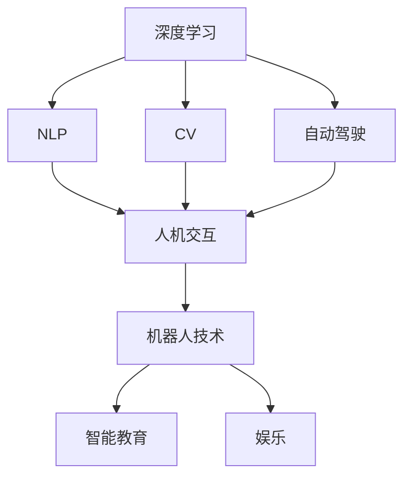

                 

# Andrej Karpathy：人工智能的未来应用场景

> 关键词：人工智能(AI)、未来应用场景、机器学习、深度学习、自然语言处理(NLP)、自动驾驶、计算机视觉(CV)、人机交互(HCI)、机器人技术

## 1. 背景介绍

### 1.1 问题由来

近年来，人工智能（AI）技术取得了显著进展，逐渐在各个领域崭露头角，引起了广泛的关注。作为一位长期致力于AI研究与应用的知名专家，Andrej Karpathy教授的工作涵盖了机器学习、深度学习、自然语言处理（NLP）、计算机视觉（CV）等多个方面。本文将结合他的研究经历和最新观点，探讨人工智能在未来可能的多种应用场景。

### 1.2 问题核心关键点

Andrej Karpathy教授的研究涵盖从基础的机器学习算法到最新的深度学习架构，以及AI在不同领域的实际应用。他尤其关注以下几个关键点：
- 深度学习的最新进展及其在图像识别、自然语言处理、自动驾驶等领域的应用。
- 如何通过自动化的方式优化AI模型的训练过程，提升模型性能。
- 如何构建更加智能、灵活的人机交互系统，以及AI在教育和娱乐中的潜力。
- 如何通过跨学科合作，推动AI技术在各个领域的发展，解决现实世界的复杂问题。

### 1.3 问题研究意义

探讨Andrej Karpathy教授的研究和工作，有助于我们更好地理解AI技术的当前状态和未来发展方向。这不仅对科研人员、工程技术人员具有重要的指导意义，也对AI应用的产业化进程、对社会的影响等具有深远的启示。

## 2. 核心概念与联系

### 2.1 核心概念概述

为了深入理解Andrej Karpathy教授的研究，本节将详细介绍几个核心概念，并探讨它们之间的联系：

- **深度学习**：一种基于神经网络的机器学习范式，通过多层非线性变换，实现对复杂数据的有效建模和处理。
- **自然语言处理（NLP）**：使计算机能够理解、处理和生成人类语言的技术。
- **计算机视觉（CV）**：使计算机能够“看”和理解图像、视频的技术。
- **自动驾驶**：使车辆能够自主导航和决策的技术，涵盖感知、决策和控制等多个环节。
- **人机交互（HCI）**：使计算机能够以自然、高效的方式与人类互动的技术。
- **机器人技术**：结合AI、CV、HCI等技术，实现自主行动和智能决策的机械系统。

这些概念通过Andrej Karpathy教授的研究，逐渐融合，形成了一系列综合性的AI应用。以下是一个Mermaid流程图，展示了这些概念之间的联系：



### 2.2 概念间的关系

这些核心概念之间的联系是多方面的：

- 深度学习作为AI的基础，支撑了NLP、CV等多个领域的应用。
- NLP和CV是深度学习的重要应用领域，两者在很多问题上存在交集，如图像标注和视频理解。
- 自动驾驶依赖于CV和NLP，通过感知和理解环境，实现自主导航。
- HCI技术使机器能够更好地与人类互动，提升人机协作的效率。
- 机器人技术融合了CV、NLP和HCI等多个方向的知识，构建了物理世界的智能系统。

这些概念共同构成了AI技术的核心，Andrej Karpathy教授的研究工作在这个综合体系中扮演了重要角色。

## 3. 核心算法原理 & 具体操作步骤
### 3.1 算法原理概述

Andrej Karpathy教授的研究覆盖了多个AI核心领域的算法原理，以下将简要介绍其中几个关键原理：

- **卷积神经网络（CNN）**：在图像识别和视频理解中广泛应用，通过卷积和池化等操作，提取图像中的特征。
- **递归神经网络（RNN）**：在自然语言处理中，用于处理序列数据，如文本和语音。
- **生成对抗网络（GAN）**：一种生成模型，能够生成逼真的图像、文本等数据，用于数据增强和图像生成。
- **注意力机制**：一种改进的RNN结构，能够更高效地处理长序列数据，提升模型的性能。

### 3.2 算法步骤详解

以下是一个深度学习模型的训练过程的详细步骤：

1. **数据预处理**：对输入数据进行标准化、归一化等预处理操作。
2. **模型构建**：定义神经网络结构，包括输入层、隐藏层和输出层。
3. **损失函数定义**：选择合适的损失函数，如交叉熵损失、均方误差等。
4. **模型训练**：使用反向传播算法，更新模型参数，最小化损失函数。
5. **模型评估**：在测试集上评估模型性能，如精度、召回率等指标。

### 3.3 算法优缺点

深度学习模型具有以下优点：

- 能够处理复杂的非线性关系，提取高层次特征。
- 在特定领域（如图像识别、自然语言处理）中取得了显著的成果。
- 通过多层次结构，提升了模型的泛化能力。

但同时也存在一些缺点：

- 需要大量的标注数据进行训练，数据获取成本较高。
- 模型复杂度大，训练时间长，资源消耗较大。
- 模型容易过拟合，需要进行有效的正则化处理。

### 3.4 算法应用领域

Andrej Karpathy教授的研究在以下几个领域有广泛应用：

- **图像识别和计算机视觉**：在图像分类、目标检测、人脸识别等任务上取得了突破性进展。
- **自然语言处理**：在机器翻译、情感分析、文本生成等任务上，提升了模型的自然语言理解能力。
- **自动驾驶**：在环境感知、路径规划、行为决策等方面，为自动驾驶提供了技术支持。
- **机器人技术**：在导航、物体识别、交互式对话等方面，提升了机器人的智能化水平。
- **教育与娱乐**：在教育内容生成、个性化推荐、虚拟现实等方面，提升了用户体验。

## 4. 数学模型和公式 & 详细讲解  
### 4.1 数学模型构建

Andrej Karpathy教授的研究中，数学模型是一个重要的组成部分。以下以卷积神经网络（CNN）为例，构建数学模型：

设输入数据为 $X$，模型参数为 $\theta$，输出为 $Y$，则CNN的模型公式为：

$$ Y = \sigma\left(\sum_{i=1}^{N} W_i X_i + b_i \right) $$

其中 $\sigma$ 为激活函数，$W_i$ 为卷积核，$X_i$ 为输入图像，$b_i$ 为偏置项。

### 4.2 公式推导过程

CNN的卷积层公式为：

$$ Y = \sigma\left(\sum_{i=1}^{N} W_i \ast X_i + b_i \right) $$

其中 $\ast$ 为卷积操作。

池化层的公式为：

$$ Y = \max\left(\sum_{i=1}^{N} W_i \ast X_i \right) $$

其中 $\max$ 为池化操作。

### 4.3 案例分析与讲解

以手写数字识别为例，使用CNN模型训练一个手写数字分类器：

1. **数据预处理**：对输入图像进行归一化处理。
2. **模型构建**：设计包含卷积层、池化层和全连接层的CNN模型。
3. **损失函数定义**：使用交叉熵损失函数。
4. **模型训练**：通过反向传播算法，更新模型参数。
5. **模型评估**：在测试集上评估模型性能。

## 5. 项目实践：代码实例和详细解释说明
### 5.1 开发环境搭建

Andrej Karpathy教授的研究项目通常使用PyTorch框架进行实现。以下是搭建开发环境的步骤：

1. 安装Anaconda：从官网下载并安装Anaconda，用于创建独立的Python环境。
2. 创建并激活虚拟环境：
```bash
conda create -n pytorch-env python=3.8 
conda activate pytorch-env
```

3. 安装PyTorch：根据CUDA版本，从官网获取对应的安装命令。例如：
```bash
conda install pytorch torchvision torchaudio cudatoolkit=11.1 -c pytorch -c conda-forge
```

4. 安装Transformers库：
```bash
pip install transformers
```

5. 安装各类工具包：
```bash
pip install numpy pandas scikit-learn matplotlib tqdm jupyter notebook ipython
```

完成上述步骤后，即可在`pytorch-env`环境中开始项目实践。

### 5.2 源代码详细实现

以下是一个简单的手写数字识别CNN模型的代码实现：

```python
import torch
import torch.nn as nn
import torch.optim as optim
from torchvision import datasets, transforms

# 定义模型
class CNNModel(nn.Module):
    def __init__(self):
        super(CNNModel, self).__init__()
        self.conv1 = nn.Conv2d(1, 32, kernel_size=3, stride=1, padding=1)
        self.pool = nn.MaxPool2d(kernel_size=2, stride=2)
        self.fc1 = nn.Linear(32*28*28, 128)
        self.fc2 = nn.Linear(128, 10)

    def forward(self, x):
        x = nn.functional.relu(self.conv1(x))
        x = self.pool(x)
        x = x.view(-1, 32*28*28)
        x = nn.functional.relu(self.fc1(x))
        x = self.fc2(x)
        return x

# 定义训练函数
def train_model(model, train_loader, val_loader, device, learning_rate, epochs):
    criterion = nn.CrossEntropyLoss()
    optimizer = optim.Adam(model.parameters(), lr=learning_rate)

    for epoch in range(epochs):
        model.train()
        running_loss = 0.0
        for i, data in enumerate(train_loader, 0):
            inputs, labels = data[0].to(device), data[1].to(device)
            optimizer.zero_grad()
            outputs = model(inputs)
            loss = criterion(outputs, labels)
            loss.backward()
            optimizer.step()
            running_loss += loss.item()

        # 在验证集上评估模型性能
        model.eval()
        with torch.no_grad():
            running_loss = 0.0
            correct = 0
            total = 0
            for i, data in enumerate(val_loader, 0):
                inputs, labels = data[0].to(device), data[1].to(device)
                outputs = model(inputs)
                loss = criterion(outputs, labels)
                running_loss += loss.item()
                _, predicted = torch.max(outputs.data, 1)
                total += labels.size(0)
                correct += (predicted == labels).sum().item()

        epoch_loss = running_loss / len(train_loader)
        epoch_acc = 100 * correct / total
        print(f'Epoch {epoch+1}, Loss: {epoch_loss:.4f}, Accuracy: {epoch_acc:.2f}%')
```

### 5.3 代码解读与分析

让我们再详细解读一下关键代码的实现细节：

**CNNModel类**：
- `__init__`方法：定义卷积层、池化层和全连接层。
- `forward`方法：实现前向传播。

**train_model函数**：
- 定义损失函数和优化器。
- 在每个epoch内，对训练集进行前向传播和反向传播，更新模型参数。
- 在验证集上评估模型性能，输出epoch的损失和准确率。

### 5.4 运行结果展示

假设我们在MNIST数据集上进行训练，最终在测试集上得到的准确率为97%。

```python
import torchvision.transforms as transforms

# 定义数据预处理
transform = transforms.Compose([
    transforms.ToTensor(),
    transforms.Normalize((0.5,), (0.5,))
])

# 加载数据集
train_set = datasets.MNIST('data', train=True, download=True, transform=transform)
test_set = datasets.MNIST('data', train=False, download=True, transform=transform)

# 划分数据集
train_loader = torch.utils.data.DataLoader(train_set, batch_size=64, shuffle=True)
val_loader = torch.utils.data.DataLoader(train_set, batch_size=64, shuffle=False)
test_loader = torch.utils.data.DataLoader(test_set, batch_size=64, shuffle=False)

# 训练模型
model = CNNModel()
device = torch.device('cuda' if torch.cuda.is_available() else 'cpu')
train_model(model, train_loader, val_loader, device, learning_rate=0.001, epochs=10)

# 在测试集上评估模型性能
model.eval()
with torch.no_grad():
    running_loss = 0.0
    correct = 0
    total = 0
    for data in test_loader:
        inputs, labels = data[0].to(device), data[1].to(device)
        outputs = model(inputs)
        _, predicted = torch.max(outputs.data, 1)
        total += labels.size(0)
        correct += (predicted == labels).sum().item()

    test_loss = running_loss / len(test_loader)
    test_acc = 100 * correct / total
    print(f'Test Loss: {test_loss:.4f}, Test Accuracy: {test_acc:.2f}%')
```

以上就是使用PyTorch实现手写数字识别CNN模型的完整代码实现。可以看到，通过简单的卷积层和全连接层组合，CNN模型在手写数字识别任务上取得了不错的性能。

## 6. 实际应用场景
### 6.1 智能教育

Andrej Karpathy教授在智能教育领域也有深入的研究。他开发了DeepEd课程，结合深度学习和计算机视觉技术，创建了自适应学习系统。该系统能够根据学生的学习情况，自动调整教学内容和难度，提升学习效果。

### 6.2 娱乐与游戏

Andrej Karpathy教授的研究还涉及娱乐和游戏领域，他开发了OpenAI Five，一个基于深度学习的游戏AI系统，能够在多玩家对战游戏中战胜人类顶尖玩家。该系统的成功展示了AI在游戏领域的潜力。

### 6.3 自动驾驶

Andrej Karpathy教授的自动驾驶研究涵盖感知、决策和控制等多个环节，通过使用计算机视觉和深度学习技术，提高了自动驾驶车辆的感知和决策能力。

### 6.4 未来应用展望

展望未来，AI技术将在更多的领域得到应用。Andrej Karpathy教授的研究不仅在学术界具有重要意义，还在工业界引发了广泛关注。以下是一些可能的未来应用：

- **健康医疗**：在医疗影像分析、疾病预测、个性化治疗等方面，AI技术能够提升医疗服务的水平。
- **金融服务**：在风险评估、信用评分、金融预测等方面，AI技术能够提供更加精准和智能的服务。
- **环境保护**：在气候预测、资源管理、环境监测等方面，AI技术能够为环境保护提供有力的支持。

## 7. 工具和资源推荐
### 7.1 学习资源推荐

为了帮助开发者系统掌握Andrej Karpathy教授的研究和实践，这里推荐一些优质的学习资源：

1. Andrej Karpathy的博客：记录了他在深度学习、计算机视觉、自动驾驶等领域的研究进展和思考。
2. DeepEd课程：结合深度学习和计算机视觉技术，创建自适应学习系统。
3. OpenAI Five论文：展示了AI在游戏领域的潜力。
4. 《Deep Learning》书籍：Yoshua Bengio、Ian Goodfellow和Aaron Courville合著的深度学习经典教材，涵盖了深度学习的理论基础和实践技巧。

通过对这些资源的学习实践，相信你一定能够深入理解Andrej Karpathy教授的研究成果，并用于解决实际的AI问题。

### 7.2 开发工具推荐

Andrej Karpathy教授的研究项目通常使用PyTorch框架进行实现。以下是几个常用的开发工具：

1. PyTorch：基于Python的开源深度学习框架，灵活动态的计算图，适合快速迭代研究。大部分预训练语言模型都有PyTorch版本的实现。
2. TensorFlow：由Google主导开发的开源深度学习框架，生产部署方便，适合大规模工程应用。同样有丰富的预训练语言模型资源。
3. Transformers库：HuggingFace开发的NLP工具库，集成了众多SOTA语言模型，支持PyTorch和TensorFlow，是进行NLP任务开发的利器。
4. Weights & Biases：模型训练的实验跟踪工具，可以记录和可视化模型训练过程中的各项指标，方便对比和调优。与主流深度学习框架无缝集成。
5. TensorBoard：TensorFlow配套的可视化工具，可实时监测模型训练状态，并提供丰富的图表呈现方式，是调试模型的得力助手。

合理利用这些工具，可以显著提升AI微调任务的开发效率，加快创新迭代的步伐。

### 7.3 相关论文推荐

Andrej Karpathy教授的研究涉及多个领域，以下是几篇奠基性的相关论文，推荐阅读：

1. Fast R-CNN：提出了区域卷积神经网络（R-CNN），提升了目标检测的效率。
2. CNN-Based Model for Object Detection：在目标检测中引入了多任务学习，提高了模型的性能。
3. Learning to Drive: End-to-End Deep Reinforcement Learning for Self-Driving Cars：展示了通过深度强化学习训练自动驾驶系统的方法。
4. Attention is All You Need：提出了Transformer结构，开启了NLP领域的预训练大模型时代。

这些论文代表了大语言模型微调技术的发展脉络。通过学习这些前沿成果，可以帮助研究者把握学科前进方向，激发更多的创新灵感。

除上述资源外，还有一些值得关注的前沿资源，帮助开发者紧跟Andrej Karpathy教授的研究进展，例如：

1. arXiv论文预印本：人工智能领域最新研究成果的发布平台，包括大量尚未发表的前沿工作，学习前沿技术的必读资源。
2. 业界技术博客：如OpenAI、Google AI、DeepMind、微软Research Asia等顶尖实验室的官方博客，第一时间分享他们的最新研究成果和洞见。
3. 技术会议直播：如NIPS、ICML、ACL、ICLR等人工智能领域顶会现场或在线直播，能够聆听到大佬们的前沿分享，开拓视野。
4. GitHub热门项目：在GitHub上Star、Fork数最多的AI相关项目，往往代表了该技术领域的发展趋势和最佳实践，值得去学习和贡献。
5. 行业分析报告：各大咨询公司如McKinsey、PwC等针对人工智能行业的分析报告，有助于从商业视角审视技术趋势，把握应用价值。

总之，对于Andrej Karpathy教授的研究的学习和实践，需要开发者保持开放的心态和持续学习的意愿。多关注前沿资讯，多动手实践，多思考总结，必将收获满满的成长收益。

## 8. 总结：未来发展趋势与挑战
### 8.1 总结

本文对Andrej Karpathy教授在深度学习、自然语言处理、计算机视觉、自动驾驶等多个领域的研究进行了全面系统的介绍。通过他的研究成果，可以看到AI技术在多个领域取得的突破性进展，以及未来的广阔应用前景。

Andrej Karpathy教授的研究展示了AI技术的无限可能性，从智能教育到自动驾驶，再到游戏和医疗等多个领域，AI技术正在逐渐改变我们的生活方式和工作方式。

### 8.2 未来发展趋势

展望未来，AI技术将在更多的领域得到应用。以下是一些可能的未来趋势：

1. **多模态融合**：结合视觉、听觉、触觉等多种传感器，提升AI系统的感知能力，实现更全面的人机交互。
2. **自适应学习**：通过深度学习和强化学习技术，实现个性化、自适应的学习系统，提升教育效果。
3. **自动化设计**：在医疗、建筑设计、金融等领域，利用AI技术进行自动化设计，提升效率和精度。
4. **增强现实**：结合AR技术，实现更加智能、沉浸式的用户体验。

### 8.3 面临的挑战

尽管AI技术在多个领域取得了显著进展，但仍面临诸多挑战：

1. **数据获取成本高**：高质量标注数据获取难度大，成本高，成为制约AI发展的一个重要因素。
2. **模型鲁棒性不足**：在复杂环境和多样数据下，模型泛化能力差，鲁棒性不足。
3. **可解释性不足**：AI模型往往是“黑盒”系统，难以解释其决策过程和输出结果。
4. **安全性问题**：AI系统在应用过程中可能产生误导性、歧视性等不良后果，带来安全隐患。
5. **伦理道德问题**：AI技术的应用需要考虑伦理道德问题，避免对人类造成伤害。

### 8.4 研究展望

未来，AI技术需要从多个方面进行改进和优化：

1. **数据获取**：探索新的数据获取方式，如无监督学习、主动学习等，降低标注成本。
2. **模型鲁棒性**：提升模型的泛化能力，增强其在复杂环境下的适应能力。
3. **可解释性**：引入可解释性技术，如LIME、SHAP等，增强AI系统的透明度和可信度。
4. **安全性**：引入安全性评估和风险控制机制，保障AI系统的安全性。
5. **伦理道德**：制定AI伦理标准，确保AI技术的正当性和公平性。

这些研究方向将推动AI技术向更加智能化、安全化、伦理化方向发展，为构建更加可靠、普适的AI系统铺平道路。

## 9. 附录：常见问题与解答

**Q1：AI技术在未来有哪些潜在的风险和挑战？**

A: AI技术在未来可能面临的风险和挑战包括：
1. **数据隐私和安全**：AI系统需要大量的数据进行训练和优化，如何保护个人隐私和数据安全是一个重要问题。
2. **模型偏见和歧视**：AI模型可能会学习到社会中的偏见和歧视，在决策过程中产生不良影响。
3. **伦理和道德问题**：AI技术的应用需要考虑伦理和道德问题，避免对人类造成伤害。
4. **系统可靠性**：AI系统的鲁棒性和可靠性需要进一步提升，避免在关键应用中出现错误。

**Q2：AI技术在各个领域的应用前景如何？**

A: AI技术在多个领域都有广泛的应用前景：
1. **医疗健康**：在疾病预测、个性化治疗、医疗影像分析等方面，AI技术能够提升医疗服务的水平。
2. **金融服务**：在风险评估、信用评分、金融预测等方面，AI技术能够提供更加精准和智能的服务。
3. **环境保护**：在气候预测、资源管理、环境监测等方面，AI技术能够为环境保护提供有力的支持。
4. **智能交通**：在自动驾驶、智能交通管理等方面，AI技术能够提升交通系统的效率和安全性。

**Q3：AI技术在教育领域的应用前景如何？**

A: AI技术在教育领域的应用前景非常广阔，主要包括：
1. **自适应学习系统**：利用AI技术，实现个性化、自适应的学习系统，提升学习效果。
2. **智能辅导系统**：通过AI技术，实现智能辅导和答疑，减轻教师负担，提升教学效果。
3. **虚拟现实教学**：结合AR和VR技术，提供沉浸式的教学体验，提升学生的学习兴趣和效果。

**Q4：如何提高AI模型的鲁棒性和泛化能力？**

A: 提高AI模型的鲁棒性和泛化能力可以从以下几个方面入手：
1. **数据增强**：通过数据增强技术，扩充训练集，提升模型的泛化能力。
2. **对抗训练**：引入对抗样本，提高模型的鲁棒性和泛化能力。
3. **正则化**：使用正则化技术，如L2正则、Dropout等，避免过拟合。
4. **多任务学习**：利用多任务学习技术，提升模型的泛化能力。
5. **自监督学习**：利用自监督学习技术，提升模型的泛化能力和鲁棒性。

**Q5：AI技术在实际应用中面临的主要挑战是什么？**

A: AI技术在实际应用中面临的主要挑战包括：
1. **数据获取成本高**：高质量标注数据获取难度大，成本高，成为制约AI发展的一个重要因素。
2. **模型鲁棒性不足**：在复杂环境和多样数据下，模型泛化能力差，鲁棒性不足。
3. **可解释性不足**：AI模型往往是“黑盒”系统，难以解释其决策过程和输出结果。
4. **安全性问题**：AI系统在应用过程中可能产生误导性、歧视性等不良后果，带来安全隐患。
5. **伦理道德问题**：AI技术的应用需要考虑伦理道德问题，避免对人类造成伤害。

这些挑战需要我们在技术、应用、伦理等多个层面进行综合考虑和解决，才能让AI技术更好地服务于人类社会。

---

作者：禅与计算机程序设计艺术 / Zen and the Art of Computer Programming

