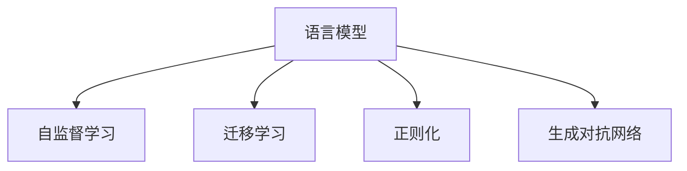
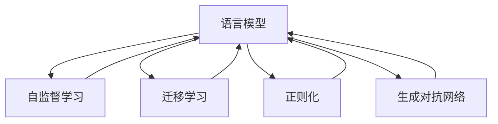

                 

## 1. 背景介绍

### 1.1 问题由来
在当前的自然语言处理（NLP）领域，语言模型已经成为了推动技术进步的核心工具。然而，尽管语言模型在处理文本数据方面表现出色，其自身的复杂性和局限性仍然值得深入探讨。我们常常认为，一个完备的语言模型应当能够理解和生成尽可能多的自然语言表达，但这种观点忽视了语言模型的本质与限制。在本文中，我们将深入探讨这一问题，并讨论如何构建更加丰富和实用的语言模型。

### 1.2 问题核心关键点
语言模型的核心问题在于如何平衡模型的复杂性与性能，以及如何确保模型能够准确地反映和生成自然语言的各个方面。这涉及到模型的架构设计、训练策略以及数据选择等多个方面。

1. **模型的复杂性**：模型的复杂性越高，其参数量和计算成本也就越高。然而，复杂性高的模型不一定能够生成更自然、更符合人类语言习惯的表达。
2. **模型的训练**：有效的训练策略对于模型的性能至关重要。训练数据的选择、学习率的调整、正则化的应用等都是需要考虑的关键因素。
3. **模型的应用**：在实际应用中，语言模型需要能够处理各种类型的文本数据，并产生有意义和有用的输出。这要求模型具有泛化能力和灵活性。

### 1.3 问题研究意义
深入理解语言模型的本质与限制，对于构建更加实用和高效的NLP系统具有重要意义。这不仅能够提升模型的性能，还能帮助我们避免陷入过度复杂和无法解释的模型中。

## 2. 核心概念与联系

### 2.1 核心概念概述

在本节中，我们将介绍几个与语言模型密切相关的核心概念：

- **语言模型**：用于评估文本序列的概率分布的模型。语言模型的目标是预测下一个单词或字符，从而生成文本。
- **自监督学习**：在无需人工标注的情况下，利用数据的内在关系进行模型训练。自监督学习常用于预训练语言模型。
- **迁移学习**：将一个领域学到的知识应用到另一个领域的学习过程。在NLP中，迁移学习常用于微调预训练语言模型。
- **正则化**：通过限制模型的复杂性，防止过拟合。正则化常用于模型训练中，以提升模型泛化能力。
- **生成对抗网络（GAN）**：一种通过对抗训练提升模型性能的技术，可用于生成逼真文本。

这些核心概念通过逻辑图（见下文）展示了它们之间的联系：



### 2.2 概念间的关系

这些核心概念之间的关系，可以通过以下逻辑图进一步展示：



### 2.3 核心概念的整体架构

综合上述概念，我们得到如下语言模型的架构图：


## 3. 核心算法原理 & 具体操作步骤
### 3.1 算法原理概述

语言模型的核心原理是利用历史上下文信息预测下一个单词或字符的概率。其基本步骤包括：

1. **数据预处理**：对文本数据进行清洗、分词、编码等处理，以便模型能够理解输入。
2. **模型训练**：使用自监督学习任务训练模型，使其学习到语言的内在规律。
3. **迁移学习**：将预训练好的语言模型应用于特定任务，通过微调优化模型性能。
4. **正则化**：在模型训练过程中，应用正则化技术，防止过拟合。
5. **生成对抗网络**：利用GAN技术生成高质量的文本，进一步提升语言模型的性能。

### 3.2 算法步骤详解

以下是详细的算法步骤：

**Step 1: 数据预处理**

1. 收集文本数据，并进行清洗、分词、编码等处理。
2. 将文本数据划分为训练集和验证集。

**Step 2: 模型训练**

1. 选择语言模型，如RNN、LSTM、GRU等。
2. 使用自监督学习任务（如语言建模）进行预训练。
3. 应用正则化技术（如L2正则、Dropout等），防止过拟合。

**Step 3: 迁移学习**

1. 选择合适的预训练语言模型。
2. 准备下游任务的数据集。
3. 设计任务适配层，将预训练语言模型与下游任务结合。
4. 进行微调，优化模型在特定任务上的性能。

**Step 4: 生成对抗网络**

1. 构建生成器和判别器，分别用于生成文本和判断文本的真实性。
2. 通过对抗训练，提升生成器的文本生成能力。

### 3.3 算法优缺点

语言模型的优点包括：

1. **高性能**：自监督学习预训练可以显著提升模型的性能。
2. **泛化能力强**：迁移学习可以应用于多种下游任务。
3. **可解释性**：正则化有助于模型解释性，防止过拟合。

缺点包括：

1. **计算成本高**：自监督预训练和正则化训练需要大量的计算资源。
2. **数据依赖**：模型性能依赖于训练数据的丰富性和质量。
3. **可控性差**：模型生成的文本质量受多种因素影响，难以完全控制。

### 3.4 算法应用领域

语言模型在NLP领域有广泛的应用，包括：

- **机器翻译**：将源语言文本翻译成目标语言。
- **文本摘要**：对长文本进行压缩和总结。
- **对话系统**：使机器能够与人类进行自然对话。
- **情感分析**：判断文本的情感倾向。
- **文本分类**：将文本分类到不同的类别。

## 4. 数学模型和公式 & 详细讲解  
### 4.1 数学模型构建

假设我们有一个语言模型 $M$，其参数为 $\theta$。语言模型的任务是预测下一个单词 $y$ 的概率分布，即 $P(y|x)$，其中 $x$ 为输入的上下文序列。

**目标函数**：最小化交叉熵损失函数：

$$
\mathcal{L}(M, X, Y) = -\frac{1}{N}\sum_{i=1}^N \log P(y_i|x_i)
$$

其中 $N$ 为样本数量，$(x_i, y_i)$ 为训练样本，$P(y_i|x_i)$ 为模型预测下一个单词的概率。

**梯度下降**：通过反向传播计算损失函数对模型参数的梯度，更新模型参数：

$$
\theta \leftarrow \theta - \eta \nabla_{\theta}\mathcal{L}(M, X, Y)
$$

其中 $\eta$ 为学习率。

### 4.2 公式推导过程

以LSTM语言模型为例，推导其参数更新公式。

**前向传播**：

$$
h_t = \tanh(W_{xh}x_t + U_hh_{t-1} + b_h)
$$

$$
c_t = \tanh(W_{xc}x_t + U_cc_{t-1} + b_c)
$$

$$
g_t = \sigma(W_{xg}x_t + U_gg_{t-1} + b_g)
$$

$$
o_t = \sigma(W_{xo}x_t + U_gg_{t-1} + b_o)
$$

$$
c_t = f_t \cdot c_{t-1} + (1-f_t) \cdot \tanh(h_t)
$$

其中 $f_t$ 为遗忘门，$W_{xh}$、$U_h$、$b_h$ 等为模型参数。

**后向传播**：

$$
\frac{\partial \mathcal{L}}{\partial h_t} = \frac{\partial P(y_t|x_t)}{\partial h_t}
$$

**梯度更新**：

$$
\theta \leftarrow \theta - \eta \nabla_{\theta}\mathcal{L}(M, X, Y)
$$

### 4.3 案例分析与讲解

以BERT为例，BERT使用掩码语言模型和下一句预测任务进行预训练。在微调时，通过添加特定的任务适配层，调整模型以适应特定任务。

**微调目标函数**：

$$
\mathcal{L}(M, D) = -\frac{1}{N}\sum_{i=1}^N \log M(y_i|x_i)
$$

其中 $M$ 为微调后的BERT模型，$D$ 为微调数据集。

**参数更新**：

$$
\theta \leftarrow \theta - \eta \nabla_{\theta}\mathcal{L}(M, D)
$$

## 5. 项目实践：代码实例和详细解释说明
### 5.1 开发环境搭建

**Step 1: 安装依赖**

```bash
pip install torch torchvision torchaudio transformers
```

**Step 2: 准备数据**

```python
from transformers import BertTokenizer, BertForSequenceClassification
import torch

# 数据预处理
tokenizer = BertTokenizer.from_pretrained('bert-base-uncased')
train_encodings = tokenizer(train_dataset, truncation=True, padding=True)
test_encodings = tokenizer(test_dataset, truncation=True, padding=True)
```

**Step 3: 定义模型**

```python
model = BertForSequenceClassification.from_pretrained('bert-base-uncased', num_labels=2)
```

**Step 4: 训练模型**

```python
from torch.utils.data import DataLoader
from torch.optim import AdamW
import torch.nn.functional as F

# 定义优化器
optimizer = AdamW(model.parameters(), lr=2e-5)

# 训练循环
for epoch in range(5):
    model.train()
    for batch in train_dataloader:
        inputs = {key: val.to(device) for key, val in batch.items()}
        outputs = model(**inputs)
        loss = F.cross_entropy(outputs.logits, batch['labels'].to(device))
        loss.backward()
        optimizer.step()
        optimizer.zero_grad()
    
    model.eval()
    for batch in test_dataloader:
        inputs = {key: val.to(device) for key, val in batch.items()}
        outputs = model(**inputs)
        loss = F.cross_entropy(outputs.logits, batch['labels'].to(device))
        print(f'Epoch {epoch+1}, Test Loss: {loss.item():.4f}')
```

### 5.2 源代码详细实现

**Step 1: 数据加载**

```python
from torch.utils.data import Dataset, DataLoader
import torch

class NLPDataset(Dataset):
    def __init__(self, data, tokenizer, max_length):
        self.data = data
        self.tokenizer = tokenizer
        self.max_length = max_length
        
    def __len__(self):
        return len(self.data)
    
    def __getitem__(self, idx):
        text = self.data[idx]
        encoding = self.tokenizer(text, truncation=True, padding=True, max_length=self.max_length)
        return {key: val for key, val in encoding.items()}
```

**Step 2: 模型定义**

```python
from transformers import BertForSequenceClassification

model = BertForSequenceClassification.from_pretrained('bert-base-uncased', num_labels=2)
```

**Step 3: 训练模型**

```python
from torch.optim import AdamW

optimizer = AdamW(model.parameters(), lr=2e-5)

for epoch in range(5):
    model.train()
    for batch in train_dataloader:
        inputs = {key: val.to(device) for key, val in batch.items()}
        outputs = model(**inputs)
        loss = F.cross_entropy(outputs.logits, batch['labels'].to(device))
        loss.backward()
        optimizer.step()
        optimizer.zero_grad()
    
    model.eval()
    for batch in test_dataloader:
        inputs = {key: val.to(device) for key, val in batch.items()}
        outputs = model(**inputs)
        loss = F.cross_entropy(outputs.logits, batch['labels'].to(device))
        print(f'Epoch {epoch+1}, Test Loss: {loss.item():.4f}')
```

### 5.3 代码解读与分析

**数据加载**

- 使用PyTorch的`Dataset`和`DataLoader`来加载和处理数据。
- 定义一个自定义的`NLPDataset`类，对数据进行分词和编码。

**模型定义**

- 使用`BertForSequenceClassification`来定义模型，并设置标签数。
- 使用`AdamW`优化器，设置学习率。

**训练模型**

- 在每个epoch内，对模型进行前向传播和反向传播，更新参数。
- 在每个epoch后，在测试集上评估模型性能。

## 6. 实际应用场景
### 6.1 智能客服系统

在智能客服系统中，语言模型用于理解客户问题和提供智能答复。通过微调，模型能够更好地适应特定领域的语言表达，提升回答的准确性和自然性。

**应用场景**：

- 客户通过自然语言提问。
- 语言模型理解问题，识别意图。
- 根据意图和问题，生成自然语言的答复。

**技术实现**：

- 收集历史客服对话数据，用于预训练和微调。
- 使用微调后的语言模型，对新客户提问进行理解和答复。

### 6.2 金融舆情监测

在金融领域，语言模型用于监测市场舆情，预测股票价格波动。通过微调，模型能够更好地适应金融领域的语言特征，提升预测准确性。

**应用场景**：

- 收集金融新闻、评论等文本数据。
- 使用微调后的语言模型，对新闻进行情感分析。
- 根据情感分析结果，预测股票价格波动。

**技术实现**：

- 收集金融领域相关文本数据，用于预训练和微调。
- 使用微调后的语言模型，对实时获取的市场舆情进行情感分析。
- 根据情感分析结果，预测股票价格波动。

### 6.3 个性化推荐系统

在个性化推荐系统中，语言模型用于分析用户兴趣和行为，推荐适合用户的商品或内容。通过微调，模型能够更好地理解用户的意图和偏好，提升推荐效果。

**应用场景**：

- 用户浏览商品、发布评论。
- 语言模型分析用户行为，提取兴趣标签。
- 根据兴趣标签，推荐商品或内容。

**技术实现**：

- 收集用户行为数据，用于预训练和微调。
- 使用微调后的语言模型，分析用户行为数据。
- 根据分析结果，推荐商品或内容。

### 6.4 未来应用展望

未来，语言模型在NLP领域的应用将更加广泛。随着技术的不断进步，语言模型将能够处理更多样化的文本数据，生成更高质量的文本。

**未来趋势**：

1. **多模态处理**：语言模型将与其他模态（如图像、语音）结合，提升处理能力。
2. **自适应学习**：语言模型将能够根据用户反馈不断调整和优化。
3. **零样本学习**：语言模型将能够在不依赖标注数据的情况下，生成高质量文本。
4. **跨领域应用**：语言模型将能够在不同领域和任务中应用，提升泛化能力。

## 7. 工具和资源推荐
### 7.1 学习资源推荐

**书籍**：

1. 《自然语言处理综论》：详细介绍了NLP的基本概念和经典模型。
2. 《深度学习》：经典深度学习教材，介绍了语言模型的基本原理和应用。

**课程**：

1. Coursera上的NLP课程：由斯坦福大学教授开设，深入讲解NLP的基本概念和技术。
2. Udacity的NLP工程师纳米学位：涵盖NLP的多个方面，包括文本分类、机器翻译等。

### 7.2 开发工具推荐

**框架**：

1. PyTorch：基于Python的深度学习框架，提供了丰富的NLP工具。
2. TensorFlow：Google开源的深度学习框架，支持分布式计算。

**库**：

1. Transformers：由Hugging Face开发的NLP库，提供了丰富的预训练模型和微调接口。
2. NLTK：Python自然语言处理库，提供了大量文本处理工具。

### 7.3 相关论文推荐

**论文**：

1. "Attention is All You Need"：Transformer论文，介绍了Transformer的基本原理和应用。
2. "BERT: Pre-training of Deep Bidirectional Transformers for Language Understanding"：BERT论文，介绍了预训练语言模型的基本原理和应用。

## 8. 总结：未来发展趋势与挑战
### 8.1 研究成果总结

本文总结了大语言模型在NLP领域的应用和挑战。通过深入探讨语言模型的核心原理和操作步骤，展示了如何通过微调提升模型性能。同时，探讨了语言模型在实际应用中的挑战，包括计算资源需求、数据依赖和模型可控性等问题。

### 8.2 未来发展趋势

未来，语言模型将在NLP领域发挥更加重要的作用。随着技术的不断进步，语言模型将能够处理更多样化的文本数据，生成更高质量的文本。同时，多模态处理、自适应学习和零样本学习等技术的不断发展，将进一步提升语言模型的性能。

### 8.3 面临的挑战

尽管语言模型在NLP领域取得了显著进展，但仍面临一些挑战：

1. **计算资源需求**：语言模型需要大量的计算资源，特别是在自监督预训练和微调过程中。
2. **数据依赖**：模型性能依赖于训练数据的丰富性和质量，高质量标注数据的获取成本较高。
3. **模型可控性**：模型生成的文本质量受多种因素影响，难以完全控制。

### 8.4 研究展望

未来，需要在以下几个方面进行深入研究：

1. **参数高效微调**：开发更加参数高效的微调方法，在固定大部分预训练参数的情况下，只更新极少量的任务相关参数。
2. **多模态融合**：将语言模型与其他模态（如图像、语音）结合，提升处理能力。
3. **自适应学习**：开发能够根据用户反馈不断调整和优化的语言模型。
4. **零样本学习**：研究如何让语言模型在不依赖标注数据的情况下，生成高质量文本。

总之，语言模型在NLP领域的应用前景广阔，但面临的挑战也不容忽视。通过不断探索和创新，语言模型将在未来的NLP研究和技术中发挥更加重要的作用。

## 9. 附录：常见问题与解答

**Q1: 什么是语言模型？**

A: 语言模型是一种用于评估文本序列概率分布的模型，其目标是通过历史上下文信息预测下一个单词或字符的概率。

**Q2: 如何训练语言模型？**

A: 语言模型通常通过自监督学习任务进行训练，如语言建模、掩码语言建模等。在训练过程中，使用正则化技术防止过拟合。

**Q3: 什么是微调？**

A: 微调是一种通过在特定任务上对预训练语言模型进行有监督训练，优化模型在该任务上的性能的方法。

**Q4: 微调对语言模型的性能有什么影响？**

A: 微调可以显著提升语言模型在特定任务上的性能，使其能够更好地适应实际应用需求。

**Q5: 如何在微调过程中避免过拟合？**

A: 可以通过正则化、Dropout、Early Stopping等技术防止过拟合。

**Q6: 什么是生成对抗网络（GAN）？**

A: GAN是一种通过对抗训练提升模型性能的技术，可用于生成高质量的文本。

**Q7: 语言模型在实际应用中面临哪些挑战？**

A: 语言模型在实际应用中面临计算资源需求高、数据依赖性强、模型可控性差等挑战。

**Q8: 未来语言模型将面临哪些挑战？**

A: 未来语言模型将面临计算资源需求更高、数据依赖更强、模型可控性更难等问题。

**Q9: 如何提升语言模型的性能？**

A: 可以通过参数高效微调、多模态融合、自适应学习、零样本学习等技术提升语言模型性能。

**Q10: 如何构建更加实用的语言模型？**

A: 需要考虑模型的复杂性与性能，确保模型能够准确地反映和生成自然语言的各个方面。

