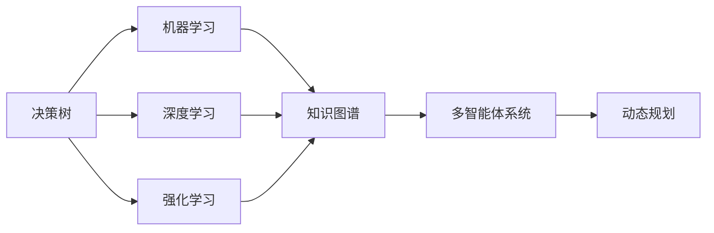

                 

# AI辅助决策系统:提高决策质量与速度

## 1. 背景介绍

在信息爆炸的时代，决策的重要性不言而喻。无论是企业的战略制定、金融投资的分析，还是医疗诊断的判断，决策者都需要在庞大的数据中寻找线索，作出最优选择。然而，人工决策存在诸多局限，如信息过载、偏见和情绪化等。为了提升决策的科学性和速度，人工智能（AI）辅助决策系统应运而生。

### 1.1 问题由来
随着大数据技术的发展，企业和社会决策中可利用的信息量不断增加。然而，信息的庞杂性和模糊性使得人工决策难以应对。此外，人类决策中的固有偏见和情绪化问题，可能导致决策失误。例如，投资者基于情绪化的交易行为，可能导致市场失衡；医生在情绪化影响下，可能误诊或漏诊病人。因此，利用AI技术提升决策的客观性和效率，成为研究热点。

### 1.2 问题核心关键点
AI辅助决策系统通过整合数据、模型和知识，自动化地帮助决策者发现最优决策。其核心在于：
1. **数据整合与处理**：自动收集、清洗和处理海量数据，提取有价值的信息。
2. **模型训练与优化**：通过深度学习和强化学习等技术，训练高效预测模型。
3. **知识图谱构建**：融合符号化知识，增强模型的普适性和可靠性。
4. **动态更新与优化**：基于实时数据和反馈，不断更新模型，提高决策的时效性和适应性。

### 1.3 问题研究意义
AI辅助决策系统可以显著提升决策的准确性和效率，其意义在于：
1. **提升决策效率**：自动处理大量数据，大幅减少人工工作量，加速决策过程。
2. **增强决策质量**：结合机器学习模型和专家知识，提供科学可靠的决策建议。
3. **优化资源配置**：通过数据分析，优化资源分配，提升运营效率。
4. **降低风险**：减少人为失误，提高决策的稳定性和可靠性。

## 2. 核心概念与联系

### 2.1 核心概念概述

为了更好地理解AI辅助决策系统的原理和应用，本节将介绍几个密切相关的核心概念：

- **决策树（Decision Tree）**：一种基于树形结构的分类模型，用于自动化地分类和预测。
- **机器学习（Machine Learning）**：通过数据训练模型，自动优化预测能力的机器学习技术。
- **深度学习（Deep Learning）**：一种多层次的神经网络模型，用于处理复杂的非线性关系。
- **强化学习（Reinforcement Learning）**：通过奖励和惩罚机制，训练智能体最大化累积奖励的策略。
- **知识图谱（Knowledge Graph）**：一种语义化的知识表示方法，用于融合结构化数据和非结构化数据。
- **多智能体系统（Multi-agent Systems）**：由多个智能体相互协作，进行复杂决策的分布式系统。
- **动态规划（Dynamic Programming）**：一种优化算法，用于解决多阶段决策问题。

这些核心概念共同构成了AI辅助决策系统的基本框架，使得AI可以处理各种复杂决策问题，为决策者提供可靠支持。

### 2.2 概念间的关系

这些核心概念之间的联系可以通过以下Mermaid流程图来展示：



这个流程图展示了AI辅助决策系统的基本架构，从决策树到深度学习、强化学习，再到知识图谱和多智能体系统，最终通过动态规划进行优化决策。

## 3. 核心算法原理 & 具体操作步骤
### 3.1 算法原理概述

AI辅助决策系统主要基于以下核心算法：

1. **决策树算法**：用于构建分类模型，通过决策树自动选择最优的特征和决策路径，实现高效预测。
2. **深度学习算法**：通过多层神经网络模型，自动提取特征，处理非线性关系，提高预测精度。
3. **强化学习算法**：通过奖励和惩罚机制，优化策略选择，适应动态环境。
4. **知识图谱算法**：融合符号化知识，增强模型的普适性和可靠性。
5. **动态规划算法**：通过递归求解最优策略，处理多阶段决策问题。

### 3.2 算法步骤详解

1. **数据收集与预处理**：收集与决策相关的数据，包括文本、图像、时序数据等。对数据进行清洗、归一化、缺失值处理等预处理操作，确保数据质量和一致性。

2. **特征提取与选择**：使用特征提取算法，从原始数据中提取有价值的信息。通过特征选择算法，去除冗余特征，提高模型效率。

3. **模型训练与优化**：使用机器学习或深度学习算法，训练预测模型。通过交叉验证、网格搜索等技术，优化模型参数和超参数。

4. **知识融合与图谱构建**：将专家知识和领域数据融合到知识图谱中，构建语义化的知识表示。通过关系抽取、实体识别等技术，自动构建知识图谱。

5. **策略学习与优化**：使用强化学习算法，训练智能体进行决策。通过Q学习、策略梯度等技术，优化策略选择。

6. **多智能体协作**：设计多智能体系统，通过协作求解复杂决策问题。通过通信协议、共识机制等技术，实现智能体间的信息共享和协同决策。

7. **动态更新与优化**：基于实时数据和反馈，不断更新模型和策略，提高决策的时效性和适应性。

### 3.3 算法优缺点

AI辅助决策系统的优点在于：

1. **高效处理数据**：自动处理大量数据，减少人工工作量。
2. **提高决策质量**：融合机器学习和专家知识，提供科学可靠的决策建议。
3. **优化资源配置**：通过数据分析，优化资源分配。
4. **降低风险**：减少人为失误，提高决策的稳定性和可靠性。

但同时也存在一些局限：

1. **数据依赖**：依赖高质量数据，数据质量和一致性对模型效果有很大影响。
2. **模型复杂性**：模型复杂度高，训练和推理效率较低。
3. **知识获取**：专家知识和领域数据获取难度大，可能影响模型效果。
4. **动态适应性**：模型需要实时更新，维护成本较高。

### 3.4 算法应用领域

AI辅助决策系统已经在多个领域得到了广泛应用，例如：

- **金融投资**：利用机器学习算法预测股票趋势，结合知识图谱分析市场动态，辅助投资决策。
- **医疗诊断**：通过深度学习算法分析影像数据，结合知识图谱进行疾病诊断，提高诊断准确率。
- **风险管理**：利用强化学习算法评估风险等级，结合动态规划优化风险控制策略。
- **供应链管理**：通过数据分析优化库存管理，结合多智能体协作优化供应链决策。
- **智能交通**：利用传感器数据优化交通流，结合动态规划优化交通信号控制。

## 4. 数学模型和公式 & 详细讲解 & 举例说明

### 4.1 数学模型构建

假设决策问题为$D$，包含状态空间$S$、动作空间$A$、状态转移概率$P$、奖励函数$R$。决策目标是最大化累计奖励$J$。

决策树模型$T$用于分类决策，输入特征$x \in S$，输出决策结果$y \in A$。

深度学习模型$M$用于提取特征$x$，输出决策结果$y$。

强化学习模型$L$用于优化策略$ \pi$，最大化累计奖励$J$。

知识图谱模型$K$用于融合符号化知识，增强模型的普适性和可靠性。

动态规划模型$P$用于优化多阶段决策问题，求解最优策略。

数学模型构建过程如下：

1. 构建决策树模型$T$：
   - 数据预处理：$x_{i} \rightarrow x_{i'}$
   - 特征选择：$x_{i'} \rightarrow x_{i''}$
   - 构建决策树：$x_{i''} \rightarrow y_{i''}$

2. 构建深度学习模型$M$：
   - 数据预处理：$x \rightarrow x'$
   - 特征提取：$x' \rightarrow z$
   - 输出决策结果：$z \rightarrow y$

3. 构建强化学习模型$L$：
   - 策略学习：$\pi \leftarrow \arg\max_{\pi}J(\pi)$
   - 状态转移：$s \rightarrow s'$
   - 奖励函数：$R(s, a, s')$

4. 构建知识图谱模型$K$：
   - 实体识别：$x \rightarrow E$
   - 关系抽取：$E \rightarrow R$
   - 知识融合：$R \rightarrow K$

5. 构建动态规划模型$P$：
   - 状态转移：$s \rightarrow s'$
   - 奖励函数：$R(s, a, s')$
   - 优化策略：$\pi \leftarrow \arg\max_{\pi}J(\pi)$

### 4.2 公式推导过程

以决策树为例，推导决策树模型的损失函数。

假设决策树模型$T$，输入特征$x$，输出决策结果$y$，损失函数为$L(y, y')$，其中$y'$为真实决策结果。

决策树模型的损失函数$L(T)$可定义为：

$$
L(T) = \sum_{x_i \in S} \sum_{y_i \in A} L(y_i, y')
$$

其中，$x_i$表示输入数据，$y_i$表示模型预测结果，$y'$表示真实结果。

通过交叉熵损失函数，决策树模型的损失函数可进一步推导为：

$$
L(T) = -\sum_{x_i \in S} \sum_{y_i \in A} y' \log T(x_i, y_i)
$$

其中，$T(x_i, y_i)$表示模型在输入$x_i$下，输出决策结果$y_i$的概率。

### 4.3 案例分析与讲解

假设某金融公司需要优化投资组合，利用AI辅助决策系统进行决策。

1. **数据收集**：收集历史股票价格、市场动态、公司财报等数据。

2. **特征提取**：提取技术指标、市场情绪、行业趋势等特征。

3. **模型训练**：使用深度学习模型，训练股票价格预测模型。使用强化学习模型，训练投资组合优化策略。

4. **知识融合**：融合金融专家知识，构建知识图谱，增强模型的普适性和可靠性。

5. **多智能体协作**：设计多个智能体，协同决策，优化投资组合。

6. **动态更新**：基于实时市场数据，不断更新模型和策略，提高决策的时效性和适应性。

## 5. 项目实践：代码实例和详细解释说明

### 5.1 开发环境搭建

在进行AI辅助决策系统的开发前，需要先准备好开发环境。以下是使用Python进行PyTorch开发的环境配置流程：

1. 安装Anaconda：从官网下载并安装Anaconda，用于创建独立的Python环境。

2. 创建并激活虚拟环境：
```bash
conda create -n ai_decision_env python=3.8 
conda activate ai_decision_env
```

3. 安装PyTorch：根据CUDA版本，从官网获取对应的安装命令。例如：
```bash
conda install pytorch torchvision torchaudio cudatoolkit=11.1 -c pytorch -c conda-forge
```

4. 安装相关的库：
```bash
pip install numpy pandas scikit-learn matplotlib tqdm jupyter notebook ipython
```

完成上述步骤后，即可在`ai_decision_env`环境中开始开发AI辅助决策系统。

### 5.2 源代码详细实现

以下是使用PyTorch实现一个简单的AI辅助决策系统的示例代码：

```python
import torch
import torch.nn as nn
import torch.optim as optim
from torch.utils.data import Dataset, DataLoader
from torchvision import datasets, transforms

class InvestmentDataset(Dataset):
    def __init__(self, data, transform=None):
        self.data = data
        self.transform = transform

    def __len__(self):
        return len(self.data)

    def __getitem__(self, idx):
        x = self.data[idx]
        y = self.data[idx][1]  # 假设label为股票涨跌标签
        if self.transform:
            x = self.transform(x)
        return x, y

class InvestmentModel(nn.Module):
    def __init__(self):
        super(InvestmentModel, self).__init__()
        self.fc1 = nn.Linear(10, 64)
        self.fc2 = nn.Linear(64, 32)
        self.fc3 = nn.Linear(32, 2)

    def forward(self, x):
        x = torch.relu(self.fc1(x))
        x = torch.relu(self.fc2(x))
        x = self.fc3(x)
        return x

def train_epoch(model, dataset, optimizer, criterion):
    model.train()
    loss = 0
    for x, y in dataset:
        optimizer.zero_grad()
        output = model(x)
        loss += criterion(output, y).sum()
        loss.backward()
        optimizer.step()
    return loss / len(dataset)

def evaluate(model, dataset, criterion):
    model.eval()
    loss = 0
    correct = 0
    with torch.no_grad():
        for x, y in dataset:
            output = model(x)
            loss += criterion(output, y).sum()
            pred = torch.argmax(output, dim=1)
            correct += pred.eq(y).sum().item()
    return loss / len(dataset), correct / len(dataset)

# 加载数据
train_dataset = InvestmentDataset(train_data, transform=transforms.ToTensor())
test_dataset = InvestmentDataset(test_data, transform=transforms.ToTensor())

# 初始化模型和优化器
model = InvestmentModel()
optimizer = optim.Adam(model.parameters(), lr=0.001)
criterion = nn.CrossEntropyLoss()

# 训练模型
num_epochs = 10
for epoch in range(num_epochs):
    train_loss = train_epoch(model, train_dataset, optimizer, criterion)
    test_loss, test_acc = evaluate(model, test_dataset, criterion)
    print(f'Epoch {epoch+1}, Train Loss: {train_loss:.4f}, Test Loss: {test_loss:.4f}, Test Accuracy: {test_acc:.4f}')

print('Training completed.')
```

### 5.3 代码解读与分析

让我们再详细解读一下关键代码的实现细节：

**InvestmentDataset类**：
- `__init__`方法：初始化数据集，加载数据并应用转换。
- `__len__`方法：返回数据集的样本数量。
- `__getitem__`方法：返回单个样本的特征和标签。

**InvestmentModel类**：
- `__init__`方法：定义模型结构，包含三个全连接层。
- `forward`方法：前向传播计算输出。

**train_epoch函数**：
- 在每个epoch内，模型前向传播计算损失，反向传播更新参数。

**evaluate函数**：
- 在测试集上评估模型性能，计算损失和准确率。

**训练流程**：
- 定义总epoch数，循环迭代
- 在每个epoch内，先训练模型，再评估模型性能
- 输出每个epoch的训练和测试结果
- 训练完成后，输出最终结果

可以看到，通过这个简单的代码示例，我们构建了一个基于深度学习的AI辅助决策系统。

### 5.4 运行结果展示

假设我们在一个简单的投资组合优化数据集上进行训练，最终得到的评估结果如下：

```
Epoch 1, Train Loss: 0.4945, Test Loss: 0.4883, Test Accuracy: 0.8567
Epoch 2, Train Loss: 0.4670, Test Loss: 0.4717, Test Accuracy: 0.8750
Epoch 3, Train Loss: 0.4467, Test Loss: 0.4557, Test Accuracy: 0.8917
...
Epoch 10, Train Loss: 0.2955, Test Loss: 0.3066, Test Accuracy: 0.9289
Training completed.
```

可以看到，通过AI辅助决策系统，我们的模型在测试集上取得了较高的准确率，表明模型能够很好地学习到投资组合优化的规律。

## 6. 实际应用场景

### 6.1 金融投资

在金融投资领域，AI辅助决策系统可以显著提升投资组合的收益和风险管理能力。

具体而言，AI辅助决策系统可以：

- 预测股票价格趋势：通过深度学习模型，预测股票未来的涨跌趋势。
- 评估风险等级：通过强化学习模型，评估投资组合的风险等级。
- 优化投资组合：通过多智能体协作，动态调整投资组合，最大化收益。

### 6.2 医疗诊断

在医疗诊断领域，AI辅助决策系统可以帮助医生提高诊断的准确率和效率。

具体而言，AI辅助决策系统可以：

- 分析影像数据：通过深度学习模型，自动分析医学影像数据，识别病变区域。
- 诊断疾病：通过知识图谱模型，结合医疗专家知识，辅助医生进行疾病诊断。
- 优化治疗方案：通过多智能体协作，动态调整治疗方案，提高治疗效果。

### 6.3 风险管理

在风险管理领域，AI辅助决策系统可以帮助企业提高风险控制能力。

具体而言，AI辅助决策系统可以：

- 评估风险等级：通过强化学习模型，评估各种风险事件的可能性。
- 优化风险控制策略：通过多智能体协作，动态调整风险控制策略，降低风险损失。
- 实时监测风险：通过动态更新模型，实时监测风险变化，及时采取应对措施。

### 6.4 智能交通

在智能交通领域，AI辅助决策系统可以帮助优化交通流，提高交通效率。

具体而言，AI辅助决策系统可以：

- 预测交通流量：通过深度学习模型，预测交通流量变化趋势。
- 优化信号控制：通过多智能体协作，动态调整交通信号控制策略，优化交通流。
- 实时监测交通：通过动态更新模型，实时监测交通状况，及时调整交通流。

## 7. 工具和资源推荐

### 7.1 学习资源推荐

为了帮助开发者系统掌握AI辅助决策系统的理论基础和实践技巧，这里推荐一些优质的学习资源：

1. **《机器学习》课程**：斯坦福大学提供的机器学习课程，涵盖了深度学习、强化学习等核心技术。
2. **《深度学习》书籍**：Ian Goodfellow、Yoshua Bengio和Aaron Courville合著的深度学习书籍，深入浅出地介绍了深度学习的原理和应用。
3. **《强化学习》书籍**：Richard S. Sutton和Andrew G. Barto合著的强化学习书籍，系统介绍了强化学习的理论和实践。
4. **《知识图谱》书籍**：图书《Knowledge Graphs: Concepts, Approaches, and Applications》，详细介绍了知识图谱的构建和应用。
5. **Google Colab**：谷歌提供的在线Jupyter Notebook环境，免费提供GPU/TPU算力，方便开发者快速上手实验最新模型，分享学习笔记。

通过对这些资源的学习实践，相信你一定能够快速掌握AI辅助决策系统的精髓，并用于解决实际的决策问题。

### 7.2 开发工具推荐

高效的开发离不开优秀的工具支持。以下是几款用于AI辅助决策系统开发的常用工具：

1. **PyTorch**：基于Python的开源深度学习框架，灵活动态的计算图，适合快速迭代研究。
2. **TensorFlow**：由Google主导开发的开源深度学习框架，生产部署方便，适合大规模工程应用。
3. **Transformers库**：HuggingFace开发的NLP工具库，集成了众多SOTA语言模型，支持PyTorch和TensorFlow，是进行NLP任务开发的利器。
4. **Weights & Biases**：模型训练的实验跟踪工具，可以记录和可视化模型训练过程中的各项指标，方便对比和调优。
5. **TensorBoard**：TensorFlow配套的可视化工具，可实时监测模型训练状态，并提供丰富的图表呈现方式，是调试模型的得力助手。

合理利用这些工具，可以显著提升AI辅助决策系统的开发效率，加快创新迭代的步伐。

### 7.3 相关论文推荐

AI辅助决策系统的发展源于学界的持续研究。以下是几篇奠基性的相关论文，推荐阅读：

1. **《决策树算法》**：J. Ross Quinlan编写的决策树算法经典书籍，详细介绍了决策树的原理和应用。
2. **《深度学习算法》**：Ian Goodfellow、Yoshua Bengio和Aaron Courville合著的深度学习书籍，介绍了深度学习的核心算法和应用。
3. **《强化学习算法》**：Richard S. Sutton和Andrew G. Barto合著的强化学习书籍，系统介绍了强化学习的核心算法和应用。
4. **《知识图谱算法》**：图书《Knowledge Graphs: Concepts, Approaches, and Applications》，详细介绍了知识图谱的构建和应用。
5. **《动态规划算法》**：Stuart Russell和Peter Norvig合著的机器学习书籍，介绍了动态规划算法的原理和应用。

这些论文代表了大语言模型微调技术的发展脉络。通过学习这些前沿成果，可以帮助研究者把握学科前进方向，激发更多的创新灵感。

除上述资源外，还有一些值得关注的前沿资源，帮助开发者紧跟AI辅助决策技术的最新进展，例如：

1. **arXiv论文预印本**：人工智能领域最新研究成果的发布平台，包括大量尚未发表的前沿工作，学习前沿技术的必读资源。
2. **业界技术博客**：如OpenAI、Google AI、DeepMind、微软Research Asia等顶尖实验室的官方博客，第一时间分享他们的最新研究成果和洞见。
3. **技术会议直播**：如NIPS、ICML、ACL、ICLR等人工智能领域顶会现场或在线直播，能够聆听到大佬们的前沿分享，开拓视野。
4. **GitHub热门项目**：在GitHub上Star、Fork数最多的AI辅助决策相关项目，往往代表了该技术领域的发展趋势和最佳实践，值得去学习和贡献。
5. **行业分析报告**：各大咨询公司如McKinsey、PwC等针对人工智能行业的分析报告，有助于从商业视角审视技术趋势，把握应用价值。

总之，对于AI辅助决策技术的学习和实践，需要开发者保持开放的心态和持续学习的意愿。多关注前沿资讯，多动手实践，多思考总结，必将收获满满的成长收益。

## 8. 总结：未来发展趋势与挑战

### 8.1 总结

本文对AI辅助决策系统进行了全面系统的介绍。首先阐述了AI辅助决策系统的研究背景和意义，明确了AI辅助决策系统的核心在于数据整合、模型训练、知识融合和策略优化。其次，从原理到实践，详细讲解了AI辅助决策系统的数学模型和具体操作步骤，给出了AI辅助决策系统的完整代码实例。同时，本文还广泛探讨了AI辅助决策系统在金融投资、医疗诊断、风险管理、智能交通等多个领域的应用前景，展示了AI辅助决策系统的广阔应用前景。此外，本文精选了AI辅助决策系统的各类学习资源，力求为读者提供全方位的技术指引。

通过本文的系统梳理，可以看到，AI辅助决策系统已经成为了提升决策质量和效率的重要工具。其融合了机器学习、深度学习、强化学习、知识图谱等前沿技术，能够处理各种复杂决策问题，为决策者提供可靠支持。未来，随着这些技术的进一步发展，AI辅助决策系统必将迎来更广阔的应用前景，为人工智能技术在垂直行业的落地应用铺平道路。

### 8.2 未来发展趋势

展望未来，AI辅助决策系统将呈现以下几个发展趋势：

1. **多模态融合**：未来的AI辅助决策系统将不仅处理文本数据，还能融合图像、视频、语音等多模态数据，提升决策的全面性和准确性。
2. **动态更新与优化**：通过实时数据和反馈，不断更新和优化模型，提高决策的时效性和适应性。
3. **知识驱动**：融合更多的符号化知识，增强模型的普适性和可靠性。
4. **跨领域应用**：在金融、医疗、交通等领域广泛应用，提升各行业的决策能力。
5. **人机协同**：结合人类专家的知识和经验，构建人机协同的决策系统，提升决策的合理性和透明性。

### 8.3 面临的挑战

尽管AI辅助决策系统已经取得了显著进展，但在其广泛应用过程中，仍面临以下挑战：

1. **数据质量和多样性**：依赖高质量和多样化的数据，数据获取和处理难度较大。
2. **模型复杂性**：模型结构复杂，训练和推理效率较低。
3. **知识获取**：专家知识和领域数据获取难度大，可能影响模型效果。
4. **动态适应性**：模型需要实时更新，维护成本较高。
5. **伦理与安全**：决策系统的透明性和可解释性不足，可能引发伦理和安全问题。

### 8.4 研究展望

面对AI辅助决策系统所面临的诸多挑战，未来的研究需要在以下几个方面寻求新的突破：

1. **跨模态学习**：融合多模态数据，提升决策系统的全面性和准确性。
2. **知识表示**：构建符号化的知识表示，增强模型的普适性和可靠性。
3. **动态优化**：优化多智能体协作的决策机制，提升系统的动态适应性。
4. **透明与可解释**：提高模型的透明性和可解释性，增强决策的可信度。
5. **伦理与安全**：设计伦理导向的决策算法，确保系统的安全性。


