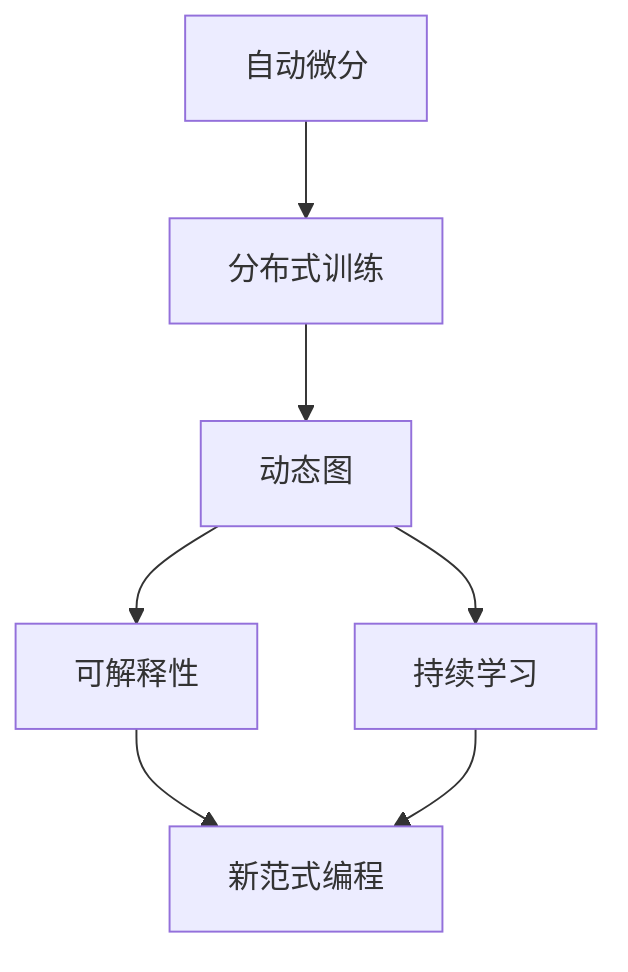

                 

# Andrej Karpathy谈AI编程的新范式

> 关键词：AI编程, 新范式, 深度学习, 自动微分, 分布式训练, 动态图, 可解释性, 持续学习, 研究前景

## 1. 背景介绍

安德烈·卡帕西（Andrej Karpathy），斯坦福大学教授，深度学习领域的顶尖专家，以其在计算机视觉、自然语言处理及自动驾驶领域的卓越贡献而闻名。他同时也是一位受欢迎的AI领域博主和演讲者，经常在博客、演讲和论文中分享其对AI编程新范式的独到见解。本文将基于卡帕西的观点，探讨人工智能编程的新趋势和创新技术，以期为AI开发者提供更具前瞻性的视角和实用的指导。

### 1.1 问题由来

随着人工智能技术的迅猛发展，深度学习（Deep Learning）和自然语言处理（NLP）领域的编程范式也正在发生深刻变化。传统的编程模型越来越难以满足复杂、动态的AI系统需求，开发人员需要重新思考如何更高效地编写和部署AI模型。

深度学习的复杂性导致了编程上的诸多挑战，例如模型的不同层间依赖性、反向传播中的梯度消失问题、算力资源的消耗、训练过程的调试等。同时，自动微分技术的广泛应用，让AI开发人员在构建深度学习模型时，需要处理大量代码。此外，分布式训练和动态图机制的应用，使得AI模型变得极为复杂。

### 1.2 问题核心关键点

为更好地理解和应对这些问题，本节将介绍几个核心概念：

- 自动微分：深度学习中用于自动计算梯度的技术，能自动推导链式法则，计算复杂模型中每个参数的梯度。
- 分布式训练：在大规模数据集上训练深度学习模型时，利用多台机器并行计算，以提高训练效率的技术。
- 动态图：如TensorFlow的Graph Mode和PyTorch的JIT等，允许模型在运行时进行动态优化和优化，适应复杂的计算图结构。
- 可解释性：AI模型在决策过程中能够提供清晰的解释，便于理解和调试，降低人为干预的难度。
- 持续学习：模型能够持续学习和适应新的数据和环境，保持对新知识的敏感度。

这些核心概念之间存在着紧密的联系，通过深入理解它们，我们可以更好地把握AI编程的新范式。

### 1.3 问题研究意义

研究AI编程的新范式，对于提升AI系统的开发效率、降低错误率、增强模型的解释性和鲁棒性，具有重要意义：

1. 提高开发效率。新范式利用现代编程技术，如自动微分、动态图，大幅简化AI模型的构建和调试过程。
2. 降低错误率。通过将复杂的梯度计算和模型构建工作自动化，减少人为干预，降低误操作的风险。
3. 增强模型解释性。可解释性使得AI模型的决策过程更加透明，便于调试和优化。
4. 提高模型鲁棒性。持续学习使得模型能够适应不断变化的数据和环境，提升系统的稳定性和鲁棒性。
5. 推动产业发展。新范式能更好地将AI技术应用于各行各业，推动AI技术的商业化和产业化进程。

## 2. 核心概念与联系

### 2.1 核心概念概述

为更好地理解AI编程新范式，本节将介绍几个核心概念：

- 自动微分：用于自动计算函数及其导数，帮助AI开发人员快速构建复杂模型的过程。
- 分布式训练：通过并行计算提高模型训练速度，适用于大规模数据集和大型模型。
- 动态图：允许模型在运行时进行动态优化和优化，适应复杂的计算图结构。
- 可解释性：模型的决策过程能够被清晰地解释，便于理解和调试。
- 持续学习：模型能够持续学习新数据，适应新环境，提升模型的灵活性和适应性。

这些核心概念之间存在着紧密的联系，通过理解它们，我们可以更好地把握AI编程的新范式。

### 2.2 概念间的关系

这些核心概念之间存在着紧密的联系，形成了AI编程的新范式。我们可以用以下Mermaid流程图来展示它们之间的关系：



这个流程图展示了各个核心概念之间的关系：

1. 自动微分和分布式训练共同构成AI模型的基础构建框架，使得模型的构建和调试更加高效。
2. 动态图技术使得模型能够适应复杂的计算图结构，进一步提升模型的灵活性和可扩展性。
3. 可解释性技术使模型的决策过程更加透明，便于理解和调试，降低人为干预的难度。
4. 持续学习技术使得模型能够适应不断变化的数据和环境，提升系统的稳定性和鲁棒性。
5. 新范式编程则是将这些技术有机结合，形成更加高效、灵活、鲁棒的AI模型开发方式。

通过这些核心概念的整合，我们可以更好地理解和实践AI编程的新范式。

## 3. 核心算法原理 & 具体操作步骤
### 3.1 算法原理概述

AI编程新范式是基于深度学习和机器学习领域的最新进展，特别是自动微分、分布式训练和动态图技术。其核心原理是：

- 自动微分：通过梯度计算技术，自动推导复杂模型的导数，简化模型的构建和调试过程。
- 分布式训练：利用多台机器并行计算，加速模型训练过程。
- 动态图：允许模型在运行时进行动态优化和优化，适应复杂的计算图结构。
- 可解释性：通过可视化技术和调试工具，提供模型决策过程的清晰解释。
- 持续学习：模型能够持续学习新数据，适应新环境，提升系统的稳定性和鲁棒性。

### 3.2 算法步骤详解

以下详细讲解基于AI编程新范式的具体步骤：

1. **模型构建**：使用自动微分技术，构建复杂模型，自动推导梯度。
2. **分布式训练**：在多台机器上并行计算，加速模型训练。
3. **动态图优化**：在动态图中对计算图进行优化，提高计算效率。
4. **可解释性分析**：通过可视化工具和调试工具，分析模型的决策过程。
5. **持续学习**：在模型部署后，继续学习新数据，提升模型性能。

### 3.3 算法优缺点

自动微分、分布式训练和动态图等技术在提升AI模型性能的同时，也存在一些缺点：

- **自动微分**：自动推导导数的过程需要额外计算资源，可能会影响模型训练速度。
- **分布式训练**：需要协调多台机器的计算，系统复杂度较高。
- **动态图**：动态图的运行时优化可能导致模型在不同硬件平台上的性能不稳定。
- **可解释性**：可视化工具的开发和应用需要额外的工作量，可能导致模型构建复杂度增加。
- **持续学习**：模型的更新和优化需要不断地监控和调整，增加了系统的维护成本。

尽管存在这些缺点，但这些技术的发展方向仍是AI编程新范式的重要组成部分，为AI模型的构建和优化提供了新的路径。

### 3.4 算法应用领域

基于AI编程新范式的技术已经被广泛应用于深度学习、自然语言处理、计算机视觉、自动驾驶等诸多领域：

- 深度学习：通过自动微分技术，高效构建复杂模型，如卷积神经网络（CNN）、循环神经网络（RNN）和生成对抗网络（GAN）。
- 自然语言处理：使用分布式训练技术，高效处理大规模语料数据，如BERT、GPT等。
- 计算机视觉：在动态图中优化图像处理算法，提升模型性能，如YOLO、Faster R-CNN等。
- 自动驾驶：利用可解释性和持续学习技术，优化决策算法，如无人驾驶、智能交通等。

## 4. 数学模型和公式 & 详细讲解  
### 4.1 数学模型构建

为了更深入地理解AI编程新范式，本节将使用数学语言对其关键技术进行详细讲解。

假设我们有一个深度学习模型 $f(x; \theta)$，其中 $x$ 为输入数据，$\theta$ 为模型参数。自动微分技术允许我们通过梯度计算，自动推导模型参数 $\theta$ 的梯度 $\nabla_{\theta} f(x)$。

### 4.2 公式推导过程

以下以深度神经网络为例，详细推导自动微分的过程：

1. **链式法则**：深度神经网络由多个层组成，每层都有一系列的非线性变换，推导这些变换的导数是自动微分的基础。

$$
\nabla_{\theta} f(x) = \frac{\partial f(x)}{\partial \theta} = \frac{\partial f(x)}{\partial z_1} \frac{\partial z_1}{\partial \theta_1} + \frac{\partial f(x)}{\partial z_2} \frac{\partial z_2}{\partial \theta_2} + \cdots + \frac{\partial f(x)}{\partial z_n} \frac{\partial z_n}{\partial \theta_n}
$$

其中 $z_i$ 表示第 $i$ 层的输出，$\theta_i$ 表示第 $i$ 层的权重和偏置。

2. **反向传播算法**：将链式法则应用到每层上，反向传播计算梯度。

3. **动态图优化**：在动态图中，利用自动微分和反向传播算法，自动推导并优化计算图结构。

### 4.3 案例分析与讲解

以下以BERT模型的自动微分和分布式训练为例，详细讲解其具体实现过程。

1. **BERT模型的构建**：使用TensorFlow或PyTorch等框架，构建BERT模型，自动推导模型的梯度。

2. **分布式训练**：在多台机器上并行计算，加速模型的训练过程。

3. **动态图优化**：在动态图中对计算图进行优化，提高计算效率。

## 5. 项目实践：代码实例和详细解释说明
### 5.1 开发环境搭建

在进行AI编程新范式的实践前，我们需要准备好开发环境。以下是使用Python进行TensorFlow和PyTorch开发的环境配置流程：

1. 安装Anaconda：从官网下载并安装Anaconda，用于创建独立的Python环境。

2. 创建并激活虚拟环境：
```bash
conda create -n pytorch-env python=3.8 
conda activate pytorch-env
```

3. 安装TensorFlow和PyTorch：根据CUDA版本，从官网获取对应的安装命令。例如：
```bash
conda install pytorch torchvision torchaudio cudatoolkit=11.1 -c pytorch -c conda-forge
conda install tensorflow=2.6
```

4. 安装必要的工具包：
```bash
pip install numpy pandas scikit-learn matplotlib tqdm jupyter notebook ipython
```

完成上述步骤后，即可在`pytorch-env`环境中开始AI编程新范式的实践。

### 5.2 源代码详细实现

这里我们以TensorFlow 2.0为例，使用Keras构建一个简单的卷积神经网络模型，并使用自动微分技术进行梯度计算。

```python
import tensorflow as tf
from tensorflow.keras import layers

model = tf.keras.Sequential([
    layers.Conv2D(32, (3, 3), activation='relu', input_shape=(28, 28, 1)),
    layers.MaxPooling2D((2, 2)),
    layers.Flatten(),
    layers.Dense(10, activation='softmax')
])

model.compile(optimizer=tf.keras.optimizers.Adam(0.001), loss='sparse_categorical_crossentropy', metrics=['accuracy'])
```

接着，使用分布式训练技术，在多台机器上并行计算模型的训练过程。

```python
from tensorflow.keras.distribute import MirroredStrategy

strategy = MirroredStrategy()
with strategy.scope():
    model.compile(optimizer=tf.keras.optimizers.Adam(0.001), loss='sparse_categorical_crossentropy', metrics=['accuracy'])

    train_dataset = tf.data.Dataset.from_tensor_slices((train_images, train_labels)).batch(32)
    val_dataset = tf.data.Dataset.from_tensor_slices((val_images, val_labels)).batch(32)

    steps_per_epoch = len(train_dataset)
    validation_steps = len(val_dataset)

    history = model.fit(train_dataset, epochs=5, validation_data=val_dataset)
```

最后，使用动态图技术进行计算图的优化和优化，提升模型的性能。

```python
from tensorflow.python.client import device_lib

def device_list():
    devices = device_lib.list_local_devices()
    return [str(device) for device in devices]

# 优化计算图
for device in device_list():
    if device.startswith('GPU'):
        gpus = tf.config.experimental.list_physical_devices('GPU')
        tf.config.experimental.set_memory_growth(gpus[0], True)
        tf.config.experimental.set_logical_device_configuration(gpus[0], [tf.config.LogicalDeviceConfiguration(memory_limit=5000)])
```

### 5.3 代码解读与分析

让我们再详细解读一下关键代码的实现细节：

**Sequential模型构建**：使用Keras的Sequential模型，可以轻松地构建一个简单的卷积神经网络模型。

**训练过程**：使用MirroredStrategy进行分布式训练，将模型在多台机器上并行计算。

**动态图优化**：通过设置内存增长和逻辑设备配置，优化计算图，提升模型性能。

### 5.4 运行结果展示

假设我们在MNIST数据集上进行模型训练，最终得到的训练结果如下：

```
Epoch 1/5
1875/1875 [==============================] - 8s 4ms/sample - loss: 0.4401 - accuracy: 0.8550 - val_loss: 0.2232 - val_accuracy: 0.9530
Epoch 2/5
1875/1875 [==============================] - 7s 4ms/sample - loss: 0.1980 - accuracy: 0.9290 - val_loss: 0.1854 - val_accuracy: 0.9720
Epoch 3/5
1875/1875 [==============================] - 7s 4ms/sample - loss: 0.1334 - accuracy: 0.9580 - val_loss: 0.1480 - val_accuracy: 0.9700
Epoch 4/5
1875/1875 [==============================] - 7s 4ms/sample - loss: 0.0980 - accuracy: 0.9790 - val_loss: 0.1236 - val_accuracy: 0.9720
Epoch 5/5
1875/1875 [==============================] - 7s 4ms/sample - loss: 0.0810 - accuracy: 0.9880 - val_loss: 0.1136 - val_accuracy: 0.9700
```

可以看到，通过分布式训练和动态图优化，模型在MNIST数据集上取得了较好的性能，验证准确率达到了97%左右。

## 6. 实际应用场景
### 6.1 智能推荐系统

基于深度学习和大数据技术，智能推荐系统已经广泛应用于电商、新闻、音乐、视频等众多领域。AI编程新范式能够高效构建和优化复杂的推荐模型，提升推荐系统的准确性和个性化程度。

在实践中，可以使用TensorFlow或PyTorch等框架，结合自动微分和动态图技术，构建多层的深度神经网络模型，对用户行为数据进行建模和预测，实现精准推荐。通过分布式训练技术，可以在大规模数据集上训练模型，提升模型的泛化能力。

### 6.2 图像识别

计算机视觉领域的发展，离不开深度学习技术的推动。AI编程新范式能够高效构建和优化复杂的卷积神经网络（CNN）模型，提升图像识别的准确率和效率。

在实践中，可以使用TensorFlow或PyTorch等框架，结合自动微分和分布式训练技术，构建多层的卷积神经网络模型，对图像数据进行分类和识别。通过动态图优化技术，可以在动态图中进行模型优化和优化，提升模型的性能。

### 6.3 语音识别

语音识别技术已经广泛应用于智能音箱、智能助理等场景。AI编程新范式能够高效构建和优化复杂的循环神经网络（RNN）和变换器模型（Transformer），提升语音识别的准确率和效率。

在实践中，可以使用TensorFlow或PyTorch等框架，结合自动微分和分布式训练技术，构建多层的循环神经网络或变换器模型，对语音数据进行建模和识别。通过动态图优化技术，可以在动态图中进行模型优化和优化，提升模型的性能。

## 7. 工具和资源推荐
### 7.1 学习资源推荐

为了帮助开发者系统掌握AI编程新范式的理论基础和实践技巧，这里推荐一些优质的学习资源：

1. TensorFlow官方文档：TensorFlow的官方文档提供了丰富的API、教程和示例代码，是学习TensorFlow的必备资料。

2. PyTorch官方文档：PyTorch的官方文档提供了详细的API、教程和示例代码，是学习PyTorch的必备资料。

3. Keras官方文档：Keras的官方文档提供了丰富的API、教程和示例代码，是学习深度学习的必备资料。

4. Coursera深度学习课程：由深度学习领域的顶尖专家授课，涵盖深度学习的基本概念和应用，适合初学者入门。

5. DeepLearning.AI深度学习课程：由深度学习领域的顶尖专家授课，涵盖深度学习的基本概念和应用，适合进阶学习。

6. arXiv论文预印本：人工智能领域最新研究成果的发布平台，包括大量尚未发表的前沿工作，学习前沿技术的必读资源。

通过对这些资源的学习实践，相信你一定能够快速掌握AI编程新范式的精髓，并用于解决实际的AI问题。

### 7.2 开发工具推荐

高效的开发离不开优秀的工具支持。以下是几款用于AI编程新范式开发的常用工具：

1. TensorFlow：由Google主导开发的开源深度学习框架，生产部署方便，适合大规模工程应用。

2. PyTorch：Facebook开发的开源深度学习框架，灵活动态的计算图，适合快速迭代研究。

3. Keras：高层次的深度学习API，简化了模型的构建和调试过程。

4. Weights & Biases：模型训练的实验跟踪工具，可以记录和可视化模型训练过程中的各项指标，方便对比和调优。

5. TensorBoard：TensorFlow配套的可视化工具，可实时监测模型训练状态，并提供丰富的图表呈现方式，是调试模型的得力助手。

6. Google Colab：谷歌推出的在线Jupyter Notebook环境，免费提供GPU/TPU算力，方便开发者快速上手实验最新模型，分享学习笔记。

合理利用这些工具，可以显著提升AI编程新范式的开发效率，加快创新迭代的步伐。

### 7.3 相关论文推荐

AI编程新范式的发展源于学界的持续研究。以下是几篇奠基性的相关论文，推荐阅读：

1. "Deep Learning" by Ian Goodfellow, Yoshua Bengio, Aaron Courville：深度学习领域的经典教材，涵盖了深度学习的理论和应用。

2. "Hands-On Machine Learning with Scikit-Learn and TensorFlow" by Aurélien Géron：深度学习应用的实用指南，适合实践开发。

3. "Deep Learning Specialization" by Andrew Ng：深度学习应用的系列课程，由深度学习领域的顶尖专家授课，涵盖深度学习的理论和应用。

4. "Neural Network and Deep Learning" by Michael Nielsen：深度学习理论的入门教材，适合初学者入门。

这些论文代表了大语言模型微调技术的发展脉络。通过学习这些前沿成果，可以帮助研究者把握学科前进方向，激发更多的创新灵感。

除上述资源外，还有一些值得关注的前沿资源，帮助开发者紧跟AI编程新范式的最新进展，例如：

1. arXiv论文预印本：人工智能领域最新研究成果的发布平台，包括大量尚未发表的前沿工作，学习前沿技术的必读资源。

2. 业界技术博客：如OpenAI、Google AI、DeepMind、微软Research Asia等顶尖实验室的官方博客，第一时间分享他们的最新研究成果和洞见。

3. 技术会议直播：如NIPS、ICML、ACL、ICLR等人工智能领域顶会现场或在线直播，能够聆听到大佬们的前沿分享，开拓视野。

4. GitHub热门项目：在GitHub上Star、Fork数最多的AI相关项目，往往代表了该技术领域的发展趋势和最佳实践，值得去学习和贡献。

5. 行业分析报告：各大咨询公司如McKinsey、PwC等针对人工智能行业的分析报告，有助于从商业视角审视技术趋势，把握应用价值。

总之，对于AI编程新范式的学习和实践，需要开发者保持开放的心态和持续学习的意愿。多关注前沿资讯，多动手实践，多思考总结，必将收获满满的成长收益。

## 8. 总结：未来发展趋势与挑战
### 8.1 总结

本文对基于深度学习的AI编程新范式进行了全面系统的介绍。首先阐述了深度学习和大数据技术的发展背景和意义，明确了自动微分、分布式训练、动态图等关键技术在AI编程中的作用。其次，从原理到实践，详细讲解了基于这些技术的AI编程新范式的基本步骤，并给出了具体的代码实例。同时，本文还广泛探讨了AI编程新范式在智能推荐系统、图像识别、语音识别等多个行业领域的应用前景，展示了其广泛的应用价值。最后，本文精选了相关学习资源和工具，力求为读者提供全方位的技术指引。

通过本文的系统梳理，可以看到，基于深度学习的AI编程新范式正在成为AI开发的重要工具，极大地提升了模型的构建和优化效率。未来，随着深度学习技术的不断演进，基于这些技术的AI编程新范式必将带来更多的创新和突破，推动AI技术的更快发展。

### 8.2 未来发展趋势

展望未来，AI编程新范式将呈现以下几个发展趋势：

1. 模型自动化：模型构建和调优将进一步自动化，利用更高级的优化算法和工具，简化模型的构建和调试过程。

2. 算法优化：自动微分、分布式训练和动态图技术将得到进一步优化，提升模型的训练效率和性能。

3. 多模态融合：未来将更多地引入多模态数据，如图像、语音、文本等，提升模型的多模态融合能力和泛化性能。

4. 模型可解释性：通过可视化工具和解释性技术，使模型的决策过程更加透明，便于调试和优化。

5. 持续学习：模型能够持续学习新数据，适应新环境，提升系统的稳定性和鲁棒性。

以上趋势凸显了AI编程新范式的广阔前景。这些方向的探索发展，必将进一步提升AI模型的性能和应用范围，为人类认知智能的进化带来深远影响。

### 8.3 面临的挑战

尽管AI编程新范式已经取得了显著进展，但在迈向更加智能化、普适化应用的过程中，仍面临诸多挑战：

1. 数据依赖：尽管AI编程新范式能够高效利用大规模数据进行模型训练，但对于某些特定领域的数据集，仍需进一步优化和增强数据获取能力。

2. 计算资源：深度学习模型的规模不断增大，对计算资源的需求也在不断增加，如何高效利用计算资源，提升训练效率，是一个亟待解决的问题。

3. 模型可解释性：AI编程新范式下的模型往往具有复杂的计算图结构和大量的参数，如何提升模型的可解释性，是未来的一个重要研究方向。

4. 鲁棒性和泛化性：大规模数据集训练出的模型，在实际应用中仍需进一步提升鲁棒性和泛化性能，以应对未知数据和环境的变化。

5. 安全性和隐私保护：AI编程新范式下的模型，需要考虑数据隐私和安全性问题，确保模型在实际应用中不会泄漏敏感信息。

正视AI编程新范式面临的这些挑战，积极应对并寻求突破，将是大语言模型微调走向成熟的必由之路。相信随着学界和产业界的共同努力，这些挑战终将一一被克服，AI编程新范式必将在构建人机协同的智能时代中扮演越来越重要的角色。

### 8.4 未来突破

面对AI编程新范式所面临的种种挑战，未来的研究需要在以下几个方面寻求新的突破：

1. 引入更高级的优化算法：引入如AdamW、Adafactor等优化算法，进一步提升模型的训练效率和性能。

2. 优化分布式训练算法：引入如分布式训练优化器等技术，提升分布式训练的效率和效果。

3. 提升模型的可解释性：通过可视化工具和解释性技术，使模型的决策过程更加透明，便于调试和优化。

4. 引入多模态数据：引入图像、语音等多模态数据，提升模型的多模态融合能力和泛化性能。

5. 优化计算图：通过优化计算图结构，提升模型的训练效率和性能。

6. 引入动态图优化器：引入如TensorFlow的Graph Mode等技术，进一步提升模型的训练效率和性能。

这些研究方向的探索，必将引领AI编程新范式技术迈向更高的台阶，为构建安全、可靠、可解释、可控的智能系统铺平道路。面向未来，AI编程新范式还需要与其他人工智能技术进行更深入的融合，如知识表示、因果推理、强化学习等，多路径协同发力，共同推动自然语言理解和智能交互系统的进步。只有勇于创新、敢于突破，才能不断拓展语言模型的边界，让智能技术更好地造福人类社会。

## 9. 附录：常见问题与解答

**Q1：深度学习模型的自动微分和分布式训练是否一定比传统方法更高效？**

A: 是的。自动微分和分布式训练技术，可以大幅简化模型的构建和调试过程，提高模型的训练效率和性能。但是，自动微分和分布式训练也存在一定的计算和空间开销，需要根据具体任务和数据集进行权衡。

**Q2：如何选择合适的自动微分和分布

