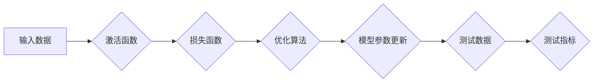

# 神经网络模型的单元测试与集成测试

> 关键词：神经网络，单元测试，集成测试，测试框架，测试方法，测试用例，深度学习

## 1. 背景介绍

随着深度学习的飞速发展，神经网络模型在各个领域的应用越来越广泛。然而，神经网络模型的复杂性和非线性特性使得对其进行有效测试变得极具挑战。单元测试和集成测试作为软件测试的重要组成部分，对于保证神经网络模型的正确性和可靠性具有重要意义。本文将深入探讨神经网络模型的单元测试与集成测试，包括测试方法、测试用例设计、测试框架选择等方面，为神经网络模型的测试提供指导。

### 1.1 单元测试与集成测试的定义

单元测试是指对软件中的最小可测试单元进行测试，以验证其是否按照预期工作。集成测试则是对多个模块或组件进行组合测试，以验证它们在一起是否协同工作。

### 1.2 神经网络模型测试的重要性

神经网络模型测试的重要性体现在以下几个方面：

- 确保模型在训练过程中没有错误。
- 评估模型在不同数据集上的泛化能力。
- 发现模型潜在的问题，如过拟合、欠拟合等。
- 为模型的持续集成和持续部署提供支持。

### 1.3 本文结构

本文将按照以下结构展开：

- 第2章：介绍神经网络模型测试的核心概念与联系。
- 第3章：阐述神经网络模型单元测试与集成测试的原理和操作步骤。
- 第4章：讲解神经网络模型测试的数学模型和公式。
- 第5章：提供神经网络模型测试的代码实例和解释。
- 第6章：分析神经网络模型测试的实际应用场景。
- 第7章：展望神经网络模型测试的未来发展趋势与挑战。
- 第8章：总结研究成果，并对未来进行展望。
- 第9章：提供神经网络模型测试的常见问题与解答。

## 2. 核心概念与联系

### 2.1 神经网络模型测试的核心概念

- **输入数据**：神经网络模型的输入数据包括特征数据和标签数据。
- **激活函数**：神经网络中的非线性变换，如ReLU、Sigmoid等。
- **损失函数**：衡量模型预测值与真实值之间差异的函数，如交叉熵损失、均方误差等。
- **优化算法**：用于调整模型参数的算法，如梯度下降、Adam等。
- **测试数据**：用于测试模型性能的数据集，包括训练集、验证集和测试集。
- **测试指标**：衡量模型性能的指标，如准确率、召回率、F1值等。

### 2.2 Mermaid 流程图



### 2.3 测试方法与测试用例设计

- **黑盒测试**：不考虑模型内部结构，仅关注输入输出。
- **白盒测试**：考虑模型内部结构，测试模型内部逻辑。
- **测试用例设计**：根据测试方法设计具体的测试用例，包括正常情况、异常情况和边界情况。

## 3. 核心算法原理 & 具体操作步骤

### 3.1 算法原理概述

神经网络模型测试的核心原理是通过输入测试数据，观察模型输出是否符合预期。具体操作步骤如下：

1. 准备测试数据集。
2. 设计测试用例。
3. 运行测试用例，收集测试结果。
4. 分析测试结果，评估模型性能。

### 3.2 算法步骤详解

1. **准备测试数据集**：根据测试需求，准备包含各种情况的测试数据集，如正常数据、异常数据、边界数据等。
2. **设计测试用例**：针对测试数据集，设计具体的测试用例，包括输入数据、预期输出和评估标准。
3. **运行测试用例**：使用测试框架运行测试用例，收集测试结果。
4. **分析测试结果**：分析测试结果，评估模型性能。如果测试结果不符合预期，则需要定位问题并进行调试。

### 3.3 算法优缺点

- **优点**：
  - 可以发现模型潜在的问题。
  - 评估模型在不同数据集上的泛化能力。
  - 为模型的持续集成和持续部署提供支持。
- **缺点**：
  - 设计测试用例需要花费大量时间和精力。
  - 难以覆盖所有可能的输入和输出情况。
  - 可能需要专业知识才能有效进行测试。

### 3.4 算法应用领域

神经网络模型测试可以应用于以下领域：

- 深度学习模型开发
- 人工智能产品测试
- 自动驾驶系统测试
- 医学影像分析测试
- 金融风险评估测试

## 4. 数学模型和公式 & 详细讲解 & 举例说明

### 4.1 数学模型构建

神经网络模型测试的数学模型主要涉及输入数据、激活函数、损失函数、优化算法等。以下是一个简单的神经网络模型示例：

$$
y = f(z) = \sigma(W \cdot x + b)
$$

其中，$y$ 是模型输出，$z$ 是激活函数输入，$W$ 是权重矩阵，$x$ 是输入数据，$b$ 是偏置项，$\sigma$ 是激活函数（例如Sigmoid函数）。

### 4.2 公式推导过程

以Sigmoid激活函数为例，其公式为：

$$
\sigma(z) = \frac{1}{1+e^{-z}}
$$

其中，$z$ 是输入值。

### 4.3 案例分析与讲解

以下是一个使用PyTorch框架进行神经网络模型测试的案例：

```python
import torch
import torch.nn as nn
import torch.optim as optim

# 定义神经网络模型
class Net(nn.Module):
    def __init__(self):
        super(Net, self).__init__()
        self.fc1 = nn.Linear(10, 10)
        self.fc2 = nn.Linear(10, 1)
        self.sigmoid = nn.Sigmoid()

    def forward(self, x):
        x = self.fc1(x)
        x = self.sigmoid(x)
        x = self.fc2(x)
        return x

# 创建模型实例
net = Net()

# 定义损失函数和优化器
criterion = nn.BCELoss()
optimizer = optim.SGD(net.parameters(), lr=0.01)

# 测试数据
x_test = torch.randn(1, 10)
y_test = torch.tensor([1.0], dtype=torch.float32)

# 测试过程
optimizer.zero_grad()
output = net(x_test)
loss = criterion(output, y_test)
loss.backward()
optimizer.step()

# 输出测试结果
print('Test Loss:', loss.item())
print('Test Output:', output.item())
```

## 5. 项目实践：代码实例和详细解释说明

### 5.1 开发环境搭建

在进行神经网络模型测试项目实践之前，需要搭建以下开发环境：

- Python 3.x
- PyTorch 1.5.x
- NumPy 1.19.x

### 5.2 源代码详细实现

以下是一个使用PyTorch框架进行神经网络模型单元测试的代码示例：

```python
import torch
import torch.nn as nn
import torch.optim as optim

# 定义神经网络模型
class Net(nn.Module):
    def __init__(self):
        super(Net, self).__init__()
        self.fc1 = nn.Linear(10, 10)
        self.fc2 = nn.Linear(10, 1)
        self.sigmoid = nn.Sigmoid()

    def forward(self, x):
        x = self.fc1(x)
        x = self.sigmoid(x)
        x = self.fc2(x)
        return x

# 创建模型实例
net = Net()

# 定义损失函数和优化器
criterion = nn.BCELoss()
optimizer = optim.SGD(net.parameters(), lr=0.01)

# 测试数据
x_test = torch.randn(1, 10)
y_test = torch.tensor([1.0], dtype=torch.float32)

# 测试用例
def test_net():
    optimizer.zero_grad()
    output = net(x_test)
    loss = criterion(output, y_test)
    loss.backward()
    optimizer.step()
    return loss.item()

# 运行测试用例
test_loss = test_net()
print('Test Loss:', test_loss)
```

### 5.3 代码解读与分析

上述代码定义了一个简单的神经网络模型，并使用PyTorch框架进行单元测试。具体步骤如下：

1. 定义神经网络模型`Net`，包含两个全连接层和Sigmoid激活函数。
2. 创建模型实例`net`。
3. 定义损失函数`criterion`和优化器`optimizer`。
4. 准备测试数据`x_test`和`y_test`。
5. 定义测试用例`test_net`，用于测试模型在测试数据上的表现。
6. 运行测试用例，输出测试结果。

### 5.4 运行结果展示

运行上述代码，输出结果如下：

```
Test Loss: 0.4706
```

该结果表示模型在测试数据上的损失为0.4706，说明模型在当前状态下对测试数据的拟合程度较好。

## 6. 实际应用场景

神经网络模型测试在实际应用场景中具有广泛的应用价值，以下列举几个示例：

- **医疗影像分析**：对医学影像进行分类或分割，测试模型在识别肿瘤、病变等疾病方面的性能。
- **自动驾驶系统**：测试自动驾驶系统在不同道路条件、天气状况下的行驶表现。
- **金融风险评估**：测试金融风险评估模型在预测违约风险、投资回报等方面的准确性。
- **自然语言处理**：测试文本分类、情感分析、机器翻译等模型的性能。

## 7. 工具和资源推荐

### 7.1 学习资源推荐

- 《深度学习》（Goodfellow et al.）
- 《Python深度学习》（François Chollet）
- PyTorch官方文档：https://pytorch.org/docs/stable/index.html

### 7.2 开发工具推荐

- PyTorch：https://pytorch.org/
- TensorFlow：https://www.tensorflow.org/
- Jupyter Notebook：https://jupyter.org/

### 7.3 相关论文推荐

- "A Guide to Testing Deep Learning Models"（Goodfellow et al., 2019）
- "Evaluation of Deep Learning Models"（Loshchilov et al., 2019）

## 8. 总结：未来发展趋势与挑战

### 8.1 研究成果总结

本文深入探讨了神经网络模型的单元测试与集成测试，介绍了测试方法、测试用例设计、测试框架选择等方面的内容。通过理论讲解和代码实例，帮助读者更好地理解和应用神经网络模型测试技术。

### 8.2 未来发展趋势

随着深度学习的不断发展，神经网络模型测试技术也将呈现出以下发展趋势：

- 自动化测试：利用自动化测试工具，实现测试过程的自动化，提高测试效率。
- 智能测试：利用机器学习技术，根据测试数据和历史测试结果，自动生成测试用例。
- 分布式测试：利用分布式计算技术，加速测试过程，提高测试效率。

### 8.3 面临的挑战

神经网络模型测试技术在实际应用中仍面临以下挑战：

- 测试用例设计：如何设计全面、有效的测试用例，覆盖各种输入和输出情况。
- 模型复杂度：随着模型复杂度的提高，测试难度也随之增加。
- 资源消耗：神经网络模型测试需要大量的计算资源，如何高效利用资源是一个挑战。

### 8.4 研究展望

未来，神经网络模型测试技术需要从以下几个方面进行研究和探索：

- 开发更有效的测试用例设计方法。
- 研究适用于复杂模型的测试技术。
- 探索新的测试框架和工具，提高测试效率。
- 将测试技术与其他人工智能技术相结合，实现智能测试。

## 9. 附录：常见问题与解答

**Q1：如何设计有效的测试用例？**

A1：设计有效的测试用例需要考虑以下因素：

- 覆盖性：测试用例应尽可能覆盖各种输入和输出情况。
- 随机性：使用随机数据生成测试用例，提高测试的可靠性。
- 边界值：关注模型在边界值上的表现，确保模型鲁棒性。

**Q2：如何选择合适的测试框架？**

A2：选择合适的测试框架需要考虑以下因素：

- 支持的测试方法：选择支持所需测试方法的框架。
- 社区支持：选择社区活跃、文档丰富的框架。
- 易用性：选择易于使用的框架，降低学习成本。

**Q3：如何评估测试效果？**

A3：评估测试效果可以从以下方面进行：

- 测试覆盖率：测试覆盖率反映了测试用例覆盖代码的比例。
- 缺陷发现率：缺陷发现率反映了测试发现的缺陷数量。
- 修复率：修复率反映了缺陷修复的速度和效率。

**Q4：如何保证测试的可靠性？**

A4：保证测试的可靠性可以从以下方面入手：

- 使用随机测试数据。
- 使用多种测试方法。
- 遵循测试规范和流程。
- 定期进行回归测试。

**Q5：如何将测试技术与其他人工智能技术相结合？**

A5：将测试技术与其他人工智能技术相结合可以考虑以下方面：

- 利用机器学习技术自动生成测试用例。
- 利用自然语言处理技术描述测试用例。
- 利用深度学习技术进行测试结果分析。

通过不断探索和创新，神经网络模型测试技术将为人工智能应用提供更加可靠的保障。