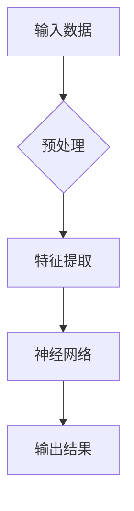

# 神经网络：自然语言处理的新突破

> 关键词：神经网络，自然语言处理，深度学习，语言模型，序列模型，注意力机制，Transformer

## 1. 背景介绍

自然语言处理（NLP）作为人工智能领域的一个重要分支，其目标是使计算机能够理解、解释和生成人类语言。随着深度学习技术的兴起，神经网络在NLP领域取得了突破性的进展，极大地推动了语言模型的发展。本文将深入探讨神经网络在自然语言处理中的应用，分析其原理、算法、数学模型以及实际应用场景。

## 2. 核心概念与联系

### 2.1 核心概念

#### 深度学习

深度学习是机器学习的一个子集，它使用多层神经网络（Neural Network）来学习数据的复杂特征。深度学习模型能够从大量数据中自动学习到具有层次结构的表示，这些表示有助于解决复杂的模式识别和预测问题。

#### 神经网络

神经网络是一种模仿人脑神经元连接方式的计算模型。它由多个层组成，包括输入层、隐藏层和输出层。每个神经元都与相邻层中的神经元通过权重连接，这些权重通过学习过程进行优化。

#### 自然语言处理

自然语言处理是人工智能的一个分支，它旨在使计算机能够理解、解释和生成人类语言。NLP涵盖了文本分析、语音识别、机器翻译、情感分析等多个子领域。

### 2.2 核心概念原理和架构的 Mermaid 流程图



### 2.3 核心概念的联系

深度学习为NLP提供了强大的特征提取和表示学习方法。神经网络作为深度学习的基础，能够从大量文本数据中学习到丰富的语言特征，从而提高NLP任务的性能。

## 3. 核心算法原理 & 具体操作步骤

### 3.1 算法原理概述

神经网络在NLP中的应用主要分为以下几种类型：

- **序列模型**：适用于处理序列数据，如文本、时间序列等。常见的序列模型包括循环神经网络（RNN）和长短期记忆网络（LSTM）。
- **卷积神经网络（CNN）**：适用于处理图像等空间数据，但也可以应用于文本分析。
- **注意力机制**：用于提高模型对输入序列中关键信息的关注程度，如Transformer模型。

### 3.2 算法步骤详解

#### 序列模型

1. 预处理：对输入文本进行分词、去停用词、词性标注等操作，将文本转换为适合神经网络处理的格式。
2. 特征提取：使用词嵌入（Word Embedding）将单词转换为高维向量表示。
3. 神经网络：使用序列模型（如RNN、LSTM）对词嵌入向量进行处理，提取序列特征。
4. 输出结果：根据序列特征生成文本、分类结果或预测值。

#### 注意力机制

1. 计算注意力权重：根据输入序列计算每个单词的注意力权重。
2. 生成加权特征表示：将注意力权重与词嵌入向量相乘，生成加权特征表示。
3. 使用加权特征表示进行预测：将加权特征表示输入到神经网络中进行分类或预测。

### 3.3 算法优缺点

#### 序列模型

优点：

- 能够处理序列数据，适用于NLP任务。
- 能够学习到长距离依赖关系。

缺点：

- 训练过程容易出现梯度消失或梯度爆炸问题。
- 难以并行计算。

#### 注意力机制

优点：

- 能够更好地关注输入序列中的关键信息。
- 能够提高模型的性能。

缺点：

- 计算复杂度较高。
- 需要大量的训练数据。

### 3.4 算法应用领域

神经网络在NLP领域的应用非常广泛，包括：

- 机器翻译
- 情感分析
- 文本分类
- 问答系统
- 语音识别

## 4. 数学模型和公式 & 详细讲解 & 举例说明

### 4.1 数学模型构建

神经网络的基本数学模型包括以下部分：

- **激活函数**：用于引入非线性，使模型能够学习复杂的函数关系。
- **权重和偏置**：用于控制模型的学习过程。
- **梯度下降**：用于优化模型参数。

### 4.2 公式推导过程

以下是一个简单的神经网络模型的公式推导过程：

$$
\text{输出} = f(\text{激活函数}(\text{权重} \cdot \text{输入} + \text{偏置}))
$$

### 4.3 案例分析与讲解

以下是一个简单的文本分类任务案例：

1. 预处理文本数据，将其转换为词嵌入向量。
2. 将词嵌入向量输入到神经网络中，进行特征提取。
3. 使用softmax函数对输出结果进行分类。

## 5. 项目实践：代码实例和详细解释说明

### 5.1 开发环境搭建

1. 安装Python和NumPy库。
2. 下载预训练的词嵌入模型。

### 5.2 源代码详细实现

```python
import numpy as np
import tensorflow as tf

# 加载词嵌入模型
def load_embeddings(filename):
    embeddings = np.load(filename)
    return embeddings

# 定义神经网络模型
def neural_network(embeddings):
    # 定义输入层
    input_layer = tf.keras.Input(shape=(embeddings.shape[1],))
    
    # 定义隐藏层
    x = tf.keras.layers.Dense(128, activation='relu')(input_layer)
    
    # 定义输出层
    output_layer = tf.keras.layers.Dense(2, activation='softmax')(x)
    
    # 构建模型
    model = tf.keras.Model(inputs=input_layer, outputs=output_layer)
    return model

# 训练模型
def train_model(model, X_train, y_train):
    model.compile(optimizer='adam', loss='categorical_crossentropy', metrics=['accuracy'])
    model.fit(X_train, y_train, epochs=10)

# 使用模型进行预测
def predict(model, X_test):
    predictions = model.predict(X_test)
    return np.argmax(predictions, axis=1)
```

### 5.3 代码解读与分析

以上代码展示了如何使用TensorFlow构建一个简单的文本分类模型。首先加载词嵌入模型，然后定义神经网络模型，接着训练模型，最后使用模型进行预测。

## 6. 实际应用场景

神经网络在NLP领域的实际应用场景非常广泛，以下是一些典型的应用：

- **机器翻译**：利用神经网络将一种语言的文本翻译成另一种语言。
- **情感分析**：根据文本内容判断用户的情感倾向。
- **文本分类**：将文本数据分类到不同的类别中。
- **问答系统**：根据用户提出的问题，从大量数据中检索出最相关的答案。

## 7. 工具和资源推荐

### 7.1 学习资源推荐

- 《深度学习》（Goodfellow et al.）
- 《神经网络与深度学习》（邱锡鹏）
- TensorFlow官方文档
- PyTorch官方文档

### 7.2 开发工具推荐

- TensorFlow
- PyTorch
- Keras

### 7.3 相关论文推荐

- "A Neural Probabilistic Language Model" (Bengio et al., 2003)
- "Deep Learning for Natural Language Processing" (Collobert et al., 2011)
- "Sequence to Sequence Learning with Neural Networks" (Sutskever et al., 2014)

## 8. 总结：未来发展趋势与挑战

### 8.1 研究成果总结

神经网络在NLP领域取得了显著的成果，推动了语言模型的发展。序列模型和注意力机制的应用使得NLP任务取得了突破性的进展。

### 8.2 未来发展趋势

- 更强大的模型：随着计算能力的提升，更大规模的神经网络将会出现。
- 多模态学习：将文本与其他模态信息（如图像、语音）进行融合。
- 可解释性和鲁棒性：提高模型的可解释性和鲁棒性，使其能够更好地适应各种场景。

### 8.3 面临的挑战

- 计算资源：大型神经网络需要大量的计算资源。
- 数据标注：高质量的标注数据难以获取。
- 可解释性：提高模型的可解释性，使其能够被人类理解。

### 8.4 研究展望

神经网络在NLP领域的应用前景广阔，未来将继续推动语言模型的发展，为人类带来更多便利。

## 9. 附录：常见问题与解答

**Q1：什么是词嵌入？**

A：词嵌入是一种将单词转换为向量表示的方法，它能够保留单词的语义信息。

**Q2：什么是注意力机制？**

A：注意力机制是一种使模型能够关注输入序列中关键信息的机制。

**Q3：如何提高神经网络的性能？**

A：提高神经网络性能的方法包括使用更强大的模型、增加训练数据、优化网络结构等。

**Q4：什么是预训练语言模型？**

A：预训练语言模型是在大量无标签文本数据上进行预训练的语言模型，它可以用于下游任务。

**Q5：神经网络在NLP领域的应用有哪些？**

A：神经网络在NLP领域的应用包括机器翻译、情感分析、文本分类、问答系统、语音识别等。

作者：禅与计算机程序设计艺术 / Zen and the Art of Computer Programming