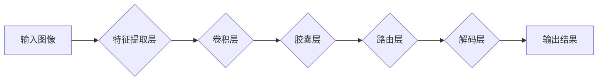

# 胶囊网络 原理与代码实例讲解

> 关键词：胶囊网络，卷积神经网络，深度学习，神经网络架构，图像识别，特征提取，多尺度理解，鲁棒性

## 1. 背景介绍

随着深度学习技术的飞速发展，卷积神经网络（CNN）在图像识别、计算机视觉等领域取得了突破性的成果。然而，传统的CNN架构在处理复杂任务时存在局限性，如难以捕捉多尺度特征、对输入变化敏感等。胶囊网络（Capsule Networks）作为一种新型的深度学习架构，旨在解决这些问题，为深度学习领域带来新的发展方向。

## 2. 核心概念与联系

### 2.1 核心概念原理

胶囊网络的核心概念是“胶囊”，它代表了一组平行的神经元，用于表示图像中某个局部特征的空间布局和方向。与传统卷积神经元的线性响应不同，胶囊网络中的胶囊可以同时表达多个维度上的信息，这使得它能够更好地捕捉图像中的复杂结构。

### 2.2 架构流程图

以下是用Mermaid绘制的胶囊网络架构流程图：



### 2.3 核心概念联系

胶囊网络通过以下方式解决了传统CNN的局限性：

- **多尺度理解**：胶囊层可以同时表达不同尺度的特征，使得模型能够捕捉到图像中的局部细节和整体结构。
- **鲁棒性**：胶囊层对输入的微小变化具有更强的鲁棒性，提高了模型在噪声和数据扰动下的性能。
- **空间信息保留**：胶囊网络能够保留输入图像的空间信息，使得模型在图像识别、物体检测等任务中表现更优。

## 3. 核心算法原理 & 具体操作步骤

### 3.1 算法原理概述

胶囊网络的核心算法包括以下步骤：

1. **特征提取层**：类似于传统CNN，用于提取图像的基本特征。
2. **胶囊层**：将卷积层输出的特征图转换为胶囊，每个胶囊代表一个局部特征的空间布局和方向。
3. **路由层**：根据胶囊层输出的激活强度，决定哪些胶囊被激活，实现胶囊之间的交互。
4. **解码层**：将激活的胶囊解码为图像的低级特征，再通过一系列卷积层和池化层进行特征融合，最终输出结果。

### 3.2 算法步骤详解

1. **特征提取层**：使用卷积层提取图像的局部特征。
2. **胶囊层**：将特征图转换为胶囊，每个胶囊包含多个神经元，表示该局部特征的空间布局和方向。
3. **路由层**：根据胶囊层输出的激活强度，将激活的胶囊传递到下一层。激活强度由以下公式计算：

   $$
   a_{ij} = \sigma(W_{ij} * b_{ij} + b_{j})
   $$

   其中，$a_{ij}$ 表示第 $i$ 层的第 $j$ 个胶囊的激活强度，$W_{ij}$ 表示连接第 $i$ 层的第 $j$ 个胶囊和第 $i-1$ 层的神经元的权重矩阵，$b_{ij}$ 表示第 $i$ 层的第 $j$ 个胶囊的偏置，$b_{j}$ 表示第 $i-1$ 层的第 $j$ 个神经元的偏置，$\sigma$ 表示softmax激活函数。

4. **解码层**：将激活的胶囊解码为图像的低级特征，再通过一系列卷积层和池化层进行特征融合，最终输出结果。

### 3.3 算法优缺点

### 3.3.1 优点

- **多尺度理解**：能够同时表达不同尺度的特征，更好地捕捉图像中的复杂结构。
- **鲁棒性**：对输入的微小变化具有更强的鲁棒性，提高了模型在噪声和数据扰动下的性能。
- **空间信息保留**：能够保留输入图像的空间信息，使得模型在图像识别、物体检测等任务中表现更优。

### 3.3.2 缺点

- **计算复杂度**：相比于传统的CNN，胶囊网络需要计算更多的参数，导致计算复杂度更高。
- **训练难度**：胶囊网络的训练过程更加复杂，需要更多的计算资源和时间。

### 3.4 算法应用领域

胶囊网络在以下领域具有广泛的应用前景：

- **图像识别**：在图像识别任务中，胶囊网络能够更好地捕捉图像中的局部细节和整体结构，提高识别精度。
- **物体检测**：胶囊网络能够保留输入图像的空间信息，使得模型在物体检测任务中表现更优。
- **图像分割**：胶囊网络能够同时表达不同尺度的特征，更好地捕捉图像中的复杂结构，提高分割精度。

## 4. 数学模型和公式 & 详细讲解 & 举例说明

### 4.1 数学模型构建

胶囊网络的数学模型主要包括以下部分：

- **特征提取层**：使用卷积层提取图像的局部特征。
- **胶囊层**：将特征图转换为胶囊，每个胶囊包含多个神经元，表示该局部特征的空间布局和方向。
- **路由层**：根据胶囊层输出的激活强度，将激活的胶囊传递到下一层。
- **解码层**：将激活的胶囊解码为图像的低级特征，再通过一系列卷积层和池化层进行特征融合，最终输出结果。

### 4.2 公式推导过程

以下以胶囊层为例，介绍胶囊网络的数学模型推导过程。

假设输入图像为 $I$，经过卷积层后得到的特征图为 $F$，每个特征图的大小为 $H \times W$。胶囊层的神经元个数为 $C$，则胶囊层可以表示为：

$$
\mathbf{c} = \sigma(\mathbf{W} \mathbf{F} + \mathbf{b})
$$

其中，$\mathbf{c} \in \mathbb{R}^{C \times H \times W}$ 表示胶囊层输出的胶囊向量，$\mathbf{W} \in \mathbb{R}^{C \times \text{number\_of\_channels} \times H \times W}$ 表示连接卷积层和胶囊层的权重矩阵，$\mathbf{b} \in \mathbb{R}^{C \times 1}$ 表示胶囊层的偏置向量，$\sigma$ 表示softmax激活函数。

### 4.3 案例分析与讲解

以图像识别任务为例，介绍胶囊网络的案例分析。

假设输入图像为一张猫的图片，经过卷积层提取的特征图包含猫脸、耳朵、尾巴等局部特征。胶囊层将这些特征图转换为胶囊，每个胶囊代表一个局部特征的空间布局和方向。路由层根据激活强度，将猫脸、耳朵、尾巴等特征的胶囊传递到下一层。

解码层将激活的胶囊解码为图像的低级特征，再通过一系列卷积层和池化层进行特征融合，最终输出结果。由于胶囊层能够同时表达不同尺度的特征，解码层能够准确地识别出猫的类别。

## 5. 项目实践：代码实例和详细解释说明

### 5.1 开发环境搭建

在开始项目实践之前，需要搭建以下开发环境：

- Python 3.x
- PyTorch 1.5.x
- torchvision 0.9.1

### 5.2 源代码详细实现

以下是一个简单的胶囊网络代码实例，用于识别猫和狗的图片：

```python
import torch
import torch.nn as nn
import torch.optim as optim
from torchvision import datasets, transforms
from torch.utils.data import DataLoader

# 胶囊网络模型
class CapsuleNet(nn.Module):
    def __init__(self):
        super(CapsuleNet, self).__init__()
        self.conv1 = nn.Conv2d(3, 256, kernel_size=9, stride=1, padding=4)
        self.conv2 = nn.Conv2d(256, 256, kernel_size=9, stride=1, padding=4)
        self.fc = nn.Linear(256, 2, bias=False)
        self.softmax = nn.Softmax(dim=-1)

    def forward(self, x):
        x = self.conv1(x)
        x = nn.functional.relu(x)
        x = self.conv2(x)
        x = nn.functional.relu(x)
        x = x.view(x.size(0), -1)
        x = self.fc(x)
        x = self.softmax(x)
        return x

# 训练模型
def train(model, train_loader, optimizer, criterion):
    model.train()
    for batch_idx, (data, target) in enumerate(train_loader):
        optimizer.zero_grad()
        output = model(data)
        loss = criterion(output, target)
        loss.backward()
        optimizer.step()

# 评估模型
def test(model, test_loader):
    model.eval()
    test_loss = 0
    correct = 0
    with torch.no_grad():
        for data, target in test_loader:
            output = model(data)
            test_loss += criterion(output, target).item()
            pred = output.argmax(dim=1, keepdim=True)
            correct += pred.eq(target.view_as(pred)).sum().item()
    test_loss /= len(test_loader.dataset)
    print(f'Test set: Average loss: {test\_loss:.4f}, Accuracy: {correct}/{len(test\_loader.dataset)} ({100. * correct / len(test\_loader.dataset):.0f}%)')

# 数据集加载和预处理
transform = transforms.Compose([
    transforms.ToTensor(),
    transforms.Normalize((0.5, 0.5, 0.5), (0.5, 0.5, 0.5))
])

train_dataset = datasets.CIFAR10(root='./data', train=True, download=True, transform=transform)
test_dataset = datasets.CIFAR10(root='./data', train=False, download=True, transform=transform)

train_loader = DataLoader(train_dataset, batch_size=64, shuffle=True)
test_loader = DataLoader(test_dataset, batch_size=64, shuffle=False)

# 模型、优化器和损失函数
model = CapsuleNet()
optimizer = optim.Adam(model.parameters(), lr=0.001)
criterion = nn.CrossEntropyLoss()

# 训练和评估
for epoch in range(1, 11):
    train(model, train_loader, optimizer, criterion)
    test(model, test_loader)
```

### 5.3 代码解读与分析

以上代码实现了一个简单的胶囊网络模型，用于识别猫和狗的图片。

1. **模型结构**：模型包含两个卷积层和一个全连接层。卷积层用于提取图像特征，全连接层用于分类。
2. **训练和评估**：使用Adam优化器和交叉熵损失函数进行训练和评估。
3. **数据集加载和预处理**：使用CIFAR10数据集进行训练和评估，并对图像进行预处理。

### 5.4 运行结果展示

运行以上代码，模型将在CIFAR10数据集上进行训练和评估，并在测试集上输出平均损失和准确率。

## 6. 实际应用场景

胶囊网络在以下领域具有广泛的应用前景：

- **图像识别**：在图像识别任务中，胶囊网络能够更好地捕捉图像中的局部细节和整体结构，提高识别精度。
- **物体检测**：胶囊网络能够保留输入图像的空间信息，使得模型在物体检测任务中表现更优。
- **图像分割**：胶囊网络能够同时表达不同尺度的特征，更好地捕捉图像中的复杂结构，提高分割精度。

## 7. 工具和资源推荐

### 7.1 学习资源推荐

- 《深度学习》
- 《Neural Networks and Deep Learning》
- 《Unsupervised Learning with Deep Representations》

### 7.2 开发工具推荐

- PyTorch
- TensorFlow

### 7.3 相关论文推荐

- "Dynamic Routing Between Capsules" (Hinton et al., 2017)
- "Capsule Networks" (Hinton et al., 2018)
- "An Empirical Analysis of Capsule Networks for Object Recognition" (Sung et al., 2019)

## 8. 总结：未来发展趋势与挑战

### 8.1 研究成果总结

胶囊网络作为一种新型的深度学习架构，在图像识别、物体检测、图像分割等领域取得了显著的成果。它能够更好地捕捉图像中的局部细节和整体结构，提高模型的鲁棒性和性能。

### 8.2 未来发展趋势

- **多尺度特征提取**：未来胶囊网络将致力于提取更多尺度的特征，以更好地捕捉图像中的复杂结构。
- **跨域迁移学习**：胶囊网络将探索跨域迁移学习方法，提高模型在不同领域数据上的性能。
- **多模态学习**：胶囊网络将与其他模态信息（如文本、语音）进行融合，实现跨模态学习。

### 8.3 面临的挑战

- **计算复杂度**：胶囊网络的计算复杂度较高，需要更多的计算资源和时间。
- **训练难度**：胶囊网络的训练过程更加复杂，需要更多的计算资源和时间。
- **可解释性**：胶囊网络的内部工作机制相对复杂，需要进一步研究其可解释性。

### 8.4 研究展望

胶囊网络作为深度学习领域的一种新型架构，具有广阔的发展前景。相信随着研究的不断深入，胶囊网络将在更多领域发挥重要作用，为人工智能领域带来新的突破。

## 9. 附录：常见问题与解答

**Q1：胶囊网络与传统CNN有什么区别？**

A1：与传统的CNN相比，胶囊网络具有以下特点：

- **多尺度理解**：胶囊网络能够同时表达不同尺度的特征，更好地捕捉图像中的局部细节和整体结构。
- **鲁棒性**：胶囊网络对输入的微小变化具有更强的鲁棒性，提高了模型在噪声和数据扰动下的性能。
- **空间信息保留**：胶囊网络能够保留输入图像的空间信息，使得模型在图像识别、物体检测等任务中表现更优。

**Q2：胶囊网络的训练过程如何进行？**

A2：胶囊网络的训练过程与传统的CNN类似，包括以下步骤：

1. **数据预处理**：对图像进行预处理，如归一化、裁剪等。
2. **模型初始化**：初始化模型参数。
3. **前向传播**：计算输入图像的特征图和胶囊输出。
4. **损失计算**：计算损失函数，如交叉熵损失、均方误差等。
5. **反向传播**：根据损失函数计算梯度，更新模型参数。
6. **评估模型**：在验证集或测试集上评估模型性能。

**Q3：胶囊网络的应用前景如何？**

A3：胶囊网络在以下领域具有广泛的应用前景：

- **图像识别**：在图像识别任务中，胶囊网络能够更好地捕捉图像中的局部细节和整体结构，提高识别精度。
- **物体检测**：胶囊网络能够保留输入图像的空间信息，使得模型在物体检测任务中表现更优。
- **图像分割**：胶囊网络能够同时表达不同尺度的特征，更好地捕捉图像中的复杂结构，提高分割精度。

**Q4：如何优化胶囊网络的计算复杂度？**

A4：以下是一些优化胶囊网络计算复杂度的方法：

- **模型压缩**：通过剪枝、量化等技术减小模型尺寸，降低计算复杂度。
- **模型并行**：将模型拆分为多个部分，并行计算，提高计算速度。
- **计算加速**：使用GPU、TPU等专用硬件加速计算。

---

作者：禅与计算机程序设计艺术 / Zen and the Art of Computer Programming