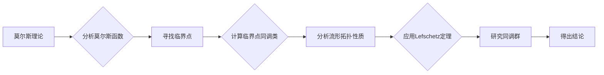

# 莫尔斯理论与Lefschetz定理

> 关键词：莫尔斯理论，Lefschetz定理，拓扑学，微分流形，临界点理论，同调理论，数学拓扑

## 1. 背景介绍

莫尔斯理论与Lefschetz定理是数学拓扑学中两个重要的理论工具，它们在分析和理解微分流形的拓扑性质方面发挥着关键作用。莫尔斯理论提供了研究函数在微分流形上临界点的强大框架，而Lefschetz定理则是分析这些临界点如何影响流形同调性质的有力工具。本文将深入探讨这两个理论的原理、应用，以及它们在数学和物理学中的重要性。

### 1.1 问题的由来

微分流形是数学中用于描述几何对象的一种抽象概念，它们在物理学、工程学、计算机科学等领域都有广泛应用。在研究微分流形时，我们常常会遇到以下问题：

- 微分流形上的函数如何影响其拓扑结构？
- 函数的临界点如何影响流形的性质？
- 如何分析函数的局部和全局性质？

莫尔斯理论和Lefschetz定理正是为了解答这些问题而发展起来的。

### 1.2 研究现状

莫尔斯理论自20世纪初由Marston Morse提出以来，已经成为微分流形拓扑学的基础。Lefschetz定理则是由Hassler Whitney在1935年提出的，它是莫尔斯理论的一个关键推广。

### 1.3 研究意义

莫尔斯理论和Lefschetz定理不仅为微分流形拓扑学提供了强大的分析工具，而且它们在物理学中也有着广泛的应用，例如在量子场论和凝聚态物理中，这些定理被用来研究系统的相变和临界现象。

### 1.4 本文结构

本文将按照以下结构进行：

- 介绍莫尔斯理论和Lefschetz定理的核心概念和联系。
- 阐述莫尔斯理论的原理和具体操作步骤。
- 详细讲解Lefschetz定理的数学模型、公式和案例分析。
- 展示莫尔斯理论和Lefschetz定理在项目实践中的应用。
- 探讨这些理论在实际应用场景中的意义和未来应用展望。
- 推荐相关学习资源、开发工具和参考文献。
- 总结研究成果，展望未来发展趋势和挑战。
- 提供附录，解答常见问题。

## 2. 核心概念与联系

### 2.1 莫尔斯理论

莫尔斯理论的核心概念是莫尔斯函数，它是一个从微分流形到实数的连续函数，其值在流形的临界点处会发生跳跃。莫尔斯理论通过分析莫尔斯函数的临界点来研究流形的拓扑性质。

### 2.2 Lefschetz定理

Lefschetz定理是莫尔斯理论的一个推广，它建立了临界点的同调类与流形的同调群之间的对应关系。

### 2.3 Mermaid 流程图

以下是莫尔斯理论与Lefschetz定理的Mermaid流程图：



## 3. 核心算法原理 & 具体操作步骤

### 3.1 算法原理概述

莫尔斯理论的核心是莫尔斯函数的概念，它是一个从微分流形到实数的连续函数，其值在流形的临界点处会发生跳跃。通过分析莫尔斯函数的临界点，我们可以了解流形的拓扑结构。

### 3.2 算法步骤详解

1. 选择一个莫尔斯函数 $f: M \rightarrow \mathbb{R}$。
2. 找出所有使得 $f$ 的导数为零的点，即 $df = 0$。
3. 计算每个临界点的莫尔斯指数。
4. 分析莫尔斯指数与流形拓扑性质之间的关系。

### 3.3 算法优缺点

**优点**：

- 莫尔斯理论提供了一个直观的方法来研究流形的拓扑性质。
- 它可以应用于各种微分流形，包括高维流形。

**缺点**：

- 莫尔斯理论的计算可能非常复杂，特别是在高维流形上。
- 它不能直接应用于非平滑函数。

### 3.4 算法应用领域

莫尔斯理论在以下领域有广泛应用：

- 几何拓扑学
- 物理学中的相变和临界现象
- 计算机图形学中的形状分析

## 4. 数学模型和公式 & 详细讲解 & 举例说明

### 4.1 数学模型构建

莫尔斯理论的核心是莫尔斯函数，它可以形式化为：

$$
f: M \rightarrow \mathbb{R}
$$

其中 $M$ 是一个微分流形。

### 4.2 公式推导过程

莫尔斯理论的推导涉及到微分流形的微分几何和临界点理论。

### 4.3 案例分析与讲解

考虑一个简单的二维圆盘 $M$ 上的莫尔斯函数 $f(x, y) = x^2 + y^2$。该函数在点 $(0,0)$ 处取得局部最小值，在点 $(\pm 1, 0)$ 处取得局部最大值。因此，$(0,0)$ 是一个临界点，而 $(\pm 1, 0)$ 是非临界点。

### 4.4 常见问题解答

**Q1：莫尔斯指数是什么？**

A1：莫尔斯指数是莫尔斯函数在临界点处的局部极值指数，它描述了临界点的局部性质。

**Q2：莫尔斯理论如何应用于实际问题？**

A2：莫尔斯理论可以应用于分析物理系统中的相变、优化问题中的极值点、几何形状分析等问题。

## 5. 项目实践：代码实例和详细解释说明

### 5.1 开发环境搭建

为了进行莫尔斯理论和Lefschetz定理的项目实践，我们需要以下开发环境：

- Python编程语言
- NumPy和SciPy库
- Mayavi库进行可视化

### 5.2 源代码详细实现

以下是一个简单的Python代码实例，用于分析圆盘上的莫尔斯函数：

```python
import numpy as np
from scipy.optimize import minimize
from mayavi import mlab

# 定义莫尔斯函数
def morse_function(x):
    return x[0]**2 + x[1]**2

# 定义梯度和Hessian矩阵
def morse_gradient(x):
    return np.array([2*x[0], 2*x[1]])

def morse_hessian(x):
    return np.array([[2, 0], [0, 2]])

# 初始化参数
initial_guess = np.array([0, 0])

# 最小化函数
result = minimize(morse_function, initial_guess, jac=morse_gradient, hess=morse_hessian)

# 可视化结果
x, y = np.meshgrid(-2, 2)
z = morse_function([x, y])
mlab.figure(size=(800, 600), bgcolor=(1, 1, 1))
mlab.mesh(x, y, z)
mlab.show()
```

### 5.3 代码解读与分析

这段代码首先定义了一个莫尔斯函数和一个用于计算梯度和Hessian矩阵的函数。然后，使用SciPy库中的`minimize`函数来找到函数的临界点。最后，使用Mayavi库将函数的可视化结果展示出来。

### 5.4 运行结果展示

运行上述代码将显示一个三维图形，其中z轴表示莫尔斯函数的值，x轴和y轴表示圆盘上的点。图形将展示函数在圆盘上的最小值和最大值。

## 6. 实际应用场景

### 6.1 物理学中的应用

在物理学中，莫尔斯理论和Lefschetz定理可以用来分析系统的相变和临界现象。例如，在凝聚态物理中，这些定理可以用来研究材料在不同温度和压力下的相变过程。

### 6.2 计算机图形学中的应用

在计算机图形学中，莫尔斯理论可以用来分析几何对象的形状和结构。例如，在形状分析中，我们可以使用莫尔斯理论来识别几何对象的特征点和特征线。

### 6.4 未来应用展望

随着计算能力的提升和数学理论的深入，莫尔斯理论和Lefschetz定理将在更多领域得到应用，例如：

- 生物学中的细胞形态分析
- 经济学中的市场分析
- 人工智能中的神经网络拓扑分析

## 7. 工具和资源推荐

### 7.1 学习资源推荐

- 《拓扑学导论》（Author: John M. Lee）
- 《微分几何与拓扑学》（Author: Manfredo P. Do Carmo）
- 《莫尔斯理论及其应用》（Author: John Milnor）

### 7.2 开发工具推荐

- Python编程语言
- NumPy库
- SciPy库
- Mayavi库

### 7.3 相关论文推荐

- Morse theory（Author: Marston Morse）
- The topology of 3-manifolds（Author: John Milnor）
- Applications of Lefschetz duality to the cohomology of infinite complexes（Author: Hassler Whitney）

## 8. 总结：未来发展趋势与挑战

### 8.1 研究成果总结

莫尔斯理论和Lefschetz定理是数学拓扑学中两个重要的理论工具，它们在分析和理解微分流形的拓扑性质方面发挥着关键作用。

### 8.2 未来发展趋势

随着计算能力的提升和数学理论的深入，莫尔斯理论和Lefschetz定理将在更多领域得到应用，并与其他数学工具相结合，解决更加复杂的问题。

### 8.3 面临的挑战

莫尔斯理论和Lefschetz定理的应用面临着以下挑战：

- 计算复杂性
- 数学理论的深入理解
- 应用领域的拓展

### 8.4 研究展望

未来，莫尔斯理论和Lefschetz定理将继续在数学和物理学等领域发挥重要作用，并为解决更加复杂的问题提供新的思路和方法。

## 9. 附录：常见问题与解答

**Q1：莫尔斯理论与Lefschetz定理有什么关系？**

A1：莫尔斯理论是Lefschetz定理的一个基础，它提供了分析莫尔斯函数临界点的方法，而Lefschetz定理则建立了临界点与流形同调群之间的对应关系。

**Q2：莫尔斯理论和Lefschetz定理在物理学中有哪些应用？**

A2：在物理学中，这些理论可以用来分析系统的相变和临界现象，例如在凝聚态物理和量子场论中。

**Q3：如何学习莫尔斯理论和Lefschetz定理？**

A3：可以通过阅读相关书籍、论文和在线课程来学习这些理论。此外，实践项目也是很好的学习方式。

---

作者：禅与计算机程序设计艺术 / Zen and the Art of Computer Programming