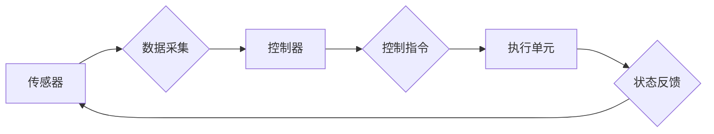

> 计算变化, 自动化, 机器学习, 工业互联网, 人工智能, 数据驱动, 实时系统, 网络化, 智能化

# 计算变化对自动化领域的影响

随着计算能力的飞速发展，自动化技术正经历着前所未有的变革。从传统的自动化系统到智能化的工业互联网，计算技术的进步不仅改变了自动化领域的操作方式，也重塑了其设计理念和发展方向。本文将探讨计算变化对自动化领域的影响，分析其背后的核心概念和算法原理，并展望未来的发展趋势和挑战。

## 1. 背景介绍

自动化技术起源于20世纪中叶，经过几十年的发展，已广泛应用于工业、交通、医疗、家居等多个领域。传统的自动化系统主要依赖物理传感器和控制器，通过预设的程序进行控制操作。然而，随着计算能力的提升和大数据技术的普及，自动化系统正逐渐向智能化、网络化方向发展。

### 1.1 问题的由来

随着工业4.0、智能制造等概念的兴起，自动化领域面临着以下问题：

- 传统自动化系统难以适应复杂多变的生产环境和任务需求。
- 传统自动化系统缺乏自适应性和学习能力，难以应对突发状况。
- 传统自动化系统的数据难以有效利用，无法进行数据驱动决策。

### 1.2 研究现状

为了解决上述问题，研究人员和工程师们开始探索将计算技术引入自动化领域。以下是一些关键的技术趋势：

- 机器学习：利用机器学习算法对数据进行建模和分析，实现自动化系统的智能化。
- 工业互联网：通过物联网技术将设备、传感器、人等连接起来，实现数据共享和协同工作。
- 人工智能：将人工智能技术应用于自动化系统，实现自主决策和控制。

### 1.3 研究意义

研究计算变化对自动化领域的影响，对于推动自动化技术的创新发展具有重要意义：

- 提升自动化系统的智能化水平，提高生产效率和质量。
- 降低人工成本，提高生产安全性。
- 促进自动化技术与人工智能、物联网等领域的深度融合。

### 1.4 本文结构

本文将从以下几个方面对计算变化对自动化领域的影响进行探讨：

- 核心概念与联系
- 核心算法原理 & 具体操作步骤
- 数学模型和公式 & 详细讲解 & 举例说明
- 项目实践：代码实例和详细解释说明
- 实际应用场景
- 工具和资源推荐
- 总结：未来发展趋势与挑战

## 2. 核心概念与联系

### 2.1 核心概念

以下是计算变化对自动化领域影响中的核心概念：

- 传感器：用于感知环境信息的装置，如温度传感器、压力传感器等。
- 控制器：根据传感器采集的信息，发出控制指令的装置，如PLC、DCS等。
- 机器学习：一种使计算机系统能够从数据中学习并做出决策的技术。
- 人工智能：一种模拟人类智能行为的技术，包括感知、推理、学习、决策等。
- 物联网：通过互联网将物理设备连接起来，实现设备之间、设备与人类之间的信息交互。
- 工业互联网：物联网在工业领域的应用，实现工业设备、生产线、供应链等的互联互通。

### 2.2 核心概念原理和架构的 Mermaid 流程图



### 2.3 核心概念联系

以上流程图展示了传感器、控制器、执行单元等核心概念之间的联系。传感器负责采集环境信息，控制器根据采集到的信息发出控制指令，执行单元执行指令，并将执行状态反馈给传感器，形成一个闭环控制系统。

## 3. 核心算法原理 & 具体操作步骤

### 3.1 算法原理概述

计算变化对自动化领域的影响主要体现在以下几个方面：

- 机器学习算法的应用，实现自动化系统的智能化。
- 数据驱动决策，提高生产效率和产品质量。
- 实时系统设计，满足实时性要求。

### 3.2 算法步骤详解

以下是对上述算法原理的具体步骤详解：

#### 3.2.1 机器学习算法

1. 数据采集：收集传感器采集到的环境信息。
2. 数据预处理：对采集到的数据进行清洗、去噪等预处理操作。
3. 模型训练：使用机器学习算法对预处理后的数据进行训练，建立预测模型。
4. 模型评估：使用验证集评估模型的性能，调整模型参数。
5. 模型部署：将训练好的模型部署到自动化系统中，实现智能化控制。

#### 3.2.2 数据驱动决策

1. 数据采集：收集传感器采集到的环境信息。
2. 数据分析：使用数据挖掘、统计分析等方法分析数据，提取特征信息。
3. 决策制定：根据分析结果制定相应的决策策略。
4. 决策执行：将决策结果传递给控制器，实现自动化控制。

#### 3.2.3 实时系统设计

1. 硬件选择：选择具有高实时性能的硬件平台。
2. 软件设计：设计高效的软件算法，满足实时性要求。
3. 系统测试：对系统进行全面的测试，确保其实时性和稳定性。

### 3.3 算法优缺点

#### 3.3.1 机器学习算法

优点：

- 可以处理复杂的非线性关系。
- 可以从海量数据中提取特征信息。
- 可以实现自动化系统的自适应和自学习。

缺点：

- 需要大量的标注数据。
- 模型的可解释性较差。
- 模型性能受数据质量影响较大。

#### 3.3.2 数据驱动决策

优点：

- 可以提高生产效率和产品质量。
- 可以实现智能化决策。

缺点：

- 需要大量的数据。
- 决策过程缺乏透明度。

#### 3.3.3 实时系统设计

优点：

- 可以满足实时性要求。
- 可以提高系统的稳定性。

缺点：

- 硬件成本较高。
- 软件设计复杂。

### 3.4 算法应用领域

机器学习算法、数据驱动决策和实时系统设计在以下领域具有广泛的应用：

- 工业自动化：如智能工厂、智能车间、智能机器人等。
- 交通运输：如智能交通系统、自动驾驶汽车等。
- 医疗保健：如智能诊断、远程医疗等。
- 家居生活：如智能家电、智能家居等。

## 4. 数学模型和公式 & 详细讲解 & 举例说明

### 4.1 数学模型构建

以下是一个简单的机器学习模型，用于预测工业生产中的温度：

$$
y = w_0 + w_1x_1 + w_2x_2 + ... + w_nx_n + \epsilon
$$

其中 $y$ 为温度预测值，$x_1, x_2, ..., x_n$ 为影响温度的输入变量，$w_0, w_1, ..., w_n$ 为模型参数，$\epsilon$ 为误差项。

### 4.2 公式推导过程

以线性回归模型为例，介绍公式推导过程：

1. 假设数据集为 $\{(x_1, y_1), (x_2, y_2), ..., (x_n, y_n)\}$。
2. 目标是最小化预测值与真实值之间的误差平方和：

$$
\min_{w_0, w_1, ..., w_n} \sum_{i=1}^n (y_i - w_0 - w_1x_i - ... - w_nx_i)^2
$$

3. 对上述目标函数求偏导，并令其等于0，得到：

$$
\frac{\partial}{\partial w_k} \sum_{i=1}^n (y_i - w_0 - w_1x_i - ... - w_nx_i)^2 = 0
$$

4. 解上述方程组，即可得到最优的模型参数。

### 4.3 案例分析与讲解

以工业生产中的温度控制为例，分析机器学习模型在自动化领域的应用。

### 4.3.1 案例背景

某工厂生产过程中需要对温度进行精确控制，以确保产品质量。传统的控制方法主要依靠人工调整，效率低下且容易出错。

### 4.3.2 解决方案

1. 收集温度传感器采集的数据，包括温度、时间、原料参数等。
2. 使用机器学习算法对采集到的数据进行训练，建立温度预测模型。
3. 将训练好的模型部署到自动化系统中，实现温度自动控制。

### 4.3.3 案例效果

通过机器学习模型对温度进行预测和控制，可以有效提高生产效率和质量，降低人工成本。

## 5. 项目实践：代码实例和详细解释说明

### 5.1 开发环境搭建

1. 安装Python、Anaconda等开发环境。
2. 安装NumPy、Pandas、Scikit-learn等Python库。

### 5.2 源代码详细实现

以下是一个使用Python和Scikit-learn库实现的线性回归模型示例：

```python
import numpy as np
import pandas as pd
from sklearn.linear_model import LinearRegression

# 加载数据集
data = pd.read_csv('temperature_data.csv')

# 分离特征和标签
X = data.drop('temperature', axis=1)
y = data['temperature']

# 创建线性回归模型
model = LinearRegression()

# 训练模型
model.fit(X, y)

# 预测温度
predicted_temperature = model.predict(X)

# 输出预测结果
print(predicted_temperature)
```

### 5.3 代码解读与分析

上述代码首先导入必要的库，然后加载数据集，分离特征和标签，创建线性回归模型，训练模型，并对输入数据进行预测。

### 5.4 运行结果展示

运行上述代码，可以得到预测温度的结果。通过对比预测值和真实值，可以评估模型的性能。

## 6. 实际应用场景

### 6.1 工业自动化

机器学习算法在工业自动化领域的应用主要包括：

- 质量检测：通过图像识别技术对产品进行缺陷检测。
- 生产线优化：通过分析生产线数据，优化生产流程，提高生产效率。
- 设备预测性维护：通过分析设备运行数据，预测设备故障，实现预防性维护。

### 6.2 交通运输

机器学习在交通运输领域的应用主要包括：

- 自动驾驶：通过机器学习算法实现车辆的自动驾驶功能。
- 车联网：通过车联网技术实现车辆之间的信息共享和协同驾驶。
- 交通流量预测：通过分析交通数据，预测交通流量，优化交通信号灯控制。

### 6.3 医疗保健

机器学习在医疗保健领域的应用主要包括：

- 智能诊断：通过图像识别技术辅助医生进行疾病诊断。
- 药物研发：通过分析药物数据，筛选出具有潜力的药物候选。
- 疾病预测：通过分析健康数据，预测疾病的发生和发展趋势。

## 7. 工具和资源推荐

### 7.1 学习资源推荐

1. 《Python编程：从入门到实践》
2. 《机器学习实战》
3. 《深度学习》
4. 《工业互联网：构建智能工厂的关键技术》

### 7.2 开发工具推荐

1. Anaconda
2. Jupyter Notebook
3. PyCharm
4. Keras
5. TensorFlow

### 7.3 相关论文推荐

1. "Deep Learning for Industrial Internet of Things: A Survey"
2. "Deep Learning for Industrial Automation: A Survey"
3. "A Survey on Deep Learning for Healthcare"
4. "Deep Learning for Transportation Systems: A Survey"
5. "A Survey on Deep Learning for Smart Manufacturing"

## 8. 总结：未来发展趋势与挑战

### 8.1 研究成果总结

计算变化对自动化领域的影响主要体现在以下几个方面：

- 机器学习算法的应用，实现自动化系统的智能化。
- 数据驱动决策，提高生产效率和产品质量。
- 实时系统设计，满足实时性要求。

### 8.2 未来发展趋势

未来，计算变化对自动化领域的影响将更加显著，主要体现在以下方面：

- 模型轻量化：开发轻量级的机器学习模型，降低对硬件资源的需求。
- 模型可解释性：提高机器学习模型的可解释性，增强用户对模型的信任。
- 模型鲁棒性：提高机器学习模型的鲁棒性，使其能够适应复杂多变的环境。

### 8.3 面临的挑战

计算变化对自动化领域的影响也带来了一些挑战，主要包括：

- 数据质量：保证数据质量是机器学习模型有效应用的前提。
- 模型安全：确保机器学习模型的安全性和可靠性。
- 模型可解释性：提高机器学习模型的可解释性，增强用户对模型的信任。

### 8.4 研究展望

未来，计算变化对自动化领域的影响将继续深入，研究人员和工程师们需要共同努力，解决面临的挑战，推动自动化技术的创新发展。

## 9. 附录：常见问题与解答

### 9.1 常见问题

**Q1：什么是机器学习？**

A1：机器学习是一种使计算机系统能够从数据中学习并做出决策的技术。

**Q2：什么是深度学习？**

A2：深度学习是机器学习的一种，它使用具有多层隐藏层的神经网络模型进行学习。

**Q3：什么是工业互联网？**

A3：工业互联网是物联网在工业领域的应用，通过将设备、传感器、人等连接起来，实现数据共享和协同工作。

**Q4：什么是智能化自动化？**

A4：智能化自动化是指将人工智能、机器学习等技术与自动化技术相结合，实现自动化系统的智能化。

**Q5：如何保证机器学习模型的安全性和可靠性？**

A5：为了保证机器学习模型的安全性和可靠性，需要从数据质量、模型设计、模型训练、模型部署等环节进行严格把控。

### 9.2 解答

针对以上常见问题，本文已给出相应的解答。如有其他问题，欢迎留言交流。

---

作者：禅与计算机程序设计艺术 / Zen and the Art of Computer Programming