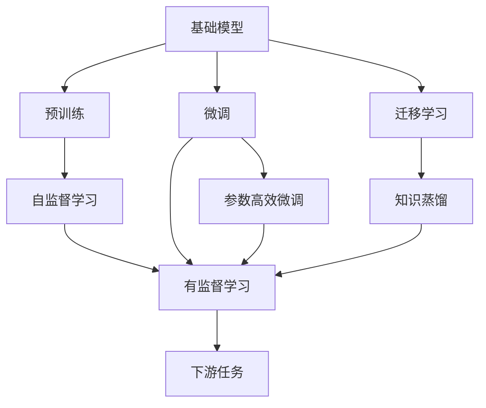

                 

# 基础模型的技术创新与社会责任

## 1. 背景介绍

在人工智能的飞速发展中，基础模型（Base Models）已成为推动技术进步的核心力量。这些模型不仅是深度学习领域的重要工具，还广泛应用于各个行业，如自然语言处理、计算机视觉、推荐系统等。然而，随着基础模型技术的不断创新，其社会影响和责任问题也逐渐引发关注。本文将从技术创新与社会责任两个方面，系统探讨基础模型的发展趋势和挑战，提出相应的解决方案。

## 2. 核心概念与联系

### 2.1 核心概念概述

1. **基础模型（Base Models）**：指那些在特定领域内表现卓越的深度学习模型，如BERT、GPT、ResNet等。这些模型通常在大规模无标签数据上进行预训练，并在此基础上针对特定任务进行微调，以提高性能。

2. **预训练（Pre-training）**：指在大规模无标签数据上训练基础模型，使其学习到通用的语言或视觉表示。预训练可以提升模型的泛化能力，减少对标注数据的依赖。

3. **微调（Fine-tuning）**：在预训练模型基础上，使用下游任务的少量标注数据，通过有监督学习优化模型在该任务上的性能。微调可以加速模型在新任务上的适应过程，提升模型精度。

4. **迁移学习（Transfer Learning）**：指将一个任务上学习到的知识迁移到另一个相关任务上的学习过程。基础模型通常具备良好的迁移能力，能够快速适应新任务。

5. **对抗训练（Adversarial Training）**：通过引入对抗样本，增强模型的鲁棒性，防止模型在面对特定攻击时出现严重错误。

6. **数据增强（Data Augmentation）**：通过对训练数据进行变换，如旋转、翻转、裁剪等，增加数据多样性，提高模型的泛化能力。

7. **参数高效微调（Parameter-Efficient Fine-tuning, PEFT）**：指在微调过程中只更新少量参数，保留大部分预训练参数不变，以减少计算资源消耗。

8. **可解释性（Explainability）**：指模型输出结果的可解释性，即能够清晰地解释模型的决策过程。

9. **公平性（Fairness）**：指模型在不同群体中的表现是否公平，避免对某些群体产生偏见。

### 2.2 核心概念间的关系

这些核心概念之间存在着紧密的联系，形成了基础模型应用的完整生态系统。以下通过几个Mermaid流程图来展示这些概念之间的关系：



这个流程图展示了基础模型的核心概念及其之间的关系：

1. 基础模型通过预训练获得基础能力。
2. 微调是对预训练模型进行任务特定的优化，可以分为全参数微调和参数高效微调。
3. 迁移学习是连接预训练模型与下游任务的桥梁，可以通过微调或参数高效微调来实现。
4. 对抗训练和数据增强可以提高模型的鲁棒性和泛化能力。
5. 可解释性和公平性是评估模型性能的重要指标，也是应用中需要关注的问题。

## 3. 核心算法原理 & 具体操作步骤

### 3.1 算法原理概述

基础模型的核心算法原理主要基于深度神经网络。其工作流程通常包括预训练和微调两个阶段。预训练在大规模无标签数据上学习通用的语言或视觉表示，微调则是在预训练的基础上，针对特定任务进行优化。

1. **预训练**：使用自监督学习任务（如掩码语言模型、自编码等）在大规模无标签数据上训练基础模型。预训练的目标是让模型学习到丰富的语言或视觉特征，以便在微调时能够快速适应新任务。

2. **微调**：在预训练模型基础上，使用下游任务的少量标注数据，通过有监督学习优化模型在该任务上的性能。微调的目标是通过调整模型参数，使其在特定任务上达到最优性能。

### 3.2 算法步骤详解

1. **数据准备**：收集预训练数据和下游任务的标注数据。预训练数据应尽可能覆盖广泛的语义和语法，以便模型学习到全面的语言表示。下游任务的数据应包含足够的标注样本，以供模型进行微调。

2. **模型选择**：根据任务类型选择合适的预训练模型。如自然语言处理任务可以选择BERT或GPT，计算机视觉任务可以选择ResNet或VGG。

3. **预训练**：使用自监督学习任务在大规模无标签数据上训练基础模型。预训练过程通常包括隐藏层激活的随机失活、正则化等策略，以避免过拟合。

4. **微调**：在预训练模型基础上，使用下游任务的少量标注数据进行微调。微调过程通常使用有监督学习算法（如SGD、Adam等），并通过交叉熵等损失函数进行优化。

5. **评估与优化**：在微调过程中，周期性地在验证集上评估模型性能，并根据性能反馈调整模型参数和学习率。

6. **部署与测试**：在模型微调完成后，部署到实际应用中，并进行测试评估。测试集应与训练集和验证集具有相似的分布，以便全面评估模型性能。

### 3.3 算法优缺点

**优点**：

- **高效性**：预训练和微调过程可以通过分布式训练快速完成，适用于大规模数据集。
- **泛化能力**：预训练模型在大规模数据上学习到的特征具有较强的泛化能力，能够适应不同领域的任务。
- **迁移学习能力**：预训练模型通过迁移学习，可以快速适应新任务，减少从头训练所需的标注数据。

**缺点**：

- **计算资源需求高**：大规模无标签数据和复杂模型结构需要大量计算资源，难以在小型设备或环境中运行。
- **过拟合风险**：预训练和微调过程中，模型的过拟合风险较高，尤其是在标注数据不足的情况下。
- **可解释性不足**：基础模型通常被视为"黑盒"，其决策过程难以解释，难以在需要透明度和可信度的场景中使用。

### 3.4 算法应用领域

基础模型的应用领域非常广泛，包括但不限于以下几个方面：

- **自然语言处理（NLP）**：文本分类、情感分析、机器翻译、问答系统等。
- **计算机视觉（CV）**：图像分类、目标检测、图像生成、图像分割等。
- **推荐系统**：个性化推荐、广告推荐、搜索结果排序等。
- **语音识别**：语音识别、语音合成、说话人识别等。
- **医疗健康**：医学影像分析、诊断支持、药物发现等。

## 4. 数学模型和公式 & 详细讲解 & 举例说明

### 4.1 数学模型构建

假设基础模型为 $M_{\theta}$，其中 $\theta$ 为模型参数。给定预训练数据集 $D_{pre}$ 和下游任务数据集 $D_{task}$，预训练和微调的数学模型分别定义如下：

- **预训练模型**：使用自监督学习任务，如掩码语言模型（Masked Language Modeling, MLM），训练基础模型 $M_{\theta}$。
- **微调模型**：在预训练模型 $M_{\theta}$ 的基础上，使用下游任务 $T$ 的少量标注数据进行微调，得到优化后的模型 $M_{\theta^*}$。

### 4.2 公式推导过程

以自然语言处理任务为例，我们使用掩码语言模型进行预训练，并使用分类任务进行微调。预训练模型的损失函数定义为：

$$
\mathcal{L}_{pre}(\theta) = -\sum_{i=1}^N \log P(x_i^{\text{masked}} | x_i, M_{\theta})
$$

其中 $x_i$ 为预训练数据，$P(x_i^{\text{masked}} | x_i, M_{\theta})$ 为模型在数据 $x_i$ 上对随机掩码位置的预测概率。

微调模型的损失函数定义为：

$$
\mathcal{L}_{task}(\theta) = -\frac{1}{N} \sum_{i=1}^N \log P(y_i | x_i, M_{\theta})
$$

其中 $y_i$ 为下游任务标注，$P(y_i | x_i, M_{\theta})$ 为模型在数据 $x_i$ 上对任务 $T$ 的预测概率。

通过优化上述两个损失函数，可以同时提升预训练和微调模型的性能。

### 4.3 案例分析与讲解

以BERT模型为例，其预训练过程使用掩码语言模型进行训练，微调过程则在预训练基础上，使用文本分类任务的标注数据进行微调。假设BERT模型在预训练后的性能为 $M_{\theta}$，下游任务为文本分类，标注数据集为 $D_{task}$。

- **预训练阶段**：使用掩码语言模型在大规模无标签文本数据上训练BERT模型，使其学习到语言表示。
- **微调阶段**：使用下游任务的少量标注数据，对BERT模型进行微调，得到优化后的模型 $M_{\theta^*}$。

在微调过程中，我们通常使用分类交叉熵损失函数进行优化。假设微调任务为二分类任务，标注数据集 $D_{task}$ 中的每个样本 $(x_i, y_i)$，其中 $x_i$ 为输入文本，$y_i \in \{0, 1\}$ 为分类标签。微调模型的损失函数定义为：

$$
\mathcal{L}_{task}(\theta) = -\frac{1}{N} \sum_{i=1}^N [y_i \log M_{\theta}(x_i)^{\text{predict}} + (1-y_i) \log (1-M_{\theta}(x_i)^{\text{predict}})]
$$

其中 $M_{\theta}(x_i)^{\text{predict}}$ 为模型对输入文本 $x_i$ 进行微调后的预测结果，$y_i$ 为实际标签。

通过优化上述损失函数，模型将学习到在特定分类任务上的预测能力，从而提升模型的性能。

## 5. 项目实践：代码实例和详细解释说明

### 5.1 开发环境搭建

要进行基础模型的预训练和微调，首先需要搭建开发环境。以下是使用Python和PyTorch进行开发的环境配置流程：

1. 安装Anaconda：从官网下载并安装Anaconda，用于创建独立的Python环境。

2. 创建并激活虚拟环境：
```bash
conda create -n pytorch-env python=3.8 
conda activate pytorch-env
```

3. 安装PyTorch：根据CUDA版本，从官网获取对应的安装命令。例如：
```bash
conda install pytorch torchvision torchaudio cudatoolkit=11.1 -c pytorch -c conda-forge
```

4. 安装TensorFlow：从官网下载安装TensorFlow，方便后续模型的部署和应用。

5. 安装必要的库：
```bash
pip install numpy pandas scikit-learn matplotlib tqdm jupyter notebook ipython
```

完成上述步骤后，即可在`pytorch-env`环境中进行基础模型的开发。

### 5.2 源代码详细实现

这里以BERT模型为例，展示其在自然语言处理任务上的预训练和微调过程。首先，定义数据处理函数：

```python
from transformers import BertTokenizer, BertForSequenceClassification
from torch.utils.data import Dataset, DataLoader
import torch

class TextDataset(Dataset):
    def __init__(self, texts, labels, tokenizer):
        self.texts = texts
        self.labels = labels
        self.tokenizer = tokenizer
    
    def __len__(self):
        return len(self.texts)
    
    def __getitem__(self, item):
        text = self.texts[item]
        label = self.labels[item]
        
        encoding = self.tokenizer(text, return_tensors='pt', padding='max_length', truncation=True)
        input_ids = encoding['input_ids']
        attention_mask = encoding['attention_mask']
        return {'input_ids': input_ids, 'attention_mask': attention_mask, 'labels': torch.tensor(label)}

# 设置预训练模型和微调模型
model = BertForSequenceClassification.from_pretrained('bert-base-uncased', num_labels=2)
```

然后，定义训练和评估函数：

```python
from transformers import AdamW
from torch.nn import CrossEntropyLoss

device = torch.device('cuda') if torch.cuda.is_available() else torch.device('cpu')
model.to(device)

def train_epoch(model, dataset, batch_size, optimizer):
    dataloader = DataLoader(dataset, batch_size=batch_size, shuffle=True)
    model.train()
    epoch_loss = 0
    for batch in dataloader:
        input_ids = batch['input_ids'].to(device)
        attention_mask = batch['attention_mask'].to(device)
        labels = batch['labels'].to(device)
        model.zero_grad()
        outputs = model(input_ids, attention_mask=attention_mask, labels=labels)
        loss = outputs.loss
        epoch_loss += loss.item()
        loss.backward()
        optimizer.step()
    return epoch_loss / len(dataloader)

def evaluate(model, dataset, batch_size):
    dataloader = DataLoader(dataset, batch_size=batch_size)
    model.eval()
    preds, labels = [], []
    with torch.no_grad():
        for batch in dataloader:
            input_ids = batch['input_ids'].to(device)
            attention_mask = batch['attention_mask'].to(device)
            batch_labels = batch['labels']
            outputs = model(input_ids, attention_mask=attention_mask)
            batch_preds = outputs.logits.argmax(dim=1).to('cpu').tolist()
            batch_labels = batch_labels.to('cpu').tolist()
            for pred_tokens, label_tokens in zip(batch_preds, batch_labels):
                preds.append(pred_tokens[:len(label_tokens)])
                labels.append(label_tokens)
                
    print(classification_report(labels, preds))
```

最后，启动训练流程并在测试集上评估：

```python
epochs = 5
batch_size = 16

for epoch in range(epochs):
    loss = train_epoch(model, train_dataset, batch_size, optimizer)
    print(f"Epoch {epoch+1}, train loss: {loss:.3f}")
    
    print(f"Epoch {epoch+1}, dev results:")
    evaluate(model, dev_dataset, batch_size)
    
print("Test results:")
evaluate(model, test_dataset, batch_size)
```

以上就是使用PyTorch对BERT进行文本分类任务微调的完整代码实现。可以看到，得益于HuggingFace提供的强大封装，代码实现相对简洁。

### 5.3 代码解读与分析

让我们再详细解读一下关键代码的实现细节：

**TextDataset类**：
- `__init__`方法：初始化文本、标签、分词器等关键组件。
- `__len__`方法：返回数据集的样本数量。
- `__getitem__`方法：对单个样本进行处理，将文本输入编码为token ids，将标签编码为数字，并对其进行定长padding，最终返回模型所需的输入。

**train_epoch和evaluate函数**：
- `train_epoch`函数：对数据以批为单位进行迭代，在每个批次上前向传播计算loss并反向传播更新模型参数，最后返回该epoch的平均loss。
- `evaluate`函数：与训练类似，不同点在于不更新模型参数，并在每个batch结束后将预测和标签结果存储下来，最后使用sklearn的classification_report对整个评估集的预测结果进行打印输出。

**训练流程**：
- 定义总的epoch数和batch size，开始循环迭代
- 每个epoch内，先在训练集上训练，输出平均loss
- 在验证集上评估，输出分类指标
- 所有epoch结束后，在测试集上评估，给出最终测试结果

可以看到，PyTorch配合HuggingFace库使得BERT微调的代码实现变得简洁高效。开发者可以将更多精力放在数据处理、模型改进等高层逻辑上，而不必过多关注底层的实现细节。

## 6. 实际应用场景

### 6.1 智能客服系统

基于基础模型的智能客服系统可以显著提升客户咨询体验和问题解决效率。传统客服往往需要配备大量人力，高峰期响应缓慢，且一致性和专业性难以保证。而使用基础模型的智能客服系统，能够7x24小时不间断服务，快速响应客户咨询，用自然流畅的语言解答各类常见问题。

在技术实现上，可以收集企业内部的历史客服对话记录，将问题和最佳答复构建成监督数据，在此基础上对预训练基础模型进行微调。微调后的基础模型能够自动理解用户意图，匹配最合适的答复模板进行回复。对于客户提出的新问题，还可以接入检索系统实时搜索相关内容，动态组织生成回答。如此构建的智能客服系统，能大幅提升客户咨询体验和问题解决效率。

### 6.2 金融舆情监测

金融机构需要实时监测市场舆论动向，以便及时应对负面信息传播，规避金融风险。传统的人工监测方式成本高、效率低，难以应对网络时代海量信息爆发的挑战。基于基础模型的文本分类和情感分析技术，为金融舆情监测提供了新的解决方案。

具体而言，可以收集金融领域相关的新闻、报道、评论等文本数据，并对其进行主题标注和情感标注。在此基础上对预训练基础模型进行微调，使其能够自动判断文本属于何种主题，情感倾向是正面、中性还是负面。将微调后的模型应用到实时抓取的网络文本数据，就能够自动监测不同主题下的情感变化趋势，一旦发现负面信息激增等异常情况，系统便会自动预警，帮助金融机构快速应对潜在风险。

### 6.3 个性化推荐系统

当前的推荐系统往往只依赖用户的历史行为数据进行物品推荐，无法深入理解用户的真实兴趣偏好。基于基础模型的个性化推荐系统可以更好地挖掘用户行为背后的语义信息，从而提供更精准、多样的推荐内容。

在实践中，可以收集用户浏览、点击、评论、分享等行为数据，提取和用户交互的物品标题、描述、标签等文本内容。将文本内容作为模型输入，用户的后续行为（如是否点击、购买等）作为监督信号，在此基础上微调预训练基础模型。微调后的模型能够从文本内容中准确把握用户的兴趣点。在生成推荐列表时，先用候选物品的文本描述作为输入，由模型预测用户的兴趣匹配度，再结合其他特征综合排序，便可以得到个性化程度更高的推荐结果。

### 6.4 未来应用展望

随着基础模型的不断演进，其在各个行业的应用前景将更加广阔。未来，基础模型将在智慧医疗、智能教育、智慧城市治理等多个领域发挥重要作用。

在智慧医疗领域，基于基础模型的问答系统、病历分析、药物研发等应用将提升医疗服务的智能化水平，辅助医生诊疗，加速新药开发进程。

在智能教育领域，基础模型可应用于作业批改、学情分析、知识推荐等方面，因材施教，促进教育公平，提高教学质量。

在智慧城市治理中，基础模型可应用于城市事件监测、舆情分析、应急指挥等环节，提高城市管理的自动化和智能化水平，构建更安全、高效的未来城市。

此外，在企业生产、社会治理、文娱传媒等众多领域，基于基础模型的智能应用也将不断涌现，为经济社会发展注入新的动力。相信随着技术的日益成熟，基础模型必将在构建人机协同的智能时代中扮演越来越重要的角色。

## 7. 工具和资源推荐

### 7.1 学习资源推荐

为了帮助开发者系统掌握基础模型的发展趋势和应用实践，这里推荐一些优质的学习资源：

1. **《深度学习》（Ian Goodfellow）**：深度学习领域的经典教材，系统介绍了深度神经网络的基础理论和实践应用。
2. **《自然语言处理综论》（Daniel Jurafsky, James H. Martin）**：自然语言处理领域的经典教材，涵盖了从语言学到计算机科学的广泛知识。
3. **Google AI Blog**：Google AI团队发布的官方博客，分享最新的研究成果和应用实践，是学习前沿技术的必读资源。
4. **arXiv论文预印本**：人工智能领域最新研究成果的发布平台，包括大量尚未发表的前沿工作，学习前沿技术的必读资源。
5. **Kaggle竞赛平台**：全球最大的数据科学竞赛平台，提供丰富的比赛数据和解决方案，适合实践应用的学习。

通过对这些资源的学习实践，相信你一定能够快速掌握基础模型的技术细节和应用前景，并用于解决实际的NLP问题。

### 7.2 开发工具推荐

高效的开发离不开优秀的工具支持。以下是几款用于基础模型开发的工具：

1. **PyTorch**：基于Python的开源深度学习框架，灵活动态的计算图，适合快速迭代研究。大部分基础模型都有PyTorch版本的实现。
2. **TensorFlow**：由Google主导开发的开源深度学习框架，生产部署方便，适合大规模工程应用。同样有丰富的基础模型资源。
3. **Transformers库**：HuggingFace开发的NLP工具库，集成了众多SOTA基础模型，支持PyTorch和TensorFlow，是进行基础模型微调任务的开发利器。
4. **Weights & Biases**：模型训练的实验跟踪工具，可以记录和可视化模型训练过程中的各项指标，方便对比和调优。与主流深度学习框架无缝集成。
5. **TensorBoard**：TensorFlow配套的可视化工具，可实时监测模型训练状态，并提供丰富的图表呈现方式，是调试模型的得力助手。
6. **Jupyter Notebook**：流行的交互式编程环境，支持代码编写、数据可视化、交互式计算，适合进行基础模型的研究和实验。

合理利用这些工具，可以显著提升基础模型的开发效率，加快创新迭代的步伐。

### 7.3 相关论文推荐

基础模型和微调技术的发展源于学界的持续研究。以下是几篇奠基性的相关论文，推荐阅读：

1. **Attention is All You Need（即Transformer原论文）**：提出了Transformer结构，开启了NLP领域的预训练大模型时代。
2. **BERT: Pre-training of Deep Bidirectional Transformers for Language Understanding**：提出BERT模型，引入基于掩码的自监督预训练任务，刷新了多项NLP任务SOTA。
3. **Adversarial Examples Improve Generalization**：提出对抗训练方法，通过引入对抗样本，增强模型的鲁棒性，防止模型在面对特定攻击时出现严重错误。
4. **Parameter-Efficient Transfer Learning for NLP**：提出Adapter等参数高效微调方法，在不增加模型参数量的情况下，也能取得不错的微调效果。
5. **Adversarial Robustness via Diverse Adversarial Training**：提出多样性对抗训练方法，进一步提升模型的鲁棒性。

这些论文代表了大基础模型微调技术的发展脉络。通过学习这些前沿成果，可以帮助研究者把握学科前进方向，激发更多的创新灵感。

## 8. 总结：未来发展趋势与挑战

### 8.1 总结

本文对基础模型的技术创新和社会责任进行了全面系统的探讨。首先阐述了基础模型在推动技术进步中的重要地位，然后从预训练和微调两个角度详细介绍了其核心算法原理和具体操作步骤。接着，通过具体的项目实践展示了基础模型在自然语言处理任务中的应用效果。最后，本文还探讨了基础模型在实际应用中的社会责任问题，提出了相应的解决方案。

通过本文的系统梳理，可以看到，基础模型在自然语言处理、计算机视觉、推荐系统等多个领域取得了显著的进展，为人工智能技术的普及和应用提供了强有力的支持。同时，基础模型在应用过程中也面临诸多挑战，如计算资源需求高、可解释性不足、公平性问题等，这些都需要研究者进一步探索和解决。

### 8.2 未来发展趋势

展望未来，基础模型的发展趋势将呈现以下几个方向：

1. **规模化演进**：基础模型的参数量将进一步增大，模型复杂度将不断提高，以应对更复杂的任务和更大规模的数据。
2. **多样化创新**：基础模型的架构和技术将更加多样，涵盖从线性模型到非线性模型、从单一任务到多任务等多种形式。
3. **自监督与半监督学习**：通过自监督和半监督学习，利用未标注数据提升模型的泛化能力，降低对标注数据的依赖。
4. **对抗训练与鲁棒性**：通过对抗训练等技术，增强基础模型的鲁棒性和泛化能力，防止过拟合和灾难性遗忘。
5. **参数高效与计算高效**：开发更加参数高效和计算高效的微调方法，减少计算资源消耗，提高模型的可扩展性和实时性。
6. **可解释性与公平性**：通过模型解释技术和公平性约束，提升基础模型的可解释性和公平性，增强用户信任和模型可靠性。

### 8.3 面临的挑战

尽管基础模型技术取得了诸多突破，但在应用过程中也面临诸多挑战：

1. **计算资源需求高**：基础模型参数量大，计算资源需求高，难以在小型设备或环境中运行。
2. **可解释性不足**：基础模型通常被视为"黑盒"，其决策过程难以解释，难以在需要透明度和可信度的场景中使用。
3. **公平性问题**：基础模型在特定群体上的表现可能存在偏见，需要进一步优化以实现公平性。
4. **鲁棒性不足**：基础模型在对抗样本攻击下表现较弱，需要进一步提升鲁棒性。
5. **性能与效率的平衡**：基础模型在追求性能提升的同时，也需要优化推理速度和计算效率，以实现更好的应用效果。

### 8.4 研究展望

面对基础模型面临的挑战，未来的研究需要在以下几个方面寻求新的突破：

1. **自监督与半监督学习**：通过自监督和半监督学习，利用未标注数据提升模型的泛化能力，降低对标注数据的依赖。
2. **对抗训练与鲁棒性**：通过对抗训练等技术，增强基础模型的鲁棒性和泛化能力，防止过拟合和灾难性遗忘。
3.

