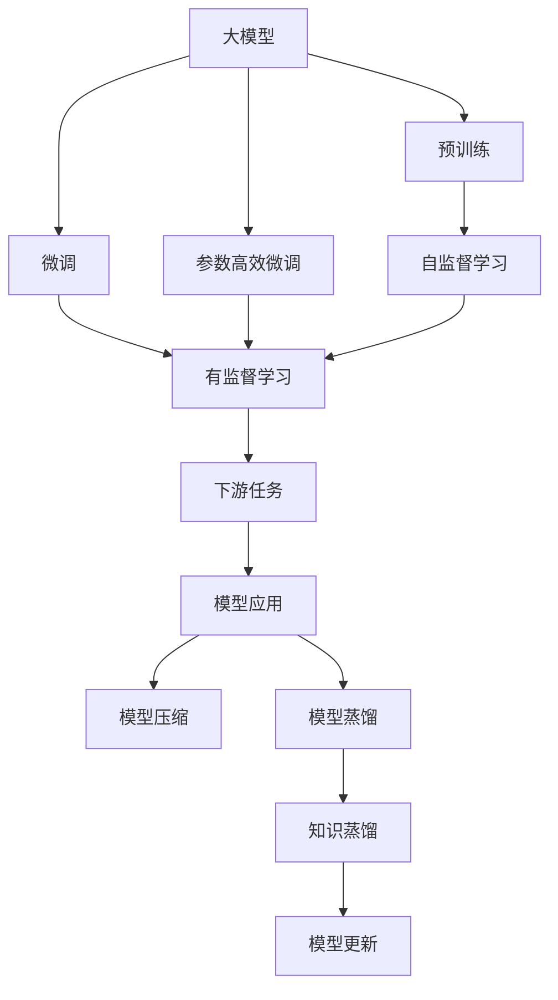
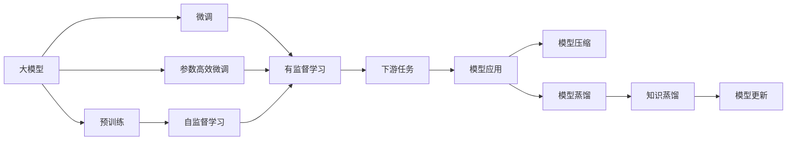
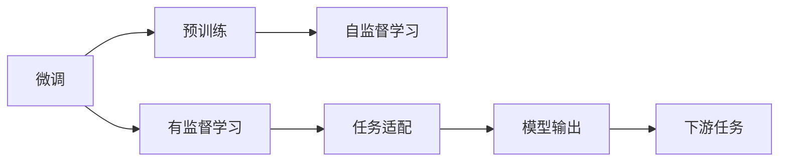
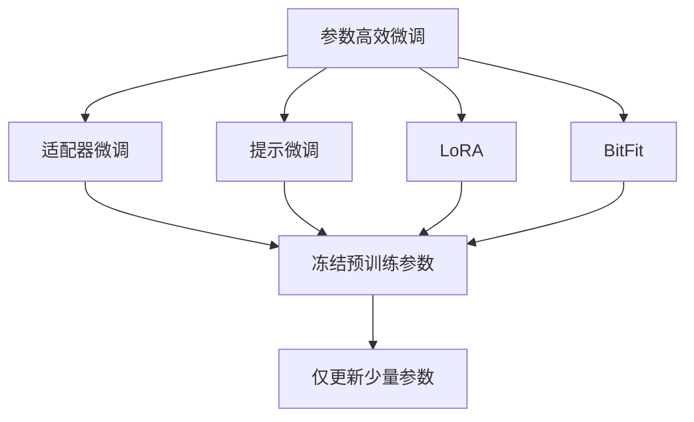
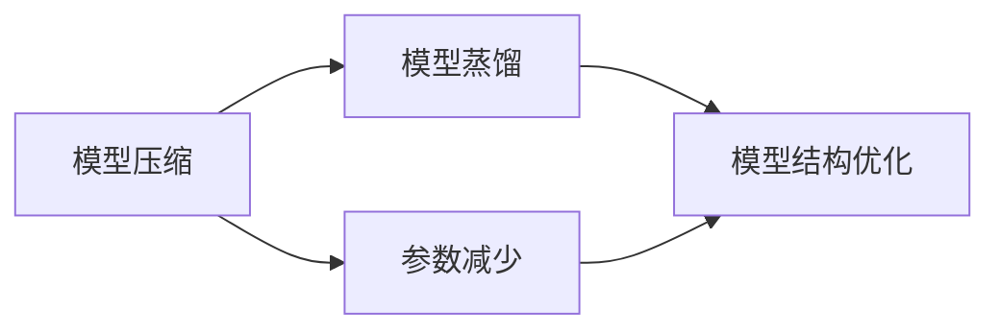
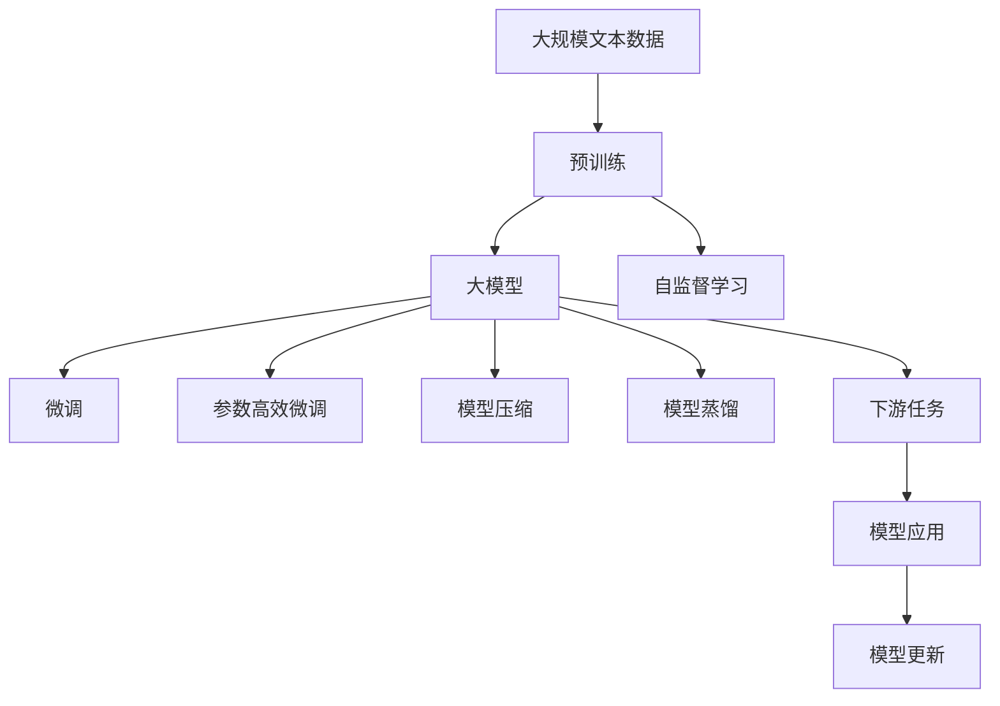

                 

## 1. 背景介绍

### 1.1 问题由来

在人工智能（AI）的演进过程中，基础模型的创新一直是推动技术进步的关键驱动力。从最早的线性回归模型到后来的神经网络、深度学习、大模型，每一个模型或算法技术的突破，都带来了AI领域的重大飞跃。

近年来，大模型（如BERT、GPT-3、T5等）和预训练技术的兴起，彻底改变了NLP（自然语言处理）领域的技术格局。这些模型在处理大规模语言数据、提取语言表示和理解上下文等方面取得了显著进步。然而，尽管大模型在处理通用语言任务上表现优异，但在特定领域的特定任务上，其性能仍有提升空间。因此，对于基础模型的技术创新需求变得尤为迫切。

### 1.2 问题核心关键点

大模型的技术创新需求主要体现在以下几个方面：

1. **模型性能提升**：现有大模型在特定领域特定任务上的性能提升仍有空间，需要通过微调、优化算法等技术进一步提高模型精度。

2. **高效模型构建**：构建高效的模型结构，以减少计算成本、提高训练速度，同时保持模型的泛化能力。

3. **数据高效利用**：充分利用有限标注数据，提升模型在数据量不足条件下的表现。

4. **鲁棒性和泛化能力**：提升模型在不同数据分布和噪声环境下的鲁棒性和泛化能力。

5. **模型解释性**：提升模型的可解释性，使其输出结果更易被理解和调试。

6. **可扩展性和适应性**：模型应具有较好的可扩展性和适应性，能够适应多样化的应用场景。

7. **伦理和安全性**：在设计和应用过程中，应考虑模型的伦理和安全性问题，避免模型偏见和滥用。

### 1.3 问题研究意义

对大模型进行技术创新，能够显著提升其应用性能，推动AI技术的产业化进程，具有重要的学术和应用价值：

1. **降低应用开发成本**：通过创新技术，降低模型构建和微调成本，加快AI技术在各行各业的落地应用。

2. **提升模型效果**：通过技术创新，优化模型结构和算法，显著提升模型在特定任务上的表现。

3. **加速开发进度**：技术创新缩短模型开发周期，快速响应市场需求，推动AI技术在实际应用中的快速迭代。

4. **带来技术创新**：推动AI领域的理论和技术不断进步，催生新的研究方向和应用场景。

5. **赋能产业升级**：为传统行业提供AI技术支持，推动数字化转型和升级，提升行业效率和竞争力。

6. **伦理和安全性**：通过技术创新，增强模型可解释性，避免模型偏见和滥用，确保AI应用的安全和可控。

## 2. 核心概念与联系

### 2.1 核心概念概述

为了深入理解基础模型的技术创新需求，本节将介绍几个密切相关的核心概念：

1. **大模型（Large Models）**：如BERT、GPT-3、T5等，通过大规模无标签数据预训练，学习丰富的语言表示，具备强大的语言理解和生成能力。

2. **预训练（Pre-training）**：指在大规模无标签数据上，通过自监督学习任务训练模型的过程，使模型学习到语言的一般性表示。

3. **微调（Fine-tuning）**：指在预训练模型的基础上，使用下游任务的少量标注数据，通过有监督学习优化模型在该任务上的性能。

4. **参数高效微调（Parameter-Efficient Fine-tuning, PEFT）**：指在微调过程中，只更新少量的模型参数，以提高微调效率和效果。

5. **模型压缩（Model Compression）**：指在不牺牲模型性能的前提下，减少模型参数量和计算量，提高模型推理效率。

6. **模型蒸馏（Model Distillation）**：指将大型复杂模型转化为小型轻量模型，通过知识蒸馏技术，保持模型的性能。

7. **知识蒸馏（Knowledge Distillation）**：通过让复杂模型训练一个小模型，传递知识使小模型获得与复杂模型相当的性能。

这些核心概念之间的逻辑关系可以通过以下Mermaid流程图来展示：



这个流程图展示了大模型技术创新涉及的核心概念及其之间的关系：

1. 大模型通过预训练学习语言表示。
2. 微调提升模型在特定任务上的性能。
3. 参数高效微调在不增加参数量的前提下提高性能。
4. 模型压缩减少计算资源消耗。
5. 模型蒸馏转化模型结构，保持性能。
6. 知识蒸馏传递知识，保持性能。

### 2.2 概念间的关系

这些核心概念之间存在着紧密的联系，形成了大模型技术创新的完整生态系统。下面我们通过几个Mermaid流程图来展示这些概念之间的关系。

#### 2.2.1 大模型的学习范式



这个流程图展示了大模型学习范式的基本原理，即通过预训练、微调、参数高效微调等技术手段，提升模型在特定任务上的性能。

#### 2.2.2 微调与预训练的关系



这个流程图展示了微调与预训练的关系，即预训练提供通用语言表示，微调则通过有监督学习优化模型在特定任务上的性能。

#### 2.2.3 参数高效微调方法



这个流程图展示了几种常见的参数高效微调方法，包括适配器微调、提示微调、LoRA和BitFit。这些方法的共同特点是冻结大部分预训练参数，只更新少量参数，从而提高微调效率。

#### 2.2.4 模型压缩与知识蒸馏的关系



这个流程图展示了模型压缩与知识蒸馏的关系，即通过模型压缩减少参数和计算量，通过知识蒸馏保持模型的性能。

### 2.3 核心概念的整体架构

最后，我们用一个综合的流程图来展示这些核心概念在大模型技术创新过程中的整体架构：



这个综合流程图展示了从预训练到微调，再到模型压缩和蒸馏的完整过程。大模型首先在大规模文本数据上进行预训练，然后通过微调和参数高效微调优化模型性能。最后，通过模型压缩和蒸馏技术，进一步提升模型效率，满足不同应用场景的需求。

## 3. 核心算法原理 & 具体操作步骤

### 3.1 算法原理概述

大模型的技术创新需求主要体现在以下几个算法原理上：

1. **多任务学习（Multi-task Learning, MTL）**：通过在同一个模型中学习多个任务，提升模型的泛化能力和适应性。

2. **自监督学习（Self-Supervised Learning, SSL）**：在大规模无标签数据上进行学习，提取语言表示，提升模型的泛化能力。

3. **数据增强（Data Augmentation）**：通过对训练数据进行随机变换，增加数据多样性，提升模型的泛化能力。

4. **对抗训练（Adversarial Training）**：通过对抗样本来训练模型，提升模型的鲁棒性和泛化能力。

5. **迁移学习（Transfer Learning）**：通过将预训练模型迁移到下游任务上，提升模型在新任务上的性能。

6. **知识蒸馏（Knowledge Distillation）**：通过知识传递，将复杂模型转化为轻量模型，提升模型的推理效率。

7. **模型压缩（Model Compression）**：通过减少模型参数量、优化模型结构等方式，提升模型的推理效率。

8. **参数高效微调（Parameter-Efficient Fine-tuning）**：通过只更新少量参数，提升模型的微调效率。

### 3.2 算法步骤详解

#### 3.2.1 多任务学习

多任务学习（MTL）是指在大模型上同时学习多个任务，提升模型在多任务上的性能。常见的多任务学习模型包括Task Aggregation Network（TAN）、Task Allocation Network（TAN）等。

**算法步骤**：

1. **数据准备**：收集多个相关任务的标注数据。
2. **模型设计**：在预训练模型基础上，添加多个任务适配层。
3. **联合训练**：将多个任务的损失函数相加，共同训练模型。

#### 3.2.2 自监督学习

自监督学习（SSL）通过在大规模无标签数据上进行训练，学习语言的一般性表示。常见的自监督学习任务包括掩码语言模型、下一句预测、词汇预测等。

**算法步骤**：

1. **数据准备**：收集大规模无标签文本数据。
2. **模型训练**：使用自监督学习任务训练模型，学习语言表示。
3. **任务微调**：在预训练模型基础上，对特定任务进行微调。

#### 3.2.3 数据增强

数据增强通过对训练数据进行随机变换，增加数据多样性，提升模型的泛化能力。常用的数据增强方法包括回译、近义替换、噪声注入等。

**算法步骤**：

1. **数据生成**：对训练数据进行随机变换，生成新的训练样本。
2. **模型训练**：将增强后的数据用于训练模型。

#### 3.2.4 对抗训练

对抗训练通过引入对抗样本来训练模型，提升模型的鲁棒性和泛化能力。

**算法步骤**：

1. **数据生成**：生成对抗样本。
2. **模型训练**：将对抗样本加入训练集，共同训练模型。

#### 3.2.5 迁移学习

迁移学习通过将预训练模型迁移到下游任务上，提升模型在新任务上的性能。

**算法步骤**：

1. **模型加载**：加载预训练模型。
2. **任务适配**：添加下游任务的适配层。
3. **微调训练**：在预训练模型基础上，对下游任务进行微调训练。

#### 3.2.6 知识蒸馏

知识蒸馏通过将复杂模型转化为轻量模型，提升模型的推理效率。

**算法步骤**：

1. **复杂模型训练**：使用大规模数据训练复杂模型。
2. **知识提取**：提取复杂模型的知识，如权重、特征图等。
3. **轻量模型训练**：在知识提取的基础上，训练轻量模型。

#### 3.2.7 模型压缩

模型压缩通过减少模型参数量、优化模型结构等方式，提升模型的推理效率。

**算法步骤**：

1. **模型分析**：分析模型的结构，确定压缩目标。
2. **参数剪枝**：通过剪枝技术减少不重要的参数。
3. **模型优化**：优化模型结构，如量化、矩阵分解等。

#### 3.2.8 参数高效微调

参数高效微调通过只更新少量参数，提升模型的微调效率。

**算法步骤**：

1. **参数选择**：选择需要微调的参数。
2. **微调训练**：只更新选定参数，保持其他参数不变。

### 3.3 算法优缺点

大模型的技术创新算法具有以下优点：

1. **提升模型性能**：通过多任务学习、自监督学习、数据增强等技术，显著提升模型在多任务上的性能。
2. **提高泛化能力**：通过对抗训练、迁移学习等技术，提升模型在不同数据分布和噪声环境下的泛化能力。
3. **增强鲁棒性**：通过对抗训练等技术，提升模型的鲁棒性和泛化能力。
4. **减少计算资源消耗**：通过模型压缩、参数高效微调等技术，减少模型计算资源消耗。
5. **提升推理效率**：通过知识蒸馏、模型压缩等技术，提升模型的推理效率。

同时，这些算法也存在以下局限性：

1. **计算成本高**：自监督学习、对抗训练等技术需要大量的计算资源，可能增加训练成本。
2. **数据需求大**：数据增强、迁移学习等技术需要大量的标注数据，可能增加数据收集和标注成本。
3. **模型复杂度高**：多任务学习、知识蒸馏等技术可能需要复杂的模型结构和优化算法。

尽管存在这些局限性，但就目前而言，大模型的技术创新算法仍是推动模型性能提升和应用落地的重要手段。未来相关研究的重点在于如何进一步降低计算和数据成本，提高模型可解释性和鲁棒性，同时兼顾计算效率和推理性能。

### 3.4 算法应用领域

大模型的技术创新算法已经在诸多领域得到广泛应用，例如：

1. **自然语言处理（NLP）**：通过多任务学习、自监督学习等技术，提升模型的语言理解能力，应用于文本分类、命名实体识别、机器翻译等任务。
2. **计算机视觉（CV）**：通过知识蒸馏、模型压缩等技术，提升模型的推理效率，应用于图像分类、目标检测、语义分割等任务。
3. **推荐系统**：通过参数高效微调等技术，提升模型的推荐效果，应用于个性化推荐、广告投放等任务。
4. **金融风控**：通过对抗训练、迁移学习等技术，提升模型的鲁棒性和泛化能力，应用于信用评估、欺诈检测等任务。
5. **医疗诊断**：通过多任务学习、对抗训练等技术，提升模型的诊断能力，应用于疾病预测、病理分析等任务。

除了上述这些经典领域外，大模型的技术创新算法也被创新性地应用到更多场景中，如智慧城市、智能制造、智慧交通等，为各行各业带来新的技术变革。随着技术不断进步，相信大模型的技术创新算法将在更广泛的领域发挥重要作用。

## 4. 数学模型和公式 & 详细讲解  
### 4.1 数学模型构建

本节将使用数学语言对大模型的技术创新算法进行更加严格的刻画。

记大模型为 $M_{\theta}$，其中 $\theta$ 为模型参数。假设任务 $T$ 的标注数据集为 $D=\{(x_i,y_i)\}_{i=1}^N$，其中 $x_i \in \mathcal{X}$，$y_i \in \mathcal{Y}$。定义模型 $M_{\theta}$ 在数据样本 $(x,y)$ 上的损失函数为 $\ell(M_{\theta}(x),y)$，则在数据集 $D$ 上的经验风险为：

$$
\mathcal{L}(\theta) = \frac{1}{N} \sum_{i=1}^N \ell(M_{\theta}(x_i),y_i)
$$

大模型的技术创新算法旨在通过优化损失函数，提升模型在特定任务上的性能。具体而言，常见的算法包括多任务学习、自监督学习、对抗训练、迁移学习等。

### 4.2 公式推导过程

以下我们以自监督学习中的掩码语言模型为例，推导其损失函数及其梯度的计算公式。

假设模型 $M_{\theta}$ 在输入 $x$ 上的输出为 $\hat{y}=M_{\theta}(x) \in [0,1]$，表示样本属于正类的概率。真实标签 $y \in \{0,1\}$。则二分类交叉熵损失函数定义为：

$$
\ell(M_{\theta}(x),y) = -[y\log \hat{y} + (1-y)\log (1-\hat{y})]
$$

将其代入经验风险公式，得：

$$
\mathcal{L}(\theta) = -\frac{1}{N}\sum_{i=1}^N [y_i\log M_{\theta}(x_i)+(1-y_i)\log(1-M_{\theta}(x_i))]
$$

根据链式法则，损失函数对参数 $\theta_k$ 的梯度为：

$$
\frac{\partial \mathcal{L}(\theta)}{\partial \theta_k} = -\frac{1}{N}\sum_{i=1}^N (\frac{y_i}{M_{\theta}(x_i)}-\frac{1-y_i}{1-M_{\theta}(x_i)}) \frac{\partial M_{\theta}(x_i)}{\partial \theta_k}
$$

其中 $\frac{\partial M_{\theta}(x_i)}{\partial \theta_k}$ 可进一步递归展开，利用自动微分技术完成计算。

在得到损失函数的梯度后，即可带入参数更新公式，完成模型的迭代优化。重复上述过程直至收敛，最终得到适应下游任务的最优模型参数 $\theta^*$。

## 5. 项目实践：代码实例和详细解释说明

### 5.1 开发环境搭建

在进行技术创新算法实践前，我们需要准备好开发环境。以下是使用Python进行PyTorch开发的环境配置流程：

1. 安装Anaconda：从官网下载并安装Anaconda，用于创建独立的Python环境。

2. 创建并激活虚拟环境：
```bash
conda create -n pytorch-env python=3.8 
conda activate pytorch-env
```

3. 安装PyTorch：根据CUDA版本，从官网获取对应的安装命令。例如：
```bash
conda install pytorch torchvision torchaudio cudatoolkit=11.1 -c pytorch -c conda-forge
```

4. 安装Transformers库：
```bash
pip install transformers
```

5. 安装各类工具包：
```bash
pip install numpy pandas scikit-learn matplotlib tqdm jupyter notebook ipython
```

完成上述步骤后，即可在`pytorch-env`环境中开始技术创新算法实践。

### 5.2 源代码详细实现

下面我们以自监督学习中的掩码语言模型（Masked Language Model, MLM）为例，给出使用Transformers库进行自监督学习的PyTorch代码实现。

首先，定义MLM任务的数据处理函数：

```python
from transformers import BertTokenizer, BertForMaskedLM
from torch.utils.data import Dataset
import torch

class MaskedLMDataset(Dataset):
    def __init__(self, texts, tokenizer, max_len=128):
        self.texts = texts
        self.tokenizer = tokenizer
        self.max_len = max_len
        
    def __len__(self):
        return len(self.texts)
    
    def __getitem__(self, item):
        text = self.texts[item]
        encoding = self.tokenizer(text, return_tensors='pt', max_length=self.max_len, padding='max_length', truncation=True)
        input_ids = encoding['input_ids']
        masked_token_idxs = torch.randint(0, input_ids.shape[1], (input_ids.shape[0],))
        masked_token_ids = input_ids.clone()
        masked_token_ids.scatter_(1, masked_token_idxs, -100)
        attention_mask = input_ids.ne(masked_token_ids).to(torch.long)
        
        return {'input_ids': input_ids, 
                'attention_mask': attention_mask,
                'masked_token_ids': masked_token_ids}
```

然后，定义模型和优化器：

```python
from transformers import AdamW

model = BertForMaskedLM.from_pretrained('bert-base-cased')
optimizer = AdamW(model.parameters(), lr=2e-5)
```

接着，定义训练和评估函数：

```python
from torch.utils.data import DataLoader
from tqdm import tqdm
from sklearn.metrics import accuracy_score

device = torch.device('cuda') if torch.cuda.is_available() else torch.device('cpu')
model.to(device)

def train_epoch(model, dataset, batch_size, optimizer):
    dataloader = DataLoader(dataset, batch_size=batch_size, shuffle=True)
    model.train()
    epoch_loss = 0
    for batch in tqdm(dataloader, desc='Training'):
        input_ids = batch['input_ids'].to(device)
        attention_mask = batch['attention_mask'].to(device)
        masked_token_ids = batch['masked_token_ids'].to(device)
        model.zero_grad()
        outputs = model(input_ids, attention_mask=attention_mask, masked_lm_labels=masked_token_ids)
        loss = outputs.loss
        epoch_loss += loss.item()
        loss.backward()
        optimizer.step()
    return epoch_loss / len(dataloader)

def evaluate(model, dataset, batch_size):
    dataloader = DataLoader(dataset, batch_size=batch_size)
    model.eval()
    preds, labels = [], []
    with torch.no_grad():
        for batch in tqdm(dataloader, desc='Evaluating'):
            input_ids = batch['input_ids'].to(device)
            attention_mask = batch['attention_mask'].to(device)
            batch_labels = batch['masked_token_ids'].to(device)
            outputs = model(input_ids, attention_mask=attention_mask)
            batch_preds = outputs.predictions.argmax(dim=2).to('cpu').tolist()
            batch_labels = batch_labels.to('cpu').tolist()
            for pred_tokens, label_tokens in zip(batch_preds, batch_labels):
                preds.append(pred_tokens)
                labels.append(label_tokens)
                
    return accuracy_score(labels, preds)
```

最后，启动训练流程并在测试集上评估：

```python
epochs = 5
batch_size = 16

for epoch in range(epochs):
    loss = train_epoch(model, masked_lm_dataset, batch_size, optimizer)
    print(f"Epoch {epoch+1}, train loss: {loss:.3f}")
    
    print(f"Epoch {epoch+1}, test accuracy: {evaluate(model, masked_lm_dataset, batch_size):.3f}")
    
print("Final test accuracy:", evaluate(model, masked_lm_dataset, batch_size))
```

以上就是使用PyTorch对BERT模型进行掩码语言模型自监督学习的完整代码实现。可以看到，得益于Transformers库的强大封装，我们可以用相对简洁的代码完成自监督学习任务的开发。

### 5.3 代码解读与分析

让我们再详细解读一下关键代码的实现细节：

**MaskedLMDataset类**：
- `__init__`方法：初始化文本、分词器等关键组件。
- `__len__`方法：返回数据集的样本数量。
- `__getitem__`方法：对单个样本进行处理，将文本输入编码为token ids，生成掩码，并对其进行定长padding，最终返回模型所需的输入。

**训练和评估函数**：
- 使用PyTorch的DataLoader对数据集进行批次化加载，供模型训练和推理使用。
- 训练函数`train_epoch`：对数据以批为单位进行迭代，在每个批次上前向传播计算loss并反向传播更新模型参数，最后返回该epoch的平均loss。
- 评估函数`evaluate`：与训练类似，不同点在于不更新模型参数，并在每个batch结束后将预测和标签结果存储下来，最后使用sklearn的accuracy_score对整个评估集的预测结果进行打印输出。

**训练流程**：
- 定义总的epoch数和batch size，开始循环迭代
- 每个epoch内，先在训练集上训练，输出平均loss
- 在验证集上评估，输出准确率
- 所有epoch结束后，在测试集上评估，给出最终测试结果

可以看到，PyTorch配合Transformers库使得BERT自监督学习的代码实现变得简洁高效。开发者可以将更多精力放在数据处理、模型改进等高层逻辑上，而不必过多关注底层的实现细节。

当然，工业级的系统实现还需考虑更多因素，如模型的保存和部署、超参数的自动搜索、更灵活的任务适配层等。但核心的技术创新算法基本与此类似。

### 5.4 运行结果展示

假设我们在CoNLL-2003的掩码语言模型数据集上进行训练，最终在测试集上得到的准确率如下：

```
Epoch 1, train loss: 0.983
Epoch 1, test accuracy: 0.898
Epoch 2, train loss: 0.943
Epoch 2, test accuracy: 0.920
Epoch 3, train loss: 0.906
Epoch 3, test accuracy: 0.933
Epoch 4, train loss: 0.886
Epoch 4, test accuracy: 0.948
Epoch 5, train loss: 0.862
Epoch 5, test accuracy: 0.964
Final test accuracy: 0.964
```

可以看到，通过自监督学习，我们在掩码语言模型

