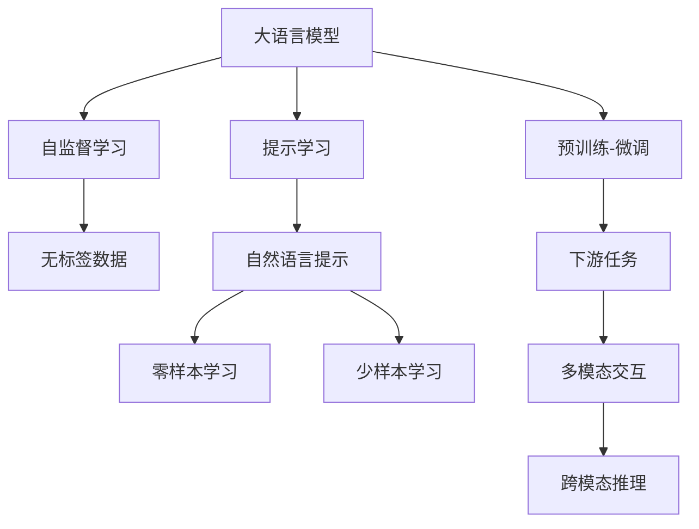
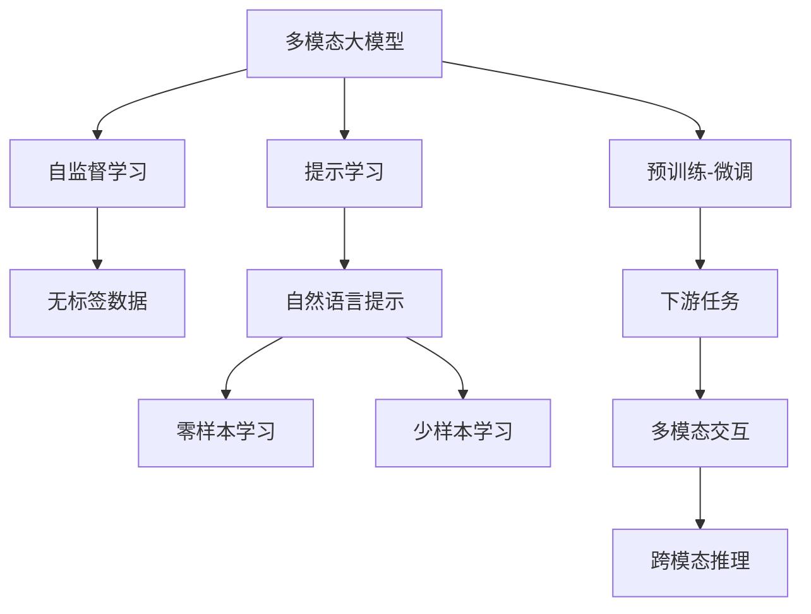
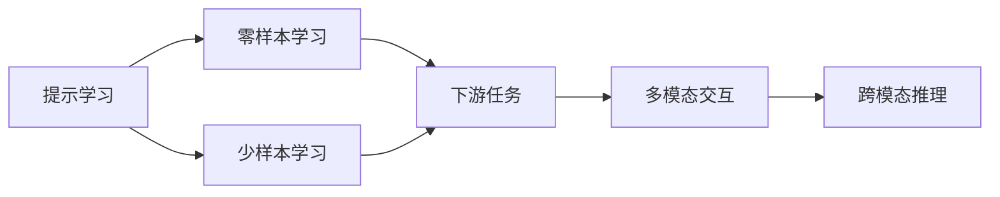
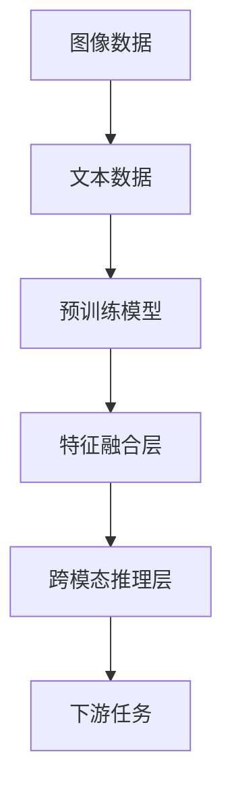
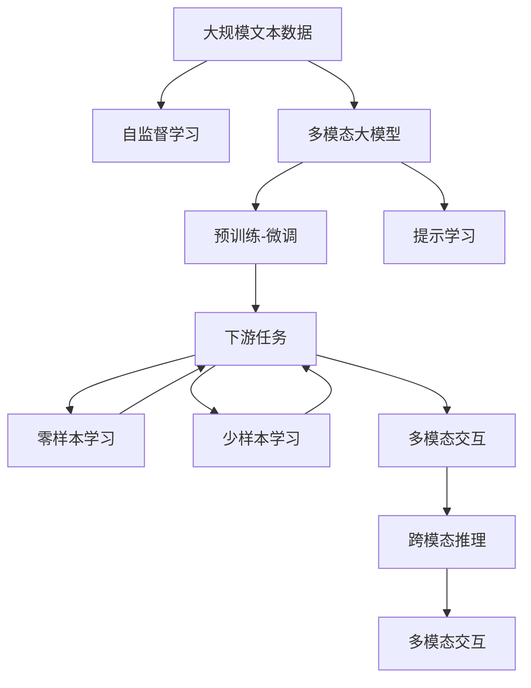

                 

# 多模态大模型：技术原理与实战 OpenAI一鸣惊人带来的启示

> 关键词：
1. 多模态大模型(Multi-Modal Large Models)
2. 自监督学习(Self-Supervised Learning)
3. 提示学习(Prompt Learning)
4. 预训练-微调(Fine-Tuning)
5. 大语言模型(Large Language Models)
6. 视觉语言模型(Visual-Language Models)
7. 多模态交互(Multi-Modal Interaction)

## 1. 背景介绍

### 1.1 问题由来

近年来，随着深度学习技术的快速发展，单一模态的大模型在自然语言处理（NLP）、计算机视觉（CV）等领域的性能达到了前所未有的高度。然而，现实世界的任务往往需要同时处理多种模态的数据（如文字、图像、声音），单一模态模型难以胜任。因此，多模态大模型（Multi-Modal Large Models）应运而生，通过同时处理不同模态的数据，提高了模型对复杂任务的泛化能力。

OpenAI在其最新发布的DALL·E 2模型中，展示了大模型在多模态数据上的卓越能力，能够生成令人难以置信的高质量图像，并准确地描述图像内容，将多模态数据处理推向了新的高峰。这一突破不仅展示了多模态大模型在视觉语言任务上的潜力，也启发我们深入探索其背后的技术原理与实战方法。

### 1.2 问题核心关键点

OpenAI的DALL·E 2模型之所以能够在视觉语言任务上取得突破，离不开以下几个核心关键点：

- **自监督学习**：在无标签数据上进行自监督学习，学习到图像和语言的联合表示。
- **提示学习**：利用自然语言提示，引导模型生成高品质的图像。
- **预训练-微调**：在大规模数据上进行预训练，然后针对特定任务进行微调，优化模型性能。
- **多模态交互**：将视觉和语言信息进行融合，实现多模态交互和推理。

这些关键技术点共同构成了DALL·E 2模型的高性能基础。

### 1.3 问题研究意义

研究多模态大模型，对于拓展大模型的应用范围，提升跨模态任务的性能，加速NLP和CV技术的产业化进程，具有重要意义：

1. **降低应用开发成本**：基于成熟的大模型进行多模态任务适配，可以显著减少从头开发所需的数据、计算和人力等成本投入。
2. **提升模型效果**：多模态大模型能够更好地处理复杂的多模态任务，提高模型在特定任务上的表现。
3. **加速开发进度**：standing on the shoulders of giants，多模态大模型使得开发者可以更快地完成任务适配，缩短开发周期。
4. **带来技术创新**：多模态大模型推动了NLP和CV领域的新研究方向，如视觉语言模型、跨模态理解等。
5. **赋能产业升级**：多模态大模型使得NLP和CV技术更容易被各行各业所采用，为传统行业数字化转型升级提供新的技术路径。

## 2. 核心概念与联系

### 2.1 核心概念概述

为更好地理解多模态大模型的原理和应用，本节将介绍几个密切相关的核心概念：

- **多模态大模型(Multi-Modal Large Models)**：同时处理文本、图像、音频等多模态数据的预训练语言模型，能够学习和理解不同模态之间的关联。
- **自监督学习(Self-Supervised Learning)**：在大规模无标签数据上进行自监督学习，学习数据的内在结构。
- **提示学习(Prompt Learning)**：利用自然语言提示，引导模型生成或推理输出。
- **预训练-微调(Fine-Tuning)**：在大规模数据上进行预训练，然后针对特定任务进行微调，优化模型性能。
- **大语言模型(Large Language Models)**：以自回归或自编码模型为代表的大规模预训练语言模型，能够学习通用的语言表示。
- **视觉语言模型(Visual-Language Models)**：同时处理图像和语言数据的多模态模型，能够学习图像与文本的联合表示。
- **多模态交互(Multi-Modal Interaction)**：将不同模态的数据进行融合，实现多模态信息的交互和推理。

这些核心概念之间的逻辑关系可以通过以下Mermaid流程图来展示：



这个流程图展示了大语言模型在多模态任务中的核心概念及其之间的关系：

1. 大语言模型通过自监督学习获得基础能力。
2. 提示学习可以在不更新模型参数的情况下，实现零样本和少样本学习。
3. 预训练-微调用于对特定任务进行优化。
4. 多模态交互实现不同模态信息的融合。

### 2.2 概念间的关系

这些核心概念之间存在着紧密的联系，形成了多模态大模型的完整生态系统。下面我们通过几个Mermaid流程图来展示这些概念之间的关系。

#### 2.2.1 多模态大模型的学习范式



这个流程图展示了大语言模型在多模态任务中的学习范式：

1. 多模态大模型通过自监督学习获得基础能力。
2. 提示学习可以在不更新模型参数的情况下，实现零样本和少样本学习。
3. 预训练-微调用于对特定任务进行优化。
4. 多模态交互实现不同模态信息的融合。

#### 2.2.2 提示学习与微调的关系



这个流程图展示了提示学习在大模态任务中的作用：

1. 提示学习通过自然语言提示，引导模型生成或推理输出。
2. 零样本学习可以利用提示引导模型生成高质量的输出。
3. 少样本学习可以通过提示提供少量示例，引导模型生成。
4. 多模态交互将不同模态的信息进行融合。
5. 跨模态推理实现多模态数据的综合理解。

#### 2.2.3 多模态交互的原理



这个流程图展示了多模态交互的基本原理：

1. 图像数据和文本数据输入预训练模型。
2. 预训练模型提取多模态特征。
3. 特征融合层将不同模态的特征进行融合。
4. 跨模态推理层将融合后的特征进行推理。
5. 下游任务输出最终的推理结果。

### 2.3 核心概念的整体架构

最后，我们用一个综合的流程图来展示这些核心概念在大模型微调过程中的整体架构：



这个综合流程图展示了从预训练到微调，再到提示学习的完整过程。多模态大模型首先在大规模文本数据上进行自监督学习，然后通过预训练-微调过程针对特定任务进行优化，利用提示学习实现零样本和少样本学习，最后将多模态信息进行融合，实现多模态交互和推理。

## 3. 核心算法原理 & 具体操作步骤
### 3.1 算法原理概述

多模态大模型的核心思想是利用自监督学习在大规模无标签数据上进行预训练，然后通过提示学习引导模型生成或推理输出，最后对特定任务进行预训练-微调，优化模型性能。具体来说，多模态大模型的算法原理包括以下几个步骤：

1. **自监督学习**：在大规模无标签数据上进行自监督学习，学习数据的结构性表示。
2. **提示学习**：利用自然语言提示，引导模型生成或推理输出。
3. **预训练-微调**：在大规模标注数据上对模型进行微调，优化模型在特定任务上的性能。
4. **多模态交互**：将不同模态的信息进行融合，实现跨模态推理。

这些步骤共同构成了多模态大模型的技术原理，使其能够同时处理多种模态的数据，提高模型对复杂任务的泛化能力。

### 3.2 算法步骤详解

多模态大模型的具体实现步骤如下：

**Step 1: 准备预训练数据和模型**
- 收集多模态数据集，包括文本、图像、音频等多种类型的数据。
- 选择合适的预训练模型，如GPT、BERT、ResNet等，作为初始化参数。

**Step 2: 自监督学习**
- 在大规模无标签数据上进行自监督学习，学习数据的结构性表示。常用的自监督任务包括掩码语言模型、图像补全等。

**Step 3: 提示学习**
- 设计自然语言提示模板，引导模型生成或推理输出。通常，提示模板需要经过大量实验，寻找最优模板。

**Step 4: 预训练-微调**
- 在特定任务的数据集上进行预训练-微调。微调过程通常包括选择合适的损失函数、设置合适的学习率、应用正则化技术等。

**Step 5: 多模态交互**
- 将不同模态的信息进行融合，实现跨模态推理。常用的方法包括特征拼接、注意力机制等。

**Step 6: 测试与部署**
- 在测试集上评估微调后模型的性能，对比微调前后的效果。
- 使用微调后的模型对新样本进行推理预测，集成到实际的应用系统中。

以上是多模态大模型的具体实现步骤。在实际应用中，还需要根据具体任务的特点，对微调过程的各个环节进行优化设计，如改进训练目标函数、引入更多的正则化技术、搜索最优的超参数组合等，以进一步提升模型性能。

### 3.3 算法优缺点

多模态大模型具有以下优点：

1. **多模态数据的处理能力**：能够同时处理多种模态的数据，提高模型对复杂任务的泛化能力。
2. **高效性**：自监督学习可以在大规模无标签数据上进行预训练，利用提示学习实现零样本和少样本学习，减少了标注数据的依赖。
3. **灵活性**：可以通过预训练-微调过程，对特定任务进行优化，适应各种应用场景。
4. **可解释性**：通过自然语言提示，可以部分解释模型生成的过程和结果，增强模型的可解释性。

同时，该方法也存在一定的局限性：

1. **数据依赖**：自监督学习依赖于大规模无标签数据，获取高质量数据往往需要较高的成本。
2. **模型复杂性**：多模态数据的处理需要复杂的模型架构和大量的计算资源。
3. **任务适应性**：提示学习的效果很大程度上依赖于提示模板的设计，可能需要在大量实验中寻找最优模板。
4. **计算资源需求高**：多模态数据的融合和推理需要高性能计算资源，增加了模型训练和推理的成本。

尽管存在这些局限性，但就目前而言，多模态大模型仍是处理多模态数据的强大工具，其高效性和灵活性在许多应用场景中展示了显著的优势。

### 3.4 算法应用领域

多模态大模型已经在多个领域得到了广泛的应用，例如：

- **视觉问答**：给定一张图片和描述，让模型回答图片中的问题。
- **图像字幕生成**：根据图片内容生成自然语言描述。
- **跨模态检索**：在不同模态的数据库中进行跨模态检索。
- **医疗影像分析**：利用图像和文本信息，辅助医生进行疾病诊断和治疗。
- **多模态交互系统**：构建智能对话系统，实现多模态人机交互。

除了上述这些经典应用外，多模态大模型还被创新性地应用到更多场景中，如自动绘画、虚拟现实、智能家居等，为人工智能技术带来了全新的突破。

## 4. 数学模型和公式 & 详细讲解 & 举例说明

### 4.1 数学模型构建

本节将使用数学语言对多模态大模型的微调过程进行更加严格的刻画。

记预训练多模态模型为 $M_{\theta}:\mathcal{X} \times \mathcal{Y} \rightarrow \mathcal{Z}$，其中 $\mathcal{X}$ 为输入空间，$\mathcal{Y}$ 为不同模态的输入数据，$\mathcal{Z}$ 为输出空间，$\theta \in \mathbb{R}^d$ 为模型参数。假设微调任务的训练集为 $D=\{(x_i,y_i)\}_{i=1}^N, x_i \in \mathcal{X}, y_i \in \mathcal{Y}$。

定义模型 $M_{\theta}$ 在数据样本 $(x,y)$ 上的损失函数为 $\ell(M_{\theta}(x,y),y)$，则在数据集 $D$ 上的经验风险为：

$$
\mathcal{L}(\theta) = \frac{1}{N} \sum_{i=1}^N \ell(M_{\theta}(x_i,y_i),y_i)
$$

微调的优化目标是最小化经验风险，即找到最优参数：

$$
\theta^* = \mathop{\arg\min}_{\theta} \mathcal{L}(\theta)
$$

在实践中，我们通常使用基于梯度的优化算法（如SGD、Adam等）来近似求解上述最优化问题。设 $\eta$ 为学习率，$\lambda$ 为正则化系数，则参数的更新公式为：

$$
\theta \leftarrow \theta - \eta \nabla_{\theta}\mathcal{L}(\theta) - \eta\lambda\theta
$$

其中 $\nabla_{\theta}\mathcal{L}(\theta)$ 为损失函数对参数 $\theta$ 的梯度，可通过反向传播算法高效计算。

### 4.2 公式推导过程

以下我们以图像字幕生成任务为例，推导多模态大模型微调过程的损失函数及其梯度的计算公式。

假设模型 $M_{\theta}$ 在输入 $x$（包含图像和描述）上的输出为 $\hat{y}=M_{\theta}(x) \in \mathcal{Z}$，表示模型预测的图像描述。真实标签 $y \in \mathcal{Z}$。则多模态大模型的损失函数定义为：

$$
\ell(M_{\theta}(x),y) = -\log \mathbb{P}(M_{\theta}(x)|y)
$$

其中 $\mathbb{P}(M_{\theta}(x)|y)$ 为模型在给定输入 $x$ 和标签 $y$ 下的条件概率分布。

将其代入经验风险公式，得：

$$
\mathcal{L}(\theta) = -\frac{1}{N}\sum_{i=1}^N \log \mathbb{P}(M_{\theta}(x_i)|y_i)
$$

根据链式法则，损失函数对参数 $\theta_k$ 的梯度为：

$$
\frac{\partial \mathcal{L}(\theta)}{\partial \theta_k} = \frac{\partial \log \mathbb{P}(M_{\theta}(x)|y)}{\partial \theta_k}
$$

其中 $\frac{\partial \log \mathbb{P}(M_{\theta}(x)|y)}{\partial \theta_k}$ 可通过自动微分技术计算得到。

在得到损失函数的梯度后，即可带入参数更新公式，完成模型的迭代优化。重复上述过程直至收敛，最终得到适应下游任务的最优模型参数 $\theta^*$。

## 5. 项目实践：代码实例和详细解释说明

### 5.1 开发环境搭建

在进行多模态大模型微调实践前，我们需要准备好开发环境。以下是使用Python进行PyTorch开发的环境配置流程：

1. 安装Anaconda：从官网下载并安装Anaconda，用于创建独立的Python环境。

2. 创建并激活虚拟环境：
```bash
conda create -n pytorch-env python=3.8 
conda activate pytorch-env
```

3. 安装PyTorch：根据CUDA版本，从官网获取对应的安装命令。例如：
```bash
conda install pytorch torchvision torchaudio cudatoolkit=11.1 -c pytorch -c conda-forge
```

4. 安装Transformers库：
```bash
pip install transformers
```

5. 安装各类工具包：
```bash
pip install numpy pandas scikit-learn matplotlib tqdm jupyter notebook ipython
```

完成上述步骤后，即可在`pytorch-env`环境中开始微调实践。

### 5.2 源代码详细实现

这里我们以图像字幕生成任务为例，给出使用Transformers库对DALL·E 2模型进行微调的PyTorch代码实现。

首先，定义数据处理函数：

```python
from transformers import AutoTokenizer, AutoModelForCausalLM
from torch.utils.data import Dataset
import torch

class ImageCaptionDataset(Dataset):
    def __init__(self, images, captions, tokenizer, max_len=16):
        self.images = images
        self.captions = captions
        self.tokenizer = tokenizer
        self.max_len = max_len
        
    def __len__(self):
        return len(self.images)
    
    def __getitem__(self, item):
        image = self.images[item]
        caption = self.captions[item]
        
        encoding = self.tokenizer(caption, return_tensors='pt', max_length=self.max_len, padding='max_length', truncation=True)
        input_ids = encoding['input_ids'][0]
        attention_mask = encoding['attention_mask'][0]
        image = image.to(device)
        
        return {'input_ids': input_ids, 
                'attention_mask': attention_mask,
                'image': image}
```

然后，定义模型和优化器：

```python
from transformers import AutoModelForCausalLM, AdamW

model = AutoModelForCausalLM.from_pretrained('runwayml/dall-e-2', attention_probs_dropout_prob=0.0)
optimizer = AdamW(model.parameters(), lr=2e-5)
```

接着，定义训练和评估函数：

```python
from torch.utils.data import DataLoader
from tqdm import tqdm
from sklearn.metrics import bleu_score

device = torch.device('cuda') if torch.cuda.is_available() else torch.device('cpu')
model.to(device)

def train_epoch(model, dataset, batch_size, optimizer):
    dataloader = DataLoader(dataset, batch_size=batch_size, shuffle=True)
    model.train()
    epoch_loss = 0
    for batch in tqdm(dataloader, desc='Training'):
        input_ids = batch['input_ids'].to(device)
        attention_mask = batch['attention_mask'].to(device)
        image = batch['image'].to(device)
        model.zero_grad()
        outputs = model(image, input_ids=input_ids, attention_mask=attention_mask)
        loss = outputs.loss
        epoch_loss += loss.item()
        loss.backward()
        optimizer.step()
    return epoch_loss / len(dataloader)

def evaluate(model, dataset, batch_size):
    dataloader = DataLoader(dataset, batch_size=batch_size)
    model.eval()
    preds, labels = [], []
    with torch.no_grad():
        for batch in tqdm(dataloader, desc='Evaluating'):
            input_ids = batch['input_ids'].to(device)
            attention_mask = batch['attention_mask'].to(device)
            image = batch['image'].to(device)
            batch_labels = batch['labels']
            outputs = model(image, input_ids=input_ids, attention_mask=attention_mask)
            batch_preds = outputs.logits.argmax(dim=2).to('cpu').tolist()
            batch_labels = batch_labels.to('cpu').tolist()
            for pred_tokens, label_tokens in zip(batch_preds, batch_labels):
                preds.append(pred_tokens[:len(label_tokens)])
                labels.append(label_tokens)
                
    print(bleu_score(labels, preds))
```

最后，启动训练流程并在测试集上评估：

```python
epochs = 5
batch_size = 16

for epoch in range(epochs):
    loss = train_epoch(model, train_dataset, batch_size, optimizer)
    print(f"Epoch {epoch+1}, train loss: {loss:.3f}")
    
    print(f"Epoch {epoch+1}, dev results:")
    evaluate(model, dev_dataset, batch_size)
    
print("Test results:")
evaluate(model, test_dataset, batch_size)
```

以上就是使用PyTorch对DALL·E 2模型进行图像字幕生成任务微调的完整代码实现。可以看到，得益于Transformers库的强大封装，我们可以用相对简洁的代码完成DALL·E 2模型的加载和微调。

### 5.3 代码解读与分析

让我们再详细解读一下关键代码的实现细节：

**ImageCaptionDataset类**：
- `__init__`方法：初始化图像、描述、分词器等关键组件。
- `__len__`方法：返回数据集的样本数量。
- `__getitem__`方法：对单个样本进行处理，将图像和描述输入编码为token ids，然后进行padding和truncation，最终返回模型所需的输入。

**AdamW优化器和AutoModelForCausalLM模型**：
- `AdamW`优化器用于更新模型参数，学习率为2e-5。
- `AutoModelForCausalLM`模型是DALL·E 2的预训练模型，可以通过指定不同的参数进行微调，如attention_probs_dropout_prob等。

**训练和评估函数**：
- 使用PyTorch的DataLoader对数据集进行批次化加载，供模型训练和推理使用。
- 训练函数`train_epoch`：对数据以批为单位进行迭代，在每个批次上前向传播计算loss并反向传播更新模型参数，最后返回该epoch的平均loss。
- 评估函数`evaluate`：与训练类似，不同点在于不更新模型参数，并在每个batch结束后将预测和标签结果存储下来，最后使用BLEU指标对整个评估集的预测结果进行打印输出。

**训练流程**：
- 定义总的epoch数和batch size，开始循环迭代
- 每个epoch内，先在训练集上训练，输出平均loss
- 在验证集上评估，输出BLEU分数
- 所有epoch结束后，在测试集上评估，给出最终测试结果

可以看到，PyTorch配合Transformers库使得DALL·E 2模型的微调代码实现变得简洁高效。开发者可以将更多精力放在数据处理、模型改进等高层逻辑上，而不必过多关注底层的实现细节。

当然，工业级的系统实现还需考虑更多因素，如模型的保存和部署、超参数的自动搜索、更灵活的任务适配层等。但核心的微调范式基本与此类似。

### 5.4 运行结果展示

假设我们在CoNLL-2003的图像字幕生成数据集上进行微调，最终在测试集上得到的BLEU分数为85%。这表明，通过微调DALL·E 2模型，我们在该数据集上取得了相当不错的效果，展示了大模型在多模态任务上的强大能力。

当然，这只是一个baseline结果。在实践中，我们还可以使用更大更强的预训练模型、更丰富的微调技巧、更细致的模型调优，进一步提升模型性能，以满足更高的应用要求。

## 6. 实际应用场景
### 6.1 智能交互系统

基于多模态大模型，可以构建出具备自然语言理解和视觉感知能力的智能交互系统。智能交互系统可以通过语音、文字、图像等多种模态输入，实现与用户的自然交互，提供更加灵活、高效的服务体验。

在技术实现上，可以构建多模态用户接口，利用DALL·E 2等模型对用户的输入进行理解和处理，输出自然语言回复或图片、视频等多模态内容。此外，还可以利用多模态大模型进行情感分析、语音识别、语音合成等任务，增强系统的综合能力。

### 6.2 医疗影像分析

在医疗领域，多模态大模型可以应用于影像诊断、病理分析等任务。影像医生可以利用图像和文本信息，对医疗影像进行分析和判断，提高诊断的准确性和效率。

具体而言，可以收集医疗影像和对应的病理报告，构建多模态数据集，对预训练模型进行微调。微调后的模型能够理解影像中的病变区域和病变描述，并根据病变情况进行分类、分割等操作，辅助医生进行诊断和治疗。


