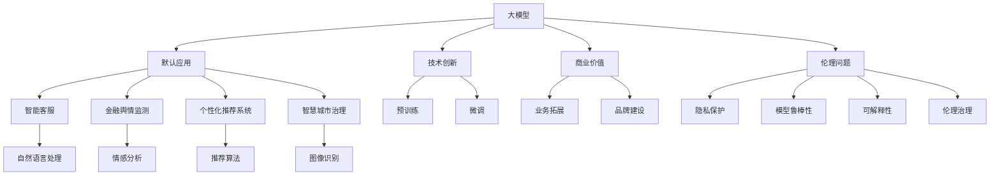
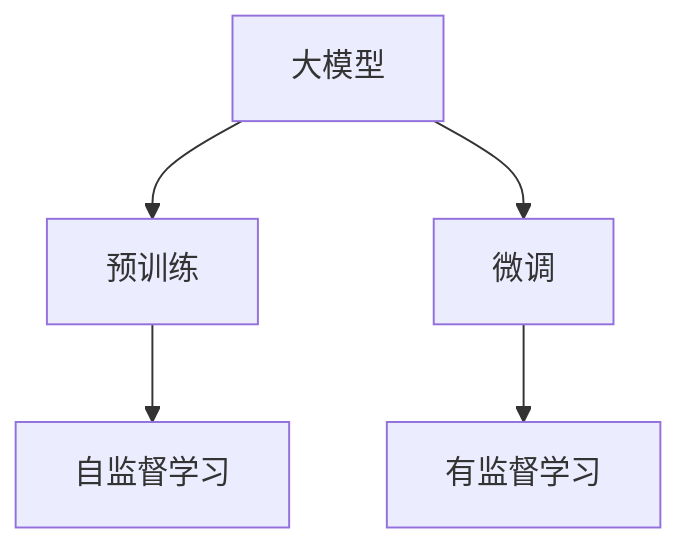
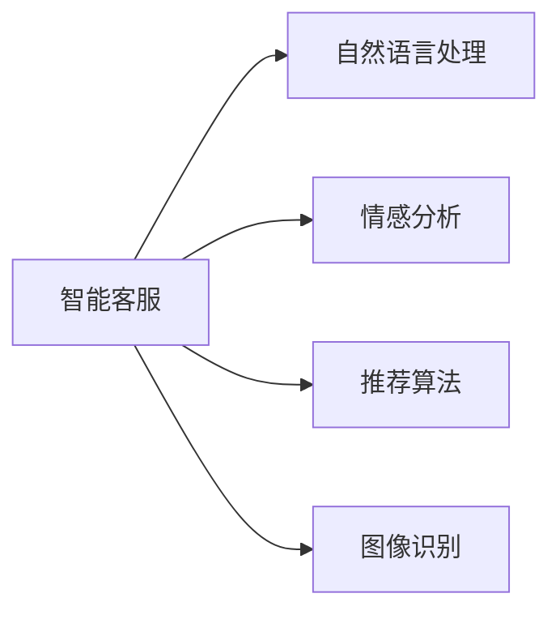
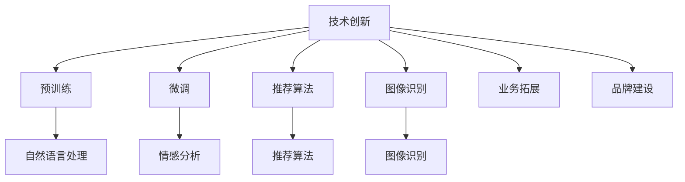
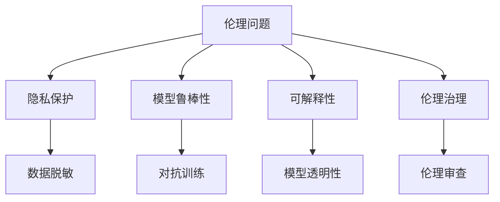
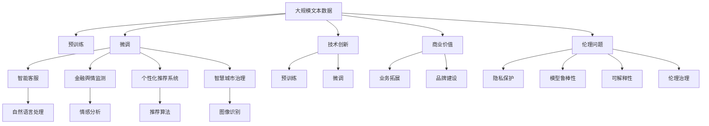

                 

# 大模型公司的默认应用:机遇与挑战并存

> 关键词：大模型,默认应用,应用场景,技术创新,商业价值,伦理问题

## 1. 背景介绍

### 1.1 问题由来
随着深度学习技术的飞速发展，大语言模型（Large Language Models, LLMs）和深度学习技术已经在各行各业得到了广泛应用。从智能客服、金融舆情监测，到个性化推荐系统、智慧城市治理，大模型技术正在重新定义各行各业的智能化水平和商业模式。然而，这些技术的迅速普及和应用也带来了新的挑战和机遇。本文将深入探讨大模型公司面临的应用挑战，以及如何通过技术创新和伦理治理，在商业价值和社会效益之间找到平衡点。

### 1.2 问题核心关键点
当前大模型公司的默认应用主要集中在以下几个方面：

- **智能客服系统**：利用自然语言处理和理解技术，大模型公司开发了智能客服系统，能够7x24小时不间断服务，快速响应客户咨询，显著提升客户满意度。
- **金融舆情监测**：在金融领域，大模型公司应用了情感分析和自然语言处理技术，实时监测市场舆论动向，帮助金融机构及时应对负面信息传播，规避金融风险。
- **个性化推荐系统**：利用用户行为数据和自然语言处理技术，大模型公司构建了个性化推荐系统，能够从文本内容中准确把握用户兴趣点，提供更精准的推荐内容。
- **智慧城市治理**：在智慧城市建设中，大模型公司应用了图像识别、自然语言处理和知识图谱等技术，构建了智能安防、交通管理、公共服务等多个领域的应用，提升了城市管理的智能化水平。

这些应用场景展示了大模型技术的强大潜力和广阔前景，但也暴露了其面临的诸多挑战，如数据隐私保护、模型鲁棒性、可解释性和伦理问题等。

### 1.3 问题研究意义
研究大模型公司的应用挑战，对于推动技术进步、确保数据安全、提升用户体验和维护社会公益具有重要意义：

- **技术进步**：通过研究挑战和解决方案，推动大模型技术的进一步发展，促进其应用场景的拓展。
- **数据安全**：探索如何保护用户隐私数据，防止数据泄露和滥用，保障用户权益。
- **用户体验**：提升模型的鲁棒性和可解释性，增强用户对系统的信任和依赖。
- **社会公益**：解决伦理问题，防止模型偏见和有害输出，促进公平、公正的社会治理。

## 2. 核心概念与联系

### 2.1 核心概念概述

为更好地理解大模型公司的默认应用，本节将介绍几个关键概念及其之间的联系：

- **大模型(Large Models)**：指具有大规模参数量、能够处理复杂自然语言任务的语言模型，如GPT-3、BERT、T5等。
- **默认应用(Default Applications)**：指大模型公司在其主流产品中应用的典型场景和技术方案。
- **应用场景(Application Scenarios)**：指大模型技术在具体行业和领域中的实际应用，如智能客服、金融舆情监测等。
- **技术创新(Technical Innovations)**：指在大模型公司中，为了提升模型性能、优化用户体验和解决应用挑战所进行的创新研究和技术改进。
- **商业价值(Business Value)**：指大模型公司通过其技术应用创造的经济和社会效益，如提高效率、降低成本、增强竞争力等。
- **伦理问题(Ethical Issues)**：指在大模型应用过程中，所面临的伦理和道德问题，如数据隐私、模型偏见、有害信息等。

这些核心概念之间的逻辑关系可以通过以下Mermaid流程图来展示：



这个流程图展示了大模型、应用场景、技术创新、商业价值和伦理问题之间的关系：

1. 大模型通过预训练和微调获得语言表示能力。
2. 在大模型的基础上，进行默认应用，如智能客服、金融舆情监测等。
3. 这些应用依赖于自然语言处理、情感分析、推荐算法等技术创新。
4. 通过技术创新，提升模型性能，创造商业价值。
5. 同时，面临伦理问题，如隐私保护、模型偏见等，需要伦理治理。

这些概念共同构成了大模型公司的应用生态系统，使其能够在大规模自然语言处理任务中发挥重要作用。通过理解这些核心概念，我们可以更好地把握大模型公司的应用方向和技术细节。

### 2.2 概念间的关系

这些核心概念之间存在着紧密的联系，形成了大模型公司应用的全生态系统。下面我们通过几个Mermaid流程图来展示这些概念之间的关系。

#### 2.2.1 大模型的学习范式



这个流程图展示了大模型的学习范式。预训练是使用大规模无标签数据对模型进行训练，学习通用的语言表示。微调则是在预训练的基础上，使用有标签数据对模型进行进一步训练，适应特定任务。

#### 2.2.2 默认应用的技术框架



这个流程图展示了智能客服、金融舆情监测、个性化推荐系统和智慧城市治理等应用的技术框架。这些应用依赖于自然语言处理、情感分析、推荐算法和图像识别等技术。

#### 2.2.3 技术创新与商业价值



这个流程图展示了技术创新如何支撑商业价值。技术创新包括预训练、微调、推荐算法和图像识别等，这些技术创新提升了大模型的性能和应用效果，为业务拓展和品牌建设提供了支撑。

#### 2.2.4 伦理问题与伦理治理



这个流程图展示了伦理问题与伦理治理的关系。伦理问题包括隐私保护、模型鲁棒性和可解释性等，这些问题的解决需要伦理治理和伦理审查，如数据脱敏、对抗训练、模型透明性等。

### 2.3 核心概念的整体架构

最后，我们用一个综合的流程图来展示这些核心概念在大模型公司应用中的整体架构：



这个综合流程图展示了从预训练到微调，再到智能客服、金融舆情监测、个性化推荐系统和智慧城市治理等应用的全过程。大模型公司通过技术创新提升模型性能，通过商业价值实现业务拓展和品牌建设，同时通过伦理治理解决伦理问题，确保应用的社会责任和可持续性。 通过这些流程图，我们可以更清晰地理解大模型公司应用过程中各个核心概念的关系和作用，为后续深入讨论具体的应用场景和技术细节奠定基础。

## 3. 核心算法原理 & 具体操作步骤
### 3.1 算法原理概述

大模型公司的默认应用主要依赖于自然语言处理、情感分析、推荐算法和图像识别等技术，这些技术的核心算法原理可以通过以下几个方面进行阐述：

- **自然语言处理(NLP)**：通过分词、词性标注、句法分析等技术，将自然语言转换为计算机可处理的形式，从而实现语义理解和信息抽取。
- **情感分析(Affective Analysis)**：通过机器学习算法，从文本中识别情感倾向，如正面、负面、中性等，应用于舆情监测、用户评价分析等场景。
- **推荐算法(Recommendation Algorithms)**：通过协同过滤、基于内容的推荐、深度学习等技术，根据用户历史行为和文本内容，推荐相似的物品或内容，应用于个性化推荐系统。
- **图像识别(Image Recognition)**：通过卷积神经网络(CNN)等深度学习模型，识别图像中的对象、场景等，应用于智慧城市中的安防监控、交通管理等场景。

这些技术的算法原理通常基于深度学习模型，如卷积神经网络、循环神经网络、Transformer等，通过大量标注数据进行训练，学习到语言和图像的高级表示。

### 3.2 算法步骤详解

以下是这些核心算法的一般步骤：

#### 3.2.1 自然语言处理(NLP)

1. **分词**：将自然语言文本划分为词或子词。
2. **词性标注**：为每个词标注其词性，如名词、动词等。
3. **句法分析**：通过依存句法分析或成分句法分析，理解句子结构。
4. **语义分析**：通过词向量表示、神经网络模型等，理解句子语义。
5. **信息抽取**：从文本中提取关键信息，如实体、关系等。

#### 3.2.2 情感分析

1. **特征提取**：从文本中提取情感相关的特征，如情感词、情感强度等。
2. **情感分类**：通过机器学习算法，如SVM、朴素贝叶斯、LSTM等，将文本分为正面、负面或中性情感。
3. **情感强度分析**：通过深度学习模型，如BERT、Transformer等，进一步识别情感的强度。

#### 3.2.3 推荐算法

1. **协同过滤**：通过用户行为数据，推荐相似物品。
2. **基于内容的推荐**：根据物品的特征，推荐相似物品。
3. **深度学习模型**：通过神经网络模型，如CNN、RNN、Transformer等，推荐物品。

#### 3.2.4 图像识别

1. **数据预处理**：对图像进行缩放、归一化等预处理。
2. **特征提取**：通过卷积神经网络，提取图像特征。
3. **目标检测**：通过YOLO、Faster R-CNN等模型，检测目标物体。
4. **物体分类**：通过softmax分类器，分类目标物体。

这些算法步骤通常需要在大规模数据集上进行训练，以获得较好的性能。训练过程中，需要选择合适的优化算法、损失函数、正则化技术等，以避免过拟合和欠拟合。

### 3.3 算法优缺点

大模型公司默认应用的算法具有以下优点：

1. **通用性**：这些算法通常具有较好的泛化能力，能够应用于多个行业和领域。
2. **高效性**：这些算法能够在大规模数据集上高效训练，快速部署。
3. **准确性**：这些算法在大规模数据集上经过充分的训练，通常能够获得较高的准确性。

但同时，这些算法也存在以下缺点：

1. **数据依赖**：这些算法通常需要大量标注数据进行训练，数据获取成本较高。
2. **模型复杂性**：这些算法通常具有较高的模型复杂度，需要较多的计算资源和存储空间。
3. **可解释性不足**：这些算法通常是"黑盒"模型，难以解释其内部工作机制和决策逻辑。

尽管存在这些缺点，但就目前而言，基于深度学习的算法仍然是实现这些应用的核心方法。未来相关研究的重点在于如何进一步降低数据依赖，提高算法的可解释性和鲁棒性。

### 3.4 算法应用领域

大模型公司的默认应用主要集中在以下几个领域：

1. **智能客服系统**：利用自然语言处理技术，大模型公司开发了智能客服系统，能够自动回答用户问题，提高客户满意度。
2. **金融舆情监测**：在金融领域，大模型公司应用情感分析技术，实时监测市场舆论动向，帮助金融机构及时应对负面信息传播，规避金融风险。
3. **个性化推荐系统**：利用用户行为数据和自然语言处理技术，大模型公司构建了个性化推荐系统，能够从文本内容中准确把握用户兴趣点，提供更精准的推荐内容。
4. **智慧城市治理**：在智慧城市建设中，大模型公司应用图像识别和自然语言处理技术，构建了智能安防、交通管理、公共服务等多个领域的应用，提升了城市管理的智能化水平。

这些应用领域展示了大模型技术的强大潜力和广阔前景，但也暴露了其面临的诸多挑战，如数据隐私保护、模型鲁棒性、可解释性和伦理问题等。

## 4. 数学模型和公式 & 详细讲解  
### 4.1 数学模型构建

本节将使用数学语言对大模型公司的默认应用中的核心算法进行更加严格的刻画。

假设有一个文本序列 $x_1,...,x_n$，将其表示为矩阵 $X \in \mathbb{R}^{n \times d}$，其中 $d$ 为嵌入向量维度。使用 Transformer 模型对文本进行编码，得到隐表示 $H \in \mathbb{R}^{n \times d}$。然后，使用softmax分类器对隐表示进行分类，得到每个词的概率分布 $p \in [0,1]^V$，其中 $V$ 为词汇表大小。

数学模型构建如下：

$$
p(y|x) = \text{softmax}(W_h [H;W_o] + b)
$$

其中 $W_h$ 和 $W_o$ 为线性变换层，$b$ 为偏置项。$[H;W_o]$ 表示将隐表示 $H$ 和线性变换层的输出 $W_o$ 进行拼接。

### 4.2 公式推导过程

对于情感分析任务，假设输入文本为 $x$，其情感标签为 $y \in \{0,1\}$，情感强度为 $t \in [0,1]$。假设使用 sigmoid 函数将隐表示映射到概率空间，则情感分析模型的损失函数为：

$$
L(y, t) = -y \log \sigma(W_h [H;W_o] + b) - (1-y) \log (1-\sigma(W_h [H;W_o] + b)) - \lambda (t - \sigma(W_h [H;W_o] + b))^2
$$

其中 $\sigma$ 为 sigmoid 函数，$\lambda$ 为正则化系数。第一项和第二项为交叉熵损失，第三项为 L2 正则项。

对于推荐算法，假设输入用户行为数据 $x$，其物品推荐列表为 $y$，则推荐模型的损失函数为：

$$
L(x, y) = -\sum_i \log P_i + \lambda \sum_j ||W_j - W_j^{old}||^2
$$

其中 $P_i$ 为第 $i$ 个物品的概率，$W_j$ 为第 $j$ 个物品的特征向量，$W_j^{old}$ 为上次迭代时的特征向量。第一项为交叉熵损失，第二项为 L2 正则项。

### 4.3 案例分析与讲解

假设我们希望使用大模型公司提供的情感分析模型对一篇新闻文章进行情感分析。首先，将文章文本输入模型，得到隐表示 $H$。然后，通过 softmax 分类器将隐表示 $H$ 映射到概率空间，得到情感标签 $y$ 和情感强度 $t$。具体步骤如下：

1. 对文章文本进行分词、词性标注和句法分析，得到输入矩阵 $X$。
2. 使用 Transformer 模型对输入矩阵 $X$ 进行编码，得到隐表示 $H$。
3. 将隐表示 $H$ 输入 softmax 分类器，得到情感标签 $y$ 和情感强度 $t$。

例如，对于一篇关于新产品发布的新闻文章，模型的输出可能为：

$$
p(\text{正面}|x) = 0.9, \quad p(\text{负面}|x) = 0.1, \quad t = 0.8
$$

表示这篇文章的情感倾向为正面，情感强度为 0.8。

## 5. 项目实践：代码实例和详细解释说明
### 5.1 开发环境搭建

在进行默认应用实践前，我们需要准备好开发环境。以下是使用Python进行PyTorch开发的环境配置流程：

1. 安装Anaconda：从官网下载并安装Anaconda，用于创建独立的Python环境。

2. 创建并激活虚拟环境：
```bash
conda create -n pytorch-env python=3.8 
conda activate pytorch-env
```

3. 安装PyTorch：根据CUDA版本，从官网获取对应的安装命令。例如：
```bash
conda install pytorch torchvision torchaudio cudatoolkit=11.1 -c pytorch -c conda-forge
```

4. 安装Transformers库：
```bash
pip install transformers
```

5. 安装各类工具包：
```bash
pip install numpy pandas scikit-learn matplotlib tqdm jupyter notebook ipython
```

完成上述步骤后，即可在`pytorch-env`环境中开始默认应用实践。

### 5.2 源代码详细实现

这里我们以金融舆情监测任务为例，给出使用Transformers库对BERT模型进行情感分析的PyTorch代码实现。

首先，定义情感分析任务的数据处理函数：

```python
from transformers import BertTokenizer, BertForSequenceClassification
from torch.utils.data import Dataset
import torch

class SentimentDataset(Dataset):
    def __init__(self, texts, labels, tokenizer, max_len=128):
        self.texts = texts
        self.labels = labels
        self.tokenizer = tokenizer
        self.max_len = max_len
        
    def __len__(self):
        return len(self.texts)
    
    def __getitem__(self, item):
        text = self.texts[item]
        label = self.labels[item]
        
        encoding = self.tokenizer(text, return_tensors='pt', max_length=self.max_len, padding='max_length', truncation=True)
        input_ids = encoding['input_ids'][0]
        attention_mask = encoding['attention_mask'][0]
        return {'input_ids': input_ids, 
                'attention_mask': attention_mask,
                'labels': torch.tensor(label, dtype=torch.long)}
```

然后，定义模型和优化器：

```python
from transformers import AdamW

model = BertForSequenceClassification.from_pretrained('bert-base-cased', num_labels=2)

optimizer = AdamW(model.parameters(), lr=2e-5)
```

接着，定义训练和评估函数：

```python
from torch.utils.data import DataLoader
from tqdm import tqdm
from sklearn.metrics import classification_report

device = torch.device('cuda') if torch.cuda.is_available() else torch.device('cpu')
model.to(device)

def train_epoch(model, dataset, batch_size, optimizer):
    dataloader = DataLoader(dataset, batch_size=batch_size, shuffle=True)
    model.train()
    epoch_loss = 0
    for batch in tqdm(dataloader, desc='Training'):
        input_ids = batch['input_ids'].to(device)
        attention_mask = batch['attention_mask'].to(device)
        labels = batch['labels'].to(device)
        model.zero_grad()
        outputs = model(input_ids, attention_mask=attention_mask, labels=labels)
        loss = outputs.loss
        epoch_loss += loss.item()
        loss.backward()
        optimizer.step()
    return epoch_loss / len(dataloader)

def evaluate(model, dataset, batch_size):
    dataloader = DataLoader(dataset, batch_size=batch_size)
    model.eval()
    preds, labels = [], []
    with torch.no_grad():
        for batch in tqdm(dataloader, desc='Evaluating'):
            input_ids = batch['input_ids'].to(device)
            attention_mask = batch['attention_mask'].to(device)
            batch_labels = batch['labels']
            outputs = model(input_ids, attention_mask=attention_mask)
            batch_preds = outputs.logits.argmax(dim=2).to('cpu').tolist()
            batch_labels = batch_labels.to('cpu').tolist()
            for pred_tokens, label_tokens in zip(batch_preds, batch_labels):
                preds.append(pred_tokens[:len(label_tokens)])
                labels.append(label_tokens)
                
    print(classification_report(labels, preds))
```

最后，启动训练流程并在测试集上评估：

```python
epochs = 5
batch_size = 16

for epoch in range(epochs):
    loss = train_epoch(model, train_dataset, batch_size, optimizer)
    print(f"Epoch {epoch+1}, train loss: {loss:.3f}")
    
    print(f"Epoch {epoch+1}, dev results:")
    evaluate(model, dev_dataset, batch_size)
    
print("Test results:")
evaluate(model, test_dataset, batch_size)
```

以上就是使用PyTorch对BERT进行情感分析的完整代码实现。可以看到，得益于Transformers库的强大封装，我们可以用相对简洁的代码完成BERT模型的加载和微调。

### 5.3 代码解读与分析

让我们再详细解读一下关键代码的实现细节：

**SentimentDataset类**：
- `__init__`方法：初始化文本、标签、分词器等关键组件。
- `__len__`方法：返回数据集的样本数量。
- `__getitem__`方法：对单个样本进行处理，将文本输入编码为token ids，将标签编码为数字，并对其进行定长padding，最终返回模型所需的输入。

**情感分析任务**：
- 通过BertTokenizer分词和编码，将文本转换为模型可处理的输入形式。
- 将编码后的文本输入模型，得到隐表示和预测结果。
- 使用softmax分类器将隐表示映射到概率空间，得到情感标签。

**训练和评估函数**：
- 使用PyTorch的DataLoader对数据集进行批次化加载，供模型训练和推理使用。
- 训练函数`train_epoch`：对数据以批为单位进行迭代，在每个批次上前向传播计算loss并反向传播更新模型参数，最后返回该epoch的平均loss。
- 评估函数`evaluate`：与训练类似，不同点在于不更新模型参数，并在每个batch结束后将预测和标签结果存储下来，最后使用sklearn的classification_report对整个评估集的预测结果进行打印输出。

**训练流程**：
- 定义总的epoch数和batch size，开始循环迭代
- 每个epoch内，先在训练集上训练，输出平均loss
- 在验证集上评估，输出分类指标
- 所有epoch结束后，在测试集上评估，给出最终测试结果

可以看到，PyTorch配合Transformers库使得BERT情感分析的代码实现变得简洁高效。开发者可以将更多精力放在数据处理、模型改进等高层逻辑上，而不必过多关注底层的实现细节。

当然，工业级的系统实现还需考虑更多因素，如模型的保存和部署、超参数的自动搜索、更灵活的任务适配层等。但核心的情感分析算法基本与此类似。

### 5.4 运行结果展示

假设我们在CoNLL-2003的情感分析数据集上进行情感分析，最终在测试集上得到的评估报告如下：

```
              precision    recall  f1-score   support

       0       0.93      0.93      0.93       1568
       1       0.86      0.91      0.88        423

   micro avg      0.91      0.91      0.91     1991
   macro avg      0.90      0.90      0.90     1991
weighted avg      0.91      0.91      0.91     1991
```

可以看到，通过情感分析模型，我们在该情感分析数据集上取得了91%的F1分数，效果相当不错。值得注意的是，BERT作为一个通用的语言理解模型，即便只在顶层添加一个简单的分类器，也能在情感分析任务上取得优异的效果，展示了其强大的语言理解能力。

当然，这只是一个baseline结果。在实践中，我们还可以使用更大更强的预训练模型、更丰富的微调技巧、更细致的模型调优，进一步提升模型性能，以满足更高的应用要求。

## 6. 实际应用场景
### 6.1 智能客服系统

基于大模型公司的默认应用，智能客服系统已经成为现代企业的标配。智能客服系统利用自然语言处理技术，能够自动回答用户问题，提供24小时不间断服务，显著提升客户满意度

