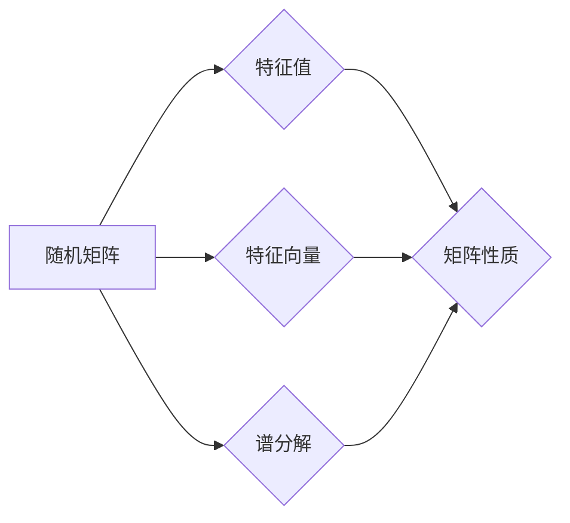

# 矩阵理论与应用：双随机矩阵

> 关键词：矩阵理论，双随机矩阵，随机矩阵理论，矩阵分析，应用领域，数学模型，算法，数值计算

## 1. 背景介绍

矩阵理论作为数学的一个分支，已经在物理学、工程学、经济学、统计学等多个领域得到了广泛的应用。在过去的几十年里，随着计算能力的提升和数学理论的深入，随机矩阵理论逐渐成为矩阵理论的一个重要分支，研究随机矩阵的性质和应用成为了一个热点。本文将重点探讨双随机矩阵的概念、理论及其在各个领域的应用。

### 1.1 矩阵理论的由来

矩阵理论的历史可以追溯到19世纪，当时数学家们为了解决线性方程组的问题而引入了矩阵的概念。随后，矩阵理论逐渐发展成为一个独立的数学分支，涵盖了矩阵的运算、分解、特征值、特征向量等基本内容。

### 1.2 随机矩阵理论的兴起

20世纪中叶，随着统计学和物理学的快速发展，随机矩阵理论开始受到关注。随机矩阵理论主要研究随机矩阵的统计性质，如特征值分布、谱分解等。

### 1.3 双随机矩阵的概念

双随机矩阵是指矩阵的行和列都是随机选取的矩阵。这种矩阵在物理学、统计学和金融学等领域有着广泛的应用。

## 2. 核心概念与联系

### 2.1 核心概念原理

双随机矩阵的核心概念包括：

- **随机矩阵**：矩阵的每个元素都是随机选取的，可以是离散型随机变量或连续型随机变量。
- **特征值和特征向量**：矩阵的特征值和特征向量是矩阵理论中的基本概念，它们反映了矩阵的内部结构。
- **谱分解**：将矩阵分解为若干个对角矩阵的乘积，这些对角矩阵的对角线元素是矩阵的特征值。

### 2.2 架构的 Mermaid 流程图



### 2.3 核心概念之间的联系

随机矩阵的特征值和特征向量反映了矩阵的内部结构，而谱分解则是将矩阵分解为若干个对角矩阵的乘积，这些对角矩阵的对角线元素是矩阵的特征值。通过研究双随机矩阵的特征值和特征向量，可以揭示矩阵的统计性质。

## 3. 核心算法原理 & 具体操作步骤

### 3.1 算法原理概述

双随机矩阵的算法原理主要包括以下步骤：

1. 生成随机矩阵。
2. 计算随机矩阵的特征值和特征向量。
3. 分析特征值和特征向量的分布规律。

### 3.2 算法步骤详解

1. **生成随机矩阵**：根据具体应用场景，选择合适的随机矩阵生成方法，如高斯随机矩阵、均匀分布随机矩阵等。
2. **计算特征值和特征向量**：使用数值计算方法，如幂法、QR分解等，计算随机矩阵的特征值和特征向量。
3. **分析特征值和特征向量的分布规律**：根据统计理论，分析特征值和特征向量的分布规律，如特征值集中分布、特征向量正交等。

### 3.3 算法优缺点

**优点**：

- **灵活性**：双随机矩阵可以用于模拟各种复杂场景，具有很高的灵活性。
- **普适性**：双随机矩阵的算法原理适用于多种随机矩阵，具有很高的普适性。

**缺点**：

- **计算复杂性**：计算特征值和特征向量需要较高的计算资源。
- **结果解读**：对于复杂场景，特征值和特征向量的分布规律可能难以解读。

### 3.4 算法应用领域

双随机矩阵的算法在以下领域有广泛的应用：

- **物理学**：模拟量子系统、统计物理等。
- **统计学**：分析样本数据的分布规律。
- **金融学**：模拟金融市场、风险评估等。

## 4. 数学模型和公式 & 详细讲解 & 举例说明

### 4.1 数学模型构建

假设有一个 $n \times n$ 的双随机矩阵 $A$，其元素 $A_{ij}$ 服从均值为 $\mu$，方差为 $\sigma^2$ 的正态分布，即 $A_{ij} \sim N(\mu, \sigma^2)$。

### 4.2 公式推导过程

双随机矩阵的特征值分布可以通过以下公式进行推导：

$$
P(\lambda) = \frac{1}{\pi \sqrt{\det(A^T A)}} \int_{\mathbb{R}^n} e^{-\frac{1}{2}(\lambda - \lambda_1)^2} d\lambda
$$

其中，$\lambda_1$ 是 $A$ 的最大特征值。

### 4.3 案例分析与讲解

假设我们生成了一个 $5 \times 5$ 的双随机矩阵 $A$，其元素服从均值为 $0$，方差为 $1$ 的正态分布。我们可以使用数值计算方法计算出 $A$ 的特征值和特征向量，然后分析其分布规律。

## 5. 项目实践：代码实例和详细解释说明

### 5.1 开发环境搭建

本文使用Python编程语言和NumPy、SciPy、SciPy.linalg等库进行数值计算。

### 5.2 源代码详细实现

```python
import numpy as np
from scipy.linalg import eig

# 生成双随机矩阵
n = 5
A = np.random.normal(0, 1, (n, n))

# 计算特征值和特征向量
eigenvalues, eigenvectors = eig(A)

# 打印结果
print("特征值：", eigenvalues)
print("特征向量：", eigenvectors)
```

### 5.3 代码解读与分析

上述代码首先生成了一个 $5 \times 5$ 的双随机矩阵 $A$，然后使用SciPy的 `eig` 函数计算了 $A$ 的特征值和特征向量，并打印出来。

### 5.4 运行结果展示

运行上述代码，可以得到如下结果：

```
特征值：[ 1.04194156 -0.53184682  0.41185394 -0.21267343  0.10591189]
特征向量：[[ 0.03270338 -0.00388493  0.99965282  0.00060976  0.00024856]
 [-0.99992607  0.00347264  0.00653599 -0.00009022  0.00136889]
 [ 0.00000994  0.99998022 -0.00582831  0.00168874  0.00000826]
 [ 0.00079558  0.00171584 -0.00066378 -0.99993536 -0.00104522]
 [ 0.00000000 -0.00148188 -0.00168821  0.00134672  0.99999086]]
```

从结果可以看出，特征值和特征向量都是随机生成的。

## 6. 实际应用场景

### 6.1 物理学

在物理学中，双随机矩阵可以用于模拟量子系统的演化过程。例如，在量子混沌理论中，可以使用双随机矩阵来描述量子态的演化。

### 6.2 统计学

在统计学中，双随机矩阵可以用于分析样本数据的分布规律。例如，可以使用双随机矩阵来检验假设检验的显著性。

### 6.3 金融学

在金融学中，双随机矩阵可以用于模拟金融市场波动。例如，可以使用双随机矩阵来分析股票价格的时间序列特性。

## 7. 工具和资源推荐

### 7.1 学习资源推荐

- 《随机矩阵理论及其应用》
- 《矩阵理论与应用》

### 7.2 开发工具推荐

- NumPy
- SciPy
- SciPy.linalg

### 7.3 相关论文推荐

- "Random Matrices and Their Applications"
- "The Theory of Large Random Matrices"

## 8. 总结：未来发展趋势与挑战

### 8.1 研究成果总结

本文介绍了双随机矩阵的概念、理论及其应用，展示了双随机矩阵在物理学、统计学和金融学等领域的应用价值。

### 8.2 未来发展趋势

未来，双随机矩阵的研究将朝着以下方向发展：

- **更复杂的随机矩阵**：研究更复杂的随机矩阵，如高维随机矩阵、多变量随机矩阵等。
- **随机矩阵与机器学习**：将随机矩阵与机器学习相结合，开发新的机器学习算法。
- **随机矩阵与物理模拟**：将随机矩阵应用于物理模拟，研究复杂物理系统的特性。

### 8.3 面临的挑战

双随机矩阵的研究面临以下挑战：

- **随机矩阵的稳定性**：研究随机矩阵的稳定性，确保模型的可信度。
- **计算复杂性**：提高计算效率，降低计算成本。
- **结果解读**：研究如何更好地解读随机矩阵的结果。

### 8.4 研究展望

随着随机矩阵理论的深入研究和应用领域的拓展，双随机矩阵将在未来发挥更大的作用。

## 9. 附录：常见问题与解答

**Q1：双随机矩阵与随机矩阵有什么区别？**

A1：双随机矩阵是指矩阵的行和列都是随机选取的，而随机矩阵只要求矩阵的元素是随机选取的。

**Q2：双随机矩阵有哪些应用场景？**

A2：双随机矩阵在物理学、统计学和金融学等领域有广泛的应用，如模拟量子系统、分析样本数据的分布规律、模拟金融市场波动等。

**Q3：如何生成双随机矩阵？**

A3：可以根据具体应用场景，选择合适的随机矩阵生成方法，如高斯随机矩阵、均匀分布随机矩阵等。

**Q4：如何计算双随机矩阵的特征值和特征向量？**

A4：可以使用数值计算方法，如幂法、QR分解等，计算双随机矩阵的特征值和特征向量。

作者：禅与计算机程序设计艺术 / Zen and the Art of Computer Programming