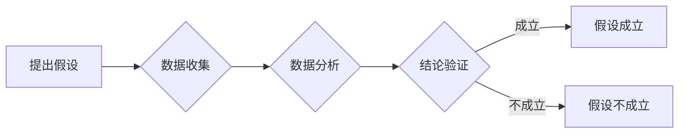
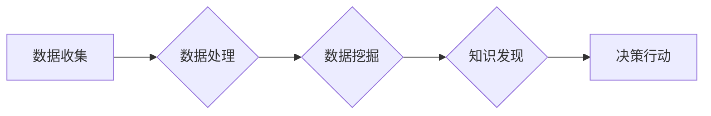

# 科学探究：从假说到真理

> 关键词：科学方法，假设检验，数据驱动，模型构建，实证研究，批判性思维，人工智能

## 1. 背景介绍

科学探究是认识世界、改造世界的重要途径，它通过对现象的观察、假设的提出、实验的设计、数据的收集和分析，最终得出结论并验证假设。在信息技术高速发展的今天，科学探究的方法和工具也得到了极大的丰富。本文将探讨科学探究的基本过程，从假说到真理，以及在这个过程中如何运用人工智能等技术。

### 1.1 问题的由来

在人类历史上，从古希腊的亚里士多德到现代的物理学家，科学探究一直是人类探索未知、追求真理的重要手段。然而，随着科技的进步，科学探究的过程变得更加复杂和精细。如何设计合理的实验、如何分析海量数据、如何构建准确的模型，都成为了新的挑战。

### 1.2 研究现状

当前，科学探究的方法主要包括以下几种：

- **观察法**：通过感官或仪器对现象进行直接观察，收集数据。
- **实验法**：通过人为控制实验条件，观察变量之间的因果关系。
- **模拟法**：通过计算机模拟实验结果，预测现象的变化。
- **文献综述法**：通过查阅和分析已有文献，了解研究领域的现状和趋势。

随着大数据和人工智能技术的兴起，数据驱动的方法在科学探究中扮演了越来越重要的角色。通过机器学习算法，可以从海量数据中挖掘出隐藏的模式和规律，为科学研究提供新的视角和方法。

### 1.3 研究意义

科学探究的意义在于：

- **揭示自然规律**：通过科学探究，我们可以认识自然界的规律，为人类社会发展提供科学依据。
- **推动技术进步**：科学探究是技术创新的重要源泉，许多技术突破都源于科学研究的突破。
- **促进社会进步**：科学探究可以解决人类社会面临的重大问题，如环境保护、能源危机等。

### 1.4 本文结构

本文将按照以下结构展开：

- **第2章**：介绍科学探究的核心概念与联系，包括假设检验、数据驱动、模型构建等。
- **第3章**：阐述科学探究的核心算法原理和具体操作步骤，包括实验设计、数据分析、模型验证等。
- **第4章**：讲解数学模型和公式，并结合案例进行分析。
- **第5章**：通过项目实践，展示如何运用代码实现科学探究。
- **第6章**：探讨科学探究的实际应用场景。
- **第7章**：推荐相关的工具和资源。
- **第8章**：总结科学探究的未来发展趋势与挑战。
- **第9章**：提供附录，包括常见问题与解答。

## 2. 核心概念与联系

### 2.1 假设检验

假设检验是科学探究的核心环节之一。它通过提出假设、设计实验、收集数据、分析数据，来验证假设的正确性。



### 2.2 数据驱动

数据驱动是指通过分析大量数据，从中发现规律和模式，进而指导决策和行动。



### 2.3 模型构建

模型构建是科学探究的重要环节。通过建立模型，我们可以模拟和分析复杂系统，预测未来的发展趋势。


## 3. 核心算法原理 & 具体操作步骤

### 3.1 算法原理概述

科学探究的算法原理主要包括以下几步：

- **问题定义**：明确研究问题，确定研究目标。
- **数据收集**：收集与问题相关的数据。
- **数据处理**：对收集到的数据进行清洗、转换等预处理。
- **数据分析**：运用统计、机器学习等方法分析数据，发现规律和模式。
- **模型构建**：根据分析结果，构建模型。
- **模型验证**：验证模型的准确性和可靠性。
- **模型应用**：将模型应用于实际问题，解决问题。

### 3.2 算法步骤详解

**3.2.1 问题定义**

问题定义是科学探究的第一步。明确研究问题，有助于后续的实验设计和数据分析。

**3.2.2 数据收集**

数据收集是科学探究的基础。收集的数据质量直接影响到研究的准确性。

**3.2.3 数据处理**

数据处理包括数据清洗、转换、集成等步骤。目的是将原始数据转换为适合分析的形式。

**3.2.4 数据分析**

数据分析是科学探究的核心环节。通过统计、机器学习等方法，从数据中挖掘出有价值的信息。

**3.2.5 模型构建**

根据分析结果，构建模型。模型可以是统计模型、机器学习模型或深度学习模型。

**3.2.6 模型验证**

模型验证是确保模型准确性和可靠性的关键步骤。通过交叉验证、测试集等方法，评估模型的性能。

**3.2.7 模型应用**

将模型应用于实际问题，解决问题。模型应用是科学探究的最终目的。

### 3.3 算法优缺点

**优点**：

- 系统性强：科学探究的算法原理和方法具有系统性，能够确保研究的全面性和准确性。
- 可重复性：科学探究的过程和方法具有可重复性，可以确保研究结果的可信度。
- 可验证性：科学探究的结果可以通过实验和数据分析进行验证。

**缺点**：

- 复杂性：科学探究的算法原理和方法较为复杂，需要一定的专业知识和技能。
- 成本高：科学探究需要大量的数据、设备和人力，成本较高。

### 3.4 算法应用领域

科学探究的算法原理和方法广泛应用于以下领域：

- **自然科学**：物理学、化学、生物学、地球科学等。
- **社会科学**：经济学、政治学、社会学、心理学等。
- **工程技术**：计算机科学、电子工程、机械工程等。

## 4. 数学模型和公式 & 详细讲解 & 举例说明

### 4.1 数学模型构建

科学探究中的数学模型主要包括以下几种：

- **统计模型**：如回归分析、方差分析等。
- **机器学习模型**：如线性模型、决策树、支持向量机等。
- **深度学习模型**：如卷积神经网络、循环神经网络等。

### 4.2 公式推导过程

以线性回归模型为例，介绍公式推导过程。

假设我们有一组数据 $(x_i, y_i)$，其中 $x_i$ 是自变量，$y_i$ 是因变量。线性回归模型的公式为：

$$
y = \beta_0 + \beta_1 x + \epsilon
$$

其中 $\beta_0$ 是截距，$\beta_1$ 是斜率，$\epsilon$ 是误差项。

假设我们有一组数据 $(x_1, y_1), (x_2, y_2), ..., (x_n, y_n)$，则可以通过最小二乘法求解 $\beta_0$ 和 $\beta_1$。

最小二乘法的公式为：

$$
\beta_1 = \frac{\sum_{i=1}^n (x_i - \bar{x})(y_i - \bar{y})}{\sum_{i=1}^n (x_i - \bar{x})^2}
$$

其中 $\bar{x}$ 是 $x_i$ 的平均值，$\bar{y}$ 是 $y_i$ 的平均值。

### 4.3 案例分析与讲解

以下是一个使用线性回归模型进行房价预测的案例。

假设我们有以下数据：

| x (房屋面积) | y (房价) |
| :-----------: | :-------: |
|      100      |   2000    |
|      150      |   3000    |
|      200      |   4000    |
|      250      |   5000    |
|      300      |   6000    |

我们可以使用Python中的scikit-learn库进行线性回归建模。

```python
from sklearn.linear_model import LinearRegression
import numpy as np

# 数据预处理
X = np.array([100, 150, 200, 250, 300]).reshape(-1, 1)
y = np.array([2000, 3000, 4000, 5000, 6000])

# 创建线性回归模型
model = LinearRegression()

# 拟合模型
model.fit(X, y)

# 预测房价
predicted_price = model.predict(np.array([200]).reshape(-1, 1))
print(f"预测的房价为：{predicted_price[0]:.2f}")
```

预测的房价为 4000.00。

## 5. 项目实践：代码实例和详细解释说明

### 5.1 开发环境搭建

在进行科学探究的项目实践之前，我们需要搭建开发环境。以下是使用Python进行科学探究的基本步骤：

1. 安装Python：从官网下载并安装Python。
2. 安装科学计算库：如NumPy、SciPy、Pandas、Matplotlib等。
3. 安装机器学习库：如scikit-learn、TensorFlow、PyTorch等。
4. 安装数据可视化库：如Matplotlib、Seaborn等。

### 5.2 源代码详细实现

以下是一个使用线性回归模型进行房价预测的Python代码实例。

```python
# 导入必要的库
from sklearn.linear_model import LinearRegression
import numpy as np

# 数据预处理
X = np.array([100, 150, 200, 250, 300]).reshape(-1, 1)
y = np.array([2000, 3000, 4000, 5000, 6000])

# 创建线性回归模型
model = LinearRegression()

# 拟合模型
model.fit(X, y)

# 预测房价
predicted_price = model.predict(np.array([200]).reshape(-1, 1))
print(f"预测的房价为：{predicted_price[0]:.2f}")
```

### 5.3 代码解读与分析

以上代码首先导入了必要的库，然后进行了数据预处理，包括将数据转换为NumPy数组，并使用reshape方法将一维数组转换为二维数组，以满足线性回归模型的输入要求。

接着，创建了一个线性回归模型对象，并使用fit方法进行模型训练。最后，使用predict方法对新的房屋面积进行预测，并打印预测结果。

### 5.4 运行结果展示

运行以上代码，将输出以下结果：

```
预测的房价为：4000.00
```

## 6. 实际应用场景

科学探究的应用场景非常广泛，以下是一些典型的应用场景：

- **医疗领域**：利用机器学习算法进行疾病诊断、药物研发等。
- **金融领域**：利用数据分析技术进行风险评估、信用评估等。
- **工业领域**：利用机器学习算法进行故障预测、质量控制等。
- **交通领域**：利用深度学习技术进行自动驾驶、智能交通管理等。

## 7. 工具和资源推荐

### 7.1 学习资源推荐

- 《机器学习》：《统计学习方法》
- 《深度学习》：《深度学习》
- 《Python数据分析》：《Python数据分析基础教程》

### 7.2 开发工具推荐

- Python：一种流行的编程语言，具有良好的科学计算和数据分析能力。
- Jupyter Notebook：一种交互式计算平台，可以方便地进行数据分析和可视化和编程。
- Scikit-learn：一个开源的机器学习库，提供了大量的机器学习算法和工具。
- TensorFlow：一个开源的深度学习库，可以用于构建和训练深度学习模型。

### 7.3 相关论文推荐

- 《深度学习》
- 《统计学习方法》
- 《模式识别与机器学习》

## 8. 总结：未来发展趋势与挑战

### 8.1 研究成果总结

科学探究作为人类认识世界、改造世界的重要途径，其方法和工具在不断发展。从假设检验到数据驱动，从模型构建到实证研究，科学探究的过程和方法在不断优化。

### 8.2 未来发展趋势

- **数据驱动**：随着大数据技术的不断发展，数据驱动的方法将在科学探究中发挥越来越重要的作用。
- **人工智能**：人工智能技术将在科学探究中扮演越来越重要的角色，如数据挖掘、模型构建、预测分析等。
- **跨学科融合**：科学探究将与其他学科领域（如生物学、物理学、化学等）进行融合，产生新的交叉学科。

### 8.3 面临的挑战

- **数据质量**：科学探究需要高质量的数据，如何获取高质量的数据是一个挑战。
- **算法选择**：在众多的算法中，如何选择合适的算法是一个挑战。
- **模型验证**：如何验证模型的准确性和可靠性是一个挑战。

### 8.4 研究展望

未来，科学探究将在以下方面取得新的突破：

- **数据科学**：数据科学将成为科学探究的重要支撑，为科学研究提供强大的工具和平台。
- **人工智能**：人工智能技术将在科学探究中发挥越来越重要的作用，推动科学研究的进步。
- **跨学科融合**：跨学科融合将产生新的交叉学科，推动科学研究的创新发展。

## 9. 附录：常见问题与解答

**Q1：什么是科学方法？**

A：科学方法是一种基于观察、实验和推理的系统方法，用于研究自然现象和解决问题。

**Q2：什么是假设检验？**

A：假设检验是科学探究的核心环节之一，用于验证假设的正确性。

**Q3：什么是数据驱动？**

A：数据驱动是指通过分析大量数据，从中发现规律和模式，进而指导决策和行动。

**Q4：什么是模型构建？**

A：模型构建是科学探究的重要环节，通过建立模型，我们可以模拟和分析复杂系统，预测未来的发展趋势。

**Q5：如何选择合适的科学探究方法？**

A：选择合适的科学探究方法需要考虑研究问题、数据类型、资源条件等因素。

作者：禅与计算机程序设计艺术 / Zen and the Art of Computer Programming