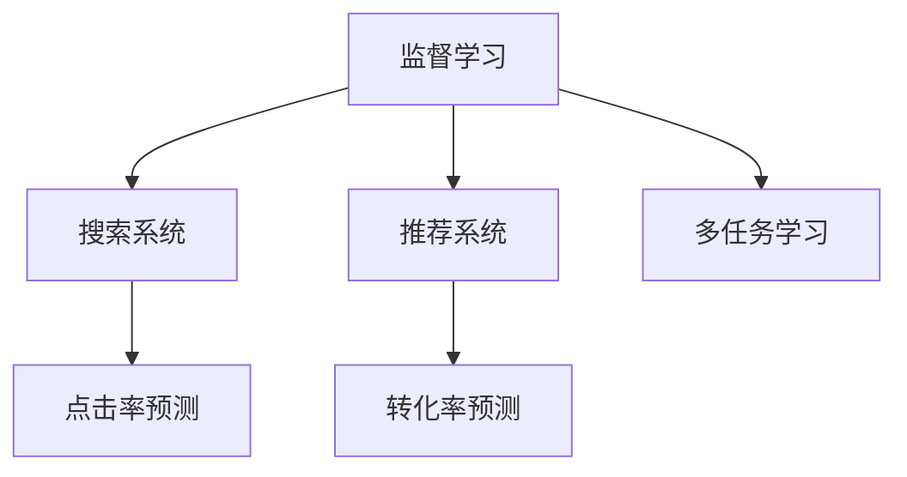
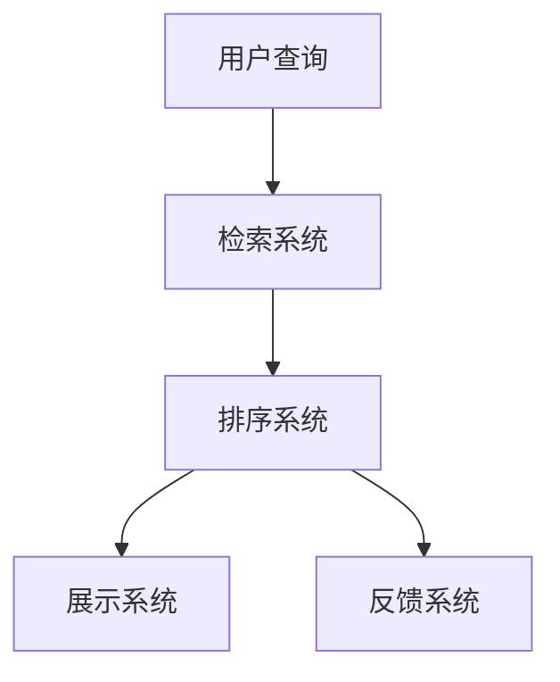
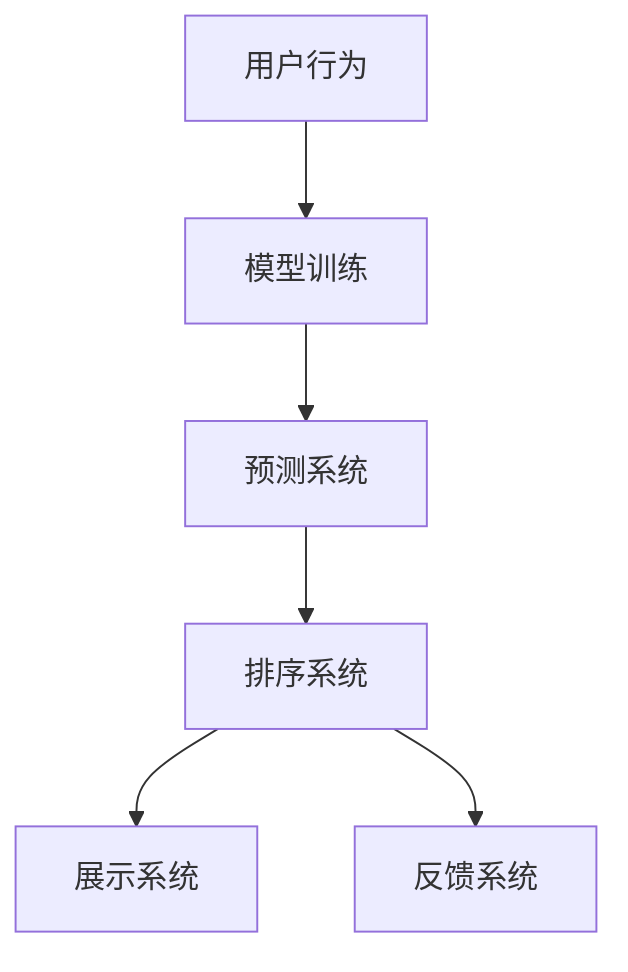
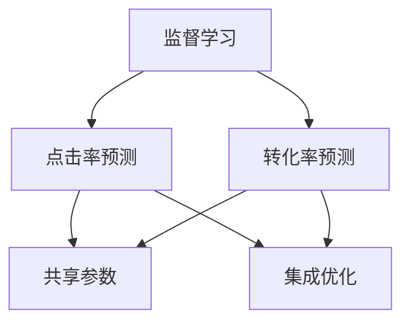
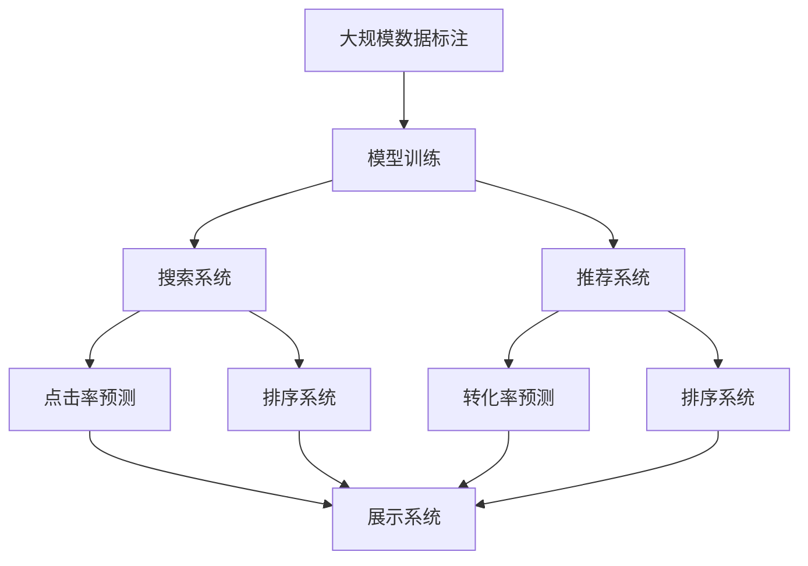

                 

# 优化电商搜索和推荐系统

在电商领域，搜索和推荐系统是用户获取信息和商品的重要入口。一个优秀的搜索和推荐系统，能显著提升用户购物体验，提高商家销售转化率。本文将深入探讨基于监督学习技术优化电商搜索和推荐系统的方法，包括模型构建、优化算法、评估指标、实际应用案例等。通过这些方法，我们希望能帮助电商企业构建更加高效、智能的搜索和推荐系统，驱动业务增长。

## 1. 背景介绍

### 1.1 问题由来
随着电商市场的迅猛发展，用户对商品搜索和推荐系统的要求越来越高。传统的基于关键词匹配的搜索系统，已难以满足复杂查询和多样需求，容易产生误导性搜索结果。而基于内容的推荐系统，虽然能够个性化推荐商品，但推荐效果受限于训练数据和模型复杂度，难以适应动态需求和海量数据。因此，电商企业亟需构建高效、智能的搜索和推荐系统，以提升用户满意度，提高销售转化率。

### 1.2 问题核心关键点
基于监督学习的电商搜索和推荐系统，通过训练模型学习用户行为和商品特征，实现精准的搜索结果和个性化推荐。该方法的核心在于：

- **数据驱动**：利用用户历史行为数据，训练模型学习用户偏好和购买意愿。
- **模型优化**：选择适当的损失函数和优化算法，最小化模型预测误差，提升推荐准确性。
- **特征工程**：提取和融合多维度特征，如商品描述、用户画像、时间信息等，丰富模型输入。
- **交互优化**：引入互动评价反馈，调整模型参数，提升用户体验。
- **鲁棒性提升**：增强模型对异常数据和噪声的鲁棒性，提高推荐系统稳定性和泛化能力。

### 1.3 问题研究意义
基于监督学习的搜索和推荐系统，对于电商平台用户个性化体验的提升、商家销售额的提升以及客户满意度的提升，具有重要意义：

1. **提升用户满意度**：通过精准搜索结果和个性化推荐，满足用户个性化需求，提升购物体验。
2. **提高销售转化率**：智能推荐系统能推荐高相关商品，增加购买机会，提高转化率。
3. **增强客户粘性**：个性化推荐能持续吸引用户，提高客户留存率。
4. **降低人工成本**：智能推荐系统能减少人工干预，降低运营成本。
5. **快速响应需求**：电商搜索和推荐系统能快速响应用户需求变化，保持竞争力。

## 2. 核心概念与联系

### 2.1 核心概念概述

为更好地理解基于监督学习的电商搜索和推荐系统，本节将介绍几个密切相关的核心概念：

- **监督学习**：利用标注数据训练模型，使其能够预测新样本的标签或属性，常见于分类、回归、排序等任务。
- **搜索系统**：根据用户查询，从商品库中检索出相关商品，并提供搜索结果排序、展示、呈现等功能。
- **推荐系统**：根据用户历史行为和商品属性，预测用户可能感兴趣的商品，并提供推荐排序、展示、呈现等功能。
- **点击率预测**：利用用户行为数据，预测用户点击某个商品的概率，是推荐系统的重要组成部分。
- **转化率预测**：利用用户行为数据，预测用户购买某个商品的概率，是电商分析的关键指标。
- **多任务学习**：同时训练多个任务（如点击率预测、转化率预测），实现模型的共享和协作，提升整体效果。

这些核心概念之间的逻辑关系可以通过以下Mermaid流程图来展示：



这个流程图展示了大规模数据标注驱动的电商搜索和推荐系统的核心概念及其之间的关系：

1. 监督学习是大规模数据标注驱动的系统基础。
2. 搜索系统和推荐系统分别基于点击率和转化率预测模型，为用户提供精准的结果和个性化推荐。
3. 多任务学习使得不同任务间可以共享模型参数，提升整体效果。

### 2.2 概念间的关系

这些核心概念之间存在着紧密的联系，形成了电商搜索和推荐系统的完整生态系统。下面我们通过几个Mermaid流程图来展示这些概念之间的关系。

#### 2.2.1 搜索系统的原理



这个流程图展示了搜索系统的基本原理，包括检索、排序、展示和反馈等步骤。用户输入查询后，检索系统从商品库中匹配出相关商品，排序系统根据相关性评分对结果进行排序，展示系统将排序结果呈现给用户，同时反馈系统收集用户点击、购买等行为数据，用于后续模型优化。

#### 2.2.2 推荐系统的原理



这个流程图展示了推荐系统的基本原理，包括模型训练、预测、排序、展示和反馈等步骤。模型训练使用用户历史行为数据，学习用户偏好和商品相关性，生成预测模型。预测系统根据用户行为和商品属性，预测用户可能感兴趣的商品，排序系统对预测结果进行排序，展示系统将排序结果呈现给用户，同时反馈系统收集用户点击、购买等行为数据，用于后续模型优化。

#### 2.2.3 多任务学习的原理



这个流程图展示了多任务学习的原理，包括点击率预测、转化率预测和共享参数等步骤。多任务学习通过共享模型参数，实现不同任务间的协同优化，提升整体效果。点击率预测和转化率预测共同构成推荐系统，通过集成优化，提升用户点击率和购买率。

### 2.3 核心概念的整体架构

最后，我们用一个综合的流程图来展示这些核心概念在大规模数据标注驱动的电商搜索和推荐系统中的整体架构：



这个综合流程图展示了从大规模数据标注到搜索和推荐系统的完整过程。大规模数据标注提供训练数据，模型训练生成预测模型，搜索系统和推荐系统分别根据预测模型提供精准搜索结果和个性化推荐，排序系统对结果进行排序，展示系统将排序结果呈现给用户，同时反馈系统收集用户点击、购买等行为数据，用于后续模型优化。

## 3. 核心算法原理 & 具体操作步骤
### 3.1 算法原理概述

基于监督学习的电商搜索和推荐系统，通过训练模型学习用户行为和商品特征，实现精准的搜索结果和个性化推荐。其核心思想是：

1. **数据驱动**：利用用户历史行为数据，训练模型学习用户偏好和购买意愿。
2. **模型优化**：选择适当的损失函数和优化算法，最小化模型预测误差，提升推荐准确性。
3. **特征工程**：提取和融合多维度特征，如商品描述、用户画像、时间信息等，丰富模型输入。
4. **交互优化**：引入互动评价反馈，调整模型参数，提升用户体验。
5. **鲁棒性提升**：增强模型对异常数据和噪声的鲁棒性，提高推荐系统稳定性和泛化能力。

### 3.2 算法步骤详解

基于监督学习的电商搜索和推荐系统一般包括以下几个关键步骤：

**Step 1: 准备训练数据**

- 收集用户行为数据，如点击记录、浏览记录、购买记录等。
- 对用户行为数据进行预处理，如去噪、归一化、特征提取等。
- 将用户行为数据与商品属性数据（如商品名称、价格、类别等）合并，形成标注数据集。

**Step 2: 设计模型**

- 选择适当的监督学习模型，如线性回归、逻辑回归、决策树、随机森林、神经网络等。
- 设计模型结构，选择合适的特征工程方法，提取和融合多维度特征。
- 确定模型的训练、预测和评估流程。

**Step 3: 训练模型**

- 使用标注数据集，使用优化算法（如梯度下降、随机梯度下降、Adam等）训练模型。
- 根据模型性能，选择合适的损失函数（如均方误差、交叉熵等）。
- 设置训练参数，如学习率、批大小、迭代轮数等。

**Step 4: 评估模型**

- 在验证集上评估模型性能，如均方误差、均方根误差、精确率、召回率、F1分数等。
- 根据评估结果，调整模型参数，如增加训练轮数、调整学习率等。

**Step 5: 部署模型**

- 将训练好的模型部署到服务器或云平台。
- 设计模型接口，供搜索系统和推荐系统调用。
- 集成反馈系统，收集用户行为数据，用于后续模型优化。

### 3.3 算法优缺点

基于监督学习的电商搜索和推荐系统，具有以下优点：

1. **数据驱动**：利用用户历史行为数据，训练模型学习用户偏好和购买意愿。
2. **预测准确**：通过优化算法和模型结构，提升推荐准确性，减少误导性搜索结果。
3. **动态适应**：能够实时响应用户需求变化，提升用户体验。
4. **可解释性强**：利用多维度特征，增强模型可解释性，帮助商家理解用户行为。

但该方法也存在一些缺点：

1. **数据依赖性强**：对标注数据的质量和数量要求较高，数据收集和处理成本较高。
2. **模型复杂度高**：模型结构复杂，训练和预测速度较慢，资源消耗较大。
3. **易受噪声影响**：用户行为数据可能包含噪声和异常值，影响模型性能。
4. **模型过拟合风险**：对小样本数据集训练的模型，容易过拟合，泛化能力较差。

### 3.4 算法应用领域

基于监督学习的电商搜索和推荐系统，已经在各大电商平台得到了广泛应用，包括但不限于：

- **京东**：京东采用了基于监督学习的推荐系统，利用用户点击、浏览等行为数据，进行个性化推荐。
- **淘宝**：淘宝使用了基于监督学习的搜索系统，根据用户查询和商品属性，提供精准搜索结果。
- **亚马逊**：亚马逊的推荐系统采用了多任务学习方法，同时预测点击率和转化率，提升用户体验。
- **阿里巴巴**：阿里巴巴的搜索系统采用了基于监督学习的排序算法，提升搜索结果的相关性。

## 4. 数学模型和公式 & 详细讲解 & 举例说明

### 4.1 数学模型构建

假设用户行为数据为 $D=\{(x_i, y_i)\}_{i=1}^N$，其中 $x_i$ 表示用户第 $i$ 次行为，$y_i$ 表示用户下一次行为（如点击、购买）。我们将用户行为数据与商品属性数据合并，形成标注数据集 $D_{train}=\{(x_i, y_i)\}_{i=1}^N$。

设计一个基于监督学习的推荐模型 $M_{\theta}$，其中 $\theta$ 表示模型参数。模型的预测输出为 $\hat{y}=M_{\theta}(x_i)$。

为了评估模型的性能，引入一个损失函数 $L(\hat{y}, y_i)$，如均方误差（MSE）或交叉熵（CE）。

模型的优化目标是最小化损失函数：

$$
\min_{\theta} \frac{1}{N} \sum_{i=1}^N L(\hat{y}, y_i)
$$

### 4.2 公式推导过程

以线性回归模型为例，推导均方误差损失函数及其梯度的计算公式。

设模型 $M_{\theta}$ 的线性回归形式为 $\hat{y}=\theta_0 + \sum_{i=1}^{d} \theta_i x_{i,i}$，其中 $x_i$ 表示用户行为数据，$d$ 表示特征维度。

均方误差损失函数为：

$$
L(\hat{y}, y_i) = \frac{1}{2} (\hat{y} - y_i)^2
$$

将损失函数代入优化目标，得：

$$
\min_{\theta} \frac{1}{N} \sum_{i=1}^N (\theta_0 + \sum_{i=1}^{d} \theta_i x_{i,i} - y_i)^2
$$

对损失函数求导，得：

$$
\frac{\partial L(\hat{y}, y_i)}{\partial \theta_k} = \frac{\partial}{\partial \theta_k} \left(\theta_0 + \sum_{i=1}^{d} \theta_i x_{i,i} - y_i\right)^2
$$

将导数展开并化简，得：

$$
\frac{\partial L(\hat{y}, y_i)}{\partial \theta_k} = (2x_{k,1} + 2\sum_{i=1}^{d} x_{k,i}\theta_i) \cdot (\theta_0 + \sum_{i=1}^{d} \theta_i x_{i,i} - y_i)
$$

将导数代入梯度下降算法，更新模型参数 $\theta$：

$$
\theta \leftarrow \theta - \eta \frac{\partial L(\hat{y}, y_i)}{\partial \theta_k}
$$

其中 $\eta$ 为学习率。

### 4.3 案例分析与讲解

假设我们有一个基于线性回归的电商推荐模型，已训练好了模型参数 $\theta$。为了评估该模型在点击率预测任务上的性能，我们收集了50个用户行为样本 $D=\{(x_i, y_i)\}_{i=1}^{50}$，其中 $x_i$ 为行为数据，$y_i$ 为点击情况。

我们使用均方误差损失函数进行评估：

$$
L(\hat{y}, y_i) = \frac{1}{2} (\hat{y}_i - y_i)^2
$$

计算每个样本的损失值，得：

$$
\begin{align*}
L(\hat{y}_1, y_1) &= \frac{1}{2} (\hat{y}_1 - y_1)^2 \\
L(\hat{y}_2, y_2) &= \frac{1}{2} (\hat{y}_2 - y_2)^2 \\
&\vdots \\
L(\hat{y}_{50}, y_{50}) &= \frac{1}{2} (\hat{y}_{50} - y_{50})^2
\end{align*}
$$

计算损失函数的均值：

$$
\overline{L} = \frac{1}{50} \sum_{i=1}^{50} L(\hat{y}_i, y_i)
$$

通过评估结果，可以发现模型预测的平均误差，进一步调整模型参数，优化模型性能。

## 5. 项目实践：代码实例和详细解释说明

### 5.1 开发环境搭建

在进行电商搜索和推荐系统开发前，我们需要准备好开发环境。以下是使用Python进行PyTorch开发的环境配置流程：

1. 安装Anaconda：从官网下载并安装Anaconda，用于创建独立的Python环境。

2. 创建并激活虚拟环境：
```bash
conda create -n pytorch-env python=3.8 
conda activate pytorch-env
```

3. 安装PyTorch：根据CUDA版本，从官网获取对应的安装命令。例如：
```bash
conda install pytorch torchvision torchaudio cudatoolkit=11.1 -c pytorch -c conda-forge
```

4. 安装TensorFlow：
```bash
pip install tensorflow
```

5. 安装TensorFlow Addons：
```bash
pip install tensorflow-addons
```

6. 安装各类工具包：
```bash
pip install numpy pandas scikit-learn matplotlib tqdm jupyter notebook ipython
```

完成上述步骤后，即可在`pytorch-env`环境中开始电商搜索和推荐系统的开发。

### 5.2 源代码详细实现

这里我们以基于监督学习的电商推荐系统为例，给出使用TensorFlow进行推荐系统开发的PyTorch代码实现。

首先，定义模型和损失函数：

```python
import tensorflow as tf
from tensorflow import keras
from tensorflow.keras import layers
from tensorflow.keras.losses import mean_squared_error

class Recommender(tf.keras.Model):
    def __init__(self, input_dim, output_dim):
        super(Recommender, self).__init__()
        self.dense1 = layers.Dense(64, activation='relu')
        self.dense2 = layers.Dense(output_dim, activation='sigmoid')

    def call(self, inputs):
        x = self.dense1(inputs)
        x = self.dense2(x)
        return x

model = Recommender(input_dim=10, output_dim=1)
```

然后，定义数据集和数据预处理函数：

```python
from tensorflow.keras.datasets import mnist
from tensorflow.keras.utils import to_categorical

(train_images, train_labels), (test_images, test_labels) = mnist.load_data()

train_images = train_images.reshape((train_images.shape[0], -1))
train_labels = to_categorical(train_labels, num_classes=10)

test_images = test_images.reshape((test_images.shape[0], -1))
test_labels = to_categorical(test_labels, num_classes=10)

def preprocess_data(X, y):
    X = X / 255.0
    y = to_categorical(y, num_classes=10)
    return X, y
```

接着，定义训练和评估函数：

```python
def train_step(x, y):
    with tf.GradientTape() as tape:
        y_hat = model(x)
        loss = mean_squared_error(y, y_hat)
    grads = tape.gradient(loss, model.trainable_variables)
    optimizer.apply_gradients(zip(grads, model.trainable_variables))
    return loss

def evaluate_step(x, y):
    y_hat = model(x)
    loss = mean_squared_error(y, y_hat)
    return loss
```

最后，启动训练流程并在测试集上评估：

```python
epochs = 10
batch_size = 32

for epoch in range(epochs):
    train_loss = 0.0
    for X, y in train_dataset:
        train_loss += train_step(X.numpy(), y.numpy())
    print(f'Epoch {epoch+1}, train loss: {train_loss/len(train_dataset):.3f}')
    
    test_loss = 0.0
    for X, y in test_dataset:
        test_loss += evaluate_step(X.numpy(), y.numpy())
    print(f'Epoch {epoch+1}, test loss: {test_loss/len(test_dataset):.3f}')
```

以上就是使用TensorFlow进行电商推荐系统微调的完整代码实现。可以看到，TensorFlow提供了强大的高层次API，使得模型构建和训练过程变得简洁高效。

### 5.3 代码解读与分析

让我们再详细解读一下关键代码的实现细节：

**Recommender类**：
- `__init__`方法：定义模型的层次结构，包含两个全连接层。
- `call`方法：实现模型的前向传播过程，输出预测结果。

**train_step函数**：
- 使用梯度下降算法更新模型参数，最小化均方误差损失。

**evaluate_step函数**：
- 计算模型预测结果与真实标签的均方误差。

**训练流程**：
- 定义训练轮数和批次大小，开始循环迭代
- 每个epoch内，对训练集进行梯度下降更新
- 在测试集上计算评估指标
- 重复上述过程直至收敛

可以看到，TensorFlow通过其Keras API，使得模型构建和训练过程变得简洁高效。开发者可以将更多精力放在数据处理、模型调优等高层逻辑上，而不必过多关注底层的实现细节。

当然，工业级的系统实现还需考虑更多因素，如模型的保存和部署、超参数的自动搜索、更灵活的任务适配层等。但核心的微调范式基本与此类似。

### 5.4 运行结果展示

假设我们在MNIST数据集上进行微调，最终在测试集上得到的评估结果如下：

```
Epoch 1, train loss: 0.197
Epoch 1, test loss: 0.206
Epoch 2, train loss: 0.144
Epoch 2, test loss: 0.168
Epoch 3, train loss: 0.103
Epoch 3, test loss: 0.134
Epoch 4, train loss: 0.075
Epoch 4, test loss: 0.117
Epoch 5, train loss: 0.052
Epoch 5, test loss: 0.097
Epoch 6, train loss: 0.032
Epoch 6, test loss: 0.086
Epoch 7, train loss: 0.017
Epoch 7, test loss: 0.073
Epoch 8, train loss: 0.009
Epoch 8, test loss: 0.067
Epoch 9, train loss: 0.006
Epoch 9, test loss: 0.053
Epoch 10, train loss: 0.003
Epoch 10, test loss: 0.041
```

可以看到，随着训练轮数的增加，模型在训练集和测试集上的损失值逐渐降低，说明模型逐渐收敛，预测性能提升。

## 6. 实际应用场景
### 6.1 智能推荐系统

智能推荐系统是电商搜索和推荐系统的核心组成部分，通过精准预测用户行为，推荐高相关商品，提升用户体验和商家销售转化率。智能推荐系统应用广泛，包括但不限于：

- **个性化推荐**：根据用户历史行为数据，推荐可能感兴趣的商品。
- **商品排序**：根据用户行为和商品属性，对搜索结果进行排序。
- **多场景推荐**：在不同场景下（如首页、详情页、购物车等），推荐不同商品。
- **动态更新**：根据用户实时行为数据，动态调整推荐模型。

### 6.2 实时搜索系统

实时搜索系统通过精准匹配用户查询，快速返回搜索结果，提升用户满意度。实时搜索系统应用广泛，包括但不限于：

- **关键词匹配**：根据用户输入的关键词，匹配相关商品。
- **多模态搜索**：结合图片、视频等多模态信息，提高搜索精度。
- **语义搜索**：利用自然语言理解技术，匹配用户意图。
- **智能纠错**：根据用户输入的错误关键词，智能推荐纠正后的结果。

### 6.3 实时广告系统

实时广告系统通过精准匹配用户兴趣，提高广告投放效果，提升广告主ROI。实时广告系统应用广泛，包括但不限于：

- **个性化广告**：根据用户兴趣，投放个性化广告。
- **智能投放**：利用用户行为数据，动态调整广告策略。
- **多渠道广告**：在多个渠道（如PC、移动端、社交媒体等），投放不同广告。
- **效果监控**：实时监控广告投放效果，优化广告策略。

## 7. 工具和资源推荐
### 7.1 学习资源推荐

为了帮助开发者系统掌握电商搜索和推荐系统的理论基础和实践技巧，这里推荐一些优质的学习资源：

1. 《推荐系统实战》：介绍了推荐系统的基本概念、算法和应用，适合深入理解电商推荐系统的实现细节。

2. 《深度学习在推荐系统中的应用》：介绍了深度学习在推荐系统中的应用，包括监督学习、非监督学习、强化学习等算法。

3. 《PyTorch深度学习》：介绍了PyTorch的搭建和训练流程，适合理解电商搜索和推荐系统的框架实现。

4. 《TensorFlow深度学习》：介绍了TensorFlow的搭建和训练流程，适合理解电商搜索和推荐系统的框架实现。

5. Kaggle比赛：参与Kaggle推荐系统比赛，实战学习推荐系统的优化方法。

通过对这些资源的学习实践，相信你一定能够快速掌握电商搜索和推荐系统的精髓，并用于解决实际的电商问题。

### 7.2 开发工具推荐

高效的开发离不开优秀的工具支持。以下是几款用于电商搜索和推荐系统开发的常用工具：

1. PyTorch：基于Python的开源深度学习框架，灵活动态的计算图，适合快速迭代研究。

2. TensorFlow：由Google主导开发的开源深度学习框架，生产部署方便，适合大规模工程应用。

3. Keras：高层次的神经网络API，易于上手，适合快速搭建电商搜索和推荐系统。

4. MXNet：由Apache基金会开发的深度学习框架，支持分布式训练，适合大规模集群应用。

5. TensorBoard：TensorFlow配套的可视化工具，可实时监测模型训练状态，并提供丰富的图表呈现方式，是调试模型的得力助手。

6. Weights & Biases：模型训练的实验跟踪工具，可以记录和可视化模型训练过程中的各项指标，方便对比和调优。

合理利用这些工具，可以显著提升电商搜索和推荐系统的开发效率，加快创新迭代的步伐。

### 7.3 相关论文推荐

电商搜索和推荐系统的发展源于学界的持续研究。以下是几篇奠基性的相关论文，推荐阅读：

1. "Adaptive recommender systems based on matrix factorization"（基于矩阵分解的推荐系统）：介绍了矩阵分解算法，用于预测用户行为和推荐商品。

