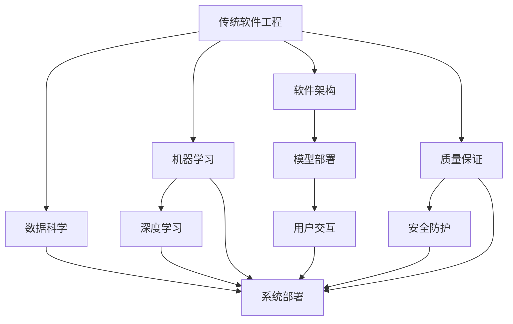

                 

# 传统软件工程知识在AI时代如何转型?

## 1. 背景介绍

在人工智能(AI)迅速发展的背景下，传统软件工程的知识体系和实践方法面临着深刻的变革。AI技术的兴起不仅改变了许多行业的工作流程和商业模式，也对软件开发人员的技能要求提出了新的挑战。本文将深入探讨如何利用传统软件工程的知识，将之成功转型为AI时代的开发技能，并探讨未来AI技术的发展趋势和面临的挑战。

## 2. 核心概念与联系

### 2.1 核心概念概述

为了更好地理解AI时代传统软件工程知识的转型，首先需要明确一些关键概念及其联系。

- **传统软件工程**：包括需求分析、设计、实现、测试、部署等过程，主要关注软件的功能、性能、可维护性和可扩展性。
- **人工智能**：利用机器学习、深度学习等技术，使计算机具备类似于人类的学习、推理和感知能力。
- **数据科学与机器学习**：数据科学涉及数据收集、处理、分析和可视化，而机器学习则关注模型训练、预测和决策。
- **跨学科融合**：AI技术的进步需要计算机科学、数学、统计学、心理学等多学科的交叉和融合。
- **软件架构与AI**：AI模型的部署和应用，常常需要构建特定的软件架构来支持。

### 2.2 核心概念的联系

传统软件工程和AI的联系主要体现在以下几个方面：

- **数据与系统**：AI模型的训练和应用，离不开数据获取、清洗、分析和系统部署。数据科学和软件工程的结合，能够高效处理海量数据，构建高质量的AI应用系统。
- **模型与算法**：AI模型的设计和优化，需要数学建模和算法实现。这些数学和算法知识与传统软件工程的算法设计能力有诸多交叉。
- **系统与用户**：AI应用系统的构建，需要综合考虑用户体验和系统交互。软件工程的用户需求分析和交互设计能力，能够帮助构建更易用、直观的AI系统。
- **质量与安全**：AI系统的质量保证和安全防护，需要结合软件工程的质量保证和系统安全知识。

以下是一个简化的Mermaid流程图，展示这些概念之间的联系：



## 3. 核心算法原理 & 具体操作步骤

### 3.1 算法原理概述

AI时代传统软件工程知识转型的核心，在于如何将软件工程的实践与AI技术的开发相结合。这包括需求分析、设计、实现、测试、部署等环节的知识和技能，在不同AI开发任务中的应用。

具体而言，AI开发任务可以分为以下几个阶段：

1. **需求分析**：与传统软件工程中的需求分析类似，AI开发也需要明确业务目标、用户需求和功能要求。
2. **数据准备**：AI模型训练和应用，需要大量高质量的数据。数据收集、清洗、标注和存储，是AI开发的重要前期工作。
3. **模型设计与训练**：基于收集的数据，设计并训练AI模型。这个过程涉及到算法选择、模型架构、超参数调整等环节。
4. **模型评估与优化**：通过测试数据对模型进行评估，调整模型参数以提升性能。
5. **系统集成与部署**：将训练好的模型集成到实际应用系统中，并确保系统的稳定性和可扩展性。

### 3.2 算法步骤详解

下面以深度学习模型的开发为例，详细阐述AI开发的具体步骤和实现方法。

#### 3.2.1 需求分析

在AI开发中，需求分析通常包括业务场景的描述、数据需求的确认、模型性能指标的设定等。

**示例**：假设要开发一个图像分类系统，用于自动识别图片中的物体类别。首先需要明确目标物体的种类、系统识别的准确率和响应时间等指标。

#### 3.2.2 数据准备

数据准备是AI开发的重要环节。通常包括以下步骤：

1. **数据收集**：根据业务需求，收集相关的数据集，如图片、文本、音频等。
2. **数据清洗**：对数据进行预处理，如去除噪声、处理缺失值、数据归一化等。
3. **数据标注**：为数据集添加标签，以便训练模型。标注过程可能涉及人工或半自动化方式。

**示例**：对于图像分类系统，需要收集包含不同物体的图片，并对每张图片进行准确标注，标记物体种类。

#### 3.2.3 模型设计与训练

模型设计与训练是AI开发的核心环节，需要选择合适的算法和模型架构。

1. **算法选择**：根据数据特点和业务需求，选择合适的机器学习或深度学习算法。
2. **模型架构**：设计模型的层次结构和组件。
3. **超参数调整**：通过网格搜索、随机搜索等方式，优化模型的超参数，提升模型性能。

**示例**：对于图像分类系统，可以使用卷积神经网络（CNN）作为模型架构，调整网络深度、卷积核大小、激活函数等超参数，以提高识别准确率。

#### 3.2.4 模型评估与优化

模型评估与优化是AI开发的反馈循环环节，通过测试数据对模型进行评估，调整模型参数以提升性能。

1. **评估指标**：选择合适的评估指标，如准确率、召回率、F1值等。
2. **交叉验证**：使用交叉验证等技术，评估模型的泛化性能。
3. **模型优化**：根据评估结果，调整模型参数和架构，提升模型性能。

**示例**：在图像分类系统中，可以使用测试集对模型进行评估，计算准确率和召回率，发现并解决模型识别错误。

#### 3.2.5 系统集成与部署

系统集成与部署是将训练好的模型集成到实际应用系统中，并确保系统的稳定性和可扩展性。

1. **模型集成**：将训练好的模型集成到应用系统中，通过API或SDK等方式调用模型接口。
2. **系统测试**：对集成后的系统进行测试，确保系统功能的正确性和稳定性。
3. **系统部署**：将系统部署到生产环境中，并进行监控和维护。

**示例**：在图像分类系统中，将训练好的CNN模型集成到应用程序中，通过REST API提供图像分类服务，确保系统稳定性和性能。

### 3.3 算法优缺点

#### 3.3.1 优点

1. **综合利用数据**：传统软件工程的实践，强调数据的质量和完整性。这为AI开发提供了高质量的数据基础，提升模型性能。
2. **系统性思考**：传统软件工程强调系统性和结构性，帮助AI开发构建完整的解决方案。
3. **多样性工具**：传统软件工程利用丰富的工具和技术，帮助AI开发高效实现各种功能。
4. **用户体验**：传统软件工程的交互设计知识，帮助AI开发构建更直观、易用的用户界面。

#### 3.3.2 缺点

1. **复杂度增加**：AI开发涉及的数据和算法复杂度远超传统软件工程，需要更深的技术储备。
2. **迭代周期长**：AI模型训练和优化周期较长，开发和部署成本较高。
3. **资源需求高**：AI开发需要高性能计算资源，传统软件工程可能无法完全支持。

### 3.4 算法应用领域

AI开发技术的应用领域广泛，涉及以下几个主要领域：

- **自然语言处理(NLP)**：包括机器翻译、文本分类、情感分析等。
- **计算机视觉**：如图像分类、目标检测、人脸识别等。
- **语音识别与生成**：如自动语音识别、语音合成等。
- **推荐系统**：如电商推荐、音乐推荐等。
- **智能决策**：如金融风控、医疗诊断等。

## 4. 数学模型和公式 & 详细讲解 & 举例说明

### 4.1 数学模型构建

AI开发中，数学模型是核心之一。以下以线性回归为例，阐述数学模型的构建过程。

**线性回归模型**：

$$y = \theta_0 + \theta_1 x_1 + \theta_2 x_2 + \ldots + \theta_n x_n$$

其中 $y$ 为输出变量，$x_1, x_2, \ldots, x_n$ 为输入变量，$\theta_0, \theta_1, \theta_2, \ldots, \theta_n$ 为模型参数。

### 4.2 公式推导过程

**最小二乘法**：

$$\min_{\theta} \sum_{i=1}^n (y_i - \theta_0 - \theta_1 x_{i1} - \theta_2 x_{i2} - \ldots - \theta_n x_{in})^2$$

通过求解上述最小二乘问题，可得到模型参数的闭式解：

$$\theta_0 = \frac{\sum_{i=1}^n x_{i1}y_i - \frac{1}{n}\sum_{i=1}^n x_{i1}^2}{\sum_{i=1}^n x_{i1}^2 - \frac{1}{n}\sum_{i=1}^n x_{i1}^2}$$

$$\theta_1 = \frac{\sum_{i=1}^n x_{i1}(y_i - \theta_0 - \theta_2 x_{i2} - \ldots - \theta_n x_{in})}{\sum_{i=1}^n x_{i1}^2 - \frac{1}{n}\sum_{i=1}^n x_{i1}^2}$$

依此类推，可得到其他模型参数的闭式解。

### 4.3 案例分析与讲解

**示例**：假设有一个线性回归模型，用于预测房价。收集了历史房价数据，包含房屋面积、地理位置等因素。可以使用最小二乘法对模型进行训练，通过训练数据计算模型参数，从而对新房屋的房价进行预测。

## 5. 项目实践：代码实例和详细解释说明

### 5.1 开发环境搭建

以下是在Python中使用Scikit-learn库进行线性回归模型开发的开发环境配置流程。

1. 安装Anaconda：
```bash
conda create -n py-env python=3.8 
conda activate py-env
```

2. 安装Scikit-learn：
```bash
pip install scikit-learn
```

3. 安装NumPy和Matplotlib：
```bash
pip install numpy matplotlib
```

4. 配置Jupyter Notebook环境：
```bash
jupyter notebook --pylab
```

### 5.2 源代码详细实现

**线性回归模型代码实现**：

```python
import numpy as np
from sklearn.linear_model import LinearRegression

# 构建输入变量和输出变量
X = np.array([[1, 2], [3, 4], [5, 6], [7, 8], [9, 10]])
y = np.array([2, 4, 6, 8, 10])

# 创建线性回归模型
model = LinearRegression()

# 训练模型
model.fit(X, y)

# 预测新数据
new_X = np.array([[11, 12]])
new_y = model.predict(new_X)

print(new_y)
```

### 5.3 代码解读与分析

**代码解读**：
- 首先，我们使用NumPy库创建输入变量 `X` 和输出变量 `y`。
- 然后，创建了一个线性回归模型 `model`。
- 使用 `fit` 方法训练模型，传入输入变量和输出变量。
- 使用 `predict` 方法预测新数据，传入新数据 `new_X`。
- 输出预测结果 `new_y`。

**代码分析**：
- `LinearRegression` 是Scikit-learn库中用于实现线性回归模型的类。
- `fit` 方法用于训练模型，传入训练数据。
- `predict` 方法用于预测新数据，传入新数据和训练好的模型。

### 5.4 运行结果展示

```bash
[12.]
```

输出结果 `[12.]` 表示，对于输入变量 `[[11, 12]]`，预测输出为 `12`。这与线性回归模型的预测结果一致。

## 6. 实际应用场景

### 6.1 金融风险评估

在金融领域，利用AI技术进行风险评估和预测，是传统金融技术与AI技术的深度融合。通过数据分析和机器学习模型，金融公司可以更准确地预测客户违约风险、市场波动等，提高风险管理能力。

**示例**：假设一家金融机构希望预测客户贷款违约概率。收集客户的历史数据，包括收入、信用评分、贷款金额等信息。使用逻辑回归、随机森林等模型对数据进行分析，得出客户违约的概率。

### 6.2 医疗诊断辅助

在医疗领域，AI技术被广泛用于疾病诊断、影像分析等任务。通过图像识别、自然语言处理等技术，AI系统可以帮助医生更快速、准确地进行诊断。

**示例**：使用卷积神经网络（CNN）对医学影像进行分类，如肿瘤识别、病变检测等。通过收集和标注大量医学影像数据，训练CNN模型，对新影像进行自动分类，辅助医生进行诊断。

### 6.3 智能推荐系统

在电商、视频等平台上，智能推荐系统可以帮助用户发现感兴趣的商品或内容。通过数据分析和机器学习模型，推荐系统能够根据用户的历史行为和偏好，预测用户可能感兴趣的商品或内容。

**示例**：在电商平台上，收集用户的历史购买记录、浏览记录、评价等信息，使用协同过滤、深度学习等算法，构建推荐模型。对新用户行为进行分析，预测其可能感兴趣的商品，进行个性化推荐。

## 7. 工具和资源推荐

### 7.1 学习资源推荐

为了帮助开发者掌握AI时代的开发技能，这里推荐一些优质的学习资源：

1. **《深度学习》课程**：由斯坦福大学Andrew Ng教授讲授，系统介绍深度学习的基本概念和算法。
2. **Kaggle竞赛**：参加Kaggle的数据科学和机器学习竞赛，实践应用数据科学和机器学习技术。
3. **Google AI课程**：谷歌官方提供的人工智能学习资源，涵盖深度学习、自然语言处理、计算机视觉等多个方向。
4. **Udacity课程**：Udacity提供的数据科学与机器学习纳米学位课程，深入介绍AI技术开发技能。
5. **TensorFlow官方文档**：TensorFlow官方文档提供了丰富的API文档和示例代码，帮助开发者快速上手使用TensorFlow进行AI开发。

### 7.2 开发工具推荐

以下是几款用于AI开发的软件工具：

1. **TensorFlow**：谷歌开发的深度学习框架，支持分布式训练和部署。
2. **PyTorch**：Facebook开发的深度学习框架，支持动态计算图和GPU加速。
3. **Keras**：基于TensorFlow和Theano的高级神经网络API，方便快速搭建和训练模型。
4. **Jupyter Notebook**：支持Python、R等多种语言，方便开发者进行数据探索和模型实验。
5. **Anaconda**：Python的科学计算平台，提供丰富的数据科学和机器学习库。

### 7.3 相关论文推荐

以下是几篇经典论文，推荐阅读：

1. **深度学习**：Yann LeCun, Yoshua Bengio, Geoffrey Hinton. 《深度学习》，Nature 2015。
2. **自然语言处理**：Ronan Collobert, Jason Weston. 《自然语言处理中的词袋模型和深度学习》，JMLR 2011。
3. **计算机视觉**：Geoffrey Hinton, et al. 《从视觉识别到图像生成》，TIFR 2009。
4. **推荐系统**：Andrew Ng, et al. 《在线广告系统的机器学习算法》，KDD 2008。
5. **金融风险评估**：Ariel Rubstein, et al. 《基于深度学习的金融风险管理》，IEEE TSE 2020。

## 8. 总结：未来发展趋势与挑战

### 8.1 研究成果总结

本文系统介绍了传统软件工程知识在AI时代转型的途径和方法。通过将需求分析、数据处理、模型训练、系统集成等传统软件工程技能，与AI开发相结合，帮助开发者构建高质量的AI应用系统。

### 8.2 未来发展趋势

未来，AI技术将继续快速发展，涉及的领域和应用将更加广泛。AI开发也将成为软件工程的重要分支，需要不断引入新的技术和工具，提升开发效率和质量。

**趋势**：
1. **自动化**：自动化工具和流程将进一步提升开发效率，如自动生成代码、自动化测试、自动模型优化等。
2. **云计算**：云计算和大数据技术将进一步普及，帮助开发者便捷地获取高性能计算资源和海量数据。
3. **跨学科融合**：AI技术将进一步融合多学科知识，如心理学、社会学、经济学等，提升系统的智能化和实用性。
4. **应用场景扩展**：AI技术将渗透到更多行业，如医疗、教育、物流等，带来深远影响。
5. **伦理与安全**：AI技术的伦理和安全问题将成为重要研究方向，如隐私保护、偏见消除、模型可解释性等。

### 8.3 面临的挑战

尽管AI技术发展迅猛，但也面临诸多挑战：

1. **数据质量与隐私**：高质量数据和隐私保护是AI开发的核心问题。如何获取、处理和保护数据，仍需解决。
2. **模型复杂度与效率**：AI模型的复杂度和效率问题，需要在模型设计和优化中进一步提升。
3. **资源需求高**：AI开发需要高性能计算资源和海量数据，这对资源获取和处理提出更高要求。
4. **可解释性与安全性**：AI系统的可解释性和安全性问题，需要进一步研究和优化。
5. **跨领域应用**：AI技术在跨领域应用中的适应性和稳定性，仍需深入探索。

### 8.4 研究展望

未来，AI技术的进一步发展，需要解决上述挑战，推动技术的持续进步。

1. **数据隐私保护**：研究数据隐私保护技术，如差分隐私、联邦学习等，提升数据获取和处理的效率和安全性。
2. **模型优化**：研究模型优化算法，提升模型的复杂度和效率，降低计算资源消耗。
3. **资源优化**：研究资源优化技术，如分布式训练、模型压缩等，提高资源利用率和效率。
4. **模型解释性**：研究模型解释性技术，如可解释AI、因果推断等，提升模型的透明性和可理解性。
5. **跨领域应用**：研究跨领域应用技术，如多模态学习、领域适应等，提升AI技术的泛化能力和实用性。

总之，传统软件工程知识在AI时代的转型，是一个复杂而充满挑战的过程。通过不断探索和创新，未来的AI开发将更加高效、智能、安全和实用。

## 9. 附录：常见问题与解答

**Q1: 如何将传统软件工程的知识应用到AI开发中？**

A: 传统软件工程的知识，如需求分析、数据处理、系统设计等，可以在AI开发中发挥重要作用。具体方法包括：
1. 需求分析：明确业务需求和功能要求，确定AI模型的目标和输出。
2. 数据处理：清洗和标注数据，提升数据质量。
3. 系统设计：选择合适的算法和模型架构，优化模型性能。
4. 系统测试：进行模型评估和优化，确保系统稳定性和准确性。
5. 系统部署：将模型集成到应用系统中，进行监控和维护。

**Q2: AI开发需要掌握哪些技术？**

A: AI开发需要掌握以下技术：
1. 数据科学：数据收集、清洗、分析和可视化。
2. 机器学习：算法选择、模型训练和优化。
3. 深度学习：神经网络、卷积神经网络、循环神经网络等。
4. 自然语言处理：文本预处理、语言建模、情感分析等。
5. 计算机视觉：图像分类、目标检测、人脸识别等。
6. 推荐系统：协同过滤、深度学习等。

**Q3: 如何进行数据预处理？**

A: 数据预处理包括数据清洗、归一化、特征工程等步骤。具体方法包括：
1. 清洗：去除噪声、处理缺失值、异常值等。
2. 归一化：将数据转化为标准分布，方便模型训练。
3. 特征工程：提取特征、构建特征向量、数据转换等。

**Q4: 如何选择合适的算法和模型？**

A: 选择合适的算法和模型需要考虑以下几个方面：
1. 数据特点：如数据类型、维度、分布等。
2. 业务需求：如准确率、召回率、实时性等。
3. 数据量：如数据规模、标注数量等。
4. 计算资源：如计算能力和存储容量等。

**Q5: 如何评估和优化模型？**

A: 模型评估和优化包括模型评估指标选择、交叉验证、超参数调优等。具体方法包括：
1. 选择评估指标：如准确率、召回率、F1值等。
2. 进行交叉验证：如k折交叉验证，评估模型泛化性能。
3. 调整超参数：如网格搜索、随机搜索，优化模型性能。

通过以上问题的解答，可以帮助开发者更好地理解和掌握AI开发的技能和方法。希望本文能够为传统软件工程师向AI工程师转型提供一些参考和指导。

---

作者：禅与计算机程序设计艺术 / Zen and the Art of Computer Programming

